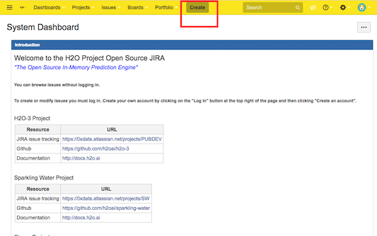
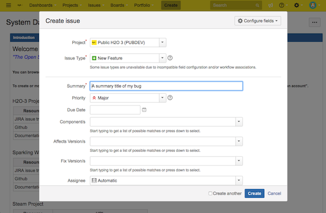
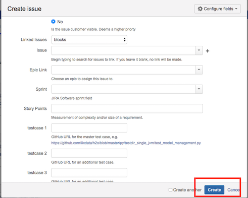

Contributing to H2O
============================

H2O is an open source project released under the Apache Software Licence v2.  Open Source projects live by their user and developer communities.  We welcome and encourage your contributions of any kind!

There are many different kinds of people who make use of H2O for their daily work: 

* Data Scientists who use R, Python, Scala, Java or the Flow web interface;
* Application Software Developers who build software to drive H2O from those languages or the REST API;
* Machine Learning and data munging developers, who want to extend the internal capabilities of H2O.

No matter what your skill set or level of engagement is with H2O you can help others by improving the ecosystem of documentation, bug report and feature request tickets, and code.

## Bug Reports and Feature Requests

The single most important contribution that you can make is to report bugs and make feature requests.  The development work on H2O is largely driven by these, so please make your voice heard!  

Bug reports are most helpful if you send us a script which reproduces the problem.

If you're a customer with an Enterprise Support contract you should send these to support@h2o.ai.

If you're an Open Source community member you should send these to one of:

* The h2ostream mailing list, at: [https://groups.google.com/forum/#!forum/h2ostream](https://groups.google.com/forum/#!forum/h2ostream)
* Gitter chat, at [https://gitter.im/h2oai/h2o-3](https://gitter.im/h2oai/h2o-3)

### How to File Bugs and Feature Requests

You can file a bug report or feature request directly in the H2O-3 JIRA tracking system at [https://0xdata.atlassian.net/projects/PUBDEV](https://0xdata.atlassian.net/projects/PUBDEV). Anyone can create a JIRA ticket as long as you create a JIRA account using your email address.  

Log in to the [H2O JIRA tracking system](https://0xdata.atlassian.net/projects/PUBDEV). (Create an account if necessary.)

Once inside the home page, click the **Create** button.

 

A form will display allowing you to enter information about the bug or feature request.

 

* Select the Project that you want to file the issue under. For example, if this is an open source public bug, you should file it under **Public H2O 3 (PUBDEV)**.
* Specify the Issue Type. For example, if you believe you've found a bug, then select **Bug**, or if you want to request a new feature, then select **New Feature**.
* Provide a short but concise summar about the issue. The summary will be shown when engineers organize, filter, and search for Jira tickets.
* Specify the urgency of the issue using the Priority dropdown menu. 
* If there is a due date specify it with the Due Date.
* The Components drop down refers to the API or language that the issue relates to. (See the drop down menu for available options.)
* You can leave Affects Version/s, Fix Version\s, and Assignee fields blank. Our engineering team will fill this in.
* Add a detailed description of your bug in the Description section. Best practice for descriptions include:

  	* A summary of what the issue is
  	* What you think is causing the issue
  	* Reproducible code that can be run end to end without requiring an engineer to edit your code. Use {code} {code} around your code to make it appear in code format.
  	* Any scripts or necessary documents. Add by dragging and dropping your files into the create issue dialogue box.

* You can be able to leave the rest of the ticket blank.

When you are done with your ticket, simply click on the **Create** button at the bottom of the page.

 

After you click **Create**, a pop up will appear on the right side of your screen with a link to your Jira ticket. It will have the form https://0xdata.atlassian.net/browse/PUBDEV-####. You can use this link to later edit your ticket. 

Please note that your Jira ticket number along with its summary will appear in one of the Jira ticket slack channels, and anytime you update the ticket anyone associated with that ticket, whether as the assignee or a watcher will receive an email with your changes.

### How to Vote for or Comment on JIRA Issues

You can also vote for or comment on existing bugs and feature requests that are already in the H2O-3 JIRA. To vote for a JIRA issue, log in the the H2O JIRA tracking system (create an account if necessary), find or create the issue that you want to vote for, then click the **Vote for this issue** link (upper right portion of the issue). Voting can help H2O prioritize the features that are included in each release. 

>***Note***: JIRA issues for customers with Enterprise Support contracts go into a private project so that customer information is kept secure. Contact support@h2o.ai for more information.

## Help and Documentation

You can help others directly and help improve the resources that others read to learn and use H2O by contributing to the formal documentation or the forums.

There are several places that users find information about using H2O:

* Formal documentation, at: [http://docs.h2o.ai/](http://docs.h2o.ai/)
* The h2ostream mailing list, at: [https://groups.google.com/forum/#!forum/h2ostream](https://groups.google.com/forum/#!forum/h2ostream)
* Gitter chat, at [https://gitter.im/h2oai/h2o-3](https://gitter.im/h2oai/h2o-3)
* General community sites like Stack Overflow: [http://stackoverflow.com/search?q=h2o](http://stackoverflow.com/search?q=h2o)
* Individuals' blogs

### Formal Documentation

All of the documentation comes directly from the source tree in GitHub.  To contribute improvements to the formal documentation you may either:

* Send the suggestions or changes to support@h2o.ai, h2ostream or Gitter, or
* Use Git to make the changes yourself and submit them via a pull request (see below for details)

### Forums

Answering questions for other users on h2ostream, Gitter, Stack Overflow and other forums builds the community knowledge base and is a very valuable contribution to H2O.

### Blogs

Some of the most interesting written materials on the use of H2O for real world problems has been published by community members to their personal blogs.  If you've written something about H2O that you think should be more widely known contact us on h2ostream or Gitter and we will help you get the word out.

## Tests and Demos

The H2O code base contains tests and demos written in R, Python, Java, Scala and Flow.  These get run as part of every build of the software, either by `gradlew build` on the development machine, or by Jenkins.  Standalone demos are conformed into xUnit tests as part of the build process.  All tests must succeed before we release a stable build.

If you are able to you should clone the H2O git repository, add your test case(s) there, and submit a pull request (see below).  If not, please send your code to h2ostream, Gitter or support@h2o.ai; see above for the links.

Test directories include:

* user-level tests in R: `h2o-r/tests/`
* user-level tests in Python: `h2o-py/tests/`
* REST API tests in Python: `py/testdir_multi_jvm/`
* platform tests in Java: `h2o-core/src/test/java/`
* algorithm tests in Java: `h2o-algos/src/test/java/`
* Flow tests in saved notebooks: `h2o-docs/src/product/flow/packs`

For Scala tests see the Sparkling Water GitHub repo.

## Contribute Code!

You can contribute R, Python, Java or Scala code for H2O, either for bug fixes or new features.  If you have your own idea about what to work on a good place to begin is to discuss it with us on [Gitter](https://gitter.im/h2oai/h2o-3) so that we can help point you in the right direction.

For ideas about what to work on see the H2O-3 [JIRA ticket system](https://0xdata.atlassian.net/projects/PUBDEV).

To contribute code, fork the H2O-3 GitHub repo, create a branch for your work and when you're done, create a pull request.  Once a PR has been created, it will trigger the H2O-3 Jenkins test system and should start automatically running tests (this will show up in the comment history on the PR).  Make sure all the tests pass.  A few notes:

* If there's not already a JIRA ticket associated with this task, please create one.
* If there is a JIRA ticket associated with your changes, choose a branch name that includes that JIRA number.  e.g. `PUBDEV-1234_new_pca`
* New code must come with unit tests.  Here are some examples of [runits](https://github.com/h2oai/h2o-3/tree/master/h2o-r/tests), [pyunits](https://github.com/h2oai/h2o-3/tree/master/h2o-py/tests) and [junits](https://github.com/h2oai/h2o-3/tree/master/h2o-algos/src/test/java/hex) to help get you started.
* Use the JIRA number in the PR title.  e.g. "PUBDEV-1234: Added new `pca_method` option in the PCA algorithm".
* Write a summary of all changes & additions to the code in the PR description and add a link to the JIRA.
