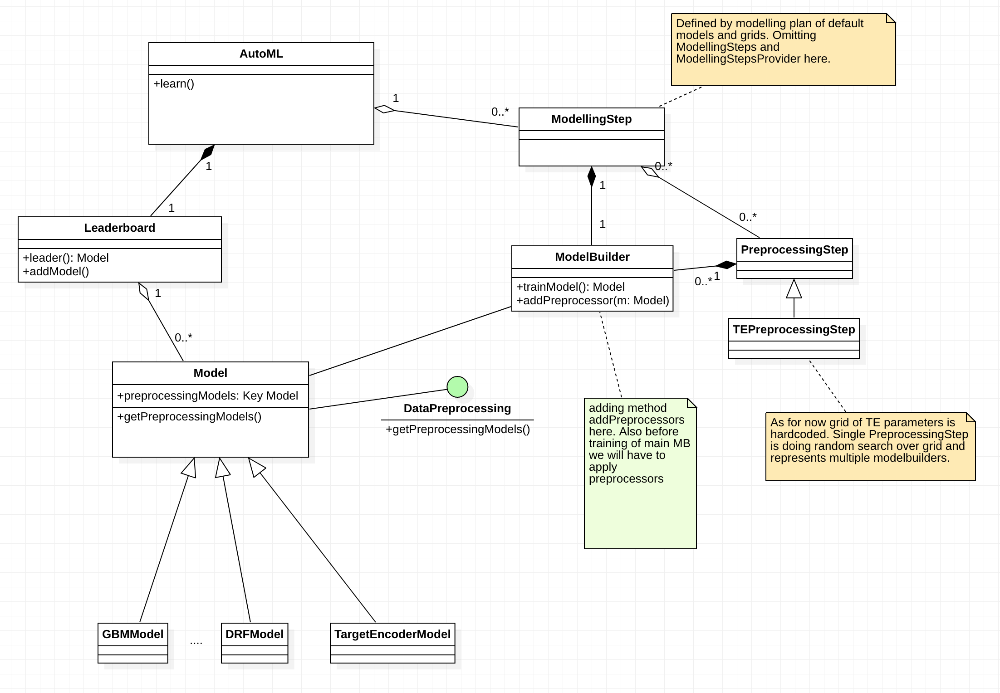

### Goal
Provide a way to support feature preprocessing within AutoML pipeline.

### Agenda

Currently AutoML supports some feature preprocessing abilities( actually only through models itself) but they are by their nature a simple ones in a sense that they are non-parametric. For data preprocessors that

-  should be trained
-  have hyper parameters we should search for, given a particular predictive model

we need a way to keep this meta-information so that models could be used for scoring on yet unseen test data.

### Research for existing tools / sources of inspiration
After an investigation I have come to a conclusion that there is no such a thing on the project that could fully satisfy our needs. But there are some similar solutions that could be used as a source of inspiration.

1. On the mojo side we have MojoPipeline which probably could be seen as what we need but on non-production Model side
2. StackedEnsemble builder / StackedEnsembleModel - operates with multiple submodels as well. It is not the point here but I found it interesting to compare PipelineModel and SE :

   - with stacking we only working with `prediction` columns of submodels whereas in pipeline we don't know what are outputs of the submodels ( we I believe don't have yet functionality for specifiying output colums of the models like in Spark ML). So we need to think here how to prevent conflicts, how to manage ignored columns and so on.
   - (in case of stacking) all models, including StackedEnsemble, are solving same problem whether it is binary, multiclass classification or regression etc. In case of pipeline model, preprocessing models could be quite different and require different representation of the original data. I'm being optimistic here and hope that this is a rare scenario and that it will be managable anyway
   - as a first version we can only allow preprocessing models to use features from oringinal training frame but ideally, especially when we search for hyper parameters of our preprocessors, we would want to be able to use newly produced columns from previous preprocessors as we go along the sequense of preprocessors. And actually order of traversing this seq of preprocessors would matter.
3. GenericModel. Is it supposed to work only with Mojo models and is not supposed to provide any information of the original models. So it is not what we need for inspiration.

### Approaches to consider
(1) *PipelineModel approach*

Similar to MojoPipelineBuilder we can have PipelineModelBuilder. It will have ability to add main model that is supposed to perform final scoring and also an ability to add preprocessing models ( keys to those trained models).

We will also at some point need something like `MappingSpec` that we already have on mojo side, to be able to specify generated by preprocessors column names. But ideally we should have an ability to specify output columns for all our models in the first place, to avoid renaming in PipelineModel and to avoid dependencies on current naming conventions of existing preprocessors ( e.g. TE adds "_te" suffix for encoded columns)

PipelineModel model could be seen as a proxy to a main scoring model. Even name on leaderboard should reflect this fact - keep original name of model (maybe just add suffix "_pipeline" that signifies that preprocessing was used).

#### Pros:
-  will contribute to a simmetry between native and mojo/production aspects of the codebase. In production we use MojoPipeline to fullfil corresponding task
- will probably provide better isolation in terms of how many classes we will have to "touch" or affect
- as pipeline is a separate concept it will be a place for doing pipeline related logic, e.g. how sequence of the preprocessing models is going to be applied, how data flows from preprocessor to preprocessor( input and outputs). I believe that this functionality is not Model specific and could/should be abstracted out.

#### Cons:
- wrapping original main model into PipelineModel will hide its functionality. It can be mitigated by introducing ProxyModel interface with `getMainModel` method that will provide main model to the user. Though, for the clients (theoretically) PipelineModel could be flattenned automatically. Complexity of doing this  depends on how flexible we are with serialisation at rest api layer.

(2) *Integration preprocessing functionality into a Model class*

We can probably have two sub-approaches here:
- when we have PipelineModelBuilder and during training it collapses into main model without any wrapper around it
- when we extend functionality of ModelBuilder by adding ability to have references to proprocessing models

Not sure which approach is better but probably we can avoid introduction of the PipelineModelBuilder class. But it will increase number of responsibilities of the ModelBuilder class.

#### Pros:
- We do not hide any functionality behind PipelineModel wrapper
- All models could be equally seen as pipelines ( which could also be a cons.)

#### Cons:
- conceptually abusing notion of the Model. Model ( what is also known as Transformer in other frameworks) is supposed to be only trained on data and after that be able to transform similar data. Nothing about data preprocessing is expected here. See Concerns section for more details.
- new functionality will be exposed not only to AutoML scope. All algos will be "aware" about data preprocessing from now on. With first approach we would just add notion of ability to be a Proxy model and not all the models will have to realise this interface. Though, absense of the preprocessing models could be seen as "no-impact" on Model, still from code perspective there will a bigger impact. Hopefully preprocessing functionality will be generic enough without depenedencies on a particular types of the models.
- increased number of responsibilities of the ModelBuilder and Model, which could be otherwise be located in other classes.

#### General concerns:
Wanted one more time to draw our attention to the fact how we handle cornerstone abstractions in our project. And let's say we are not going to use Pipelines.

For comparison I will be using SparkML framework:

ref. https://www.youtube.com/watch?v=jEyahxFp3ak

Model is being overflowed with responsibilities imho. Transformation logic is being spread over many places in different forms.

### Summary
- we tend to keep adding functionality into Model class. We might be going to add pipeline related aspect into Model
- lack of symmetry between production and non-production code ( Model vs MojoPipeline )
- both approaches can solve the problem. Second approach will be smoother from user's perspective at least in Java API as there will be no need to pull out main model. For clients I think we can flatten representation automatically.
- Some functionality that could be represented via existing approach of Models(transformer) is hardcoded. Lack of consistency. ( not too much related to a current task)

Given current state of h2o-3's design and given we are ready to put responsibility of data preprocessing onto a Model class I think that second approach should be fine.
But ideally I would want to see
 - a PipelineModel related classes to be responsible for pipelining/data preprocessing
 - and hardcoded transformations to be represented as models. ( not too much related to a current task)

### Other approaches to consider ???

### Questions

