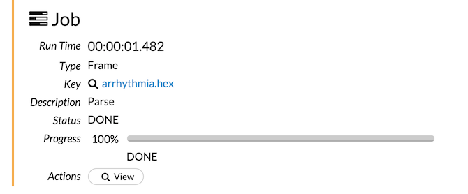

# H2O 3 REST API Overview

## Why?
When we look to using H2O in a production environment there are two major aspects to consider: model training, and model deployment (aka predictions).

### Model Training
Model training is the set of steps you use to load your training and optional validation data into H2O, prepare it, and train one or more models.  You will generally do this in Flow, Python, R, Scala or Java.

If you've done this work in Flow, *or* if you want to drive the workflow from another application (e.g., a data collection pipeline), you can use the REST API to automate these steps.

### Predictions
There are two ways to use the models you've trained in H2O to generate new predictions:

 - by exporting your model as a POJO (Plain Old Java object) and incorporating it into a JVM-based application, or
 - by using the REST API to call a model which is loaded into a running H2O instance.
 
In general, if you are able to use a POJO it is the better choice because it doesn't depend on running H2O at prediction time.  However if you don't have a JVM-based application to integrate with, or if you want to generate predictions during the model training workflow in order to evaluate your models, you may wish to use the REST API for predictions.


## What?
The H2O REST API allows you to access all the capabilities of H2O from an external program or script, via JSON over HTTP.  

The REST API is used by the Flow UI, as well as both the R and Python bindings: everything that you can do with those clients can be done by using the REST API, including data import, model building and generating predictions.

You can call the REST API:

 - from your browser 
 - using browser tools such as *Postman* in Chrome
 - using *curl*
 - using the language of your choice

Generated payload POJOs for Java are available as part of the release in a separate bindings Jar file and are simple to generate for other languages if desired.

## Reference Documentation
Reference documentation for the REST API is available in the Help sidebar in Flow, as well as on the H2O.ai website, [http://docs.h2o.ai/](http://docs.h2o.ai/).  The reference documentation is all generated from the H2O server via the Metadata facilities described below so  it is always up to date.

## Versioning and Stability
Both the endpoints and the payloads for the REST API are versioned for stability; the current stable version for both is 3.  Versions will be supported for some time after a new major version is released to provide time to upgrade your clients.

In general you will want to write to a specific version, such as 3, and upgrade shortly after a new major version is released.  Once we release a new major version of the REST API most new features will be added only to the new version.

### Non-breaking changes

We continue to add features to the APIs, but we only allow *non-breaking changes* in a published API such as version 3.  Breaking changes force a new major version number.

A non-breaking change will not change the behavior of a well-written client.  Examples of non-breaking changes are:

* adding additional output fields to a response  
* adding a parameter with a default value that maintains the old behavior if the parameter is omitted

We test backward compatibility by running a full set of tests against each new release (including nightlies) using old releases of the Flow, R, and Python clients.

### The EXPERIMENTAL version

Features that are under development and are not yet stable use version 99, which indicates that they may change between releases.  Once those features become stable, we change the version from 99 to the current stable version.

For request URLs, you may use EXPERIMENTAL as the version number to make it clear in your client code that you are making requests to an experimental endpoint:

`GET http://127.0.0.1:54321/EXPERIMENTAL/Sample`

## URLs

Your H2O cluster is typically referenced by the host name and HTTP port of the first server in the cluster.  By default this is *http://localhost:54321* (or *https://localhost:54321*, if you have an enterprise license).  Append the endpoint request URI to this to form your request URL.

H2O REST API URIs begin with a version followed by a resource type, such as */3/Frames* or */3/Models* or */3/Cloud*.  Typically a GET to this kind of resource collection URI will return all the instances of the resource type.

All endpoints that deal with a resource type will begin with the same prefix.  As an example, *GET /3/Frames* returns the list of all *Frames*, while *GET /3/Frames/my\_frame* returns the *Frame*  named *my\_frame*.

## HTTP Verbs
As is standard for REST APIs, the HTTP verbs GET, HEAD, POST and DELETE are used to interact with the resources in the server.

- **GET** requests fetch data and do not cause side effects.  All parameters for the request are contained within the URL, either within the path (e.g., /3/Frames/*my\_frame\_name*/*a\_column\_name*) or as query parameters (e.g., /3/Frames/my\_frame\_name*?row\_offset=10000&row\_count=1000*)

- **HEAD** requests return just the HTTP status for accessing the resource.

- **POST** requests create a new object within the H2O cluster.  Examples are importing or parsing a file into a Frame or training a new Model.  Some parameters may be given in the URL, but most are given using a request *schema*.  The fields of the request schema are sent in the POST body using *x-www-form-urlencoded* format, like an HTML form.  More on this below in the **Formats** secion.

  A future version of H2O will move to using *application/json*.

- **DELETE** requests delete an object, generally from the distributed object store.

- **PUT** is used for requests that modify objects; it is not used yet.

## HTTP Status Codes
H2O uses standard HTTP status codes for all its responses.  Refer to [Wikipedia](https://en.wikipedia.org/wiki/List_of_HTTP_status_codes) for more information on their meanings.

The status codes currently used by H2O are:

* **200 OK** (all is well)
* **400 Bad Request** (the request URL is bad)
* **404 Not Found** (a specified object was not found)
* **412 Precondition Failed** (bad parameters or other problem handling the request)
* **500 Internal Server Error** (unanticipated failure occurred in the server)

## Formats
The payloads for each endpoint are implemented as versioned *schemas*.  These schemas are self-describing for simplicity and ease of implementation, especially if you persist them for later.

### Schemas

Schemas specify all the relevant properties of each field of an input or response including name, type, default value, help string, direction (*in, out* or *inout*), whether or not input fields are required and how important they are to specify, allowed values for enumerated fields, and so on.  Schema fields can be simple values or nested schemas, or arrays or dictionaries (maps) of these.

This example shows the *model_id* field returned by a model builder call:

            "parameters": [
                {
                    "__meta": {
                        "schema_name": "ModelParameterSchemaV3",
                        "schema_type": "Iced",
                        "schema_version": 3
                    },
                    "actual_value": {
                        "URL": "/3/Models/prostate_glm",
                        "__meta": {
                            "schema_name": "ModelKeyV3",
                            "schema_type": "Key<Model>",
                            "schema_version": 3
                        },
                        "name": "prostate_glm",
                        "type": "Key<Model>"
                    },
                    "default_value": null,
                    "help": "Destination id for this model; auto-generated if not specified",
                    "level": "critical",
                    "name": "model_id",
                    "required": false,
                    "type": "Key<Model>",
                    "values": []
                },
                ...
            ],
            ...
### POST bodies
The fields of the request schema are sent in the POST body using *x-www-form-urlencoded* format, like an HTML form.  A future version of H2O will move to using *application/json*.  In the meantime, complex fields such as arrays are POSTed in the same format they would be in the JSON.  For example, an array of ints might be posted in a field as [1, 10, 100].  Note the array of strings for the *ignored_columns* parameter in this GLM model builder POST body:

    model_id=prostate_glm&training_frame=prostate.hex&nfolds=0&response_column=CAPSULE&ignored_columns=%5B%22%22%5D&ignore_const_cols=true&family=binomial&solver=AUTO&alpha=&lambda=&lambda_search=false&standardize=true&non_negative=false&score_each_iteration=false&max_iterations=-1&link=family_default&intercept=true&objective_epsilon=0.00001&beta_epsilon=0.0001&gradient_epsilon=0.0001&prior=-1&max_active_predictors=-1

The value is ["ID"], urlencoded as %5B%22ID%22%5D.

### Metadata
The formats of all payloads (*schemas*) are available dynamically from the server using the */Metadata/schemas* endpoints. You can fetch additional metadata for model builder (model algorithm) parameters from the */ModelBuilders* endpoints.  This metadata allows you to write a client that automatically adapts to new fields.  

As an example, Flow has no hardwired knowledge of any of the model algos.  It discovers the list of algos and  their parameter information dynamically.  This means that if you extend H2O with new algorithms or new fields for the built-in algorithms Flow will Just Work (tm).

Similarly, all the endpoints (URL patterns) are described dynamically by the */Metadata/endpoints* endpoints.

## Error Condition Payloads
All errors return one of the non-2xx HTTP status codes mentioned above and return standardized error payloads.  These contain an end-user-directed message, a developer-oriented message, the HTTP status, an optional dictionary of relevant values, and exception information if applicable.

Here is the result of requesting a Frame that is not present in the server: 

`GET http://127.0.0.1:54321/3/Frames/missing_frame`

            {
                "__meta": {
                    "schema_version": 3,
                    "schema_name": "H2OErrorV3",
                    "schema_type": "H2OError"
                },
                "timestamp": 1438634936808,
                "error_url": "/3/Frames/missing_frame",
                "msg": "Object 'missing_frame' not found for argument: key",
                "dev_msg": "Object 'missing_frame' not found for argument: key",
                "http_status": 404,
                "values": {
                    "argument": "key",
                    "name": "missing_frame"
                },
                "exception_type": "water.exceptions.H2OKeyNotFoundArgumentException",
                "exception_msg": "Object 'missing_frame' not found for argument: key",
                "stacktrace": [
                    "water.api.FramesHandler.getFromDKV(FramesHandler.java:154)",
                    "water.api.FramesHandler.doFetch(FramesHandler.java:239)",
                    "water.api.FramesHandler.fetch(FramesHandler.java:225)",
                    ...

## Control query parameters
H2O also supports "meta" query parameters to control the result payload.  Currently the only one is *exclude_fields*, but more will be supported in subsequent releases.

### exclude_fields
The result payload of some calls can get quite large.  For example, a Frame or a Model built with a Frame that has 5,000 categorical columns may have a very large list of *domains*, or categorical levels.  

If you don't require the server to return certain fields you can use the *exclude_fields* query parameter to exclude them.  This reduces the size of the result, sometimes considerably, which speeds up JSON parsing in the client and reduces the chance that limited memory clients such as web browsers will run out of memory while processing the result.

The *exclude_fields* parameter accepts a comma-separated list of field names.  Nested field names are separated by slashes.

As an example, one call of Flow to /Frames/{frame_id} uses this query parameter:

    exclude_fields=frames/vec_ids,frames/columns/data,frames/columns/domain,frames/columns/histogram_bins,frames/columns/percentiles

## Example Endpoints
This section lists a few endpoints to give you an idea of the functions that are available through the REST API.  The reference documentation contains the full list.

Remember, Flow and the R and Python bindings access H2O only through the REST API, so if you find functionality in those clients, you'll find it in the REST API as well.  The only caveat is data munging (e.g., slicing, creating new columns, etc); that functionality is available through the /99/Rapids endpoint, which is under rapid change (pun intended).  Contact us if you need to access those functions through the REST API.

### Loading and parsing data files
    GET /3/ImportFiles
    Import raw data files into a single-column H2O Frame.

    POST /3/ParseSetup
    Guess the parameters for parsing raw byte-oriented data into an H2O Frame.

    POST /3/Parse
    Parse a raw byte-oriented Frame into a useful columnar data Frame.

### Frames

    GET /3/Frames
    Return all Frames in the H2O distributed K/V store.
    
    GET /3/Frames/(?.*)
    Return the specified Frame.

    GET /3/Frames/(?.*)/summary
    Return a Frame, including the histograms, after forcing computation of rollups.

    GET /3/Frames/(?.*)/columns/(?.*)/summary
    Return the summary metrics for a column, e.g. mins, maxes, mean, sigma, percentiles, etc.

    DELETE /3/Frames/(?.*)
    Delete the specified Frame from the H2O distributed K/V store.

    DELETE /3/Frames
    Delete all Frames from the H2O distributed K/V store.

### Building models

    GET /3/ModelBuilders
    Return the Model Builder metadata for all available algorithms.

    GET /3/ModelBuilders/(?.*)
    Return the Model Builder metadata for the specified algorithm.

    POST /3/ModelBuilders/deeplearning/parameters
    Validate a set of Deep Learning model builder parameters.

    POST /3/ModelBuilders/deeplearning
    Train a Deep Learning model on the specified Frame.

    POST /3/ModelBuilders/glm/parameters
    Validate a set of GLM model builder parameters.

    POST /3/ModelBuilders/glm
    Train a GLM model on the specified Frame.

    ...
### Accessing and using models

    GET /3/Models
    Return all Models from the H2O distributed K/V store.

    GET /3/Models/(?.*?)(\.java)?
    Return the specified Model from the H2O distributed K/V store, optionally with the list of compatible Frames.  Using the .java extension will return the Java POJO.

    POST /3/Predictions/models/(?.*)/frames/(?.*)
    Score (generate predictions) for the specified Frame with the specified Model. Both the Frame of predictions and the metrics will be returned.

    DELETE /3/Models/(?.*)
    Delete the specified Model from the H2O distributed K/V store.

    DELETE /3/Models
    Delete all Models from the H2O distributed K/V store.

### Administrative and utility

    GET /3/About
    Return information about this H2O cluster.

    GET /3/Cloud
    Determine the status of the nodes in the H2O cloud.

    HEAD /3/Cloud
    Determine the status of the nodes in the H2O cloud.


### Job management and polling

    GET /3/Jobs
    Get a list of all the H2O Jobs (long-running actions).
    
    GET /3/Jobs/(?.*)
    Get the status of the given H2O Job (long-running action).

    POST /3/Jobs/(?.*)/cancel
    Cancel a running job.
    
### Persistence

    POST /3/Frames/(?.*)/export
    Export a Frame to the given path with optional overwrite.
    
    POST /99/Models.bin/(?.*)
    Import given binary model into H2O.

    GET /99/Models.bin/(?.*)
    Export given model.

## GBM_Example.flow
This section reproduces the Flow example *GBM_Example.flow* using three languages:

 * *Coffeescript* (Flow's control language), 
 * *curl*, and 
 * *Java* (making REST API calls from an external Java program).

The Java code uses the bindings found in H2O's *h2o-bindings.jar*, which use the *Retrofit* REST API library from Square: [http://square.github.io/retrofit/](http://square.github.io/retrofit/).  

If you use Java / Retrofit you'll get the results back from the server as Java objects.  For brevity these are not shown here.  

The source files for the payload schemas and for the endpoint proxies are documented with help text for the fields and Javadoc for the methods, and the default constructors set each field to its default value.  Each payload schema class includes a *toString()* method to ease debugging.

If you have downloaded H2O as a zip file you'll find the Java Retrofit bindings in *bindings/java/h2o-bindings-{version}.jar* and the sources in *bindings/java/h2o-bindings-sources.jar*.  If you have built H2O from source you'll find them in *h2o-bindings/build/libs/h2o-bindings.jar* and the sources in *h2o-bindings/build/src-gen/main/java/water/bindings/*.

### GBM_Example.flow, Step 1: Import
In Flow:

```coffeescript
importFiles ["http://s3.amazonaws.com/h2o-public-test-data/smalldata/flow_examples/arrhythmia.csv.gz"]
```
    
In curl:

```bash
curl -X GET http://127.0.0.1:54321/3/ImportFiles?path=http://s3.amazonaws.com/h2o-public-test-data/smalldata/flow_examples/arrhythmia.csv.gz
```

In Java / Retrofit:

```java
ImportFilesV3 importBody = 
importService.importFiles("http://s3.amazonaws.com/h2o-public-test-data/smalldata/flow_examples/arrhythmia.csv.gz", null).execute().body();
```

Result JSON:

```
{
    "__meta": {
        "schema_name": "ImportFilesV3",
        "schema_type": "Iced",
        "schema_version": 3
    },
    "_exclude_fields": "",
    "dels": [],
    "destination_frames": [
        "http://s3.amazonaws.com/h2o-public-test-data/smalldata/flow_examples/arrhythmia.csv.gz"
    ],
    "fails": [],
    "files": [
        "http://s3.amazonaws.com/h2o-public-test-data/smalldata/flow_examples/arrhythmia.csv.gz"
    ],
    "path": "http://s3.amazonaws.com/h2o-public-test-data/smalldata/flow_examples/arrhythmia.csv.gz"
}

```

### GBM_Example.flow, Step 2: ParseSetup

In Flow:

```coffeescript
setupParse paths: ["http://s3.amazonaws.com/h2o-public-test-data/smalldata/flow_examples/arrhythmia.csv.gz"]
```

In curl:

```bash
curl -X POST http://127.0.0.1:54321/3/ParseSetup --data 'source_frames=["http://s3.amazonaws.com/h2o-public-test-data/smalldata/flow_examples/arrhythmia.csv.gz"]'
```

In Java / Retrofit:

```java
ParseSetupV3 parseSetupBody = 
parseSetupService.guessSetup(importBody.destination_frames, ParserParserType.GUESS, (byte)',', false, -1, null, null, null, null, 0, 0, 0, null).execute().body();
```


### GBM_Example.flow, Step 2 Result

```javascript
{
  "__meta": {
    "schema_version": 3,
    "schema_name": "ParseSetupV3",
    "schema_type": "ParseSetup"
  },
  "_exclude_fields": "",
  "source_frames": [
    {
      "__meta": {
        "schema_version": 3,
        "schema_name": "FrameKeyV3",
        "schema_type": "Key<Frame>"
      },
      "name": "http:\/\/s3.amazonaws.com\/h2o-public-test-data\/smalldata\/flow_examples\/arrhythmia.csv.gz",
      "type": "Key<Frame>",
      "URL": "\/3\/Frames\/http:\/\/s3.amazonaws.com\/h2o-public-test-data\/smalldata\/flow_examples\/arrhythmia.csv.gz"
    }
  ],
  "parse_type": "CSV",
  "separator": 44,
  "single_quotes": false,
  "check_header": -1,
  "column_names": null,
  "column_types": [
    "Numeric",
    ...
  ],
  "na_strings": null,
  "column_name_filter": null,
  "column_offset": 0,
  "column_count": 0,
  "destination_frame": "arrhythmia.hex",
  "header_lines": 0,
  "number_columns": 280,
  "data": [
    [
      "75",
      "0",
      "190",
      ...
   ]
   ...
  ],
  "chunk_size": 4194304,
  "total_filtered_column_count": 280
}
```

### GBM_Example.flow, Step 3: Parse

In Flow:

```coffeescript
parseFiles
  paths: ["http://s3.amazonaws.com/h2o-public-test-data/smalldata/flow_examples/arrhythmia.csv.gz"]
  destination_frame: "arrhythmia.hex"
  parse_type: "CSV"
  separator: 44
  number_columns: 280
  single_quotes: false
  column_names: null
  column_types: ["Numeric","Numeric","Numeric","Numeric","Numeric","Numeric","Numeric","Numeric","Numeric","Numeric","Numeric","Numeric","Numeric","Numeric","Numeric","Numeric","Numeric","Numeric","Numeric","Numeric","Numeric","Numeric","Numeric","Numeric","Numeric","Numeric","Numeric","Numeric","Numeric","Numeric","Numeric","Numeric","Numeric","Numeric","Numeric","Numeric","Numeric","Numeric","Numeric","Numeric","Numeric","Numeric","Numeric","Numeric","Numeric","Numeric","Numeric","Numeric","Numeric","Numeric","Numeric","Numeric","Numeric","Numeric","Numeric","Numeric","Numeric","Numeric","Numeric","Numeric","Numeric","Numeric","Numeric","Numeric","Numeric","Numeric","Numeric","Numeric","Numeric","Numeric","Numeric","Numeric","Numeric","Numeric","Numeric","Numeric","Numeric","Numeric","Numeric","Numeric","Numeric","Numeric","Numeric","Numeric","Numeric","Numeric","Numeric","Numeric","Numeric","Numeric","Numeric","Numeric","Numeric","Numeric","Numeric","Numeric","Numeric","Numeric","Numeric","Numeric","Numeric","Numeric","Numeric","Numeric","Numeric","Numeric","Numeric","Numeric","Numeric","Numeric","Numeric","Numeric","Numeric","Numeric","Numeric","Numeric","Numeric","Numeric","Numeric","Numeric","Numeric","Numeric","Numeric","Numeric","Numeric","Numeric","Numeric","Numeric","Numeric","Numeric","Numeric","Numeric","Numeric","Numeric","Numeric","Numeric","Numeric","Numeric","Numeric","Numeric","Numeric","Numeric","Numeric","Numeric","Numeric","Numeric","Numeric","Numeric","Numeric","Numeric","Numeric","Numeric","Numeric","Numeric","Numeric","Numeric","Numeric","Numeric","Numeric","Numeric","Numeric","Numeric","Numeric","Numeric","Numeric","Numeric","Numeric","Numeric","Numeric","Numeric","Numeric","Numeric","Numeric","Numeric","Numeric","Numeric","Numeric","Numeric","Numeric","Numeric","Numeric","Numeric","Numeric","Numeric","Numeric","Numeric","Numeric","Numeric","Numeric","Numeric","Numeric","Numeric","Numeric","Numeric","Numeric","Numeric","Numeric","Numeric","Numeric","Numeric","Numeric","Numeric","Numeric","Numeric","Numeric","Numeric","Numeric","Numeric","Numeric","Numeric","Numeric","Numeric","Numeric","Numeric","Numeric","Numeric","Numeric","Numeric","Numeric","Numeric","Numeric","Numeric","Numeric","Numeric","Numeric","Numeric","Numeric","Numeric","Numeric","Numeric","Numeric","Numeric","Numeric","Numeric","Numeric","Numeric","Numeric","Numeric","Numeric","Numeric","Numeric","Numeric","Numeric","Numeric","Numeric","Numeric","Numeric","Numeric","Numeric","Numeric","Numeric","Numeric","Numeric","Numeric","Numeric","Numeric","Numeric","Numeric","Numeric","Numeric","Numeric","Numeric","Numeric","Numeric","Numeric","Numeric","Numeric","Numeric","Numeric","Numeric","Numeric","Numeric","Numeric","Numeric","Numeric","Numeric","Numeric","Numeric","Numeric","Numeric"]
  delete_on_done: true
  check_header: -1
  chunk_size: 4194304
```

In curl:

```bash
curl -X POST http://127.0.0.1:54321/3/Parse --data 'destination_frame=arrhythmia.hex&source_frames=["http://s3.amazonaws.com/h2o-public-test-data/smalldata/flow_examples/arrhythmia.csv.gz"]&parse_type=CSV&separator=44&number_columns=280&single_quotes=false&column_names=&column_types=["Numeric","Numeric","Numeric","Numeric","Numeric","Numeric","Numeric","Numeric","Numeric","Numeric","Numeric","Numeric","Numeric","Numeric","Numeric","Numeric","Numeric","Numeric","Numeric","Numeric","Numeric","Numeric","Numeric","Numeric","Numeric","Numeric","Numeric","Numeric","Numeric","Numeric","Numeric","Numeric","Numeric","Numeric","Numeric","Numeric","Numeric","Numeric","Numeric","Numeric","Numeric","Numeric","Numeric","Numeric","Numeric","Numeric","Numeric","Numeric","Numeric","Numeric","Numeric","Numeric","Numeric","Numeric","Numeric","Numeric","Numeric","Numeric","Numeric","Numeric","Numeric","Numeric","Numeric","Numeric","Numeric","Numeric","Numeric","Numeric","Numeric","Numeric","Numeric","Numeric","Numeric","Numeric","Numeric","Numeric","Numeric","Numeric","Numeric","Numeric","Numeric","Numeric","Numeric","Numeric","Numeric","Numeric","Numeric","Numeric","Numeric","Numeric","Numeric","Numeric","Numeric","Numeric","Numeric","Numeric","Numeric","Numeric","Numeric","Numeric","Numeric","Numeric","Numeric","Numeric","Numeric","Numeric","Numeric","Numeric","Numeric","Numeric","Numeric","Numeric","Numeric","Numeric","Numeric","Numeric","Numeric","Numeric","Numeric","Numeric","Numeric","Numeric","Numeric","Numeric","Numeric","Numeric","Numeric","Numeric","Numeric","Numeric","Numeric","Numeric","Numeric","Numeric","Numeric","Numeric","Numeric","Numeric","Numeric","Numeric","Numeric","Numeric","Numeric","Numeric","Numeric","Numeric","Numeric","Numeric","Numeric","Numeric","Numeric","Numeric","Numeric","Numeric","Numeric","Numeric","Numeric","Numeric","Numeric","Numeric","Numeric","Numeric","Numeric","Numeric","Numeric","Numeric","Numeric","Numeric","Numeric","Numeric","Numeric","Numeric","Numeric","Numeric","Numeric","Numeric","Numeric","Numeric","Numeric","Numeric","Numeric","Numeric","Numeric","Numeric","Numeric","Numeric","Numeric","Numeric","Numeric","Numeric","Numeric","Numeric","Numeric","Numeric","Numeric","Numeric","Numeric","Numeric","Numeric","Numeric","Numeric","Numeric","Numeric","Numeric","Numeric","Numeric","Numeric","Numeric","Numeric","Numeric","Numeric","Numeric","Numeric","Numeric","Numeric","Numeric","Numeric","Numeric","Numeric","Numeric","Numeric","Numeric","Numeric","Numeric","Numeric","Numeric","Numeric","Numeric","Numeric","Numeric","Numeric","Numeric","Numeric","Numeric","Numeric","Numeric","Numeric","Numeric","Numeric","Numeric","Numeric","Numeric","Numeric","Numeric","Numeric","Numeric","Numeric","Numeric","Numeric","Numeric","Numeric","Numeric","Numeric","Numeric","Numeric","Numeric","Numeric","Numeric","Numeric","Numeric","Numeric","Numeric","Numeric","Numeric","Numeric","Numeric","Numeric","Numeric","Numeric","Numeric","Numeric","Numeric","Numeric","Numeric","Numeric","Numeric","Numeric","Numeric","Numeric","Numeric"]&check_header=-1&delete_on_done=true&chunk_size=4194304'

```

In Java / Retrofit:

```java
List<String> source_frames = new ArrayList<>();
for (FrameKeyV3 frame : parseSetupBody.source_frames)
  source_frames.add(frame.name);

ParseV3 parseBody = parseService.parse("arrhythmia.hex",
   source_frames.toArray(new String[0]),
   parseSetupBody.parse_type,
   parseSetupBody.separator,
   parseSetupBody.single_quotes,
   parseSetupBody.check_header,
   parseSetupBody.number_columns,
   parseSetupBody.column_names,
   parseSetupBody.column_types,
   null, // domains
   parseSetupBody.na_strings,
   parseSetupBody.chunk_size,
   true,
   true,
   null).execute().body();
```


### GBM_Example.flow, Step 3 Result

```javascript
{
  "__meta": {
    "schema_version": 3,
    "schema_name": "ParseV3",
    "schema_type": "Iced"
  },
  "_exclude_fields": "",
  "destination_frame": {
    "__meta": {
      "schema_version": 3,
      "schema_name": "FrameKeyV3",
      "schema_type": "Key<Frame>"
    },
    "name": "arrhythmia.hex",
    "type": "Key<Frame>",
    "URL": "\/3\/Frames\/arrhythmia.hex"
  },
  "source_frames": [
    {
      "__meta": {
        "schema_version": 3,
        "schema_name": "FrameKeyV3",
        "schema_type": "Key<Frame>"
      },
      "name": "http:\/\/s3.amazonaws.com\/h2o-public-test-data\/smalldata\/flow_examples\/arrhythmia.csv.gz",
      "type": "Key<Frame>",
      "URL": "\/3\/Frames\/http:\/\/s3.amazonaws.com\/h2o-public-test-data\/smalldata\/flow_examples\/arrhythmia.csv.gz"
    }
  ],
  "parse_type": "CSV",
  "separator": 44,
  "single_quotes": false,
  "check_header": -1,
  "number_columns": 280,
  "column_names": null,
  "column_types": [
    "Numeric",
    "Numeric",
...
    "Numeric",
    "Numeric",
    "Numeric"
  ],
  "domains": null,
  "na_strings": null,
  "chunk_size": 4194304,
  "delete_on_done": true,
  "blocking": false,
  "remove_frame": false,
  "job": {
    "__meta": {
      "schema_version": 3,
      "schema_name": "JobV3",
      "schema_type": "Job"
    },
    "key": {
      "__meta": {
        "schema_version": 3,
        "schema_name": "JobKeyV3",
        "schema_type": "Key<Job>"
      },
      "name": "$03010a010a7f32d4ffffffff$_b98fc5bba38d21ea53da2a0834c44f7a",
      "type": "Key<Job>",
      "URL": "\/3\/Jobs\/$03010a010a7f32d4ffffffff$_b98fc5bba38d21ea53da2a0834c44f7a"
    },
    "description": "Parse",
    "status": "RUNNING",
    "progress": 0,
    "progress_msg": "Ingesting files.",
    "start_time": 1438888896402,
    "msec": 65,
    "dest": {
      "__meta": {
        "schema_version": 3,
        "schema_name": "FrameKeyV3",
        "schema_type": "Key<Frame>"
      },
      "name": "arrhythmia.hex",
      "type": "Key<Frame>",
      "URL": "\/3\/Frames\/arrhythmia.hex"
    },
    "exception": null,
    "messages": [
      
    ],
    "error_count": 0
  },
  "rows": 0,
  "vec_ids": null
}

```

### GBM_Example.flow, Step 4: Poll for job completion

Flow polls for Job completion automagically:





In curl:

```bash
curl -X GET 'http://127.0.0.1:54321/3/Jobs/%2403010a010a7f32d4ffffffff%24_b98fc5bba38d21ea53da2a0834c44f7a'
```

### GBM_Example.flow, Step 4: Result

```javascript
{
  "__meta": {
    "schema_version": 3,
    "schema_name": "JobsV3",
    "schema_type": "Iced"
  },
  "_exclude_fields": "",
  "job_id": {
    "URL": "\/3\/Jobs\/$03010a010a7f32d4ffffffff$_b98fc5bba38d21ea53da2a0834c44f7a"
  },
  "jobs": [
    {
      "__meta": {
        "schema_version": 3,
        "schema_name": "JobV3",
        "schema_type": "Job"
      },
      "key": {
        "__meta": {
          "schema_version": 3,
          "schema_name": "JobKeyV3",
          "schema_type": "Key<Job>"
        },
        "name": "$03010a010a7f32d4ffffffff$_b98fc5bba38d21ea53da2a0834c44f7a",
        "type": "Key<Job>",
        "URL": "\/3\/Jobs\/$03010a010a7f32d4ffffffff$_b98fc5bba38d21ea53da2a0834c44f7a"
      },
      "description": "Parse",
      "status": "RUNNING",
      "progress": 1,
      "progress_msg": "Ingesting files.",
      "start_time": 1438888896402,
      "msec": 267,
      "dest": {
        "__meta": {
          "schema_version": 3,
          "schema_name": "FrameKeyV3",
          "schema_type": "Key<Frame>"
        },
        "name": "arrhythmia.hex",
        "type": "Key<Frame>",
        "URL": "\/3\/Frames\/arrhythmia.hex"
      },
      "exception": null,
      "messages": [
        
      ],
      "error_count": 0
    }
  ]
}
```

### GBM_Example.flow, Step 5: Train the Model

In Flow:

```coffeescript
buildModel 'gbm', {"model_id":"gbm-51b9780b-70d0-40d0-9b5a-c723a3f358c1","training_frame":"arrhythmia.hex","score_each_iteration":false,"response_column":"C1","ntrees":"20","max_depth":5,"min_rows":"25","nbins":20,"learn_rate":"0.3","distribution":"AUTO","balance_classes":false,"max_confusion_matrix_size":20,"class_sampling_factors":[],"max_after_balance_size":5,"seed":0}
```

In curl:

```bash
curl -X POST http://127.0.0.1:54321/3/ModelBuilders/gbm --data 'model_id=gbm-51b9780b-70d0-40d0-9b5a-c723a3f358c1&training_frame=arrhythmia.hex&score_each_iteration=false&response_column=C1&ntrees=20&max_depth=5&min_rows=25&nbins=20&learn_rate=0.3&distribution=AUTO&balance_classes=false&max_confusion_matrix_size=20&class_sampling_factors=&max_after_balance_size=5&seed=0'
```

In Java / Retrofit:

```java
GBMParametersV3 gbm_parms = new GBMParametersV3();

FrameKeyV3 training_frame = new FrameKeyV3();
training_frame.name = "arrhythmia.hex";

gbm_parms.training_frame = training_frame;

ColSpecifierV3 response_column = new ColSpecifierV3();
response_column.column_name = "C1";
gbm_parms.response_column = response_column;

GBMV3 gbmBody = (GBMV3)ModelBuilders.Helper.train_gbm(modelBuildersService, gbm_parms).execute().body();

```

### GBM_Example.flow, Step 5: Result

```javascript
{
  "__meta": {
    "schema_version": 3,
    "schema_name": "GBMV3",
    "schema_type": "GBM"
  },
  "_exclude_fields": "",
  "job": {
    "__meta": {
      "schema_version": 3,
      "schema_name": "JobV3",
      "schema_type": "Job"
    },
    "key": {
      "__meta": {
        "schema_version": 3,
        "schema_name": "JobKeyV3",
        "schema_type": "Key<Job>"
      },
      "name": "$03010a010a7f32d4ffffffff$_881e60f52af792b71d20540604b742dd",
      "type": "Key<Job>",
      "URL": "\/3\/Jobs\/$03010a010a7f32d4ffffffff$_881e60f52af792b71d20540604b742dd"
    },
    "description": "GBM",
    "status": "RUNNING",
    "progress": 0,
    "progress_msg": "Running...",
    "start_time": 1438888898858,
    "msec": 185,
    "dest": {
      "__meta": {
        "schema_version": 3,
        "schema_name": "ModelKeyV3",
        "schema_type": "Key<Model>"
      },
      "name": "gbm-51b9780b-70d0-40d0-9b5a-c723a3f358c1",
      "type": "Key<Model>",
      "URL": "\/3\/Models\/gbm-51b9780b-70d0-40d0-9b5a-c723a3f358c1"
    },
    "exception": null,
    "messages": [
      
    ],
    "error_count": 0
  },
  "algo": "gbm",
  "algo_full_name": "Gradient Boosting Machine",
  "can_build": [
    "Regression",
    "Binomial",
    "Multinomial"
  ],
  "visibility": "Stable",
  "messages": [
    
  ],
  "error_count": 0,
  "parameters": [
    {
      "__meta": {
        "schema_version": 3,
        "schema_name": "ModelParameterSchemaV3",
        "schema_type": "Iced"
      },
      "name": "model_id",
      "help": "Destination id for this model; auto-generated if not specified",
      "required": false,
      "type": "Key<Model>",
      "default_value": null,
      "actual_value": {
        "__meta": {
          "schema_version": 3,
          "schema_name": "ModelKeyV3",
          "schema_type": "Key<Model>"
        },
        "name": "gbm-51b9780b-70d0-40d0-9b5a-c723a3f358c1",
        "type": "Key<Model>",
        "URL": "\/3\/Models\/gbm-51b9780b-70d0-40d0-9b5a-c723a3f358c1"
      },
      "level": "critical",
      "values": [
        
      ],
      "is_member_of_frames": [
        
      ],
      "is_mutually_exclusive_with": [
        
      ]
    }, ...
  ]
}
```

### GBM_Example.flow, Step 6: Poll for job completion

Same as for Parse

### GBM_Example.flow, Step 7: View the Model

In Flow:

```coffeescript
getModel "gbm-51b9780b-70d0-40d0-9b5a-c723a3f358c1"
```

In curl:

```bash
curl -X GET 'http://127.0.0.1:54321/3/Models/gbm-51b9780b-70d0-40d0-9b5a-c723a3f358c1'
```

In Java /Retrofit:

```java
KeyV3 model_key = job.dest;
ModelsV3 models = modelsService.fetch(model_key.name).execute().body();
System.out.println("new GBM model: " + models.models[0]);
```

### GBM_Example.flow, Step 7: Result

```javascript
{
  "models": [
    {
      "model_id": {
        "URL": "\/3\/Models\/gbm-51b9780b-70d0-40d0-9b5a-c723a3f358c1"
      },
      "algo": "gbm",
      "algo_full_name": "Gradient Boosting Machine",
      "parameters": [
	  ...
      ],
      "output": {
        "__meta": {
          "schema_name": "GBMModelOutputV3",
        },
        "model_category": "Regression",
	  ...
        "scoring_history": {
	    ...
        },
        "training_metrics": {
          "model_category": "Regression",
          "MSE": 31.32188458883,
          "r2": 0.88422887487626,
          "mean_residual_deviance": 31.32188458883
        },
        "status": "DONE",
        "run_time": 3211,
     },
    }
  ],
}

```

### GBM_Example.flow, Step 8: Predictions

In Flow:

```coffeescript
predict model: "gbm-51b9780b-70d0-40d0-9b5a-c723a3f358c1", frame: "arrhythmia.hex", predictions_frame: "prediction-9d6f23f3-45c2-4e1f-a48e-393b1b7de6db"
```

In curl:

```bash
curl -X POST 'http://127.0.0.1:54321/3/Predictions/models/gbm-51b9780b-70d0-40d0-9b5a-c723a3f358c1/frames/arrhythmia.hex' --data 'predictions_frame=prediction-9d6f23f3-45c2-4e1f-a48e-393b1b7de6db'
```

In Java / Retrofit:

```java
ModelMetricsListSchemaV3 predictions = predictionsService.predict(model_key.name, 
      training_frame.name, 
      "predictions",
      false, false, -1, false, false, false, false, null).execute().body();
```

### GBM_Example.flow, Step 8: Result

```javascript
{
  "__meta": {
    "schema_version": 3,
    "schema_name": "ModelMetricsListSchemaV3",
    "schema_type": "ModelMetricsList"
  },
  "predictions_frame": {
    "__meta": {
      "schema_version": 3,
      "schema_name": "FrameKeyV3",
      "schema_type": "Key<Frame>"
    },
    "name": "prediction-9d6f23f3-45c2-4e1f-a48e-393b1b7de6db",
    "type": "Key<Frame>",
    "URL": "\/3\/Frames\/prediction-9d6f23f3-45c2-4e1f-a48e-393b1b7de6db"
  },
  "model_metrics": [
    {
      "__meta": {
        "schema_version": 3,
        "schema_name": "ModelMetricsRegressionV3",
        "schema_type": "ModelMetricsRegression"
      },
      "model": {
        "__meta": {
          "schema_version": 3,
          "schema_name": "ModelKeyV3",
          "schema_type": "Key<Model>"
        },
        "name": "gbm-51b9780b-70d0-40d0-9b5a-c723a3f358c1",
        "type": "Key<Model>",
        "URL": "\/3\/Models\/gbm-51b9780b-70d0-40d0-9b5a-c723a3f358c1"
      },
      "model_checksum": 7.1488755500207e+18,
      "frame": {
        "__meta": {
          "schema_version": 3,
          "schema_name": "FrameKeyV3",
          "schema_type": "Key<Frame>"
        },
        "name": "arrhythmia.hex",
        "type": "Key<Frame>",
        "URL": "\/3\/Frames\/arrhythmia.hex"
      },
      "frame_checksum": -1.6112849483913e+17,
      "model_category": "Regression",
      "scoring_time": 1438888905373,
      "predictions": {
        "__meta": {
          "schema_version": 3,
          "schema_name": "FrameV3",
          "schema_type": "Frame"
        },
        "frame_id": {
          "__meta": {
            "schema_version": 3,
            "schema_name": "FrameKeyV3",
            "schema_type": "Key<Frame>"
          },
          "name": "prediction-9d6f23f3-45c2-4e1f-a48e-393b1b7de6db",
          "type": "Key<Frame>",
          "URL": "\/3\/Frames\/prediction-9d6f23f3-45c2-4e1f-a48e-393b1b7de6db"
        },
        "byte_size": 3684,
        "is_text": false,
        "row_offset": 0,
        "row_count": 100,
        "column_offset": 0,
        "column_count": 1,
        "total_column_count": 1,
        "checksum": 3.1483215706755e+18,
        "rows": 452,
        "columns": [
          {
            "__meta": {
              "schema_version": 3,
              "schema_name": "ColV3",
              "schema_type": "Vec"
            },
            "label": "predict",
            "missing_count": 0,
            "zero_count": 0,
            "positive_infinity_count": 0,
            "negative_infinity_count": 0,
            "mins": null,
            "maxs": null,
            "mean": 0,
            "sigma": 0,
            "type": "real",
            "domain": null,
            "domain_cardinality": 0,
            "data": [
              27.761375975688,
              55.923557338198,
              28.388683621664,
              35.275735166748,
              53.253980894466,
              41.531820529033
            ],
          }
        ],
      "MSE": 31.321880321916,
      "r2": 0.88422889064751,
      "mean_residual_deviance": 31.321880321916
    }
  ]
}

```

# Documentation
 - this document:
 https://github.com/h2oai/h2o-3/blob/master/
 h2o-docs/src/api/REST/h2o\_3\_rest\_api\_overview.md
 - reference in the Help sidebar in Flow
 - reference on the H2O.ai website, [http://docs.h2o.ai/](http://docs.h2o.ai/)
 - reference doc is generated via the */Metadata* endpoints, so it's always current

