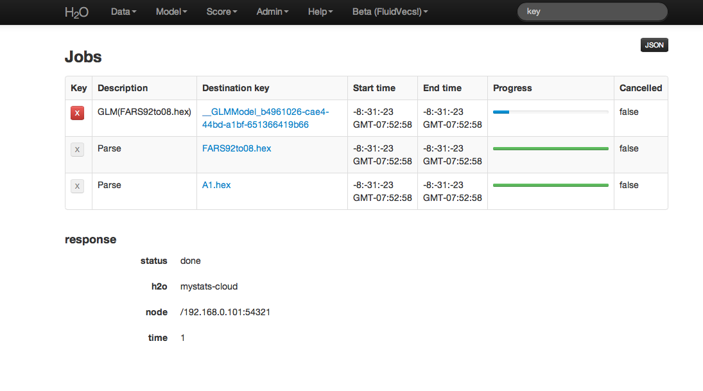

# Admin: Jobs

Users can access information on each action undertaken in an instance
of H2O by accessing Jobs under the Admin drop down menu. From here it
is possible to find .hex keys associated with models and parsed
data. If a an action was cancelled, that information will be displayed here as
well.

**Key**
Table field appears with an "X" button for those keys
that can be removed from current set of H2O objects.
For instance, if a user ran several different GLM models, but
wishes to keep only one of these, other models can be removed by
clicking on the "X" button.

**Description**
A description of the activity associated with a particular key. For
instance, a data set that has been parsed into .hex format will
have "Parse" in the description field.

**Destination key**
The actual key associated with an H2O object. This can be thought
of like a corollary to a file path on a users local computer.

**Start Time**
Time when a job was started.

**End Time**
Time when a job completed.

**Progress**
A status bar providing a visual indicator of job status and
progress. Green and filling means that job is proceeding, but
hasn't completed, green and full means that job completed
successfully, and red means that the job was unable to complete or
cancelled by user.

**Cancelled**
A column indiciating whether the job was cancelled.

**Result**
A column indicating the status of the job.

