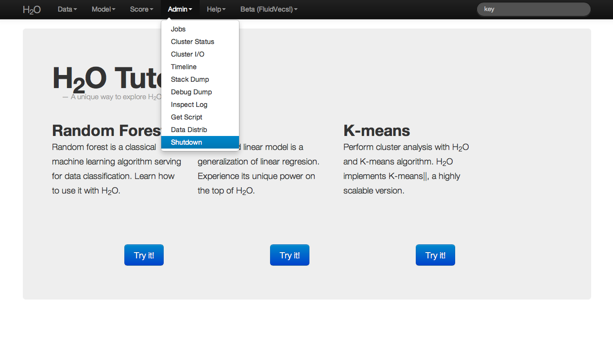

# Admin: Shutdown

When users are finished running a particular instance of H2O, the
program should be exited by selecting Shutdown from the Admin drop
down menu. Even if the user closes the browser window in which the
H2O instance is running, without explicitly stopping
H2O, the cluster associated with an H2O instance
still exists. The user could return to the browser based interface at
any time, and access all of the prior jobs within that instance of
H2O. Resources are still being allocated to H2O.

In order to entirely quit an instance of H2O and free up
the resources allocated to the program, the user may use Shutdown to
kill the cluster.

