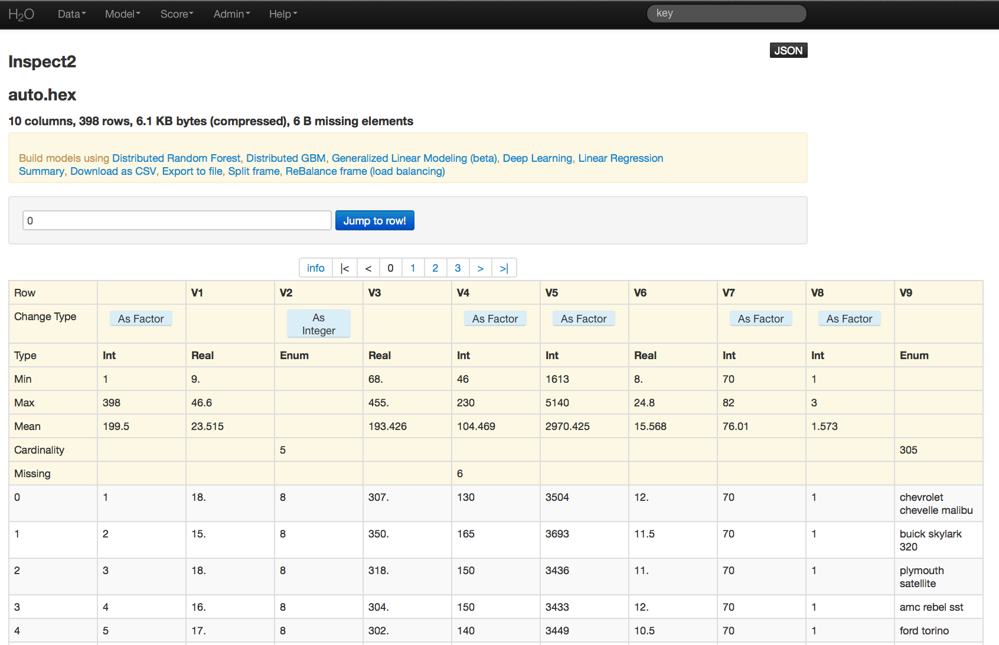

# Data: Inspect Request

**Src Key**
The source key for the parsed data (with keys usually ending in
.hex).

Once source key has been specified, an inspect table displaying parsed
data is returned to the user. Basic summary information is given at
the top, as are click button options to specify columns within data as a
factor or numeric. For more information visit :ref:`InspectReturn`.

## Response

The Data Inspect page is accessed by going to the **Data** drop down
menu, selecting **Inspect** and specifying the key associated with the
data to be examined.

Data Indices or Header (if included when data were imported and
parsed) are displayed across the top of the page.

**Jump to Row**
Users can automatically move to a specified point in the data by
entering an row index number and pressing the **Jump to Row**
button.

**Info and Scrolling Buttons**
Selecting Info returns the front page and summary
information. Selecting any one of integer numbers displayed across
the top will take the user to that page in the data.

**Change Type**
Users may wish to specify whether the data in a particular column
should be treated as numeric or as factors. Where the default
assumption about the data does not reflect the correct specification
users can change data type by clicking the button **As Factor** in
integer columns, or reverse this change by clicking **As Integer**.
Alpha-numeric or alpha data are automatically classified as factor
data, and cannot be treated as numeric, and continuous real data
cannot be converted to factor data because the number of possible
factor levels is infinite.

**Type**
Specifies the type of data contained in a column.

- Int: Integer; discrete numeric data (1, 2, 3, 4, ...)
- Real: Continuous real data (1, 1.01, 1.1, 1.3, 1.55, ...)
- Enum: Enumerative, Factor or Categorical data. (Red, Green, Blue,
...)

**Min**
The minimum value in a column of numeric data.

**Max**
The maximum value in a column of numeric data.

**Mean**
The average value of the data in a numeric column.

**Cardinality**
The number of unique levels in a column of factor data.

**Missing**
The number of missing values in a column of data.

