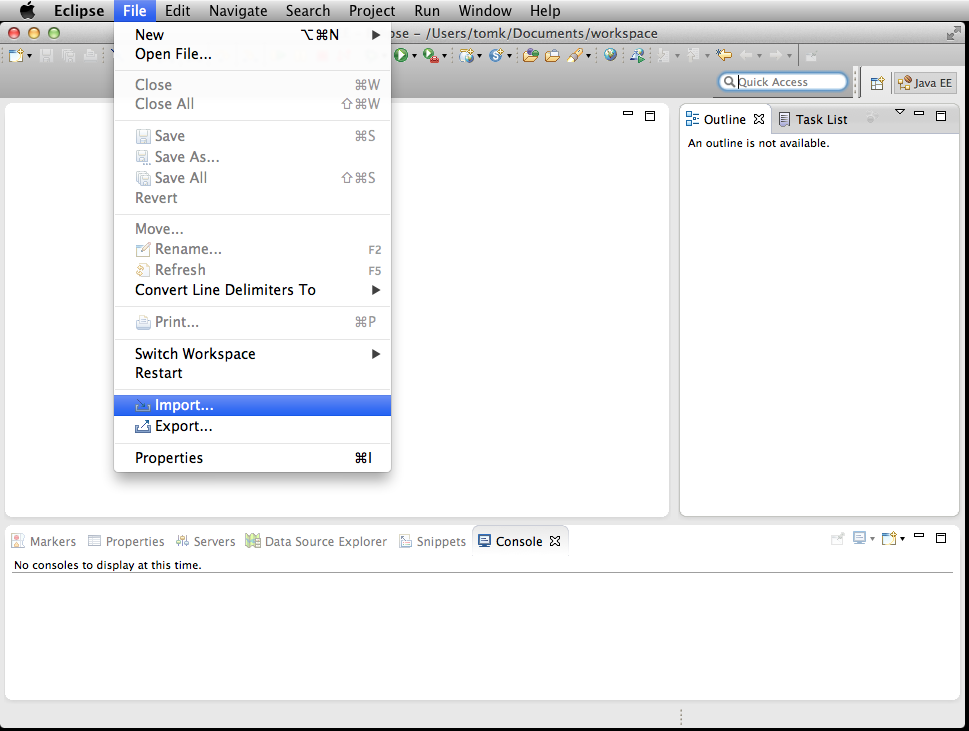
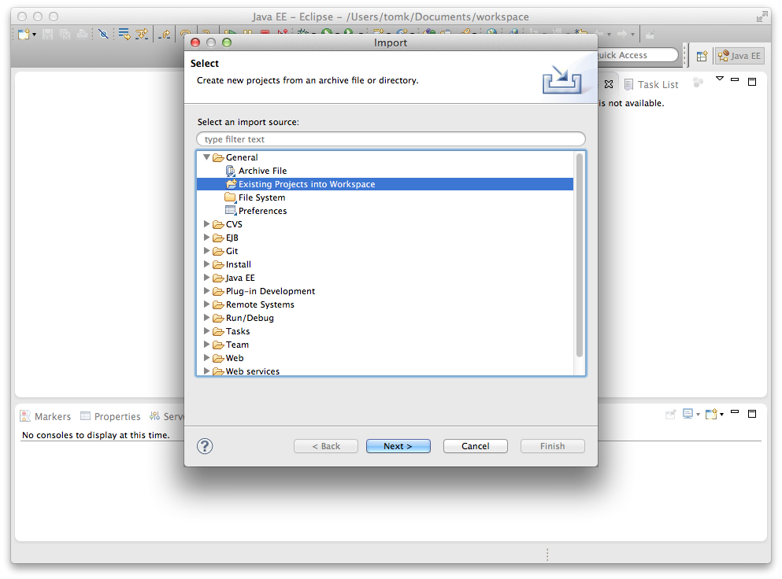
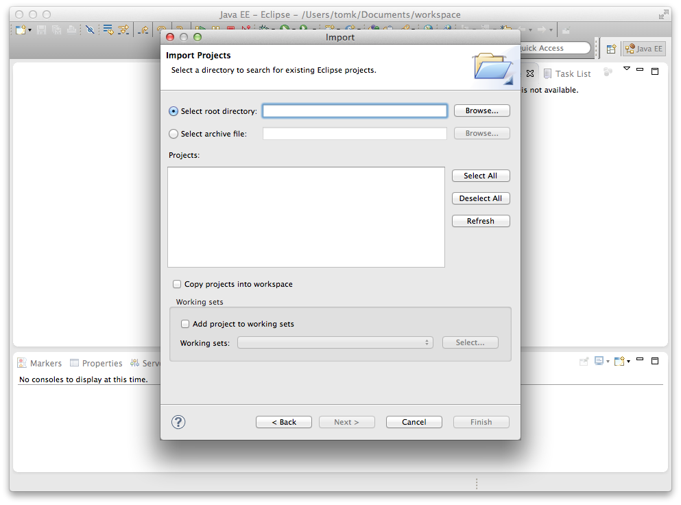
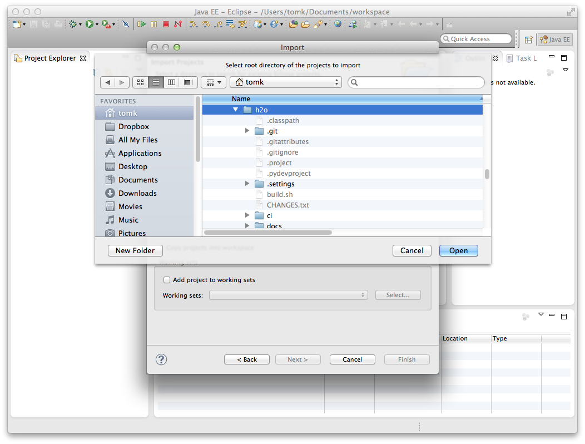
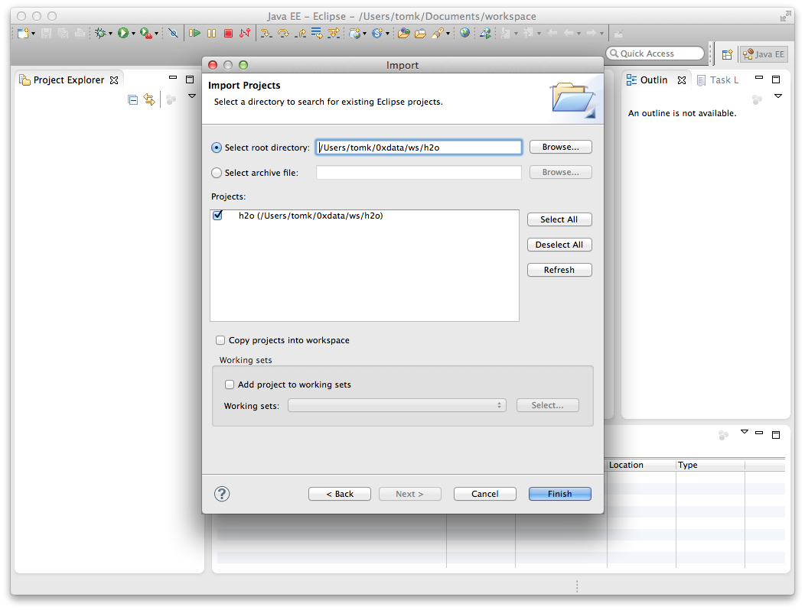
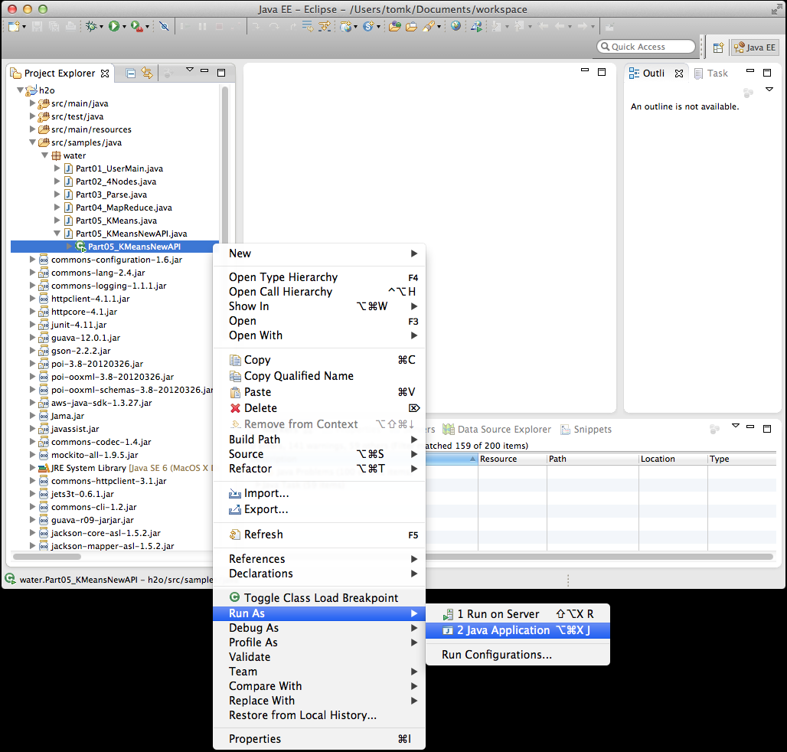
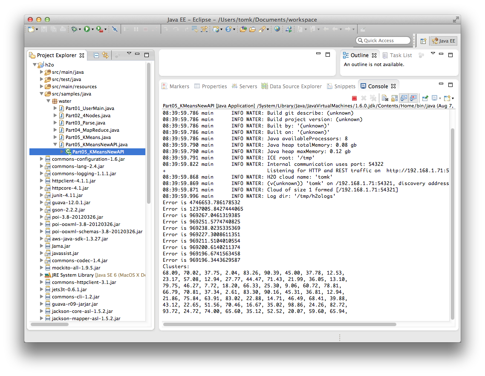

# H2O For Eclipse Users (Github)

**1.** Create a [git clone of the H2O repository](build).

**2.** Open Eclipse.

**3.** Choose File->Import.

**4.** Choose General->Existing Projects into Workspace.

**5.** Choose Select root directory and click Browse.

**6.** Choose H2O and click Open.

**7.** The defaults should have the H2O project selected.  Click Finish.

**8.** Right click on a sample program and run it as a Java Application.

**9.** Select the regular main class as the Java Application and click OK.

**10.**  See the output of a successful run.

