# For IDEA Users (Github)

**1.** Create a [git clone of the H2O repository](build).

**2.** Open IDEA.

**3.** Click Import Project.

**4.** Choose the H2O directory and click OK.

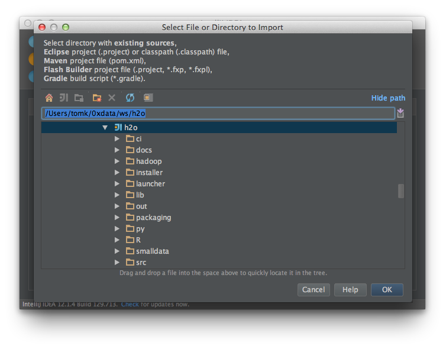

**5.** Choose Import project from external model.  Choose Eclipse.  Click Next.

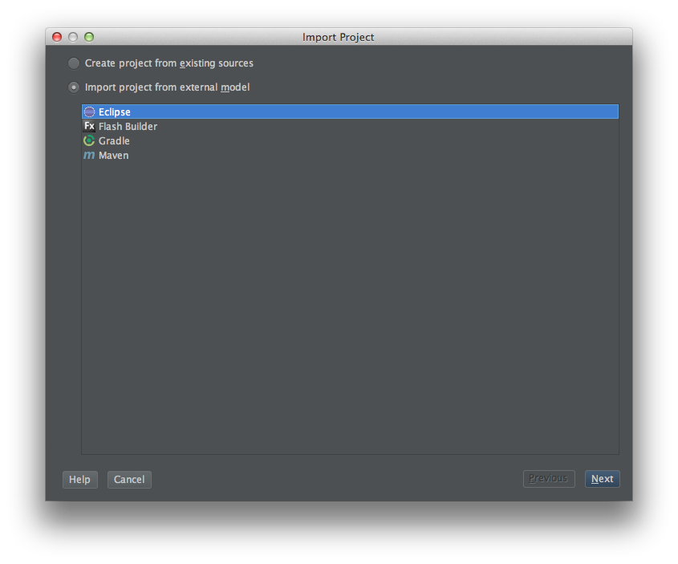

**6.** ENABLE LINK CREATED INTELLIJ IDEA MODULES TO ECLIPSE PROJECT FILES (this is not selected by default).  Click Next.

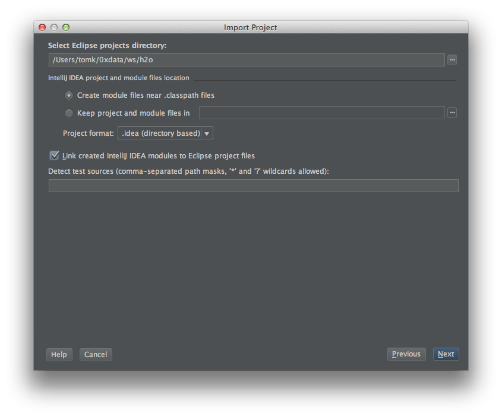

**7.** H2O should be selected by default.  Keep it selected.  If the "experiments" module is selected uncheck it.  Click Next.

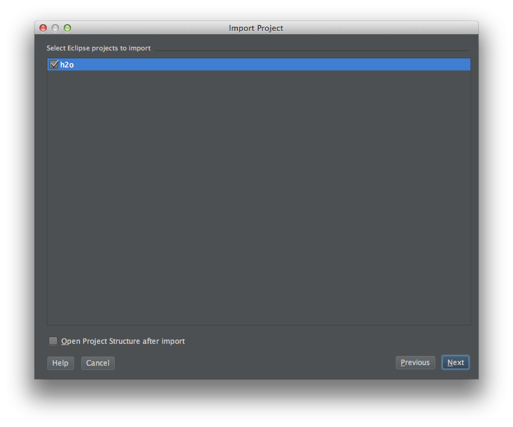

**8.** SDK 1.6 or 1.7 should selected by default.  If so click Finish.  If you don't have an SDK on your system you will need to install one first.

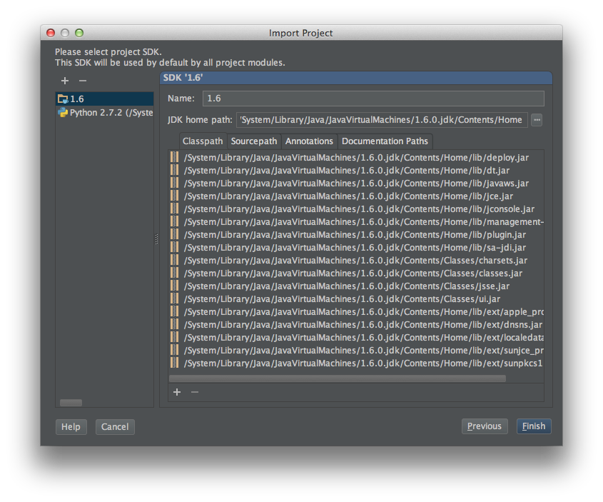

**9.** (Import from Eclipse) If prompted for Python configuration stuff just click Cancel.

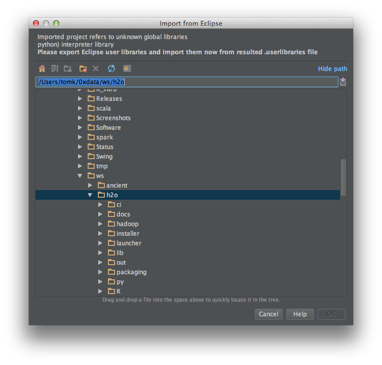

**10.** If prompted to Add Files to Git just click Cancel.

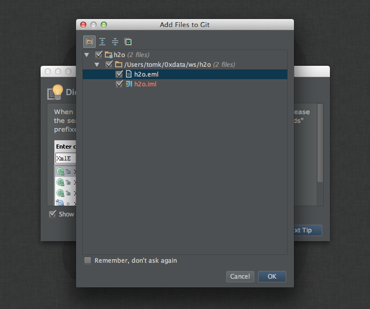

**11.** In IntelliJ IDEA / Preferences (CMD-,) set the project bytecode version to 1.6:

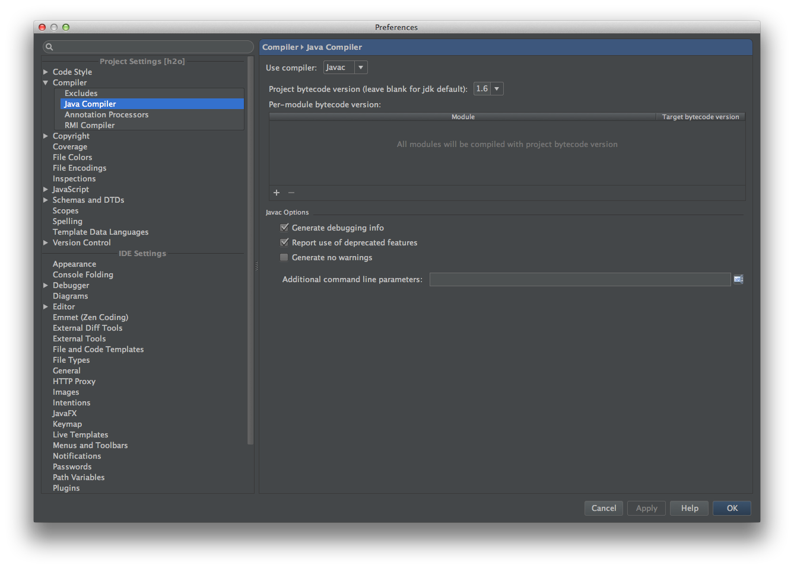

**12.** Select a sample Java Application and right click on it.  Choose Run.

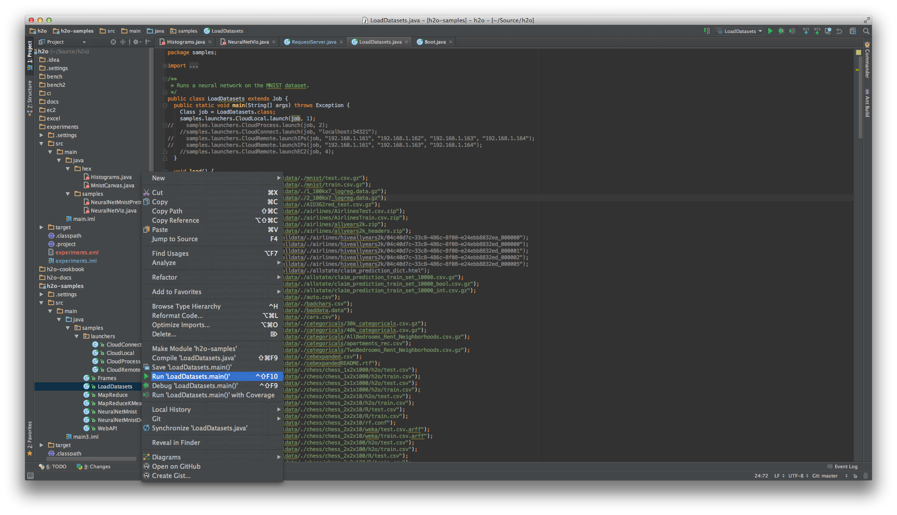

**13.** In certain versions of IntelliJ you may need to set the Java heap size and re-run:

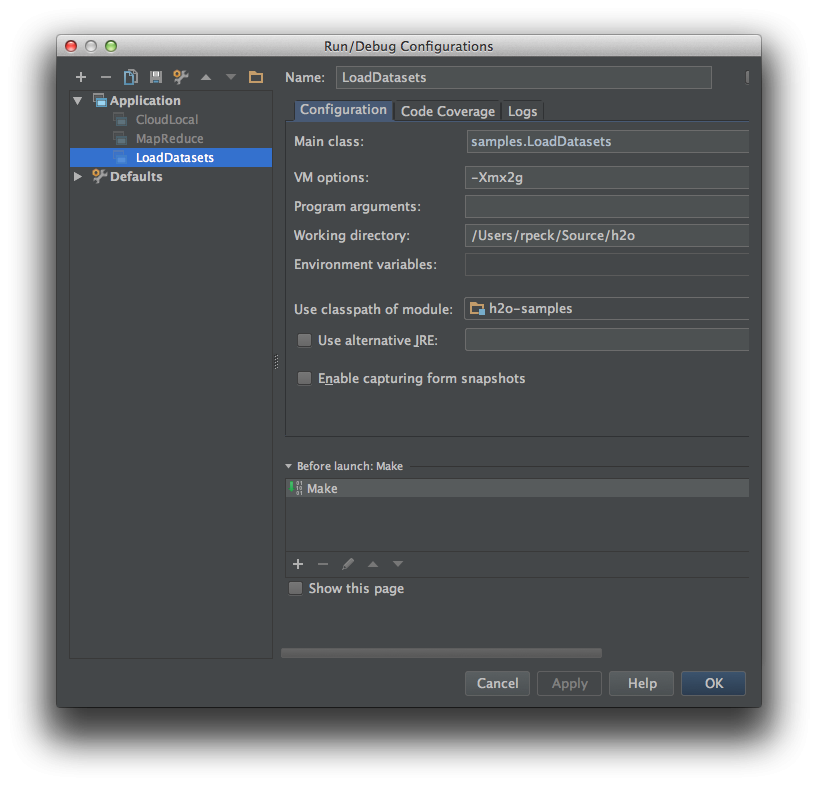

**14.** See the output of a successful run.

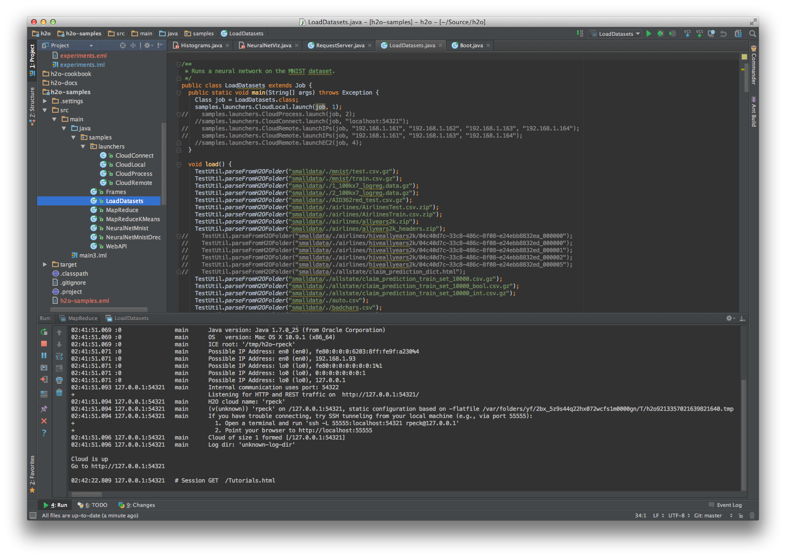

**15.** You may connect to http://127.0.0.1:54321/ to use H2O interactively.

