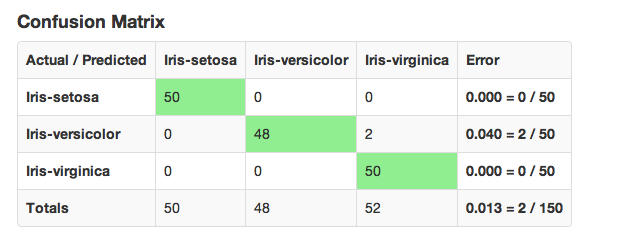
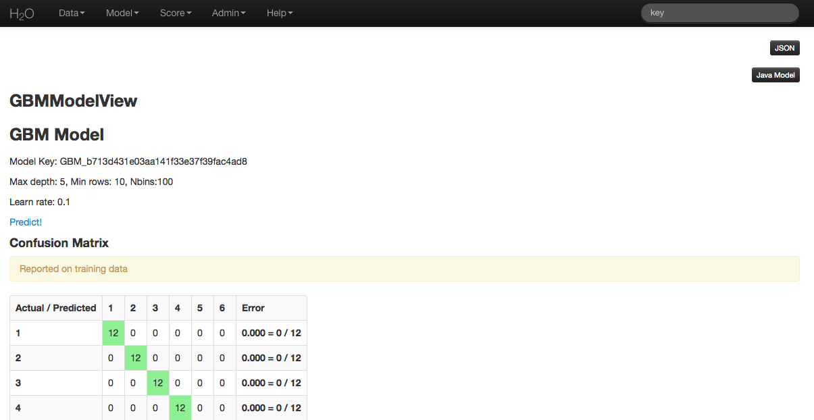

# Gradient Boosted Regression and Classification

Gradient Boosted Regression and Gradient Boosted Classification are
forward learning ensemble methods. The guiding heuristic is that good
predictive results can be obtained through increasingly refined approximations.

## Defining a GBM Model

### Destination Key:

A user defined name for the model.

### Source:

The .hex key associated with the parsed data to be used in the model.

### Response:

The dependent variable to be modeled. Dependent variables can be
binomial indicators, multinomial classes (if the classes are

### Ignored Columns:

By default all of the information submitted in a data set will be
used in building the GBM model. Users specify those attributes
that should be omitted from analysis by highlighting them.

### Classification:

An option that treats the outcome variable as categorical, and when
unchecked treats the outcome variable as continuous. If a
continuous real variable has been defined for the response, H2 O will return an error if a classification model is requested.

### Validation:

A .hex key associated with data to be used in validation of the
model built using the data specified in **Source**.

### NTrees:

The number of trees to be built. Models with different total numbers
of trees can be specified by entering the different values as a
comma separated list. For example,to specify different models with
200, 100 and 50 trees respectively enter "200, 100, 50".

### Max Depth:

The maximum number of edges to be generated between the first node
and the terminal node. To test different depths, values can be
specified in a comma separated list.

### Min Rows:

The minimum number of observations to be included in a terminal
leaf. If any classification must consist of no fewer than five
elements, min rows should be set to five.

### NBins:

The number of bins data are partitioned into before the best split
point is determined. A high number of bins relative to a low number
of observations will have a small number of observations in each
bin. As the number of bins approaches the number of unique values in
a column, the analysis approaches evaluation of all possible split
points

### Score Each Iteration:

An option that returns error rate information after each tree in the
requested set is built. This option allows users to evaluate the
marginal gain in fit from building that tree, allowing for
interruption of the model when the gain for building the next tree isn't
substantial enough to continue building. Users should be aware that
this option can slow the model building process, depending on the
size and shape of both the training data and the testing data.

### Importance:

An option that returns information about each variable's importance
in training the specified model.

### Learn Rate:

A number between 0 and 1 that specifies the rate at which the
algorithm should converge. Learning rate is inversely related to the
number of iterations taken for the algorithm to complete.

### Grid Parallelism:

When multiple models are called for through the grid search options
such as specification of multiple learning rates, selecting this
option will build the set of models in parallel rather than
sequentially.

## Treatment of Factors

When the specified GBM model includes factors, those factors are
analyzed by assigning each distinct factor level an integer, and
then binning the ordered integers according to the user specified
number of bins (N Bins). Split points are determined by considering
as the end points of each bin, and the one versus many split for
each bin.

For example, if the factor is split into 5 bins, H2O orders the bins by
bin number, and then the split between the first and second bin, the
second and third, the third and fourth, and the fourth and fifth are
considered. Additionally the split that comes of splitting the first
bin from the other four, and all analogous splits for the other four
bins are considered. If users wish to specify a model such that all
factors are considered individually, they can do so by setting N
Bins equal to the number of factor levels. This can be done even in
excess of 1024 levels (the maximum number of levels that can be
handled in R), though this will increase the time it takes for a
model to be fully generated.

## Interpreting Results

GBM results for classification models are comprised of a confusion
matrix and the mean squared error of each tree. Note that when MSE for
each tree is returned, the first and second MSE values are the same.
The initial MSE is calculated for the dependent variable, and is given
as a baseline against which to evaluate the predictive performance of
each next basis function. The first MSE value given is the MSE for the
data set before any trees are built.

An example of a confusion matrix is given below:

The highlighted fields across the diagonal indicate the number the
number of true members of the class who were correctly predicted as
true. The overall error rate is shown in the bottom right field. It reflects
the proportion of incorrect predictions overall.

For regression models, returned results
### MSE

Mean squared error is an indicator of goodness of fit. It measures
the squared distance between an estimator and the estimated parameter.

### Cost of Computation

The cost of computation in GBM is bounded above in the following way:

`$Cost = bins\times (2^{leaves}) \times columns \times classes$`

## GBM Algorithm

H2O's Gradient Boosting Algorithms follow the algorithm specified by Hastie et
al (2001):

Initialize `$f_{k0} = 0,\: k=1,2,...,K$`

`$For\:m=1\:to\:M:$`
`$(a)\:Set\:$`
`$p_{k}(x)=\frac{e^{f_{k}(x)}}{\sum_{l=1}^{K}e^{f_{l}(x)}},\:k=1,2,…,K$`

`$(b)\:For\:k=1\:to\:K:$`

`$\:i.\:Compute\:r_{ikm}=y_{ik}-p_{k}(x_{i}),\:i=1,2,…,N.$`

`$\:ii.\:Fit\:a\:regression\:tree\:to\:the\:targets\:r_{ikm},\:i=1,2,…,N$`

`$giving\:terminal\:regions\:R_{jim},\:j=1,2,…,J_{m}.$`

`$\:iii.\:Compute$`

`$\gamma_{jkm}=\frac{K-1}{K}\:\frac{\sum_{x_{i}\in R_{jkm}}(r_{ikm})}{\sum_{x_{i}\in R_{jkm}}|r_{ikm}|(1-|r_{ikm})},\:j=1,2,…,J_{m}.$`

`$\:iv.\:Update\:f_{km}(x)=f_{k,m-1}(x)+\sum_{j=1}^{J_{m}}\gamma_{jkm}I(x\in\:R_{jkm}).$`

Output `$\:\hat{f_{k}}(x)=f_{kM}(x),\:k=1,2,…,K.$`

### BETA: Standalone Scoring:

As a beta feature still undergoing testing, GBM models now offer
users an option to download a generated GBM model in java code. This
new feature can be accessed by clicking **Java Model** in the upper
right corner. When the model is small enough, the java code for the
model will be made available to inspect from within the GUI, larger
models can be inspected after users have downloaded the model.

To download the model open the terminal window, create a directory
where the model will be saved, set the new directory as the working
directory and follow the curl and java compile commands displayed in
the instructions at the top of the java model.

## Reference

Dietterich, Thomas G, and Eun Bae Kong. "Machine Learning Bias,
Statistical Bias, and Statistical Variance of Decision Tree
Algorithms." ML-95 255 (1995).

Elith, Jane, John R Leathwick, and Trevor Hastie. "A Working Guide to
Boosted Regression Trees." Journal of Animal Ecology 77.4 (2008): 802-813

Friedman, Jerome H. "Greedy Function Approximation: A Gradient
Boosting Machine." Annals of Statistics (2001): 1189-1232.

Friedman, Jerome, Trevor Hastie, Saharon Rosset, Robert Tibshirani,
and Ji Zhu. "Discussion of Boosting Papers." Ann. Statist 32 (2004):
102-107

Friedman, Jerome, Trevor Hastie, and Robert Tibshirani. "Additive
Logistic Regression: A Statistical View of Boosting (With Discussion
and a Rejoinder by the Authors)." The Annals of Statistics 28.2
(2000): 337-407
http://projecteuclid.org/DPubS?service=UI&version=1.0&verb=Display&handle=euclid.aos/1016218223

Hastie, Trevor, Robert Tibshirani, and J Jerome H Friedman. The
Elements of Statistical Learning.
Vol.1. N.p., page 339: Springer New York, 2001.
http://www.stanford.edu/~hastie/local.ftp/Springer/OLD//ESLII_print4.pdf

Niu, Feng, et al. "Hogwild!: A lock-free approach to parallelizing
stochastic gradient descent." Advances in Neural Information
Processing Systems 24 (2011): 693-701. (algorithm implemented is on p.5)
https://papers.nips.cc/paper/4390-hogwild-a-lock-free-approach-to-parallelizing-stochastic-gradient-descent.pdf

