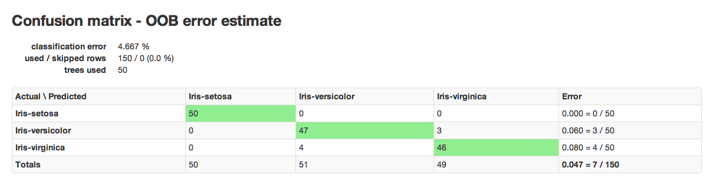

# Random Forest

Random Forest (RF) is a powerful classification tool. When given a set of data, RF
generates a forest of classification trees, rather than a single
classification tree. Each of these trees generates a classification
for a given set of  attributes. The classification from each H2O tree
can be thought of as a vote; the most votes determines the
classification.

## When to use RF

RF is a good choice when your objective is classification.

## Defining a Model

### Source:

The parsed data set to be used in training a model.

### Response:

The dependent variable to be modeled.

### Ignored Columns:

The set of features from the source data set to be omitted from
training a model.

### Classification:

An option that specifies the model to be a classifier when switched
on.

### Validation:

A .hex key associated with data to be used in validation of the
model built using the data specified in **Source**.

### N Trees:

The number of trees the user would like to generate for
classification.

### Max Depth:

A user defined tuning parameter for controlling model complexity
(by number of edges); depth is the longest path from root to the
furthest leaf. Maximum depth also specifies the maximum number of
interactions that can be accounted for by the model.

### Min Rows:

The minimum number of observations to be included in each terminal
node. The maximum possible observations in a terminal node is N-1,
where N is the number of observations. The minimum is 1, and is the
case where each observation is in a unique terminal node.

### N Bins:

A user defined tuning parameter for controlling model complexity.
N bins sets the number of groups into which the original data
can be split.

### Score each iteration:

An option that returns an error rate for each iteration of the
training process. It is used when models are especially complex. By
producing a score for the model at each iteration, users can stop
the training process when the cost of continuing to model is
greater than the marginal gains in predictive power.

### Importance:

An option that returns information about the importance of each
feature in the overall model.

### Mtries:

At each iteration a randomly chosen subset of the features in the
training data are selected and evaluated to define the optimal split
of that subset. Mtries specifies the number of features to be
selected from the whole set. When set to -1 the number of features
to be chosen is set to the square root of the total number of
features, rounded to the nearest integer.

### Seed:

A large number that allows the analyst to recreate an analysis by
specifying a starting point for black box processes that would
otherwise occur at a randomly chosen place within the data.

### Build tree one node:

An option that allows users to train the model using one node,
instead of using a distributed cluster with multiple
nodes. Selecting this option can significantly impact the time it
takes to train a model, and is recommended only for small data
sets.

## Interpreting Results

RF results are comprised of a model key and a confusion matrix. The
model key specifies the full forest of trees to be used for
predicting classifications.

An example of a confusion matrix is given below:

The highlighted fields across the diagonal indicate the number the
number of true members of the class who were correctly predicted as
true. In this case, of 111 total members of class F, 44 were correctly
identified as class F, while a total of 80 observations were
incorrectly classified as M or I, yielding an error rate of 0.654.

In the column for class F, 11 members of I were incorrectly classified
as F, 56 as male, and a total of 111 observations in the set were
identified as F.

The overall error rate is shown in the bottom right field. It reflects
the total number of incorrect predictions divided by the total number
of rows.

## RF Error Rates

H2O's Random Forest Algo produces a dynamic confusion matrix. As each
tree is built and OOBE (out of bag error estimate) is recalculated,
expected behavior is that error rate increases before it decreases.
This is a natural outcome of Random Forest's learning process. When
there are only a few trees, built on random subsets, the error rate is
expected to be relatively high. As more trees are added, and  thus
more trees are "voting" for the correct classification of the OOB
data, the error rate should decrease.

## Random Forest Data Science

<iframe src="http://www.slideshare.net/slideshow/embed_code/20546878" width="427" height="356" frameborder="0" marginwidth="0" marginheight="0" scrolling="no" style="border:1px solid #CCC;border-width:1px 1px 0;margin-bottom:5px" allowfullscreen> </iframe> 
 <strong> <a href="https://www.slideshare.net/0xdata/jan-vitek-distributedrandomforest522013" title="Jan vitek distributedrandomforest_5-2-2013" target="_blank">Jan vitek distributedrandomforest_5-2-2013</a> </strong> from <strong><a href="http://www.slideshare.net/0xdata" target="_blank">0xdata</a></strong> 

