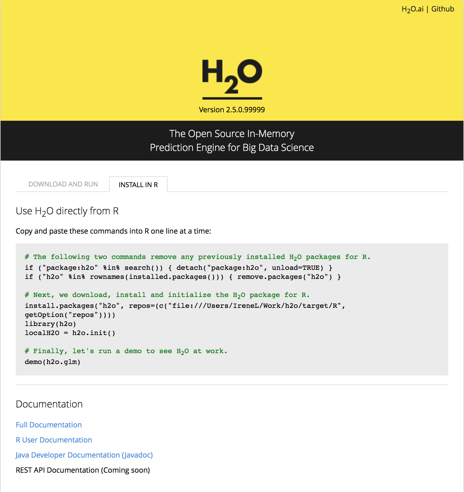

# H2O Installation in R From Download Table

These instructions assume you are using R  2.14.0 or later.
Regardless of whether installation is carried out in R Studio or R Console, the instructions are the same.

**STEP 1**

The download package containing the  H2O jar file can be
obtained by visiting H2O available downloads at
[http://0xdata.com/downloadtable](http://0xdata.com/downloadtable/).

Choose the version of  H2O best for you, and unzip the
downloaded H2O zip file. The most recent promoted build is
recommended.

**STEP 2**

Start an instance of H2O. For help with this see
[Getting Started](../tutorials/start)

If users do not start an instance of H2O, one will be
started automatically for them at localhost: 54321 (see **STEP 4** for
more detail).

If the instance of H2O is stopped, the R
program will no longer run, and work done will be lost.

**STEP 3:**

Follow the instructions for installation on the page from which the
package was downloaded. Those instructions will look similar to the
instructions in the picture below:




Note: users may get warnings of the type
`Error in detach("package:h2o", unload = TRUE): invalid 'name' argument.`
This tells users that there is no  H2O package to uninstall. These
warnings can safely be ignored.


**STEP 4:**

Once the  H2O R package has been installed, call the
package, and establish a connection to a running instance of  H2O.

If there is no running instance of  H2O prior to using
the command `h2o.init()`,  H2O in R will start an instance
automatically for the user at localhost:54321, and the user will be
notified. If you would like to connect to an instance at an IP and
port other than localhost:54321, these details must be specified as
arguments in the R call.

```r
library(h2o)
localH2O <- h2o.init()
```


Users who wish to specify a connection
with a server (other than localhost at port 54321) must explicitly
state the IP address and port number in the h2o.init call.
An example is given below, but **do not cut and paste**; users should
specify the IP and port number appropriate to their specific
environment.

```r
library(h2o)
localH2O = h2o.init(ip = "192.555.1.123", port = 12345, startH2O = FALSE)
```


**STEP 5: Upgrading Packages**

Users may wish to manually upgrade their R packages. For instance, if
you are running the bleeding edge developer build, it's possible that
the code has changed, but that the revision number has not, in which
case manually upgrading ensures the most current version of not only
the H2O code, but the corresponding R code as well.

This can be done by returning to STEP 3, and following the commands
through STEP 4.

