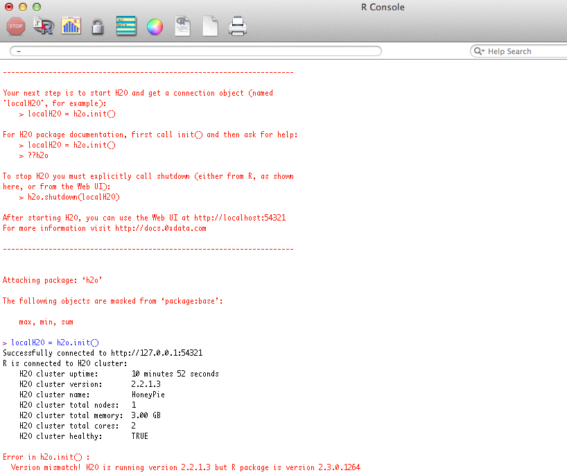

# Installing and Starting H2O

Before beginning, be sure to have an instance of H2O
running. Additionally, users who are using H2O for the
first time can find help for installing the R package at
http://docs.0xdata.com/Ruser/Rh2opackage.html.

<object width="425" height="344"><param name="movie"
value="http://www.youtube.com/v/deRpTB9k77k&hl=en&fs=1"></param><param
name="allowFullScreen" value="true"></param><embed
src="http://www.youtube.com/v/deRpTB9k77k&hl=en&fs=1"
type="application/x-shockwave-flash" allowfullscreen="true"
width="425" height="344"></embed></object>

## Initialize H2O

Call the H2O package, and initialize H2O
in R. Note that an object `localh2o` is created. Assigning the
H2O initialization to an object is important, because the
connection will be used later to tell R where to send data sets, model
specification, and where to find results.

```r
library(h2o)
localH2O <- h2o.init(ip = "localhost", port = 54321)
```

Users may see a response message in R indicating that the instance of
H2O running is a different version than that of the corresponding
H2O R package. This error will look similar to the picture below.
If you get this error, it can be resolved by downloading the correct version of
H2O from http://0xdata.com/downloadtable/. Users should follow the
installation instructions on the download page.




## Cluster Info

Used to check that the H2O instance is running and healthy.

```r
library(h2o)
localH2O = h2o.init(ip = "localhost", port = 54321, startH2O = TRUE)
h2o.checkClient(localH2O)
```


