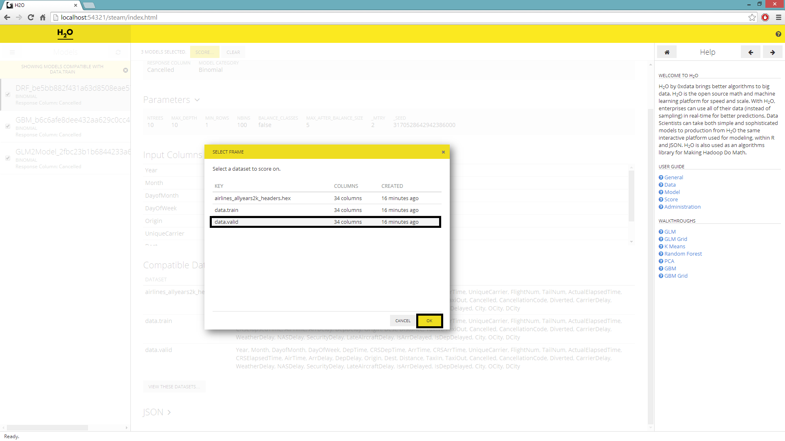
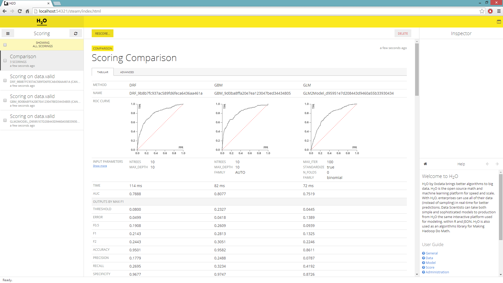
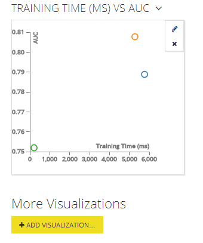

# Multi-model comparison

The purpose of this tutorial is to walk users new to H2O's new scoring feature through H2O's Multi-modeling Scoring Engine. The tutorial assumes that the user have had some experience building models in H2O and wants to compare the different models build. The Multi-modeling Scoring Engine makes model comparison and model selection user friendly and easy.

## Getting Started

This tutorial uses a publicly available data set that can be found at:
https://github.com/0xdata/h2o/wiki/Hacking-Airline-DataSet-with-H2O

The original data originated from RITA and can be downloaded by yearly chunks.  The data used in the following example has 43978 observations and 34 columns of which 8 are chosen to be predictor variables. Out of the eight: 4 are integer columns, 1 is continuous real, and the remaining 3 are categorical features with levels 132, 10, and 134.

The data is then farther split into test and train subsets, the training set is used to build a GLM, Random Forest, and GBM model. For instructions and walkthroughs on how to build these models refer to tutorials for [GLM](../tutorials/glm), [Random Forest](../tutorials/rf) and [GBM](../tutorials/gbm).

## Model Comparison

On the main page you'll be prompted to choose a dataset and a list of compatible models will be generated. The models are compatible to a chosen dataset when the headers of said dataset is the same as the headers of the data used to build the models on the list.

0. Under the **Datasets** menu, select a hex key for scoring purposes.
0. To the right of the **Datasets** navigator, a list of compatible models will be generated; select the *View These Models* underneath.

0. User will be redirected to a page with the columnar navigator switched to a list of **Models**.
0. Check and select all the models before hitting *Score*.
0. A new window will pop up prompting the user to select the dataset to score on, highlight desired selection before submitting the job.

0. The columnar navigator will populate with a new **Scoring** selection. Select all the scores and hit *Compare*.
0. The scoring comparison will be shown in its default *Tabular* format with validation data.

0. By navigating to the *Advance* tab you can over lay multiple ROC curves on a single graph and add new visualizations.

## Adding visualizations
In the advance tab, you can sort your model by the AUC value and choose the model that most accurately classified your validation set. What's more you can add additional graphs and visuals to compare all the different statistics. For example let's plot the models' AUC by their training time.

0. Underneath the ROC curve in the advanced tab, choose to *Add Visualizations*.
0. For *Compare* choose Scoring, for *X-Axis Field* choose Training Time (ms), and lastly for *Y-Axis Field* choose AUC before submitting the request.

