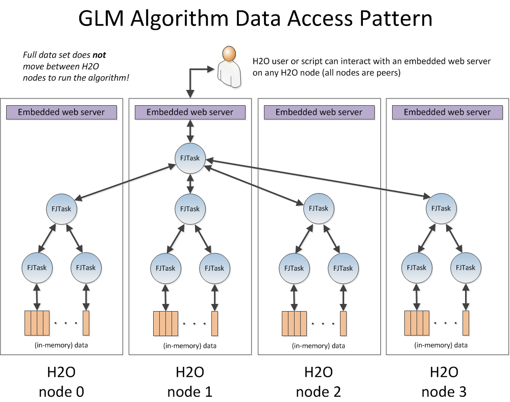

# Job / MRTask / FJTask Overview

A GLM job gets broken down into MRTask2 tasks, and subsequently into
Fork/Join tasks.  FJ tasks are spread across the cluster in a
logarithmic tree fashion with computation performed at the leaves and
results rolled up to the top.

