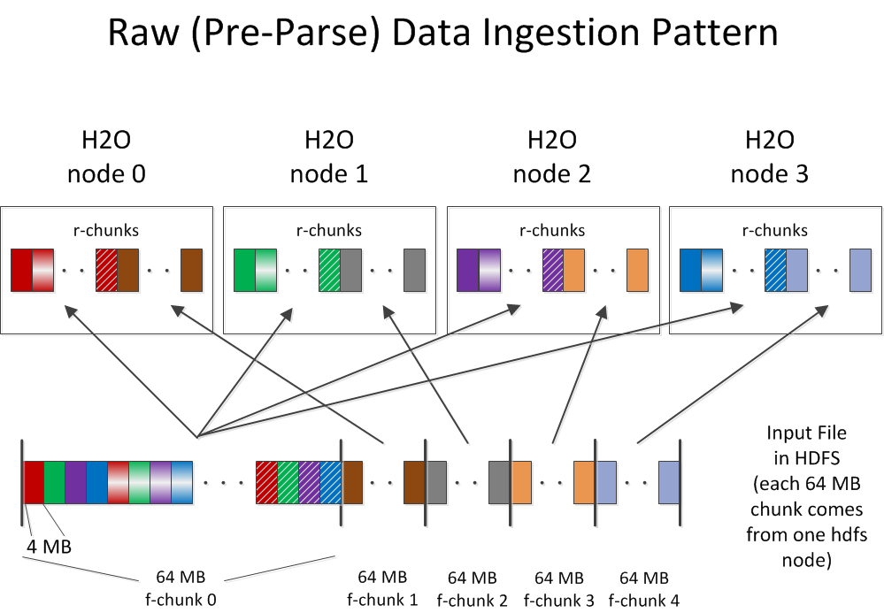
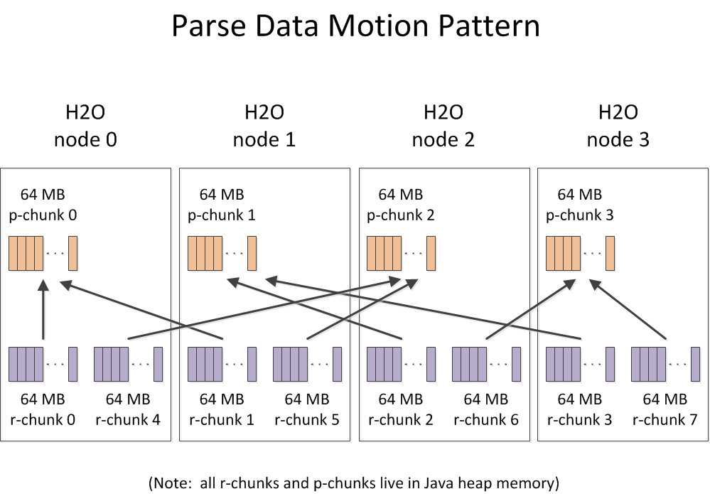

# Parse Overview

(Since HDFS is very popular, this example illustrates that data
source.  H2O does support other sources of data, however.)

The parse process typically moves data as much as twice during
ingestion.

The first movement of the data occurs when the data is read from disk
(an f-chunk in the diagram below) and copied across the network to the
H2O node that requested the particular piece of data from the
filesystem.

The data is then moved a second time from the H2O node where the raw
data gets parsed to the H2O node where the compressed data will reside
in a Fluid Vector chunk (a p-chunk in the diagram below).

