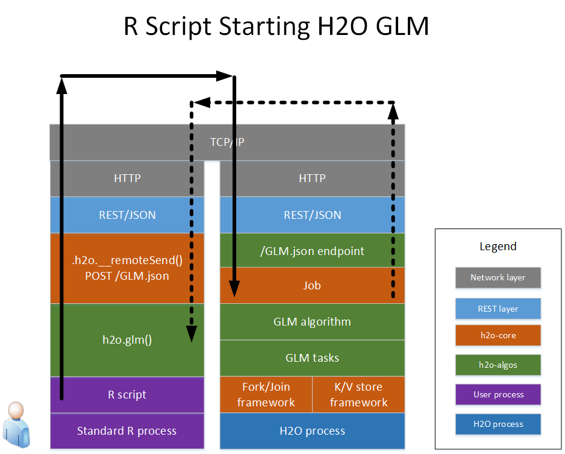
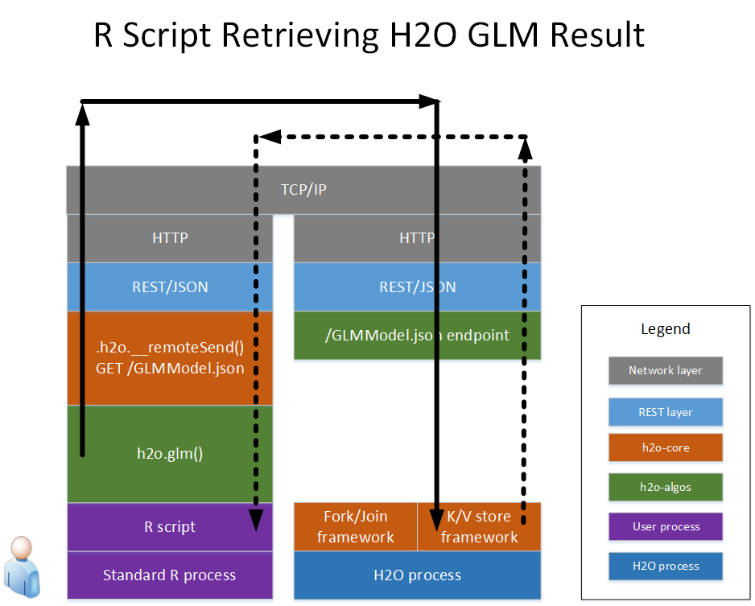
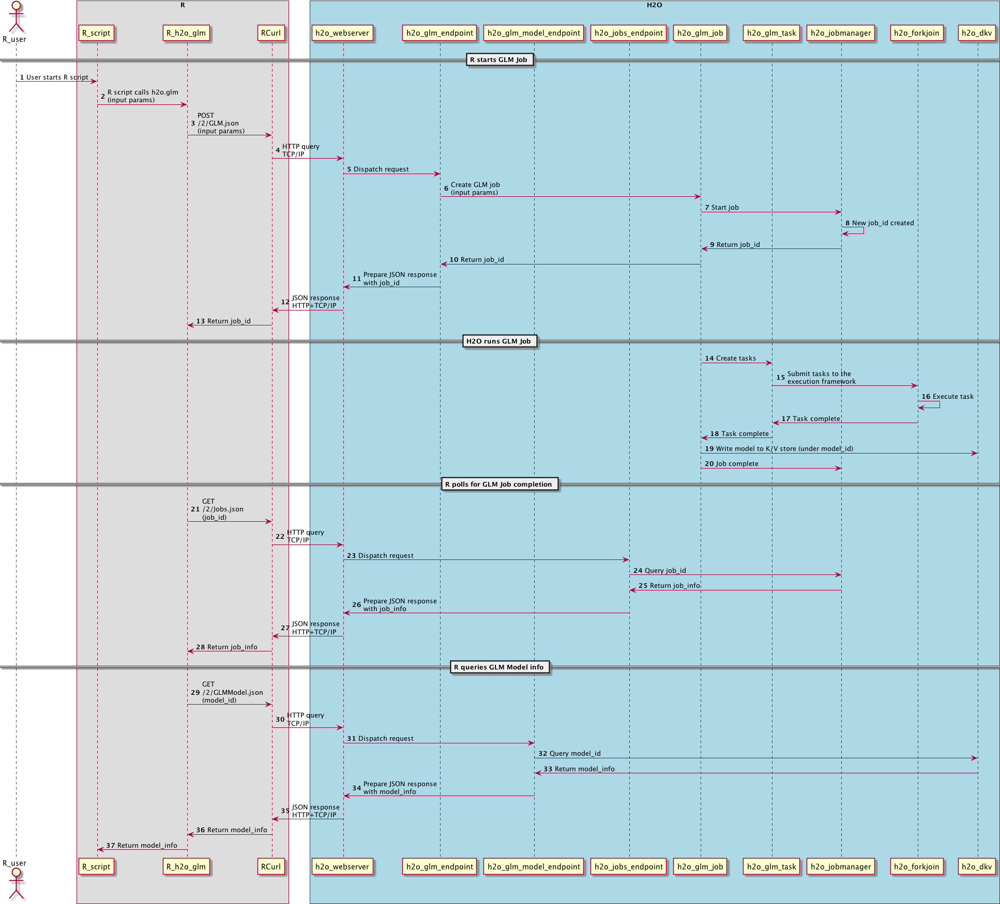

# How R Scripts Call H2O GLM

The following diagram shows the different software layers involved
when a user runs an R program that starts a GLM on H2O.

The left side shows the steps that run the the R process, and the
right side shows the steps that run in the H2O cloud.  The top layer
is the TCP/IP network code that actually lets the two processes
communicate with each other.

The solid line shows an R->H2O request, and the dashed line shows
the response for that request.

In the R program, the different components are the R script itself,
the H2O R package, dependent packages (RCurl, rjson), and the R core
runtime itself.

The following diagram shows the R program retrieving the resulting GLM
model.  (Not shown is the GLM model itself executing subtasks within
H2O and depositing the result into the K/V store.  Also not shown is R
polling the /Jobs.json URL for the GLM model to complete.)

An end-to-end sequence diagram of the same transaction is below (click
on the diagram to zoom).  This gives a different perspective of the R
and H2O interactions for the same GLM request and the resulting model.

