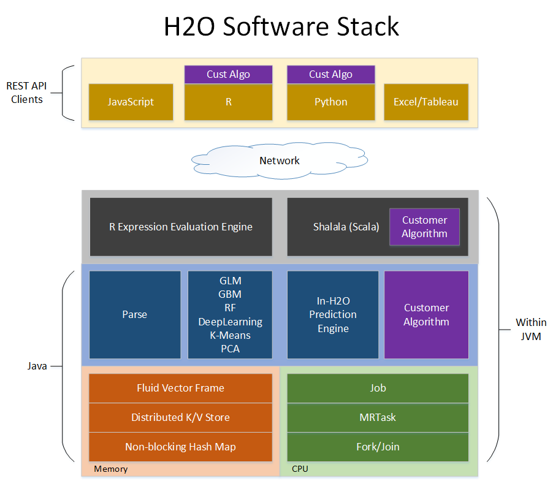

# H2O Software Stack

The diagram below shows most of the different components that work
together to form the H2O software stack.  The diagram is split into a
top and bottom section, with the network cloud dividing the two
sections.

The top section shows some of the different REST API clients that
exist for H2O.

The bottom section shows different components that run within an H2O
JVM process.

The color scheme in the diagram shows each layer in a consistent color
but always shows user-added code as purple.

## REST API Clients

All REST API clients communicate with H2O over a socket connection.

**JavaScript**
The embedded H2O Web UI is written in JavaScript, and uses the standard
REST API.

**R**
R scripts can use the H2O R package ['library(h2o)'].  Users can
write their own R functions than run on H2O with 'apply' or 'ddply'.

**Python**
Python scripts currently must use the REST API directly.  An H2O client
API for python is planned.

**Excel**
An H2O worksheet for Microsoft Excel is available.  It allows you to
import big datasets into H2O and run algorithms like GLM directly from
Excel.

**Tableau**
Users can pull results from H2O for visualization in Tableau.

## JVM Components

An H2O cloud consists of one or more nodes.  Each node is a single JVM
process.  Each JVM process is split into three layers: language,
algorithms, and core infrastructure.

The language layer consists of an expression evaluation engine for R
and the Shalala Scala layer.  The R evaluation layer is a slave to the
R REST client front-end.  The Scala layer, however, is a first-class
citizen in which you can write native programs and algorithms that use
H2O.

The algorithms layer contains those algorithms automatically provided
with H2O.  These are the parse algorithm used for importing datasets,
the math and machine learning algorithms like GLM, and the prediction
and scoring engine for model evaluation.

The bottom (core) layer handles resource management.  Memory and CPU
are managed at this level.

### Memory Management

**Fluid Vector Frame**
A Frame is an H2O Data Frame, the basic unit of data storage exposed
to users.  "Fluid Vector" is an internal engineering term that
caught on.  It refers to the ability to add and update and remove
columns in a frame "fluidly" (as opposed to the frame being rigid and
immutable).  The Frame->Vector->Chunk->Element taxonomy that stores
data in memory is described in Javadoc.  The Fluid Vector (or fvec)
code is the column-compressed store implementation.

**Distributed K/V store**
Atomic and distributed in-memory storage spread across the cluster.

**Non-blocking Hash Map**
Used in the K/V store implementation.

### CPU Management

**Job**
Jobs are large pieces of work that have progress bars and can be
monitored in the Web UI.  Model creation is an example of a job.

**MRTask**
MRTask stands for MapReduce Task.  This is an H2O in-memory MapReduce
Task, and not to be confused with a Hadoop MapReduce task.

**Fork/Join**
A modified JSR166y lightweight task execution framework.

