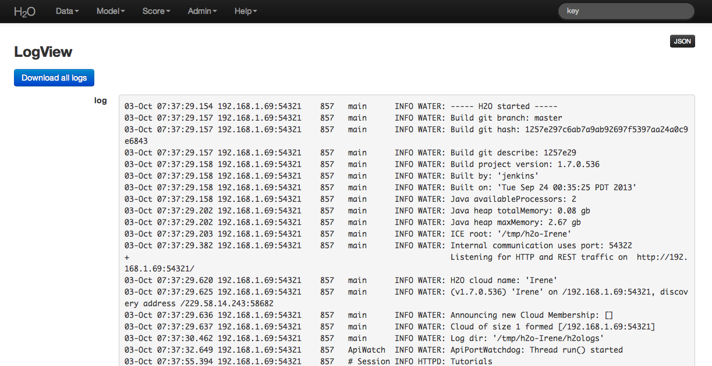
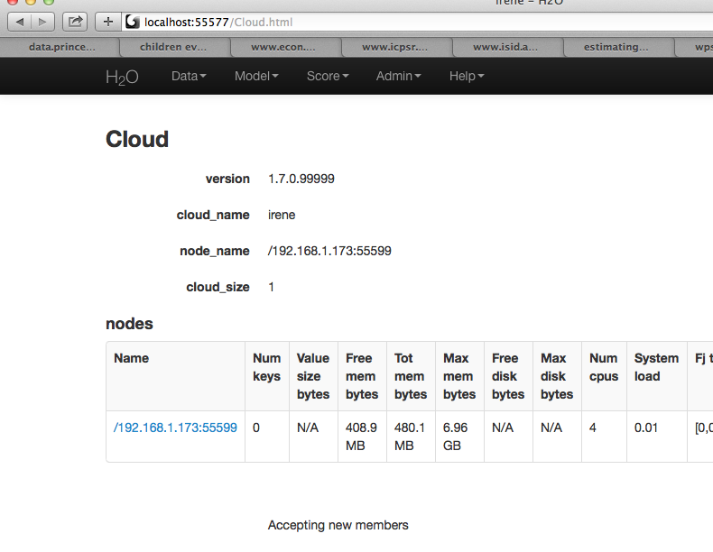

# Troubleshooting H2O

## Download and Send Us Your Logs

### Step 1

Through the drop down menu **Admin** go to **Log View**.

On the **Log View** page there is a **Download Logs** button in the
upper left hand corner. Click on it to download your logs.

### Step 2

From your email account contact h2ostream@googlegroups.com with a
brief description of the error you encountered, and your contact
information. Attach the downloaded H2O logs downloaded
from log view to the email before sending.

### Step 3

We will route your email to the correct engineer or data scientist
and work to resolve your issue.

## Other Common Troubleshooting Topics

**Common Question: Why is "Upload" is no longer working?**

This can occur when a user's local disk is full or almost full.
Free up space on your local disk, and the behavior should resolve.

**Common Question: How Do I Manage Dependencies in R?**

The  H2O R package utilizes other R packages
(like lattice, and curl). From time to time R will fail to download
from CRAN and give an error. In that case it's best to get the
binary from CRAN directly and install the package manually using the call:

    install.packages("path/to/fpc/binary/file", repos = NULL, type = "binary")

Users may find this page on installing dependencies helpful:
http://stat.ethz.ch/R-manual/R-devel/library/utils/html/install.packages.html

**Common Question: I launched H2O instances on my nodes but why won't they cloud up?**

When launching without specifying the IP address by adding argument -ip:

    $ java -Xmx20g -jar h2o.jar -flatfile flatfile.txt -port 54321

and multiple local IP addresses are detected, H2O will fall back to default 127.0.0.1 as shown below:

    10:26:32.266 main      WARN WATER: Multiple local IPs detected:
    +                                    /198.168.1.161  /198.168.58.102
    +                                  Attempting to determine correct address...
    10:26:32.284 main      WARN WATER: Failed to determine IP, falling back to localhost.
    10:26:32.325 main      INFO WATER: Internal communication uses port: 54322
    +                                  Listening for HTTP and REST traffic on  http://127.0.0.1:54321/
    10:26:32.378 main      WARN WATER: Flatfile configuration does not include self: /127.0.0.1:54321 but contains [/192.168.1.161:54321, /192.168.1.162:54321]

To avoid falling back to 127.0.0.1 on servers with multiple local IP addresses just run the command with the -ip argument forcing a launch at the appropriate location:

    $ java -Xmx20g -jar h2o.jar -flatfile flatfile.txt -ip 192.168.1.161 -port 54321

**R and H2O**

  In order for H2O and R to work together, an instance of
  H2O must be running, and that instance of H2O
  must be specified in the R workspace. If the H2O instance
  is terminated the H2O package in R will no longer work
  because R will no longer be able to send information to
  H2O's distributed analysis, and will no longer be able to
  get info mation back. Even if a new instance of H2O is
  started with the exact same IP and port number, users
  will need to reestablish the connection between  H2O and R
  using the call h2o.init(), and will have
  to restart their H2O work session.

**Updating the R Package**

  H2O's R package is headed for CRAN, but aren't there yet, and
  until recently, they were still "in . Follow the instructions in our R user
  documentation to install h2o in R (even if it is already
  installed), in order to ensure that you have the most recent
  version. If your issue persists, please let us know.

**Internal Server Error in R**

    brew install gnu-tar
    cd /usr/bin
    sudo ln -s /usr/local/opt/gnu-tar/libexec/gnubin/tar gnutar

### H2O On Windows

**Using CMD Shell** as an alternative to using terminal for windows
users allows windows users to execute instructions as written for
installign and running H2O in general.

In order to install and run R on Windows 8 (any and all R packages,
including those distributed by H2O) users will need read
and write persmissions to

## Tunneling between servers with H2O

**Step 1**

Log in to the machine where H2O will run using ssh

**Step 2**

Start an instance of H2O by locating the working directory and
calling a java command similar to the following ( the port number chosen here
is arbitrary and users might choose something different).

    $ java -jar h2o.jar -port  55599

This returns output similar to the following:

    irene@mr-0x3:~/target$ java -jar h2o.jar -port 55599
    04:48:58.053 main      INFO WATER: ----- H2O started -----
    04:48:58.055 main      INFO WATER: Build git branch: master
    04:48:58.055 main      INFO WATER: Build git hash: 64fe68c59ced5875ac6bac26a784ce210ef9f7a0
    04:48:58.055 main      INFO WATER: Build git describe: 64fe68c
    04:48:58.055 main      INFO WATER: Build project version: 1.7.0.99999
    04:48:58.055 main      INFO WATER: Built by: 'Irene'
    04:48:58.055 main      INFO WATER: Built on: 'Wed Sep  4 07:30:45 PDT 2013'
    04:48:58.055 main      INFO WATER: Java availableProcessors: 4
    04:48:58.059 main      INFO WATER: Java heap totalMemory: 0.47 gb
    04:48:58.059 main      INFO WATER: Java heap maxMemory: 6.96 gb
    04:48:58.060 main      INFO WATER: ICE root: '/tmp'
    04:48:58.081 main      INFO WATER: Internal communication uses port: 55600
    +                                  Listening for HTTP and REST traffic on  http://192.168.1.173:55599/
    04:48:58.109 main      INFO WATER: H2O cloud name: 'irene'
    04:48:58.109 main      INFO WATER: (v1.7.0.99999) 'irene' on
    /192.168.1.173:55599, discovery address /230 .252.255.19:59132
    04:48:58.111 main      INFO WATER: Cloud of size 1 formed [/192.168.1.173:55599]
    04:48:58.247 main      INFO WATER: Log dir: '/tmp/h2ologs'

**Step 3**

Log into the remote machine where the running instance of H2O will be
forwarded using a command similar to the following (where users
specified port numbers and IP address will be different)

    ssh -L 55577:localhost:55599 irene@192.168.1.173

**Step 4**

Check cluster status

You are now using H2O from localhost:55577, but the
instance of H2O is running on the remote server (in this
case the server with the ip address 192.168.1.xxx) at port number 55599.

To see this in action note that the web UI is pointed at
localhost:55577, but that the cluster status shows the cluster running
on 192.168.1.173:55599

