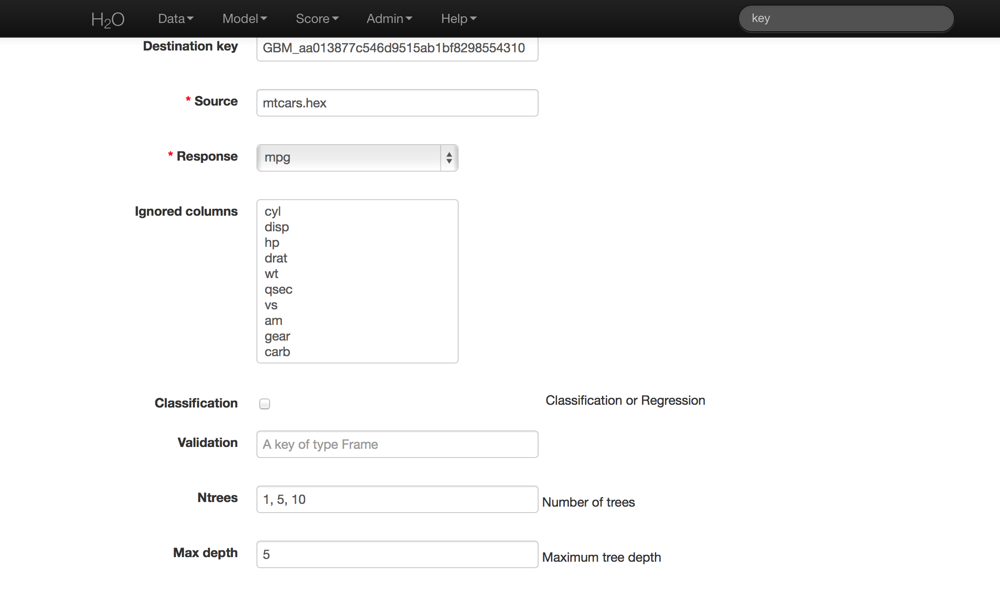
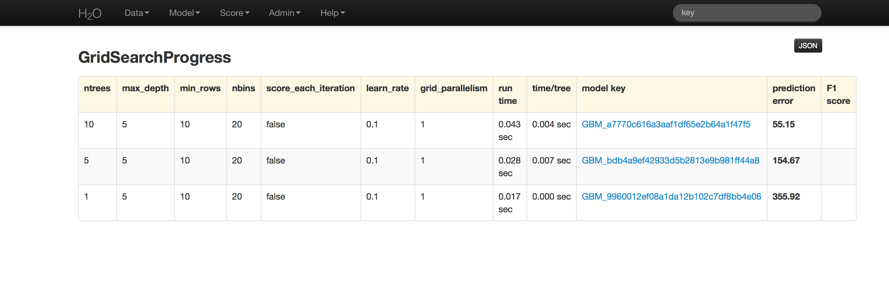

# GBM Grid Tutorial

The purpose of this tutorial is to walk the new user through
a GBM grid analysis.

Those who have never used H2O before should see the quick start guide
for additional instructions on how to run H2O.

### Getting Started

This tutorial uses the Airline data set. This data set and others can be found on the
H2O page of Public Data Sets.

Before modeling, parse data into H2O as follows:

0. Under the drop down menu **Data** select *Upload* and use the helper to
   upload data.
0. User will be redirected to a page with the header "Request
   Parse". Select whether the first row of the data set is a
   header. All other settings can be left in default. Press Submit.
0. Parsing data into H2O generates a .hex key ("data name.hex")
   Parsing data should look similar to this:

### Building a Model

0. Once  data are parsed a horizontal menu will appear at the top
   of the screen reading "Build model using ... ". Select
   GBM Grid here, or go to the drop down menu Model and
   select GBM Grid.
0. In the Source field enter the .hex key for the data set.
0. In the Response field select the response variable.
0. In Ignored Columns select the subset of variables that should be omitted from the model.
0. Users have the option of Gradient Boosted Classification or Gradient Boosted Regression. GBM is set to classification by default.
0. In Ntrees set the number of trees you would like the model to generate. To specify models with different numbers of trees, enter multiple tree counts separated by pipe (shift + backslash). For example 50|100|150.
0. In Max Depth specify the maximum number of edges between the top node and the furthest node as a stopping criteria. To specify different depths list desired depths separated by pipe (shift + backslash). For example: 2|20|40.
0. Specify Min Rows to be the minimum number of observations (rows) included in any terminal node as a stopping criteria. This parameter can also be specified at multiple levels by separating listed levels with pipe (shift + backslash). For example: 100|20|5.
0. Nbins are the number of bins in which data are to be split, and split points are evaluated at the boundaries of each of these bins. As Nbins goes up, the more closely the algorithm approximates evaluating each individual observation as a split point. The trade off for this refinement is an increase in computational time.
0. Learn Rate is a tuning parameter that slows the convergence of the algorithm to a solution, and is intended to prevent overfitting. To specify multiple learning rates, separate the list by by comma. For example: .01,.10,.15.

### Grid Search Results

Grid analysis results return a table indicating the level at which each of the tuning parameters were tested in combination and a clickable model key for each. If users specify  3 different levels for Ntrees, and 4 levels for Max Depth, a total of 12 models will be displayed; there is one model for each unique combination of specified tuning parameters.
The details of each of these models can be accessed by clicking on the model link provided in the results table.

GBM output for classification returns a confusion matrix showing the classifications for each group, and the associated error by group and the overall average error. Regression models can be quite complex and difficult to directly interpret. For that reason only a model key is given, for subsequent use in validation and prediction. Both models provide the MSE by tree. For classification models this is based on the classification error within the tree. For regression models MSE is calculated from the squared deviances, as it is in standard regressions.

