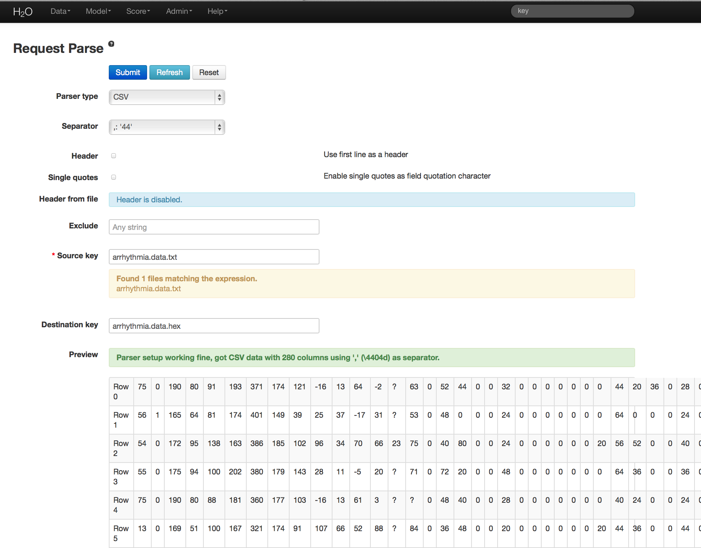
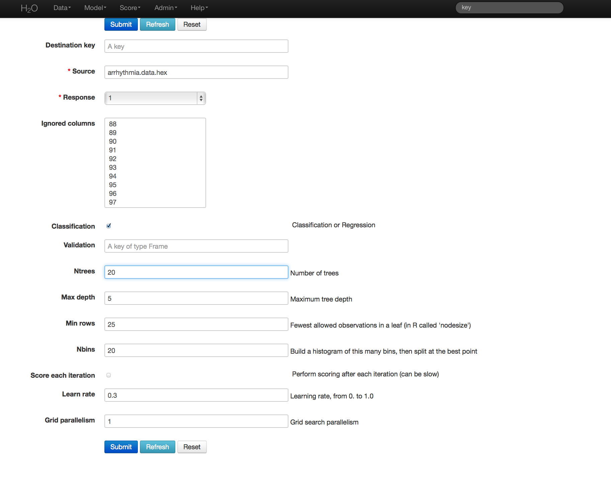
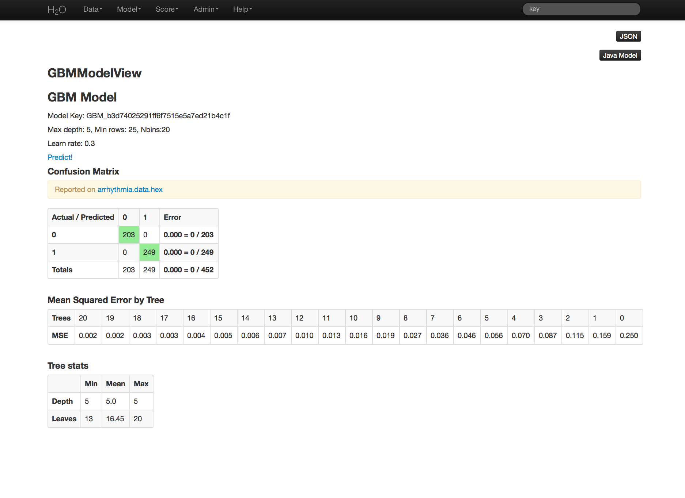

# GBM Tutorial

The purpose of this tutorial is to walk the new user through
a GBM analysis in H2O

Those who have never used H2O before should see the quick start guide
for additional instructions on how to run H2O.

### Getting Started

This tutorial uses a publicly available data set that can be found at:
http://archive.ics.uci.edu/ml/datasets/Arrhythmia

The original data are the Arrhythmia data set made available by UCI
Machine Learning repository. They are composed of
452 observations and 279 attributes.

Before modeling, parse data into H2O as follows:

0. Under the drop down menu **Data** select *Upload* and use the helper to
   upload data.
0. User will be redirected to a page with the header "Request
   Parse". Select whether the first row of the data set is a
   header. All other settings can be left in default. Press Submit.
0. Parsing data into H2O generates a .hex key ("data name.hex")

### Building a Model

0. Once  data are parsed a horizontal menu will appear at the top
   of the screen reading "Build model using ... ". Select
   GBM here, or go to the drop down menu Model and
   select GBM.
0. In the Source field enter the .hex key for the Arrhythmia data set.
0. In the Response field select the response variable. In this case it is variable 1.
0. In Ignored Columns select the subset of variables that should be
   omitted from the model. In this case, the only column to be
   omitted is the index column, 0.
0. Users have the option of Gradient Boosted Classification or
   Gradient Boosted Regression. GBM is set to classification by
   default. For this example, the desired output is classification.
0. In Validation enter the hex key associated with a holdout (testing)
   data set, if results should be applied to a new data set after the
   model is generated.
0. In Ntrees set the number of trees you would like the model to generate. In this case 20.
0. In Max Depth specify the maximum number of edges between the top
   node and the furthest node as a stopping criteria. Here the depth
   of interaction is set to 5.
0. Specify Min Rows to be the minimum number of observations (rows)
   included in any terminal node as a stopping criteria. In this case 25.
0. Nbins are the number of bins in which data are to be split, and
   split points are evaluated at the boundaries of each of these
   bins. As Nbins goes up, the more closely the algorithm approximates
   evaluating each individual observation as a split point. The trade
   off for this refinement is an increase in computational time.
0. Learn Rate is a tuning parameter that slows the convergence of the
   algorithm to a solution, and is intended to prevent overfitting. In
   this case we set learn rate to .3. (This parameter is often
   alternatively referred to as shrinkage).

### GBM Results

GBM output for classification returns a confusion matrix showing the
classifications for each group, and the associated error by group and
the overall average error. Regression models can be quite complex and
difficult to directly interpret. For that reason only a model key is
given, for subsequent use in validation and prediction. Both models
provide the MSE by tree. For classification models this is based on
the classification error within the tree. For regression models MSE is
calculated from the squared deviances, as it is in standard
regressions.

