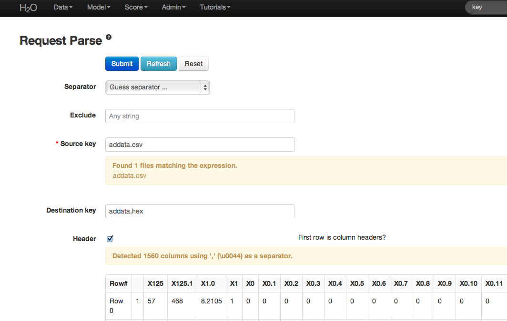
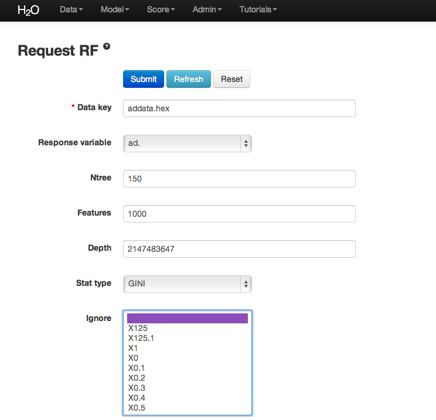
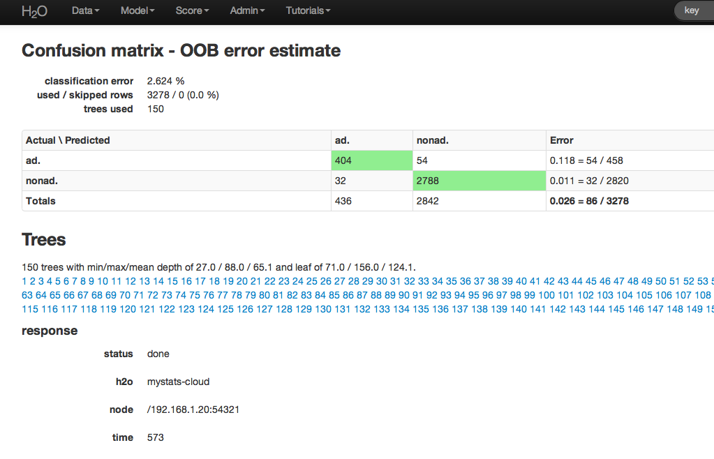
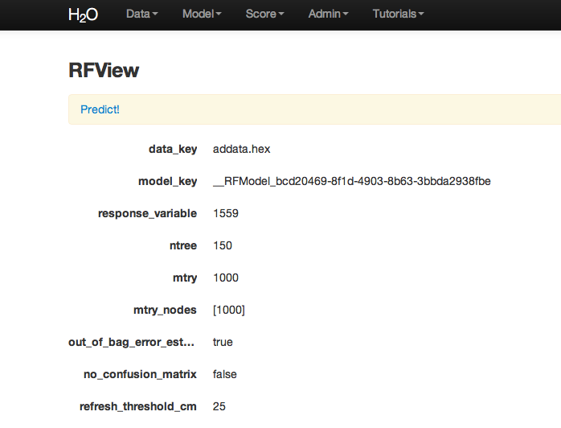
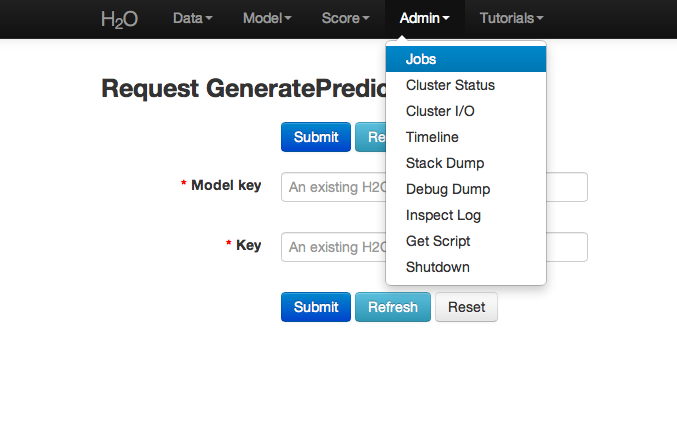
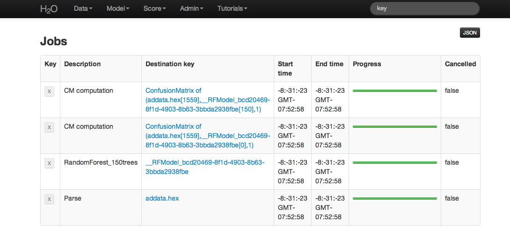

## Random Forest Tutorial

The purpose of this tutorial is to walk the new user through a
Random Forest analysis beginning to end. By the end of this tutorial
the user should know how to specify, run, and interpret Random Forest.

Those who have never used H2O before should see the quick start guide
for how to run H2O on your computer.

### Getting Started

This tutorial uses a publicly available data set that can be found at http://archive.ics.uci.edu/ml/machine-learning-databases/internet_ads/

The data are composed of 3279 observations, 1557 attributes, and an
priori grouping assignment. The objective is to build a prediction
tool that predicts whether an object is an internet ad or not.

0. Under the drop down menu Data select Upload and use the helper to
   upload data.
0. After uploading page is redirected to a page with the header
   "Request Parse". Select whether the first row of the data set is a
   header as appropriate.  All settings can be left in default. Press
   Submit.
0. Parsing data into H2O generates a .hex key ("data name.hex").

### Building a Model

0. Once  data are parsed a horizontal menu will appear at the top
   of the screen reading "Build model using ... ". Select
   Random Forest here, or go to the drop down menu "Model" and
   find Random Forest there.
0. In the field for Data Key enter the .hex key generated when data
   were parsed.
0. In Ntree specify the number of trees to be built; in this case 150.
0. Features specifies the number of features on which the trees will
   split. For this analysis specify Features to be 1000.
0. Depth specifies the maximum distance from root to terminal
   node. Leave this in default.
0. Stat type provides a choice between split criteria. Entropy
   maximizes information gain, where Gini seeks to isolate the
   dominant category at each node. Choose Gini for this analysis.
0. Ignore provides a list of attributes. Selecting an attribute will
   exclude it from consideration in tree building.
0. Class weights and sampling strategy are both used to correct for
   unbalanced data. Leave both in default here.
0. Sample specifies the proportion of observations sampled when
   building any given tree. The observations omitted from building a
   tree are run down the tree, and the classification error rate of
   that tree is estimated using the error rate from this holdout set.
0. Exclusive split limit defines the minimum number of objects to be
   grouped together in any terminal node.

### RF Output

The RF output of main interest is a confusion matrix detailing
the classification error rates for each level in the range of the
target variable. In addition to the confusion matrix, the overall
classification error, the number of trees and data use descriptives
are included.

RF inspect in total also includes information about the user chosen
tuning parameters at the top of RFView. At the top of the page there
is also an option to go directly to generating predictions for
another dataset.

### RF Predict

To generate a prediction click on the Predict! link at the top
of the RFView page. This function can also be found by going to the
drop down menu Score, and choosing predict.

Using the predict function requires the .hex key associated with a
model. To find this go to the drop down menu Admin and select Jobs.

All jobs created in the current instance of H2O will be listed
here. Find the appropriate job (here labeled "Random Forest 150
Trees"). Save the associated key to clipboard, and paste into the
model key field in the Request Generate Predictions Page. Enter a .hex
key associated with a parsed data set other than the one used to build
the model.

