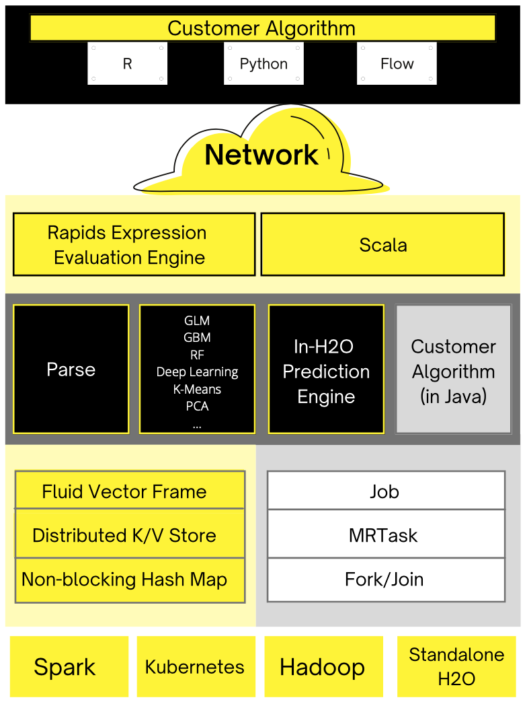
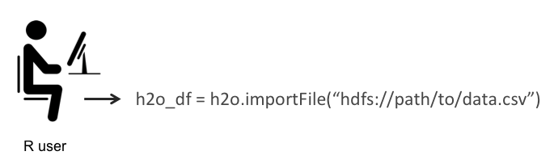
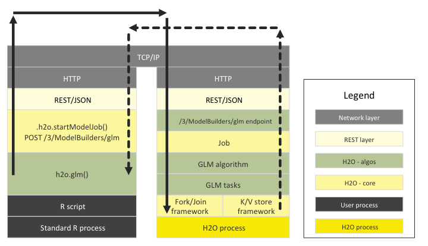
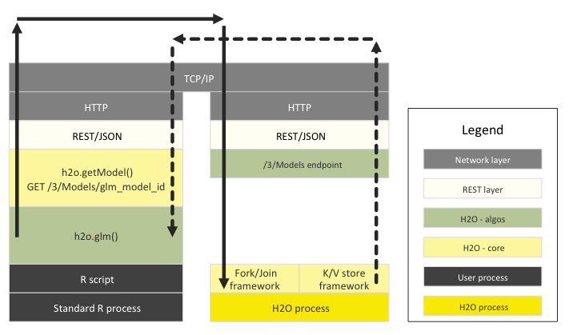
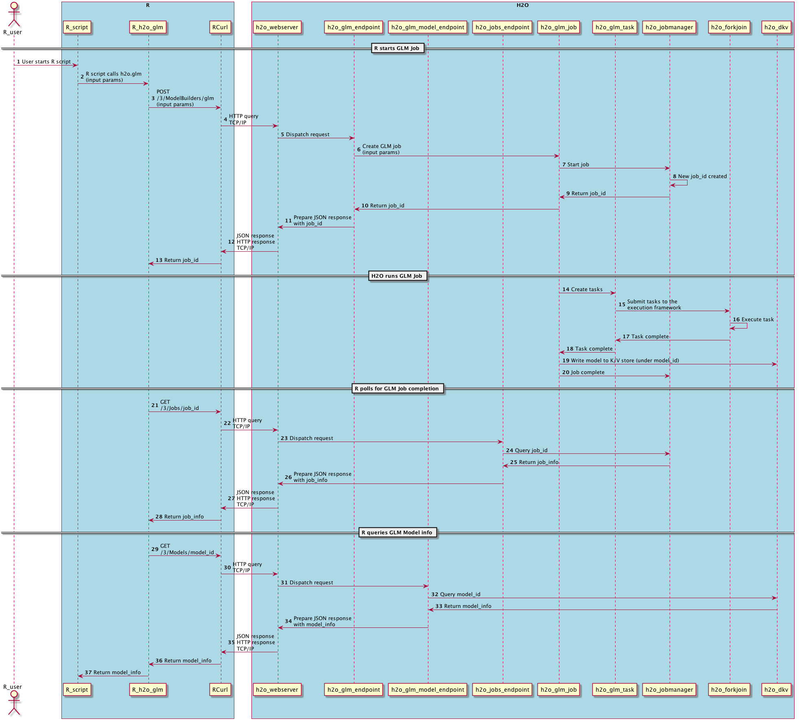

H2O Architecture
================

H2O Software Stack
------------------

The diagram below shows most of the different components that work
together to form the H2O software stack. The diagram is split into a top
and bottom section, with the network cloud dividing the two sections.

The top section shows some of the different REST API clients that exist
for H2O.

The bottom section shows different components that run within an H2O JVM
process.

The color scheme in the diagram shows each layer in a consistent color
but always shows user-added customer algorithm code as gray.

   

REST API Clients
------------------
All REST API clients communicate with H2O over a socket connection.

**JavaScript**
 The embedded H2O Web UI is written in JavaScript, and uses the standard REST API.

**R**
 R scripts can use the H2O R package ['library(h2o)']. Users can write their own R functions that run on H2O with 'apply' or 'ddply'.

**Python**
 Python scripts currently must use the REST API directly. An H2O client API for python is planned.

**Excel**
 An H2O worksheet for Microsoft Excel is available. It allows you to import big datasets into H2O and run algorithms like GLM directly from Excel.

**Tableau**
 Users can pull results from H2O for visualization in Tableau.

**Flow**
 H2O Flow is the notebook style Web UI for H2O.

JVM Components
~~~~~~~~~~~~~~

An H2O cloud consists of one or more nodes. Each node is a single JVM
process. Each JVM process is split into three layers: language,
algorithms, and core infrastructure.

The language layer consists of an expression evaluation engine for R and
the Shalala Scala layer. The R evaluation layer is a slave to the R REST
client front-end. The Scala layer, however, is a first-class citizen in
which you can write native programs and algorithms that use H2O.

The algorithms layer contains those algorithms automatically provided
with H2O. These are the parse algorithm used for importing datasets, the
math and machine learning algorithms like GLM, and the prediction and
scoring engine for model evaluation.

The bottom (core) layer handles resource management. Memory and CPU are
managed at this level.

Memory Management
^^^^^^^^^^^^^^^^^

**Fluid Vector Frame**
 A Frame is an H2O Data Frame, the basic unit of data storage exposed to users. "Fluid Vector" is an internal engineering term that caught on. It refers to the ability to add and update and remove columns in a frame "fluidly" (as opposed to the frame being rigid and immutable). The Frame->Vector->Chunk->Element taxonomy that stores data in memory is described in Javadoc. The Fluid Vector (or fvec) code is the column-compressed store implementation.

**Distributed K/V store**
 Atomic and distributed in-memory storage spread across the cluster.

**Non-blocking Hash Map**
 Used in the K/V store implementation.

CPU Management
^^^^^^^^^^^^^^

**Job**
 Jobs are large pieces of work that have progress bars and can be monitored in the Web UI. Model creation is an example of a job.

**MRTask**
 MRTask stands for MapReduce Task. This is an H2O in-memory MapReduce Task, not to be confused with a Hadoop MapReduce task.

**Fork/Join**
 A modified JSR166y lightweight task execution framework.

How R (and Python) Interacts with H2O
-------------------------------------

The H2O package for R allows R users to control an H2O cluster from an R
script. The R script is a REST API client of the H2O cluster. The data
never flows through R.

Note that although these examples are for R, Python and the H2O package
for Python behave exactly the same way.

How R Scripts Tell H2O to Ingest Data
~~~~~~~~~~~~~~~~~~~~~~~~~~~~~~~~~~~~~

The following sequence of three steps shows how an R program tells an
H2O cluster to read data from HDFS into a distributed H2O Frame.

**Step 1: The R user calls the importFile function**

**Step 2: The R client tells the cluster to read the data**

The thin arrows show control information.

.. image:: images/r_hdfs_read_step2.png
   :alt: r_hdfs_read_step2

**Step 3: The data is returned from HDFS into a distributed H2O Frame**

The thin arrows show control information. The thick arrows show data
being returned from HDFS. The blocks of data live in the distributed H2O
Frame cluster memory.

.. image:: images/r_hdfs_read_step3.png
   :alt: r_hdfs_read_step3

How R Scripts Call H2O GLM
~~~~~~~~~~~~~~~~~~~~~~~~~~

The following diagram shows the different software layers involved when
a user runs an R program that starts a GLM on H2O.

The left side shows the steps that run the the R process and the right
side shows the steps that run in the H2O cloud. The top layer is the
TCP/IP network code that enables the two processes to communicate with
each other.

The solid line shows an R->H2O request and the dashed line shows the
response for that request.

In the R program, the different components are:

-  the R script itself
-  the H2O R package
-  dependent packages (RCurl, rjson, etc.)
-  the R core runtime

The following diagram shows the R program retrieving the resulting GLM
model. (Not shown: the GLM model executing subtasks within H2O and
depositing the result into the K/V store or R polling the /3/Jobs URL
for the GLM model to complete.)

An end-to-end sequence diagram of the same transaction is below. This
gives a different perspective of the R and H2O interactions for the same
GLM request and the resulting model.

How R Expressions are Sent to H2O for Evaluation
~~~~~~~~~~~~~~~~~~~~~~~~~~~~~~~~~~~~~~~~~~~~~~~~

An H2O data frame is represented in R by an S3 object of class H2OFrame.
The S3 object has an ``id`` attribute which is a reference to the big
data object inside H2O.

The H2O R package overloads generic operations like 'summary' and '+'
for this new H2OFrame class. The R core parser makes callbacks into the
H2O R package, and these operations get sent to the H2O cluster over an
HTTP connection.

The H2O cluster performs the big data operation (for example, '+' on two
columns of a dataset imported into H2O) and returns a reference to the
result. This reference is stored in a new H2OFrame S3 object inside R.

Complicated expressions are turned into expression trees and evaluated
by the Rapids expression engine in the H2O back-end.
