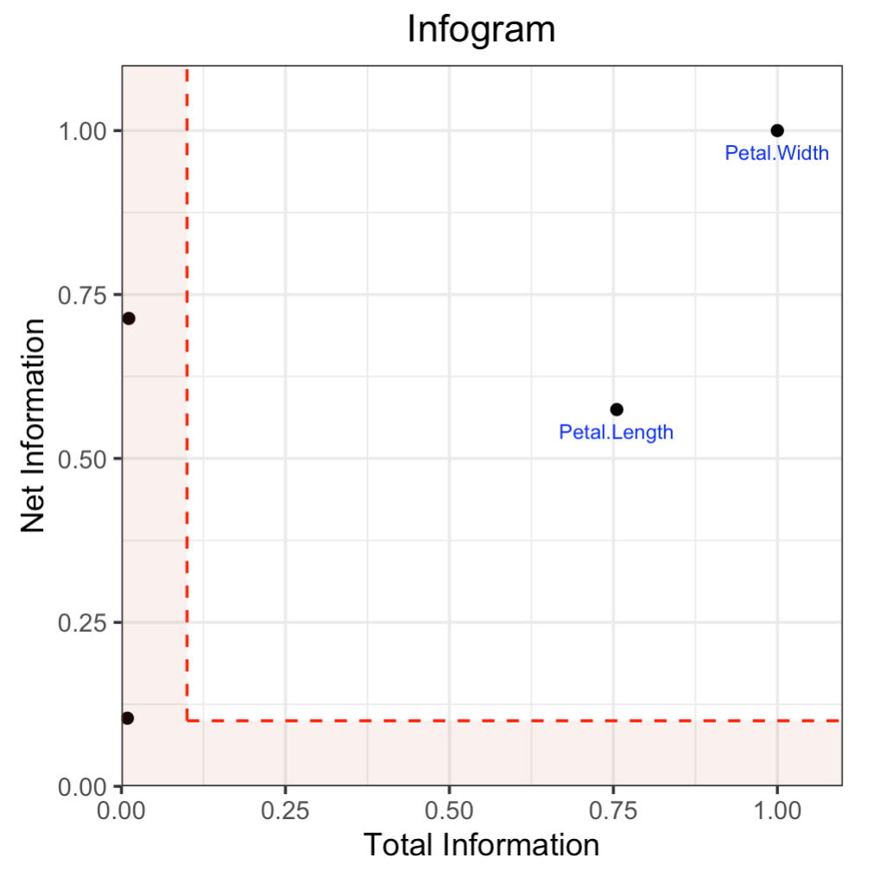
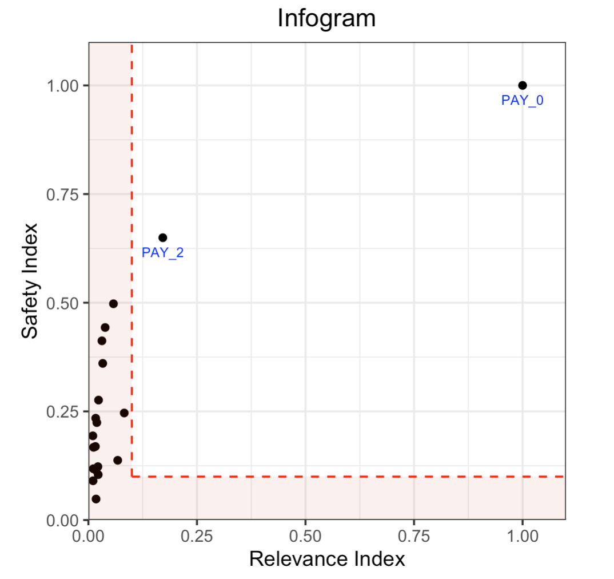
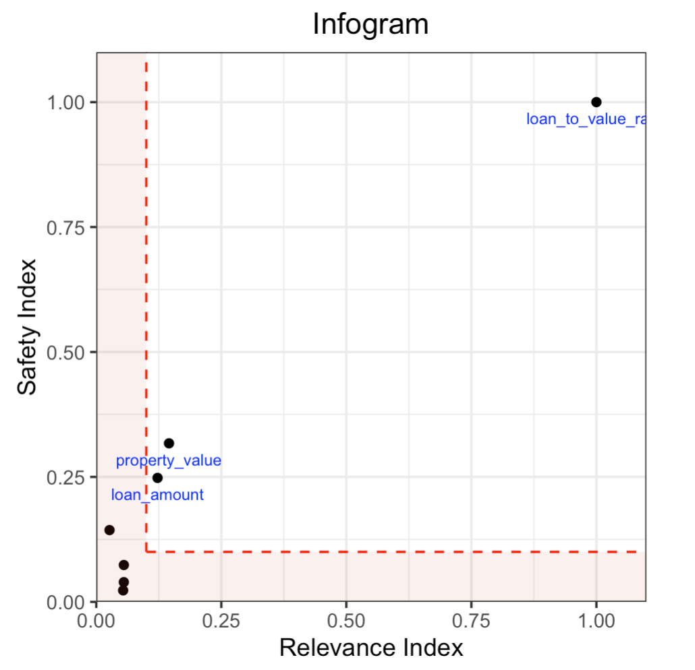
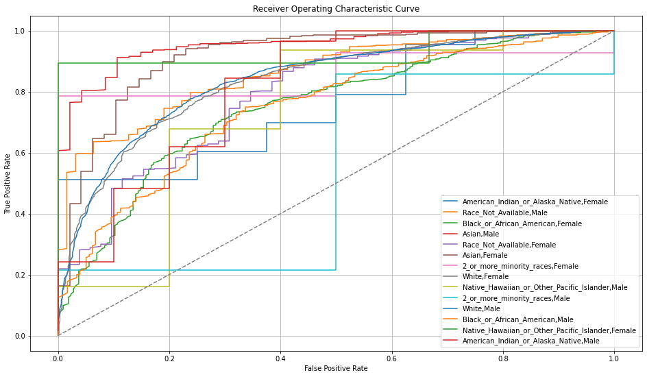
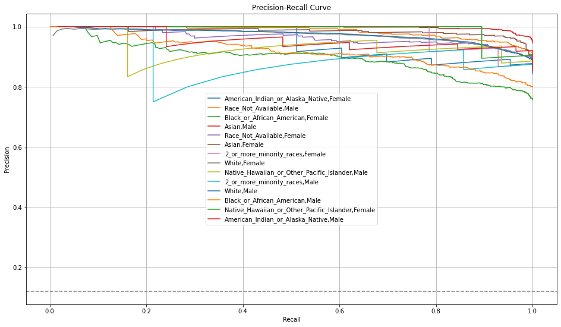
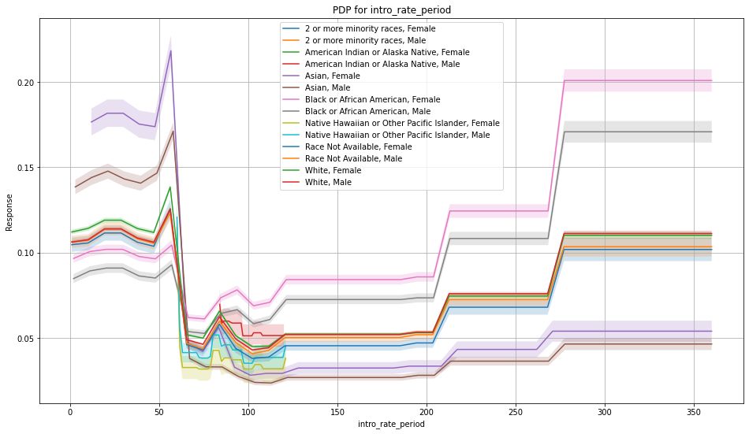
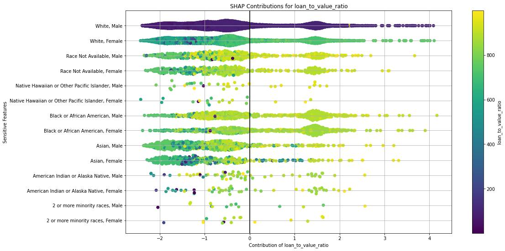

Admissible Machine Learning
===========================

We have developed new tools to aid in the design of *admissible learning algorithms* which are **efficient** (enjoy good predictive accuracy), **fair** (minimize discrimination against minority groups), and **interpretable** (provide mechanistic understanding) to the best possible extent. 

Admissible ML introduces two methodological tools: 

- **Infogram**, an "information diagram", is a new graphical feature-exploration method that facilitates the development of admissible machine learning methods. 
- **L-features**, which mitigate unfairness, offer ways to systematically discover the hidden problematic proxy features from a dataset. L-features are inadmissible features. 

The Infogram and Admissible Machine Learning bring a new research direction to machine learning interpretability. You can find the theoretical foundations and several real-life examples of its utility in the `Admissible ML <https://arxiv.org/abs/2108.07380>`__ paper. Below we introduce the concepts at a high level and provide an example using the H2O Infogram implementation.

Infogram
--------

The infogram is a graphical information-theoretic interpretability tool which allows the user to quickly spot the core, decision-making variables that uniquely and safely drive the response in supervised classification problems. The infogram can significantly cut down the number of predictors needed to build a model by identifying only the most valuable, admissible features. 

When protected variables such as race or gender are present in the data, the admissibility of a variable is determined by a safety and relevancy index which serves as a diagnostic tool for fairness. The safety of each feature can be quantified, and variables that are unsafe will be considered inadmissible. Models built using only admissible features will naturally be more interpretable given the reduced feature set. Admissible models are also less susceptible to overfitting and train faster, often while providing similar accuracy as models built using all available features.

Core Infogram
~~~~~~~~~~~~~

The infogram is an information-theoretic graphical tool which allows the user to quickly spot the "core" decision-making variables that are driving the response. Identifying the Core Set is a much more difficult undertaking than merely selecting the most predictive features. One of the main advantages of this method is that it works even in the presence of correlated features. There are additional benefits as well: machine learning models based on "core" features show improved stability, especially when there exists considerable correlation among the features.

The Core Infogram plots all the variables as points on a two-dimensional grid of **total vs net information**. The x-axis is **total information**, a measure of how much the variable drives the response (the more predictive, the higher the total information). The y-axis is **net information**, a measure of how unique the variable is. The top right quadrant of the infogram plot is the **admissible section**; the variables located in this quadrant are the **admissible features**. In the Core Infogram, the admissible features are the strongest, unique drivers of the response.

Fair Infogram: A Diagnostic Tool for Fairness
~~~~~~~~~~~~~~~~~~~~~~~~~~~~~~~~~~~~~~~~~~~~~

To improve fairness, you must remove any variables that are of a protected class.  It is bad practice, yet common, that modelers remove the protected variables alone.  With potentially correlated features (e.g. zip code, income, etc.) still present in the training data, unfair models can be trained, unbeknownst to the data scientist.  This is called "fairness through unawareness."  The proxy attributes (e.g. zip code, income, etc.) share some degree of correlation (information-sharing) with race, gender, or age, so they must be systematically identified and also removed from the set of training features.  

In the Fair Infogram, a non-protected predictor variable will be deemed "inadmissible" if it is found to possess little or no informational value beyond its use as a dummy for protected attributes when checked. 
The Fair Infogram plots all the features as points on a two-dimensional grid of **relevance vs safety**. The x-axis is the **relevance index**, a measure of how much the variable drives the response (the more predictive, the higher the relevance). The y-axis is the **safety index**, a measure of how much extra information the variable has that is not acquired through the protected variables. The **admissible features** are the strongest, safest drivers of the response.

The goal of this tool is to assist the identification of admissible features which have little or no information-overlap with protected attributes yet are reasonably predictive for the response.

.. note::
    
    Infogram should not be used to remove correlated columns. 

Infogram Interface
------------------

The interface is designed to be simple and aligned with the standard modeling interface in H2O.  If you provide a list of protected features with ``protected_columns``, it will produce a Fair Infogram instead of a Core Infogram.  The infogram object is a data object which also contains the plot, and the plot can be displayed by calling ``plot()`` on the infogram object.

.. tabs::
   .. code-tab:: r R

        # Generate and plot the infogram
        ig <- h2o.infogram(x = x, y = y, training_frame = train)
        plot(ig)

   .. code-tab:: python

        # Generate and plot the infogram
        ig = H2OInfogram()
        ig.train(x=x, y=y, training_frame=train)
        ig.plot()

Parameters
~~~~~~~~~~

The infogram function follows the standard modeling interface in H2O, where the user specifies the following data variables: ``x``, ``y``, ``training_frame``, and ``validation_frame``.  In addition to the standard set of arguments, the infogram features several new arguments, which are all optional:

- **algorithm**: Machine learning algorithm used to build the infogram. Options include:

 - ``"AUTO"`` (GBM). This is the default.
 - ``"deeplearning"`` (Deep Learning with default parameters)
 - ``"drf"`` (Random Forest with default parameters)
 - ``"gbm"`` (GBM with default parameters) 
 - ``"glm"`` (GLM with default parameters)
 - ``"xgboost"`` (if available, XGBoost with default parameters)

-  **algorithm_params**: With ``algorithm``, you can also specify a list of customized parameters for that algorithm.  For example if we use a GBM, we can specify ``list(max_depth = 10)`` in R and ``{'max_depth': 10}`` in Python.

- **protected_columns**: Columns that contain features that are sensitive and need to be protected (legally, or otherwise), if applicable.  These features (e.g. race, gender, etc.) should not drive the prediction of the response.

- **net_information_threshold**: A number between 0 and 1 representing a threshold for net information, defaulting to 0.1.  For a specific feature, if the net information is higher than this threshold, and the corresponding total information is also higher than the ``total_information_threshold``, that feature will be considered admissible.  The net information is the y-axis of the Core Infogram.

- **total_information_threshold**: A number between 0 and 1 representing a threshold for total information, defaulting to 0.1.  For a specific feature, if the total information is higher than this threshold, and the corresponding net information is also higher than the threshold ``net_information_threshold``, that feature will be considered admissible. The total information is the x-axis of the Core Infogram.

- **safety_index_threshold**: A number between 0 and 1 representing a threshold for the safety index, defaulting to 0.1.  This is only used when ``protected_columns`` is set by the user.  For a specific feature, if the safety index value is higher than this threshold, and the corresponding relevance index is also higher than the ``relevance_index_threshold``, that feature will be considered admissible.  The safety index is the y-axis of the Fair Infogram.

- **relevance_index_threshold**: A number between 0 and 1 representing a threshold for the relevance index, defaulting to 0.1.  This is only used when ``protected_columns`` is set by the user.  For a specific feature, if the relevance index value is higher than this threshold, and the corresponding safety index is also higher than the ``safety_index_threshold``, that feature will be considered admissible.  The relevance index is the x-axis of the Fair Infogram.

- **data_fraction**: The fraction of the training frame to use to build the infogram model. Defaults to 1.0, and any value between 0 and 1.0 is acceptable.

- **top_n_features**: An integer specifying the number of columns to evaluate in the infogram.  The columns are ranked by variable importance, and the top N are evaluated.  Defaults to 50.

Infogram Output
---------------

Infogram Plot
~~~~~~~~~~~~~

The infogram function produces a visual guide to admissibility of the features.  The visualization engine used in the R interface is the `ggplot2 <https://ggplot2.tidyverse.org/>`__ package and in Python, we use `matplotlib <https://matplotlib.org/>`__.  Here's an example of the Core Infogram for the Iris dataset.

**L-Features.** The highlighted L-shaped area contains features that are either irrelevant or redundant (or both).  Features in the L can be categorized as follows:

- top left: Contains highly unique information, but only a small amount of relevance.
- origin:  Contains low amount of unique information and low relevance.
- bottom right:  Contains low amount of unique information, but high relevance.

**Admissible Features.**  The features that are not in the L-Features set are the admissible features.  Admissible features in each quadrant have different attributes and value to the model:

- top right: Contains highly unique and relevant information.
- top left: Contains highly unique, but minimally relevant information.
- bottom right:  Contains low amount of unique information, but high relevance.

Infogram Data 
~~~~~~~~~~~~~

The infogram function produces an object of type ``H2OInfogram``, which contains several data elements and the plot object.  The most important objects are the following:

- **admissible_features:** A list of the admissible feature column names.

- **admissible_score:** A data frame storing various admissibility scores for each feature.  The rows of the admissible score frame are the features which were evaluated (this will max out at 50 rows/features if ``top_n_features`` is left at the default).  Core and Fair Infograms have different interpretations of conditional mutual information (CMI), so the CMI and relevance columns use different names between the two infogram types.  The frame is sorted by the admissible index column, with the most admissible features at the top of the table, for easy access.  The columns in the admissible score frame are:

    - **admissible**: Binary indicator of admissibility (1 = admissible, 0 = inadmissible).
    - **admissible_index**: The normalized distance between the origin and the (x, y) feature location on the infogram plot.  The rows of the data frame are sorted by this column. 
    - **total_information_index / relevance_index**: A normalized measure of the relevance of the feature to the response variable.  Higher is more relevant, more predictive, of the response.  For Core infograms, this is Total Information Index and for Fair Infograms, it's referred to as the Relevance Index.
    - **net_information_index / safety_index**: This column contains the normalized conditional mutual information (CMI).  In the case of a Core Infogram, CMI represents how unique the information in the feature is among all the predictors. For Fair Infograms, the safety index represents how safe a feature is to use, with respect to the specified protected columns.
    - **cmi_raw**: Raw conditional mutual information (CMI) value.

If the user provided a ``validation_frame`` or turned on cross-validation (``nfolds``) through the optional ``algorithm_params`` argument, then additional admissible score frames (valid and/or CV) will be generated and stored in the output in addition to the default admissible score frame, which is generated using the ``training_frame``.  Comparing the training and validation infograms could help discern whether there's overfitting. 

Code Examples
-------------

The R and Python code below is the quickest way to get started.  

Here's an example showing basic usage of the ``h2o.infogram()`` function in *R* and the ``H2OInfogram()`` method in *Python*.  Keep in mind that this code should be run in an environment that can support plots. 

Infogram
~~~~~~~~

Infogram Example: UCI Credit
^^^^^^^^^^^^^^^^^^^^^^^^^^^^

This example below uses a `UCI Credit <https://archive.ics.uci.edu/ml/datasets/default+of+credit+card+clients>`__ dataset from the UCI Machine Learning Repository.  It has 30k rows, representing customers, and 24 predictor variables, including several common `protected <https://www.consumerfinance.gov/fair-lending/>`__ attributes such as sex, age, and marital status.  This is a binary classification problem, aimed to estimate the probability of default in order to identify "credible or not credible" customers.

Along with the demographic variables that are included in this dataset, there's a number of payment history variables, including previous bill and payment amounts.  On the surface, you may assume that payment history is not correlated with protected variables, but as we will see in the example below, most of the payment history variables provide a hidden pathway through the protected variables to the response.  Therefore, even if you remove the protected variables during training, the resulting model can still be discriminatory if any non-admissible bill/payment variables are included.  This is Example 9 from the `Admissible ML <https://arxiv.org/abs/2108.07380>`__ paper.

The code below generates an infogram, and we plot the infogram and view the data in the admissible score frame.

.. tabs::
   .. code-tab:: r R

        library(h2o)

        h2o.init()
                
        # Import credit dataset
        f <- "https://h2o-public-test-data.s3.amazonaws.com/smalldata/admissibleml_test/taiwan_credit_card_uci_prep.csv"
        col_types <- list(by.col.name = c("SEX", "MARRIAGE", "default_payment_next_month"), 
                          types = c("factor", "factor", "factor"))
        df <- h2o.importFile(path = f, col.types = col_types)

        # We will split the data so that we can test/compare performance
        # of admissible vs non-admissible models later
        splits <- h2o.splitFrame(df, seed = 1)
        train <- splits[[1]]
        test <- splits[[2]]

        # Response column and predictor columns
        y <- "default_payment_next_month"
        x <- setdiff(names(train), y)

        # Protected columns
        pcols <- c("SEX", "MARRIAGE", "AGE")

        # Infogram
        ig <- h2o.infogram(y = y, x = x, training_frame = train, protected_columns = pcols)
        plot(ig)

        # Admissible score frame
        asf <- ig@admissible_score
        asf

   .. code-tab:: python

        import h2o
        from h2o.estimators.infogram import H2OInfogram

        h2o.init()

        # Import credit dataset
        f = "https://h2o-public-test-data.s3.amazonaws.com/smalldata/admissibleml_test/taiwan_credit_card_uci_prep.csv"
        col_types = {'SEX': "enum", 'MARRIAGE': "enum", 'default_payment_next_month': "enum"}
        df = h2o.import_file(path=f, col_types=col_types)

        # We will split the data so that we can test/compare performance
        # of admissible vs non-admissible models later
        train, test = df.split_frame(seed=1)

        # Response column and predictor columns
        y = "default_payment_next_month"
        x = train.columns
        x.remove(y)

        # Protected columns
        pcols = ["SEX", "MARRIAGE", "AGE"]        

        # Infogram
        ig = H2OInfogram(protected_columns=pcols)
        ig.train(y=y, x=x, training_frame=train)
        ig.plot()

        # Admissible score frame
        asf = ig.get_admissible_score_frame()
        asf

Here's the infogram which shows that ``PAY_0`` and ``PAY_2`` are the only admissible attributes, given the default thresholds.  Most of the bill or payment features either have low predictive value, or low predicted value and are unsafe.

Notice the position of ``PAY_0`` in the plot.  This indicates that this is a highly relevant and safe variable to use in the model.  The ``PAY_2`` variable is also reasonably safe to use, but it's not as predictive of the response.  The remaining variables are neither highly predictive of the response nor very safe to use in the model.  So, you may consider building a model using just the two admissible variables. To increase accuracy, you could add in some non-admissible, relevant variables; however, since this will be at a cost to safety, this is an important consideration. In many cases, the potential for increased accuracy might be minimal and not worthy of pursuing, or in the case where the safety is a strict requirement, the pursuit is simply not admissible.

Infogram Example: HMDA
^^^^^^^^^^^^^^^^^^^^^^

The `Home Mortgage Disclosure Act (HMDA) <https://en.wikipedia.org/wiki/Home_Mortgage_Disclosure_Act>`__ is a United States federal law that requires certain financial institutions to maintain, report, and publicly disclose loan-level information about mortgages. These data help show whether lenders are serving the housing needs of their communities; they give public officials information that helps them make decisions and policies; and they shed light on lending patterns that could be discriminatory. The public data are modified to protect applicant and borrower privacy.

The mortgage dataset analyzed here is a random sample of consumer-anonymized loans from the
`HMDA database <https://www.consumerfinance.gov/data-research/hmda/>`__. These loans are a subset of all originated mortgage loans in the 2018 HMDA data that were chosen to represent a relatively comparable group of consumer mortgages.

The dataset has 93k rows, representing people who applied for mortgages, and a variety of predictor variables, including several common `protected <https://www.consumerfinance.gov/fair-lending/>`__ attributes such as (derived) sex, ethnicity, race, as well as two columns (encodings) of age.  This is a binary classification problem, aimed at trying to predict whether an applicant will get a "high-priced" loan.  High-priced is defined as: the annual percentage rate (APR) that was charged was 150 basis points (1.5%) or more above a survey-based estimate of other similar loans offered around the time of the given loan.

The code below generates an infogram, and we plot the infogram and view the data in the admissible score frame.

.. tabs::
   .. code-tab:: r R

        library(h2o)

        h2o.init()
                
        # Import HMDA dataset
        f <- "https://h2o-public-test-data.s3.amazonaws.com/smalldata/admissibleml_test/hmda_lar_2018_sample.csv"
        col_types <- list(by.col.name = c("high_priced"), 
                          types = c("factor"))
        df <- h2o.importFile(path = f, col.types = col_types)

        # We will split the data so that we can test/compare performance
        # of admissible vs non-admissible models later
        splits <- h2o.splitFrame(df, ratios = 0.8, seed = 1)
        train <- splits[[1]]
        test <- splits[[2]]

        # Response column and predictor columns
        y <- "high_priced"
        x <- c("loan_amount",
               "loan_to_value_ratio",
               "loan_term",
               "intro_rate_period",
               "property_value",
               "income",
               "debt_to_income_ratio")

        # Protected columns
        pcols <- c("derived_ethnicity",
                   "derived_race", 
                   "derived_sex",
                   "applicant_age",
                   "applicant_age_above_62")

        # Infogram
        ig <- h2o.infogram(y = y, x = x, training_frame = train, protected_columns = pcols)
        plot(ig)

        # Admissible score frame
        asf <- ig@admissible_score
        asf

   .. code-tab:: python

        import h2o
        from h2o.estimators.infogram import H2OInfogram

        h2o.init()

        # Import HDMA dataset
        f = "https://h2o-public-test-data.s3.amazonaws.com/smalldata/admissibleml_test/hmda_lar_2018_sample.csv"
        col_types = {'high_priced': "enum"}
        df = h2o.import_file(path=f, col_types=col_types)

        # We will split the data so that we can test/compare performance
        # of admissible vs non-admissible models later
        train, test = df.split_frame(ratios=[0.8], seed=1)

        # Response column and predictor columns
        y = "high_priced"
        x =  ["loan_amount",
              "loan_to_value_ratio",
              "loan_term",
              "intro_rate_period",
              "property_value",
              "income",
              "debt_to_income_ratio"]

        # Protected columns
        pcols = ["derived_ethnicity",
                 "derived_race", 
                 "derived_sex",
                 "applicant_age",
                 "applicant_age_above_62"] 

        # Infogram
        ig = H2OInfogram(protected_columns=pcols)
        ig.train(y=y, x=x, training_frame=train)
        ig.plot()

        # Admissible score frame
        asf = ig.get_admissible_score_frame()
        asf

Here's the infogram which shows that ``loan_to_value_ratio`` , ``property_value`` and ``loan_amount`` are the only admissible attributes, given the default thresholds.  The three features, ``loan_term``, ``intro_rate_perio``, ``income`` and ``debt_to_income_ratio`` either have low predictive value, or low predicted value and are unsafe.

Notice the position of ``loan_to_value_ratio`` in the plot.  This indicates that this is a highly relevant and safe variable to use in the model.  The ``property_value`` and ``loan_amount`` variables are less safe to use and are somewhat predictive of the response and are also admissible under these settings.  The remaining variables are neither highly predictive of the response nor very safe to use in the model.  In the next two sections below, we will build models comparing admissible machine learning with models trained using inadmissible, un-safe features.

Admissible ML
~~~~~~~~~~~~~

We can use the admissible features to train a model.  When interpretability is the goal, you can train an interpretable model such as a decision tree, GLM, or GAM using the admissible features.  However, you can also train a more complex machine learning model such as a Gradient Boosting Machine (GBM) using only the admissible features.

Using the HMDA infogram example above, we can extend the infogram analysis to evaluate the accuracy between admissible and inadmissible models.  

.. tabs::
   .. code-tab:: r R

        # Building on the HMDA code as above, we train and evaluate an Admissible GBM and 
        # compare that with a GBM trained on all unprotected features:

        # Admissible columns
        acols <- ig@admissible_features

        # Unprotected columns
        ucols <- setdiff(x, pcols)

        # Train an Admissible GBM
        agbm <- h2o.gbm(x = acols, y = y, 
                        training_frame = train,
                        seed = 1)

        # Train a GBM on all unprotected features
        gbm <- h2o.gbm(x = ucols, y = y, 
                       training_frame = train,
                       seed = 1)

        # Admissible GBM test AUC
        h2o.auc(h2o.performance(agbm, test))
        # 0.8141841

        # Inadmissible GBM test AUC
        h2o.auc(h2o.performance(gbm, test))
        # 0.8347159

   .. code-tab:: python
 
        # Building on the HMDA code as above, we train and evaluate an Admissible GBM and 
        # compare that with a GBM trained on all unprotected features:

        # Admissible columns
        acols = ig.get_admissible_features()
        
        # Unprotected columns
        ucols = list(set(x).difference(pcols))
        
        # Train an Admissible GBM
        from h2o.estimators.gbm import H2OGradientBoostingEstimator
        agbm = H2OGradientBoostingEstimator(seed=1)
        agbm.train(x=acols, y=y, training_frame=train)

        # Train a GBM on all unprotected features
        gbm = H2OGradientBoostingEstimator(seed=1)
        gbm.train(x=ucols, y=y, training_frame=train)

        # Admissible GBM test AUC
        agbm.model_performance(test).auc()
        # 0.8141841

        # Inadmissible GBM test AUC
        gbm.model_performance(test).auc()
        # 0.8347159

Admissible AutoML
~~~~~~~~~~~~~~~~~

We can execute two AutoML runs to compare the accuracy of the models built on only admissible features, versus all the non-protected, unsafe features in the training set.  We give each run the same amount of time to execute.  There will be more models generated in the Admissible AutoML context, since the individual models train faster due to there being fewer features in the training set.  Note that since the speed of model training depends on your hardware, the results below will not be reproducible (below are the results for a 40-core machine).  Below we continue the HMDA example.

.. tabs::
   .. code-tab:: r R

        # Building on the HMDA infogram code, we execute AutoML with all unprotected features, 
        # and then we run AutoML with only the admissible features:

        # Admissible AutoML
        aaml <- h2o.automl(x = acols, y = y, 
                           training_frame = train,
                           max_runtime_secs = 60*10, 
                           seed = 1)

        # Unprotected AutoML
        aml <- h2o.automl(x = ucols, y = y, 
                          training_frame = train,
                          max_runtime_secs = 60*10, 
                          seed = 1)

        # Admissible AutoML test AUC
        h2o.auc(h2o.performance(aaml@leader, test))
        # 0.8264549

        # Unprotected AutoML test AUC
        h2o.auc(h2o.performance(aml@leader, test))                     
        # 0.8501232

   .. code-tab:: python
 
        # Building on the HMDA infogram code, we execute AutoML with all unprotected features, 
        # and then we run AutoML with only the admissible features:

        from h2o.automl import H2OAutoML
        
        # Admissible AutoML
        aaml = H2OAutoML(max_runtime_secs=60*10, seed=1)
        aaml.train(x=acols, y=y, training_frame=train)

        # Unprotected AutoML
        aml = H2OAutoML(max_runtime_secs=60*10, seed=1)
        aml.train(x=ucols, y=y, training_frame=train)

        # Admissible AutoML test AUC
        aaml.leader.model_performance(test).auc()
        # 0.8264549

        # Unprotected AutoML test AUC
        aml.leader.model_performance(test).auc()
        # 0.8501232

Utility Functions
~~~~~~~~~~~~~~~~~

In R, the output is stored in the slots of an ``H2OInfogram`` class object, so this data is easy to view and retrieve.  In Python, we provide several handy methods for the ``H2OInfogram`` class to help the user retrieve different pieces of information about admissibility.

.. tabs::
   .. code-tab:: r R

        # Get admissible features
        acols <- ig@admissible_features

        # Get admisisble score frame
        adf <- ig@admissible_score

        # View all slot names in the infogram object
        slotNames(ig)

   .. code-tab:: python

        # Get admissible features
        acols = ig.get_admissible_features()

        # Get admissible score frame
        adf = ig.get_admissible_score_frame()

        # Get relevance for admissible features (total information or relevance index)
        ig.get_admissible_relevance()

        # Get conditional mutual information (CMI) for admissible features
        # CMI in Core Infogram: net information
        # CMI in Fair Infogram: safety index
        ig.get_admissible_cmi()
        ig.get_admissible_cmi_raw()

Train Subset Models
^^^^^^^^^^^^^^^^^^^

Infogram allows you to build models on different feature subset which are selected using the infogram.
This approach can be viewed as iteratively decreasing the infogram's threshold values and building a model for each subset.

.. tabs::
   .. code-tab:: r R

        # Train AutoML's for different subsets with max_models = 13 and seed = 1
        da <- h2o.infogram_train_subset_models(ig, h2o.automl, train, test, y, protected_columns, reference, favorable_class, max_models = 13, seed = 1)

        # Shows extended leaderboard with basic fairness metrics
        print(da)

   .. code-tab:: python

        from h2o.automl import H2OAutoML

        # Train AutoML's for different subsets with max_models = 13 and seed = 1
        da = ig.train_subset_models(H2OAutoML, y, train, test, protected_columns, reference, favorable_class, max_models=1, seed=1)

        # Shows extended leaderboard with basic fairness metrics
        display(da)

The output from the ``train_subset_models`` is either an extended leaderboard (for Core Infogram) or a disparate impact analysis table.

Disparate Impact Analysis
^^^^^^^^^^^^^^^^^^^^^^^^^

Disparate impact analysis consists of the extended leaderboard and summary statistics from the ``fairness_metrics``.
These include variance of accuracy, corrected variance, and summary statistics (min, mean, median, max) from adverse
impact ratio (air), significant adverse impact ratio (calculated only using the intersections with p-value < ``alpha``), and p-value.

.. tabs::
   .. code-tab:: r R

        f <- "https://h2o-public-test-data.s3.amazonaws.com/smalldata/admissibleml_test/hmda_lar_2018_sample.csv"
        col_types <- list(by.col.name = c("high_priced"),
                          types = c("factor"))
        df <- h2o.importFile(path = f, col.types = col_types)

        splits <- h2o.splitFrame(df, ratios = 0.8, seed = 1)
        train <- splits[[1]]
        test <- splits[[2]]

        # Response column and predictor columns
        y <- "high_priced"
        x <- c("loan_amount",
               "loan_to_value_ratio",
               "loan_term",
               "intro_rate_period",
               "property_value",
               "income",
               "debt_to_income_ratio")

        # Fairness related information
        protected_columns <- c("derived_race", "derived_sex")
        reference <- c("White", "Male")
        favorable_class <- "0"

        # Train some models
        gbm1 <- h2o.gbm(x, y, train)
        gbm2 <- h2o.gbm(x, y, train, ntrees = 5)

        # Produce the disparate impact analysis table
        h2o.disparate_analysis(list(gbm1, gbm2), test, protected_columns = protected_columns,
                               reference = reference, favorable_class = favorable_class)

        # Or you can use H2OAutoML to generate set of models
        aml <- h2o.automl(x, y, training_frame = train, max_models = 3)

        # Produce the disparate impact analysis table
        h2o.disparate_analysis(aml, test, protected_columns = protected_columns,
                               reference = reference, favorable_class = favorable_class)

   .. code-tab:: python

        # Import HDMA dataset
        f = "https://h2o-public-test-data.s3.amazonaws.com/smalldata/admissibleml_test/hmda_lar_2018_sample.csv"
        col_types = {'high_priced': "enum"}
        df = h2o.import_file(path=f, col_types=col_types)

        train, test = df.split_frame(ratios=[0.8], seed=1)

        # Response column and predictor columns
        y = "high_priced"
        x =  ["loan_amount",
              "loan_to_value_ratio",
              "loan_term",
              "intro_rate_period",
              "property_value",
              "income",
              "debt_to_income_ratio"]

        # Fairness related information
        protected_columns = ["derived_race", "derived_sex"]
        reference = ["White", "Male"]
        favorable_class = "0"

        # Train some models
        gbm1 = H2OGradientBoostingEstimator()
        gbm1.train(x, y, train)

        gbm2 = H2OGradientBoostingEstimator(ntrees=5)
        gbm2.train(x, y, train)

        h2o.explanation.disparate_analysis([gbm1, gbm2], test, protected_columns, reference, favorable_class)

        # Or you can use H2OAutoML to generate a set of models
        aml = H2OAutoML(max_models=3)
        aml.train(x, y, train)
        h2o.explanation.disparate_analysis(aml, test, protected_columns, reference, favorable_class)

Fairness Metrics
^^^^^^^^^^^^^^^^

The information in the disparate impact analysis is aggregated for purposes of model selection. To get more details, you
can use the ``.fairness_metrics()``/``h2o.calculate_fairness_metrics()`` for a single model. This function returns a dictionary
with one ``overview`` frame and number of intersections frames with prefix ``thresholds_and_metrics_`` and the rest of the name
is an identifier for the intersection. These frames contain more information that can be used for creation Receiver Operation
Characteristics or Precision-Recall Curves.

.. tabs::
   .. code-tab:: r R

        f <- "https://h2o-public-test-data.s3.amazonaws.com/smalldata/admissibleml_test/hmda_lar_2018_sample.csv"
        col_types <- list(by.col.name = c("high_priced"),
                          types = c("factor"))
        df <- h2o.importFile(path = f, col.types = col_types)

        splits <- h2o.splitFrame(df, ratios = 0.8, seed = 1)
        train <- splits[[1]]
        test <- splits[[2]]

        # Response column and predictor columns
        y <- "high_priced"
        x <- c("loan_amount",
               "loan_to_value_ratio",
               "loan_term",
               "intro_rate_period",
               "property_value",
               "income",
               "debt_to_income_ratio")

        # Fairness related information
        protected_columns <- c("derived_race", "derived_sex")
        reference <- c("White", "Male")
        favorable_class <- "0"

        # Train some models
        gbm1 <- h2o.gbm(x, y, train)
        h2o.calculate_fairness_metrics(gbm1, test, protected_columns, reference, favorable_class)

   .. code-tab:: python

        # Import HDMA dataset
        f = "https://h2o-public-test-data.s3.amazonaws.com/smalldata/admissibleml_test/hmda_lar_2018_sample.csv"
        col_types = {'high_priced': "enum"}
        df = h2o.import_file(path=f, col_types=col_types)

        # We will split the data so that we can test/compare performance
        # of admissible vs non-admissible models later
        train, test = df.split_frame(ratios=[0.8], seed=1)

        # Response column and predictor columns
        y = "high_priced"
        x =  ["loan_amount",
              "loan_to_value_ratio",
              "loan_term",
              "intro_rate_period",
              "property_value",
              "income",
              "debt_to_income_ratio"]

        # Fairness related information
        protected_columns = ["derived_race", "derived_sex"]
        reference = ["White", "Male"]
        favorable_class = "0"

        # Train some models
        gbm1 = H2OGradientBoostingEstimator()
        gbm1.train(x, y, train)
        gbm1.fairness_metrics(test, protected_columns, reference, favorable_class)

Inspect Model Fairness
^^^^^^^^^^^^^^^^^^^^^^

Ensuring fairness of any particular model is hard and time consuming process as a start you can use the ``inspect_model_fairness``.
This will produce a similar output as H2O's model explainability but focused on model fairness.

First part of the output is related to different metrics for individual intersections (determined using the ``protected_columns``).
The metrics are model performance metrics (``AUC``, ``AUCPR``, ``F1``, ...), size of the intersection relative (``selectedRatio``) and absolute (``total``),
model performance metrics related to the reference group (``AIR_AUC``, ``AIR_AUCPR``, ...), and ``p-value`` which is obtained
by using Fisher’s exact test or G-test (depending on the size of the intersections) to test that being selected (positive response) is independent to being
in the reference group or a particular protected group.

Then it produces bar plots that visualize those aforementioned metrics.

Then ROC and Precision-Recall Curve plots are produced.
These plots can be produced using ``model.fair_roc_plot``/``h2o.fair_roc_plot`` and ``model.fair_pr_plot``/``h2o.fair_pr_plot`` respectively.

After that permutation variable importance is calculated to get some ordering of the features that are subsequently used in
PDP and for tree-based models SHAP plots.

The PDP plots show one curve per intersection. Ideally, the lines should be overlapping as those intersections are created just based of the protected columns.
This kind of PDP plot can be created using ``model.fair_pd_plot``/``h2o.fair_pd_plot``.

The SHAP plots show one row per intersection. Each dot in SHAP plot represents one observation (row).
This kind of SHAP plot can be obtained using ``model.fair_shap_plot``/``h2o.fair_shap_plot``.

.. tabs::
   .. code-tab:: r R

        f <- "https://h2o-public-test-data.s3.amazonaws.com/smalldata/admissibleml_test/hmda_lar_2018_sample.csv"
        col_types <- list(by.col.name = c("high_priced"),
                          types = c("factor"))
        df <- h2o.importFile(path = f, col.types = col_types)

        splits <- h2o.splitFrame(df, ratios = 0.8, seed = 1)
        train <- splits[[1]]
        test <- splits[[2]]

        # Response column and predictor columns
        y <- "high_priced"
        x <- c("loan_amount",
               "loan_to_value_ratio",
               "loan_term",
               "intro_rate_period",
               "property_value",
               "income",
               "debt_to_income_ratio")

        # Fairness related information
        protected_columns <- c("derived_race", "derived_sex")
        reference <- c("White", "Male")
        favorable_class <- "0"

        # Train some models
        gbm1 <- h2o.gbm(x, y, train)
        h2o.inspect_model_fairness(gbm1, test, protected_columns, reference, favorable_class)

   .. code-tab:: python

        # Import HDMA dataset
        f = "https://h2o-public-test-data.s3.amazonaws.com/smalldata/admissibleml_test/hmda_lar_2018_sample.csv"
        col_types = {'high_priced': "enum"}
        df = h2o.import_file(path=f, col_types=col_types)

        # We will split the data so that we can test/compare performance
        # of admissible vs non-admissible models later
        train, test = df.split_frame(ratios=[0.8], seed=1)

        # Response column and predictor columns
        y = "high_priced"
        x =  ["loan_amount",
              "loan_to_value_ratio",
              "loan_term",
              "intro_rate_period",
              "property_value",
              "income",
              "debt_to_income_ratio"]

        # Fairness related information
        protected_columns = ["derived_race", "derived_sex"]
        reference = ["White", "Male"]
        favorable_class = "0"

        # Train some models
        gbm1 = H2OGradientBoostingEstimator()
        gbm1.train(x, y, train)
        gbm1.inspect_model_fairness(test, protected_columns, reference, favorable_class)

Here you can see the output from `Python <admissibleml-code-examples/Train-model-subsets-Python.html>`_ (`.ipynb <admissibleml-code-examples/Train-model-subsets-Python.ipynb>`_)
and `R <admissibleml-code-examples/Train-model-subsets-R.html>`_ (`.Rmd <admissibleml-code-examples/Train-model-subsets-R.Rmd>`_).

Glossary
--------

- **Admissible Features**: These variables have two key characteristics: they are highly predictive and at the same time safe to use in the sense that they share very little predictive information with any protected attributes (e.g. age, gender, race).
- **Admissible Machine Learning**: Admissible machine learning is a new information-theoretic learning framework which aims to create models that can balance fairness, interpretability, and accuracy.
- **Conditional Mutual Information (CMI)**: CMI measures the expected value of the mutual information of two random variables, given the value of a third.  In the case of the Core Infogram, the CMI measures the net predictive information, and in the Fair context, we refer to this as the relevance index.  CMI captures multivariate non-linear conditional dependencies between the variables in a completely non-parametric manner.  The y-axis of the infogram is Normalized CMI.
- **Core Features or Core Set**: In the Core Infogram, these are key features that are driving the response, without redundancy.  High relevance, low redundancy. 
- **Inadmissible Features (L-Features)**: The highlighted L-shaped area in the Infogram contains features that are either irrelevant or redundant. In the case of the Fair Infogram, these features process little or no informational value beyond their use as a dummy for protected characteristics.
- **Irrelevant Features**: In the Core Infogram, these are the features on the vertical side of the L, which have low total information (relevance to the response).
- **Protected Features**:  User-defined features that are sensitive and need to be protected (legally, or otherwise).  These features (e.g. race, gender, etc.) should not drive the prediction of the response.
- **Redundant Features**: In the Core Infogram, these are the features on the bottom side of the L, which have a low amount of net (unique) information to offer.
- **Relevance**: Relevance of the feature to the response variable. Higher is more relevant, more predictive, of the response. For Core Infograms, we refer to this as Total Information Index and for Fair Infograms, it's referred to as the Relevance Index.  This is the x-axis of the infogram.
- **Relevance Index**: A normalized measure of the relevance of the feature to the response variable. Higher is more relevant, more predictive, of the response.
- **Safety Index**: For Fair Infograms, the safety index represents how safe a feature is to use, with respect to the specified protected columns. This quantifies how much extra information each feature carries for the response that is not acquired through the sensitive variables.  Higher is safer. 

References
----------

Subhadeep Mukhopadhyay. *InfoGram and Admissible Machine Learning*, August 2021. `arXiv URL <https://arxiv.org/abs/2108.07380>`__.

LUM, Kristian, ZHANG, Yunfeng and BOWER, Amanda. *De-biasing “bias” measurement*, June 2022. `arXiv Url <https://arxiv.org/abs/2205.05770>`__.

HARDT, Moritz, PRICE, Eric and SREBRO, Nathan. *Equality of Opportunity in Supervised Learning*, October 2016. `arXiv Url <https://arxiv.org/abs/1610.02413>`__.
