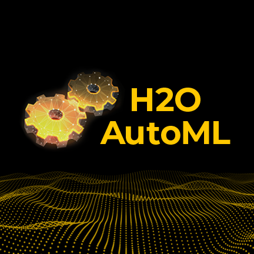
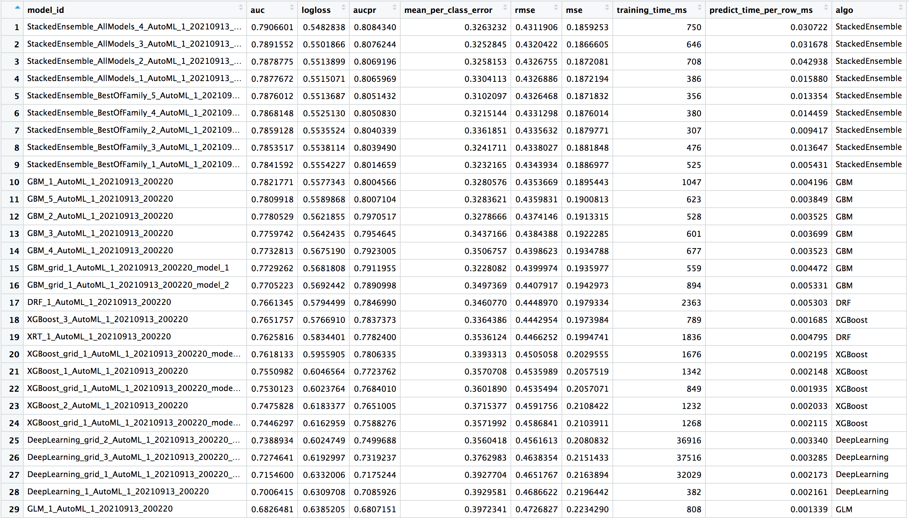
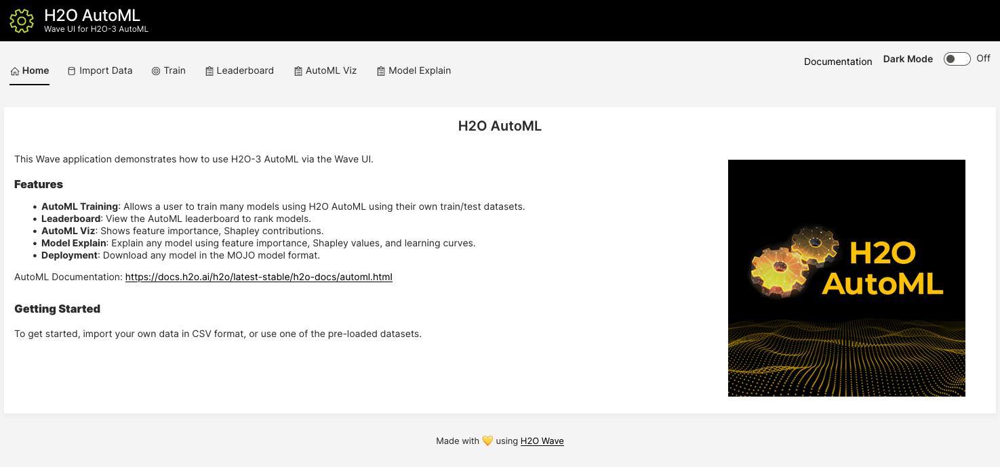
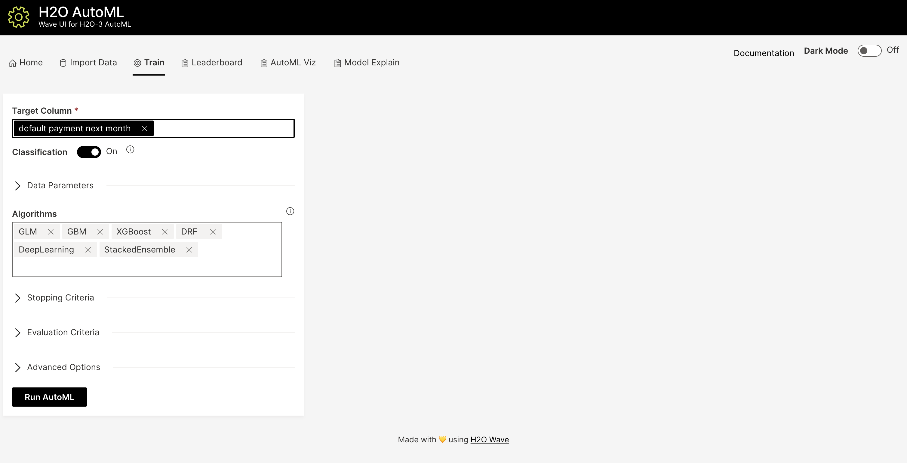
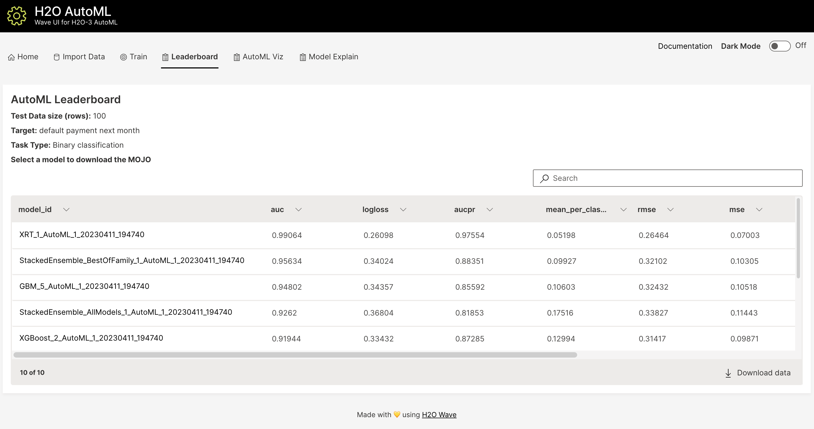
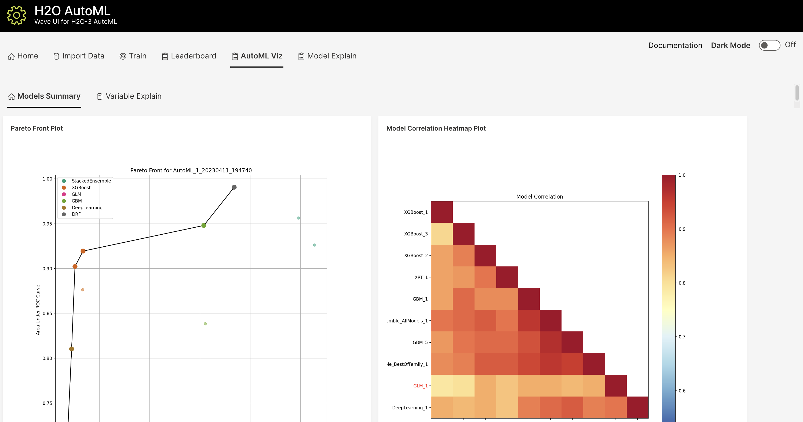

H2O AutoML: Automatic Machine Learning
==================================

In recent years, the demand for machine learning experts has outpaced the supply, despite the surge of people entering the field.  To address this gap, there have been big strides in the development of user-friendly machine learning software that can be used by non-experts.  The first steps toward simplifying machine learning involved developing simple, unified interfaces to a variety of machine learning algorithms (e.g. H2O).

Although H2O has made it easy for non-experts to experiment with machine learning, there is still a fair bit of knowledge and background in data science that is required to produce high-performing machine learning models.  Deep Neural Networks in particular are notoriously difficult for a non-expert to tune properly.  In order for machine learning software to truly be accessible to non-experts, we have designed an easy-to-use interface which automates the process of training a large selection of candidate models.  H2O's AutoML can also be a helpful tool for the advanced user, by providing a simple wrapper function that performs a large number of modeling-related tasks that would typically require many lines of code, and by freeing up their time to focus on other aspects of the data science pipeline tasks such as data-preprocessing, feature engineering and model deployment.

H2O's AutoML can be used for automating the machine learning workflow, which includes automatic training and tuning of many models within a user-specified time-limit.

H2O offers a number of `model explainability <http://docs.h2o.ai/h2o/latest-stable/h2o-docs/explain.html>`__ methods that apply to AutoML objects (groups of models), as well as individual models (e.g. leader model).  Explanations can be generated automatically with a single function call, providing a simple interface to exploring and explaining the AutoML models.

AutoML Interface
----------------

The H2O AutoML interface is designed to have as few parameters as possible so that all the user needs to do is point to their dataset, identify the response column and optionally specify a time constraint or limit on the number of total models trained.  Below are the parameters that can be set by the user in the R and Python interfaces. See the `Web UI via H2O Wave <#web-ui-via-h2o-wave>`__ section below for information on how to use the H2O Wave web interface for AutoML.

In both the R and Python API, AutoML uses the same data-related arguments, ``x``, ``y``, ``training_frame``, ``validation_frame``, as the other H2O algorithms.  Most of the time, all you'll need to do is specify the data arguments. You can then configure values for ``max_runtime_secs`` and/or ``max_models`` to set explicit time or number-of-model limits on your run.  

Required Parameters
~~~~~~~~~~~~~~~~~~~

Required Data Parameters
''''''''''''''''''''''''

- `y <data-science/algo-params/y.html>`__: This argument is the name (or index) of the response column. 

- `training_frame <data-science/algo-params/training_frame.html>`__: Specifies the training set. 

Required Stopping Parameters
''''''''''''''''''''''''''''

One of the following stopping strategies (time or number-of-model based) must be specified.  When both options are set, then the AutoML run will stop as soon as it hits one of either When both options are set, then the AutoML run will stop as soon as it hits either of these limits.

- `max_runtime_secs <data-science/algo-params/max_runtime_secs.html>`__: This argument specifies the maximum time that the AutoML process will run for. The default is 0 (no limit), but dynamically sets to 1 hour if none of ``max_runtime_secs`` and ``max_models`` are specified by the user.

- `max_models <data-science/algo-params/max_models.html>`__: Specify the maximum number of models to build in an AutoML run, excluding the Stacked Ensemble models.  Defaults to ``NULL/None``. Always set this parameter to ensure AutoML reproducibility: all models are then trained until convergence and none is constrained by a time budget.

Optional Parameters
~~~~~~~~~~~~~~~~~~~

Optional Data Parameters
''''''''''''''''''''''''

- `x <data-science/algo-params/x.html>`__: A list/vector of predictor column names or indexes.  This argument only needs to be specified if the user wants to exclude columns from the set of predictors.  If all columns (other than the response) should be used in prediction, then this does not need to be set.

- `validation_frame <data-science/algo-params/validation_frame.html>`__: This argument is ignored unless ``nfolds == 0``, in which a validation frame can be specified and used for early stopping of individual models and early stopping of the grid searches (unless ``max_models`` or ``max_runtime_secs`` overrides metric-based early stopping).  By default and when ``nfolds > 1``, cross-validation metrics will be used for early stopping and thus ``validation_frame`` will be ignored.

- **leaderboard_frame**: This argument allows the user to specify a particular data frame to use to score and rank models on the leaderboard. This frame will not be used for anything besides leaderboard scoring. If a leaderboard frame is not specified by the user, then the leaderboard will use cross-validation metrics instead, or if cross-validation is turned off by setting ``nfolds = 0``, then a leaderboard frame will be generated automatically from the training frame.

- `blending_frame <data-science/algo-params/blending_frame.html>`__: Specifies a frame to be used for computing the predictions that serve as the training frame for the Stacked Ensemble models metalearner. If provided, all Stacked Ensembles produced by AutoML will be trained using Blending (a.k.a. Holdout Stacking) instead of the default Stacking method based on cross-validation.

- `fold_column <data-science/algo-params/fold_column.html>`__: Specifies a column with cross-validation fold index assignment per observation. This is used to override the default, randomized, 5-fold cross-validation scheme for individual models in the AutoML run.

- `weights_column <data-science/algo-params/weights_column.html>`__: Specifies a column with observation weights. Giving some observation a weight of zero is equivalent to excluding it from the dataset; giving an observation a relative weight of 2 is equivalent to repeating that row twice. Negative weights are not allowed.

Optional Miscellaneous Parameters
'''''''''''''''''''''''''''''''''

- `nfolds <data-science/algo-params/nfolds.html>`__:  Specify a value >= 2 for the number of folds for k-fold cross-validation of the models in the AutoML run or specify "-1" to let AutoML choose if k-fold cross-validation or blending mode should be used. Blending mode will use part of ``training_frame`` (if no ``blending_frame`` is provided) to train Stacked Ensembles. Use 0 to disable cross-validation; this will also disable Stacked Ensembles (thus decreasing the overall best model performance). This value defaults to "-1".

- `balance_classes <data-science/algo-params/balance_classes.html>`__: Specify whether to oversample the minority classes to balance the class distribution. This option is not enabled by default and can increase the data frame size. This option is only applicable for classification. If the oversampled size of the dataset exceeds the maximum size calculated using the ``max_after_balance_size parameter``, then the majority classes will be undersampled to satisfy the size limit.

- `class_sampling_factors <data-science/algo-params/class_sampling_factors.html>`__: Specify the per-class (in lexicographical order) over/under-sampling ratios. By default, these ratios are automatically computed during training to obtain the class balance. Note that this requires ``balance_classes`` set to True.

- `max_after_balance_size <data-science/algo-params/max_after_balance_size.html>`__: Specify the maximum relative size of the training data after balancing class counts (**balance\_classes** must be enabled). Defaults to 5.0.  (The value can be less than 1.0).

- `max_runtime_secs_per_model <data-science/algo-params/max_runtime_secs_per_model.html>`__: Specify the max amount of time dedicated to the training of each individual model in the AutoML run. Defaults to 0 (disabled). Note that models constrained by a time budget are not guaranteed reproducible.

- `stopping_metric <data-science/algo-params/stopping_metric.html>`__: Specify the metric to use for early stopping. Defaults to ``AUTO``. The available options are:
    
    - ``AUTO``: This defaults to ``logloss`` for classification and ``deviance`` for regression.
    - ``deviance`` (mean residual deviance)
    - ``logloss``
    - ``MSE``
    - ``RMSE``
    - ``MAE``
    - ``RMSLE``
    - ``AUC`` (area under the ROC curve)
    - ``AUCPR`` (area under the Precision-Recall curve)
    - ``lift_top_group``
    - ``misclassification``
    - ``mean_per_class_error``

- `stopping_tolerance <data-science/algo-params/stopping_tolerance.html>`__: This option specifies the relative tolerance for the metric-based stopping criterion to stop a grid search and the training of individual models within the AutoML run. This value defaults to 0.001 if the dataset is at least 1 million rows; otherwise it defaults to a bigger value determined by the size of the dataset and the non-NA-rate.  In that case, the value is computed as 1/sqrt(nrows * non-NA-rate).

- `stopping_rounds <data-science/algo-params/stopping_rounds.html>`__: This argument is used to stop model training when the stopping metric (e.g. AUC) doesn’t improve for this specified number of training rounds, based on a simple moving average.   In the context of AutoML, this controls early stopping both within the random grid searches as well as the individual models.  Defaults to 3 and must be an non-negative integer.  To disable early stopping altogether, set this to 0. 

- `sort_metric <data-science/algo-params/sort_metric.html>`__: Specifies the metric used to sort the Leaderboard by at the end of an AutoML run. Available options include:

    - ``AUTO``: This defaults to ``AUC`` for binary classification, ``mean_per_class_error`` for multinomial classification, and ``deviance`` for regression.
    - ``deviance`` (mean residual deviance)
    - ``logloss``
    - ``MSE``
    - ``RMSE``
    - ``MAE``
    - ``RMSLE``
    - ``AUC`` (area under the ROC curve)
    - ``AUCPR`` (area under the Precision-Recall curve)
    - ``mean_per_class_error``

- `seed <data-science/algo-params/seed.html>`__: Integer. Set a seed for reproducibility. AutoML can only guarantee reproducibility under certain conditions.  H2O Deep Learning models are not reproducible by default for performance reasons, so if the user requires reproducibility, then ``exclude_algos`` must contain ``"DeepLearning"``.  In addition ``max_models`` must be used because ``max_runtime_secs`` is resource limited, meaning that if the available compute resources are not the same between runs, AutoML may be able to train more models on one run vs another.  Defaults to ``NULL/None``.

- **project_name**: Character string to identify an AutoML project. Defaults to ``NULL/None``, which means a project name will be auto-generated based on the training frame ID.  More models can be trained and added to an existing AutoML project by specifying the same project name in multiple calls to the AutoML function (as long as the same training frame is used in subsequent runs).

- `exclude_algos <data-science/algo-params/exclude_algos.html>`__: A list/vector of character strings naming the algorithms to skip during the model-building phase.  An example use is ``exclude_algos = ["GLM", "DeepLearning", "DRF"]`` in Python or ``exclude_algos = c("GLM", "DeepLearning", "DRF")`` in R.  Defaults to ``None/NULL``, which means that all appropriate H2O algorithms will be used if the search stopping criteria allows and if the ``include_algos`` option is not specified. This option is mutually exclusive with ``include_algos``. See ``include_algos`` below for the list of available options.

- `include_algos <data-science/algo-params/include_algos.html>`__: A list/vector of character strings naming the algorithms to include during the model-building phase.  An example use is ``include_algos = ["GLM", "DeepLearning", "DRF"]`` in Python or ``include_algos = c("GLM", "DeepLearning", "DRF")`` in R.  Defaults to ``None/NULL``, which means that all appropriate H2O algorithms will be used if the search stopping criteria allows and if no algorithms are specified in ``exclude_algos``. This option is mutually exclusive with ``exclude_algos``. The available algorithms are:

    - ``DRF`` (This includes both the Distributed Random Forest (DRF) and Extremely Randomized Trees (XRT) models. Refer to the :ref:`xrt` section in the DRF chapter and the `histogram_type <http://docs.h2o.ai/h2o/latest-stable/h2o-docs/data-science/algo-params/histogram_type.html>`__ parameter description for more information.)
    - ``GLM`` (Generalized Linear Model with regularization)
    - ``XGBoost``  (XGBoost GBM)
    - ``GBM``  (H2O GBM)
    - ``DeepLearning``  (Fully-connected multi-layer artificial neural network)
    - ``StackedEnsemble`` (Stacked Ensembles, includes an ensemble of all the base models and ensembles using subsets of the base models)

- **modeling_plan**: The list of modeling steps to be used by the AutoML engine. (They may not all get executed, depending on other constraints.)

- **preprocessing**: The list of preprocessing steps to run. Only ``["target_encoding"]`` is currently supported.  There is more information about how Target Encoding is automatically applied `here <https://github.com/h2oai/h2o-3/issues/7862>`__.  Experimental.

- **exploitation_ratio**: Specify the budget ratio (between 0 and 1) dedicated to the exploitation (vs exploration) phase. By default, the exploitation phase is disabled (exploitation_ratio=0) as this is still experimental; to activate it, it is recommended to try a ratio around 0.1. Note that the current exploitation phase only tries to fine-tune the best XGBoost and the best GBM found during exploration.  Experimental.

- `monotone_constraints <data-science/algo-params/monotone_constraints.html>`__: A mapping that represents monotonic constraints. Use +1 to enforce an increasing constraint and -1 to specify a decreasing constraint. 

- `keep_cross_validation_predictions <data-science/algo-params/keep_cross_validation_predictions.html>`__: Specify whether to keep the predictions of the cross-validation predictions. This needs to be set to TRUE if running the same AutoML object for repeated runs because CV predictions are required to build additional Stacked Ensemble models in AutoML. This option defaults to FALSE.

- `keep_cross_validation_models <data-science/algo-params/keep_cross_validation_models.html>`__: Specify whether to keep the cross-validated models. Keeping cross-validation models may consume significantly more memory in the H2O cluster. This option defaults to FALSE.

- `keep_cross_validation_fold_assignment <data-science/algo-params/keep_cross_validation_fold_assignment.html>`__: Enable this option to preserve the cross-validation fold assignment.  Defaults to FALSE.

- **verbosity**: (Optional: Python and R only) The verbosity of the backend messages printed during training. Must be one of ``"debug", "info", "warn"``. Defaults to ``NULL/None`` (client logging disabled).

-  `export_checkpoints_dir <data-science/algo-params/export_checkpoints_dir.html>`__: Specify a directory to which generated models will automatically be exported.

Notes
~~~~~

Validation Options
''''''''''''''''''

If the user turns off cross-validation by setting ``nfolds == 0``, then cross-validation metrics will not be available to populate the leaderboard.  In this case, we need to make sure there is a holdout frame (i.e. the "leaderboard frame") to score the models on so that we can generate model performance metrics for the leaderboard.  Without cross-validation, we will also require a validation frame to be used for early stopping on the models.  Therefore, if either of these frames are not provided by the user, they will be automatically partitioned from the training data.  If either frame is missing, 10% of the training data will be used to create a missing frame (if both are missing then a total of 20% of the training data will be used to create a 10% validation and 10% leaderboard frame).

XGBoost Memory Requirements
'''''''''''''''''''''''''''

XGBoost, which is included in H2O as a third party library, requires its own memory outside the H2O (Java) cluster. When running AutoML with XGBoost (it is included by default), be sure you allow H2O no more than 2/3 of the total available RAM.  Example:  If you have 60G RAM, use ``h2o.init(max_mem_size = "40G")``, leaving 20G for XGBoost.

Scikit-learn Compatibility
''''''''''''''''''''''''''

``H2OAutoML`` can interact with the ``h2o.sklearn`` module. The ``h2o.sklearn`` module exposes 2 wrappers for ``H2OAutoML`` (``H2OAutoMLClassifier`` and ``H2OAutoMLRegressor``), which expose the standard API familiar to ``sklearn`` users: ``fit``, ``predict``, ``fit_predict``, ``score``, ``get_params``, and ``set_params``. It accepts various formats as input data (H2OFrame, ``numpy`` array, ``pandas`` Dataframe) which allows them to be combined with pure ``sklearn`` components in pipelines. For an example using ``H2OAutoML`` with the ``h2o.sklearn`` module, click `here <https://github.com/h2oai/h2o-tutorials/blob/master/tutorials/sklearn-integration/H2OAutoML_as_sklearn_estimator.ipynb>`__.

Explainability
--------------

AutoML objects are fully supported though the `H2O Model Explainability <http://docs.h2o.ai/h2o/latest-stable/h2o-docs/explain.html>`__ interface.  A large number of multi-model comparison and single model (AutoML leader) plots can be generated automatically with a single call to ``h2o.explain()``.  We invite you to learn more at page linked above.

Code Examples
-------------

Training
~~~~~~~~

Here’s an example showing basic usage of the ``h2o.automl()`` function in *R* and the ``H2OAutoML`` class in *Python*.  For demonstration purposes only, we explicitly specify the ``x`` argument, even though on this dataset, that's not required.  With this dataset, the set of predictors is all columns other than the response.  Like other H2O algorithms, the default value of ``x`` is "all columns, excluding ``y``", so that will produce the same result.

.. tabs::
   .. code-tab:: r R

        library(h2o)

        # Start the H2O cluster (locally)
        h2o.init()

        # Import a sample binary outcome train/test set into H2O
        train <- h2o.importFile("https://s3.amazonaws.com/h2o-public-test-data/smalldata/higgs/higgs_train_10k.csv")
        test <- h2o.importFile("https://s3.amazonaws.com/h2o-public-test-data/smalldata/higgs/higgs_test_5k.csv")

        # Identify predictors and response
        y <- "response"
        x <- setdiff(names(train), y)

        # For binary classification, response should be a factor
        train[, y] <- as.factor(train[, y])
        test[, y] <- as.factor(test[, y])

        # Run AutoML for 20 base models
        aml <- h2o.automl(x = x, y = y, 
                          training_frame = train,
                          max_models = 20,
                          seed = 1)

        # View the AutoML Leaderboard
        lb <- aml@leaderboard
        print(lb, n = nrow(lb))  # Print all rows instead of default (6 rows)

        #                                               model_id       auc   logloss mean_per_class_error      rmse       mse
        # 1     StackedEnsemble_AllModels_AutoML_20181210_150447 0.7895453 0.5516022            0.3250365 0.4323464 0.1869234
        # 2  StackedEnsemble_BestOfFamily_AutoML_20181210_150447 0.7882530 0.5526024            0.3239841 0.4328491 0.1873584
        # 3                     XGBoost_1_AutoML_20181210_150447 0.7846510 0.5575305            0.3254707 0.4349489 0.1891806
        # 4        XGBoost_grid_1_AutoML_20181210_150447_model_4 0.7835232 0.5578542            0.3188188 0.4352486 0.1894413
        # 5        XGBoost_grid_1_AutoML_20181210_150447_model_3 0.7830043 0.5596125            0.3250808 0.4357077 0.1898412
        # 6                     XGBoost_2_AutoML_20181210_150447 0.7813603 0.5588797            0.3470738 0.4359074 0.1900153
        # 7                     XGBoost_3_AutoML_20181210_150447 0.7808475 0.5595886            0.3307386 0.4361295 0.1902090
        # 8                         GBM_5_AutoML_20181210_150447 0.7808366 0.5599029            0.3408479 0.4361915 0.1902630
        # 9                         GBM_2_AutoML_20181210_150447 0.7800361 0.5598060            0.3399258 0.4364149 0.1904580
        # 10                        GBM_1_AutoML_20181210_150447 0.7798274 0.5608570            0.3350957 0.4366159 0.1906335
        # 11                        GBM_3_AutoML_20181210_150447 0.7786685 0.5617903            0.3255378 0.4371886 0.1911339
        # 12       XGBoost_grid_1_AutoML_20181210_150447_model_2 0.7744105 0.5750165            0.3228112 0.4427003 0.1959836
        # 13                        GBM_4_AutoML_20181210_150447 0.7714260 0.5697120            0.3374203 0.4410703 0.1945430
        # 14           GBM_grid_1_AutoML_20181210_150447_model_1 0.7697524 0.5725826            0.3443314 0.4424524 0.1957641
        # 15           GBM_grid_1_AutoML_20181210_150447_model_2 0.7543664 0.9185673            0.3558550 0.4966377 0.2466490
        # 16                        DRF_1_AutoML_20181210_150447 0.7428924 0.5958832            0.3554027 0.4527742 0.2050045
        # 17                        XRT_1_AutoML_20181210_150447 0.7420910 0.5993457            0.3565826 0.4531168 0.2053148
        # 18  DeepLearning_grid_1_AutoML_20181210_150447_model_2 0.7388505 0.6012286            0.3695292 0.4555318 0.2075092
        # 19       XGBoost_grid_1_AutoML_20181210_150447_model_1 0.7257836 0.6013126            0.3820490 0.4565541 0.2084417
        # 20               DeepLearning_1_AutoML_20181210_150447 0.6979292 0.6339217            0.3979403 0.4692373 0.2201836
        # 21  DeepLearning_grid_1_AutoML_20181210_150447_model_1 0.6847773 0.6694364            0.4081802 0.4799664 0.2303678
        # 22           GLM_grid_1_AutoML_20181210_150447_model_1 0.6826481 0.6385205            0.3972341 0.4726827 0.2234290
        # 
        # [22 rows x 6 columns] 

        # The leader model is stored here
        aml@leader

   .. code-tab:: python

        import h2o
        from h2o.automl import H2OAutoML

        # Start the H2O cluster (locally)
        h2o.init()

        # Import a sample binary outcome train/test set into H2O
        train = h2o.import_file("https://s3.amazonaws.com/h2o-public-test-data/smalldata/higgs/higgs_train_10k.csv")
        test = h2o.import_file("https://s3.amazonaws.com/h2o-public-test-data/smalldata/higgs/higgs_test_5k.csv")

        # Identify predictors and response
        x = train.columns
        y = "response"
        x.remove(y)

        # For binary classification, response should be a factor
        train[y] = train[y].asfactor()
        test[y] = test[y].asfactor()
        
        # Run AutoML for 20 base models
        aml = H2OAutoML(max_models=20, seed=1)
        aml.train(x=x, y=y, training_frame=train)

        # View the AutoML Leaderboard
        lb = aml.leaderboard
        lb.head(rows=lb.nrows)  # Print all rows instead of default (10 rows)

        # model_id                                                  auc    logloss    mean_per_class_error      rmse       mse
        # ---------------------------------------------------  --------  ---------  ----------------------  --------  --------
        # StackedEnsemble_AllModels_AutoML_20181212_105540     0.789801   0.551109                0.333174  0.43211   0.186719
        # StackedEnsemble_BestOfFamily_AutoML_20181212_105540  0.788425   0.552145                0.323192  0.432625  0.187165
        # XGBoost_1_AutoML_20181212_105540                     0.784651   0.55753                 0.325471  0.434949  0.189181
        # XGBoost_grid_1_AutoML_20181212_105540_model_4        0.783523   0.557854                0.318819  0.435249  0.189441
        # XGBoost_grid_1_AutoML_20181212_105540_model_3        0.783004   0.559613                0.325081  0.435708  0.189841
        # XGBoost_2_AutoML_20181212_105540                     0.78136    0.55888                 0.347074  0.435907  0.190015
        # XGBoost_3_AutoML_20181212_105540                     0.780847   0.559589                0.330739  0.43613   0.190209
        # GBM_5_AutoML_20181212_105540                         0.780837   0.559903                0.340848  0.436191  0.190263
        # GBM_2_AutoML_20181212_105540                         0.780036   0.559806                0.339926  0.436415  0.190458
        # GBM_1_AutoML_20181212_105540                         0.779827   0.560857                0.335096  0.436616  0.190633
        # GBM_3_AutoML_20181212_105540                         0.778669   0.56179                 0.325538  0.437189  0.191134
        # XGBoost_grid_1_AutoML_20181212_105540_model_2        0.774411   0.575017                0.322811  0.4427    0.195984
        # GBM_4_AutoML_20181212_105540                         0.771426   0.569712                0.33742   0.44107   0.194543
        # GBM_grid_1_AutoML_20181212_105540_model_1            0.769752   0.572583                0.344331  0.442452  0.195764
        # GBM_grid_1_AutoML_20181212_105540_model_2            0.754366   0.918567                0.355855  0.496638  0.246649
        # DRF_1_AutoML_20181212_105540                         0.742892   0.595883                0.355403  0.452774  0.205004
        # XRT_1_AutoML_20181212_105540                         0.742091   0.599346                0.356583  0.453117  0.205315
        # DeepLearning_grid_1_AutoML_20181212_105540_model_2   0.741795   0.601497                0.368291  0.454904  0.206937
        # XGBoost_grid_1_AutoML_20181212_105540_model_1        0.693554   0.620702                0.40588   0.465791  0.216961
        # DeepLearning_1_AutoML_20181212_105540                0.69137    0.637954                0.409351  0.47178   0.222576
        # DeepLearning_grid_1_AutoML_20181212_105540_model_1   0.690084   0.661794                0.418469  0.476635  0.227181
        # GLM_grid_1_AutoML_20181212_105540_model_1            0.682648   0.63852                 0.397234  0.472683  0.223429
        # 
        # [22 rows x 6 columns]

        # The leader model is stored here
        aml.leader

The code above is the quickest way to get started, and the example will be referenced in the sections that follow. To learn more about H2O AutoML we recommend taking a look at our more in-depth `AutoML tutorial <https://github.com/h2oai/h2o-tutorials/tree/master/h2o-world-2017/automl>`__ (available in R and Python).

Prediction
~~~~~~~~~~

Using the ``predict()`` function with AutoML generates predictions on the leader model from the run. The order of the rows in the results is the same as the order in which the data was loaded, even if some rows fail (for example, due to missing values or unseen factor levels).

Using the previous code example, you can generate test set predictions as follows:

.. tabs::
   .. code-tab:: r R

        # To generate predictions on a test set, you can make predictions
        # directly on the `H2OAutoML` object or on the leader model 
        # object directly
        pred <- h2o.predict(aml, test)  # predict(aml, test) also works

        # or:
        pred <- h2o.predict(aml@leader, test)

   .. code-tab:: python

        # To generate predictions on a test set, you can make predictions
        # directly on the `H2OAutoML` object or on the leader model 
        # object directly
        preds = aml.predict(test)

        # or:
        preds = aml.leader.predict(test)

AutoML Output
-------------

Leaderboard 
~~~~~~~~~~~

The AutoML object includes a "leaderboard" of models that were trained in the process, including the 5-fold cross-validated model performance (by default).  The number of folds used in the model evaluation process can be adjusted using the ``nfolds`` parameter.  If you would like to score the models on a specific dataset, you can specify the ``leaderboard_frame`` argument in the AutoML run, and then the leaderboard will show scores on that dataset instead. 

The models are ranked by a default metric based on the problem type (the second column of the leaderboard). In binary classification problems, that metric is AUC, and in multiclass classification problems, the metric is mean per-class error. In regression problems, the default sort metric is RMSE.  Some additional metrics are also provided, for convenience.

To help users assess the complexity of ``AutoML`` models, the ``h2o.get_leaderboard`` function has been been expanded by allowing an ``extra_columns`` parameter. This parameter allows you to specify which (if any) optional columns should be added to the leaderboard. This defaults to None. Allowed options include:

- ``training_time_ms``: A column providing the training time of each model in milliseconds. (Note that this doesn't include the training of cross validation models.)
- ``predict_time_per_row_ms``: A column providing the average prediction time by the model for a single row.
- ``ALL``: Adds columns for both ``training_time_ms`` and ``predict_time_per_row_ms``.

Using the previous example, you can retrieve the leaderboard as follows:

.. tabs::
   .. code-tab:: r R

        # Get leaderboard with all possible columns
        lb <- h2o.get_leaderboard(object = aml, extra_columns = "ALL")
        lb

   .. code-tab:: python

        # Get leaderboard with all possible columns
        lb = h2o.automl.get_leaderboard(aml, extra_columns = "ALL")
        lb

Here is an example of a leaderboard (with all columns) for a binary classification task.  Click the image to enlarge.

To create a leaderboard with metrics from a new ``leaderboard_frame`` `h2o.make_leaderboard <performance-and-prediction.html#leaderboard>`__ can be used.

Examine Models
~~~~~~~~~~~~~~

To examine the trained models more closely, you can interact with the models, either by model ID, or a convenience function which can grab the best model of each model type (ranked by the default metric, or a metric of your choosing).  

Get the best model, or the best model of a certain type:

.. tabs::
   .. code-tab:: r R

        # Get the best model using the metric
        m <- aml@leader
        # this is equivalent to 
        m <- h2o.get_best_model(aml)

        # Get the best model using a non-default metric
        m <- h2o.get_best_model(aml, criterion = "logloss")

        # Get the best XGBoost model using default sort metric
        xgb <- h2o.get_best_model(aml, algorithm = "xgboost")

        # Get the best XGBoost model, ranked by logloss
        xgb <- h2o.get_best_model(aml, algorithm = "xgboost", criterion = "logloss")

   .. code-tab:: python

        # Get the best model using the metric
        m = aml.leader
        # this is equivalent to 
        m = aml.get_best_model()

        # Get the best model using a non-default metric
        m = aml.get_best_model(criterion="logloss")

        # Get the best XGBoost model using default sort metric
        xgb = aml.get_best_model(algorithm="xgboost")

        # Get the best XGBoost model, ranked by logloss
        xgb = aml.get_best_model(algorithm="xgboost", criterion="logloss")

Get a specific model by model ID:

.. tabs::
   .. code-tab:: r R

        # Get a specific model by model ID
        m <- h2o.getModel("StackedEnsemble_BestOfFamily_AutoML_20191213_174603")

   .. code-tab:: python

        # Get a specific model by model ID
        m = h2o.get_model("StackedEnsemble_BestOfFamily_AutoML_20191213_174603")

Once you have retreived the model in R or Python, you can inspect the model parameters as follows:

.. tabs::
   .. code-tab:: r R

        # View the parameter values for the XGBoost model selected above
        xgb@params$actual

   .. code-tab:: python

        # View the parameters for the XGBoost model selected above
        xgb.params.keys()

        # Inspect individual parameter values
        xgb.params['ntrees']

AutoML Log
~~~~~~~~~~

When using Python or R clients, you can also access meta information with the following AutoML object properties:

- **event_log**: an ``H2OFrame`` with selected AutoML backend events generated during training.
- **training_info**: a dictionary exposing data that could be useful for post-analysis (e.g. various timings).  If you want training and prediction times for each model, it's easier to explore that data in the extended leaderboard using the ``h2o.get_leaderboard()`` function.

.. tabs::
   .. code-tab:: r R

        # Get AutoML event log
        log <- aml@event_log

        # Get training timing info
        info <- aml@training_info

   .. code-tab:: python

        # Get AutoML event log
        log = aml.event_log

        # Get training timing info
        info = aml.training_info

Web UI via H2O Wave
--------------------

In addition to the R and Python APIs and the Flow Web UI, H2O AutoML also has a `modern web interface <https://github.com/h2oai/wave-h2o-automl>`__ built using H2O.ai's open source Python `Wave platform <https://wave.h2o.ai/>`__.  Wave can be run locally on your 
machine or in the cloud.  To run Wave locally, you can follow the instructions to install Wave `here <https://wave.h2o.ai/docs/installation>`__ and then follow the instructions 
in the H2O AutoML Wave `README <https://github.com/h2oai/wave-h2o-automl#readme>`__ to start the app.  The app features a simple interface to 
upload your data and run AutoML, and then explore the results using several interactive visualizations built on the H2O Model Explainability suite.  
Below are a few screenhots of the app, though more visualizations are available than what is shown below.

Experimental Features
---------------------

Preprocessing
~~~~~~~~~~~~~

As of H2O 3.32.0.1, AutoML now has a ``preprocessing`` option with `minimal support <https://github.com/h2oai/h2o-3/issues/7862>`__ for automated Target Encoding of high cardinality categorical variables.  The only currently supported option is ``preprocessing = ["target_encoding"]``: we automatically tune a Target Encoder model and apply it to columns that meet certain cardinality requirements for the tree-based algorithms (XGBoost, H2O GBM and Random Forest).  Work to improve the automated preprocessing support (improved model performance as well as customization) is documented in this `ticket <https://github.com/h2oai/h2o-3/issues/7847>`__.

FAQ
---

-  **Which models are trained in the AutoML process?**

  The current version of AutoML trains and cross-validates the following algorithms: three pre-specified XGBoost GBM (Gradient Boosting Machine) models, a fixed grid of GLMs, a default Random Forest (DRF), five pre-specified H2O GBMs, a near-default Deep Neural Net, an Extremely Randomized Forest (XRT), a random grid of XGBoost GBMs, a random grid of H2O GBMs, and a random grid of Deep Neural Nets.  In some cases, there will not be enough time to complete all the algorithms, so some may be missing from the leaderboard.  In other cases, the grids will stop early, and if there's time left, the top two random grids will be restarted to train more models.  AutoML trains multiple Stacked Ensemble models throughout the process (more info about the ensembles below). 

  Particular algorithms (or groups of algorithms) can be switched off using the ``exclude_algos`` argument. This is useful if you already have some idea of the algorithms that will do well on your dataset, though sometimes this can lead to a loss of performance because having more diversity among the set of models generally increases the performance of the Stacked Ensembles. As a first step you could leave all the algorithms on, and examine their performance characteristics (e.g. prediction speed) to get a sense of what might be practically useful in your specific use-case, and then turn off algorithms that are not interesting or useful to you.  We recommend using the `H2O Model Explainability <http://docs.h2o.ai/h2o/latest-stable/h2o-docs/explain.html>`__ interface to explore and further evaluate your AutoML models, which can inform your choice of model (if you have other goals beyond simply maximizing model accuracy).

  A list of the hyperparameters searched over for each algorithm in the AutoML process is included in the appendix below.  More `details <https://github.com/h2oai/h2o-3/issues/12851>`__ about the hyperparameter ranges for the models in addition to the hard-coded models will be added to the appendix at a later date.

  AutoML trains several Stacked Ensemble models during the run (unless ensembles are turned off using ``exclude_algos``).  We have subdivided the model training in AutoML into "model groups" with different priority levels.  After each group is completed, and at the very end of the AutoML process, we train (at most) two additional Stacked Ensembles with the existing models.  There are currently two types of Stacked Ensembles: one which includes all the base models ("All Models"), and one comprised only of the best model from each algorithm family ("Best of Family").  The Best of Family ensembles are more optimized for production use since it only contains six (or fewer) base models.  It should be relatively fast to use in production (to generate predictions on new data) without much degradation in model performance when compared to the final "All Models" ensemble, for example.  This may be useful if you want the model performance boost from ensembling without the added time or complexity of a large ensemble. You can also inspect some of the earlier "All Models" Stacked Ensembles that have fewer models as an alternative to the Best of Family ensembles.
  The metalearner used in all ensembles is a variant of the default Stacked Ensemble metalearner: a non-negative GLM with regularization (Lasso or Elastic net, chosen by CV) to encourage more sparse ensembles.  The metalearner also uses a logit transform (on the base learner CV preds) for classification tasks before training.

  For information about how previous versions of AutoML were different than the current one, there's a brief description `here <https://github.com/h2oai/sparkling-water/pull/2585#issuecomment-916114162>`__.

-  **How do I save AutoML runs?**

  Rather than saving an AutoML object itself, currently, the best thing to do is to save the models you want to keep, individually.  A utility for saving all of the models at once, along with a way to save the AutoML object (with leaderboard), will be added in a future release.

-   **Can we make use of GPUs with AutoML?** 

  XGBoost models in AutoML can make use of GPUs. Keep in mind that the following requirements must be met:

  - NVIDIA GPUs (GPU Cloud, DGX Station, DGX-1, or DGX-2)
  - CUDA 8

  You can monitor your GPU utilization via the ``nvidia-smi`` command. Refer to https://developer.nvidia.com/nvidia-system-management-interface for more information.

-   **Why don't I see XGBoost models?** 

  AutoML includes `XGBoost <data-science/xgboost.html>`__ GBMs (Gradient Boosting Machines) among its set of algorithms. This feature is currently provided with the following restrictions:

  - XGBoost is not currently available on Windows machines, or on OS X with the new Apple M1 chip.  Please check the tickets for `Windows <https://github.com/h2oai/h2o-3/issues/7139>`__ and `Apple M1 <https://github.com/h2oai/h2o-3/issues/7180>`__ for updates. 
  - XGBoost is used only if it is available globally and if it hasn't been explicitly `disabled <data-science/xgboost.html#disabling-xgboost>`__. You can check if XGBoost is available by using the ``h2o.xgboost.available()`` in R or ``h2o.estimators.xgboost.H2OXGBoostEstimator.available()`` in Python.

-   **Why doesn't AutoML use all the time that it's given?** 

  If you're using 3.34.0.1 or later, AutoML should use all the time that it's given using ``max_runtime_secs``.  However, if you're using an earlier version, then early stopping was enabled by default and you can stop early.  With early stopping, AutoML will stop once there's no longer "enough" incremental improvement.  The user can tweak the early stopping paramters to be more or less sensitive.  Set ``stopping_rounds`` higher if you want to slow down early stopping and let AutoML train more models before it stops. 

-   **Does AutoML support MOJOs?**

  AutoML will always produce a model which has a `MOJO <save-and-load-model.html#supported-mojos>`__. Though it depends on the run, you are most likely to get a Stacked Ensemble. While all models are importable, only individual models are exportable. 

-   **Why doesn't AutoML use all the time that it's given?** 

  If you're using 3.34.0.1 or later, AutoML should use all the time that it's given using ``max_runtime_secs``.  However, if you're using an earlier version, then early stopping was enabled by default and you can stop early.  With early stopping, AutoML will stop once there's no longer "enough" incremental improvement.  The user can tweak the early stopping paramters to be more or less sensitive.  Set ``stopping_rounds`` higher if you want to slow down early stopping and let AutoML train more models before it stops. 

-   **Does AutoML support MOJOs?**

  AutoML will always produce a model which has a `MOJO <save-and-load-model.html#supported-mojos>`__. Though it depends on the run, you are most likely to get a Stacked Ensemble. While all models are importable, only individual models are exportable. 

-   **What is the history of H2O AutoML?**

  The H2O AutoML algorithm was first released in `H2O 3.12.0.1 <https://github.com/h2oai/h2o-3/blob/master/Changes.md#vapnik-31201-662017>`__ on June 6, 2017 by Erin LeDell, and is based on research from her `PhD thesis <https://github.com/ledell/phd-thesis>`__.  New features and performance improvements have been made in every major version of H2O since the initial release. 

Resources
---------

- `AutoML Tutorial <https://github.com/h2oai/h2o-tutorials/tree/master/h2o-world-2017/automl>`__ (R and Python notebooks)
- Intro to AutoML + Hands-on Lab `(1 hour video) <https://www.youtube.com/watch?v=42Oo8TOl85I>`__ `(slides) <https://www.slideshare.net/0xdata/intro-to-automl-handson-lab-erin-ledell-machine-learning-scientist-h2oai>`__
- Scalable Automatic Machine Learning in H2O `(1 hour video) <https://www.youtube.com/watch?v=j6rqrEYQNdo>`__ `(slides) <https://www.slideshare.net/0xdata/scalable-automatic-machine-learning-in-h2o-89130971>`__
- There are many slidedecks in the `H2O Meetups repo <hhttps://github.com/h2oai/h2o-meetups>`__ that cover AutoML, as well as many videos on `YouTube <https://www.youtube.com/results?search_query=h2o+automl+erin+ledell>`__ that cover it as well.

Citation
--------

If you're citing the H2O AutoML algorithm in a paper, please cite our paper from the `7th ICML Workshop on Automated Machine Learning (AutoML) <https://sites.google.com/view/automl2020/home>`__. A formatted version of the citation would look like this: 

Erin LeDell and Sebastien Poirier. *H2O AutoML: Scalable Automatic Machine Learning*. 7th ICML Workshop on Automated Machine Learning (AutoML), July 2020. URL https://www.automl.org/wp-content/uploads/2020/07/AutoML_2020_paper_61.pdf. 

If you are using Bibtex:

::

    @article{H2OAutoML20,
        title = {{H2O} {A}uto{ML}: Scalable Automatic Machine Learning},
        author = {Erin LeDell and Sebastien Poirier},
        year = {2020},
        month = {July},
        journal = {7th ICML Workshop on Automated Machine Learning (AutoML)},
        url = {https://www.automl.org/wp-content/uploads/2020/07/AutoML_2020_paper_61.pdf},
    }

If you need to cite a particular version of the H2O AutoML algorithm, you can use an additional citation (using the appropriate version replaced below) as follows:

::

    @Manual{H2OAutoML_33212,
        title = {{H2O} {A}uto{ML}},
        author = {H2O.ai},
        year = {2021},
        note = {H2O version 3.32.1.2},
        url = {http://docs.h2o.ai/h2o/latest-stable/h2o-docs/automl.html},
    }

Information about how to cite the H2O software in general is covered in the `H2O FAQ <faq/general.html#i-am-writing-an-academic-research-paper-and-i-would-like-to-cite-h2o-in-my-bibliography-how-should-i-do-that>`__.

We would love to hear how you've used H2O AutoML, 
so if you have a paper that references it, please let us know by opening an issue or submitting a PR to the `Awesome H2O repo <https://github.com/h2oai/awesome-h2o#research-papers>`__ on Github.  This is the place that we keep track of papers that use H2O AutoML, and H2O generally.

Random Grid Search Parameters
-----------------------------

AutoML performs a hyperparameter search over a variety of H2O algorithms in order to deliver the best model. In the table below, we list the hyperparameters, along with all potential values that can be randomly chosen in the search. If these models also have a non-default value set for a hyperparameter, we identify it in the list as well. Random Forest and Extremely Randomized Trees are not grid searched (in the current version of AutoML), so they are not included in the list below.

**Note**: AutoML does not run a standard grid search for GLM (returning all the possible models). Instead AutoML builds a single model with ``lambda_search`` enabled and passes a list of ``alpha`` values. It returns only the model with the best alpha-lambda combination rather than one model for each alpha-lambda combination.

GLM Hyperparameters
~~~~~~~~~~~~~~~~~~~

This table shows the GLM values that are searched over when performing AutoML grid search. Additional information is available `here <https://github.com/h2oai/h2o-3/blob/master/h2o-automl/src/main/java/ai/h2o/automl/modeling/GLMStepsProvider.java>`__.

**Note**: GLM uses its own internal grid search rather than the H2O Grid interface. For GLM, AutoML builds a single model with ``lambda_search`` enabled and passes a list of ``alpha`` values. It returns a single model with the best alpha-lambda combination rather than one model for each alpha.

+-----------------------------+---------------------------------------------------------------------------------------------+
| Parameter                   | Searchable Values                                                                           |
+=============================+=============================================================================================+
| ``alpha``                   | ``{0.0, 0.2, 0.4, 0.6, 0.8, 1.0}``                                                          |
+-----------------------------+---------------------------------------------------------------------------------------------+

XGBoost Hyperparameters
~~~~~~~~~~~~~~~~~~~~~~~

This table shows the XGBoost values that are searched over when performing AutoML grid search. Additional information is available `here <https://github.com/h2oai/h2o-3/blob/master/h2o-automl/src/main/java/ai/h2o/automl/modeling/XGBoostSteps.java>`__.

+------------------------------+---------------------------------------------------------------------------------------------+
| Parameter                    | Searchable Values                                                                           |
+==============================+=============================================================================================+
| ``booster``                  | ``gbtree``, ``dart``                                                                        |
+------------------------------+---------------------------------------------------------------------------------------------+
| ``col_sample_rate``          | ``{0.6, 0.8, 1.0}``                                                                         |
+------------------------------+---------------------------------------------------------------------------------------------+
| ``col_sample_rate_per_tree`` | ``{0.7, 0.8, 0.9, 1.0}``                                                                    |
+------------------------------+---------------------------------------------------------------------------------------------+
| ``max_depth``                | ``{5, 10, 15, 20}``                                                                         |          
+------------------------------+---------------------------------------------------------------------------------------------+
| ``min_rows``                 | ``{0.01, 0.1, 1.0, 3.0, 5.0, 10.0, 15.0, 20.0}``                                            |
+------------------------------+---------------------------------------------------------------------------------------------+
| ``ntrees``                   | Hard coded: ``10000`` (true value found by early stopping)                                  |                                               
+------------------------------+---------------------------------------------------------------------------------------------+
| ``reg_alpha``                | ``{0.001, 0.01, 0.1, 1, 10, 100}``                                                          |
+------------------------------+---------------------------------------------------------------------------------------------+
| ``reg_lambda``               | ``{0.001, 0.01, 0.1, 0.5, 1}``                                                              |
+------------------------------+---------------------------------------------------------------------------------------------+
| ``sample_rate``              | ``{0.6, 0.8, 1.0}``                                                                         |
+------------------------------+---------------------------------------------------------------------------------------------+

GBM Hyperparameters
~~~~~~~~~~~~~~~~~~~

This table shows the GLM values that are searched over when performing AutoML grid search. Additional information is available `here <https://github.com/h2oai/h2o-3/blob/master/h2o-automl/src/main/java/ai/h2o/automl/modeling/GBMStepsProvider.java>`__.

+------------------------------+---------------------------------------------------------------------------------------------+
| Parameter                    | Searchable Values                                                                           |
+==============================+=============================================================================================+
| ``col_sample_rate``          | ``{0.4, 0.7, 1.0}``                                                                         |
+------------------------------+---------------------------------------------------------------------------------------------+
| ``col_sample_rate_per_tree`` | ``{0.4, 0.7, 1.0}``                                                                         |
+------------------------------+---------------------------------------------------------------------------------------------+
| ``learn_rate``               | Hard coded: ``0.1``                                                                         |
+------------------------------+---------------------------------------------------------------------------------------------+
| ``max_depth``                | ``{3, 4, 5, 6, 7, 8, 9, 10, 11, 12, 13, 14, 15, 16, 17}``                                   |
+------------------------------+---------------------------------------------------------------------------------------------+
| ``min_rows``                 | ``{1, 5, 10, 15, 30, 100}``                                                                 |
+------------------------------+---------------------------------------------------------------------------------------------+
| ``min_split_improvement``    | ``{1e-4, 1e-5}``                                                                            |
+------------------------------+---------------------------------------------------------------------------------------------+
| ``ntrees``                   | Hard coded: ``10000``  (true value found by early stopping)                                 | 
+------------------------------+---------------------------------------------------------------------------------------------+
| ``sample_rate``              | ``{0.50, 0.60, 0.70, 0.80, 0.90, 1.00}``                                                    |
+------------------------------+---------------------------------------------------------------------------------------------+

Deep Learning Hyperparameters
~~~~~~~~~~~~~~~~~~~~~~~~~~~~~

This table shows the Deep Learning values that are searched over when performing AutoML grid search. Additional information is available `here <https://github.com/h2oai/h2o-3/blob/master/h2o-automl/src/main/java/ai/h2o/automl/modeling/DeepLearningStepsProvider.java>`__.

+------------------------------+----------------------------------------------------------------------------------------------------------+
| Parameter                    | Searchable Values                                                                                        |
+==============================+==========================================================================================================+
| ``activation``               | Hard coded: ``RectifierWithDropout``                                                                     |
+------------------------------+----------------------------------------------------------------------------------------------------------+
| ``epochs``                   | Hard coded: ``10000`` (true value found by early stopping)                                               |                                                 
+------------------------------+----------------------------------------------------------------------------------------------------------+
| ``epsilon``                  | ``{1e-6, 1e-7, 1e-8, 1e-9}``                                                                             |
+------------------------------+----------------------------------------------------------------------------------------------------------+
| ``hidden``                   |  - Grid search 1: ``{20}, {50}, {100}``                                                                  |
|                              |  - Grid search 2: ``{20, 20}, {50, 50}, {100, 100}``                                                     |
|                              |  - Grid search 3: ``{20, 20, 20}, {50, 50, 50}, {100, 100, 100}``                                        |
+------------------------------+----------------------------------------------------------------------------------------------------------+
| ``hidden_dropout_ratios``    |  - Grid search 1: ``{0.1}, {0.2}, {0.3}, {0.4}, {0.5}``                                                  |
|                              |  - Grid search 2: ``{0.1, 0.1}, {0.2, 0.2}, {0.3, 0.3}, {0.4, 0.4}, {0.5, 0.5}``                         |
|                              |  - Grid search 3: ``{0.1, 0.1, 0.1}, {0.2, 0.2, 0.2} {0.3, 0.3, 0.3}, {0.4, 0.4, 0.4}, {0.5, 0.5, 0.5}`` |
+------------------------------+----------------------------------------------------------------------------------------------------------+
| ``input_dropout_ratio``      | ``{0.0, 0.05, 0.1, 0.15, 0.2}``                                                                          |
+------------------------------+----------------------------------------------------------------------------------------------------------+
| ``rho``                      | ``{0.9, 0.95, 0.99}``                                                                                    |
+------------------------------+----------------------------------------------------------------------------------------------------------+

Additional Information
----------------------

H2O AutoML development is tracked in the `h2o-3 Github repo <https://github.com/h2oai/h2o-3/issues>`__.
