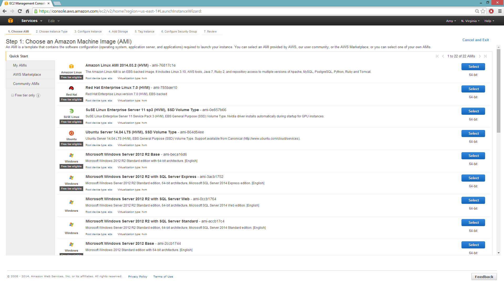

EC2 instances and S3 storage
============================

*Tested on Red Hat AMI, Amazon Linux AMI, and Ubuntu AMI.*

To use the Amazon Web Services (AWS) S3 storage solution, you must pass your S3 access credentials to H2O-3. This lets you access your data on S3 when importing data frames with path prefixes ``s3://...``.

To use `Minio Cloud Storage <https://minio.io/>`__, you must pass an endpoint in addition to access credentials.

For security, write a script to read the access credentials that are stored in a separate file. This not only keeps your credentials from propagating to other locations, but it also makes it easier to change the credential information later.

.. note::

    - You can specify only one S3 endpoint. This means you can read data from either AWS S3 or Minio S3, but not from both.
    - Use S3 for data ingestion and S3N for data export.

AWS standalone instance
-----------------------

When running H2O-3 in standalone mode using the simple Java launch command, you can pass in the S3 credentials in three ways. H2O-3 supports both AWS credentials (a pair consisting of AWS SECRET KEY and AWS SECRET ACCESS KEY) and temporary authentication using a session token (a triplet consisting of AWS SECRET KEY, AWS SECRET ACCESS KEY, and AWS SESSION TOKEN).

- You can pass in AWS credentials in standalone mode by creating a ``core-site.xml`` file and passing it in with the ``-hdfs_config`` flag. For an example ``core-site.xml`` file, see the `Core-site.xml example`_ section.

   1. Edit the properties in the ``core-site.xml`` file to include your access key ID, access key, and session token as shown in the following example:

     ::

       <property>
         <name>fs.s3.awsAccessKeyId</name>
         <value>[AWS SECRET KEY]</value>
       </property>

       <property>
         <name>fs.s3.awsSecretAccessKey</name>
         <value>[AWS SECRET ACCESS KEY]</value>
       </property>

   2. Launch H2O-3 with the configuration file ``core-site.xml`` by running the following command:

     ::

       java -jar h2o.jar -hdfs_config core-site.xml

   3. Set the credentials dynamically before accessing the bucket (where ``AWS_ACCESS_KEY`` represents your username and ``AWS_SECRET_KEY`` represents your password).

      - To set the credentials dynamically using the R API:

        ::

          h2o.set_s3_credentials("AWS_ACCESS_KEY", "AWS_SECRET_KEY")
          h2o.importFile(path = "s3://bucket/path/to/file.csv")

      - To set the credentials dynamically using the Python API:

        ::

          from h2o.persist import set_s3_credentials
          set_s3_credentials("AWS_ACCESS_KEY", "AWS_SECRET_KEY")
          h2o.import_file(path = "s3://bucket/path/to/file.csv")

- Just like regular AWS credentials, temporary credentials using AWS SESSION TOKEN can be passed in standalone mode by creating a ``core-site.xml`` file and passing it in with the ``-hdfs_config`` flag. For an example ``core-site.xml`` file, see the `Core-site.xml example`_ section. The only difference is specifying a triplet of (AWS SECRET KEY, AWS SECRET ACCESS KEY, and AWS SESSION TOKEN) and defining a credentials provider capable of resolving temporary credentials.

   1. Edit the properties in the ``core-site.xml`` file to include your access key ID, access key, and session token as shown in the following example:

     ::

       <property>
         <name>fs.s3a.aws.credentials.provider</name>
         <value>org.apache.hadoop.fs.s3a.TemporaryAWSCredentialsProvider</value>
       </property>

       <property>
         <name>fs.s3a.access.key</name>
         <value>[AWS SECRET KEY]</value>
       </property>

       <property>
         <name>fs.s3a.secret.key</name>
         <value>[AWS SECRET ACCESS KEY]</value>
       </property>

       <property>
         <name>fs.s3a.session.token</name>
         <value>[AWS SESSION TOKEN]<value>
       <property>

   2. Launch H2O-3 with the configuration file ``core-site.xml`` by running the following command:

     ::

       java -jar h2o.jar -hdfs_config core-site.xml

   3. Set the credentials dynamically before accessing the bucket (where ``AWS_ACCESS_KEY`` represents your username, ``AWS_SECRET_KEY`` represents your password, and ``AWS_SESSION_TOKEN`` represents the temporary session token).

      - To set the credentials dynamically using the R API:

        ::

          h2o.set_s3_credentials("AWS_ACCESS_KEY", "AWS_SECRET_KEY", "AWS_SESSION_TOKEN")
          h2o.importFile(path = "s3://bucket/path/to/file.csv")

      - To set the credentials dynamically using the Python API:

        ::

          from h2o.persist import set_s3_credentials
          set_s3_credentials("AWS_ACCESS_KEY", "AWS_SECRET_KEY", "AWS_SESSION_TOKEN")
          h2o.import_file(path = "s3://bucket/path/to/file.csv")

.. note::

    Passing credentials in the URL — for example, ``h2o.importFile(path = "s3://<AWS_ACCESS_KEY>:<AWS_SECRET_KEY>:<AWS_SESSION_TOKEN>@bucket/path/to/file.csv")`` — is considered a security risk and is deprecated.

.. _Core-site.xml:

Core-site.xml example
---------------------

The following is an example ``core-site.xml`` file:

::

    <?xml version="1.0"?>
    <?xml-stylesheet type="text/xsl" href="configuration.xsl"?>

    <!-- Put site-specific property overrides in this file. -->

    <configuration>

        <!--
        <property>
        <name>fs.default.name</name>
        <value>s3://<your s3 bucket></value>
        </property>
        -->

        <property>
            <name>fs.s3.awsAccessKeyId</name>
            <value>insert access key here</value>
        </property>

        <property>
            <name>fs.s3.awsSecretAccessKey</name>
            <value>insert secret key here</value>
        </property>

        <property>
            <name>fs.s3.awsSessionToken</name>
            <value>insert session token here</value>
        </property>
    </configuration>

AWS multi-node instance
-----------------------

`Python <http://www.amazon.com/Python-and-AWS-Cookbook-ebook/dp/B005ZTO0UW/ref=sr_1_1?ie=UTF8&qid=1379879111&sr=8-1&keywords=python+aws>`__ and the `boto <http://boto.readthedocs.org/en/latest/>`__ Python library are required to launch a multi-node instance of H2O-3 on EC2. Confirm these dependencies are installed before proceeding.

For more information, see the `H2O EC2 repo <https://github.com/h2oai/h2o-3/tree/master/ec2>`__.

To build a cluster of EC2 instances, run the following commands on the host that can access the nodes using a public DNS name.

1. Edit ``h2o-cluster-launch-instances.py`` to include your SSH key name and security group name, as well as any other environment-specific variables.

   ::

      ./h2o-cluster-launch-instances.py
      ./h2o-cluster-distribute-h2o.sh

   --OR--

   ::

      ./h2o-cluster-launch-instances.py
      ./h2o-cluster-download-h2o.sh

   .. note::

       The second method may be faster than the first because download pulls from S3.

2. Distribute the credentials using ``./h2o-cluster-distribute-aws-credentials.sh``.

   .. note::

       If you are running H2O-3 using an IAM role, it is not necessary to distribute the AWS credentials to all the nodes in the cluster. The latest version of H2O-3 can access the temporary access key.

   .. warning::

       Distributing both regular AWS credentials and temporary AWS credentials using a session token copies the Amazon AWS_ACCESS_KEY_ID, AWS_SECRET_ACCESS_KEY, and (optionally, if temporary credentials are used) AWS_SESSION_TOKEN to the instances to enable S3 and S3N access. Use caution when adding your security keys to the cloud.

3. Start H2O-3 by launching one H2O-3 node per EC2 instance:

   ::

      ./h2o-cluster-start-h2o.sh

   Wait 60 seconds before repeating this command on the next node.

4. In your internet browser, substitute any of the public DNS node addresses for ``IP_ADDRESS`` in the following example: ``http://IP_ADDRESS:54321``.

   - To start H2O-3: ``./h2o-cluster-start-h2o.sh``
   - To stop H2O-3: ``./h2o-cluster-stop-h2o.sh``
   - To shut down the cluster, use the `Amazon AWS console <http://docs.aws.amazon.com/ElasticMapReduce/latest/DeveloperGuide/UsingEMR_TerminateJobFlow.html>`__ to shut down the cluster manually.

   .. note::

       To successfully import data, the data must reside in the same location on all nodes.

.. _minio:

Minio instance
--------------

Minio Cloud Storage is an alternative to Amazon AWS S3. When connecting to a Minio server, the following additional parameters are specified in the Java launch command:

- ``endpoint``: Specifies a Minio server instance (including address and port). This overrides the existing endpoint, which is currently hardcoded to AWS S3.
- ``enable.path.style``: Overrides the default S3 behavior to expose every bucket as a full DNS-enabled path. This is a Minio recommendation.

To pass in credentials, create a ``core-site.xml`` file that contains your access key ID and secret access key, then use the ``-hdfs_config`` flag when launching:

::

       <property>
         <name>fs.s3.awsAccessKeyId</name>
         <value>[AWS SECRET KEY]</value>
       </property>

       <property>
         <name>fs.s3.awsSecretAccessKey</name>
         <value>[AWS SECRET ACCESS KEY]</value>
       </property>

1. Launch H2O-3 by running the following command:

   ::

      java -Dsys.ai.h2o.persist.s3.endPoint=https://play.min.io:9000 -Dsys.ai.h2o.persist.s3.enable.path.style=true -jar h2o.jar -hdfs_config core-site.xml

   .. note::

       ``https://play.min.io:9000`` is an example Minio server URL.

2. Import the data using ``importFile`` with the Minio S3 URL path: ``s3://bucket/path/to/file.csv``.

   - To import the data from the Flow API:

     ::

        importFiles [ "s3://bucket/path/to/file.csv" ]

   - To import the data from the R API:

     ::

        h2o.importFile(path = "s3://bucket/path/to/file.csv")

   - To import the data from the Python API:

     ::

        h2o.import_file(path = "s3://bucket/path/to/file.csv")

Launching H2O-3
---------------

.. note::

    Before launching H2O-3 on an EC2 cluster, verify that ports ``54321`` and ``54322`` are both accessible by TCP.

Selecting the operating system and virtualization type
~~~~~~~~~~~~~~~~~~~~~~~~~~~~~~~~~~~~~~~~~~~~~~~~~~~~~~

Select your operating system and the virtualization type of the prebuilt AMI on Amazon. If you are using Windows, you must use a hardware-assisted virtual machine (HVM). If you are using Linux, you can choose between para-virtualization (PV) and HVM. These selections determine the type of instances you can launch.

For more information about virtualization types, see the `Amazon virtualization types documentation <http://docs.aws.amazon.com/AWSEC2/latest/UserGuide/virtualization_types.html>`__.

Configuring the instance
~~~~~~~~~~~~~~~~~~~~~~~~

1. Select the IAM role and policy to use to launch the instance. H2O-3 detects the temporary access keys associated with the instance, so you don't need to copy your AWS credentials to the instances.

   .. figure:: ../EC2_images/ec2_config.png
      :alt: EC2 configuration

2. When launching the instance, select an accessible key pair.

   .. figure:: ../EC2_images/ec2_key_pair.png
      :alt: EC2 key pair

(Windows users) Tunneling into the instance
~~~~~~~~~~~~~~~~~~~~~~~~~~~~~~~~~~~~~~~~~~~

For Windows users who do not have the ability to use ``ssh`` from the terminal, either download Cygwin or a Git Bash that has the capability to run ``ssh``:

  ::

    ssh -i amy_account.pem ec2-user@54.165.25.98

Otherwise, download PuTTY and follow these instructions:

1. Launch the PuTTY Key Generator.
2. Load your downloaded AWS pem key file.

   .. note::

       To see the file, change the browser file type to **All**.

3. Save the private key as a ``.ppk`` file.

   .. figure:: ../EC2_images/ec2_putty_key.png
      :alt: Private key

4. Launch the PuTTY client.
5. In the **Session** section, enter the host name or IP address. For Ubuntu users, the default host name is ``ubuntu@<ip-address>``. For Linux users, the default host name is ``ec2-user@<ip-address>``.

   .. figure:: ../EC2_images/ec2_putty_connect_1.png
      :alt: Configuring session

6. Select **SSH**, then **Auth** in the sidebar, then click the **Browse** button to select the private key file for authentication.

   .. figure:: ../EC2_images/ec2_putty_connect_2.png

7. Start a new session and click the **Yes** button to confirm caching of the server's rsa2 key fingerprint and continue connecting.

   .. figure:: ../EC2_images/ec2_putty_alert.png
      :alt: PuTTY alert

Downloading Java and H2O-3
~~~~~~~~~~~~~~~~~~~~~~~~~~

1. Download `Java <http://docs.h2o.ai/h2o/latest-stable/h2o-docs/welcome.html#java-requirements>`__ (JDK 1.8 or later) if it is not already available on the instance.
2. To download H2O-3, run the ``wget`` command with the link to the ZIP file available on our `website <http://h2o.ai/download/>`__ by copying the link associated with the **Download** button for the selected H2O-3 build:

   ::

       wget http://h2o-release.s3.amazonaws.com/h2o/{{branch_name}}/{{build_number}}/index.html
       unzip h2o-{{project_version}}.zip
       cd h2o-{{project_version}}
       java -Xmx4g -jar h2o.jar

3. From your browser, navigate to ``<Private_IP_Address>:54321`` or ``<Public_DNS>:54321`` to use H2O-3's web interface.
