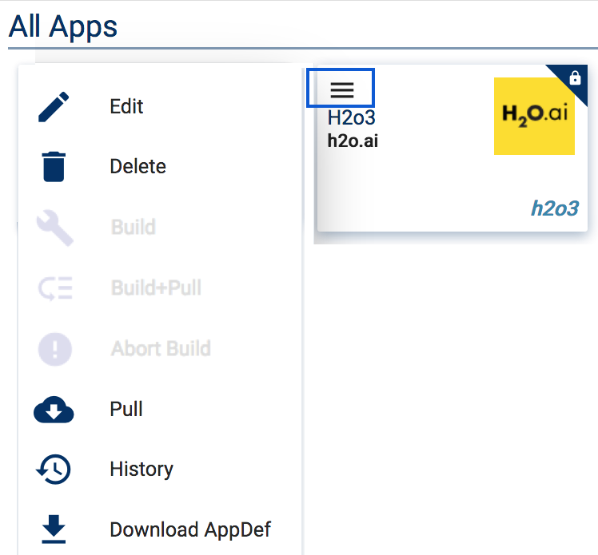

Use H2O with Nimbix
===================

The Nimbix Cloud is a high performance computing (HPC) platform. Through either a portal or a processing API, the Nimbix Cloud runs compute-intensive applications on bare-metal machines. These applications can include CPU, GPU, FPGA systems, or a supercomputing cluster.

This section shows to run H2O on the Nimbix Cloud and walks you through the following steps:

- Initial setup
- Creating applications
- Pulling applications
- Running applications

.. note::

   This assumes that you have a `Nimbix account <http://www.nimbix.net>`__. If you do not, then contact your administrator or sign up for one.

Initial setup
-------------

1. Log in to your `Nimbix account <https://mc.jarvice.com/>`__.

2. Click the **Nimbix** logo in the upper right corner to expand the Nimbix sidebar.

   .. figure:: ../images/nimbix_menu_bar.png
      :alt: Nimbix menu with compute, dashboard, pushtocompute, account, log out, and recent as available options.
      :height: 337
      :width: 153

3. Click **Account** in this right-hand menu. The Profile page should open by default. If it is not open, then on the left menu, click **Profile** to open the Profile page. This page shows your API key.

  Your API key is important for SFTP file transfer. Every account has a specific file storage that is distributed among all of your applications. To access this, you can use SFTP on the command-line or another SFTP client such as Cyberduck or Filezilla.

Example
~~~~~~~

::

   sftp <username>@drop.jarvice.com
   password: <API KEY>

.. warning::
   
   To avoid issues with Jupyter Notebooks opening to an empty folder, we suggest placing at least 1 file into your file storage before continuing.

   Alternatively, you can launch the Nimbix File Manager, which is a GUI based application that runs inside of Nimbix. 

Initial application creation
----------------------------

This section describes how to create the following applications. 

.. note::
   
   When specifying the Docker repository, H2O.ai principal repo is "``opsh2oai``", and all h2o images have "``nae``" appended. 

- H2O-3 Core: Docker repository ``opsh2oai/h2o3-nae``
- H2OAI: Docker repository ``opsh2oai/h2oai_nae``

1. In the right-side menu, select the **PushToCompute™** menu option, then click the **New** icon. 

   .. figure:: ../images/nimbix_new.png
      :alt: New application button on Nimbux menu.
      :height: 159
      :width: 200

2. Specify a name for your application (for example "h2o3").
3. Enter the docker repository (for example "``opsh2oai/h2o3_nae``").
4. Select "Intel x86 64-bit (x86_64)" from the **System Architecture** drop down.

   .. figure:: ../images/nimbix_create_app.png
      :alt: Create application panel where you name your app ID, docker repo, git source, and system architecture.
      :height: 307
      :width: 458

5. Click **OK** when you are done. 
6. Repeat steps 1 through 5 for the following applications:

 - H2OAI: Docker repository ``opsh2oai/h2oai_nae``.
 - H2O-3 for Power8: Docker repository ``opsh2oai/h2o3_power_nae``. 

 .. note::

   For H2O-3 for Power8, don't use "Intel x86 64-bit (x86_64)". Instead, select "IBM Power 64-bit, Little Endian (ppc64le)" from the **System Architecture** drop-down menu.

Pull applications
-----------------

After applications are created, the next step is to pull each application. For each application, click the menu icon (three lines) in the upper-left corner of the application, then click **Pull**. 

Once you start a pull, you will receive an email from Nimbix stating that a Pull has been scheduled followed by another when the Pull is completed. After you receive the final email stating that the Pull has completed, your application is ready to use.

.. note::
   
   To avoid UI issues with Nimbix, we recommend logging out and then logging back in to ensure that the template and UI for the Application have been properly loaded into the NAE framework.

Running applications
--------------------

This section shows how to run applications after they are built and pulled.

1. Select the Application and the desired launch type (for example Batch, H2O-3 Cluster, Jupyter Notebook, or SSH).

  .. figure:: ../images/nimbix_start_app.png
     :alt: Start application panel where you select which application launch type you would like.
     :height: 312
     :width: 551

2. Select the Machine Type and the number of cores, then click **Submit**.

  .. figure:: ../images/nimbix_machine_type.png
     :alt: Select machine type and number of cores for the H2O-3 cluster.
     :height: 194
     :width: 416

That's it! At this point, you are now running your H2O applications in Nimbix.

.. warning::
   
   Be sure to shut off your instances when you are done. 
