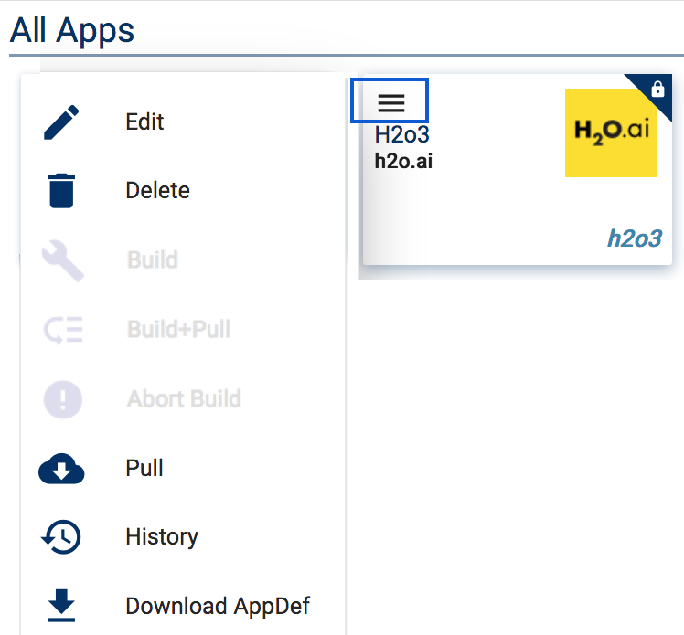

Using H2O-3 with Nimbix
=======================

The Nimbix Cloud is a high performance computing (HPC) platform. Through either a portal or a processing API, the Nimbix Cloud runs compute-intensive applications on bare-metal machines. These applications can include CPU, GPU, FPGA systems, or a supercomputing cluster.

This section shows how to run H2O-3 on the Nimbix Cloud and walks you through the following steps:

- Initial setup
- Creating applications
- Pulling applications
- Running applications

This section assumes that you have a Nimbix account. If you do not, contact your administrator or `sign up for a Nimbix account <https://www.nimbix.net/>`__.

Initial setup
-------------

1. Log in to your Nimbix account at `mc.jarvice.com <https://mc.jarvice.com/>`__.

2. Click the **Nimbix** logo in the upper-right corner to expand the Nimbix sidebar.

   .. figure:: ../images/nimbix_menu_bar.png
      :alt: Nimbix menu
      :height: 337
      :width: 153

3. Click **Account** in the right-hand menu. The Profile page opens by default. If it is not open, click **Profile** in the left menu to open the Profile page. This page shows your API key.

  Your API key is required for SFTP file transfer. Every account has a specific file storage that is distributed among all of your applications. To access this file storage, you can use SFTP on the command line or another SFTP client (such as Cyberduck or Filezilla).

  For example:

  ::

    sftp <username>@drop.jarvice.com
    password: <API KEY>

  .. warning::

      To avoid issues with Jupyter Notebooks opening to an empty folder, place at least one file into your file storage before continuing.

  Alternatively, you can launch the Nimbix File Manager — a GUI application that runs inside Nimbix.

Initial application creation
----------------------------

This section describes how to create the following applications. When specifying the Docker repository, the H2O.ai principal repo is ``opsh2oai``, and all H2O-3 images have ``nae`` appended.

- H2O-3 Core: Docker repository ``opsh2oai/h2o3-nae``
- H2OAI: Docker repository ``opsh2oai/h2oai_nae``

1. In the right-side menu, select the **PushToCompute™** menu option, then click the **New** icon.

   .. figure:: ../images/nimbix_new.png
      :alt: New application
      :height: 159
      :width: 200

2. Specify a name for your application (for example, ``h2o3``).
3. Enter the Docker repository (for example, ``opsh2oai/h2o3_nae``).
4. Select **Intel x86 64-bit (x86_64)** from the **System Architecture** dropdown.

   .. figure:: ../images/nimbix_create_app.png
      :alt: Create application
      :height: 307
      :width: 458

5. Click **OK** when you are done.
6. Repeat steps 1 through 5 for the following applications:

   - H2OAI: Docker repository ``opsh2oai/h2oai_nae``
   - H2O-3 for Power8: Docker repository ``opsh2oai/h2o3_power_nae``.

   .. note::

       For H2O-3 for Power8, do not use **Intel x86 64-bit (x86_64)**. Instead, select **IBM Power 64-bit, Little Endian (ppc64le)** from the **System Architecture** dropdown.

Pull applications
-----------------

After applications are created, the next step is to pull each application. For each application, click the menu icon (three lines) in the upper-left corner of the application, then click **Pull**.

Once you start a pull, you receive an email from Nimbix stating that a pull has been scheduled, followed by another when the pull completes. After you receive the final email stating that the pull has completed, your application is ready to use.

.. note::

    To avoid UI issues with Nimbix, log out and then log back in to ensure that the template and UI for the application have been properly loaded into the NAE framework.

Running applications
--------------------

This section shows how to run applications after they are built and pulled.

1. Select the application and the desired launch type (for example, **Batch**, **H2O-3 Cluster**, **Jupyter Notebook**, or **SSH**).

  .. figure:: ../images/nimbix_start_app.png
     :alt: Start application
     :height: 312
     :width: 551

2. Select the machine type and the number of cores, then click **Submit**.

  .. figure:: ../images/nimbix_machine_type.png
     :alt: Select machine type and number of cores
     :height: 194
     :width: 416

.. warning::

    Shut off your instances when you are done.
