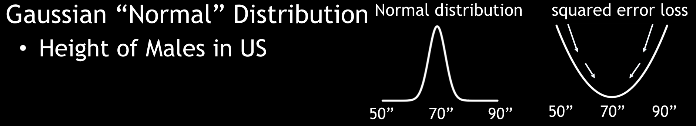
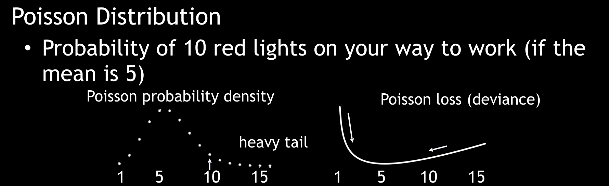
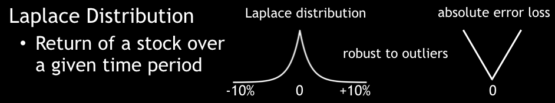
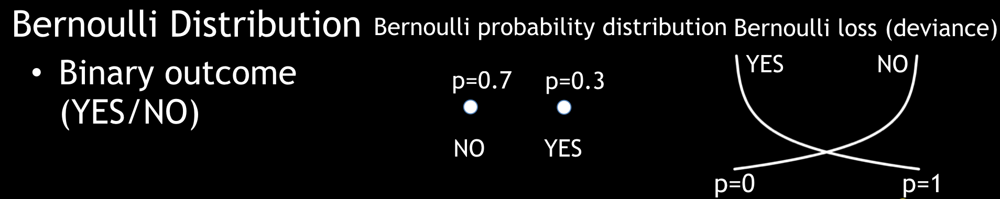

``distribution``
----------------

- Available in: GBM, Deep Learning, XGBoost
- Hyperparameter: yes

Description
~~~~~~~~~~~

Unlike in GLM, where users specify both a distribution ``family`` and a ``link`` for the loss function, in GBM, Deep Learning, and XGBoost, distributions and loss functions are tightly coupled. In these algorithms, a loss function is specified using the ``distribution`` parameter. When specifying the distribution, the loss function is automatically selected as well. For exponential families (such as Poisson, Gamma, and Tweedie), the canonical logarithmic link function is used.

By default, the loss function method performs AUTO distribution. In this case, the algorithm will guess the model type based on the response column type (specified using ``y``). More specifically, if the response column type is numeric, AUTO defaults to "gaussian"; if categorical, AUTO defaults to bernoulli or multinomial depending on the number of response categories.

Certain cases can exist, however, in which the median starting value for this loss function can lead to poor results (for example, if the median is the lowest or highest value in a tree node). The ``distribution`` option allows you to specify a different method. Available methods include AUTO, bernoulli, multinomial, gaussian, poisson, gamma, laplace, quantile, huber, and tweedie.

- If the distribution is ``bernoulli``, the response column must be 2-class categorical
- If the distribution is ``multinomial``, the response column must be categorical.
- If the distribution is ``gaussian``, the response column must be numeric.
- If the distribution is ``poisson``, the response column must be numeric.
- If the distribution is ``gamma``, the response column must be numeric.
- If the distribution is ``laplace``, the response column must be numeric.
- If the distribution is ``quantile``, the response column must be numeric.
- If the distribution is ``huber``, the response column must be numeric.
- If the distribution is ``tweedie``, the response column must be numeric.

**NOTE**: ``laplace``, ``quantile``, and ``huber`` are NOT available in XGBoost.

The following general guidelines apply when selecting a distribution:

 For Classification problems:

 - A Bernoulli distribution is used for binary outcomes.
 - A Multinomial distribution can handle multiple discrete outcomes.

 For Regression problems:

 - A Gaussian distribution is the function for continuous targets.
 - A Poisson distribution is used for estimating counts.
 - A Gamma distribution is used for estimating total values (such as claim payouts, rainfall, etc.).
 - A Tweedie distribution is used for estimating densities. 
 - A Laplacian loss function (absolute L1-loss function) can predict the median percentile.
 - A Quantile regression loss function can predict a specified percentile.
 - A Huber loss function, a combination of squared error and absolute error, is more robust to outliers than L2 squared-loss function. 

When ``tweedie`` is specified, users must also specify a ``tweedie_power`` value. Users can tune over this option with values > 1.0 and < 2.0. More information is available `here <https://en.wikipedia.org/wiki/Tweedie_distribution>`__.	

When ``quantile`` is specified, then users can also specify a ``quantile_alpha`` value, which defines the desired quantile when performing quantile regression. For example, if you want to predict the 80th percentile of a column's value, then you can specify ``quantile_alpha=0.8``. The ``quantile_alpha`` value defaults to 0.5 (i.e., the median value, and essentially the same as specifying ``distribution=laplace``). Note that this option is not available in XGBoost. 

When ``huber`` is specified, then users can also specify a ``huber_alpha`` value. This indicates the top percentile of error that should be considered as outliers. Note that this option is not available in XGBoost.

For all distributions except ``multinomial``, you can specify an ``offset_column``. Offsets are per-row “bias values” that are used during model training. For Gaussian distributions, they can be seen as simple corrections to the response (y) column. Instead of learning to predict the response (y-row), the model learns to predict the (row) offset of the response column. For other distributions, the offset corrections are applied in the linearized space before applying the inverse link function to get the actual response values. For more information, refer to the following `link <http://www.idg.pl/mirrors/CRAN/web/packages/gbm/vignettes/gbm.pdf>`__. 

Some examples of response distributions are provided below.

**Gaussian Distribution**

**Poisson Distribution**

**Laplace Distribution**

**Bernoulli Distribution**

Related Parameters
~~~~~~~~~~~~~~~~~~

- `huber_alpha <huber_alpha.html>`__
- `offset_column <offset_column.html>`__
- `quantile_alpha <quantile_alpha.html>`__
- `tweedie_power <tweedie_power.html>`__
- `y <y.html>`__

Example
~~~~~~~

.. example-code::
   .. code-block:: r

	library(h2o)
	h2o.init()

	# import the cars dataset:
	# this dataset is used to classify whether or not a car is economical based on
	# the car's displacement, power, weight, and acceleration, and the year it was made
	cars <- h2o.importFile("https://s3.amazonaws.com/h2o-public-test-data/smalldata/junit/cars_20mpg.csv")

	# set the predictor names and the response column name
	predictors <- c("displacement","power","weight","acceleration","year")
	response <- "cylinders"

	# split into train and validation sets
	cars.splits <- h2o.splitFrame(data =  cars, ratios = .8, seed = 1234)
	train <- cars.splits[[1]]
	valid <- cars.splits[[2]]

	# try using the distribution parameter:
	# train a GBM
	car_gbm <- h2o.gbm(x = predictors, y = response, training_frame = train,
	                   validation_frame = valid,
	                   distribution = "poisson",
	                   seed = 1234)

	# print the MSE for your validation data
	print(h2o.mse(car_gbm, valid = TRUE))

   .. code-block:: python

	import h2o
	from h2o.estimators.gbm import H2OGradientBoostingEstimator
	h2o.init()

	# import the cars dataset:
	# this dataset is used to classify whether or not a car is economical based on
	# the car's displacement, power, weight, and acceleration, and the year it was made
	cars = h2o.import_file("https://s3.amazonaws.com/h2o-public-test-data/smalldata/junit/cars_20mpg.csv")

	# set the predictor names and the response column name
	predictors = ["displacement","power","weight","acceleration","year"]
	response = "cylinders"

	# split into train and validation sets
	train, valid = cars.split_frame(ratios = [.8], seed = 1234)

	# try using the distribution parameter:
	# Initialize and train a GBM
	cars_gbm = H2OGradientBoostingEstimator(distribution = "poisson", seed = 1234)
	cars_gbm.train(x = predictors, y = response, training_frame = train, validation_frame = valid)

	# print the MSE for the validation data
	cars_gbm.mse(valid=True)
