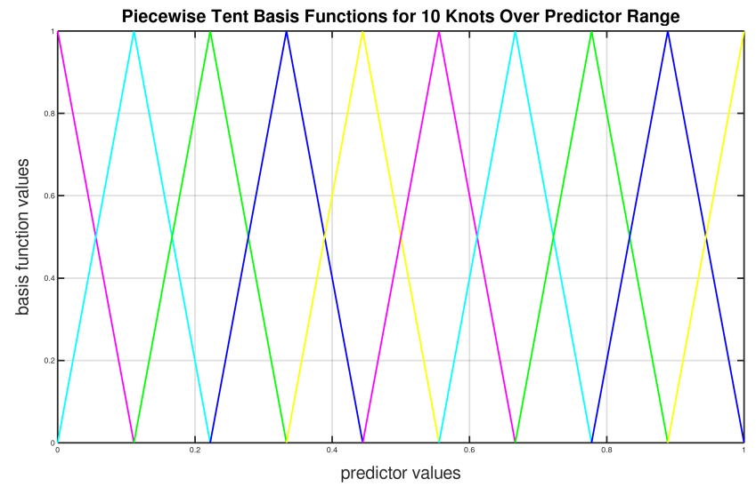

Generalized Additive Models (GAM)
---------------------------------

**Note**: GAM models are currently experimental.

Introduction
~~~~~~~~~~~~

A generalized additive model (GAM) is a :ref:`glm` in which the linear predictor depends linearly on predictor variables and smooth functions of predictor variables. H2O's GAM implementation follows closely the implementation as described in "Generalized Additive Models: An Introduction with R, Texts in Statistical Science [:ref:`1<ref1>`]" by Simon N. Wood. Another good resource for GAM can be found in "Generalized Additive Models" by T.J. Hastie and R.J. Tibshirani [:ref:`2<ref2>`].

Defining a GAM Model
~~~~~~~~~~~~~~~~~~~~

-  `model_id <algo-params/model_id.html>`__: (Optional) Specify a custom name for the model to use as a reference. By default, H2O automatically generates a destination key.

-  `training_frame <algo-params/training_frame.html>`__: (Required) Specify the dataset used to build the model. **NOTE**: In Flow, if you click the **Build a model** button from the ``Parse`` cell, the training frame is entered automatically.

-  `validation_frame <algo-params/validation_frame.html>`__: (Optional) Specify the dataset used to evaluate the accuracy of the model.

-  `nfolds <algo-params/nfolds.html>`__: Specify the number of folds for cross-validation. This value defaults to 0 (no cross-validation).

-  `seed <algo-params/seed.html>`__: Specify the random number generator (RNG) seed for algorithm components dependent on randomization. The seed is consistent for each H2O instance so that you can create models with the same starting conditions in alternative configurations. This option defaults to -1 (time-based random number).

-  `y <algo-params/y.html>`__: (Required) Specify the column to use as the dependent variable.

   -  For a regression model, this column must be numeric (**Real** or **Int**).
   -  For a classification model, this column must be categorical (**Enum** or **String**). If the family is **Binomial**, the dataset cannot contain more than two levels.

-  `x <algo-params/x.html>`__: Specify a vector containing the names or indices of the predictor variables to use when building the model. If ``x`` is missing, then all columns except ``y`` are used.

-  `keep_cross_validation_models <algo-params/keep_cross_validation_models.html>`__: Specify whether to keep the cross-validated models. Keeping cross-validation models may consume significantly more memory in the H2O cluster. This option is defaults to true (enabled).

-  `keep_cross_validation_predictions <algo-params/keep_cross_validation_predictions.html>`__: Specify whether to keep the cross-validation predictions. This option is defaults to false (not enabled).

-  `keep_cross_validation_fold_assignment <algo-params/keep_cross_validation_fold_assignment.html>`__: Enable this option to preserve the cross-validation fold assignment. This option is defaults to false (not enabled).

-  `fold_assignment <algo-params/fold_assignment.html>`__: (Applicable only if a value for **nfolds** is specified and **fold_column** is not specified) Specify the cross-validation fold assignment scheme. The available options are AUTO (which is Random), Random, `Modulo <https://en.wikipedia.org/wiki/Modulo_operation>`__, or Stratified (which will stratify the folds based on the response variable for classification problems). This option defaults to AUTO.

-  `fold_column <algo-params/fold_column.html>`__: Specify the column that contains the cross-validation fold index assignment per observation.

-  `ignored_columns <algo-params/ignored_columns.html>`__: (Optional, Python and Flow only) Specify the column or columns to be excluded from the model. In Flow, click the checkbox next to a column name to add it to the list of columns excluded from the model. To add all columns, click the **All** button. To remove a column from the list of ignored columns, click the X next to the column name. To remove all columns from the list of ignored columns, click the **None** button. To search for a specific column, type the column name in the **Search** field above the column list. To only show columns with a specific percentage of missing values, specify the percentage in the **Only show columns with more than 0% missing values** field. To change the selections for the hidden columns, use the **Select Visible** or **Deselect Visible** buttons.

-  `ignore_const_cols <algo-params/ignore_const_cols.html>`__: Enable this option to ignore constant
   training columns, since no information can be gained from them. This option is defaults to true (enabled).

-  `score_each_iteration <algo-params/score_each_iteration.html>`__: (Optional) Enable this option to score during each iteration of the model training. This option is defaults to false (not enabled).

-  `offset_column <algo-params/offset_column.html>`__: Specify a column to use as the offset; the value cannot be the same as the value for the ``weights_column``.
   
     **Note**: Offsets are per-row "bias values" that are used during model training. For Gaussian distributions, they can be seen as simple corrections to the response (y) column. Instead of learning to predict the response (y-row), the model learns to predict the (row) offset of the response column. For other distributions, the offset corrections are applied in the linearized space before applying the inverse link function to get the actual response values. 

-  `weights_column <algo-params/weights_column.html>`__: Specify a column to use for the observation weights, which are used for bias correction. The specified ``weights_column`` must be included in the specified ``training_frame``. *Python only*: To use a weights column when passing an H2OFrame to ``x`` instead of a list of column names, the specified ``training_frame`` must contain the specified``weights_column``. 
   
    **Note**: Weights are per-row observation weights and do not increase the size of the data frame. This is typically the number of times a row is repeated, but non-integer values are supported as well. During training, rows with higher weights matter more, due to the larger loss function pre-factor.

-  `family <algo-params/family.html>`__: Specify the model type.

   -  If the family is **gaussian**, the response must be numeric (**Real** or **Int**). 
   -  If the family is **binomial**, the response must be categorical 2 levels/classes or binary (**Enum** or **Int**).
   -  If the family is **fractionalbinomial**, the response must be a numeric between 0 and 1.
   -  If the family is **multinomial**, the response can be categorical with more than two levels/classes (**Enum**).
   -  If the family is **ordinal**, the response must be categorical with at least 3 levels.
   -  If the family is **quasibinomial**, the response must be numeric.
   -  If the family is **poisson**, the response must be numeric and non-negative (**Int**).
   -  If the family is **negativebinomial**, the response must be numeric and non-negative (**Int**).
   -  If the family is **gamma**, the response must be numeric and continuous and positive (**Real** or **Int**).
   -  If the family is **tweedie**, the response must be numeric and continuous (**Real**) and non-negative.
   - If the family is **AUTO** (default),

      - and the response is **Enum** with cardinality = 2, then the family is automatically determined as **binomial**.
      - and the response is **Enum** with cardinality > 2, then the family is automatically determined as **multinomial**.
      - and the response is numeric (**Real** or **Int**), then the family is automatically determined as **gaussian**.

-  `tweedie_variance_power <algo-params/tweedie_variance_power.html>`__: (Only applicable if *Tweedie* is
   specified for **Family**) Specify the Tweedie variance power (defaults to 0).

-  `tweedie_link_power <algo-params/tweedie_link_power.html>`__: (Only applicable if *Tweedie* is specified
   for **Family**) Specify the Tweedie link power (defaults to 0).

-  `theta <algo-params/theta.html>`__: Theta value (equal to 1/r) for use with the negative binomial family. This value must be > 0 and defaults to 0.  

-  `solver <algo-params/solver.html>`__: Specify the solver to use (AUTO, IRLSM, L_BFGS, COORDINATE_DESCENT_NAIVE, COORDINATE_DESCENT, GRADIENT_DESCENT_LH, or GRADIENT_DESCENT_SQERR). IRLSM is fast on problems with a small number of predictors and for lambda search with L1 penalty, while `L_BFGS <http://cran.r-project.org/web/packages/lbfgs/vignettes/Vignette.pdf>`__ scales better for datasets with many columns. COORDINATE_DESCENT is IRLSM with the covariance updates version of cyclical coordinate descent in the innermost loop. COORDINATE_DESCENT_NAIVE is IRLSM with the naive updates version of cyclical coordinate descent in the innermost loop. GRADIENT_DESCENT_LH and GRADIENT_DESCENT_SQERR can only be used with the Ordinal family. AUTO (default) will set the solver based on the given data and other parameters.

-  `alpha <algo-params/alpha.html>`__: Specify the regularization distribution between L1 and L2. The default value of alpha is 0 when ``solver = 'L-BFGS'``, overwise it is 0.5.

-  `lambda <algo-params/lambda.html>`__: Specify the regularization strength.

-  `lambda_search <algo-params/lambda_search.html>`__: Specify whether to enable lambda search, starting with lambda max (the smallest :math:`\lambda` that drives all coefficients to zero). If you also specify a value for ``lambda_min_ratio``, then this value is interpreted as lambda min. If you do not specify a value for ``lambda_min_ratio``, then GAM will calculate the minimum lambda. This option is defaults to false (not enabled).

-  `early_stopping <algo-params/early_stopping.html>`__: Specify whether to stop early when there is no more relative improvement on the training or validation set. This option is defaults to true (enabled).

- `stopping_rounds <algo-params/stopping_rounds.html>`__: Stops training when the option selected for **stopping_metric** doesn't improve for the specified number of training rounds, based on a simple moving average. To disable this feature, specify ``0`` (default). 

    **Note:** If cross-validation is enabled:
  
    - All cross-validation models stop training when the validation metric doesn't improve.
    - The main model runs for the mean number of epochs.
    - N+1 models may be off by the number specified for **stopping_rounds** from the best model, but the cross-validation metric estimates the performance of the main model for the resulting number of epochs (which may be fewer than the specified number of epochs).

- `stopping_metric <algo-params/stopping_metric.html>`__: Specify the metric to use for early stopping. The available options are:

  - ``AUTO``: This defaults to ``logloss`` for classification, ``deviance`` for regression, and ``anomaly_score`` for Isolation Forest. Note that ``custom`` and ``custom_increasing`` can only be used in GBM and DRF with the Python Client. Must be one of: ``AUTO``, ``anomaly_score``. Defaults to ``AUTO``.
  - ``anomaly_score`` (Isolation Forest only)
  - ``deviance``
  - ``logloss``
  - ``MSE``
  - ``RMSE``
  - ``MAE``
  - ``RMSLE``
  - ``AUC`` (area under the ROC curve)
  - ``AUCPR`` (area under the Precision-Recall curve)
  - ``lift_top_group``
  - ``misclassification``
  - ``mean_per_class_error``
  - ``custom`` (GBM/DRF Python client only)
  - ``custom_increasing`` (GBM/DRF Python client only)

- `stopping_tolerance <algo-params/stopping_tolerance.html>`__: Specify the relative tolerance for the metric-based stopping to stop training if the improvement is less than this value. Defaults to ``0.001``.
   
-  `nlambdas <algo-params/nlambdas.html>`__: (Applicable only if **lambda_search** is enabled) Specify the number of lambdas to use in the search. When ``alpha`` > 0, the default value for ``lambda_min_ratio`` is :math:`1e^{-4}`, then the default value for ``nlambdas`` is 100. This gives a ratio of 0.912. (For best results when using strong rules, keep the ratio close to this default.) When ``alpha=0``, the default value for ``nlamdas`` is set to 30 because fewer lambdas are needed for ridge regression. This value defaults to -1 (disabled).

-  `standardize <algo-params/standardize.html>`__: Specify whether to standardize the numeric columns to have a mean of zero and unit variance. Standardization is highly recommended; if you do not use standardization, the results can include components that are dominated by variables that appear to have larger variances relative to other attributes as a matter of scale, rather than true contribution. This option is defaults to false (not enabled).

-  `missing_values_handling <algo-params/missing_values_handling.html>`__: Specify how to handle missing values (Skip, MeanImputation, or PlugValues). This value defaults to MeanImputation.

-  `plug_values <algo-params/plug_values.html>`__: When ``missing_values_handling="PlugValues"``, specify a single row frame containing values that will be used to impute missing values of the training/validation frame.

-  `compute_p_values <algo-params/compute_p_values.html>`__: Request computation of p-values. Only applicable with no penalty (lambda = 0 and no beta constraints). Setting remove_collinear_columns is recommended. H2O will return an error if p-values are requested and there are collinear columns and remove_collinear_columns flag is not enabled. Note that this option is not available for ``family="multinomial"`` or ``family="ordinal"``. This option is defaults to false (not enabled).

-  `remove_collinear_columns <algo-params/remove_collinear_columns.html>`__: Specify whether to automatically remove collinear columns during model-building. When enabled, collinear columns will be dropped from the model and will have 0 coefficient in the returned model. This can only be set if there is no regularization (lambda=0). This option is defaults to false (not enabled).

-  `intercept <algo-params/intercept.html>`__: Specify whether to include a constant term in the model. This option is defaults to true (enabled).

-  `non_negative <algo-params/non_negative.html>`__: Specify whether to force coefficients to have non-negative values. This option is defaults to false (not enabled).

-  `max_iterations <algo-params/max_iterations.html>`__: Specify the number of training iterations (defaults to -1, which means unlimited).

-  `objective_epsilon <algo-params/objective_epsilon.html>`__: If the objective value is less than this threshold, then the model is converged. By default, this is set to -1 (automatic), which means the following: if ``lambda_search=True``, then this value defaults to .0001. If ``lambda_search=False`` and lambda is equal to zero, then this value defaults to .000001. For any other value of lambda, the default value of objective_epsilon is set to .0001.

-  `beta_epsilon <algo-params/beta_epsilon.html>`__: Converge if beta changes less than this value (using L-infinity norm). This only applies to IRLSM solver, and the default value is 0.0001.

-  `gradient_epsilon <algo-params/gradient_epsilon.html>`__: (For L-BFGS only) Specify a threshold for convergence. If the objective value (using the L-infinity norm) is less than this threshold, the model is converged. By default this is set ti -1, which means the following: if ``lambda_search=True``, then this value defaults to .0001. If ``lambda_search=False`` and lambda is equal to zero, then this value defaults to .000001. For any other value of lambda, this value defaults to .0001.

-  `link <algo-params/link.html>`__: Specify a link function (Identity, Family_Default, Logit, Log, Inverse, Tweedie, or Ologit). The default value is Family_Default.

   -  If the family is **Gaussian**, then **Identity**, **Log**, and **Inverse** are supported.
   -  If the family is **Binomial**, then **Logit** is supported.
   -  If the family is **Fractionalbinomial**, then Logit is supported.
   -  If the family is **Poisson**, then **Log** and **Identity** are supported.
   -  If the family is **Gamma**, then **Inverse**, **Log**, and **Identity** are supported.
   -  If the family is **Tweedie**, then only **Tweedie** is supported.
   -  If the family is **Multinomial**, then only **Family_Default** is supported. (This defaults to ``multinomial``.)
   -  If the family is **Quasibinomial**, then only **Logit** is supported.
   -  If the family is **Ordinal**, then only **Ologit** is supported
   -  If the family is **Negative Binomial**, then only **Log** and **Identity** are supported.
   - If the family is **AUTO**,

      - and a link is not specified, then the link is determined as **Family_Default** (defaults to the family to which AUTO is determined).
      - and a link is specified, the link is used so long as the specified link is compatible with the family to which AUTO is determined. Otherwise, an error message is thrown stating that AUTO for underlying data requires a different link and gives a list of possible compatible links.
      - The list of supported links for ``family = AUTO`` is:

          1. If the response is **Enum** with cardinality = 2, then **Logit** is supported.
          2. If the response is **Enum** with cardinality > 2, then only **Family_Default** is supported (this defaults to **multinomial**).
          3. If the response is numeric (**Real** or **Int**), then **Identity**, **Log**, and **Inverse** are suported.

-  `prior <algo-params/prior.html>`__: Specify prior probability for p(y==1). Use this parameter for logistic regression if the data has been sampled and the mean of response does not reflect reality. This value must be a value in the range (0,1) or set to -1 (disabled).  This option is set to -1 (disabled) by default.  
   
     **Note**: This is a simple method affecting only the intercept. You may want to use weights and offset for a better fit.

-  `lambda_min_ratio <algo-params/lambda_min_ratio.html>`__: Specify the minimum lambda to use for lambda search. This is specified as a ratio of **lambda_max**, which is the smallest :math:`\lambda` for which the solution is all zeros. This value defaults to 0.

-  `beta_constraints <algo-params/beta_constraints.html>`__: Specify a dataset to use beta constraints. The selected frame is used to constrain the coefficient vector to provide upper and lower bounds. The dataset must contain a names column with valid coefficient names.

-  `max_active_predictors <algo-params/max_active_predictors.html>`__: Specify the maximum number of active predictors during computation. This value is used as a stopping criterium to prevent expensive model building with many predictors. This value defaults to -1 (unlimited).

-  `interactions <algo-params/interactions.html>`__: Specify a list of predictor column indices to interact. All pairwise combinations will be computed for this list. 

-  `interaction_pairs <algo-params/interaction_pairs.html>`__: When defining interactions, use this option to specify a list of pairwise column interactions (interactions between two variables). Note that this is different than ``interactions``, which will compute all pairwise combinations of specified columns.

-  **obj_reg**: Specifies the likelihood divider in objective value computation. This defaults to ``1/n`` where ``n`` is the number of observations (rows) in the training set.

-  `export_checkpoints_dir <algo-params/export_checkpoints_dir.html>`__: Specify a directory to which generated models will automatically be exported.

- **subspaces**: A list of model parameters that, when in the same subspace list, can vary freely amongst each other. This allows the user to group model parameters that can vary with restrictions. If specified, the following parameters must have the same array dimension:
  
  - ``gam_columns``
  - ``scale``
  - ``num_knots``
  - ``bs``

These parameters can be specified as follows:

  .. code-block:: bash
    
    hyper_parameters = {
        'alpha':[0.9, 0.1],
        ‘subspaces’: [{
            ‘scale’:[[1,1,1],[0.1, 0.1, 0.1]], 
            ‘num_knots’:[[4,4,4],[5,5,5]], 
            ‘gam_columns’:[[“C1”,“C2",“C3”]]
        }, {
            ‘scale’:[[1,1],[0.1, 0.1,]], 
            ‘num_knots’:[[4,4],[5,5]], 
            ‘gam_columns’:[[“C2",“C3”]]
        }]
   }

With this hyperparameter specification, there will be 16 GAM models built.

-  **num_knots**: An array that specifies the number of knots for each predictor specified in ``gam_columns``.
            
-  **knot_ids**: A string array storing frame keys/IDs that contain knot locations. Specify one value for each GAM column specified in ``gam_columns``.

-  **gam_columns**: Required. An array of column names representing the smoothing terms used for prediction. GAM will build a smoother for each specified column. 

-  **bs**: An array specifying the B-Splines for each GAM predictor. You must include one value for each GAM predictor. This defaults to `0`, which specifies cubic regression spline.

-  **scale**: An array specifying the smoothing parameter for GAM. 

-  **keep_gam_cols**: Specify whether to save keys storing GAM columns. This option is defaults to false (not enabled).

.. _scenario1:

A Simple Linear Model
~~~~~~~~~~~~~~~~~~~~~~

Consider :math:`n` observations, :math:`x_i` with response variable :math:`y_i`, where :math:`y_i` is an observation on random variable :math:`Y_i`. Let :math:`u_i ≡ E(Y_i)`. Assuming a linear relationship between the predictor variables and the response, the following relationship exists between :math:`xi` and :math:`Y_i` as:

  :math:`Y_i = u_i + \epsilon_i \text{ where } u_i = \beta_i x_i + \beta_0`

and :math:`\beta_i, \beta_0` are unknown parameters, :math:`\epsilon_i` are i.i.d zero mean variables with variances :math:`\delta^2`. We already know how to estimate :math:`\beta_i, \beta_0` using :ref:`GLM<glm>`.

.. _scenario2:

A Simple Linear GAM Model
~~~~~~~~~~~~~~~~~~~~~~~~~

Using the same observations as in the previous A Simple Linear Model section, a linear GAM model can be:

  :math:`Y_i = f(x_i) + \epsilon_i \text{ where } f(x_i) = {\Sigma_{j=1}^k}b_j(x_i)\beta_j+\beta_0`

Again, :math:`\beta = [\beta_0, \beta_1, \ldots, b_k]` is an unknown parameter vector that can also be estimated using :ref:`GLM<glm>`. This can be done by using :math:`[b_1(x_i), b_2(x_i), \ldots , b_K(x_i)]` as the predictor variables instead of :math:`x_i`. Here, we are basically estimating :math:`f(x_i)` using a set of basis functions:

:math:`\{b_1(x_i), b_2(x_i), \ldots, b_K(x_i)\}`

where :math:`k` is the number of basis functions used. Note that for each predictor variable, we get to decide the types and number of basis functions that we would like to use to best generate a GAM.

.. _scenario3:

A Simple Piecewise Linear Basis Function
~~~~~~~~~~~~~~~~~~~~~~~~~~~~~~~~~~~~~~~~

To understand the role of basis functions, we are going to use a linear tent function.

Using piecewise basis functions, we need to pay attention to the locations of the function’s derivative discontinuities, that is by the locations at which the linear pieces join up. These locations are referred to as the knots and denoted by :math:`\{x_i^*:j=1, \ldots, K\}`. And suppose that the knots are sorted, meaning that :math:`x_i^* > x_{i-1}^*`. Then for :math:`j=2, \ldots, K - 1`, we have basis function :math:`b_j(x)` defined as:

  .. figure:: ../images/gam_simple_piecewise1.png

  .. figure:: ../images/gam_simple_piecewise2.png

.. _scenario4:

Using Piecewise Tent Function to Approximate One Predictor Variable
~~~~~~~~~~~~~~~~~~~~~~~~~~~~~~~~~~~~~~~~~~~~~~~~~~~~~~~~~~~~~~~~~~~

To illustrate how we can use the piecewise tent functions to approximate a predictor variable, let’s use the following example for a predictor:

- Predictor value goes from 0.0 to 1.0
- Set :math:`K=10` to use 10 piecewise tent functions
- The knots are located at 0, 1/9, 2/9, 3/9, …, 8/9, 1.

The basis function values are plotted in in the figure below. Note that there are 10 basis functions. The basis function values overlap with its neighbors from the left and the right except for the first and the last basis functions.

For simplicity, let’s assume that we only have 21 predictor values uniformly spreading over the range from 0 to 1 with values 0, 0.05, 0.1, 0.15, …, 1.0. The next task is to translate each :math:`x_j` to a set of 10 basis function values. This means that for every value of :math:`x_j`, we will obtain 10 values, each one correspond to each of the basis function.

For the predictor value at 0, the only basis function that matters is the first one. All the other basis function contributes 0 to the predictor value. Hence, for :math:`x_j = 0`, the vector corresponding to all basis functions will have the following values: {1,0,0,0,0,0,0,0,0,0} because the first basis function value is 1 at :math:`x_j = 0`. **Note** Substitute :math:`x=0` to the first basis function 

 :math:`b_1(x) = \frac{\big(\frac{1}{9} - x \big)}{\big(\frac{2}{9} - \frac{1}{9} \big)}`

For predictor value 0.05, only the first and second basis functions contribute to its value, while the other basis functions are 0 at 0.05. The value of the first basis function is 0.55. **Note** Substitute :math:`x=0.05` to the first basis function 

 :math:`b_1(x) = \frac{\big(\frac{1}{9} - x \big)}{\big(\frac{2}{9} - \frac{1}{9} \big)}`

The value of the second basis function at 0.05 is 0.45. **Note** Substitute :math:`x=0.05` to the second basis function 

 :math:`b_2(x) = \frac{x}{\big(\frac{1}{9}\big)}`

Hence, for :math:`x_j = 0.05`, the vector corresponding to all basis function is {0.55,0.45,0,0,0,0,0,0,0,0}.

We have calculated the expanded basis function vector for all predictor values, and they can be found in following table.

+-------------+-------------+-------------+-------------+-------------+-------------+-------------+-------------+-------------+-------------+----------------+
| :math:`x_j` | :math:`b_1` | :math:`b_2` | :math:`b_3` | :math:`b_4` | :math:`b_5` | :math:`b_6` | :math:`b_7` | :math:`b_8` | :math:`b_9` | :math:`b_{10}` |
+=============+=============+=============+=============+=============+=============+=============+=============+=============+=============+================+
| 0           | 1           | 0           | 0           | 0           | 0           | 0           | 0           | 0           | 0           | 0              |
+-------------+-------------+-------------+-------------+-------------+-------------+-------------+-------------+-------------+-------------+----------------+
| 0.05        | 0.55        | 0.45        | 0           | 0           | 0           | 0           | 0           | 0           | 0           | 0              |
+-------------+-------------+-------------+-------------+-------------+-------------+-------------+-------------+-------------+-------------+----------------+
| 0.1         | 0.1         | 0.9         | 0           | 0           | 0           | 0           | 0           | 0           | 0           | 0              |
+-------------+-------------+-------------+-------------+-------------+-------------+-------------+-------------+-------------+-------------+----------------+
| 0.15        | 0           | 0.65        | 0.35        | 0           | 0           | 0           | 0           | 0           | 0           | 0              |
+-------------+-------------+-------------+-------------+-------------+-------------+-------------+-------------+-------------+-------------+----------------+
| 0.2         | 0           | 0.2         | 0.8         | 0           | 0           | 0           | 0           | 0           | 0           | 0              |
+-------------+-------------+-------------+-------------+-------------+-------------+-------------+-------------+-------------+-------------+----------------+
| 0.25        | 0           | 0           | 0.75        | 0.25        | 0           | 0           | 0           | 0           | 0           | 0              |
+-------------+-------------+-------------+-------------+-------------+-------------+-------------+-------------+-------------+-------------+----------------+
| 0.3         | 0           | 0           | 0.3         | 0.7         | 0           | 0           | 0           | 0           | 0           | 0              |
+-------------+-------------+-------------+-------------+-------------+-------------+-------------+-------------+-------------+-------------+----------------+
| 0.35        | 0           | 0           | 0           | 0.85        | 0.15        | 0           | 0           | 0           | 0           | 0              |
+-------------+-------------+-------------+-------------+-------------+-------------+-------------+-------------+-------------+-------------+----------------+
| 0.4         | 0           | 0           | 0           | 0.4         | 0.6         | 0           | 0           | 0           | 0           | 0              |
+-------------+-------------+-------------+-------------+-------------+-------------+-------------+-------------+-------------+-------------+----------------+
| 0.45        | 0           | 0           | 0           | 0           | 0.95        | 0.05        | 0           | 0           | 0           | 0              |
+-------------+-------------+-------------+-------------+-------------+-------------+-------------+-------------+-------------+-------------+----------------+
| 0.5         | 0           | 0           | 0           | 0           | 0.5         | 0.5         | 0           | 0           | 0           | 0              |
+-------------+-------------+-------------+-------------+-------------+-------------+-------------+-------------+-------------+-------------+----------------+
| 0.55        | 0           | 0           | 0           | 0           | 0.05        | 0.95        | 0           | 0           | 0           | 0              |
+-------------+-------------+-------------+-------------+-------------+-------------+-------------+-------------+-------------+-------------+----------------+
| 0.6         | 0           | 0           | 0           | 0           | 0           | 0.6         | 0.4         | 0           | 0           | 0              |
+-------------+-------------+-------------+-------------+-------------+-------------+-------------+-------------+-------------+-------------+----------------+
| 0.65        | 0           | 0           | 0           | 0           | 0           | 0.15        | 0.85        | 0           | 0           | 0              |
+-------------+-------------+-------------+-------------+-------------+-------------+-------------+-------------+-------------+-------------+----------------+
| 0.7         | 0           | 0           | 0           | 0           | 0           | 0           | 0.7         | 0.3         | 0           | 0              |
+-------------+-------------+-------------+-------------+-------------+-------------+-------------+-------------+-------------+-------------+----------------+
| 0.75        | 0           | 0           | 0           | 0           | 0           | 0           | 0.25        | 0.75        | 0           | 0              |
+-------------+-------------+-------------+-------------+-------------+-------------+-------------+-------------+-------------+-------------+----------------+
| 0.8         | 0           | 0           | 0           | 0           | 0           | 0           | 0           | 0.8         | 0.2         | 0              |
+-------------+-------------+-------------+-------------+-------------+-------------+-------------+-------------+-------------+-------------+----------------+
| 0.85        | 0           | 0           | 0           | 0           | 0           | 0           | 0           | 0.35        | 0.65        | 0              |
+-------------+-------------+-------------+-------------+-------------+-------------+-------------+-------------+-------------+-------------+----------------+
| 0.9         | 0           | 0           | 0           | 0           | 0           | 0           | 0           | 0           | 0.9         | 0.1            |
+-------------+-------------+-------------+-------------+-------------+-------------+-------------+-------------+-------------+-------------+----------------+
| 0.95        | 0           | 0           | 0           | 0           | 0           | 0           | 0           | 0           | 0.45        | 0.55           |
+-------------+-------------+-------------+-------------+-------------+-------------+-------------+-------------+-------------+-------------+----------------+
| 1           | 0           | 0           | 0           | 0           | 0           | 0           | 0           | 0           | 0           | 1              |
+-------------+-------------+-------------+-------------+-------------+-------------+-------------+-------------+-------------+-------------+----------------+

.. _scenario5:

Spline Functions
~~~~~~~~~~~~~~~~

It has been proven in [:ref:`2<ref2>`] that the natural cubic splines are the smoothest interpolators. For a set of points :math:`{x_i, y_i:i = 1, \ldots, n}` where :math:`x_i \leq x_{i+1}`. The natural cubic spline, :math:`g(x)`, interpolating these points, is a function made up of sections of cubic polynomial, one for each :math:`[x_i, x_{i+1}]`. They are joined up together so that the whole spline is continuous to second derivative, while :math:`g(x_i) = y_i` and :math:`g^{''}(x_i) = g^{''}(x_n) = 0`. To ensure smooth function, we can add a penalty function :math:`J(f) = \int_{x_1}^{x_n} {(f^{''}(x))^2}dx` to the actual objective function that we are trying to optimize. The rationality behind this penalty is that the second derivative of a function measures the gradient change. For functions that wriggle a lot, it will have a higher second derivative magnitude. For a straight line that does not wriggle at all, the second derivative is zero.

Cubic Regression Splines
''''''''''''''''''''''''

Following the implementation in [:ref:`1<ref1>`], we have implemented the cubic regression splines for a single predictor variable. This approach defines the splines in terms of its values at the knots. Next, we define a cubic spline function, :math:`f(x)`, :math:`k` knots, :math:`x_1, x_2, \ldots, x_k`. Let :math:`\beta_j = f(x_j)` and :math:`\delta_j = f^{''}(x_j) = \frac{d^2f(x_j)}{d^2x}`. 

The splines can be written as:

.. math::

  f(x) = a_j^-(x)\beta_j + a_j^+(x)\beta_{j+1} + c_j^-(x)\delta_j + c_j^+(x) \delta_{j+1} \text{ for } x_j \leq x \leq x_{j+1}

where:

- :math:`a_j^-(x) = (x_{j+1} - x)/h_j, a_j^+(x) = (x - x_j) / h_j`
- :math:`c_j^-(x) = \big[\frac{(x_{j+1}-x)^3}{h_j} - h_j(x_{j+1} - x)\big] /6, c_j^+(x) = \big[\frac{(x-x_j)^3}{h_j} - h_j(x-x_j \big] / 6`

Note that in order to ensure smooth fitting functions at the knots, the spline must be continuous to second derivative at the :math:`x_j` and should have zero second derivative at :math:`x_1` and :math:`x_k`. It can be shown that :math:`\beta\delta^- = DB` (to be added at a later date), where

 .. figure:: ../images/gam_cubic_regression_spines1.png

Let :math:`BinvD = B^{-1}D` and let :math:`F = {\begin{bmatrix}0\\BinvD\\0\end{bmatrix}}`

The spline can be rewritten entire in terms of :math:`\beta` as

 :math:`f(x) = a_j^-(x)\beta_j + a_j^+(x)\beta_{j+1} + c_j^-(x)F_j\beta + c_j^+(x)F_{j+1}\beta \text{ for } x_j \leq x \leq x_{j+1}`

which can be written as :math:`f(x_i) = \sum_{j=1}^{k}b_j(x_i)\beta_j+\beta_0` where :math:`b_j(x_i)` are the basis functions and :math:`\beta_0, \beta_1, \ldots, \beta_k` are the unknown parameters that can be estimated using :ref:`GLM<glm>`. In addition, the penalty term added to the final objective function can be derived to be:

.. math::

 \int_{x_1}^{x_k} (f^{''}(x))^2dx = \beta^T D^T B^{-1} D\beta = \beta^T D^T BinvD\beta = \beta^T S\beta

where :math:`S = D^T B^{-1} D`

For linear regression models, the final objective function to minimize is

.. math::

 \sum_{i=1}^n \bigg( y_i - \big( \sum_{j=1}^k b_j(x_i)\beta_j + \beta_0 \big) \bigg) + \lambda \beta^T S \beta

Note that :math:`\lambda` will be another parameter for the user to choose using gridsearch. In a future release, we may use cross-validation to automatically choose :math:`lambda`.

Hence, at this point, we can call our :ref:`GLM<glm>`. However, we still need to add the contribution of the penalty term to the gradient and hessian calculation.

.. _scenario6:

General GAM
~~~~~~~~~~~

In a general GAM, using the :ref:`GLM<glm>` jargon, the link function can be constructed using a mixture of predictor variables and smooth functions of predictor variables as follows:

.. math::

 g(u_i) = \beta_0 + \beta_1 x_{1i} + \cdots + \beta_mx_{mi} + \sum_{j=1}^{k_1}b_j^i(x_{li})\beta_{m+j} + \cdots + \sum_{j=1}^{k_q}b_j^q(x_{li})\beta_{m+k_1+\cdots+k_{q-1} + j}

This is the GAM we implemented in H2O. However, with multiple predictor variables in any form, we need to resolve the identifiability problems by adding identifiability constraints.

Identifiability Constraints
'''''''''''''''''''''''''''

Consider GAM with multiple predictor smooth functions like the following:

.. math::

 y_i = a+f_1(x_i) + f_2(v_1) + \epsilon_i

The model now contains more than one function introduces an identifiability problem: :math:`f_1` an :math:`f_2` are each only estimable to within an additive constant. This is due to the fact that :math:`f_1(x_i) + f_2(v_i) = (f_1(x_i) + C) + (f_2(v_i) - C)`. Hence, identifiability constraints have to be imposed on the model before fitting to avoid the identifiability problem. The following sum-to-zero constraints are implemented in H2O:

.. math::

  \sum_{i=1}^n f_p(x_i) = 0 = 1^Tf_p

where 1 is a column vector of 1, and :math:`f_p` is the column vector containing :math:`f_p(x_1), \ldots ,f_p(x_n)`. To apply the sum-to-zero constraints, a Householder transform is used. Refer to [:ref:`1<ref1>`] for details. This transform is applied to each basis function of any predictor column we choose on its own.

Sum-to-zero Constraints Implementation
''''''''''''''''''''''''''''''''''''''

Let :math:`X` be the model matrix that contain the basis functions of one predictor variable, the sum-to-zero constraints required that

.. math::

 1^Tf_p = 0 = 1^TX\beta

where :math:`\beta` contains the coefficients relating to the basis functions of that particular predictor column. The idea is to create a :math:`k \text{ by } (k-1)` matrix :math:`Z` such that :math:`\beta = Z\beta_z`, then :math:`1^TX\beta =0` for any :math:`\beta_z`. To see how this works, let's go through the following derivations:

- With :math:`Z`, we are looking at :math:`0 = 1^TX\beta = 1^TXZ\beta_z`
- Let :math:`C=1^TX`, then the QR decomposition of :math:`C^T = U {\begin{bmatrix}P\\0\end{bmatrix}}` where :math:`C^T` is of size :math:`k \times 1`, :math:`U` is of size :math:`k \times k`, :math:`P` is the size of :math:`1\times1`
- Substitute everything back to :math:`1^TXZ\beta_z = [P^T \text{ } 0]{\begin{bmatrix}D^T\\Z^T\end{bmatrix}} Z\beta_z = [P^T \text{ } 0]{\begin{bmatrix}D^TZ\beta_z\\Z^TZ\beta_z\end{bmatrix}} = P^TD^TZ\beta_z + 0Z^TZ\beta_z=0` since :math:`D^TZ=0`

Generating the Z Matrix
'''''''''''''''''''''''

One Householder reflection is used to generate the :math:`Z` matrix. To create the :math:`Z` matrix, we need to calculate the QR decomposition of :math:`C^T = X^T1` Since :math:`C^T` is of size :math:`k \times 1`, the application of one householder reflection will generate :math:`HC^T = {\begin{bmatrix}R\\0\end{bmatrix}}` where :math:`R` is of size :math:`1 \times 1`. This implies that :math:`H = Q^T = Q`, since the householder reflection matrix is symmetrical. Hence, computing :math:`XZ` is equivalent to computing :math:`XH` and dropping the first column.

Generating the Householder reflection matrix H
''''''''''''''''''''''''''''''''''''''''''''''

Let :math:`\bar{x} = X^T1` and :math:`\bar{x}' = {\begin{bmatrix}{\parallel{\bar{x}}\parallel}\\0\end{bmatrix}}`, then :math:`H = (I - \frac{2uu^T}{(u^Tu)})` and :math:`u = \bar{x} = \bar{x}'`.

Estimation of GAM Coefficients with Identifiability Constraints
'''''''''''''''''''''''''''''''''''''''''''''''''''''''''''''''

The following procedure is used to estimate the GAM coefficients:

- Generating :math:`Z` matrix for each predictor column that uses smoothe functions
- Generate new model matrix for each predictor column smooth function as :math:`X_z = XZ`, new penalty function :math:`{\beta{^T_z}}Z^TSZ\beta_z`. 
- Call GLM using model matrix :math:`X_z`, penalty function :math:`{\beta{^T_z}}Z^TSZ\beta_z` to get coefficient estimates of :math:`\beta_z`
- Convert :math:`\beta_z` to :math:`\beta` using :math:`\beta = Z\beta_z` and performing scoring with :math:`\beta` and the original model matrix :math:`X`.

Examples
~~~~~~~~

Below are simple examples showing how to use GAM in R and Python.

.. tabs::
   .. code-tab:: r R

    library(h2o)
    h2o.init()

    # create frame knots
    knots1 <- c(-1.99905699, -0.98143075, 0.02599159, 1.00770987, 1.99942290)
    frame_Knots1 <- as.h2o(knots1)
    knots2 <- c(-1.999821861, -1.005257990, -0.006716042, 1.002197392, 1.999073589)
    frame_Knots2 <- as.h2o(knots2)
    knots3 <- c(-1.999675688, -0.979893796, 0.007573327, 1.011437347, 1.999611676)
    frame_Knots3 <- as.h2o(knots3)

    # import the dataset
    h2o_data <- h2o.importFile("https://s3.amazonaws.com/h2o-public-test-data/smalldata/glm_test/multinomial_10_classes_10_cols_10000_Rows_train.csv")

    # Convert the C1, C2, and C11 columns to factors
    h2o_data["C1"] <- as.factor(h2o_data["C1"])
    h2o_data["C2"] <- as.factor(h2o_data["C2"])
    h2o_data["C11"] <- as.factor(h2o_data["C11"])

    # split into train and test sets
    splits <- h2o.splitFrame(data = h2o_data, ratios = 0.8)
    train <- splits[[1]]
    test <- splits[[2]]

    # Set the predictor and response columns
    predictors <- colnames(train[1:2])
    response <- 'C11'

    # specify the knots array
    numKnots <- c(5, 5, 5)

    # build the GAM model
    gam_model <- h2o.gam(x = predictors, 
                         y = response, 
                         training_frame = train,
                         family = 'multinomial', 
                         gam_columns = c("C6", "C7", "C8"), 
                         scale = c(1, 1, 1), 
                         num_knots = numKnots, 
                         knot_ids = c(h2o.keyof(frame_Knots1), h2o.keyof(frame_Knots2), h2o.keyof(frame_Knots3)))

    # get the model coefficients
    coefficients <- h2o.coef(gam_model)
    
    # generate predictions using the test data
    pred <- h2o.predict(object = gam_model, newdata = test)

   .. code-tab:: python

    import h2o
    from h2o.estimators.gam import H2OGeneralizedAdditiveEstimator 
    h2o.init()

    # create frame knots
    knots1 = [-1.99905699, -0.98143075, 0.02599159, 1.00770987, 1.99942290]
    frameKnots1 = h2o.H2OFrame(python_obj=knots1)
    knots2 = [-1.999821861, -1.005257990, -0.006716042, 1.002197392, 1.999073589]
    frameKnots2 = h2o.H2OFrame(python_obj=knots2)
    knots3 = [-1.999675688, -0.979893796, 0.007573327,1.011437347, 1.999611676]
    frameKnots3 = h2o.H2OFrame(python_obj=knots3)
    
    # import the dataset
    h2o_data = h2o.import_file("https://s3.amazonaws.com/h2o-public-test-data/smalldata/glm_test/multinomial_10_classes_10_cols_10000_Rows_train.csv")

    # convert the C1, C2, and C11 columns to factors
    h2o_data["C1"] = h2o_data["C1"].asfactor()
    h2o_data["C2"] = h2o_data["C2"].asfactor()
    h2o_data["C11"] = h2o_data["C11"].asfactor()  

    # split into train and validation sets
    train, test = h2o_data.split_frame(ratios = [.8])

    # set the predictor and response columns
    y = "C11"
    x = ["C1","C2"]

    # specify the knots array
    numKnots = [5,5,5]

    # build the GAM model
    h2o_model = H2OGeneralizedAdditiveEstimator(family='multinomial', 
                                                gam_columns=["C6","C7","C8"], 
                                                scale=[1,1,1], 
                                                num_knots=numKnots, 
                                                knot_ids=[frameKnots1.key, frameKnots2.key, frameKnots3.key])
    h2o_model.train(x=x, y=y, training_frame=train)

    # get the model coefficients
    h2oCoeffs = h2o_model.coef()

    # generate predictions using the test data
    pred = h2o_model.predict(test)

References
~~~~~~~~~~

.. _ref1:

1. Simon N. Wood, Generalized Additive Models: An Introduction with R, Texts in Statistical Science, CRC Press, Second Edition.

.. _ref2:

2. T.J. Hastie, R.J. Tibshirani, Generalized Additive Models, Chapman and Hall, First Edition, 1990.
