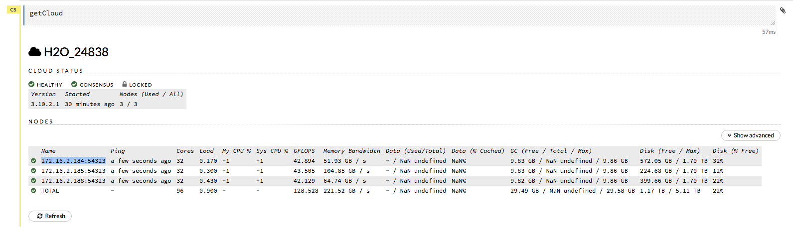
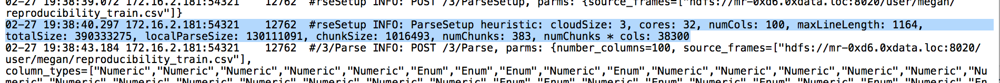
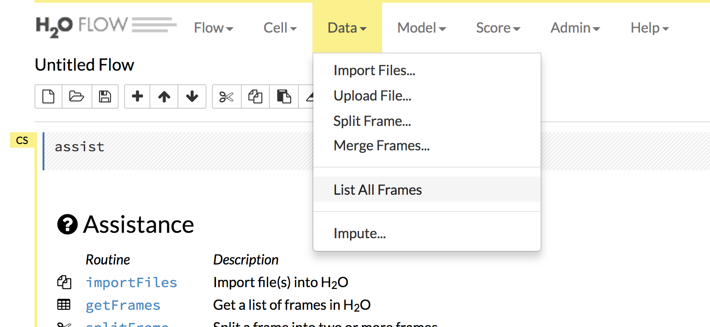
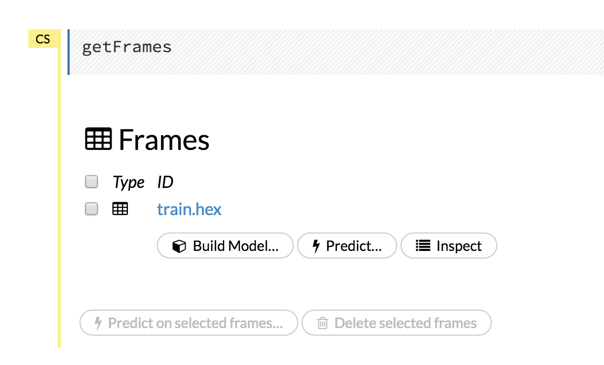
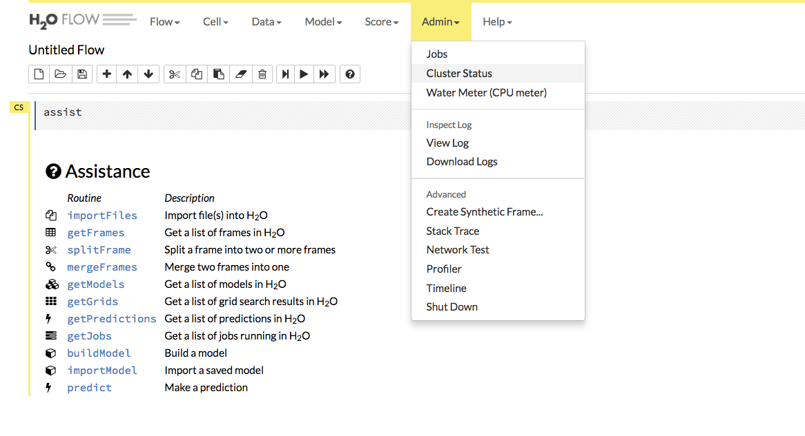
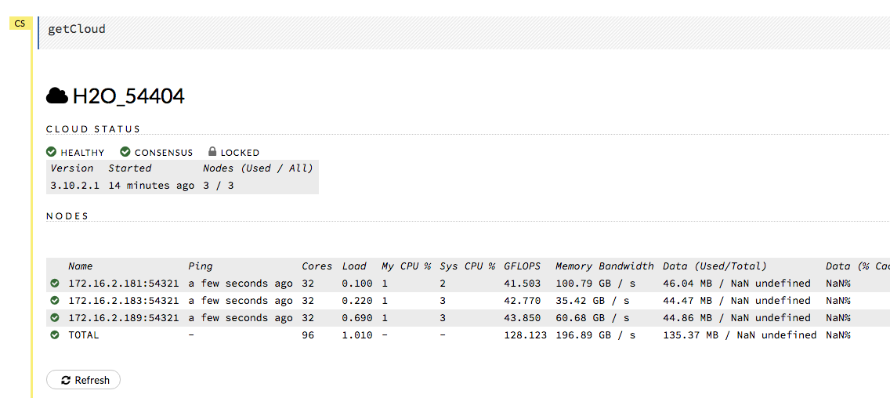
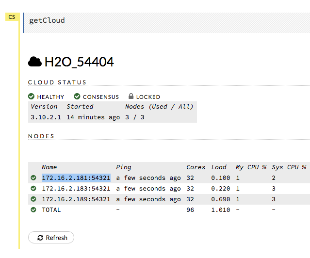

Reproducibility
^^^^^^^^^^^^^^^

Is it possible to guarantee reproducibility in single node cluster?
###################################################################

The following criteria must be met to guarantee reproducibility in a single node cluster:

- Same training data. **Note**: If you have H2O import a whole directory with multiple files instead of a single file, we do not guarantee reproducibility because the data may be shuffled during import.
- Same parameters are used to train the model.
- Same seed is used if sampling is done. The following parameters perform sampling:

   - ``sample_rate``
   - ``sample_rate_per_class``
   - ``col_sample_rate``
   - ``col_sample_rate_change_per_level``
   - ``col_sample_rate_per_tree``

- No early stopping performed or early stopping with ``score_tree_interval`` is explicitly specified and the same validation data.
   
Is it possible to guarantee reproducibility in multi-node clusters?
###################################################################

The following criteria must be met to guarantee reproducibility in a multi-node cluster:

- Reproducible requirements for single node cluster are met. (See above.)
- The cluster configuration is the same:
  
  - Clusters must have the same number of nodes.
  - Nodes must have the same number of CPU cores available (or same restriction on number of threads).
    
  If you do not have a machine with the same number of CPU cores, see the question "How can I reproduce a model if machines have a different number of CPU cores?" below.

- The model training is triggered from the leader node of the cluster. (See note below.)

**Note**: When H2O is running on Hadoop, the leader node is automatically returned by the h2odriver as the node that the user should connect to. In multi-node deployments of Standalone H2O, the leader node has to be manually identified by the user. Flow users can easily check whether they are connected to the leader node by opening Cluster Status (from the Admin menu) and checking that the first node has the same IP address as they see in their browser's address bar.

**Note**: In H2O versions prior to 3.18.0.1, the node automatically returned by the h2odriver while running on Hadoop was not guaranteed to be the leader node.  If you are using a version prior to 3.18.0.1 and you are running H2O on Hadoop, the leader node has to be manually identified by the user for reproducibility.  See question "How do I reproduce a model where model training was not triggered from the leader node?" below.

How deterministic is GBM?
#########################

As long as criteria for reproducibility is met (see above), GBM is deterministic up to floating point rounding errors (out-of-order atomic addition of multiple threads during histogram building). 

What are the best practices to ensure reproducibility?
######################################################

When building a model the user should perform the following steps to make sure the model can be reproduced in the future:

1. Save any script used to pre-process the data before model training. In the event that you will need to reproduce your model, it is important to save the steps used to create the training data. This information should include how the data is imported into the H2O cluster and whether any data types have been modified (i.e., was a numeric column converted to categorical).

2. Save information about the H2O cluster.
 
 - What are the number of nodes in the cluster?
 - What are the number of CPU cores available?

3. Save the H2O binary model. Refer to :ref:`save_and_load_model` for more information. The binary model will contain the H2O version and the parameters used to train the model.

4. Save the H2O logs.  Refer to [Downloading Logs](https://github.com/h2oai/h2o-3/blob/master/h2o-docs/src/product/logs.rst)

 You do not need to explicitly set a seed to make a GBM model reproducible.  If no seed is set, then H2O-3 will randomly choose a seed.  This seed is saved in the binary model.  To reproduce your model, you can extract the seed from the binary model and re-train the GBM with the seed set.
   
 .. tabs::
    .. code-tab:: r R

         # Train GBM without Seed
         gbm_v1 <- h2o.gbm(y = "Species", training_frame = df, sample_rate = 0.7)

         # Reproduce GBM
         seed <- h2o.get_seed(gbm_v1)
         gbm_v2 <- h2o.gbm(y = "Species", training_frame = df, sample_rate = 0.7, seed = seed)

    .. code-tab:: python

         # Train GBM without Seed
         from h2o.estimators import H2OGradientBoostingEstimator
         gbm_v1 = H2OGradientBoostingEstimator(sample_rate = 0.7)
         gbm_v1.train(y = "Species", training_frame = df)

         # Reproduce GBM
         seed = gbm_v1.params.get('seed').get('actual')
         gbm_v2 = H2OGradientBoostingEstimator(sample_rate = 0.7, seed = seed)
         gbm_v2.train(y = "Species", training_frame = df)

5. Train the GBM model using the same:

 - training data (information about the training data saved in Step 1)
 - cluster configuration (information about the cluster configuration saved in Step 2)
 - parameters (information about the parameters saved in Step 3)

You do not need to explicitly set a seed to make a GBM model reproducible.  If no seed is set, then H2O-3 will randomly choose a seed.  This seed is saved in the binary model.  To reproduce your model, you can extract the seed from the binary model and re-train the GBM with the seed set.
 
.. tabs::
  .. code-tab:: r R

       # Train GBM without Seed
       gbm_v1 <- h2o.gbm(y = "Species", training_frame = df, sample_rate = 0.7)

       # Reproduce GBM
       seed <- h2o.get_seed(gbm_v1)
       gbm_v2 <- h2o.gbm(y = "Species", training_frame = df, sample_rate = 0.7, seed = seed)

  .. code-tab:: python

       # Train GBM without Seed
       from h2o.estimators import H2OGradientBoostingEstimator
       gbm_v1 = H2OGradientBoostingEstimator(sample_rate = 0.7)
       gbm_v1.train(y = "Species", training_frame = df)

       # Reproduce GBM
       seed = gbm_v1.params.get('seed').get('actual')
       gbm_v2 = H2OGradientBoostingEstimator(sample_rate = 0.7, seed = seed)
       gbm_v2.train(y = "Species", training_frame = df)

How can I reproduce a model if machines have a different number of CPU cores?
#############################################################################

In order to reproduce the model on a machine with a different number of CPU cores, we must find the chunk size used when importing the initial data.  The steps below outline how to do this:

1. In the logs of the initial model, check to see if rebalancing occurred.  An example of the rebalancing output is below:

``"Rebalancing train dataset into 145 chunks."``

**If the logs show that rebalancing has occurred, reproducibility is not possible.** If the logs do not mention rebalancing, continue to Step 2.

   .. tabs::
      .. code-tab:: r R

           # Load data with defined chunk size
           raw_train <- h2o.importFile(PATH_TO_TRAIN_FILE, parse = FALSE)
           training_frame <- h2o.parseRaw(data = raw_train, 
                                          chunk_size = CHUNK_SIZE_TRAIN)

      .. code-tab:: python

           # Load data with defined chunk size       
           raw_train = h2o.import_file(PATH_TO_TRAIN_FILE, parse = False)
           setup = h2o.parse_setup(raw_train)
           setup['chunk_size'] = CHUNK_SIZE_TRAIN
           training_frame = h2o.parse_raw(setup)

2. In the logs of the initial model, search for the line that says: **ParseSetup heuristic**. On that line in the logs, the chunk size will be defined. In this example, the chunk size is 1016493.

  
3. Load data with the defined chunk size.

 .. tabs::
    .. code-tab:: r R

       # Load data with defined chunk size
       raw_train <- h2o.importFile(PATH_TO_TRAIN_FILE, parse = FALSE)
       training_frame <- h2o.parseRaw(data = raw_train, 
                                      chunk_size = CHUNK_SIZE_TRAIN)

    .. code-tab:: python

       # Load data with defined chunk size       
       raw_train = h2o.import_file(PATH_TO_TRAIN_FILE, parse = False)
       setup = h2o.parse_setup(raw_train)
       setup['chunk_size'] = CHUNK_SIZE_TRAIN
       training_frame = h2o.parse_raw(setup)

4. Repeat Steps 2-3 if you used validation data.  
5. Train your model. If you are using Flow, you will be able to see the datasets from the Frames menu when you select **Data > List All Frames**. 

  

6. In the logs of the new model, check to see if rebalancing occurred.  An example of the rebalancing output is below:

``"Rebalancing train dataset into 145 chunks."``

**If the logs show that rebalancing has occurred, you will not be able to reproduce the model.**

How do I reproduce a model where model training was not triggered from the leader node?
#######################################################################################

In versions of H2O-3 before 3.16.04 or Steam Versions before 1.4.4, the node that triggered the training of the model was not necessarily the leader node of the cluster. This variability can cause issues in reproducibility. In order to guarantee reproducibility, we must connect to the same node of the H2O cluster as was done during training of the initial model. The steps below outline how to do this:

1. Use the logs of the initial model to determine the node order

  .. figure:: ../../images/GBMReproducibility_NodeLogs.png
     :alt: Logs for each node
  
 a. Unzip the logs from one of the nodes (the node chosen does not matter) and open the info logs.
 
  .. figure:: ../../images/GBMReproducibility_LogsFromSingleNode.png
     :alt: Logs from single node
 
 b. In the logs, search for ``Cloud of size N formed [...]``. For example, in this 3 node cluster, I am searching for the term: ``Cloud of size 3 formed``.

  .. figure:: ../../images/GBMReproducibility_CloudOrder_Logs.png
     :alt: Order of the H2O cloud
     
  Copy the list of nodes - this describes the order of the nodes.  Save this information in a separate document.  Below is an example.

  	* Node 1: mr-0xd4.0xdata.loc/172.16.2.184:54325
	* Node 2: mr-0xd5.0xdata.loc/172.16.2.185:54323
	* Node 3: mr-0xd9.0xdata.loc/172.16.2.189:54321

 2. Find the IP and Port of the node that was processing requests in the H2O cluster	

 a. In the logs search for: ``ParseSetup``
		
  .. figure:: ../../images/GBMReproducibility_ParseSetup.png
     :alt: Node Processing Requests
	

  You may have to try opening multiple zip files to find this term in the logs.  

 b. Identify the IP and Port that processed the ParseSetup request - this will be the IP and Port in the ParseSetup line

    .. figure:: ../../images/GBMReproducibility_NodeGettingRequests.png
     :alt: IP and Port of Node Processing Requests

3. Determine the order of the node found in Step 2.

	a. Using the node order document created in Step 1, identify the position of the node that is processing the requests

In our example, the IP and Port processing requests was:``172.16.2.184:54325``.  We will need to find where that node is in our node order document.

In our example, this is the first node in our list.

4. Start up a new H2O cluster in the command line. This is the H2O cluster we will use to reproduce the model. For example: 

::

 hadoop jar h2odriver.jar -mapperXmx 1g -n 3 -output h2o
 
This cluster must have the same number of nodes as the cluster used to train the inital model.

5. Open Flow. When the H2O cluster is up, you will see the following similar output in the command line. Open Flow using the URL provided in the output.

 ::

  Open H2O Flow in your web browser: http://172.16.2.189:54321

6. Review the Cluster Status in Flow by selecting **Admin > Cluster Status**. 

 

7. Find the IP address that corresponds to the node we need to connect to from Step 1. Remember that in our example, we have to connect to the first node listed. This means that we need to connect to the first node listed in the Cluster Status.

8. Use the selected IP address to connect to H2O from R, Python, or Flow and re-train the model you are interested in reproducing. 
 
**Note**: If you are using Flow, this means you must open Flow in a new browser with the IP and port selected.

Why is the order of nodes (computations) so crucial for reproducibility?
########################################################################

Digital computers are not able to work with real numbers precisely. The range of real numbers is infinite. However, computers can store only finite numbers with limited precision (usually in binary format). This causes several problems - some numbers are not precise in general and have to be rounded, and it also affects basic computation methods such as addition, multiplication, and division.

For example, number 0.1 is 0.1000000000000000055511151231257827021181583404541015625 in 64-bit floating point format. Also, adding 0.2 to 0.1 is not equal to 0.3 in this format, but 0.30000000000000004.

Performing floating-point arithmetic could cause a round-off (or rounding) error - a difference between the result produced by a given algorithm using exact arithmetic and the result generated by the same algorithm using finite-precision. (More information available here: https://en.wikipedia.org/wiki/Round-off_error.)

The error could be cumulated, and the laws of algebra do not necessarily hold. For example, algorithms based on unstable computations can generate various output for various input due to a cumulation of error, and associativity is not guaranteed in floating point.

So, if you use a different leader node in the multi-node cluster, it can choose a different order for map-reduce operations and can cause a different roundoff error.

Why would my model score be different if I used a different number of nthreads, but otherwise used the same model parameters?
#############################################################################################################################

Reproducibility in H2O depends on keeping the layout of the cluster exactly the same, and on making sure that all the nodes have the same number of CPU cores (or that the nthreads parameter is explicitly used).

The parallelization level (number of cores, nthreads) controls how the dataset will be partitioned in memory (into "chunks"). H2O then runs map-reduce tasks in a predictable order on these chunks/partitions. If the number of chunks/partitions is different, the order of reduce operations will be different. Generally, numeric operations can produce different results based on the order of operations. AUC calculation is also sensitive to the ordering, and will produce slightly different results for different chunking. This might cause the model to stop later or earlier.

.. Role in GBM - scoring intervals and early stopping, creating histograms

How does my model provide reproducibility information?
######################################################

Reproducibility information is divided into node information, cluster configuration, and input frames and is stored in MOJO. This can be accessed as: ``model._model_json['output']['reproducibility_information_table']``

The **Input Frames Information** subtable stores the following data (``checksum``  and ``ESPC``) for frames used in the input of the algorithm:

- training frame
- validation frame (optional)
- calibration frame (optional)

The **Cluster Configuration** subtable stores monitoring information:

- ``H2O cluster uptime``
- ``H2O cluster timezone``
- ``H2O data parsing timezone``
- ``H2O cluster verison``
- ``H2O cluster version age``
- ``H2O cluster name``
- ``H2O cluster total nodes``
- ``H2O cluster free memory``
- ``H2O cluster total cores``
- ``H2O cluster allowed cores``
- ``H2O cluster status``
- ``H2O internal security``
- ``H2O API Extensions``

The **Node Information** subtable stores monitoring information for each node. This includes information about the number of threads, the number of CPU cores, node leadership, and the Java runtime:

- ``h2o``: IP
- ``healthy``: (*now-last_ping)<HeartbeatThread.TIMEOUT*
- ``last_ping``: Time (in ms) of last ping
- ``num_cpus``: Actual number of CPUs available to Java
- ``sys_load``: System load; average #runnables/#cores
- ``mem_value_size``: Data on node memory
- ``free_mem``: Free heap
- ``pojo_mem``: Temp (non-data) memory
- ``swap_mem``: Size of data on node's disk
- ``free_disc``: Free disk
- ``max_disc``: Max disk
- ``pid``: PID of current H2O process
- ``num_keys``: Number of local keys
- ``tcps:active``: Open TCP connections
- ``open_fde``: *Open File Descripters*
- ``rpcs_active``: Active Remote Procedural Calls
- ``nthreads``: Number of threads
- ``is_leader``: True only if this node is leader of the cloud; otherwise, false
- ``total_mem``: Total amount of memory in the Java virtual machine
- ``max_mem``: Maximum amount of memory that the Java virtual machine will attempt to use
- ``java_version``: Java version
- ``jvm_launch_parameters``: JVM launch parameters
- ``jvm_pid``: JVM process ID
- ``os_version``: OS version
- ``machine_physical_mem``: Machine physical memory
- ``machine_locale``: Machine locale
