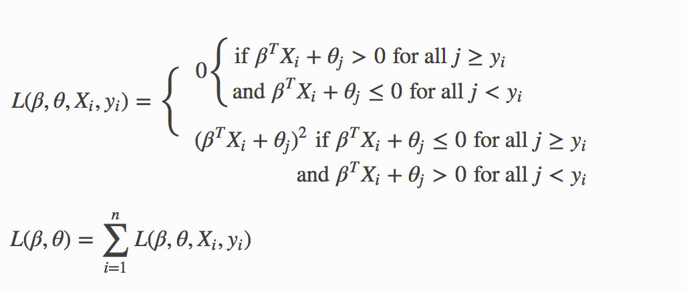

Generalized Linear Model (GLM)
------------------------------

Introduction
~~~~~~~~~~~~

Generalized Linear Models (GLM) estimate regression models for outcomes following exponential distributions. In addition to the Gaussian (i.e. normal) distribution, these include Poisson, binomial, and gamma distributions. Each serves a different purpose, and depending on distribution and link function choice, can be used either for prediction or classification.

The GLM suite includes:

-  Gaussian regression
-  Poisson regression
-  Binomial regression (classification)
-  Multinomial classification
-  Gamma regression
-  Ordinal regression

Defining a GLM Model
~~~~~~~~~~~~~~~~~~~~

-  `model_id <algo-params/model_id.html>`__: (Optional) Specify a custom name for the model to use as
   a reference. By default, H2O automatically generates a destination
   key.

-  `training_frame <algo-params/training_frame.html>`__: (Required) Specify the dataset used to build the
   model. **NOTE**: In Flow, if you click the **Build a model** button from the
   ``Parse`` cell, the training frame is entered automatically.

-  `validation_frame <algo-params/validation_frame.html>`__: (Optional) Specify the dataset used to evaluate
   the accuracy of the model.

-  `nfolds <algo-params/nfolds.html>`__: Specify the number of folds for cross-validation.

-  `seed <algo-params/seed.html>`__: Specify the random number generator (RNG) seed for algorithm components dependent on randomization. The seed is consistent for each H2O instance so that you can create models with the same starting conditions in alternative configurations.

-  `y <algo-params/y.html>`__: (Required) Specify the column to use as the dependent variable.

   -  For a regression model, this column must be numeric (**Real** or **Int**).
   -  For a classification model, this column must be categorical (**Enum** or **String**). If the family is **Binomial**, the dataset cannot contain more than two levels.

-  `x <algo-params/x.html>`__: Specify a vector containing the names or indices of the predictor variables to use when building the model. If ``x`` is missing, then all columns except ``y`` are used.

-  `keep_cross_validation_predictions <algo-params/keep_cross_validation_predictions.html>`__: Specify whether to keep the cross-validation predictions.

-  `keep_cross_validation_fold_assignment <algo-params/keep_cross_validation_fold_assignment.html>`__: Enable this option to preserve the cross-validation fold assignment.

-  `fold_assignment <algo-params/fold_assignment.html>`__: (Applicable only if a value for **nfolds** is specified and **fold_column** is not specified) Specify the cross-validation fold assignment scheme. The available options are AUTO (which is Random), Random, `Modulo <https://en.wikipedia.org/wiki/Modulo_operation>`__, or Stratified (which will stratify the folds based on the response variable for classification problems).

-  `fold_column <algo-params/fold_column.html>`__: Specify the column that contains the cross-validation fold index assignment per observation.

-  `ignored_columns <algo-params/ignored_columns.html>`__: (Optional, Python and Flow only) Specify the column or columns to be excluded from the model. In Flow, click the checkbox next to a column name to add it to the list of columns excluded from the model. To add all columns, click the **All** button. To remove a column from the list of ignored columns, click the X next to the column name. To remove all columns from the list of ignored columns, click the **None** button. To search for a specific column, type the column name in the **Search** field above the column list. To only show columns with a specific percentage of missing values, specify the percentage in the **Only show columns with more than 0% missing values** field. To change the selections for the hidden columns, use the **Select Visible** or **Deselect Visible** buttons.

-  `ignore_const_cols <algo-params/ignore_const_cols.html>`__: Enable this option to ignore constant
   training columns, since no information can be gained from them. This
   option is enabled by default.

-  `score_each_iteration <algo-params/score_each_iteration.html>`__: (Optional) Enable this option to score during each iteration of the model training.

-  `offset_column <algo-params/offset_column.html>`__: Specify a column to use as the offset; the value cannot be the same as the value for the ``weights_column``.
   
     **Note**: Offsets are per-row "bias values" that are used during model training. For Gaussian distributions, they can be seen as simple corrections to the response (y) column. Instead of learning to predict the response (y-row), the model learns to predict the (row) offset of the response column. For other distributions, the offset corrections are applied in the linearized space before applying the inverse link function to get the actual response values. For more information, refer to the following `link <http://www.idg.pl/mirrors/CRAN/web/packages/gbm/vignettes/gbm.pdf>`__.

-  `weights_column <algo-params/weights_column.html>`__: Specify a column to use for the observation weights, which are used for bias correction. The specified ``weights_column`` must be included in the specified ``training_frame``. *Python only*: To use a weights column when passing an H2OFrame to ``x`` instead of a list of column names, the specified ``training_frame`` must contain the specified``weights_column``. 
   
    **Note**: Weights are per-row observation weights and do not increase the size of the data frame. This is typically the number of times a row is repeated, but non-integer values are supported as well. During training, rows with higher weights matter more, due to the larger loss function pre-factor.

-  `family <algo-params/family.html>`__: Specify the model type.

   -  If the family is **gaussian**, the data must be numeric (**Real** or **Int**).
   -  If the family is **binomial**, the data must be categorical 2 levels/classes or binary (**Enum** or **Int**).
   -  If the family is **multinomial**, the data can be categorical with more than two levels/classes (**Enum**).
   -  If the family is **ordinal**, the data must be categorical with at least 3 levels.
   -  If the family is **quasibinomial**, the data must be numeric.
   -  If the family is **poisson**, the data must be numeric and non-negative (**Int**).
   -  If the family is **gamma**, the data must be numeric and continuous and positive (**Real** or **Int**).
   -  If the family is **tweedie**, the data must be numeric and continuous (**Real**) and non-negative.

-  `tweedie_variance_power <algo-params/tweedie_variance_power.html>`__: (Only applicable if *Tweedie* is
   specified for **Family**) Specify the Tweedie variance power.

-  `tweedie_link_power <algo-params/tweedie_link_power.html>`__: (Only applicable if *Tweedie* is specified
   for **Family**) Specify the Tweedie link power.

-  `solver <algo-params/solver.html>`__: Specify the solver to use (AUTO, IRLSM, L_BFGS, COORDINATE_DESCENT_NAIVE, COORDINATE_DESCENT, GRADIENT_DESCENT_LH, or GRADIENT_DESCENT_SQERR). IRLSM is fast on problems with a small number of predictors and for lambda search with L1 penalty, while `L_BFGS <http://cran.r-project.org/web/packages/lbfgs/vignettes/Vignette.pdf>`__ scales better for datasets with many columns. COORDINATE_DESCENT is IRLSM with the covariance updates version of cyclical coordinate descent in the innermost loop. COORDINATE_DESCENT_NAIVE is IRLSM with the naive updates version of cyclical coordinate descent in the innermost loop. GRADIENT_DESCENT_LH and GRADIENT_DESCENT_SQERR can only be used with the Ordinal family.

-  `alpha <algo-params/alpha.html>`__: Specify the regularization distribution between L1 and L2.

-  `lambda <algo-params/lambda.html>`__: Specify the regularization strength.

-  `lambda_search <algo-params/lambda_search.html>`__: Specify whether to enable lambda search, starting with lambda max (the smallest :math:`\lambda` that drives all coefficients to zero). If you also specify a value for ``lambda_min_ratio``, then this value is interpreted as lambda min. If you do not specify a value for ``lambda_min_ratio``, then GLM will calculate the minimum lambda. 

-  `early_stopping <algo-params/early_stopping.html>`__: Specify whether to stop early when there is no more relative improvement on the training  or validation set.
   
-  `nlambdas <algo-params/nlambdas.html>`__: (Applicable only if **lambda_search** is enabled) Specify the number of lambdas to use in the search. The default is 100.

-  `standardize <algo-params/standardize.html>`__: Specify whether to standardize the numeric columns to have a mean of zero and unit variance. Standardization is highly recommended; if you do not use standardization, the results can include components that are dominated by variables that appear to have larger variances relative to other attributes as a matter of scale, rather than true contribution. This option is enabled by default.

-  `missing_values_handling <algo-params/missing_values_handling.html>`__: Specify how to handle missing values (Skip or MeanImputation).

-  `compute_p_values <algo-params/compute_p_values.html>`__: Request computation of p-values. Only applicable with no penalty (lambda = 0 and no beta constraints). Setting remove_collinear_columns is recommended. H2O will return an error if p-values are requested and there are collinear columns and remove_collinear_columns flag is not enabled. Note that this option is not available for ``family="multinomial"`` or ``family="ordinal"``. 

-  `remove_collinear_columns <algo-params/remove_collinear_columns.html>`__: Specify whether to automatically remove collinear columns during model-building. When enabled, collinear columns will be dropped from the model and will have 0 coefficient in the returned model. This can only be set if there is no regularization (lambda=0).

-  `intercept <algo-params/intercept.html>`__: Specify whether to include a constant term in the model. This option is enabled by default. 

-  `non_negative <algo-params/non_negative.html>`__: Specify whether to force coefficients to have non-negative values.

-  `max_iterations <algo-params/max_iterations.html>`__: Specify the number of training iterations.

-  `objective_epsilon <algo-params/objective_epsilon.html>`__: Specify a threshold for convergence. If the objective value is less than this threshold, the model is converged.

-  `beta_epsilon <algo-params/beta_epsilon.html>`__: Specify the beta epsilon value. If the L1 normalization of the current beta change is below this threshold, consider using convergence.

-  `gradient_epsilon <algo-params/gradient_epsilon.html>`__: (For L-BFGS only) Specify a threshold for convergence. If the objective value (using the L-infinity norm) is less than this threshold, the model is converged.

-  `link <algo-params/link.html>`__: Specify a link function (Identity, Family_Default, Logit, Log, Inverse, Tweedie, Ologit, Oprobit, and Ologlog).

   -  If the family is **Gaussian**, then **Identity**, **Log**, and **Inverse** are supported.
   -  If the family is **Binomial**, then **Logit** is supported.
   -  If the family is **Poisson**, then **Log** and **Identity** are supported.
   -  If the family is **Gamma**, then **Inverse**, **Log**, and **Identity** are supported.
   -  If the family is **Tweedie**, then only **Tweedie** is supported.
   -  If the family is **Multinomial**, then only **Family_Default** is supported. (This defaults to ``multinomial``.)
   -  If the family is **Quasibinomial**, then only **Logit** is supported.
   -  If the family is **Ordinal**, then only **Ologit**, **Oprobit**, and **Ologlog** are supported.

-  `prior <algo-params/prior.html>`__: Specify prior probability for p(y==1). Use this parameter for logistic regression if the data has been sampled and the mean of response does not reflect reality. This value defaults to -1 and must be a value in the range (0,1).
   
     **Note**: This is a simple method affecting only the intercept. You may want to use weights and offset for a better fit.

-  `lambda_min_ratio <algo-params/lambda_min_ratio.html>`__: Specify the minimum lambda to use for lambda search (specified as a ratio of **lambda_max**, which is the smallest :math:`\lambda` for which the solution is all zeros).

-  `beta_constraints <algo-params/beta_constraints.html>`__: Specify a dataset to use beta constraints. The selected frame is used to constrain the coefficient vector to provide upper and lower bounds. The dataset must contain a names column with valid coefficient names.

-  `max_active_predictors <algo-params/max_active_predictors.html>`__: Specify the maximum number of active
   predictors during computation. This value is used as a stopping
   criterium to prevent expensive model building with many predictors.

-  `interactions <algo-params/interactions.html>`__: Specify a list of predictor column indices to interact. All pairwise combinations will be computed for this list. 

-  `interaction_pairs <algo-params/interaction_pairs.html>`__: When defining interactions, use this option to specify a list of pairwise column interactions (interactions between two variables). Note that this is different than ``interactions``, which will compute all pairwise combinations of specified columns.

-  **obj_reg**: Specifies the likelihood divider in objective value computation. This defaults to 1/nobs.

Interpreting a GLM Model
~~~~~~~~~~~~~~~~~~~~~~~~

By default, the following output displays:

-  Model parameters (hidden)
-  A bar chart representing the standardized coefficient magnitudes (blue for negative, orange for positive). Note that this only displays is standardization is enabled.
-  A graph of the scoring history (objective vs. iteration)
-  Output (model category, validation metrics, and standardized coefficients magnitude)
-  GLM model summary (family, link, regularization, number of total predictors, number of active predictors, number of iterations, training frame)
-  Scoring history in tabular form (timestamp, duration, iteration, log likelihood, objective)
-  Training metrics (model, model checksum, frame, frame checksum, description, model category, scoring time, predictions, MSE, r2, residual deviance, null deviance, AIC, null degrees of freedom, residual degrees of freedom)  
-  Coefficients
-  Standardized coefficient magnitudes (if standardization is enabled)

Classification and Regression
~~~~~~~~~~~~~~~~~~~~~~~~~~~~~

GLM can produce two categories of models: classification and regression. Logistic regression is the GLM performing binary classification.

The data type of the response column determines the model category. If the response is a categorical variable (also called a factor or an enum), then a classification model is created. If the response column data type is numeric (either integer or real), then a regression model is created.

Handling of Categorical Variables
'''''''''''''''''''''''''''''''''

If the response column is categorical, then a classification model is created. GLM supports both binary and multinomial classification. For binary classification, the response column can only have two levels; for multinomial classification, the response column will have more than two levels. We recommend letting GLM handle categorical columns, as it can take advantage of the categorical column for better performance and memory utilization.

We strongly recommend avoiding one-hot encoding categorical columns with any levels into many binary columns, as this is very inefficient. This is especially true for Python users who are used to expanding their categorical variables manually for other frameworks.

Handling of Numeric Variables
'''''''''''''''''''''''''''''

When GLM performs regression (with factor columns), one category can be left out to avoid multicollinearity. If regularization is disabled (``lambda = 0``), then one category is left out. However, when using a the default lambda parameter, all categories are included.  

The reason for the different behavior with regularization is that collinearity is not a problem with regularization. 
And it’s better to leave regularization to find out which level to ignore (or how to distribute the coefficients between the levels).

Family and Link Functions
~~~~~~~~~~~~~~~~~~~~~~~~~

GLM problems consist of three main components:

- A random component :math:`f` for the dependent variable :math:`y`: The density function :math:`f(y;\theta,\phi)` has a probability distribution from the exponential family parametrized by :math:`\theta` and :math:`\phi`. This removes the restriction on the distribution of the error and allows for non-homogeneity of the variance with respect to the mean vector. 
- A systematic component (linear model) :math:`\eta`: :math:`\eta = X\beta`, where :math:`X` is the matrix of all observation vectors :math:`x_i`.
- A link function :math:`g`: :math:`E(y) = \mu = {g^-1}(\eta)` relates the expected value of the response :math:`\mu` to the linear component :math:`\eta`. The link function can be any monotonic differentiable function. This relaxes the constraints on the additivity of the covariates, and it allows the response to belong to a restricted range of values depending on the chosen transformation :math:`g`. 

Accordingly, in order to specify a GLM problem, you must choose a family function :math:`f`, link function :math:`g`, and any parameters needed to train the model.

Families
''''''''

The ``family`` option specifies a probability distribution from an exponential family. You can specify one of the following, based on the response column type:

- ``gaussian``: The data must be numeric (Real or Int). This is the default family.
- ``binomial``: The data must be categorical 2 levels/classes or binary (Enum or Int).
- ``multinomial``: The data can be categorical with more than two levels/classes (Enum).
- ``ordinal``: Requires a categorical response with at least 3 levels. (For 2-class problems use family="binomial".)
- ``quasibinomial``: The data must be numeric.
- ``poisson``: The data must be numeric and non-negative (Int).
- ``gamma``: The data must be numeric and continuous and positive (Real or Int).
- ``tweedie``: The data must be numeric and continuous (Real) and non-negative.

**Note**: If your response column is binomial, then you must convert that column to a categorical (``.asfactor()`` in Python and ``as.factor()`` in R) and set ``family = binomial``. The following configurations can lead to unexpected results. 

 - If you DO convert the response column to categorical and DO NOT to set ``family=binomial``, then you will receive an error message.
 - If you DO NOT convert response column to categorical and DO NOT set the family, then GLM will assume the 0s and 1s are numbers and will provide a Gaussian solution to a regression problem.

Linear Regression (Gaussian Family)
^^^^^^^^^^^^^^^^^^^^^^^^^^^^^^^^^^^

Linear regression corresponds to the Gaussian family model. The link function :math:`g` is the identity, and density :math:`f` corresponds to a normal distribution. It is the simplest example of a GLM but has many uses and several advantages over other families. Specifically, it is faster and requires more stable computations. Gaussian models the dependency between a response :math:`y` and a covariates vector :math:`x` as a linear function:

.. math::

 \hat {y} = {x^T}\beta + {\beta_0}

The model is fitted by solving the least squares problem, which is equivalent to maximizing the likelihood for the Gaussian family.

.. math::
   
 ^\text{max}_{\beta,\beta_0} - \dfrac {1} {2N} \sum_{i=1}^{N}(x_{i}^{T}\beta + \beta_0 - y_i)^2 - \lambda \Big( \alpha||\beta||_1 + \dfrac {1} {2}(1 - \alpha)||\beta||^2_2 \Big)

The deviance is the sum of the squared prediction errors:

.. math::

 D = \sum_{i=1}^{N}(y_i - \hat {y}_i)^2

Logistic Regression (Binomial Family)
^^^^^^^^^^^^^^^^^^^^^^^^^^^^^^^^^^^^^

Logistic regression is used for binary classification problems where the response is a categorical variable with two levels. It models the probability of an observation belonging to an output category given the data (for example, :math:`Pr(y=1|x)`). The canonical link for the binomial family is the logit function (also known as log odds). Its inverse is the logistic function, which takes any real number and projects it onto the [0,1] range as desired to model the probability of belonging to a class. The corresponding s-curve is below:

.. figure:: ../images/scurve.png 
   :width: 400px
   :alt: S-curve

The fitted model has the form:

.. math::

 \hat {y} = Pr(y=1|x) = \dfrac {e^{x{^T}\beta + {\beta_0}}} {1 + {e^{x{^T}\beta + {\beta_0}}}}

This can alternatively be written as:

.. math::

 \text{log} \Big( \dfrac {\hat {y}} {1-\hat {y}} \Big) = \text{log} \Big( \dfrac {Pr(y=1|x)} {Pr(y=0|x)} \Big) = x^T\beta + \beta_0

The model is fitted by maximizing the following penalized likelihood:

.. math::

 ^\text{max}_{\beta,\beta_0} \dfrac {1} {N} \sum_{i=1}^{N} \Big( y_i(x_{i}^{T}\beta + \beta_0) - \text{log} (1 + e^{x{^T_i}\beta + {\beta_0}} ) \Big)- \lambda \Big( \alpha||\beta||_1 + \dfrac {1} {2}(1 - \alpha)||\beta||^2_2 \Big)

The corresponding deviance is equal to:

.. math::

 D = -2 \sum_{i=1}^{n} \big( y_i \text{log}(\hat {y}_i) + (1 - y_i) \text{log}(1 - \hat {y}_i) \big)

Logistic Ordinal Regression (Ordinal Family)
^^^^^^^^^^^^^^^^^^^^^^^^^^^^^^^^^^^^^^^^^^^^

A logistic ordinal regression model is a generalized linear model that predicts ordinal variables - variables that are discreet, as in classification, but that can be ordered, as in regression.

Let :math:`X_i\in\rm \Bbb I \!\Bbb R^p`, :math:`y` can belong to any of the :math:`K` classes. In logistic ordinal regression, we model the cumulative distribution function (CDF) of :math:`y` belonging to class :math:`j`, given :math:`X_i` as the logistic function:

.. math::

  P(y \leq j|X_i) = \phi(\beta^{T}X_i + \theta_j) = \dfrac {1} {1+ \text{exp} (-\beta^{T}X_i - \theta_j)}

Compared to multiclass logistic regression, all classes share the same :math:`\beta` vector. This adds the constraint that the hyperplanes that separate the different classes are parallel for all classes. To decide which class will :math:`X_i` be predicted, we use the thresholds vector :math:`\theta`. If there are :math:`K` different classes, then :math:`\theta` is a non-decreasing vector (that is, :math:`\theta_0 \leq \theta_1 \leq \ldots \theta_{K-2})` of size :math:`K-1`. We then assign :math:`X_i` to the class :math:`j` if :math:`\beta^{T}X_i + \theta_j > 0` for the lowest class label :math:`j`.

We choose a logistic function to model the probability :math:`P(y \leq j|X_i)` but other choices are possible. 

To determine the values of :math:`\beta` and :math:`\theta`, we maximize the log-likelihood minus the same Regularization Penalty, as with the other families. 

.. math::

  L(\beta,\theta) = \sum_{i=1}^{n} \text{log} \big( \phi (\beta^{T}X_i + \theta_{y_i}) - \phi(\beta^{T}X_i + \theta_{{y_i}-1}) \big)

Conventional ordinal regression uses a likelihood function to adjust the model parameters. However, during prediction, GLM looks at the log CDF odds. 

.. math::
   log \frac {P(y_i \leq j|X_i)} {1 - P(y_i \leq j|X_i)} = \beta^{T}X_i + \theta_{y_j} 

As a result, there is a small disconnect between the two. To remedy this, we have implemented a new algorithm to set and adjust the model parameters. 

Recall that during prediction, a dataset row represented by :math:`X_i` will be set to class :math:`j` if 

.. math::
   log \frac {P(y_i \leq j|X_i)} {1 - P(y_i \leq j|X_i)} = \beta^{T}X_i + \theta_{j} > 0

and

.. math::
   \beta^{T}X_i + \theta_{j'} \leq 0 \; \text{for} \; j' < j

Hence, for each training data sample :math:`(X_{i}, y_i)`, we adjust the model parameters :math:`\beta, \theta_0, \theta_1, \ldots, \theta_{K-2}` by considering the thresholds :math:`\beta^{T}X_i + \theta_j` directly. The following loss function is used to adjust the model parameters:

Again, you can add the Regularization Penalty to the loss function. The model parameters are adjusted by minimizing the loss function using gradient descent. When the Ordinal family is specified, the ``solver`` parameter will automatically be set to ``GRADIENT_DESCENT_LH`` and use the log-likelihood function. To adjust the model parameters using the loss function, you can set the solver parameter to ``GRADIENT_DESCENT_SQERR``. 

Because only first-order methods are used in adjusting the model parameters, use Grid Search to choose the best combination of the ``obj_reg``, ``alpha``, and ``lambda`` parameters.

In general, the loss function methods tend to generate better accuracies than the likelihood method. In addition, the loss function method is faster as it does not deal with logistic functions - just linear functions when adjusting the model parameters.

Pseudo-Logistic Regression (Quasibinomial Family)
^^^^^^^^^^^^^^^^^^^^^^^^^^^^^^^^^^^^^^^^^^^^^^^^^

The quasibinomial family option works in the same way as the aforementioned binomial family. The difference is that binomial models only support 0/1 for the values of the target. A quasibinomial model supports "pseudo" logistic regression and allows for two arbitrary integer values (for example -4, 7). Additional information about the quasibinomial option can be found in the `"Estimating Effects on Rare Outcomes: Knowledge is Power" <http://biostats.bepress.com/ucbbiostat/paper310/>`__ paper.

Multiclass Classification (Multinomial Family)
^^^^^^^^^^^^^^^^^^^^^^^^^^^^^^^^^^^^^^^^^^^^^^

Multinomial family generalization of the binomial model is used for multi-class response variables. Similar to the binomail family, GLM models the conditional probability of observing class "c" given "x". A vector of coefficients exists for each of the output classes. (:math:`\beta` is a matrix.) The probabilities are defined as:

.. math::

 - \Big[ \dfrac {1} {N} \sum_{i=1}^N \sum_{k=1}^K \big( y_{i,k} (x^T_i \beta_k + \beta_{k0}) \big) - \text{log} \big( \sum_{k=1}^K e^{x{^T_i}\beta_k + {\beta_{k0}}} \big) \Big] + \lambda \Big[ \dfrac {(1-\alpha)} {2} ||\beta || ^2_F + \alpha \sum_{j=1}^P ||\beta_j ||_1 \Big]

where :math:`\beta_c` is a vector of coefficients for class "c", and :math:`y_{i,k}` is the :math:`k\text{th}` element of the binary vector produced by expanding the response variable using one-hot encoding (i.e., :math:`y_{i,k} == 1` iff the response at the :math:`i\text{th}` observation is "k"; otherwise it is 0.)

Poisson Models
^^^^^^^^^^^^^^

Poisson regression is typically used for datasets where the response represents counts, and the errors are assumed to have a Poisson distribution. In general, it can be applied to any data where the response is non-negative. It models the dependency between the response and covariates as:

.. math::

  \hat {y} = e^{x{^T}\beta + {\beta_{0}}}

The model is fitted by maximizing the corresponding penalized likelihood:

.. math::

 ^\text{max}_{\beta,\beta_0} \dfrac {1} {N} \sum_{i=1}^{N} \Big( y_i(x_{i}^{T}\beta + \beta_0) - e^{x{^T_i}\beta + {\beta_0}} \Big)- \lambda \Big( \alpha||\beta||_1 + \dfrac {1} {2}(1 - \alpha)||\beta||^2_2 \Big)

The corresponding deviance is equal to:

.. math::

 D = -2 \sum_{i=1}^{N} \big( y_i \text{log}(y_i / \hat {y}_i) - (y_i - \hat {y}_i) \big)

Note in the equation above that H2O-3 uses the negative log of the likelihood. This is different than the way deviance is specified in https://onlinecourses.science.psu.edu/stat501/node/377/. In order to use this deviance definition, simply multiply the H2O-3 deviance by -1. 

Gamma Models
^^^^^^^^^^^^

The gamma distribution is useful for modeling a positive continuous response variable, where the conditional variance of the response grows with its mean, but the coefficientof variation of the response :math:`\sigma^2(y_i)/\mu_i` is constant. It is usually used with the log link :math:`g(\mu_i) = \text{log}(\mu_i)` or the inverse link :math:`g(\mu_i) = \dfrac {1} {\mu_i}`, which is equivalent to the canonical link. 

The model is fitted by solving the following likelihood maximization:

.. math::

 ^\text{max}_{\beta,\beta_0} - \dfrac {1} {N} \sum_{i=1}^{N} \dfrac {y_i} {x{^T_i}\beta + \beta_0} + \text{log} \big( x{^T_i}\beta + \beta_0 \big ) - \lambda \Big( \alpha||\beta||_1 + \dfrac {1} {2}(1 - \alpha)||\beta||^2_2 \Big)

The corresponding deviance is equal to:

.. math::

 D = 2 \sum_{i=1}^{N} - \text{log} \bigg (\dfrac {y_i} {\hat {y}_i} \bigg) + \dfrac {(y_i - \hat{y}_i)} {\hat {y}_i}

Tweedie Models
^^^^^^^^^^^^^^

Tweedie distributions are a family of distributions that include gamma, normal, Poisson, and their combination. Tweedie distributions are especially useful for modeling positive continuous variables with exact zeros. The variance of the Tweedie distribution is proportional to the :math:`p\text{th}` power of the mean :math:`var(y_i) = \phi\mu{^p_i}`. 

The Tweedie distribution is parametrized by variance power :math:`p`. It is defined for all :math:`p` values except in the (0,1) interval and has the following distributions as special cases:

- :math:`p = 0`: Normal
- :math:`p = 1`: Poisson
- :math:`p \in (1,2)`: Compound Poisson, non-negative with mass at zero
- :math:`p = 2`: Gamma
- :math:`p = 3`: Gaussian
- :math:`p > 2`: Stable, with support on the positive reals

For :math:`p > 1`, the model likelood to maximize has the form:

.. math::

 ^\text{max}_{\beta,\beta_0} \sum_{i=1}^{N} \text{log} (a(y_i, \phi)) + \bigg( \dfrac {1} {\phi} \bigg(\dfrac {y_i\mu{^{1-p}_i}} {1-p} - \kappa(\mu_i, p) \bigg) \bigg) - \lambda \bigg ( \alpha || \beta ||_1 + \dfrac {1} {2} (1-\alpha) ||\beta||{^2_2} \bigg )

where :math:`\kappa(\mu,p) = \mu^{2-p} / (2-p)` for :math:`p \neq 2` and :math:`\kappa(\mu,p) = \text{log} (\mu)` for :math:`p=2`, and where the function :math:`a(y_i,\phi)` is evaluated using series expansion because it does not have an analytical solution. The link function in the GLM representation of the Tweedie distribution defaults to :math:`g(\mu) = \mu^q = \eta = X\beta` with :math:`q=1-p`. The link power :math:`q` can be set to other values, including :math:`q=0`, which is interpreated as :math:`\text{log}(\mu)=\eta`. 

The corresponding deviance when :math:`p \neq 1` and :math:`p \neq 2` is equal to:

.. math::

 D = -2 \sum_{i=1}^{N} y_i(y_i^{1-p} - \hat{y}_i^{1-p}) - \dfrac {(y_i^{2-p} - \hat{y}_i^{2-p})} {(2-p)}

Links
'''''

As indicated previously, a link function :math:`g`: :math:`E(y) = \mu = {g^-1}(\eta)` relates the expected value of the response :math:`\mu` to the linear component :math:`\eta`. The link function can be any monotonic differentiable function. This relaxes the constraints on the additivity of the covariates, and it allows the response to belong to a restricted range of values depending on the chosen transformation :math:`g`.

H2O's GLM supports the following link functions: Family_Default, Identity, Logit, Log, Inverse, Tweedie, Ologit, Oprobit, and Ologlog.

The following table describes the allowed Family/Link combinations.

+----------------+-------------------------------------------------------------+--------+---------+---------+
| **Family**     | **Link Function**                                                                        |
+----------------+----------------+----------+-------+-----+---------+---------+--------+---------+---------+
|                | Family_Default | Identity | Logit | Log | Inverse | Tweedie | Ologit | Oprobit | Ologlog |
+----------------+----------------+----------+-------+-----+---------+---------+--------+---------+---------+
| Binomial       | X              |          | X     |     |         |         |        |         |         |
+----------------+----------------+----------+-------+-----+---------+---------+--------+---------+---------+
| Quasibinomial  | X              |          | X     |     |         |         |        |         |         |
+----------------+----------------+----------+-------+-----+---------+---------+--------+---------+---------+
| Multinomial    | X              |          |       |     |         |         |        |         |         |
+----------------+----------------+----------+-------+-----+---------+---------+--------+---------+---------+
| Ordinal        | X              |          |       |     |         |         | X      | X       | X       |
+----------------+----------------+----------+-------+-----+---------+---------+--------+---------+---------+
| Gaussian       | X              | X        |       | X   | X       |         |        |         |         |
+----------------+----------------+----------+-------+-----+---------+---------+--------+---------+---------+
| Poisson        | X              | X        |       | X   |         |         |        |         |         |
+----------------+----------------+----------+-------+-----+---------+---------+--------+---------+---------+
| Gamma          | X              | X        |       | X   | X       |         |        |         |         |
+----------------+----------------+----------+-------+-----+---------+---------+--------+---------+---------+
| Tweedie        | X              |          |       |     |         | X       |        |         |         |
+----------------+----------------+----------+-------+-----+---------+---------+--------+---------+---------+

Regularization
~~~~~~~~~~~~~~

Regularization is used to attempt to solve problems with overfitting that can occur in GLM. Penalties can be introduced to the model building process to avoid overfitting, to reduce variance of the prediction error, and to handle correlated predictors. The two most common penalized models are ridge regression and LASSO (least absolute shrinkage and selection operator). The elastic net combines both penalties using both the ``alpha`` and ``lambda`` options (i.e., values greater than 0 for both).

LASSO and Ridge Regression
''''''''''''''''''''''''''

LASSO represents the :math:`\ell{_1}` penalty and is an alternative regularized least squares method that penalizes the sum of the absolute coefficents :math:`||\beta||{_1} = \sum{^p_{k=1}} \beta{^2_k}`. LASSO leads to a sparse solution when the tuning parameter is sufficiently large. As the tuning parameter value :math:`\lambda` is increased, all coefficients are set to zero. Because reducing parameters to zero removes them from the model, LASSO is a good selection tool. 

Ridge regression penalizes the :math:`\ell{_2}` norm of the model coefficients :math:`||\beta||{^2_2} = \sum{^p_{k=1}} \beta{^2_k}`. It provides greater numerical stability and is easier and faster to compute than LASSO. It keeps all the predictors in the model and shrinks them proportionally. Ridge regression reduces coefficient values simultaneously as the
penalty is increased without setting any of them to zero.

Variable selection is important in numerous modern applications wiht many covariates where the :math:`\ell{_1}` penalty has proven to be successful. Therefore, if the number of variables is large or if the solution is known to be sparse, we recommend using LASSO, which will select a small number of variables for sufficiently high :math:`\lambda` that could be crucial to the inperpretability of the mode. The :math:`\ell{_2}` norm does not have this effect; it shrinks the coefficients but does not set them exactly to zero. 

The two penalites also differ in the presence of correlated predictors. The :math:`\ell{_2}` penalty shrinks coefficients for correlated columns toward each other, while the :math:`\ell{_1}` penalty tends to select only one of them and sets the other coefficients to zero. Using the elastic net argument :math:`\alpha` combines these two behaviors. 

The elastic net method selects variables and preserves the grouping effect (shrinking coefficients of correlated columns together). Moreover, while the number of predictors that can enter a LASSO model saturates at min :math:`(n,p)` (where :math:`n` is the number of observations, and :math:`p` is the number of variables in the model), the elastic net does not have this limitation and can fit models with a larger number of predictors. 

Elastic Net Penalty
'''''''''''''''''''

As indicated previously, elastic net regularization is a combination of the :math:`\ell{_1}` and :math:`\ell{_2}` penalties parametrized by the :math:`\alpha` and :math:`\lambda` arguments (similar to "Regularization Paths for Genarlized Linear Models via Coordinate Descent" by Friedman et all).

 - :math:`\alpha` controls the elastic net penalty distribution between the :math:`\ell_1` and :math:`\ell_2` norms. It can have any value in the [0,1] range or a vector of values (via grid search). If :math:`\alpha=0`, then H2O solves the GLM using ridge regression. If :math:`\alpha=1`, then LASSO penalty is used. 

 - :math:`\lambda` controls the penalty strength. The range is any positive value or a vector of values (via grid search). Note that :math:`\lambda` values are capped at :math:`\lambda_{max}`, which is the smallest :math:`\lambda` for which the solution is all zeros (except for the intercept term).

The combination of the :math:`\ell_1` and :math:`\ell_2` penalties is beneficial because :math:`\ell_1` induces sparsity, while :math:`\ell_2` gives stability and encourages the grouping effect (where a group of correlated variables tend to be dropped or added into the model simultaneously). When focusing on sparsity, one possible use of the :math:`\alpha` argument involves using the :math:`\ell_1` mainly with very little :math:`\ell_2` (:math:`\alpha` almost 1) to stabilize the computation and improve convergence speed.

Regularization Parameters in GLM
''''''''''''''''''''''''''''''''

To get the best possible model, we need to find the optimal values of the regularization parameters :math:`\alpha` and
:math:`\lambda`.  To find the optimal values, H2O allows you to perform a grid search over :math:`\alpha` and a special form of grid search called "lambda search" over :math:`\lambda`.

The recommended way to find optimal regularization settings on H2O is to do a grid search over a few :math:`\alpha` values with an automatic lambda search for each :math:`\alpha`. 

- **Alpha**

 The ``alpha`` parameter controls the distribution between the :math:`\ell{_1}` (LASSO) and :math:`\ell{_2}` (ridge regression) penalties. A value of 1.0 for ``alpha`` represents LASSO, and an ``alpha`` value of 0.0 produces ridge reguression. 

- **Lambda**

 The ``lambda`` parameter controls the amount of regularization applied. If ``lambda`` is 0.0, no regularization is applied, and the ``alpha`` parameter is ignored. The default value for ``lambda`` is calculated by H2O using a heuristic based on the training data. If you allow H2O to calculate the value for ``lambda``, you can see the chosen value in the model output. 

Lambda Search
'''''''''''''

If the ``lambda_search`` option is set, GLM will compute models for full regularization path similar to glmnet. (See the `glmnet paper <https://core.ac.uk/download/pdf/6287975.pdf>`__.) Regularization path starts at lambda max (highest lambda values which makes sense - i.e. lowest value driving all coefficients to zero) and goes down to lambda min on log scale, decreasing regularization strength at each step. The returned model will have coefficients corresponding to the “optimal” lambda value as decided during training.

When looking for a sparse solution (``alpha`` > 0), lambda search can also be used to efficiently handle very wide datasets because it can filter out inactive predictors (noise) and only build models for a small subset of predictors. A possible use case for lambda search is to run it on a dataset with many predictors but limit the number of active predictors to a relatively small value. 

Lambda search can be configured along with the following arguments:

- ``alpha``: Regularization distribution between :math:`\ell_1` and :math:`\ell_2`.
- ``validation_frame`` and/or ``nfolds``: Used to select the best lambda based on the cross-validation performance or the validation or training data. If available, cross-validation performance takes precedence. If no validation data is available, the best lambda is selected based on training data performance and is therefore guaranteed to always be the minimal lambda computed since GLM cannot overfit on a training dataset.

 **Note**: If running lambda search with a validation dataset and cross-validation disabled, the chosen lambda value corresponds to the lambda with the lowest validation error. The validation dataset is used to select the model, and the model performance should be evaluated on another independent test dataset.

- ``lambda_min_ratio`` and ``nlambdas``: The sequence of the :math:`\lambda` values is automatically generated as an exponentially decreasing sequence. It ranges from :math:`\lambda_{max}` (the smallest :math:`\lambda` so that the solution is a model with all 0s) to :math:`\lambda_{min} =` ``lambda_min_ratio`` :math:`\times` :math:`\lambda_{max}`.

 H2O computes :math:`\lambda` models sequentially and in decreasing order, warm-starting the model (using the previous solutin as the initial prediction) for :math:`\lambda_k` with the solution for :math:`\lambda_{k-1}`. By warm-starting the models, we get better performance. Typically models for subsequent :math:`\lambda` values are close to each other, so only a few iterations per :math:`\lambda` are needed (two or three). This also achieves greater numerical stability because models with a higher penalty are easier to compute. This method starts with an easy problem and then continues to make small adjustments. 

 **Note**: ``lambda_min_ratio`` and ``nlambdas`` also specify the relative distance of any two lambdas in the sequence. This is important when applying recursive strong rules, which are only effective if the neighboring lambdas are "close" to each other. The default value for ``lambda_min_ratio`` is :math:`1e^{-4}`, and the default value for ``nlambdas`` is 100. This gives a ratio of 0.912. For best results when using strong rules, keep the ratio close to this default.

- ``max_active_predictors``: This limits the number of active predictors. (The actual number of non-zero predictors in the  model is going to be slightly  lower.) It is useful when obtaining a sparse solution to avoid costly computation of models with too many predictors.

Full Regularization Path
''''''''''''''''''''''''

It can sometimes be useful to see the coefficients for all lambda values or to override default lambda selection. Full regularization path can be extracted from both R and python clients (currently not from Flow). It returns coefficients (and standardized coefficients) for all computed lambda values and also the explained deviances on both train and validation. Subsequently, the makeGLMModel call can be used to create an H2O GLM model with selected coefficients.

To extract the regularization path from R or python:

- R: call h2o.getGLMFullRegularizationPath. This takes the model as an argument. An example is available `here <https://github.com/h2oai/h2o-3/blob/master/h2o-r/tests/testdir_algos/glm/runit_GLM_reg_path.R>`__.
- Python: H2OGeneralizedLinearEstimator.getGLMRegularizationPath (static method). This takes the model as an argument. An example is available `here <https://github.com/h2oai/h2o-3/blob/master/h2o-py/tests/testdir_algos/glm/pyunit_glm_regularization_path.py>`__.

Solvers
~~~~~~~

This section provides general guidelines for best performance from the GLM implementation details. The optimal solver depends on the data properties and prior information regarding the variables (if available). In general, the data are considered sparse if the ratio of zeros to non-zeros in the input matrix is greater than 10. The solution is sparse when only a subset of the original set of variables is intended to be kept in the model. In a dense solution, all predictors have non-zero coefficients in the final model.

In GLM, you can specify one of the following solvers:

- IRLSM: Iteratively Reweighted Least Squares Method (default)
- L_BFGS: Limited-memory Broyden-Fletcher-Goldfarb-Shanno algorithm
- AUTO: Sets the solver based on given data and parameters.
- COORDINATE_DESCENT: Coordinate Decent (not available when ``family=multinomial``)
- COORDINATE_DESCENT_NAIVE: Coordinate Decent Naive
- GRADIENT_DESCENT_LH: Gradient Descent Likelihood (available for Ordinal family only; default for Ordinal family)
- GRADIENT_DESCENT_SQERR: Gradient Descent Squared Error (available for Ordinal family only)

IRLSM and L-BFGS
''''''''''''''''

IRLSM (the default) uses a `Gram Matrix <https://en.wikipedia.org/wiki/Gramian_matrix>`__ approach, which is efficient for tall and narrow datasets and when running lambda search via a sparse solution. For wider and dense datasets (thousands of predictors and up), the L-BFGS solver scales better. If there are fewer than 500 predictors (or so) in the data, then use the default solver (IRLSM). For larger numbers of predictors, we recommend running IRLSM with a lambda search, and then comparing it to L-BFGS with just one :math:`\ell_2` penalty. For advanced users, we recommend the following general guidelines:

- For a dense solution and a dense dataset, use IRLSM if there are fewer than 500 predictors in the data; otherwise, use L-BFGS. Set ``alpha=0`` to include :math:`\ell_2` regularization in the elastic net penalty term to avoid inducing sparsity in the model.

- For a dense solution with a sparse dataset, use IRLSM if there are fewer than 2000 predictors in the data; otherwise, use L-BFGS. Set ``alpha=0``.

- For a sparse solution with a dense dataset, use IRLSM with ``lambda_search=TRUE`` if fewer than 500 active predictors in the solution are expected; otherwise, use L-BFGS. Set ``alpha`` to be greater than 0 to add in an :math:`\ell_1` penalty to the elastic net regularization, which induces sparsity in the estimated coefficients.

- For a sparse solution with a sparse dataset, use IRLSM with ``lambda_search=TRUE`` if you expect less than 5000 active predictors in the solution; otherwise, use L-BFGS. Set ``alpha`` to be greater than 0.

If you are unsure whether the solution should be sparse or dense, try both along with a grid of alpha values. The optimal model can be picked based on its performance on the validation data (or alternatively, based on the performance in cross-validation when not enough data is available to have a separate validation dataset).

Coordinate Descent
''''''''''''''''''

In addition to IRLSM and L-BFGS, H2O's GLM includes options for specifying Coordinate Descent. Cyclical Coordinate Descent is able to handle large datasets well and deals efficiently with sparse features. It can improve the performance when the data contains categorical variables with a large number of levels, as it is implemented to deal with such variables in a parallelized way. 

- Coordinate Descent is IRLSM with the covariance updates version of cyclical coordinate descent in the innermost loop. This version is faster when :math:`N > p` and :math:`p` ~ :math:`500`.
- Coordinate Descent Naive is IRLSM with the naive updates version of cyclical coordinate descent in the innermost loop.
- Coordinate Descent provides much better results if lambda search is enabled. Also, with bounds, it tends to get higher accuracy.
- Coordinate Descent cannot be used with ``family=multinomial``. 

Both of the above method are explained in the `glmnet paper <https://core.ac.uk/download/pdf/6287975.pdf>`__. 

Gradient Descent
''''''''''''''''

For Ordinal regression problems, H2O provides options for `Gradient Descent <https://en.wikipedia.org/wiki/Gradient_descent>`__. Gradient Descent is a first-order iterative optimization algorithm for finding the minimum of a function. In H2O's GLM, conventional ordinal regression uses a likelihood function to adjust the model parameters. The model parameters are adjusted by maximizing the log-likelihood function using gradient descent. When the Ordinal family is specified, the ``solver`` parameter will automatically be set to ``GRADIENT_DESCENT_LH``. To adjust the model parameters using the loss function, you can set the solver parameter to ``GRADIENT_DESCENT_SQERR``. 

Coefficients Table
~~~~~~~~~~~~~~~~~~

A Coefficients Table is outputted in a GLM model. This table provides the following information: Column names, Coefficients, Standard Error, z-value, p-value, and Standardized Coefficients.

- Coefficients are the predictor weights (i.e. the weights used in the actual model used for prediction) in a GLM model. 

- Standard error, z-values, and p-values are classical statistical measures of model quality. p-values are essentially hypothesis tests on the values of each coefficient. A high p-value means that a coefficient is unreliable (insiginificant) while a low p-value suggest that the coefficient is statistically significant.

- The standardized coefficients are returned if the ``standardize`` option is enabled (which is the default). These are the predictor weights of the standardized data and are included only for informational purposes (e.g. to compare relative variable importance). In this case, the "normal" coefficients are obtained from the standardized coefficients by reversing the data standardization process (de-scaled, with the intercept adjusted by an added offset) so that they can be applied to data in its original form (i.e.  no standardization prior to scoring). **Note**: These are not the same as coefficients of a model built on non-standardized data. 

Extracting Coefficients Table Information
'''''''''''''''''''''''''''''''''''''''''

You can extract the columns in the Coefficients Table by specifying ``names``, ``coefficients``, ``std_error``, ``z_value``, ``p_value``, ``standardized_coefficients`` in a retrieve/print statement. (Refer to the example that follows.) In addition, H2O provides the following built-in methods for retrieving standard and non-standard coefficients:

- ``coef()``: Coefficients that can be applied to non-standardized data
- ``coef_norm()``: Coefficients that can be fitted on the standardized data (requires ``standardized=TRUE``, which is the default)

Example
'''''''

.. example-code::
   .. code-block:: r

    library(h2o)
    h2o.init()

    df <- h2o.importFile("https://h2o-public-test-data.s3.amazonaws.com/smalldata/prostate/prostate.csv")
    df$CAPSULE <- as.factor(df$CAPSULE)
    df$RACE <- as.factor(df$RACE)
    df$DCAPS <- as.factor(df$DCAPS)
    df$DPROS <- as.factor(df$DPROS)

    predictors <- c("AGE", "RACE", "VOL", "GLEASON")
    response <- "CAPSULE"

    prostate.glm <- h2o.glm(family= "binomial", x= predictors, y=response, training_frame=df, lambda = 0, compute_p_values = TRUE)

    # Coefficients that can be applied to the non-standardized data
    h2o.coef(prostate.glm)
      Intercept      RACE.1      RACE.2         AGE         VOL     GLEASON 
    -6.67515539 -0.44278752 -0.58992326 -0.01788870 -0.01278335  1.25035939

    # Coefficients fitted on the standardized data (requires standardize=TRUE, which is on by default)
    h2o.coef_norm(prostate.glm)
      Intercept      RACE.1      RACE.2         AGE         VOL     GLEASON 
    -0.07610006 -0.44278752 -0.58992326 -0.11676080 -0.23454402  1.36533415 

    # Print the coefficients table
    prostate.glm@model$coefficients_table
    Coefficients: glm coefficients
          names coefficients std_error   z_value  p_value standardized_coefficients
    1 Intercept    -6.675155  1.931760 -3.455478 0.000549                 -0.076100
    2    RACE.1    -0.442788  1.324231 -0.334373 0.738098                 -0.442788
    3    RACE.2    -0.589923  1.373466 -0.429514 0.667549                 -0.589923
    4       AGE    -0.017889  0.018702 -0.956516 0.338812                 -0.116761
    5       VOL    -0.012783  0.007514 -1.701191 0.088907                 -0.234544
    6   GLEASON     1.250359  0.156156  8.007103 0.000000                  1.365334

    # Print the standard error
    prostate.glm@model$coefficients_table$std_error
    [1] 1.931760363 1.324230832 1.373465793 0.018701933 0.007514354 0.156156271

    # Print the p values
    prostate.glm@model$coefficients_table$p_value
    [1] 5.493181e-04 7.380978e-01 6.675490e-01 3.388116e-01 8.890718e-02
    [6] 1.221245e-15

    # Print the z values
    prostate.glm@model$coefficients_table$z_value
    [1] -3.4554780 -0.3343734 -0.4295143 -0.9565159 -1.7011907  8.0071033

    # Retrieve a graphical plot of the standardized coefficient magnitudes
    h2o.std_coef_plot(prostate.glm)

   .. code-block:: python

    import h2o
    h2o.init()
    from h2o.estimators.glm import H2OGeneralizedLinearEstimator

    prostate = h2o.import_file("https://h2o-public-test-data.s3.amazonaws.com/smalldata/prostate/prostate.csv")
    prostate['CAPSULE'] = prostate['CAPSULE'].asfactor()
    prostate['RACE'] = prostate['RACE'].asfactor()
    prostate['DCAPS'] = prostate['DCAPS'].asfactor()
    prostate['DPROS'] = prostate['DPROS'].asfactor()

    predictors = ["AGE", "RACE", "VOL", "GLEASON"]
    response_col = "CAPSULE"

    glm_model = H2OGeneralizedLinearEstimator(family= "binomial", lambda_ = 0, compute_p_values = True)
    glm_model.train(predictors, response_col, training_frame= prostate)
    
    # Coefficients that can be applied to the non-standardized data.
    print(glm_model.coef())
    {u'GLEASON': 1.2503593867263176, u'VOL': -0.012783348665664449, u'AGE': -0.017888697161812357, u'Intercept': -6.6751553940827195, u'RACE.2': -0.5899232636956354, u'RACE.1': -0.44278751680880707}

    # Coefficients fitted on the standardized data (requires standardize = True, which is on by default)
    print(glm_model.coef_norm())
    {u'GLEASON': 1.365334151581163, u'VOL': -0.2345440232267344, u'AGE': -0.11676080128780757, u'Intercept': -0.07610006436753876, u'RACE.2': -0.5899232636956354, u'RACE.1': -0.44278751680880707}

    # Print the Coefficients table
    glm_model._model_json['output']['coefficients_table']
    Coefficients: glm coefficients
    names      coefficients    std_error    z_value    p_value      standardized_coefficients
    ---------  --------------  -----------  ---------  -----------  ---------------------------
    Intercept  -6.67516        1.93176      -3.45548   0.000549318  -0.0761001
    RACE.1     -0.442788       1.32423      -0.334373  0.738098     -0.442788
    RACE.2     -0.589923       1.37347      -0.429514  0.667549     -0.589923
    AGE        -0.0178887      0.0187019    -0.956516  0.338812     -0.116761
    VOL        -0.0127833      0.00751435   -1.70119   0.0889072    -0.234544
    GLEASON    1.25036         0.156156     8.0071     1.22125e-15  1.36533

    # Print the Standard error
    print(glm_model._model_json['output']['coefficients_table']['std_error'])
    [1.9317603626604352, 1.3242308316851008, 1.3734657932878116, 0.01870193337051072, 0.007514353657915356, 0.15615627100850296]

    # Print the p values
    print(glm_model._model_json['output']['coefficients_table']['p_value'])
    [0.0005493180609459358, 0.73809783692024, 0.6675489550762566, 0.33881164088847204, 0.0889071809658667, 1.2212453270876722e-15]

    # Print the z values
    print(glm_model._model_json['output']['coefficients_table']['z_value'])
    [-3.4554779791058787, -0.3343733631736653, -0.42951434726559384, -0.9565159284557886, -1.7011907141473064, 8.007103260414265]

    # Retrieve a graphical plot of the standardized coefficient magnitudes
    glm_model.std_coef_plot()

Modifying or Creating a Custom GLM Model
~~~~~~~~~~~~~~~~~~~~~~~~~~~~~~~~~~~~~~~~

In R and python, the makeGLMModel call can be used to create an H2O model from given coefficients. It needs a source GLM model trained on the same dataset to extract the dataset information. To make a custom GLM model from R or python:

- R: call h2o.makeGLMModel. This takes a model, a vector of coefficients, and (optional) decision threshold as parameters.
- Pyton: H2OGeneralizedLinearEstimator.makeGLMModel (static method) takes a model, a dictionary containing coefficients, and (optional) decision threshold as parameters.

FAQ
~~~

-  **How does the algorithm handle missing values during training?**

  Depending on the selected missing value handling policy, they are either imputed mean or the whole row is skipped. The default behavior is Mean Imputation. Note that unseen categorical levels are replaced by the most frequent level present in training (mod). Optionally, GLM can skip all rows with any missing values.

-  **How does the algorithm handle missing values during testing?** 

  Same as during training. If the missing value handling is set to Skip and we are generating predictions, skipped rows will have Na (missing) prediction.

-  **What happens if the response has missing values?**

  The rows with missing responses are ignored during model training and validation.

-  **What happens during prediction if the new sample has categorical levels not seen in training?** 
   
  The value will be filled with either 0 or replaced by the most frequent level present in training (if ``missing_value_handling`` was set to **MeanImputation**).

-  **How are unseen categorical values treated during scoring?**

  Unseen categorical levels are treated based on the missing values handling during training. If your missing value handling was set to Mean Imputation, the unseen levels are replaced by the most frequent level present in training (mod). If your missing value treatment was Skip, the variable is ignored for the given observation.

-  **Does it matter if the data is sorted?**

  No.

-  **Should data be shuffled before training?**

  No.

-  **How does the algorithm handle highly imbalanced data in a response
   column?**

  GLM does not require special handling for imbalanced data.

-  **What if there are a large number of columns?**

  IRLS will get quadratically slower with the number of columns. Try L-BFGS for datasets with more than 5-10 thousand columns.

-  **What if there are a large number of categorical factor levels?**

  GLM internally one-hot encodes the categorical factor levels; the same limitations as with a high column count will apply.

-  **When building the model, does GLM use all features or a selection
   of the best features?**

  Typically, GLM picks the best predictors, especially if lasso is used (``alpha = 1``). By default, the GLM model includes an L1 penalty and will pick only the most predictive predictors.

-  **When running GLM, is it better to create a cluster that uses many
   smaller nodes or fewer larger nodes?**

  A rough heuristic would be:

   :math:`nodes ~=M *N^2/(p * 1e8)`

  where :math:`M` is the number of observations, :math:`N` is the number of columns (categorical columns count as a single column in this case), and :math:`p` is the number of CPU cores per node.

  For example, a dataset with 250 columns and 1M rows would optimally use about 20 nodes with 32 cores each (following the formula :math:`250^2 *1000000/(32* 1e8) = 19.5 ~= 20)`.

-  **How is variable importance calculated for GLM?**

  For GLM, the variable importance represents the coefficient magnitudes.
  
-  **How does GLM define and check for convergence during logistic regression?**

  GLM includes three convergence criteria outside of max iterations:
  	
  	- ``beta_epsilon``: beta stops changing. This is used mostly with IRLSM. 
  	- ``gradient_epsilon``: gradient is too small. This is used mostly with L-BFGS.
  	- ``objective_epsilon``: relative objective improvement is too small. This is used by all solvers.

  The default values below are based on a heuristic:

   - The default for ``beta_epsilon`` is 1e-4.  
   - The default for ``gradient_epsilon`` is 1e-6 if there is no regularization (``lambda = 0``) or you are running with ``lambda_search``; 1e-4 otherwise.
   - The default for ``objective_epsilon`` is 1e-6 if ``lambda = 0``; 1e-4 otherwise.

  The default for ``max_iterations`` depends on the solver type and whether you run with lambda search:
 
   - for IRLSM, the default is 50 if no lambda search; 10* number of lambdas otherwise 
   - for LBFGS, the default is number of classes (1 if not classification) * max(20, number of predictors /4 ) if no lambda search; it is number of classes * 100 * n-lambdas with lambda search.
   
  You will receive a warning if you reach the maximum number of iterations. In some cases, GLM  can end prematurely if it can not progress forward via line search. This typically happens when running a lambda search with IRLSM solver. Note that using CoordinateDescent solver fixes the issue.

-  **Why do I receive different results when I run R's glm and H2O's glm?**

  H2O's glm and R's glm do not run the same way and, thus, will provide different results. This is mainly due to the fact that H2O’s glm uses H2O math, H2O objects, and H2O distributed computing. Additionally, H2O's glm by default adds regularization, so it is essentially solving a different problem.

-  **How can I get H2O's GLM to match R's `glm()` function?**

  There are a few arguments you need to set in order to get H2O's GLM to match R's GLM because by default, they do not function the same way. To match R's GLM, you must set the following in H2O's GLM:

  ::

   solver = "IRLSM"
   lambda = 0
   remove_collinear_columns = TRUE
   compute_p_values = TRUE

  **Note:** ``beta_constraints`` must not be set.

GLM Algorithm
~~~~~~~~~~~~~

Following the definitive text by P. McCullagh and J.A. Nelder (1989) on
the generalization of linear models to non-linear distributions of the
response variable Y, H2O fits GLM models based on the maximum likelihood
estimation via iteratively reweighed least squares.

Let :math:`y_{1},…,y_{n}` be n observations of the independent, random
response variable :math:`Y_{i}`.

Assume that the observations are distributed according to a function
from the exponential family and have a probability density function of
the form:

  :math:`f(y_{i})=exp[\frac{y_{i}\theta_{i} - b(\theta_{i})}{a_{i}(\phi)} + c(y_{i}; \phi)]` where :math:`\theta` and :math:`\phi` are location and scale parameters, and :math:`a_{i}(\phi)`, :math:`b_{i}(\theta{i})`, and :math:`c_{i}(y_{i}; \phi)` are known functions.

  :math:`a_{i}` is of the form :math:`a_{i}= \frac{\phi}{p_{i}}` where :math:`p_{i}` is a known prior weight.

When :math:`Y` has a pdf from the exponential family:

 :math:`E(Y_{i})=\mu_{i}=b^{\prime} var(Y_{i})=\sigma_{i}^2=b^{\prime\prime}(\theta_{i})a_{i}(\phi)`

Let :math:`g(\mu_{i})=\eta_{i}` be a monotonic, differentiable transformation of the expected value of :math:`y_{i}`. The function :math:`\eta_{i}` is the link function and follows a
linear model.

  :math:`g(\mu_{i})=\eta_{i}=\mathbf{x_{i}^{\prime}}\beta`

When inverted: :math:`\mu=g^{-1}(\mathbf{x_{i}^{\prime}}\beta)`

**Maximum Likelihood Estimation**

For an initial rough estimate of the parameters :math:`\hat{\beta}`, use the estimate to generate fitted values: :math:`\mu_{i}=g^{-1}(\hat{\eta_{i}})`

Let :math:`z` be a working dependent variable such that :math:`z_{i}=\hat{\eta_{i}}+(y_{i}-\hat{\mu_{i}})\frac{d\eta_{i}}{d\mu_{i}}`,

 where :math:`\frac{d\eta_{i}}{d\mu_{i}}` is the derivative of the link function evaluated at the trial estimate.

Calculate the iterative weights: :math:`w_{i}=\frac{p_{i}}{[b^{\prime\prime}(\theta_{i})\frac{d\eta_{i}}{d\mu_{i}}^{2}]}`

 where :math:`b^{\prime\prime}` is the second derivative of :math:`b(\theta_{i})` evaluated at the trial estimate.

Assume :math:`a_{i}(\phi)` is of the form :math:`\frac{\phi}{p_{i}}`. The weight :math:`w_{i}` is inversely proportional to the variance of the working dependent variable :math:`z_{i}` for current parameter estimates and proportionality factor :math:`\phi`.

Regress :math:`z_{i}` on the predictors :math:`x_{i}` using the weights :math:`w_{i}` to obtain new estimates of :math:`\beta`. 

  :math:`\hat{\beta}=(\mathbf{X}^{\prime}\mathbf{W}\mathbf{X})^{-1}\mathbf{X}^{\prime}\mathbf{W}\mathbf{z}`

 where :math:`\mathbf{X}` is the model matrix, :math:`\mathbf{W}` is a diagonal matrix of :math:`w_{i}`, and :math:`\mathbf{z}` is a vector of the working response variable :math:`z_{i}`.

This process is repeated until the estimates :math:`\hat{\beta}` change by less than the specified amount.

**Cost of computation**

H2O can process large data sets because it relies on parallel processes.
Large data sets are divided into smaller data sets and processed
simultaneously and the results are communicated between computers as
needed throughout the process.

In GLM, data are split by rows but not by columns, because the predicted
Y values depend on information in each of the predictor variable
vectors. If O is a complexity function, N is the number of observations
(or rows), and P is the number of predictors (or columns) then

  :math:`Runtime \propto p^3+\frac{(N*p^2)}{CPUs}`

Distribution reduces the time it takes an algorithm to process because
it decreases N.

Relative to P, the larger that (N/CPUs) becomes, the more trivial p
becomes to the overall computational cost. However, when p is greater
than (N/CPUs), O is dominated by p.

  :math:`Complexity = O(p^3 + N*p^2)`

For more information about how GLM works, refer to the `Generalized
Linear Modeling booklet <http://h2o.ai/resources>`__.

References
~~~~~~~~~~

Breslow, N E. “Generalized Linear Models: Checking Assumptions and
Strengthening Conclusions.” Statistica Applicata 8 (1996): 23-41.

`Jerome Friedman, Trevor Hastie, and Rob Tibshirani. Regularization Paths for Generalized Linear Models via Coordinate Descent. Journal of Statistical Software, 33(1), 2009. <http://core.ac.uk/download/pdf/6287975.pdf>`__

`Frome, E L. “The Analysis of Rates Using Poisson Regression Models.”
Biometrics (1983):
665-674. <http://www.csm.ornl.gov/~frome/BE/FP/FromeBiometrics83.pdf>`__

`Goldberger, Arthur S. “Best Linear Unbiased Prediction in the
Generalized Linear Regression Model.” Journal of the American
Statistical Association 57.298 (1962):
369-375. <http://people.umass.edu/~bioep740/yr2009/topics/goldberger-jasa1962-369.pdf>`__

`Guisan, Antoine, Thomas C Edwards Jr, and Trevor Hastie. “Generalized
Linear and Generalized Additive Models in Studies of Species
Distributions: Setting the Scene.” Ecological modeling 157.2 (2002):
89-100. <http://www.stanford.edu/~hastie/Papers/GuisanEtAl_EcolModel-2003.pdf>`__

`Nelder, John A, and Robert WM Wedderburn. “Generalized Linear Models.”
Journal of the Royal Statistical Society. Series A (General) (1972):
370-384. <https://docs.ufpr.br/~taconeli/CE225/Artigo.pdf>`__

`Pearce, Jennie, and Simon Ferrier. “Evaluating the Predictive
Performance of Habitat Models Developed Using Logistic Regression.”
Ecological modeling 133.3 (2000):
225-245. <http://www.whoi.edu/cms/files/Ecological_Modelling_2000_Pearce_53557.pdf>`__

`Press, S James, and Sandra Wilson. “Choosing Between Logistic
Regression and Discriminant Analysis.” Journal of the American
Statistical Association 73.364 (April, 2012):
699–705. <http://math.arizona.edu/~hzhang/math574m/LogitOrLDA.pdf>`__

Snee, Ronald D. “Validation of Regression Models: Methods and Examples.”
Technometrics 19.4 (1977): 415-428.

`Balzer, Laura B, and van der Laan, Mark J. "Estimating Effects on Rare Outcomes: Knowledge is Power." U.C. Berkeley Division of Biostatistics Working Paper Series (2013) <http://biostats.bepress.com/ucbbiostat/paper310/>`__.
