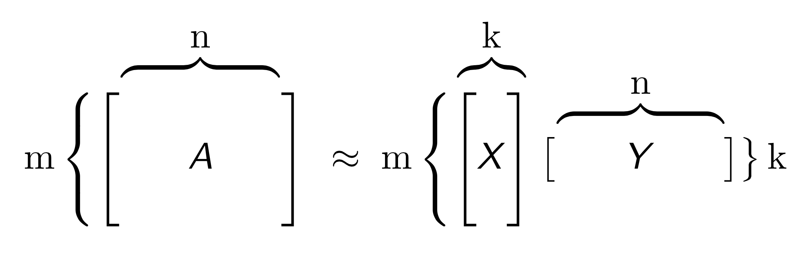

.. _glrm:

Generalized Low Rank Models (GLRM)
----------------------------------

Introduction
~~~~~~~~~~~~

Generalized Low Rank Models (GLRM) is an algorithm for dimensionality reduction of a dataset. It is a general, parallelized optimization algorithm that applies to a variety of loss and regularization functions. Categorical columns are handled by expansion into 0/1 indicator columns for each level. With this approach, GLRM is useful for reconstructing missing values and identifying important features in heterogeneous data.

MOJO Support
''''''''''''

GLRM currently only supports exporting `MOJOs <../save-and-load-model.html#supported-mojos>`__.

What is a Low-Rank Model?
~~~~~~~~~~~~~~~~~~~~~~~~~

Given large collections of data with numeric and categorical values, entries in the table may be noisy or even missing altogether. Low rank models facilitate the understanding of tabular data by producing a condensed vector representation for every row and column in the dataset. Specifically, given a data table A with m rows and n columns, a GLRM consists of a decomposition of A into numeric matrices X and Y. The matrix X has the same number of rows as A, but only a small, user-specified number of columns k. The matrix Y has k rows and d columns, where d is equal to the total dimension of the embedded features in A. For example, if A has 4 numeric columns and 1 categorical column with 3 distinct levels (e.g., red, blue and green), then Y will have 7 columns. When A contains only numeric features, the number of columns in A and Y are identical.

Both X and Y have practical interpretations. Each row of Y is an archetypal feature formed from the columns of A, and each row of X corresponds to a row of A projected into this reduced dimension feature space. We can approximately reconstruct A from the matrix product XY, which has rank k. The number k is chosen to be much less than both m and n: a typical value for 1 million rows and 2,000 columns of numeric data is k = 15. The smaller k is, the more compression gained from the low-rank representation.

Defining a GLRM Model
~~~~~~~~~~~~~~~~~~~~~

Parameters are optional unless specified as *required*.

Algorithm-specific parameters
'''''''''''''''''''''''''''''

-  **expand_user_y**: Specify whether to expand categorical columns in the user-specified initial Y value. This option defaults to ``True`` (enabled).

-  **gamma_x**: Specify the regularization weight on the X matrix. This option defaults to ``0``.

-  **gamma_y**: Specify the regularization weight on the Y matrix. This option defaults to ``0``.

-  `k <algo-params/k.html>`__: *Required* Specify the rank of matrix approximation. This option defaults to ``1``.

-  `init <algo-params/init1.html>`__: Specify the initialization mode. One of: 

    - ``"random"``
    - ``"furthest"``
    - ``"plus_plus"`` (default) 
    - ``"user"``

-  **impute_original**: Specify whether to reconstruct the original training data by reversing the data transform after projecting archetypes. This option defaults to ``False`` (disabled).

-  **init_step_size**: Specify the initial step size. This option defaults to ``1``.

-  **loss**: Specify the numeric loss function. One of: 
   
    - ``"quadratic"`` (default) 
    - ``"absolute"``
    - ``"huber"``
    - ``"poisson"``
    - ``"hinge"``
    - ``"periodic"``

-  **loss_by_col**: Specify the loss function by column override. One of: 

    - ``"quadratic"``
    - ``"absolute"``
    - ``"huber"``
    - ``"poisson"``
    - ``"hinge"``
    - ``"periodic"``
    - ``"categorical"``
    - ``"ordinal"``

-  **loss_by_col_idx**: Specify the loss function by column index override.

-  **max_updates**: Specify the maximum number of updates. This option defaults to ``2000``.

-  **min_step_size**: Specify the minimum step size. This option defaults to ``0.0001``.

-  **multi_loss**: Specify either ``"categorical"`` (default) or ``"ordinal"`` for the categorical loss function.

-  **period**: When ``loss="periodic"``, specify the length of the period. This option defaults to ``1``.

-  **recover_svd**: Specify whether to recover singular values and eigenvectors of XY. This option defaults to ``False`` (disabled).

-  **regularization_x**: Specify the regularization function for the X matrix. One of: 

    - ``"none"`` (default)
    - ``"quadratic"``
    - ``"l2"``
    - ``"l1"``
    - ``"non_negative"``
    - ``"one_sparse"``
    - ``"unit_one_sparse"``
    - ``"simplex"``

-  **regularization_y**: Specify the regularization function for the Y matrix. One of: 

    - ``"none"`` (default)
    - ``"quadratic"``
    - ``"l2"``
    - ``"l1"``
    - ``"non_negative"``
    - ``"one_sparse"``
    - ``"unit_one_sparse"``
    - ``"simplex"``

-  **representation_name**: Specify the frame key to save the resulting X.

-  **svd_method**: Specify the method for computing SVD during initialization. One of: ``"gram_s_v_d"``, ``"power"``, ``"randomized"`` (default).

       **Caution**: ``"randomized"`` is currently experimental.

-  **user_x**: Specify the initial X value.

-  **user_y**: Specify the initial Y value.

Common parameters
'''''''''''''''''

-  `export_checkpoints_dir <algo-params/export_checkpoints_dir.html>`__: Specify a directory to which generated models will be automatically exported.

-  `ignore_const_cols <algo-params/ignore_const_cols.html>`__: Specify whether to ignore constant training columns, since no information can be gained from them. This option defaults to ``True`` (enabled).

-  `ignored_columns <algo-params/ignored_columns.html>`__: (Python and Flow only) Specify the column or columns to be exclude from the model. In Flow, click the checkbox next to a column name to add it to the list of columns excluded from the model. To add all columns, click the **All** button. To remove a column from the list of ignored columns, click the X next to the column name. To remove all columns from the list of ignored columns, click the **None** button. To search for a specific column, type the column name in the **Search** field above the column list. To only show columns with a specific percentage of missing values, specify the percentage in the **Only show columns with more than 0% missing values** field. To change the selections for the hidden columns, use the **Select Visible** or **Deselect Visible** buttons.

-  `max_iterations <algo-params/max_iterations.html>`__: Specify the maximum number of training iterations. The range is 0 to 1e6, and the option defaults to ``1000``.

-  `max_runtime_secs <algo-params/max_runtime_secs.html>`__: Specify the maximum allowed runtime in seconds for model training. This option defaults to ``0`` (disabled).

-  `model_id <algo-params/model_id.html>`__: Specify a custom name for the model to use as a reference. By default, H2O automatically generates a destination key.

-  `score_each_iteration <algo-params/score_each_iteration.html>`__: Specify whether to score during each iteration of the model training. This option defaults to ``False`` (disabled).

-  `seed <algo-params/seed.html>`__: Specify the random number generator (RNG) seed for algorithm components dependent on randomization. The seed is consistent for each H2O instance so that you can create models with the same starting conditions in alternative configurations. This value defaults to ``-1`` (time-based random number).

-  `training_frame <algo-params/training_frame.html>`__: *Required* Specify the dataset used to build the model. 
    
    **Note**: In Flow, if you click the **Build a model** button from the ``Parse`` cell, the training frame is entered automatically.

-  `transform <algo-params/transform.html>`__: Specify the transformation method for numeric columns in the training data. One of: 

    - ``"none"`` (default)
    - ``"standardize"``
    - ``"normalize"``
    - ``"demean"``
    - ``"descale"``. 

-  `x <algo-params/x.html>`__: Specify a vector containing the names or indices of the predictor variables to use when building the model. If ``x`` is missing, then all columns are used.

Transforming Data
~~~~~~~~~~~~~~~~~

With an initial GLRM model, when you give a dataset (**A**) to GLRM, it builds as:

.. math::
   
   A = X \times Y

where:

- :math:`Y` is the archetype 
- :math:`X` contains the coefficients to the archetype

When a new dataset (**B**) is passed to the GLRM model, it performs as:

.. math::
   
   B \sim Xnew \times Y

where:

- :math:`Y` is the original archetype generated from the training dataset
- :math:`Xnew` contains the new coefficients to the archetype

When you call ``score`` in Java or ``predict`` in Python or R with a new dataset, :math:`Xnew \times Y` is returned. However, if you call ``transform`` in Java or ``transform_frame`` in Python or R, only :math:`Xnew` is returned. See the following example for how to use ``transform_frame``.

Examples
~~~~~~~~

This example demonstrates how to build a Generalized Low Rank Model (GLRM) using H2O-3 for dimensionality reduction on the USArrests dataset. The model is trained with a quadratic loss function, and the dataset is standardized before training. After training, the model can be used to generate predictions and retrieve transformed coefficients using a validation set.

.. tabs::
   .. code-tab:: r R

    library(h2o)
    h2o.init()

    # Import the USArrests dataset into H2O:
    arrests <- h2o.importFile("https://s3.amazonaws.com/h2o-public-test-data/smalldata/pca_test/USArrests.csv")

    # Split the dataset into a train and valid set:
    arrests_splits <- h2o.splitFrame(data = arrests, ratios = 0.8, seed = 1234)
    train <- arrests_splits[[1]]
    valid <- arrests_splits[[2]]

    # Build and train the model:
    glrm_model = h2o.glrm(training_frame = train, 
                          k = 4, 
                          loss = "Quadratic", 
                          gamma_x = 0.5, 
                          gamma_y = 0.5,  
                          max_iterations = 700, 
                          recover_svd = TRUE, 
                          init = "SVD", 
                          transform = "STANDARDIZE")

    # Eval performance:
    arrests_perf <- h2o.performance(glrm_model)

    # Generate predictions on a validation set (if necessary):
    arrests_pred <- h2o.predict(glrm_model, newdata = valid)

    # Transform the data using the dataset "valid" to retrieve the new coefficients:
    glrm_transform <- h2o.transform_frame(glrm_model, valid)

   .. code-tab:: python

    import h2o
    from h2o.estimators import H2OGeneralizedLowRankEstimator
    h2o.init()

    # Import the USArrests dataset into H2O:
    arrestsH2O = h2o.import_file("https://s3.amazonaws.com/h2o-public-test-data/smalldata/pca_test/USArrests.csv")

    # Split the dataset into a train and valid set:
    train, valid = arrestsH2O.split_frame(ratios=[.8], seed=1234)

    # Build and train the model:
    glrm_model = H2OGeneralizedLowRankEstimator(k=4, 
                                                loss="quadratic", 
                                                gamma_x=0.5, 
                                                gamma_y=0.5, 
                                                max_iterations=700, 
                                                recover_svd=True, 
                                                init="SVD", 
                                                transform="standardize")
    glrm_model.train(training_frame=train) 

    # Transform the data using the dataset "valid" to retrieve the new coefficients:
    glrm_transform = glrm_model.transform_frame(valid)

FAQ
~~~

-  **What types of data can be used with GLRM?**

   GLRM can handle mixed numeric, categorical, ordinal and Boolean data with an arbitrary number of missing values. It allows the user to apply regularization to X and Y, imposing restrictions like non-negativity appropriate to a particular data science context.

-  **What are the benefits to using low rank models?**

   -  **Memory**: Saving only the X and Y matrices can significantly reduce the amount of memory required to store a large data set. A file that is 10 GB can be compressed down to 100 MB. When we need the original data again, we can reconstruct it on the fly from X and Y with minimal loss in accuracy.
   -  **Speed**: GLRM can be used to compress data with high-dimensional, heterogeneous features into a few numeric columns. This leads to a huge speed-up in model building and prediction, especially by machine learning algorithms that scale poorly with the size of the feature space.
   -  **Feature Engineering**: The Y matrix represents the most important combination of features from the training data. These condensed features (called archetypes) can be analyzed, visualized, and incorporated into various data science applications.
   -  **Missing Data Imputation**: Reconstructing a data set from X and Y will automatically impute missing values. This imputation is accomplished by intelligently leveraging the information contained in the known values of each feature, as well as user-provided parameters such as the loss function.

References
~~~~~~~~~~

`Udell, Madeline, Corinne Horn, Reza Zadeh, and Stephen Boyd. "Generalized low rank models." arXiv preprint arXiv:1410.0342, 2014. <http://arxiv.org/abs/1410.0342>`_

`Hamner, S.R., Delp, S.L. Muscle contributions to fore-aft and vertical body mass center accelerations over a range of running speeds. Journal of Biomechanics, vol 46, pp 780-787. (2013) <http://nmbl.stanford.edu/publications/pdf/Hamner2012.pdf>`_
