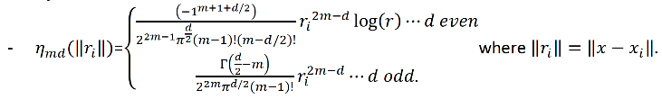
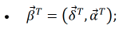
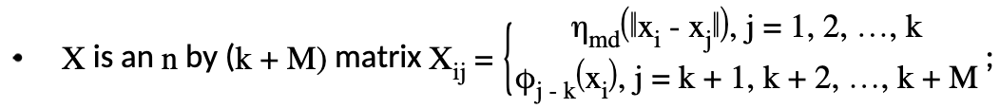
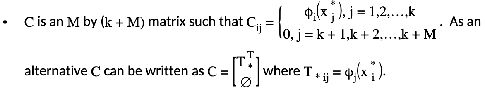
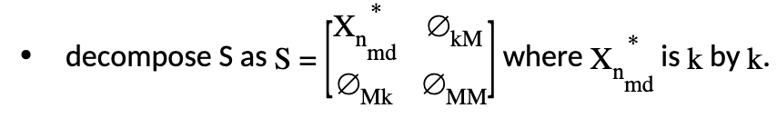

GAM Thin Plate Regression Spline
--------------------------------

Introduction
~~~~~~~~~~~~

While we have already implemented GAM using smoothers with only one predictor, thin plate regression splines are used to implement smoothers with one or more predictors. We follow the implementation in [:ref:`1<ref1>`] closely here. For more theoretical treatments on the subject, please refer to [:ref:`1<ref1>`] and [:ref:`2<ref2>`]. 

The following information is on regression. However, the translation to other families is straight-forward. For regression, we aim to approximate the response :math:`Y_i` with :math:`f(x_i)`. For the binomial family, we aim to approximate the log-odds :math:`p(x_i)` with :math:`f(x_i)`.

A Simple Linear GAM Model Built Using Smoothers from Multiple Predictors
~~~~~~~~~~~~~~~~~~~~~~~~~~~~~~~~~~~~~~~~~~~~~~~~~~~~~~~~~~~~~~~~~~~~~~~~

Thin plate splines are used to estimate smooth functions of multiple predictor variables from noisy observations of the function at particular values of those predictors. Consider:

	.. math::

	 Y_i = g(x_i) + \epsilon_i

where:

- :math:`x_i\epsilon R^d`,
- :math:`d` is the number of predictors in the smooth function :math:`g`.

Thin plate spline smoothing estimates :math:`g` by finding function :math:`f` by minimizing:

	.. math::

	 {\parallel{y-f}\parallel}^2 + \lambda J_{md}(f) {\text{ }}{\text{ Equation 1}}

where:

- :math:`y = [y_1,y_2,...,y_n]^T`,
- :math:`f = [f(x_1),f(x_2),...,f(x_n)]^T`,
- :math:`J_{md}(f)` is a penalty measure of wiggliness of :math:`f`,
- :math:`\lambda` is the smoothing parameter (scale parameter) controlling the tradeoff between data fitting and smoothness of :math:`f`,
- :math:`J_{md}(f) = {\int_{R^d}{\sum_{\gamma_1+\gamma_2+...+\gamma_d={\frac{m!}{\gamma_1! \gamma_2!...\gamma_d!}}{({\frac{d^mf}{dx_1dx_2...dx_d}})}^2}}}dx_1 dx_2...dx_d`, 
- :math:`m = floor(\frac{d+1}{2})+1`.

The function :math:`f` that minimizes Equation 1 has the following form:

	.. math::

	 {\hat{f}}(x) = {\sum_{i=1}^n}\delta_i \eta_{md}({\parallel{x-x_i}\parallel}) + {\sum_{j=1}^M}\alpha_j \phi_j (x) {\text{ }}{\text{ Equation 2}}

which is subject to the constraint :math:`T^T\delta = 0` where each element of :math:`T` is :math:`T_{ij} = \phi_j (x_i)` and where:

- :math:`M = {\frac{(m+d-1)!}{d!(m-1)!}}`;
- :math:`\phi_j` are the polynomial basis functions with order = 0,1,...,m-1;

- :math:`\Gamma ({\frac{1}{2}}-n) = {\frac{(-4)^nn!}{(2n)!}}{\sqrt \pi}`.

However, Equation 2 cannot be implemented due to the fact that all the rows of the dataset are used in generating the function :math:`{\hat{f}}(x)`.

Knot-based Approximation of :math:`{\hat{f}}(x)`
~~~~~~~~~~~~~~~~~~~~~~~~~~~~~~~~~~~~~~~~~~~~~~~~

Instead of using all the data points in the training set, only a subset of knots are used in the approximation of :math:`{\hat{f}}(x)` as follows:

	.. math::

	 {\hat{f}}(x) = {\sum_{i=1}^k}\delta_i \eta_{md}({\parallel{x-x_i}\parallel})+{\sum_{j=1}^M}\alpha_j \phi_j (x) {\text{ }}{\text{ Equation 3}}

where :math:`k` is the number of knots. The coefficients :math:`\delta = (\delta_1,\delta_2,...,\delta_k)^T`, :math:`\alpha = (\alpha_1, \alpha_2,..., \alpha_M)^T` can be obtained by minimizing the following objective function:

	.. math::

	 {\parallel{Y-X\beta}\parallel}^2 + \lambda \beta^T S\beta {\text{ Subject to }} C\beta = 0

where:

- :math:`S` is a :math:`(k+M)` by :math:`(k+M)` matrix with zeros everywhere except in its upper left :math:`k` by :math:`k` blocks where :math:`S_{ij} = \eta_{md} ({\parallel{x_i^*-x_j^*}\parallel})` and :math:`x_i^*,x_j^*` are knots.

Generation of :math:`X_{n_{md}}`
''''''''''''''''''''''''''''''''

The data matrix :math:`X` consists of two parts: :math:`X = [X_{n_{md}}:T]`. First, we will generate :math:`X_{n_{md}}`, which consists of the distance measure part. :math:`X_{n_{md}}` is :math:`n` by :math:`k` in dimension, and the :math:`ij^{th}` element is calculated as:

	.. figure:: ../images/ijth_element.png
		:scale: 50%

**Generation of Penalty Matrix** :math:`S`

Note that the penalty matrix :math:`S=X_{n_{md}}^*`. It is the distance measure calculated using only the knot points.

Generation of the Polynomial Basis
''''''''''''''''''''''''''''''''''

Let :math:`d` be the number of predictors included in the thin plate regression smoother, and let :math:`m-1` be the highest degree of the polynomial basis function used. We can calculate :math:`m` from :math:`d` by using the formula :math:`m=floor(\frac{d+1}{2})+1`. The total number of polynomial basis function :math:`M` is determined by the formula :math:`M={{d+m-1} \choose {d}} = {\frac{(d+m-1)}{d!(m-1)!}}`. We will illustrate how this is done with two examples:

**Polynomial Basis for** :math:`d=2`

In this case, :math:`m=floor({\frac{2+1}{2}})+1=2` and :math:`M={{2+2-1} \choose {2}} = 3`. The size of the polynomial basis is 3, and the polynomial basis consists of polynomials of degrees 0 and 1. When the two predictors are set as :math:`x_1,x_2`, the polynomial basis will consist of :math:`1,x_1,x_2`. :math:`T` consists of one column of ones, predictor :math:`x_1`, and predictor :math:`x_2`. The size of :math:`T` is :math:`n` by :math:`3`.

**Polynomial Basis for** :math:`d=4`

In this case, :math:`m=floor({\frac{4+1}{2}})+1=3` and :math:`M={{4+3-1} \choose {4}}=15`. The size of the polynomial basis is 15, and the polynomial basis consists of polynomials of degrees 0, 1, and 2. The four predictors are :math:`x_1,x_2,x_3,x_4`. :math:`T` consists of:

- one zero degree polynomial: one column of ones;
- four degree one polynomials: :math:`x_1,x_2,x_3,x_4`;
- ten degree 2 polynomials: :math:`x_1^2, x_2^2, x_3^2, x_4^2, x_1x_2, {x_1}{x_3}, {x_1}{x_4}, {x_2}{x_3}, {x_2}{x_4}, {x_3}{x_4}`.

The size of :math:`T` is :math:`n` by :math:`15`. The size of the polynomial basis grows rapidly as the number of predictors increase in the thin plate regression smoother.

**Generation of** :math:`T`

Remember that :math:`T` is defined as :math:`T_{ij} = \phi_j (x_i)`. Therefore, :math:`T` is of size :math:`n` by :math:`M`. However, :math:`T_*` is only evaluated at the knots chosen by the user. Hence, by using the example of :math:`d=2` and letting the two predictors be :math:`x_1,x_2`, :math:`T` contains:

	.. figure:: ../images/gam_t_matrix.png
		:scale: 70%

Absolving the Constraint via Matrix Transformation
''''''''''''''''''''''''''''''''''''''''''''''''''

The constraint :math:`C\beta =0` is equivalent to :math:`T_*^T\delta =0` and is :math:`M` by :math:`k`. The following transformations are applied:

- Generate the QR decomposition of :math:`C^T` (which is equivalent to the QR decomposition of :math:`T_*`). Therefore, rewrite :math:`T_* =UP` where :math:`U` is :math:`k` by :math:`M`, and :math:`P` is :math:`M` by :math:`M`;
- Next, generate an orthogonal basis :math:`Z_{cs}` which is :math:`k` by :math:`(k-M)`, and :math:`Z_{cs}` is orthogonal to :math:`U`. This will force the condition that :math:`k>M+1` in setting the number of knots.
- :math:`Z_{cs}` is easily generated by first generating the :math:`(k-M)` random vector. Next, use Gram-Schmidt to make the random vectors orthogonal to :math:`U` and to each other.
- Set :math:`\delta =Z_{cs}\delta_{cs}` and rewrite :math:`\beta^T =((Z_{cs}\delta_{cs})^T,\alpha^T)`.

Let's also:

- decompose :math:`X` into two parts as :math:`X=[X_{n_{md}}:T]` where :math:`X_{n_{md}}` is :math:`n` by :math:`k` and :math:`T` is :math:`n` by :math:`M`;

Let's rewrite the new objective with this decomposition:

	.. figure:: ../images/gam_decomp_obj.png

Note that :math:`Z_{cs}^TX_{n_{md}}^*Z_{cs}` is :math:`(k-M)` by :math:`(k-M)`.

Sum-to-zero Constraints Implementation
''''''''''''''''''''''''''''''''''''''

This will follow the `Identifiability Constraints <gam.html#identifiability-constraints>`__ rules for GAM. Let :math:`X` be the model matrix that contains the basis functions of one predictor variable; the sum-to-zero constraints require that :math:`1^Tf_p=0=1^TX\beta` where :math:`\beta` contains the coefficients relating to the basis functions of that particular predictor column. The idea is to create a :math:`k` by :math:`(k-1)` matrix :math:`Z` such that :math:`\beta =Z\beta_z`, then :math:`1^TX\beta =0` for any :math:`\beta_z`. :math:`Z` is generated by using the Householder transform. Please refer to [:ref:`3<ref3>`] for details. Therefore, we have :math:`\beta_{CS}=Z\beta_Z`. Rewrite the objective function again and we will have 

	.. math::

	 {\parallel{Y-X_{CS}\beta_{CS}}\parallel}^2+\lambda(\beta_{CS})^TS\beta_{CS} = 
	 {\parallel{Y-X_{CS}Z\beta_z}\parallel}^2+

	.. math::

	 \lambda(\beta_Z)^TZ^TS_{CS}Z\beta_Z = {\parallel{Y-X_Z\beta_z}\parallel}^2+\lambda (\beta_Z)^TS_Z\beta_Z

and we will be solving for :math:`\beta_Z`. Then, we will obtain :math:`\beta_{CS}=Z\beta_z`. Last, we will obtain the original :math:`\beta` by multiplying the part of the coefficeints not corresponding to the polynomial basis with :math:`Z_{CS}` like :math:`\beta^T =((Z_{CS}\delta_{CS})^T,\alpha^T)`.

Specifying GAM Columns
~~~~~~~~~~~~~~~~~~~~~~

There are two ways to specify GAM columns for thin plate regression. When using a grid search, the GAM columns are specified inside of the ``subspaces`` hyperparameter. Otherwise, the ``gam_column`` parameter is entered on its own when building a GAM model.

Normal GAM
''''''''''

.. tabs::
	.. code-tab:: r R

		#Import the train and test datasets:
		train <- h2o.importFile("https://s3.amazonaws.com/h2o-public-test-data/smalldata/glm_test/gaussian_20cols_10000Rows.csv")
		test <- h2o.importFile("https://s3.amazonaws.com/h2o-public-test-data/smalldata/glm_test/gaussian_20cols_10000Rows.csv")

		# Set the factors:
		train$C1 <- h2o.asfactor(train$C1)
		train$C2 <- h2o.asfactor(train$C2)
		test$C1 <- h2o.asfactor(test$C1)
		test$C2 <- h2o.asfactor(test$C2)

		# Set the predictors, response, & GAM columns:
		predictors <- c("C1", "C2")
		response = "C21"
		gam_col1 <- c("C11", c("C12", "C13"), c("C14", "C15", "C16"), "C17", "C18")

		# Build and train the model:
		gam_model <- h2o.gam(x = predictors, y = response, 
				     gam_columns = gam_col1, training_frame = train, 
				     validation_frame = test, family = "gaussian", 
				     lambda_search = TRUE)

		# Retrieve the coefficients:
		coefficients <- h2o.coef(gam_model)

	.. code-tab:: python

		from h2o.estimators import H2OGeneralizedAdditiveEstimator

		# Import the train and test datasets:
		train = h2o.import_file("https://s3.amazonaws.com/h2o-public-test-data/smalldata/glm_test/gaussian_20cols_10000Rows.csv")
		test = h2o.import_file("https://s3.amazonaws.com/h2o-public-test-data/smalldata/glm_test/gaussian_20cols_10000Rows.csv")

		# Set the factors:
		train["C1"] = train["C1"].asfactor()
		train["C2"] = train["C2"].asfactor()
		test["C1"] = test["C1"].asfactor()
		test["C2"] = test["C2"].asfactor()

		# Set the predictors, response, & GAM columns:
		predictors = ["C1", "C2"]
		response = "C21"
		gam_col1 = ["C11", "C12","C13", "C14","C15","C16", "C17", "C18"]

		# Build and train the model:
		gam_model = H2OGeneralizedAdditiveEstimator(family = 'gaussian', gam_columns = gam_col1, lambda_search = True)
		gam_model.train(x=predictors, y=response, training_frame=train, validation_frame=test)

		# Retrieve the coefficients:
		coefficients = gam_model.coef()

Grid Search
'''''''''''

.. tabs::
	.. code-tab:: r R

		# Import the train dataset:
		h2o_data <- h2o.importFile("https://s3.amazonaws.com/h2o-public-test-data/smalldata/gam_test/synthetic_20Cols_gaussian_20KRows.csv")

		# Set the factors:
		h2o_data$response <- h2o.asfactor(h2o_data$response)
		h2o_data$C3 <- h2o.asfactor(h2o_data$C3)
		h2o_data$C7 <- h2o.asfactor(h2o_data$C7)
		h2o_data$C8 <- h2o.asfactor(h2o_data$C8)
		h2o_data$C10 <- h2o.asfactor(h2o_data$C10)

		# Set the predictors and response:
		xL <- c("c_0", "c_1", "c_2", "c_3", "c_4", "c_5", "c_6", "c_7", "c_8", 
			"c_9", "C1", "C2", "C3", "C4", "C5", "C6", "C7", "C8", "C9", "C10")
		yR = "response"

		# Set up the search criteria and hyperparameters:
		search_criteria <- list()
		search_criteria$strategy <- 'RandomDiscrete'
		search_criteria$seed <- 1
		hyper_parameters <- list()
		hyper_parameters$lambda = c(1, 2)
		subspace <- list()
		subspace$scale <- list(c(0.001, 0.001, 0.001), c(0.002, 0.002, 0.002))
		subspace$num_knots <- list(c(5, 10, 12), c(6, 11, 13))
		subspace$bs <- list(c(1, 1, 1), c(0, 1, 1))
		subspace$gam_columns <- list(list("c_0", c("c_1", "c_2"), c("c_3", "c_4", "c_5")), list("c_1", c("c_2", "c_3"), c("c_4", "c_5", "c_6")))
		hyper_parameters$subspaces <- list(subspace)

		# Build and train the grid:
		gam_grid = h2o.grid("gam", grid_id="GAMModel1", x=xL, y=yR, 
				    training_frame=trainGaussian, family='binomial', 
				    hyper_params=hyper_parameters, search_criteria=search_criteria)

		# Retrieve the coefficients:
		coefficients <- h2o.coef(gam_grid)

	.. code-tab:: python

		from h2o.estimators import H2OGeneralizedAdditiveEstimator
		from h2o.grid.grid_search import H2OGridSearch

		# Import the train dataset:
		h2o_data <- h2o.import_file("https://s3.amazonaws.com/h2o-public-test-data/smalldata/gam_test/synthetic_20Cols_gaussian_20KRows.csv")

		# Set the factors:
		h2o_data['response'] = h2o_data['response'].asfactor()
		h2o_data['C3'] = h2o_data['C3'].asfactor()
		h2o_data['C7'] = h2o_data['C7'].asfactor()
		h2o_data['C8'] = h2o_data['C8'].asfactor()
		h2o_data['C10'] = h2o_data['C10'].asfactor()

		# Set the predictors and response:
		names = h2o_data.names
		myY = "response"
		myX = names.remove(myY)

		# Set the search criteria and hyperparameters:
		search_criteria = {'strategy': 'RandomDiscrete', "seed": 1}
		hyper_parameters = {'lambda': [1, 2],
				    'subspaces': [{'scale': [[0.001], [0.0002]], 'num_knots': [[5], [10]], 'bs':[[1], [0]], 'gam_columns': [[["c_0"]], [["c_1"]]]}, 
				    		  {'scale': [[0.001, 0.001, 0.001], [0.0002, 0.0002, 0.0002]], 
				    		   'bs':[[1, 1, 1], [0, 1, 1]], 
				    		   'num_knots': [[5, 10, 12], [6, 11, 13]], 
				    		   'gam_columns': [[["c_0"], ["c_1", "c_2"], ["c_3", "c_4", "c_5"]], 
				    		   		   [["c_1"], ["c_2", "c_3"], ["c_4", "c_5", "c_6"]]]}]}

		# Build and train the grid:
		gam_grid = H2OGridSearch(H2OGeneralizedAdditiveEstimator(family="binomial", keep_gam_cols=True), 
									  hyper_params=hyper_parameters, 
									  search_criteria=search_criteria)
		gam_grid.train(x = myX, y = myY, training_frame = h2o_data)

		# Check the coefficients:
		coefficeints = gam_grid.coef()

References
~~~~~~~~~~

.. _ref1:

1. Simon N. Wood, Generalized Additive Models An Introduction with R, Texts in Statistical Science, CRC Press, Second Edition.

.. _ref2:

2. T.J. Hastie, R.J. Tibshirani, Generalized Additive Models, Chapman and Hall, First Edition, 1990.

.. _ref3:

3. Wendy C Wong, `Gam.doc. <gam.html>`__

