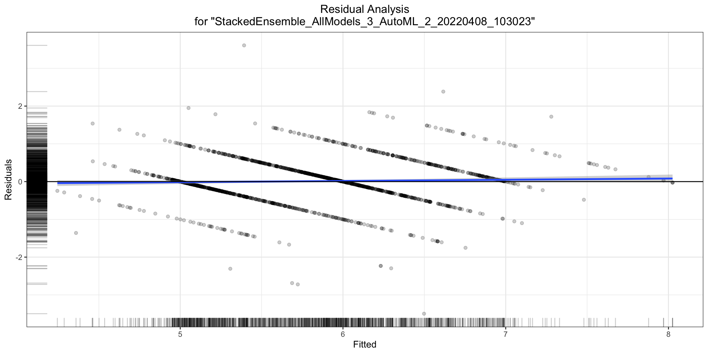
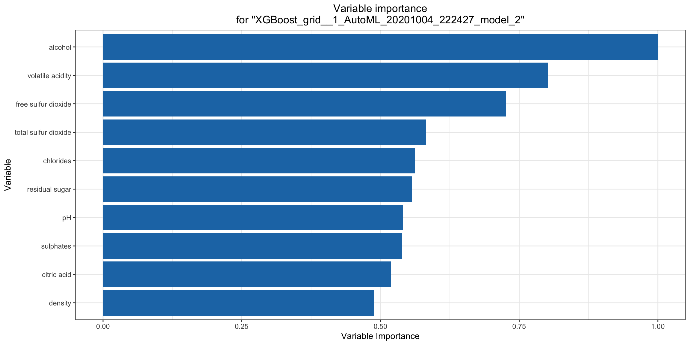
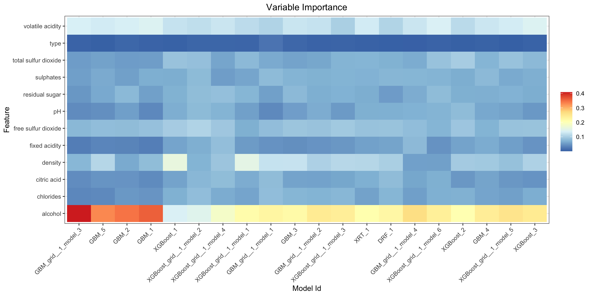
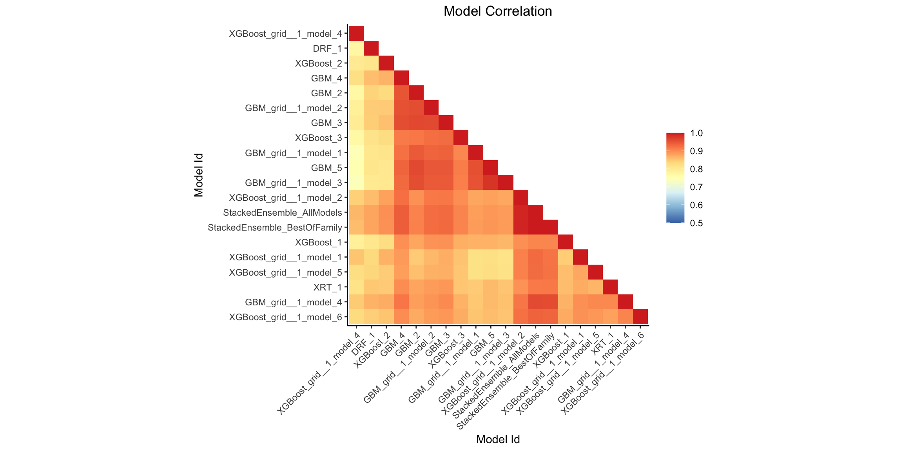
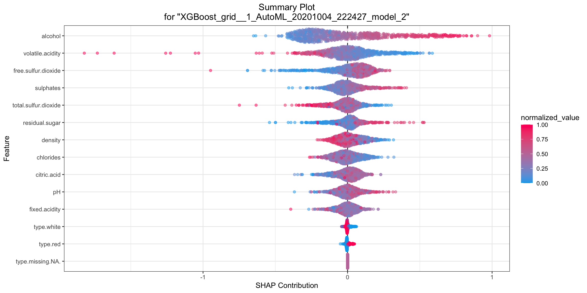
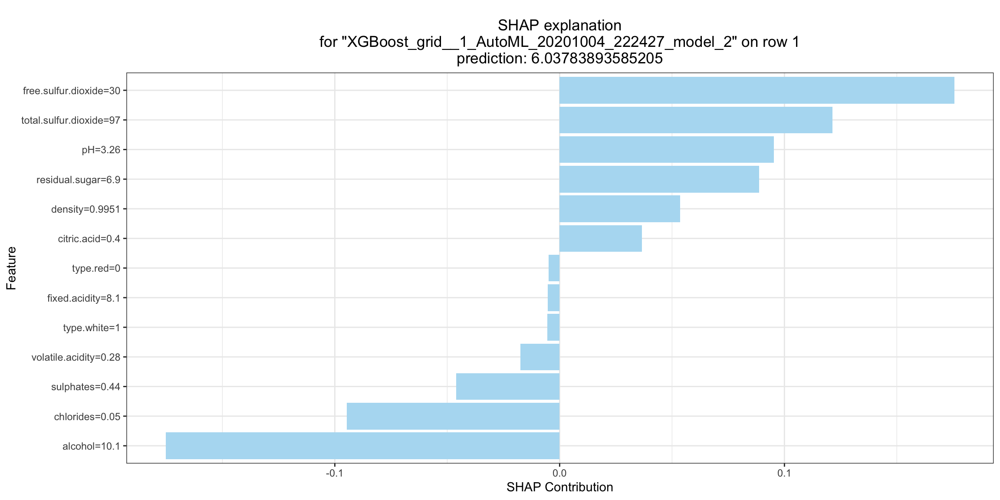
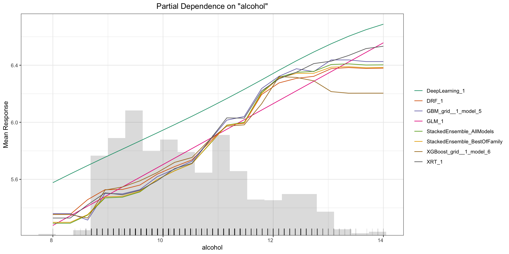
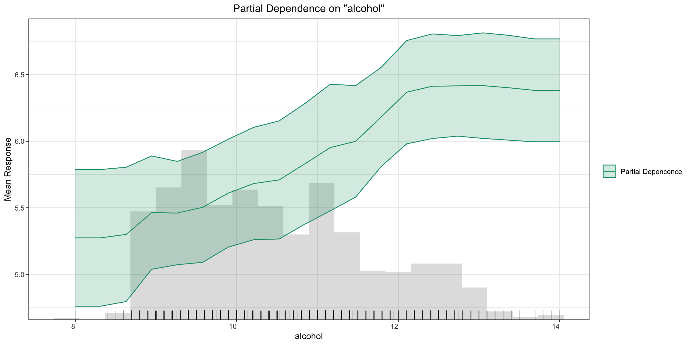
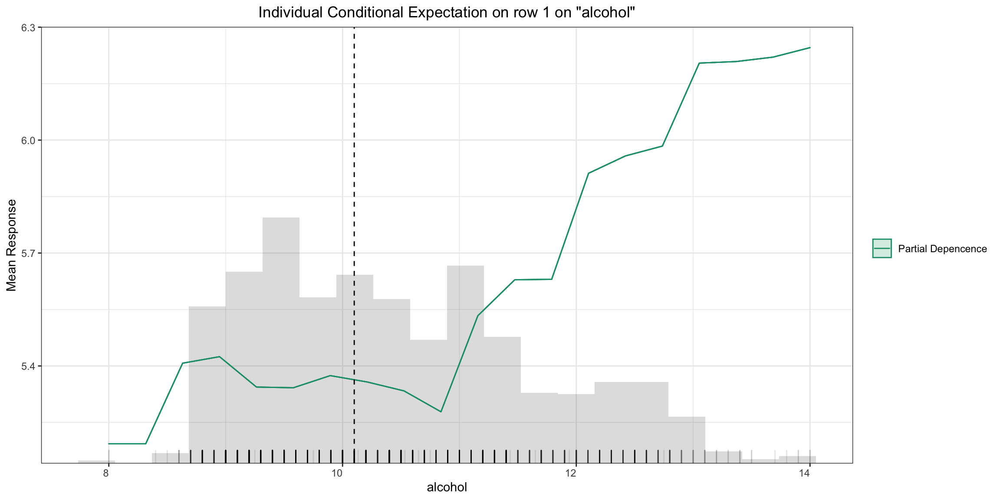
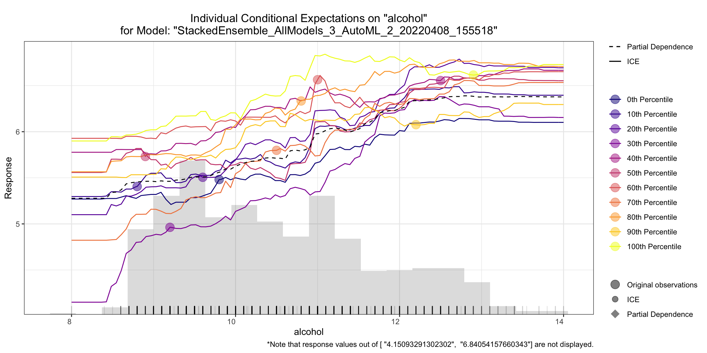

Model Explainability
====================

H2O Explainability Interface is a convenient wrapper to a number of explainabilty methods and visualizations in H2O.  The main functions, ``h2o.explain()`` (global explanation) and ``h2o.explain_row()`` (local explanation) work for individual `H2O models <http://docs.h2o.ai/h2o/latest-stable/h2o-docs/training-models.html>`__, as well a list of models or an `H2O AutoML object <automl.html>`__.  The ``h2o.explain()`` function generates a list of **explanations** -- individual units of explanation such as a Partial Dependence plot or a Variable Importance plot.  Most of the explanations are visual -- these plots can also be created by individual utility functions outside the ``h2o.explain()`` function.  The visualization engine used in the R interface is the `ggplot2 <https://ggplot2.tidyverse.org/>`__ package and in Python, we use `matplotlib <https://matplotlib.org/>`__.  Skip to the `Explanation Plotting Functions <#explanation-plotting-functions>`__ section to examples of all the visual explanations.

Model Explainability Interface
------------------------------

The interface is designed to be simple and automatic -- all of the explanations are generated with a single function, ``h2o.explain()``.  The input can be any of the following: an H2O model, a list of H2O models, an ``H2OAutoML`` object or an ``H2OAutoML`` Leaderboard slice, and a holdout frame.  If you provide a list of models or an AutoML object, there will be additional plots that do multi-model comparisons.  

.. tabs::
   .. code-tab:: r R

        # Explain a model
        exm <- h2o.explain(model, test)
        exm

        # Explain an AutoML object
        exa <- h2o.explain(aml, test)
        exa

   .. code-tab:: python

        # Explain a model
        exm = model.explain(test)

        # Explain an AutoML object
        exa = aml.explain(test)

Parameters
~~~~~~~~~~

- **object**: (R only) One of the following: an H2O model, a list of models, an H2OAutoML object, or an H2OAutoML leaderboard slice.

- **newdata** (R) / **frame** (Python): An H2OFrame used in Residual Analysis, Shapley contributions and a number of other explanation functions.

- **columns**: A vector of column names specifying the columns to use in column-based explanations (e.g. PDP, ICE, SHAP).  If specified, the ``top_n_features`` parameter will be ignored.  Optional.

- **top_n_features**: An integer specifying the number of columns to use in column-based explanations (e.g. PDP, ICE, SHAP).  The columns are ranked by variable importance (where applicable), and the top N are chosen for explainability.  Defaults to 5.

- **include_explanations**: If specified, do only the specified explanations. Mutually exclusive with ``exclude_explanations``.  Optional. See below for the possible explanations.

- **exclude_explanations**: Exclude specified explanations.  Optional.  The available options (explanations) for ``include_explanations`` and ``exclude_explanations`` are:
    
    - ``"leaderboard"``  (AutoML and list of models only)
    - ``"residual_analysis"``  (regression only)
    - ``"confusion_matrix"``   (classification only)
    - ``"varimp"``  (not currently available for Stacked Ensembles)
    - ``"varimp_heatmap"``
    - ``"model_correlation_heatmap"``
    - ``"shap_summary"`` (single models only)
    - ``"pdp"``
    - ``"ice"``

- **plot_overrides**: Overrides for the individual explanation plots, e.g. ``list(shap_summary_plot = list(top_n_features = 50))``.  Optional.

Code Examples
-------------

The R and Python code below is the quickest way to get started.  

Explain Models
~~~~~~~~~~~~~~

Here’s an example showing basic usage of the ``h2o.explain()`` function in *R* and the ``.explain()`` method in *Python*.  Keep in mind that this code should be run in an environment that can support plots.  We recommend Jupyter notebooks for Python and R notebooks or Rmd files in R.  Running the code in the RStudio IDE console is also supported, though the visualizations are optimzed for notebook viewing.  There is also support for `IRkernel <https://irkernel.github.io/installation/>`__, the kernel for Jupyter.

The example below uses a version of the `Wine Quality <https://archive.ics.uci.edu/ml/datasets/Wine+Quality>`__ dataset, which associates wine quality (a score between 0-10) with a number of measurable attributes about wine such as alcohol content, citric acid content and pH.

.. tabs::
   .. code-tab:: r R

        library(h2o)

        h2o.init()
        
        # Import wine quality dataset
        f <- "https://h2o-public-test-data.s3.amazonaws.com/smalldata/wine/winequality-redwhite-no-BOM.csv"
        df <- h2o.importFile(f)

        # Response column
        y <- "quality"

        # Split into train & test
        splits <- h2o.splitFrame(df, ratios = 0.8, seed = 1)
        train <- splits[[1]]
        test <- splits[[2]]

        # Run AutoML for 1 minute
        aml <- h2o.automl(y = y, training_frame = train, max_runtime_secs = 60, seed = 1)

        # Explain leader model & compare with all AutoML models                  
        exa <- h2o.explain(aml, test)
        exa

        # Explain a single H2O model (e.g. leader model from AutoML)
        exm <- h2o.explain(aml@leader, test)
        exm

   .. code-tab:: python

        import h2o
        from h2o.automl import H2OAutoML

        h2o.init()

        # Import wine quality dataset
        f = "https://h2o-public-test-data.s3.amazonaws.com/smalldata/wine/winequality-redwhite-no-BOM.csv"
        df = h2o.import_file("https://h2o-public-test-data.s3.amazonaws.com/smalldata/wine/winequality-redwhite-no-BOM.csv")

        # Reponse column
        y = "quality"

        # Split into train & test
        splits = df.split_frame(ratios = [0.8], seed = 1)
        train = splits[0]
        test = splits[1]

        # Run AutoML for 1 minute
        aml = H2OAutoML(max_runtime_secs=60, seed=1)
        aml.train(y=y, training_frame=train)

        # Explain leader model & compare with all AutoML models 
        exa = aml.explain(test)

        # Explain a single H2O model (e.g. leader model from AutoML)
        exm = aml.leader.explain(test)

        # Explain a generic list of models 
        # use h2o.explain as follows:
        # exl = h2o.explain(model_list, test)

Notes:
''''''

In R, the ``H2OExplanation`` object will not be printed if you save it to an object.  If you save the object to a variable, you will be able to access the plots and associated metadata by inspecting the object.  Then you can ``print(exa)`` to print the explanation, or simply type ``exa`` and it will print as well.

In Python, the ``H2OExplanation`` will always be printed, even if you save it to an object.  Once you save it to an object, however, if you want to print it again, you must do: ``from IPython.core.display import display`` and ``display(exa)``.

Explain a single row prediction
~~~~~~~~~~~~~~~~~~~~~~~~~~~~~~~

The ``h2o.explain_row()`` function provides model explanations for a single row of test data. Using the previous code example, you can evaluate row-level behavior by specifying the ``row_index``.  `Note: As usual in H2O, indexes in R are 1-based and 0-based in Python.`

.. tabs::
   .. code-tab:: r R

        # Explain first row with all AutoML models
        h2o.explain_row(aml, test, row_index = 1)

        # Explain first row with a single H2O model (e.g. leader model from AutoML)
        h2o.explain_row(aml@leader, row_index = 1)

   .. code-tab:: python

        # Explain first row with all AutoML models
        aml.explain_row(test, row_index=0)

        # Explain first row with a single H2O model (e.g. leader model from AutoML)
        aml.leader.explain_row(test, row_index=0)

        # Explain a generic list of models 
        # use h2o.explain as follows:
        # exl = h2o.explain(model_list, test, row_index=0)        

Output: Explanations
--------------------

The output from these functions is an ``H2OExplanation`` object, which is simply a dictionary (Python) / named list (R) of explanations.  Therefore, an ``H2OExplanation`` object can be indexed by the individual explanation names (using same names as specified in ``include_explanations`` and ``exlude_exlpanations``).  

Most individual explanations are plots with some associated metadata that can be extracted.  The plots are `ggplot2 <https://ggplot2.tidyverse.org/>`__ objects in R and `matplotlib <https://matplotlib.org/>`__ figures in Python.  You can customize the plot objects before they are generated by utilizing the ``plot_overrides`` argument, or afterwards by adding custom R/Python code to modify the returned objects.

Explain multiple models
~~~~~~~~~~~~~~~~~~~~~~~

When ``h2o.explain()`` is provided a list of models, the following global explanations will be generated by default:

- Leaderboard (compare all models)
- Confusion Matrix for Leader Model (classification only)
- Residual Analysis for Leader Model (regression only)
- Variable Importance of Top Base (non-Stacked) Model 
- Variable Importance Heatmap (compare all non-Stacked models)
- Model Correlation Heatmap (compare all models)
- SHAP Summary of Top Tree-based Model (TreeSHAP)
- Partial Dependence (PD) Multi Plots (compare all models)
- Individual Conditional Expectation (ICE) Plots

Explain a single model
~~~~~~~~~~~~~~~~~~~~~~

When ``h2o.explain()`` is provided a single model, we get the following global explanations:

- Confusion Matrix (classification only)
- Residual Analysis (regression only)
- Variable Importance
- Partial Dependence (PD) Plots
- Individual Conditional Expectation (ICE) Plots

Local explanations
~~~~~~~~~~~~~~~~~~

When you provide a ``row_index`` to ``h2o.explain_row()``, for a group of models, the following local explanations will be generated:

- SHAP Contribution Plot (for the top tree-based model in AutoML)
- Individual Conditional Expectation (ICE) Plots

For a single model, the local explanations that will be returned are:

- SHAP Contribution Plot (only for tree-based models)
- Individual Conditional Expectation (ICE) Plots

Model Metrics 
-------------

One of the most basic and straight-forward ways to evaluate and explain models is the model metrics.  To help keep model performance in context, we provide a **Leaderboard** with model performance summarized across a number of metrics.  The Leaderboard is a central object in H2O AutoML; more information about the Leaderboard structure and metrics is available `here <http://docs.h2o.ai/h2o/latest-stable/h2o-docs/automl.html#leaderboard>`__.  

Based on the task at hand (regression, binary classification, multi-class classification), the Leaderboard returns different model performance metrics.  More information about H2O model metrics is available `here <http://docs.h2o.ai/h2o/latest-stable/h2o-docs/performance-and-prediction.html#model-performance>`__.  For all tasks, the Leaderboard includes the following extra columns which can help provide context in terms of model selection: ``training_time_ms``, ``predict_time_per_row_ms``.  Lastly, when using the ``h2o.explain_row()`` functions with a group of models, the actual predictions (predicted values + predicted class for classification problems) for that row are appended to the end of the leaderboard, so you can easily see where the models disagree.

For classification models, we also display the **Confusion Matrix** of a single H2O model (or the leader model, when given an AutoML object), as part of the output.

Explanation Plotting Functions 
------------------------------

There are a number of individual plotting functions that are used inside the ``explain()`` function.  Some of these functions take a group of models as input and others just evaluate a single model at a time.  The following functions take a list of models (including an AutoML object or leaderboard slice) as input:

.. tabs::
   .. code-tab:: r R

        # Methods for an AutoML object 
        h2o.varimp_heatmap()          
        h2o.model_correlation_heatmap()        
        h2o.pd_multi_plot()

   .. code-tab:: python

        # These are methods for an AutoML object
        # Use h2o.method_name(model_list, test) for a list of models        
        .varimp_heatmap()          
        .model_correlation_heatmap()        
        .pd_multi_plot()

These functions take a single H2O model as input:

.. tabs::
   .. code-tab:: r R

        # Methods for an H2O model
        h2o.residual_analysis_plot()
        h2o.varimp_plot()
        h2o.shap_explain_row_plot()
        h2o.shap_summary_plot()
        h2o.pd_plot()
        h2o.ice_plot()

   .. code-tab:: python

        # Methods for an H2O model
        .residual_analysis_plot()
        .varimp_plot()
        .shap_explain_row_plot()
        .shap_summary_plot()
        .pd_plot()
        .ice_plot()

`Note to Python users: For a list of models, use the functions which are exported to the` ``h2o.*`` `namespace and can be used with a list of a models as follows: e.g.` ``h2o.residual_analysis_plot(model_list, test)``. 

To run the code in any single-model function below using the Wine data AutoML example, you will just need to set ``model <- aml@leader`` in R and ``model = aml.leader`` in Python.

Residual Analysis
~~~~~~~~~~~~~~~~~

Residual Analysis plots the fitted values vs residuals on a test dataset. Ideally, residuals should be randomly distributed. Patterns in this plot can indicate potential problems with the model selection, e.g., using simpler model than necessary, not accounting for heteroscedasticity, autocorrelation, etc. Note that if you see "striped" lines of residuals, that is an artifact of having an integer valued (vs a real valued) response variable.

.. tabs::
   .. code-tab:: r R

        ra_plot <- h2o.residual_analysis_plot(model, test)
        ra_plot

   .. code-tab:: python

        ra_plot = model.residual_analysis_plot(test)

Variable Importance
~~~~~~~~~~~~~~~~~~~

The `variable importance <http://docs.h2o.ai/h2o/latest-stable/h2o-docs/variable-importance.html>`__ plot shows the relative importance os the most important variables in the model.  Variable importance is currently available in for all H2O models except Stacked Ensembles (planned for a `future release <https://0xdata.atlassian.net/browse/PUBDEV-5137>`__), so if you happen to use ``h2o.explain()`` on an AutoML object with a Stacked Ensemble at the top of the leaderboard, it will instead show the variable importance for the top "base model" (non-stacked model).  `Note for R users`: The variable importance plot shown in the ``h2o.explain()`` output in R is rendered in ggplot2 instead of base R (the ``h2o.varimp_plot()`` utility function currently only uses base R).  We will add a switch to generate the ggplot2 version in a `future release <https://0xdata.atlassian.net/browse/PUBDEV-7823>`__.

.. tabs::
   .. code-tab:: r R

        va_plot <- h2o.varimp_plot(model, test)
        va_plot

   .. code-tab:: python

        ra_plot = model.varimp_plot(test)

Variable Importance Heatmap
~~~~~~~~~~~~~~~~~~~~~~~~~~~

Variable importance heatmap shows variable importance across multiple models. Some models in H2O return variable importance for one-hot (binary indicator) encoded versions of categorical columns (e.g. Deep Learning, XGBoost). In order for the variable importance of categorical columns to be compared across all model types we compute a summarization of the the variable importance across all one-hot encoded features and return a single variable importance for the original categorical feature. By default, the models and variables are ordered by their similarity.

.. tabs::
   .. code-tab:: r R

        va_plot <- h2o.varimp_heatmap(aml)
        va_plot

   .. code-tab:: python

        ra_plot = aml.varimp_heatmap()

Model Correlation Heatmap
~~~~~~~~~~~~~~~~~~~~~~~~~

This plot shows the correlation between the predictions of the models. For classification, frequency of identical predictions is used. By default, models are ordered by their similarity (as computed by hierarchical clustering).

.. tabs::
   .. code-tab:: r R

        mc_plot <- h2o.model_correlation_heatmap(aml, test)
        mc_plot

   .. code-tab:: python

        mc_plot = aml.model_correlation_heatmap(test)

SHAP Summary
~~~~~~~~~~~~

SHAP summary plot shows the contribution of the features for each instance (row of data). The sum of the feature contributions and the bias term is equal to the raw prediction of the model, i.e., prediction before applying inverse link function.

.. tabs::
   .. code-tab:: r R

        shap_plot <- h2o.shap_summary_plot(model, test)
        shap_plot

   .. code-tab:: python

        shap_plot = model.ice_plot(test)

SHAP Local Explanation
~~~~~~~~~~~~~~~~~~~~~~

SHAP explanation shows contribution of features for a given instance. The sum of the feature contributions and the bias term is equal to the raw prediction of the model, i.e., prediction before applying inverse link function. H2O implements TreeSHAP which when the features are correlated, can increase contribution of a feature that had no influence on the prediction.

.. tabs::
   .. code-tab:: r R

        shapr_plot <- h2o.shap_explain_row_plot(model, test, row_index = 1)
        shapr_plot

   .. code-tab:: python

        shapr_plot = model.explain_row_plot(test, row_index=0)

Partial Dependence (PD) Plots
~~~~~~~~~~~~~~~~~~~~~~~~~~~~~

Partial dependence plot (PDP) gives a graphical depiction of the marginal effect of a variable on the response. The effect of a variable is measured in change in the mean response. PDP assumes independence between the feature for which is the PDP computed and the rest.

Partial Dependence Multi-model Plot:

.. tabs::
   .. code-tab:: r R

        pd_plot <- h2o.pd_multi_plot(aml, test)
        pd_plot

   .. code-tab:: python

        pd_plot = aml.pd_multi_plot(test)

Partial Dependence Single-model Plot:

.. tabs::
   .. code-tab:: r R

        pd_plot <- h2o.pd_plot(model, test)
        pd_plot

   .. code-tab:: python

        pd_plot = model.pd_plot(test)

A single-model, single-row, PD Plot simply becomes an ICE Plot (see more below):

.. tabs::
   .. code-tab:: r R

        pd_plot <- h2o.pd_plot(model, test, row_index = 1)
        pd_plot

   .. code-tab:: python

        pd_plot = model.pd_plot(test, row_index=0)

Individual Conditional Expectiation (ICE) Plots
~~~~~~~~~~~~~~~~~~~~~~~~~~~~~~~~~~~~~~~~~~~~~~~

An Individual Conditional Expectation (ICE) plot gives a graphical depiction of the marginal effect of a variable on the response. ICE plots are similar to partial dependence plots (PDP); PDP shows the average effect of a feature while ICE plot shows the effect for a single instance. This function will plot the effect for each decile. In contrast to the PDP, ICE plots can provide more insight, especially when there is stronger feature interaction.

.. tabs::
   .. code-tab:: r R

        ice_plot <- h2o.ice_plot(model, test)
        ice_plot

   .. code-tab:: python

        ice_plot = model.ice_plot(test)

Additional Information
----------------------

The H2O Explainability interface is newly released and currently experimental.  From the initial release, we may evolve (and potentially break) the API, as we collect collect feedback from users and work to improve and expand the functionality.  We welcome feedback!  If you find bugs, or if you have any feature requests or suggested improvements, please create a ticket on the `H2O JIRA issue tracker <https://0xdata.atlassian.net/projects/PUBDEV>`__.

Our roadmap for improving the the interface is `here <https://0xdata.atlassian.net/jira/software/c/projects/PUBDEV/issues/PUBDEV-7806?filter=allissues>`__.

