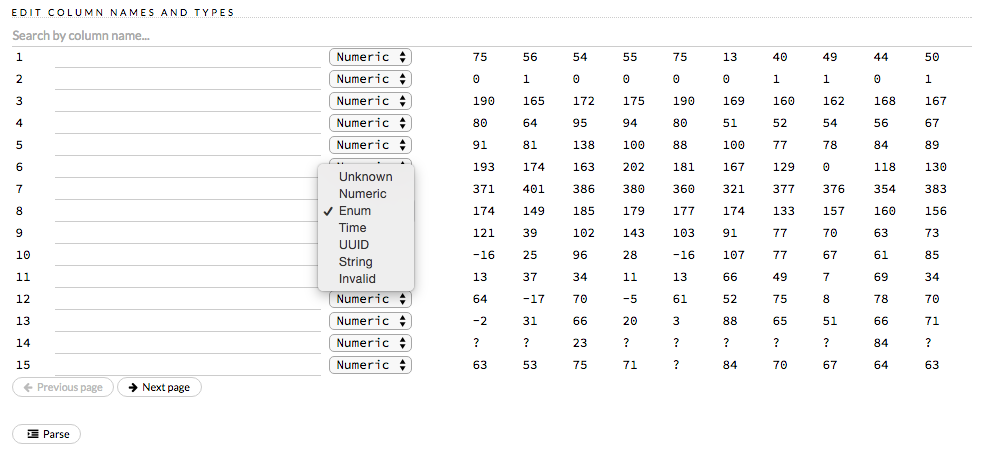
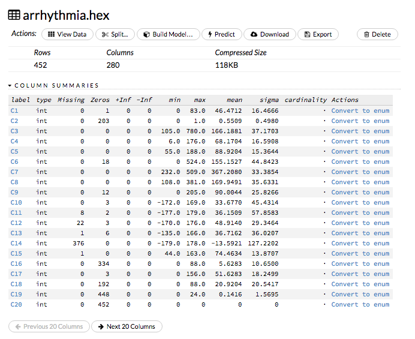

Algorithms
----------

**What's the process for implementing new algorithms in H2O?**

This `blog post <https://www.h2o.ai/blog/hacking-algorithms-in-h2o-with-cliff/>`__ by Cliff walks you through building a new algorithm, using K-Means, Quantiles, and Grep as examples.

To learn more about performance characteristics when implementing new algorithms, refer to Cliff's `KV Store Guide <https://www.h2o.ai/blog/kv-store-memory-analytics-part-2-2/>`__.

--------------

**How do I find the standard errors of the parameter estimates (p-values)?**

P-values are currently supported for non-regularized GLM. The following
requirements must be met:

-  The family cannot be multinomial
-  The lambda value must be equal to zero
-  The IRLSM solver must be used
-  Lambda search cannot be used

To generate p-values, do one of the following:

-  check the *compute\_p\_values* checkbox in the GLM model builder in Flow
-  use ``compute_p_values=TRUE`` in R or Python while creating the model

The p-values are listed in the coefficients table (as shown in the following example screenshot):

.. figure:: ../images/Flow_Pvalues.png
   :alt: Coefficients Table with P-values

--------------

**How do I specify regression or classification for Distributed Random Forest in the web UI?**

If the response column is numeric, H2O generates a regression model. If the response column is enum, the model uses classification. To specify the column type, select it from the drop-down column name list in the **Edit Column Names and Types** section during parsing.

--------------

**What's the largest number of classes that H2O supports for multinomial prediction?**

For tree-based algorithms, the maximum number of classes (or levels) for a response column is 1000.

--------------

**How do I obtain a tree diagram of my DRF model?**

Output the SVG code for the edges and nodes. A simple tree visitor is available `here <https://github.com/h2oai/h2o-3/blob/master/h2o-algos/src/main/java/hex/tree/TreeVisitor.java>`__ and the Java code generator is available `here <https://github.com/h2oai/h2o-3/blob/master/h2o-algos/src/main/java/hex/tree/TreeJCodeGen.java>`__.

--------------

**Is Word2Vec available? I can see the Java and R sources, but calling the API generates an error.**

Word2Vec, along with other natural language processing (NLP) algos, are currently in development in the current version of H2O.

--------------

**What are the "best practices" for preparing data for a K-Means model?**

There aren't specific "best practices," as it depends on your data and the column types. However, removing outliers and transforming any categorical columns to have the same weight as the numeric columns will help, especially if you're standardizing your data.

--------------

**What is your implementation of Deep Learning based on?**

Our Deep Learning algorithm is based on the feedforward neural net. For more information, refer to our Data Science documentation or `Wikipedia <https://en.wikipedia.org/wiki/Feedforward_neural_network>`__.

--------------

**How is deviance computed for a Deep Learning regression model?**

For a Deep Learning regression model, deviance is computed as follows:

Loss = MeanSquare -> MSE==Deviance For Absolute/Laplace or Huber -> MSE != Deviance.

--------------

**For my 0-tree GBM multinomial model, I got a different score depending on whether or not validation was enabled, even though my dataset was the same - why is that?**

Different results may be generated because of the way H2O computes the initial MSE.

--------------

**How does your Deep Learning Autoencoder work? Is it deep or shallow?**

H2O’s DL autoencoder is based on the standard deep (multi-layer) neural net architecture, where the entire network is learned together, instead of being stacked layer-by-layer. The only difference is that no response is required in the input and that the output layer has as many neurons as the input layer. If you don’t achieve convergence, then try using the *Tanh* activation and fewer layers. We have some example test scripts `here <https://github.com/h2oai/h2o-3/blob/master/h2o-r/tests/testdir_algos/deeplearning/>`__, and even some that show `how stacked auto-encoders can be implemented in R <https://github.com/h2oai/h2o-3/blob/master/h2o-r/tests/testdir_algos/deeplearning/runit_deeplearning_stacked_autoencoder_large.R>`__.

--------------

**Are there any H2O examples using text for classification?**

Currently, the following examples are available for Sparkling Water:

- Use TF-IDF weighting scheme for classifying text messages https://github.com/h2oai/sparkling-water/blob/master/examples/scripts/hamOrSpam.script.scala

- Use Word2Vec Skip-gram model + GBM for classifying job titles https://github.com/h2oai/sparkling-water/blob/master/examples/scripts/craigslistJobTitles.script.scala

--------------

**Most machine learning tools cannot predict with a new categorical level that was not included in the training set. How does H2O make predictions in this scenario?**

Here is an example of how the prediction process works in H2O:

1. Train a model using data that has a categorical predictor column with levels B,C, and D (no other levels); this level will be the "training set domain": {B,C,D}
2. During scoring, the test set has only rows with levels A,C, and E for that column; this is the "test set domain": {A,C,E}
3. For scoring, a combined "scoring domain" is created, which is the training domain appended with the extra test set domain entries: {B,C,D,A,E}
4. Each model can handle these extra levels {A,E} separately during scoring.

The behavior for unseen categorical levels depends on the algorithm and how it handles missing levels (NA values):

-  For DRF and GBM, missing values are interpreted as containing information (i.e., missing for a reason) rather than missing at random. During tree building, split decisions for every node are found by minimizing the loss function and treating missing values as a separate category that can go either left or right.
-  Deep Learning creates an extra input neuron for missing and unseen categorical levels, which can remain untrained if there were no missing or unseen categorical levels in the training data, resulting in a random contribution to the next layer during testing.
-  GLM skips unseen levels in the beta\*x dot product.

--------------

**How are quantiles computed?**

The quantile results in Flow are computed lazily on-demand and cached.\ It is a fast approximation (max - min / 1024) that is very accurate for most use cases. If the distribution is skewed, the quantile results may not be as accurate as the results obtained using ``h2o.quantile`` in R or ``H2OFrame.quantile`` in Python.

--------------

**How do I create a classification model? The model always defaults to regression.**

To create a classification model, the response column type must be ``enum`` - if the response is ``numeric``, a regression model is created.

To convert the response column:

-  Before parsing, click the drop-down menu to the right of the column name or number and select ``Enum``

or

-  Click on the .hex link for the data frame (or use the ``getFrameSummary "<frame_name>.hex"`` command, where ``<frame_name>`` is the name of the frame), then click the **Convert to enum** link to the right of the column name or number

