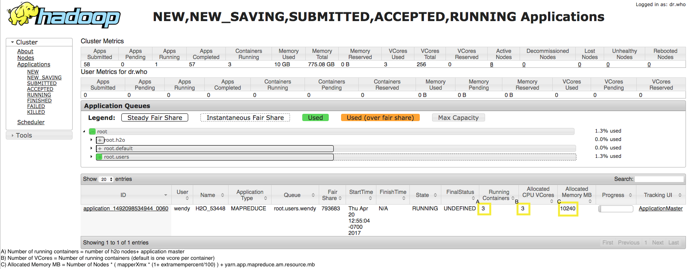

Hadoop
------

**Why did I get an error in R when I tried to save my model to my home
directory in Hadoop?**

To save the model in HDFS, prepend the save directory with ``hdfs://``:

::

    # build model
    model = h2o.glm(model params)

    # save model
    hdfs_name_node <- "mr-0x6"
    hdfs_tmp_dir <- "/tmp/runit”
    model_path <- sprintf("hdfs://%s%s", hdfs_name_node, hdfs_tmp_dir)
    h2o.saveModel(model, dir = model_path, name = “mymodel")

--------------

**What amount of resources are used and reported back to YARN?**

The following table provides a summary of the YARN resource usage. 

======  ======  ======  ===============  ===========  ========================================  ==============================
Size    Nodes   Memory  AM Resource      Total Vcore  Total Memory                              Assuming Default Value = 5gb
======  ======  ======  ===============  ===========  ========================================  ==============================
Tiny        1   4g      <Default value>  1 + 1 = 2    1.1*(1 * 4g) + <Default value> = 4.4gb+   9.4
Small       2   4g      <Default value>  2 + 1 = 3    1.1*(2 * 4g) + <Default value> = 8.8gb+   13.8
Medium      3   8g      <Default value>  3 + 1 = 4    1.1*(3 * 8g) + <Default value> = 26.4gb+  31.4
Large       5   8g      <Default value>  5 + 1 = 6    1.1*(5 * 8g) + <Default value> = 44gb+    49
======  ======  ======  ===============  ===========  ========================================  ==============================

**Notes**:

- Each time you launch an H2O cluster, you need one container or one vcore for the AM (Application Master). So a tiny cluster actually takes two vcores, not one.
- H2O will pad the JVM with 10% (default) overhead in the container. So when you request 4gb JVMs, H2O will actually request 4.4gb containers from YARN.
- The amount of memory requested for the AM container is defined by default in YARN configurations. Specifically you have to look at config param: ``yarn.app.mapreduce.am.resource.mb``. Assuming a value of 5gb for ``yarn.app.mapreduce.am.resource.mb`` and launching one medium and two tiny clusters, you would use 8 vcores and 50.2gb memory.

You can also review the YARN resource manager for more information. Refer to the image below for an example. Note that this example assumes that the user has run the following:

::

  hadoop jar h2odriver.jar -Dyarn.app.mapreduce.am.resource.mb=1024 -nodes 2 -mapperXmx 4g -extramempercent 10 -output outputdir

--------------

**How do I specify which nodes should run H2O in a Hadoop cluster?**

After creating and applying the desired node labels and associating them
with specific queues as described in the Hadoop
documentation, launch H2O using the following command:

::

	hadoop jar h2odriver.jar -Dmapreduce.job.queuename=<my-h2o-queue> -nodes <num-nodes> -mapperXmx 6g -output hdfsOutputDirName

-  ``-Dmapreduce.job.queuename=<my-h2o-queue>`` represents the queue
   name
-  ``-nodes <num-nodes>`` represents the number of nodes
-  ``-mapperXmx 6g`` launches H2O with 6g of memory
-  ``-output hdfsOutputDirName`` specifies the HDFS output directory as
   ``hdfsOutputDirName``

--------------

**How does H2O handle UDP packet failures? Does H2O quit or retry?**

 In standard settings, H2O only uses UDP for cloud forming and only if you do not provide a flat file. All other communication is done via TCP. Cloud forming with no flat file is done by repeated broadcasts that are repeated until the cloud forms.

--------------

**How do I import data from HDFS in R and in Flow?**

To import from HDFS in R:

::

    h2o.importFolder(path, pattern = "", destination_frame = "", parse = TRUE, header = NA, sep = "", col.names = NULL, na.strings = NULL)

Here is another example:

::

    # pathToAirlines <- "hdfs://mr-0xd6.0xdata.loc/datasets/airlines_all.csv"
    # airlines.hex <- h2o.importFile(path = pathToAirlines, destination_frame = "airlines.hex")

In Flow, the easiest way is to let the auto-suggestion feature in the
*Search:* field complete the path for you. Just start typing the path to
the file, starting with the top-level directory, and H2O provides a list
of matching files.

.. figure:: ../images/Flow_Import_AutoSuggest.png
   :alt: Flow - Import Auto-Suggest

Click the file to add it to the *Search:* field.

--------------

**Why do I receive the following error when I try to save my notebook in
Flow?**

::

    Error saving notebook: Error calling POST /3/NodePersistentStorage/notebook/Test%201 with opts

When you are running H2O on Hadoop, H2O tries to determine the home HDFS
directory so it can use that as the download location. If the default
home HDFS directory is not found, manually set the download location
from the command line using the ``-flow_dir`` parameter (for example,
``hadoop jar h2odriver.jar <...> -flow_dir hdfs:///user/yourname/yourflowdir``).
You can view the default download directory in the logs by clicking
**Admin > View logs...** and looking for the line that begins
``Flow dir:``.

--------------

**How do I access data in HDFS without launching H2O on YARN?**

Each h2odriver.jar file is built with a specific Hadoop distribution so
in order to have a working HDFS connection download the h2odriver.jar
file for your Hadoop distribution `from here <http://www.h2o.ai/download/h2o/hadoop>`__.

Then run the command to launch the H2O Application in the driver by
specifying the classpath:

::

        unzip h2o-<version>.zip
        cd h2o-<version>
        java -cp h2odriver.jar water.H2OApp
