.. _using-flow:

Using Flow - H2O's Web UI
=========================

About
------

H2O Flow is an open-source user interface for H2O. It is a web-based interactive environment that allows you to combine code execution, text, mathematics, plots, and rich media in a single document.

With H2O Flow, you can capture, rerun, annotate, present, and share your workflow. H2O Flow allows you to use H2O interactively to import files, build models, and iteratively improve them. Based on your models, you can make predictions and add rich text to create vignettes of your work - all within Flow's browser-based environment.

Flow's hybrid user interface seamlessly blends command-line computing with a modern graphical user interface. However, rather than displaying output as plain text, Flow provides a point-and-click user interface for every H2O operation. It allows you to access any H2O object in the form of well-organized tabular data.

H2O Flow sends commands to H2O as a sequence of executable cells. The cells can be modified, rearranged, or saved to a library. Each cell contains an input field that allows you to enter commands, define functions, call other functions, and access other cells or objects on the page. When you execute the cell, the output is a graphical object, which can be inspected to view additional details.

While H2O Flow supports REST API, R scripts, and CoffeeScript, no programming experience is required to run H2O Flow. You can click your way through any H2O operation without ever writing a single line of code. You can even disable the input cells to run H2O Flow using only the GUI. H2O Flow is designed to guide you every step of the way, by providing input prompts, interactive help, and example flows.

Download Flow
-------------

1. First `Download H2O <http://www.h2o.ai/download/>`_. This will download a zip file in your Downloads folder that contains everything you need to get started. Alternatively, you can run the following from your command line, replacing "{version}" with the appropriate version (for example, 3.20.0.2):

  ::

    curl -o h2o.zip http://download.h2o.ai/versions/h2o-{version}.zip
        

2. Next in your terminal, enter the following command lines one at a time:

  *(The first line changes into your Downloads folder, the second line unzips your zipfile, the third line changes into your h2o-3.20.0.2 folder, and the fourth line runs your jar file.)*::

    cd ~/Downloads
    unzip h2o-3.20.0.2.zip
    cd h2o-3.20.0.2
    java -jar h2o.jar

3. Finally, to start Flow point your browser to http://localhost:54321.

Launch Flow
-------------

The next time you want to launch Flow, change into the directory that contains your H2O package and run the JAR file from the command line.

**Note**: If your H2O package is not in the Downloads folder, replace the following path  ~/Downloads/h2o-{version} with the correct path to your h2o-{version} package)::

  cd ~/Downloads/h2o-{version} 
  java -jar h2o.jar

How to Use the Interface
------------------------

This guide walks through using Flow, H2O's web UI, for machine learning projects.

Accessing Help
^^^^^^^^^^^^^^

Within the Flow web page, pressing the ``h`` key will open a list of helpful shortcuts on your screen:

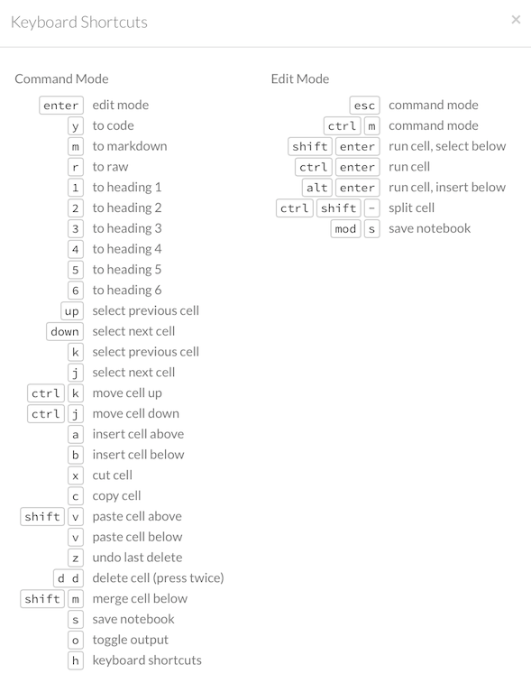

To close this window, click the **X** in the upper-right corner or click the **Close** button in the lower-right corner. You can also click behind the window to close it. You can also access this list of shortcuts by clicking the **Help** menu and selecting **Keyboard Shortcuts**.

For additional help, click **Help** > **Assist Me** or click the **Assist Me!** button in the row of buttons below the menus.

.. figure:: images/Flow_AssistMeButton.png
   :alt: Assist Me

You can also type ``assist`` in a blank cell and press **Ctrl+Enter**. A list of common tasks displays to help you find the correct command.

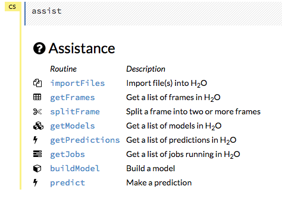

There are multiple resources to help you get started with Flow in the **Help** sidebar.

**Note**: To hide the sidebar, click the >> button above it

  .. figure:: images/Flow_SidebarHide.png

To display the sidebar if it is hidden, click the >> button

  .. figure:: images/Flow_SidebarHide.png

To access this documentation, select the **Flow Web UI...** link below the **General** heading in the Help sidebar.

Viewing Example Flows
^^^^^^^^^^^^^^^^^^^^^

You can explore the pre-configured flows available in H2O Flow for a demonstration of how to create a flow. To view the example flows:

-  Click the **view example Flows** link below the **Quickstart Videos** button in the **Help** sidebar 
   
   |Flow - View Example Flows link|

 --OR--
 
-  Click the **Browse installed packs...** link in the **Packs** subsection of the **Help** sidebar. Click the **examples** folder and select the example flow from the list.

.. figure:: images/Flow_ExampleFlows.png
   :alt: Flow Packs

If you have a flow currently open, a confirmation window appears asking if the current notebook should be replaced. To load the example flow, click the **Load Notebook** button.

Viewing REST API Documentation
^^^^^^^^^^^^^^^^^^^^^^^^^^^^^^

To view the REST API documentation, click the **Help** tab in the sidebar and then select the type of REST API documentation (**Routes** or **Schemas**).

.. figure:: images/Flow_REST_docs.png
   :alt: REST API documentation

Before getting started with H2O Flow, make sure you understand the different cell modes. (Refer to `Understanding Cell Modes`_.) Certain actions can only be performed when the cell is in a specific mode.

Using Flows
-----------

You can use and modify flows in a variety of ways:

-  Clips allow you to save single cells
-  Outlines display summaries of your workflow
-  Flows can be saved, duplicated, loaded, or downloaded

--------------

.. _Using Clips:

Using Clips
^^^^^^^^^^^

Clips enable you to save cells containing your workflow for later reuse. To save a cell as a clip, click the paperclip icon to the right of the cell (highlighted in the red box in the following screenshot).
|Paperclip icon|

To use a clip in a workflow, click the "Clips" tab in the sidebar on the right.

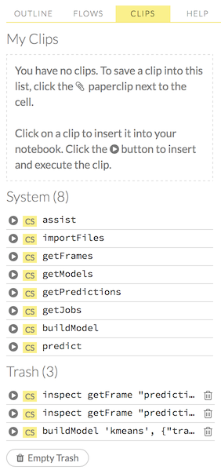

All saved clips, including the default system clips (such as ``assist``, ``importFiles``, and ``predict``), are listed. Clips you have created are listed under the "My Clips" heading. To select a clip to insert, click the circular button to the left of the clip name. To delete a clip, click the trashcan icon to right of the clip name.

**NOTE**: The default clips listed under "System" cannot be deleted.

Deleted clips are stored in the trash. To permanently delete all clips in the trash, click the **Empty Trash** button.

**NOTE**: Saved data, including flows and clips, are persistent as long as the same IP address is used for the cluster. If a new IP is used, previously saved flows and clips are not available.

Viewing Outlines
^^^^^^^^^^^^^^^^

The **Outline** tab in the sidebar displays a brief summary of the cells currently used in your flow; essentially, a command history.

-  To jump to a specific cell, click the cell description.
-  To delete a cell, select it and press the X key on your keyboard.

 .. figure:: images/Flow_outline.png
    :alt: View Outline

.. _Saving Flows:

Saving Flows
^^^^^^^^^^^^

You can save your flow for later reuse. After a Flow is saved, you can load it by clicking on the **Flows** tab in the right sidebar. Then in the pop-up confirmation window that appears, select **Load Notebook**. Refer to `Loading Flows <flow.html#loading-flows>`__ for more information. 

To save your flow as a notebook, click the "Save" button (the first button in the row of buttons below the flow name), or click the drop-down "Flow" menu and select "Save Flow." To enter a custom name for the flow, click the default flow name ("Untitled Flow") and type the desired flow name. A pencil icon indicates where to enter the desired name.

.. figure:: images/Flow_rename.png
   :alt: Renaming Flows

To confirm the name, click the checkmark to the right of the name field.

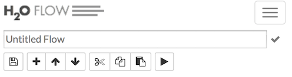

To reuse a saved flow, click the "Flows" tab in the sidebar, then click the flow name. To delete a saved flow, click the trashcan icon to the right of the flow name.

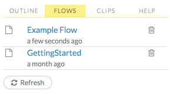

Finding Saved Flows on Your Disk
^^^^^^^^^^^^^^^^^^^^^^^^^^^^^^^^

By default, flows are saved to the ``h2oflows`` directory underneath your home directory. The directory where flows are saved is printed to stdout:

::

    03-20 14:54:20.945 172.16.2.39:54323     95667  main      INFO: Flow dir: '/Users/[YOUR_USER_NAME]/h2oflows'

To back up saved flows, copy this directory to your preferred backup location.

To specify a different location for saved flows, use the command-line argument ``-flow_dir`` when launching H2O:

::

  java -jar h2o.jar -flow_dir /[ENTER_PATH_TO_FLOW_DIRECTORY_HERE]

If the directory that you enter in place of ``[ENTER_PATH_TO_FLOW_DIRECTORY_HERE]`` does not exist, it will be created the first time you save a flow.

Saving Flows on a Hadoop Cluster
^^^^^^^^^^^^^^^^^^^^^^^^^^^^^^^^

If you are running H2O Flow on a Hadoop cluster, H2O will try to find the HDFS home directory to use as the default directory for flows. If the HDFS home directory is not found, flows cannot be saved unless a directory is specified while launching using ``-flow_dir``:

::

  hadoop jar h2odriver.jar -nodes 1 -mapperXmx 6g -output hdfsOutputDirName -flow_dir hdfs://[HOST]:[PORT_NUMBER]/[PATH_TO_DIRECTORY_HERE]

The location specified in ``-flow_dir`` may be either an hdfs or regular filesystem directory. If the directory does not exist, it will be created the first time you save a flow.

Copying Flows
^^^^^^^^^^^^^

To create a copy of the current flow, select the **Flow** menu, then click **Make a Copy**. The name of the current flow changes to ``Copy of <FlowName>`` (where ``<FlowName>`` is the name of the flow). You can save the duplicated flow using this name by clicking **Flow** > **Save Flow**, or rename it before saving. (Refer to `Saving Flows`_.)

Downloading Flows
^^^^^^^^^^^^^^^^^

After saving a flow as a notebook, click the **Flow** menu, then select **Download this Flow**. A new window opens and the saved flow is downloaded to the default downloads folder on your computer. The file is exported as ``<filename>.flow``, where ``<filename>`` is the name specified when the flow was saved.

**Caution**: You must have an active internet connection to download flows.

Loading Flows
^^^^^^^^^^^^^

To load a saved flow, click the **Flows** tab in the sidebar at the right. In the pop-up confirmation window that appears, select **Load Notebook**, or click **Cancel** to return to the current flow.

.. figure:: images/Flow_confirmreplace.png
   :alt: Confirm Replace Flow

After clicking **Load Notebook**, the saved flow is loaded.

To load an exported flow, click the **Flow** menu and select **Open Flow...**. In the pop-up window that appears, click the **Choose File** button and select the exported flow, then click the **Open** button.

.. figure:: images/Flow_Open.png
   :alt: Open Flow

**Notes**:

    -  Only exported flows using the default .flow filetype are supported. Other filetypes will not open.
    -  If the current notebook has the same name as the selected file, a pop-up confirmation appears to confirm that the current notebook should be overwritten.

--------------

.. _Understanding Cell Modes:

Understanding Cell Modes
------------------------

There are two modes for cells: Edit and Command.

.. _Using Edit Mode:

Using Edit Mode
^^^^^^^^^^^^^^^

In edit mode, the cell is yellow with a blinking bar to indicate where text can be entered and there is an orange flag to the left of the cell.

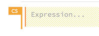

.. _Using Command Mode: 

Using Command Mode
^^^^^^^^^^^^^^^^^^

In command mode, the flag is yellow. The flag also indicates the cell's format:

-  **MD**: Markdown

 **Note**: Markdown formatting is not applied until you run the cell by:

 -  clicking the **Run** button |Flow - Run Button| or
 -  pressing **Ctrl+Enter**

 .. figure:: images/Flow_markdown.png
    :alt: Flow - Markdown

-  **CS**: Code (default)

  .. figure:: images/Flow_parse_code_ex.png
     :alt: Flow - Code

-  **RAW**: Raw format (for code comments)

  .. figure:: images/Flow_raw.png
     :alt: Flow - Raw

-  **H[1-6]**: Heading level (where 1 is a first-level heading)

  .. figure:: images/Flow_headinglevels.png
     :alt: Flow - Heading Levels

 **NOTE**: If there is an error in the cell, the flag is red.

  .. figure:: images/Flow_redflag.png
     :alt: Cell error

If the cell is executing commands, the flag is teal. The flag returns to yellow when the task is complete.

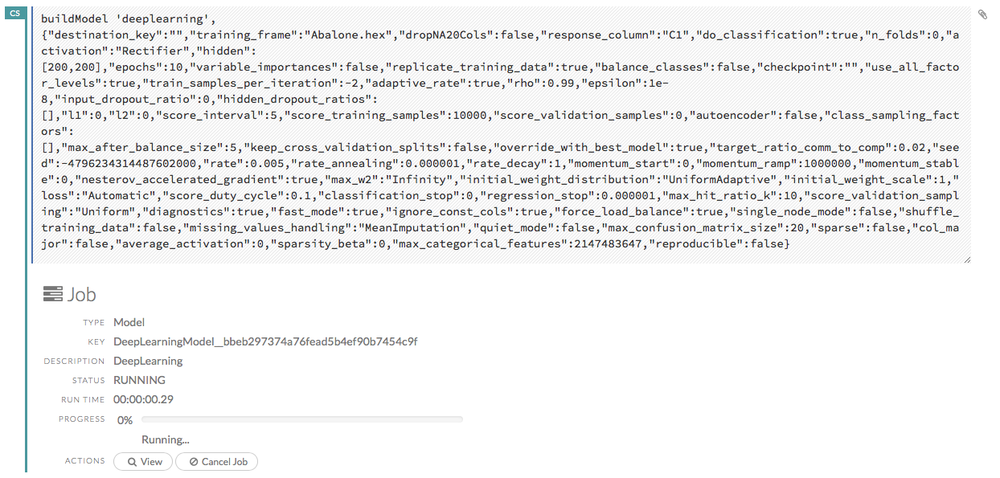

--------------

Changing Cell Formats
^^^^^^^^^^^^^^^^^^^^^

To change the cell's format (for example, from code to Markdown), make sure you are in command (not edit) mode and that the cell you want to change is selected. The easiest way to do this is to click on the flag to the left of the cell. Enter the keyboard shortcut for the format you want to use. The flag's text changes to display the current format.

+-------------+---------------------+
| Cell Mode   | Keyboard Shortcut   |
+=============+=====================+
| Code        | ``y``               |
+-------------+---------------------+
| Markdown    | ``m``               |
+-------------+---------------------+
| Raw text    | ``r``               |
+-------------+---------------------+
| Heading 1   | ``1``               |
+-------------+---------------------+
| Heading 2   | ``2``               |
+-------------+---------------------+
| Heading 3   | ``3``               |
+-------------+---------------------+
| Heading 4   | ``4``               |
+-------------+---------------------+
| Heading 5   | ``5``               |
+-------------+---------------------+
| Heading 6   | ``6``               |
+-------------+---------------------+

Running Cells
^^^^^^^^^^^^^

The series of buttons at the top of the page below the menus run cells in a flow.

.. figure:: images/Flow_RunButtons.png
   :alt: Flow - Run Buttons

-  To run all cells in the flow, click the **Flow** menu, then click **Run All Cells**.
-  To run the current cell and all subsequent cells, click the **Flow** menu, then click **Run All Cells Below**.
-  To run an individual cell in a flow, confirm the cell is in Edit Mode (refer to `Using Edit Mode`_), then:

   -  press **Ctrl+Enter**

     or

   -  click the **Run** button |Flow - Run Button|

Running Flows
^^^^^^^^^^^^^

When you run the flow, a progress bar indicates the current status of the flow. You can cancel the currently running flow by clicking the **Stop** button in the progress bar.

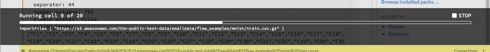

When the flow is complete, a message displays in the upper right.

|Flow - Completed Successfully| |Flow - Did Not Complete|

    **Note**: If there is an error in the flow, H2O Flow stops at the cell that contains the error.

Using Keyboard Shortcuts
^^^^^^^^^^^^^^^^^^^^^^^^^^

Here are some important keyboard shortcuts to remember:

-  Click a cell and press **Enter** to enter edit mode, which allows you to change the contents of a cell.
-  To exit edit mode, press **Esc**.
-  To execute the contents of a cell, press the **Ctrl** and **Enter** buttons at the same time.

The following commands must be entered in Command Mode. (Refer to `Using Command Mode`_.)

-  To add a new cell *above* the current cell, press **a**.
-  To add a new cell *below* the current cell, press **b**.
-  To delete the current cell, press the **d** key *twice*. (**dd**).

You can view these shortcuts by clicking **Help** > **Keyboard Shortcuts** or by clicking the **Help** tab in the sidebar.

Using Variables in Cells
^^^^^^^^^^^^^^^^^^^^^^^^

Variables can be used to store information such as download locations. To use a variable in Flow:

1. Define the variable in a code cell (for example, ``locA = "https://h2o-public-test-data.s3.amazonaws.com/bigdata/laptop/kdd2009/small-churn/kdd_train.csv"``).

   .. figure:: images/Flow_VariableDefinition.png

2. Run the cell. H2O validates the variable.

  .. figure:: images/Flow_VariableValidation.png

3. Use the variable in another code cell (for example, ``importFiles [locA]``). 

  .. figure:: images/Flow_VariableExample.png

To further simplify your workflow, you can save the cells containing the variables and definitions as clips. (Refer to `Using Clips`_.)

Using Flow Buttons
^^^^^^^^^^^^^^^^^^

There are also a series of buttons at the top of the page below the flow name that allow you to save the current flow, add a new cell, move cells up or down, run the current cell, and cut, copy, or paste the current cell. If you hover over the button, a description of the button's function displays.

.. figure:: images/Flow_buttons.png
   :alt: Flow buttons

| You can also use the menus at the top of the screen to edit the order of the cells, toggle specific format types (such as input or output), create models, or score models. You can also access troubleshooting information or obtain help with Flow.
| |Flow menus|

    **Note**: To disable the code input and use H2O Flow strictly as a GUI, click the **Cell** menu, then **Toggle Cell Input**.

Now that you are familiar with the cell modes, let's import some data.

--------------

Data
----

If you don't have any data of your own to work with, you can find some example datasets at http://data.h2o.ai.

Importing Files
^^^^^^^^^^^^^^^

There are multiple ways to import data in H2O flow:

-  Click the **Assist Me!** button in the row of buttons below the menus, then click the **importFiles** link. Enter the file path in the auto-completing **Search** entry field and press **Enter**. Select the file from the search results and confirm it by clicking the **Add All** link. |Flow - Import Files Auto-Suggest|

-  In a blank cell, select the CS format, then enter ``importFiles ["path/filename.format"]`` (where ``path/filename.format`` represents the complete file path to the file, including the full file name. The file path can be a local file path or a website address. **Note**: For S3 file locations, use the format ``importFiles [ "s3:/path/to/bucket/file/file.tab.gz" ]``

  **Note**: For an example of how to import a single file or a directory in R, refer to the following `example <https://github.com/h2oai/h2o-2/blob/master/R/tests/testdir_hdfs/runit_s3n_basic.R>`__.

After selecting the file to import, the file path displays in the "Search Results" section. To import a single file, click the plus sign next to the file. To import all files in the search results, click the **Add all** link. The files selected for import display in the "Selected Files" section. |Import Files|

 **Note**: If the file is compressed, it will only be read using a single thread. For best performance, we recommend uncompressing the file before importing, as this will allow use of the faster multithreaded distributed parallel reader during import. Please note that .zip files containing multiple files are not currently supported.

-  To import the selected file(s), click the **Import** button.

-  To remove all files from the "Selected Files" list, click the **Clear All** link.

-  To remove a specific file, click the **X** next to the file path.

After you click the **Import** button, the raw code for the current job displays. A summary displays the results of the file import, including the number of imported files and their Network File System (nfs) locations.

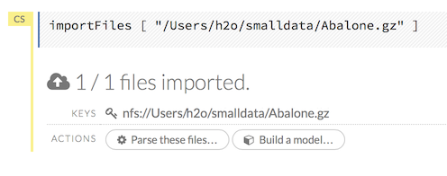

Uploading Files
^^^^^^^^^^^^^^^

To upload a local file, click the **Data** menu and select **Upload File...**. Click the **Choose File** button, select the file, click the **Choose** button, then click the **Upload** button.

.. figure:: images/Flow_UploadDataset.png
   :alt: File Upload Pop-Up

When the file has uploaded successfully, a message displays in the upper right and the **Setup Parse** cell displays.

.. figure:: images/Flow_FileUploadPass.png
   :alt: File Upload Successful

Ok, now that your data is available in H2O Flow, let's move on to the next step: parsing. Click the **Parse these files** button to continue.

--------------

Parsing Data
^^^^^^^^^^^^

After you have imported your data, parse the data.

.. figure:: images/Flow_parse_setup.png
   :alt: Flow - Parse options

The read-only **Sources** field shows the file path for the imported data selected for parsing. The **ID** contains the auto-generated name for the parsed data (by default, the file name of the imported file uses ``.hex`` as the file extension). Use the default name or enter a custom name in this field.

1. Select the parser type (if necessary) from the drop-down **Parser** list. For most data parsing, H2O automatically recognizes the data type, so the default settings typically do not need to be changed. The following options are available:

 -  AUTO
 -  ARFF
 -  XLS (BIFF 8 only)
 -  XLSX (BIFF 8 only)
 -  CSV
 -  SVMLight
 -  ORC
 -  AVRO
 -  PARQUET

 **Note**: For SVMLight data, the column indices must be >= 1 and the columns must be in ascending order. For AVRO, only version 1.8.0 is supported.

2. If a separator or delimiter is used, select it from the **Separator** list.

3. Select a column header option, if applicable:

 -  **Auto**: Automatically detect header types.
 -  **First row contains column names**: Specify heading as column names.
 -  **First row contains data**: Specify heading as data. This option is selected by default.

4. Select any necessary additional options:

 -  **Enable single quotes as a field quotation character**: Treat single quote marks (also known as apostrophes) in the data as a character, rather than an enum. This option is not selected by default.
 -  **Delete on done**: Check this checkbox to delete the imported data after parsing. This option is selected by default.

A preview of the data displays in the "Edit Column Names and Types" section. To change or add a column name, edit or enter the text in the column's entry field. In the screenshot below, the entry field for column 16 is highlighted in red.

.. figure:: images/Flow_ColNameEntry.png
   :alt: Flow - Column Name Entry Field

To change the column type, select the drop-down list to the right of the column name entry field and select the data type. The options are:

-  Unknown
-  Numeric
-  Enum
-  Time
-  UUID
-  String
-  Invalid

**Note**: When parsing a data file containing timestamps that do not include a timezone, the timestamps will be interpreted as UTC (GMT). 

You can search for a column by entering it in the *Search by column name...* entry field above the first column name entry field. As you type, H2O displays the columns that match the specified search terms.

**Note**: Only custom column names are searchable. Default column names cannot be searched.

To navigate the data preview, click the **<- Previous page** or **-> Next page** buttons. 

.. figure:: images/Flow_PageButtons.png
   :alt: Flow - Pagination buttons

After making your selections, click the **Parse** button. The code for the current job displays.

.. figure:: images/Flow_parse_code_ex.png
   :alt: Flow - Parse code

Since we've submitted a couple of jobs (data import & parse) to H2O now, let's take a moment to learn more about jobs in H2O.

--------------

Imputing Data
^^^^^^^^^^^^^

To impute data in a dataset, click the **Data** menu and select **Impute..**. The **Impute** option allows you to perform in-place imputation by filling missing values with aggregates computed on the "na.rm’d" vector. Additionally, you can also perform imputation based on groupings of columns from within the dataset. These columns can be passed by index or by column name using the Group By option. Note that if a factor column is supplied, then the method must be Mode.

The following options can be specified when imputing dataset:

- **Frame**: The dataset containing the column to impute
- **Column**: A specific column to impute. 
- **Method**: The type of imputation to perform. Mean replaces NAs with the column mean; Median replaces NAs with the column median; Mode replaces with the most common factor (for factor columns only).
- **Group By**: If the **Method** is either Mean or Mode, then choose the column or columns to group by. 
- **Combine Method**: If the **Method** is Median, then choose how to combine quantiles on even sample sizes. Available **Combine Method** options include Interpolate, Average, Low, and High.

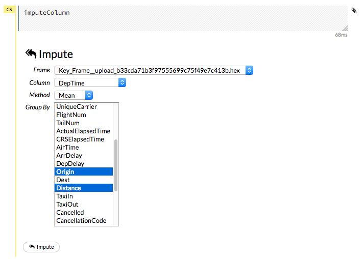

--------------

Viewing Jobs
--------------

Any command you enter in H2O (such as ``importFiles``) is submitted as a job, which is associated with a key. The key identifies the job within H2O and is used as a reference.

Viewing All Jobs
^^^^^^^^^^^^^^^^

To view all jobs, click the **Admin** menu, then click **Jobs**, or enter ``getJobs`` in a cell in CS mode.

.. figure:: images/Flow_getJobs.png
   :alt: View Jobs

The following information displays:

-  Type (for example, ``Frame`` or ``Model``)
-  Link to the object
-  Description of the job type (for example, ``Parse`` or ``GBM``)
-  Start time
-  End time
-  Run time

To refresh this information, click the **Refresh** button. To view the details of the job, click the **View** button.

Viewing Specific Jobs
^^^^^^^^^^^^^^^^^^^^^

To view a specific job, click the link in the "Destination" column.

.. figure:: images/Flow_ViewJob_Model.png
   :alt: View Job - Model

The following information displays:

-  Type (for example, ``Frame``)
-  Link to object (key)
-  Description (for example, ``Parse``)
-  Status
-  Run time
-  Progress

**Note**: For a better understanding of how jobs work, make sure to review the `Viewing Frames`_ section as well.

Ok, now that you understand how to find jobs in H2O, let's submit a new one by building a model.

--------------

Models
------

Building Models
^^^^^^^^^^^^^^^

There are several ways to build a model, you can:

- Click the **Assist Me!** button in the row of buttons below the menus and select **buildModel**

- Click the **Assist Me!** button, select **getFrames**, then click the **Build Model...** button below the parsed .hex data set

- Click the **View** button after parsing data, then click the **Build Model** button

- Click the drop-down **Model** menu and select the model type from the list

The **Build Model...** button can be accessed from any page containing the .hex key for the parsed data (for example, ``getJobs`` > ``getFrame``). The following image depicts the K-Means model type. Available options vary depending on model type.

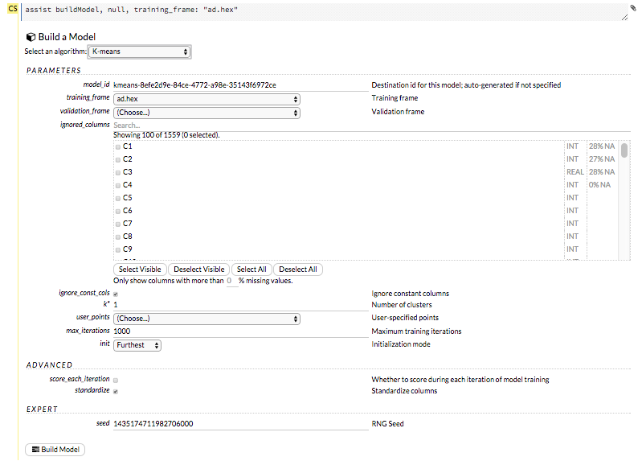

In the **Build a Model** cell, select an algorithm from the drop-down menu. (Refer to the `Data Science Algorithms <data-science.html>`_ section for information about the available algorithms.) Available algorithms include:

 - **Aggregator**: Create an Aggregator model.
 - **CoxPH**: Create a Cox Proportional Hazards model.
 - **Deep Learning**: Create a Deep Learning model.
 - **Distributed Random Forest**: Create a distributed Random Forest model.
 - **Gradient Boosting Machine**: Create a Gradient Boosted model
 - **Generalized Linear Model**: Create a Generalized Linear model.
 - **Generalized Low Rank Model**: Create a Generalized Low Rank model. 
 - **K-means**: Create a K-Means model.
 - **Naïve Bayes**: Create a Naïve Bayes model.
 - **Principal Component Analysis**: Create a Principal Components Analysis model for modeling without regularization or performing dimensionality reduction.
 - **Stacked Ensemble**: Create a Stacked Ensemble model.
 - **Word2Vec**: Create a Word2Vec model.
 - **XGBoost**: Create an XGBoost model. 

 You can also specify to run AutoML, which automatically trains and tunes models while requiring as few parameters as possible. All the user needs to do is point to a dataset, identify the response column, and optionally specify a time-constraint.

 .. figure:: images/Flow_model_dropdown.png
    :alt: Flow Model dropdown menu
    :height: 308
    :width: 150

The available options vary depending on the selected model. If an option is only available for a specific model type, the model type is listed. If no model type is specified, the option is applicable to all model types.

-  **model_id**: (Optional) Enter a custom name for the model to use as a reference. By default, H2O automatically generates an ID containing the model type (for example, ``gbm-6f6bdc8b-ccbc-474a-b590-4579eea44596``).

-  **training_frame**: (Required) Select the dataset used to build the model.

-  **validation_frame**: (Optional) Select the dataset used to evaluate the accuracy of the model.

-  **nfolds**: (GLM, GBM, DL, DRF) Specify the number of folds for cross-validation.

-  **response_column**: (Required for GBM, DRF, Deep Learning, GLM, Naïve-Bayes, Stacked Ensembles, AutoML, XGBoost, CoxPH) Select the column to use as the dependent variable.

-  **ignored_columns**: (Optional) Click the checkbox next to a column name to add it to the list of columns excluded from the model. To add all columns, click the **All** button. To remove a column from the list of ignored columns, click the X next to the column name. To remove all columns from the list of ignored columns, click the **None** button. To search for a specific column, type the column name in the **Search** field above the column list. To only show columns with a specific percentage of missing values, specify the percentage in the **Only show columns with more than 0% missing values** field. To change the selections for the hidden columns, use the **Select Visible** or **Deselect Visible** buttons.

-  **ignore_const_cols**: (Optional) Check this checkbox to ignore constant training columns, since no information can be gained from them. This option is selected by default.

-  **transform**: (PCA) Select the transformation method for the training data: None, Standardize, Normalize, Demean, or Descale.

-  **pca_method**: (PCA) Select the algorithm to use for computing the principal components:

   -  *GramSVD*: Uses a distributed computation of the Gram matrix, followed by a local SVD using the JAMA package
   -  *Power*: Computes the SVD using the power iteration method
   -  *Randomized*: Uses randomized subspace iteration method
   -  *GLRM*: Fits a generalized low-rank model with L2 loss function and no regularization and solves for the SVD using local matrix algebra

-  **family**: (GLM) Select the model type (Gaussian, Binomial, Multinomial, Poisson, Gamma, Tweedie, or Ordinal).

-  **solver**: (GLM) Select the solver to use (AUTO, IRLSM, L_BFGS, COORDINATE_DESCENT_NAIVE, or COORDINATE_DESCENT). IRLSM is fast on on problems with a small number of predictors and for lambda-search with L1 penalty, while `L_BFGS <http://cran.r-project.org/web/packages/lbfgs/vignettes/Vignette.pdf>`__ scales better for datasets with many columns. COORDINATE_DESCENT is IRLSM with the covariance updates version of cyclical coordinate descent in the innermost loop. COORDINATE_DESCENT_NAIVE is IRLSM with the naive updates version of cyclical coordinate descent in the innermost loop. 

-  **link**: (GLM) Select a link function (Identity, Family_Default, Logit, Log, Inverse, Tweedie, Ologit, Oprobit, or Ologlog).

-  **alpha**: (GLM) Specify the regularization distribution between L2 and L2. A value of 1 for alpha represents Lasso regression, a value of 0 produces Ridge regression and anything in between specifies the amount of mixing between the two. Default value of alpha is 0 when SOLVER = 'L-BFGS', 0.5 otherwise. 

-  **lambda**: (GLM) Specify the regularization strength.

-  **lambda_search**: (GLM) Check this checkbox to enable lambda search, starting with lambda max. The given lambda is then
   interpreted as lambda min.

-  **non-negative**: (GLM) To force coefficients to be non-negative, check this checkbox.

-  **standardize**: (K-Means, GLM) To standardize the numeric columns to have mean of zero and unit variance, check this checkbox. Standardization is highly recommended; if you do not use standardization, the results can include components that are dominated by variables that appear to have larger variances relative to other attributes as a matter of scale, rather than true contribution. This option is selected by default.

-  **beta_constraints**: (GLM) To use beta constraints, select a dataset from the drop-down menu. The selected frame is used
   to constraint the coefficient vector to provide upper and lower bounds.

-  **ntrees**: (GBM, DRF, XGBoost) Specify the number of trees.

-  **max_depth**: (GBM, DRF, XGBoost) Specify the maximum tree depth.

-  **min_rows**: (GBM, DRF, XGBoost) Specify the minimum number of observations for a leaf ("nodesize" in R).

-  **nbins**: (GBM, DRF) (Numerical [real/int] only) Specify the minimum number of bins for the histogram to build, then split at the best point.

-  **nbins_cats**: (GBM, DRF) (Categorical [factors/enums] only) Specify the maximum number of bins for the histogram to build, then split at the best point. Higher values can lead to more overfitting. The levels are ordered alphabetically; if   there are more levels than bins, adjacent levels share bins. This value has a more significant impact on model fitness than **nbins**. Larger values may increase runtime, especially for deep trees and large clusters, so tuning may be required to find the optimal value for your configuration.

-  **learn_rate**: (GBM, XGBoost) Specify the learning rate. The range is 0.0 to 1.0.

-  **distribution**: (GBM, DL) Select the distribution type from the drop-down list. The options are auto, bernoulli, multinomial, gaussian, poisson, gamma, or tweedie.

-  **sample_rate**: (GBM, DRF, XGBoost) Specify the row sampling rate (x-axis). The range is 0.0 to 1.0. Higher values may improve training accuracy. Test accuracy improves when either columns or rows are sampled. For details, refer to "Stochastic Gradient Boosting" (`Friedman, 1999 <https://statweb.stanford.edu/~jhf/ftp/stobst.pdf>`__).

-  **col_sample_rate**: (GBM, DRF, XGBoost) Specify the column sampling rate (y-axis). The range is 0.0 to 1.0. Higher values may improve training accuracy. Test accuracy improves when either columns or rows are sampled. For details, refer to "Stochastic Gradient Boosting" (`Friedman, 1999 <https://statweb.stanford.edu/~jhf/ftp/stobst.pdf>`__).

-  **mtries**: (DRF) Specify the columns to randomly select at each level. If the default value of ``-1`` is used, the number of variables is the square root of the number of columns for classification and p/3 for regression (where p is the number of predictors).

-  **binomial_double_trees**: (DRF) (Binary classification only) Build twice as many trees (one per class). Enabling this option  can lead to higher accuracy, while disabling can result in faster model building. This option is disabled by default.

-  **score_each_iteration**: (K-Means, DL, DRF, Naïve Bayes, PCA, GBM, GLM, XGBoost) To score during each iteration of the model training, check this checkbox.

-  **k**\ \*: (K-Means, PCA) For K-Means, specify the number of clusters. For PCA, specify the rank of matrix approximation.

-  **estimate_k**: (K-Means) Specify whether to estimate the number of clusters (<=k) iteratively (independent of the seed) and deterministically (beginning with ``k=1,2,3...``). If enabled, for each **k** that, the estimate will go up to **max_iteration**. This option is disabled by default.

-  **user_points**: (K-Means) For K-Means, specify the number of initial cluster centers.

-  **max_iterations**: (K-Means, PCA, GLM, CoxPH) Specify the number of training iterations.

-  **init**: (K-Means) Select the initialization mode. The options are Furthest, PlusPlus, Random, or User.

    **Note**: If PlusPlus is selected, the initial Y matrix is chosen by the final cluster centers from the K-Means PlusPlus algorithm.

-  **tweedie_variance_power**: (GLM) (Only applicable if *Tweedie* is selected for **Family**) Specify the Tweedie variance power.

-  **tweedie_link_power**: (GLM) (Only applicable if *Tweedie* is selected for **Family**) Specify the Tweedie link power.

-  **activation**: (DL) Select the activation function (Tanh, TanhWithDropout, Rectifier, RectifierWithDropout, Maxout, MaxoutWithDropout). The default option is Rectifier.

-  **hidden**: (DL) Specify the hidden layer sizes (e.g., 100,100). For Grid Search, use comma-separated values: (10,10),(20,20,20). The default value is [200,200]. The specified value(s) must be positive.

-  **epochs**: (DL) Specify the number of times to iterate (stream) the dataset. The value can be a fraction.

-  **variable_importances**: (DL) Check this checkbox to compute variable importance. This option is not selected by default.

-  **laplace**: (Naïve Bayes) Specify the Laplace smoothing parameter.

-  **min_sdev**: (Naïve Bayes) Specify the minimum standard deviation to use for observations without enough data.

-  **eps_sdev**: (Naïve Bayes) Specify the threshold for standard deviation. If this threshold is not met, the **min_sdev** value is used.

-  **min_prob**: (Naïve Bayes) Specify the minimum probability to use for observations without enough data.

-  **eps_prob**: (Naïve Bayes) Specify the threshold for standard deviation. If this threshold is not met, the **min_sdev** value is used.

-  **compute_metrics**: (Naïve Bayes, PCA) To compute metrics on training data, check this checkbox. The Naïve Bayes classifier assumes independence between predictor variables conditional on the response, and a Gaussian distribution of numeric predictors with mean and standard deviation computed from the training dataset. When building a Naïve Bayes classifier, every row in the training dataset that contains at least one NA will be skipped completely. If the test dataset has missing values, then those predictors are omitted in the probability calculation during prediction.

-  **max_models**: (AutoML) This option allows the user to specify the maximum number of models to build in an AutoML run. 

-  **max_runtime_secs**: (XGBoost, AutoML) This option controls how long the AutoML run will execute. This value defaults to 3600 seconds.

-  **base_model**: (Stacked Ensembles) Specify a list of models (or model IDs) that can be stacked together.  Models must have been cross-validated (i.e. ``nfolds``>1 or ``fold_column`` was specified), they all must use the same cross-validation folds, and ``keep_cross_validation_predictions`` must have been set to True. One way to guarantee identical folds across base models is to set ``fold_assignment = "Modulo"`` in all the base models.  It is also possible to get identical folds by setting ``fold_assignment = "Random"`` when the same seed is used in all base models.

-  **metalearner_algorithm**: (Stacked Ensembles) Type of algorithm to use as the metalearner. Options include 'AUTO' (GLM with non negative weights; if validation_frame is present, a lambda search is performed), 'glm' (GLM with default parameters), 'gbm' (GBM with default parameters), 'drf' (Random Forest with default parameters), or 'deeplearning' (Deep Learning with default parameters).

-  **metalearner_nfolds**: (Stacked Ensembles) Number of folds for K-fold cross-validation of the metalearner algorithm (0 to disable or >= 2).

-  **metalearner_params**: (Stacked Ensembles) A dictionary/list of parameters to be passed in along with the metalearner_algorithm. If this is not specified, then default values for the specified algorithm will be used.

-  **start_column**: (CoxPH) (Optional) The name of an integer column in the **source** data set representing the start time. If supplied, the value of the **start_column** must be strictly less than the **stop_column** in each row.

-  **stop_column**: (CoxPH) The name of an integer column in the **source** data set representing the stop time.

**Advanced Options**

-  **fold_assignment**: (GLM, GBM, DL, DRF, K-Means, XGBoost) (Applicable only if a value for **nfolds** is specified and **fold\_column** is not selected.) Select the cross-validation fold assignment scheme. The available options are Random or `Modulo <https://en.wikipedia.org/wiki/Modulo_operation>`__.

-  **fold_column**: (GLM, GBM, DL, DRF, K-Means, XGBoost) Select the column that contains the cross-validation fold index assignment per observation.

-  **offset_column**: (GLM, DRF, GBM, DL, XGBoost, CoxPH) Select a column to use as the offset. *Note*: Offsets are per-row "bias values" that are used during model training. For Gaussian distributions, they can be seen as simple corrections to the response (y) column. Instead of learning to predict the response (y-row), the model learns to predict the (row) offset of the response column. For other distributions, the offset corrections are applied in the linearized space before applying the inverse link function to get the actual response values. For more information, refer to the following `link <http://www.idg.pl/mirrors/CRAN/web/packages/gbm/vignettes/gbm.pdf>`__.

-  **weights_column**: (GLM, DL, DRF, GBM, XGBoost, CoxPH) Select a column to use for the observation weights. The specified ``weights_column`` must be included in the specified ``training_frame``. *Python only*: To use a weights column when passing an H2OFrame to ``x`` instead of a list of column names, the specified ``training_frame`` must contain the specified ``weights_column``. *Note*: Weights are per-row observation weights and do not increase the size of the data frame. This is typically the number of times a row is repeated, but non-integer values are supported as well. During training, rows with higher weights matter more, due to the larger loss function pre-factor.

-  **loss**: (DL) Select the loss function. For DL, the options are Automatic, Quadratic, CrossEntropy, Huber, or Absolute and the default value is Automatic. Absolute, Quadratic, and Huber are applicable for regression or classification, while CrossEntropy is only applicable for classification. Huber can improve for regression problems with outliers.

-  **checkpoint**: (DL, DRF, GBM) Enter a model key associated with a previously trained model. Use this option to build a new model as a continuation of a previously generated model.

-  **use_all_factor_levels**: (DL, PCA) Check this checkbox to use all factor levels in the possible set of predictors; if you enable this option, sufficient regularization is required. By default, the first factor level is skipped. For Deep Learning models, this option is useful for determining variable importances and is automatically enabled if the autoencoder is selected.

-  **train_samples_per_iteration**: (DL) Specify the number of global training samples per MapReduce iteration. To specify one epoch, enter 0. To specify all available data (e.g., replicated training data), enter -1. To use the automatic values, enter -2.

-  **adaptive_rate**: (DL) Check this checkbox to enable the adaptive learning rate (ADADELTA). This option is selected by default. If this option is enabled, the following parameters are ignored: ``rate``, ``rate_decay``, ``rate_annealing``, ``momentum_start``, ``momentum_ramp``, ``momentum_stable``, and ``nesterov_accelerated_gradient``.

-  **input_dropout_ratio**: (DL) Specify the input layer dropout ratio to improve generalization. Suggested values are 0.1 or 0.2. The range is >= 0 to <1.

-  **l1**: (DL) Specify the L1 regularization to add stability and improve generalization; sets the value of many weights to 0.

-  **l2**: (DL) Specify the L2 regularization to add stability and improve generalization; sets the value of many weights to smaller values.

-  **balance_classes**: (GBM, DL, Naive-Bayes, AutoML) Oversample the minority classes to balance the class distribution. This option is not selected by default and can increase the data frame size. This option is only applicable for classification. Majority classes can be undersampled to satisfy the **max_after_balance_size** parameter.

    **Note**: ``balance_classes`` balances over just the target, not over all classes in the training frame.

-  **max_confusion_matrix_size**: (DRF, DL, Naïve Bayes, GBM, GLM) Specify the maximum size (in number of classes) for confusion matrices to be  printed in the Logs. 

    **Note**: This option is deprecated.

-  **max_hit_ratio_k**: (DRF, DL, Naïve Bayes, GBM, GLM) Specify the maximum number (top K) of predictions to use for hit ratio computation. Applicable to multinomial only. To disable, enter 0.

-  **stopping_metric**: (GBM, DRF, DL, XGBoost, AutoML) Specify the metric to use for early stopping. The available options are:

    - AUTO: This defaults to logloss for classification, deviance for regression
    - deviance
    - logloss
    - MSE
    - RMSE
    - MAE
    - RMSLE
    - AUC
    - lift_top_group
    - misclassification
    - mean_per_class_error

-  **stopping_rounds**: (GBM, DRF, DL, XGBoost, AutoML) Stops training when the option selected for **stopping_metric** doesn’t improve for the specified number of training rounds, based on a simple moving average. To disable this feature, specify 0. The metric is computed on the validation data (if provided); otherwise, training data is used.

   **Note**: If cross-validation is enabled:
   
   - All cross-validation models stop training when the validation metric doesn’t improve.
   - The main model runs for the mean number of epochs.
   - N+1 models may be off by the number specified for stopping_rounds from the best model, but the cross-validation metric estimates the performance of the main model for the resulting number of epochs (which may be fewer than the specified number of epochs).

-  **stopping_tolerance**: (GBM, DRF, DL, XGBoost, AutoML) This option specifies the tolerance value by which a model must improve before training ceases.

-  **sort_metric**: (AutoML) Specifies the metric used to sort the Leaderboard by at the end of an AutoML run. Available options include:

    - ``AUTO``: This defaults to ``AUC`` for binary classification, ``mean_per_class_error`` for multinomial classification, and ``deviance`` for regression.
    - ``deviance`` (mean residual deviance)
    - ``logloss``
    - ``MSE``
    - ``RMSE``
    - ``MAE``
    - ``RMSLE``
    - ``AUC``
    - ``mean_per_class_error``

-  **build_tree_one_node**: (DRF, GBM) To run on a single node, check this checkbox. This is suitable for small datasets as there is no network overhead but fewer CPUs are used. The default setting is disabled.

-  **rate**: (DL) Specify the learning rate. Higher rates result in less stable models and lower rates result in slower convergence. Not applicable if **adaptive_rate** is enabled.

-  **rate_annealing**: (DL) Specify the learning rate annealing. The formula is rate/(1+rate_annealing value \* samples). Not applicable if **adaptive_rate** is enabled.

-  **momentum_start**: (DL) Specify the initial momentum at the beginning of training. A suggested value is 0.5. Not applicable if **adaptive_rate** is enabled.

-  **momentum_ramp**: (DL) Specify the number of training samples for increasing the momentum. Not applicable if **adaptive_rate** is enabled.

-  **momentum_stable**: (DL) Specify the final momentum value reached after the **momentum_ramp** training samples. Not applicable if **adaptive_rate** is enabled.

-  **nesterov_accelerated_gradient**: (DL) Check this checkbox to use the Nesterov accelerated gradient. This option is recommended and selected by default. Not applicable is **adaptive_rate** is enabled.

-  **hidden_dropout_ratios**: (DL) Specify the hidden layer dropout ratios to improve generalization. Specify one value per hidden layer, each value between 0 and 1 (exclusive). There is no default value. This option is applicable only if *TanhwithDropout*, *RectifierwithDropout*, or *MaxoutWithDropout* is selected from the **Activation** drop-down list.

-  **distribution**: (GBM, DL, XGBoost) Specify the distribution (i.e., the loss function). The options are AUTO, bernoulli, multinomial, gaussian, poisson, gamma, or tweedie. 

  - If the distribution is ``bernoulli``, the the response column must be 2-class categorical
  - If the distribution is ``multinomial``, the response column must be categorical.
  - If the distribution is ``poisson``, the response column must be numeric.
  - If the distribution is ``tweedie``, the response column must be numeric.
  - If the distribution is ``gaussian``, the response column must be numeric.
  - If the distribution is ``gamma``, the response column must be numeric.

  AUTO distribution is performed by default. In this case, the algorithm will guess the model type based on the response column type. If the response column type is numeric, AUTO defaults to “gaussian”; if categorical, AUTO defaults to bernoulli or multinomial depending on the number of response categories.

-  **tweedie_power**: (DL, GBM, XGBoost) (Only applicable if *Tweedie* is selected for **Family**) Specify the Tweedie power. The range is from 1 to 2. For a normal distribution, enter ``0``. For Poisson distribution, enter ``1``. For a gamma distribution, enter ``2``. For a compound Poisson-gamma distribution, enter a value greater than 1 but less than 2. For more information, refer to `Tweedie distribution <https://en.wikipedia.org/wiki/Tweedie_distribution>`__.

-  **categorical_encoding**: Specify one of the following encoding schemes for handling categorical features: Note that the default value varies based on the algorithm.

  - ``AUTO``: Allow the algorithm to decide. This is determined by the algorithm.
  - ``Enum``: 1 column per categorical feature
  - ``OneHotInternal``: On the fly N+1 new cols for categorical features with N levels
  - ``OneHotExplicit``: N+1 new columns for categorical features with N levels
  - ``Binary``: No more than 32 columns per categorical feature
  - ``Eigen``: *k* columns per categorical feature, keeping projections of one-hot-encoded matrix onto *k*-dim eigen space only
  - ``LabelEncoder``: Convert every enum into the integer of its index (for example, level 0 -> 0, level 1 -> 1, etc.) 
  - ``SortByResponse``: Reorders the levels by the mean response (for example, the level with lowest response -> 0, the level with second-lowest response -> 1, etc.). This is useful in GBM/DRF, for example, when you have more levels than ``nbins_cats``, and where the top level splits now have a chance at separating the data with a split. 
  - ``EnumLimited``: Automatically reduce categorical levels to the most prevalent ones during training and only keep the **T** most frequent levels.

-  **score_interval**: (DL) Specify the shortest time interval (in seconds) to wait between model scoring.

-  **score_training_samples**: (DL) Specify the number of training set samples for scoring. To use all training samples, enter 0.

-  **score_validation_samples**: (DL) (Requires selection from the **validation_frame** drop-down list) This option is applicable to classification only. Specify the number of validation set samples for scoring. To use all validation set samples, enter 0.

-  **score_duty_cycle**: (DL) Specify the maximum duty cycle fraction for scoring. A lower value results in more training and a higher value results in more scoring. The value must be greater than 0 and less than 1.

-  **autoencoder**: (DL) Check this checkbox to enable the Deep Learning autoencoder. This option is not selected by default.

	**Note**: This option requires a loss function other than CrossEntropy. If this option is enabled, **use_all_factor_levels**  must be enabled.

-  **col_sample_rate_per_tree**: (XGBoost) Specify the column subsampling rate per tree.

-  **score_tree_interval**: (XGBoost) Score the model after every so many trees.

-  **min_split_improvement**: (XGBoost) Specify the minimum relative improvement in squared error reduction in order for a split to happen.

-  **num_leaves**: (XGBoost) When the tree_method is "hist", specify the maximum number of leaves to include each tree.

-  **tree_method**: (XGBoost) Specify the construction tree method to use. This can be one of the following: 

   - auto (default): Allow the algorithm to choose the best method. For small to medium dataset, "exact"  will be used. For very large datasets, "approx" will be used.
   - exact: Use the exact greedy method.
   - approx: Use an approximate greedy method.
   - hist: Use a fast histogram optimized approximate greedy method.

-  **grow_policy**: (XGBoost) Specify the way that new nodes are added to the tree. "depthwise" (default) splits at nodes that are closest to the root; "lossguide" splits at nodes with the highest loss change.

-  **dmatrix_type**: (XGBoost) Specify the type of DMatrix. Valid options are "auto", "dense", and "sparse". Note that for a DMatrix type of "sparase", NAs and 0 are treated equally.

-  **metalearner_fold_assignment**: (Stacked Ensembles) Cross-validation fold assignment scheme for metalearner cross-validation. Defaults to AUTO (which is currently set to Random). The 'Stratified' option will stratify the folds based on the response variable, for classification problems.

- **metalearner_fold_column**: (Stacked Ensembles) Column with cross-validation fold index assignment per observation for cross-validation of the metalearner.

-  **keep_levelone_frame**: (Stacked Ensembles) Keep the level one data frame that's constructed for the metalearning step. This option is disabled by default.

-  **stratify_by**: (CoxPH) A list of columns to use for stratification.

-  **ties**: (CoxPH) The approximation method for handling ties in the partial likelihood. This can be either **efron** (default) or **breslow**). See the :ref:`coxph_model_details` section below for more information about these options.

-  **init**: (CoxPH) (Optional) Initial values for the coefficients in the model. This value defaults to 0.

-  **lre_min**: (CoxPH) A positive number to use as the minimum log-relative error (LRE) of subsequent log partial likelihood calculations to determine algorithmic convergence. The role this parameter plays in the stopping criteria of the model fitting algorithm is explained in the :ref:`coxph_algorithm` section below. This value defaults to 9.

**Expert Options**

-  **keep_cross_validation_models**: (GBM, DRF, Deep Learning, GLM, Naïve-Bayes, K-Means, XGBoost, AutoML) To keep the cross-validation models, check this checkbox.

-  **keep_cross_validation_predictions**: (GBM, DRF, Deep Learning, GLM, Naïve-Bayes, K-Means, XGBoost, AutoML) To keep the cross-validation predictions, check this checkbox.

-  **keep_cross_validation_fold_assignment**: (GBM, DRF, Deep Learning, GLM, Naïve-Bayes, K-Means, XGBoost, AutoML) Enable this option to preserve the cross-validation fold assignment.

-  **class_sampling_factors**: (DRF, GBM, DL, Naive-Bayes, AutoML) Specify the per-class (in lexicographical order) over/under-sampling ratios. By default, these ratios are automatically computed during training to obtain the class balance. This option is only applicable for classification problems and when **balance_classes** is enabled.

-  **overwrite_with_best_model**: (DL) Check this checkbox to overwrite the final model with the best model found during training. This option is selected by default.

-  **target_ratio_comm_to_comp**: (DL) Specify the target ratio of communication overhead to computation. This option is only enabled for multi-node operation and if **train_samples_per_iteration** equals -2 (auto-tuning).

-  **rho**: (DL) Specify the adaptive learning rate time decay factor. This option is only applicable if **adaptive_rate** is enabled.

-  **epsilon**: (DL) Specify the adaptive learning rate time smoothing factor to avoid dividing by zero. This option is only applicable if **adaptive_rate** is enabled.

-  **max_w2**: (DL) Specify the constraint for the squared sum of the incoming weights per unit (e.g., for Rectifier).

-  **initial_weight_distribution**: (DL) Select the initial weight distribution (Uniform Adaptive, Uniform, or Normal). If Uniform Adaptive is used, the **initial_weight_scale** parameter is not applicable.

-  **initial_weight_scale**: (DL) Specify the initial weight scale of the distribution function for Uniform or Normal distributions. For Uniform, the values are drawn uniformly from initial weight scale. For Normal, the values are drawn from a Normal distribution with the standard deviation of the initial weight scale. If Uniform Adaptive is selected as the **initial_weight_distribution**, the **initial_weight_scale** parameter is not applicable.

-  **classification_stop**: (DL) (Applicable to discrete/categorical datasets only) Specify the stopping criterion for classification error fractions on training data. To disable this option, enter -1.

-  **max_hit_ratio_k**: (DL, GLM) (Classification only) Specify the maximum number (top K) of predictions to use for hit ratio computation (for multinomial only). To disable this option, enter 0.

-  **regression_stop**: (DL) (Applicable to real value/continuous datasets only) Specify the stopping criterion for regression error (MSE) on the training data. To disable this option, enter -1.

-  **diagnostics**: (DL) Check this checkbox to compute the variable importances for input features (using the Gedeon method). For large networks, selecting this option can reduce speed. This option is selected by default.

-  **fast_mode**: (DL) Check this checkbox to enable fast mode, a minor approximation in back-propagation. This option is selected by default.

-  **force_load_balance**: (DL) Check this checkbox to force extra load balancing to increase training speed for small datasets and use all cores. This option is selected by default.

-  **single_node_mode**: (DL) Check this checkbox to force H2O to run on a single node for fine-tuning of model parameters. This option is not selected by default.

-  **replicate_training_data**: (DL) Check this checkbox to replicate the entire training dataset on every node for faster training on small datasets. This option is not selected by default. This option is only applicable for clouds with more than one node.

-  **shuffle_training_data**: (DL) Check this checkbox to shuffle the training data. This option is recommended if the training data is replicated and the value of **train_samples_per_iteration** is close to the number of nodes times the number of rows. This option is not selected by default.

-  **missing_values_handling**: (DL, GLM) Select how to handle missing values (Skip or MeanImputation).

-  **quiet_mode**: (DL) Check this checkbox to display less output in the standard output. This option is not selected by default.

-  **sparse**: (DL) Check this checkbox to enable sparse data handling, which is more efficient for data with many zero values.

-  **col_major**: (DL) Check this checkbox to use a column major weight matrix for the input layer. This option can speed up forward propagation but may reduce the speed of backpropagation. This option is not selected by default.

    **Note**: This parameter has been deprecated.

-  **average_activation**: (DL) Specify the average activation for the sparse autoencoder. If **Rectifier** is selected as the **Activation** type, this value must be positive. For Tanh, the value must be in (-1,1).

-  **sparsity_beta**: (DL) Specify the sparsity-based regularization optimization. For more information, refer to the following `link <http://www.mit.edu/~9.520/spring09/Classes/class11_sparsity.pdf>`__.

-  **max_categorical_features**: (DL) Specify the maximum number of categorical features enforced via hashing.

-  **reproducible**: (DL) To force reproducibility on small data, check this checkbox. If this option is enabled, the model takes more time to generate, since it uses only one thread.

-  **export_weights_and_biases**: (DL) To export the neural network weights and biases as H2O frames, check this checkbox.

-  **max_after_balance_size**: (DRF, GBM, DL, Naive-Bayes, AutoML) Specify the maximum relative size of the training data after balancing class counts (can be less than 1.0). Defaults to 5.0. Requires **balance_classes**.

-  **nbins_top_level**: (DRF, GBM) (For numerical [real/int] columns only) Specify the maximum number of bins at the root level to use to build the histogram. This number will then be decreased by a factor of two per level.

-  **max_abs_leafnode_pred**: (GBM, XGBoost) The maximum absolute value of a leaf node prediction.

-  **max_bin**: (XGBoost) For tree_method=hist only: specify the maximum number of bins for binning continuous features.

-  **min_sum_hessian_in_leaf**: (XGBoost) For tree_method=hist only: the mininum sum of hessian in a leaf to keep splitting

-  **min_data_in_leaf**: (XGBoost) For tree_method=hist only: the mininum data in a leaf to keep splitting

-  **booster**: (XGBoost) Specify the booster type. This can be one of the following: "gbtree", "gblinear", or "dart". Note that "gbtree" and "dart" use a tree-based model while "gblinear" uses linear function. This value defaults to "gbtree".

-  **reg_lambda**: (XGBoost) Specify a value for L2 regularization. 

-  **reg_alpha**: (XGBoost) Specify a value for L1 regularization.

-  **backend**: (XGBoost) Specify the backend type. This can be done of the following: "auto", "gpu", or "cpu". 

-  **gpu_id**: (XGBoost) If a GPU backend is available, specify Which GPU to use. 

-  **sample_type**: (XGBoost) For booster=dart only: specify whether the sampling type should be one of the following:

  -  "uniform" (default): Dropped trees are selected uniformly.
  -  "weighted": Dropped trees are selected in proportion to weight.

-  **normalize_type**: (XGBoost) For booster=dart only: specify whether the normalization method. This can be one of the following:

  -  "tree" (default): New trees have the same weight as each of the dropped trees 1 / (k + learning_rate).
  -  "forest": New trees have the same weight as the sum of the dropped trees (1 / (1 + learning_rate).

-  **rate_drop**: (XGBoost) For booster=dart only: specify a float value from 0 to 1 for the rate at which to drop previous trees during dropout.

-  **one_drop**: (XGBoost) For booster=dart only: specify whether to enable one drop, which causes at least one tree to always drop during the dropout.

-  **skip_drop**: (XGBoost) For booster=dart only: specify a float value from 0 to 1 for the skip drop. This determines the probability of skipping the dropout procedure during a boosting iteration. If a dropout is skipped, new trees are added in the same manner as "gbtree". Note that non-zero ``skip_drop`` has higher priority than ``rate_drop`` or ``one_drop``.

-  **pred_noise_bandwidth**: (GBM) The bandwidth (sigma) of Gaussian multiplicative noise ~N(1,sigma) for tree node predictions.

-  **calibrate_model**: (DRF, GBM) Use Platt scaling to calculate calibrated class probabilities. Defaults to False.

-  **calibration_frame**: (DRF, GBM) Specifies the frame to be used for Platt scaling.

-  **seed**: (K-Means, GBM, DL, DRF) Specify the random number generator (RNG) seed for algorithm components dependent on randomization. The seed is consistent for each H2O instance so that you can create models with the same starting conditions in alternative configurations.

-  **intercept**: (GLM) To include a constant term in the model, check this checkbox. This option is selected by default.

-  **objective_epsilon**: (GLM) Specify a threshold for convergence. If the objective value is less than this threshold, the model is converged.

-  **beta_epsilon**: (GLM) Specify the beta epsilon value. If the L1 normalization of the current beta change is below this threshold, consider using convergence.

-  **gradient_epsilon**: (GLM) (For L-BFGS only) Specify a threshold for convergence. If the objective value (using the L-infinity norm) is less than this threshold, the model is converged.

-  **prior**: (GLM) Specify prior probability for y ==1. Use this parameter for logistic regression if the data has been sampled and the mean of response does not reflect reality.

-  **max_active_predictors**: (GLM) Specify the maximum number of active predictors during computation. This value is used as a stopping criterium to prevent expensive model building with many predictors.

-  **interactions**: (GLM, CoxPH) Specify a list of predictor column indices to interact. All pairwise combinations will be computed for this list. 

-  **interaction_pairs** (GLM, CoxPH) When defining interactions, use this to specify a list of pairwise column interactions (interactions between two variables). Note that this is different than ``interactions``, which will compute all pairwise combinations of specified columns.

--------------

Viewing Models
^^^^^^^^^^^^^^

Click the **Assist Me!** button, then click the **getModels** link, or enter ``getModels`` in the cell in CS mode and press **Ctrl+Enter**. A list of available models displays.

.. figure:: images/Flow_getModels.png
   :alt: Flow Models

To view all current models, you can also click the **Model** menu and click **List All Models**.

Click on a model name to view details about the model. The information that displays varies based on the algorithm that was used to build the model, but it can include the parameters used when building the model, scoring history, training metrics, coefficient tables, and a POJO preview.  

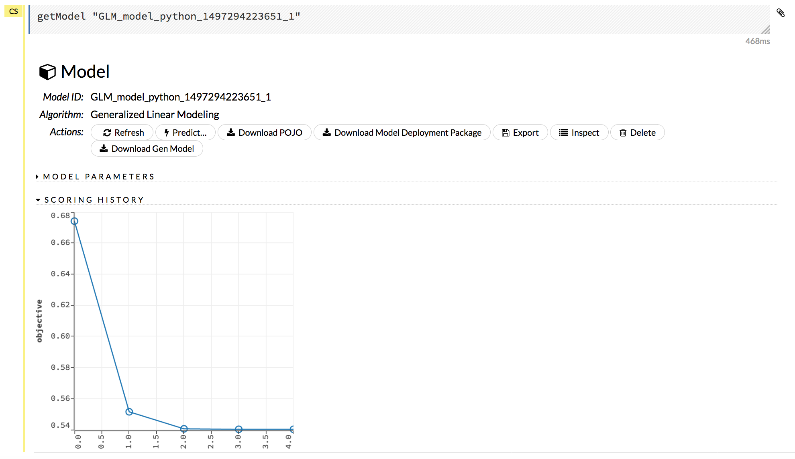

The following additional functions are available when viewing a model:

- **Refresh**: Refreshes the model.
- **Predict**: Use this model to make predictions.  
- **Download POJO**: Generates a Plain Old Java Object (POJO) that can use the model outside of H2O. Note that a POJO can be run in standalone mode or it can be integrated into a platform, such as `Hadoop's Storm <https://github.com/h2oai/h2o-tutorials/tree/master/tutorials/streaming/storm>`__. To make the POJO work in your Java application, you will also need the ``h2o-genmodel.jar`` file (available via the **Download Generated Model** button, from the **Admin** menu, or in ``h2o-3/h2o-genmodel/build/libs/h2o-genmodel.jar``). Note that POJOs are are not supported for XGBoost models.
- **Download Model Deployment Package (MOJO)**: Downloads a zip file containing the Model ObJect, Optimized (MOJO). This file includes the outputting model information in JSON format. Note that MOJOs are available for AutoML, Deep Learning, DRF, GBM, GLM, GLRM, K-Means, Stacked Ensembles, SVM, Word2vec, and XGBoost models. 
- **Export**: Exports a built model.
- **Inspect**: Inspect the model. Clicking this button displays a data table of the model parameters and output information.
- **Delete**: Deletes the model.
- **Download Gen Model**: Downloads the Generated Model (h2o-genmodel.jar) file for this model. Note that this is also available from the **Admin** dropdown menu.

--------------

.. _export-import-models-flow:

Exporting and Importing Models
^^^^^^^^^^^^^^^^^^^^^^^^^^^^^^

**To export a built model:**

1. Click the **Model** menu at the top of the screen.
2. Select *Export Model...*
3. In the ``exportModel`` cell that appears, select the model from the drop-down *Model:* list.
4. Enter a location for the exported model in the *Path:* entry field. **Note**: If you specify a location that doesn't exist, it will be created. For example, if you only enter ``test`` in the *Path:* entry  field, the model will be exported to ``h2o-3/test``.

5. To overwrite any files with the same name, check the *Overwrite:* checkbox.
6. Click the **Export** button. A confirmation message displays when the model has been successfully exported.

.. figure:: images/ExportModel.png
   :alt: Export Model

**To import a built model:**

1. Click the **Model** menu at the top of the screen.
2. Select *Import Model...*
3. Enter the location of the model in the *Path:* entry field. **Note**: The file path must be complete (e.g., ``Users/h2o-user/h2o-3/exported_models``). Do not rename models while importing.
4. To overwrite any files with the same name, check the *Overwrite:* checkbox.
5. Click the **Import** button. A confirmation message displays when the model has been successfully imported. To view the imported model, click the **View Model** button.

.. figure:: images/ImportModel.png
   :alt: Import Model

--------------

Run AutoML
^^^^^^^^^^

AutoML automatically trains and tunes models while requiring as few parameters as possible. A user is only required to point to a dataset, identify the response column and optionally specify a time constraint, a maximum number of models constraint, and early stopping parameters. AutoML will then begin training models and will stop as specified in the configuration (i.e., when the maximum number of models has been reached, when the maximum run time has been reached, or when the stopping criteria are met). 

Stacked Ensembles will also be automatically trained on the collection of individual models to produce a highly predictive ensemble model which, in most cases, will be the top performing model in the AutoML leaderboard. Note that Stacked Ensembles are not yet available for multiclass classification problems, so in that case, only singleton models will be trained.

The outputted models will display on a leaderboard, showing the best results first. The Leaderboard Frame can be specified when configuring the AutoML run. The frame will not be used for anything besides creating the leaderboard. If a Leaderboard Frame is not specified, then one will be created from the Training Frame.

To begin an AutoML run, select **Models > Run AutoML** from the top menu.

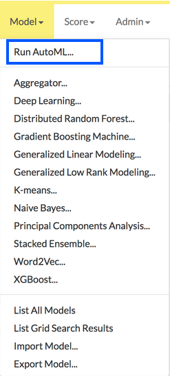

At a minimum, specify the training frame and the response column. (Note that by default, the AutoML run will end after 3600 seconds.) Click **Build Model** to start the run.

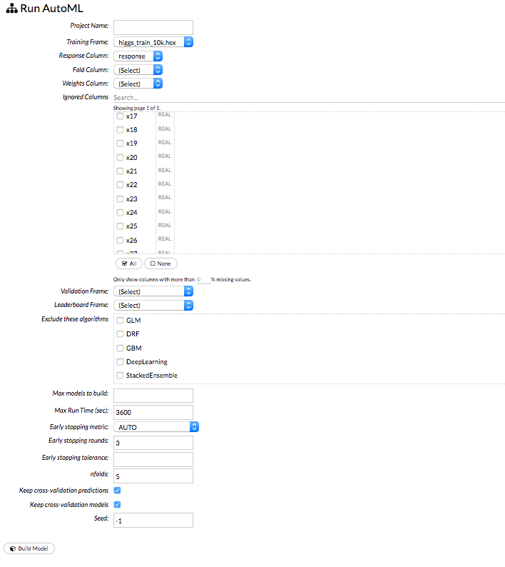

Click the **View** button to view the Leaderboard and/or monitor the current AutoML run.

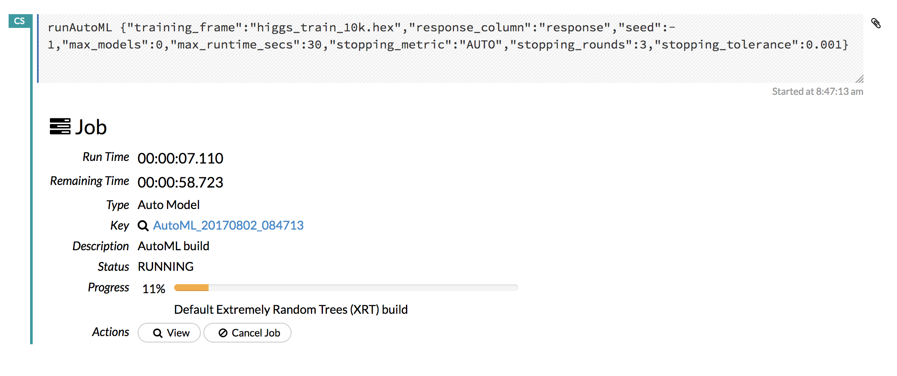

After clicking **View**, the Leaderboard displays the list of models that were built in the order of ``mean_residual_deviance`` (best model first). While AutoML is running, click the **Monitor Live** button and scroll down to view a live feed of the User Feedback progress of AutoML. This section provides details about each step taken by AutoML, including the parameters being configured, the dataset's features, and model training information.

**Note**: You can also monitor or view an AutoML run if the run was started through Python or R. In this case, open Flow, click **Admin > Jobs** from the top menu, then click the AutoML hyperlink.

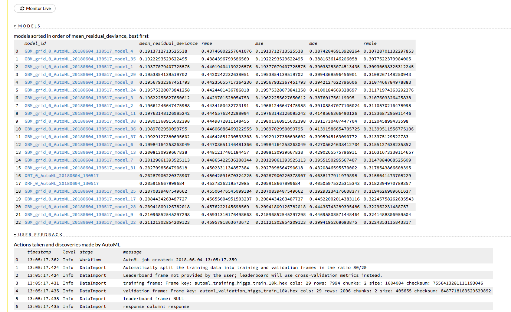

--------------

Using Grid Search
^^^^^^^^^^^^^^^^^

To include a parameter in a grid search in Flow, check the checkbox in the *GRID?* column to the right of the parameter name (highlighted in red in the image below).

.. figure:: images/Flow_GridSearch.png
   :alt: Grid Search Column

-  If the parameter selected for grid search is Boolean (T/F or Y/N), both values are included when the *Grid?* checkbox is selected.
-  If the parameter selected for grid search is a list of values, the values display as checkboxes when the *Grid?* checkbox is selected. More than one option can be selected.
-  If the parameter selected for grid search is a numerical value, use a semicolon (;) to separate each additional value.
-  To view a list of all grid searches, select the **Model** menu, then click **List All Grid Search Results**, or click the **Assist Me** button and select **getGrids**.

--------------

Checkpointing Models
^^^^^^^^^^^^^^^^^^^^

Some model types, such as DRF, GBM, and Deep Learning, support checkpointing. A checkpoint resumes model training so that you can iterate your model. The dataset must be the same. The following model parameters must be the same when restarting a model from a checkpoint:

+-------------------------------------------+--------------------------------+-------------------------------------+
| Must be the same as in checkpoint model   |                                |                                     |
+===========================================+================================+=====================================+
| ``drop_na20_cols``                        | ``response_column``            | ``activation``                      |
+-------------------------------------------+--------------------------------+-------------------------------------+
| ``use_all_factor_levels``                 | ``adaptive_rate``              | ``autoencoder``                     |
+-------------------------------------------+--------------------------------+-------------------------------------+
| ``rho``                                   | ``epsilon``                    | ``sparse``                          |
+-------------------------------------------+--------------------------------+-------------------------------------+
| ``sparsity_beta``                         | ``col_major``                  | ``rate``                            |
+-------------------------------------------+--------------------------------+-------------------------------------+
| ``rate_annealing``                        | ``rate_decay``                 | ``momentum_start``                  |
+-------------------------------------------+--------------------------------+-------------------------------------+
| ``momentum_ramp``                         | ``momentum_stable``            | ``nesterov_accelerated_gradient``   |
+-------------------------------------------+--------------------------------+-------------------------------------+
| ``ignore_const_cols``                     | ``max_categorical_features``   | ``nfolds``                          |
+-------------------------------------------+--------------------------------+-------------------------------------+
| ``distribution``                          | ``tweedie_power``              |                                     |
+-------------------------------------------+--------------------------------+-------------------------------------+

The following parameters can be modified when restarting a model from a checkpoint:

+------------------------------------+--------------------------------------+---------------------------------+
| Can be modified                    |                                      |                                 |
+====================================+======================================+=================================+
| ``seed``                           | ``checkpoint``                       | ``epochs``                      |
+------------------------------------+--------------------------------------+---------------------------------+
| ``score_interval``                 | ``train_samples_per_iteration``      | ``target_ratio_comm_to_comp``   |
+------------------------------------+--------------------------------------+---------------------------------+
| ``score_duty_cycle``               | ``score_training_samples``           | ``score_validation_samples``    |
+------------------------------------+--------------------------------------+---------------------------------+
| ``score_validation_sampling``      | ``classification_stop``              | ``regression_stop``             |
+------------------------------------+--------------------------------------+---------------------------------+
| ``quiet_mode``                     | ``max_confusion_matrix_size``        | ``max_hit_ratio_k``             |
+------------------------------------+--------------------------------------+---------------------------------+
| ``diagnostics``                    | ``variable_importances``             | ``initial_weight_distribution`` |
+------------------------------------+--------------------------------------+---------------------------------+
| ``initial_weight_scale``           | ``force_load_balance``               | ``replicate_training_data``     |
+------------------------------------+--------------------------------------+---------------------------------+
| ``shuffle_training_data``          | ``single_node_mode``                 | ``fast_mode``                   |
+------------------------------------+--------------------------------------+---------------------------------+
| ``l1``                             | ``l2``                               | ``max_w2``                      |
+------------------------------------+--------------------------------------+---------------------------------+
| ``input_dropout_ratio``            | ``hidden_dropout_ratios``            | ``loss``                        |
+------------------------------------+--------------------------------------+---------------------------------+
| ``overwrite_with_best_model``      | ``missing_values_handling``          | ``average_activation``          |
+------------------------------------+--------------------------------------+---------------------------------+
| ``reproducible``                   | ``export_weights_and_biases``        | ``elastic_averaging``           |
+------------------------------------+--------------------------------------+---------------------------------+
| ``elastic_averaging_moving_rate``  | ``elastic_averaging_regularization`` | ``mini_batch_size``             |
+------------------------------------+--------------------------------------+---------------------------------+

1. After building your model, copy the ``model_id``. To view the ``model_id``, click the **Model** menu then click **List All Models**.
2. Select the model type from the drop-down **Model** menu. **Note**: The model type must be the same as the checkpointed model.
3. Paste the copied ``model_id`` in the *checkpoint* entry field.
4. Click the **Build Model** button. The model will resume training.

--------------

Interpreting Model Results
^^^^^^^^^^^^^^^^^^^^^^^^^^

**Scoring history**: (GBM, DL) Represents the error rate of the model as it is built. Typically, the error rate will be higher at the beginning (the left side of the graph) then decrease as the model building completes and accuracy improves. Can include mean squared error (MSE) and deviance.

.. figure:: images/Flow_ScoringHistory.png
   :alt: Scoring History example

**Variable importances**: (GBM, DL) Represents the statistical significance of each variable in the data in terms of its affect on the model. Variables are listed in order of most to least importance. The percentage values represent the percentage of importance across all variables, scaled to 100%. The method of computing each variable's importance depends on the algorithm. To view the scaled importance value of a variable, use your mouse to hover over the bar representing the variable.

.. figure:: images/Flow_VariableImportances.png
   :alt: Variable Importances example

**Confusion Matrix**: (RF, GBM) Table depicting performance of algorithm in terms of false positives, false negatives, true positives, and true negatives. The actual results display in the columns and the predictions display in the rows; correct predictions are highlighted in yellow. In the example below, ``0`` was predicted correctly 902 times, while ``8`` was predicted correctly 822 times and ``0`` was predicted as ``4`` once.

.. figure:: images/Flow_ConfusionMatrix.png
   :alt: Confusion Matrix example

**ROC Curve**: (DRF) A `ROC Curve <https://en.wikipedia.org/wiki/Receiver_operating_characteristic>`__  is a graph that represents the ratio of true positives to false positives. (For more information, refer to the Linear Digressions `podcast <http://lineardigressions.com/episodes/2017/1/29/rock-the-roc-curve>`__ describing ROC Curves.) To view a specific threshold, select a value from the drop-down **Threshold** list. To view any of the following details, select it from the drop-down **Criterion** list:

-  Max f1
-  Max f2
-  Max f0point5
-  Max accuracy
-  Max precision
-  Max absolute MCC (the threshold that maximizes the absolute Matthew's Correlation Coefficient)
-  Max min per class accuracy

The lower-left side of the graph represents less tolerance for false positives while the upper-right represents more tolerance for false positives. Ideally, a highly accurate ROC resembles the following example.

.. figure:: images/Flow_ROC.png
   :alt: ROC Curve example

**Hit Ratio**: (GBM, DRF, NaiveBayes, DL, GLM) (Multinomial Classification only) Table representing the number of times that the prediction was correct out of the total number of predictions.

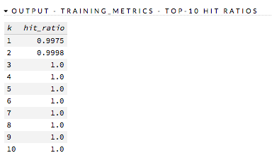

**Standardized Coefficient Magnitudes** (GLM) Bar chart representing the relationship of a specific feature to the response variable. Coefficients can be positive (orange) or negative (blue). A positive coefficient indicates a positive relationship between the feature and the response, where an increase in the feature corresponds with an increase in the response, while a negative coefficient represents a negative relationship between the feature and the response where an increase in the feature corresponds with a decrease in the response (or vice versa).

.. figure:: images/SCM.png
   :alt: Standardized Coefficient Magnitudes

--------------

Partial Dependence Plots
------------------------

For models that include only numerical values, you can view a Partial Dependence Plot (PDP) for that model. This provides a graphical representation of the marginal effect of a variable on the class probability (classification) or response (regression). 

Viewing Partial Dependence Plots
^^^^^^^^^^^^^^^^^^^^^^^^^^^^^^^^

1. To view a PDP for a model, click the Score dropdown at the top of the Flow UI, then select Partial Dependence Plots. 

 .. figure:: images/score_pdp_menu.png
    :alt: Score > Partial Dependence Plot...

2. Specify the Model and Frame that you want to use to retrieve the plots, and specify the number of bins (levels that PDP will compute). Note that more levels will result in slower speeds. By default, the top 10 features are used to build the plot. Alternatively, you can click the **Select Column?** button to build a plot based on a specified set of columns. Click **Compute** when you are done.

 **Note**: Be sure to specify the dataframe that was used to build the selected model.

 .. figure:: images/compute_pdp.png
    :alt: Compute Partial Dependence

3. After the job is finished, click **View** to see the plots.

 .. figure:: images/pdp_summary.png
    :alt: Partial Dependence Summary

--------------

Predictions
-----------

After creating your model, click the key link for the model, then click the **Predict** button. Select the model to use in the prediction from the drop-down **Model:** menu and the data frame to use in the prediction from the drop-down **Frame:** menu, then click the **Predict** button.

.. figure:: images/Flow_makePredict.png
   :alt: Making Predictions

Viewing Predictions
^^^^^^^^^^^^^^^^^^^

Click the **Assist Me!** button, then click the **getPredictions** link, or enter ``getPredictions`` in the cell in CS mode and press **Ctrl+Enter**. A list of the stored predictions displays. To view a prediction, click the **View** button to the right of the model name.

.. figure:: images/Flow_getPredict.png
   :alt: Viewing Predictions

You can also view predictions by clicking the drop-down **Score** menu and selecting **List All Predictions**.

Interpreting the Gains/Lift Chart
^^^^^^^^^^^^^^^^^^^^^^^^^^^^^^^^^

The Gains/Lift chart evaluates the prediction ability of a binary classification model. The chart is computed using the prediction probability and the true response (class) labels. The accuracy of the classification model for a random sample is evaluated according to the results when the model is and is not used. 

This information is particularly useful for direct marketing applications, for example. The gains/lift chart shows the effectiveness of the current model(s) compared to a baseline, allowing users to quickly identify the most useful model.

By default, H2O reports the Gains/Lift for all binary classification models if the following requirements are met:

- The training frame dataset must contain actual binary class labels.
- The prediction column used as the response must contain probabilities.
- For GLM, the visualization displays only when using ``nfolds`` (for example, ``nfolds=2``).
- The model type cannot be K-means or PCA.

How the Gains/Lift Chart is Built
~~~~~~~~~~~~~~~~~~~~~~~~~~~~~~~~~

To compute Gains/Lift, H2O applies the model to the original dataset to find the response probability. The data is divided into groups by quantile thresholds of the response probability. Note that the default number of groups is 16; if there are fewer than 16 unique probability values, then the number of groups is reduced to the number of unique quantile thresholds. For binning, H2O uses the following probabilities vector to create cut points (0.99, 0.98, 0.97, 0.96, 0.95, 0.9, 0.85, 0.8, 0.7, 0.6, 0.5, 0.4, 0.3, 0.2, 0.1, 0). 

For each group, the lift is calculated as the proportion of observations that are events (targets) in the group to the overall proportion of events (targets). 

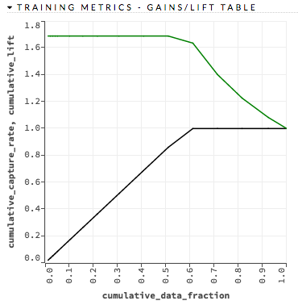

**Note**: During the Gains/Lift calculations, all rows containing missing values ("NAs") in either the label (response) or the prediction probability are ignored. 

In addition to the chart, a Gains/Lift table is also available. This table reports the following for each group:

- Threshold probability value
- Cumulative data fractions
- Response rates (proportion of observations that are events in a group)
- Cumulative response rate
- Event capture rate
- Cumulative capture rate
- Gain (difference in percentages between the overall proportion of events and the observed proportion of observations that are events in the group)
- Cumulative gain

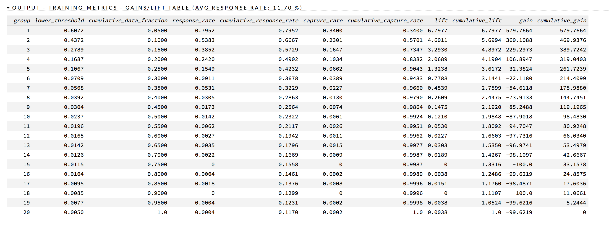

The *response_rate* column lists the likelihood of response, the *lift* column lists the lift rate, and the *cumulative_lift* column provides the percentage of increase in response based on the lift.

--------------

Frames
--------------

An H2O frame represents a 2D array of data. The data may be local or it may be distributed in an H2O cluster. 

Creating Frames
^^^^^^^^^^^^^^^

To create a frame with a large amount of random data (for example, to use for testing), click the drop-down **Admin** menu, then select **Create Synthetic Frame**. Customize the frame as needed, then click the **Create** button to create the frame. 

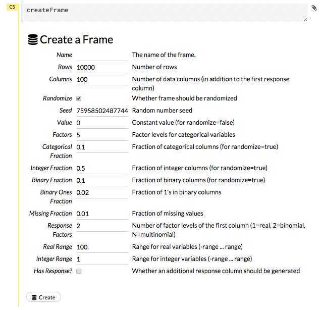

Viewing Frames
^^^^^^^^^^^^^^

To view a specific frame, click the "Key" link for the specified frame, or enter ``getFrameSummary "FrameName"`` in a cell in CS mode (where ``FrameName`` is the name of a frame, such as ``allyears2k.hex``).

.. figure:: images/Flow_getFrame.png
   :alt: Viewing specified frame

From the ``getFrameSummary`` cell, you can:

-  View a truncated list of the rows in the data frame by clicking the **View Data** button
-  Split the dataset by clicking the **Split...** button
-  View the columns, data, and factors in more detail or plot a graph by clicking the **Inspect** button
-  Create a model by clicking the **Build Model** button
-  Make a prediction based on the data by clicking the **Predict** button
-  Download the data as a .csv file by clicking the **Download** button
-  View the characteristics or domain of a specific column by clicking the **Summary** link

When you view a frame, you can "drill-down" to the necessary level of detail (such as a specific column or row) using the **Inspect** button or by clicking the links. The following screenshot displays the results of clicking the **Inspect** button for a frame.

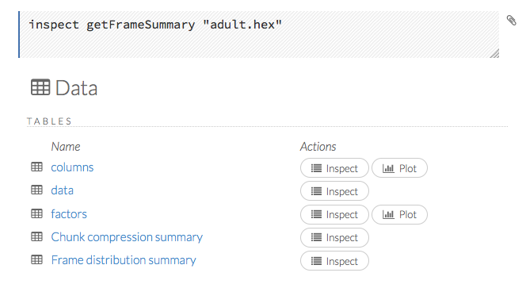

This screenshot displays the results of clicking the **columns** link.

.. figure:: images/Flow_inspectCol.png
   :alt: Inspecting Columns

To view all frames, click the **Assist Me!** button, then click the **getFrames** link, or enter ``getFrames`` in the cell in CS mode and press **Ctrl+Enter**. You can also view all current frames by clicking the drop-down **Data** menu and selecting **List All Frames**.

A list of the current frames in H2O displays that includes the following information for each frame:

-  Link to the frame (the "key")
-  Number of rows and columns
-  Size

For parsed data, the following information displays:

-  Link to the .hex file
-  The **Build Model**, **Predict**, and **Inspect** buttons

.. figure:: images/Flow_getFrames.png
   :alt: Parsed Frames

To make a prediction, check the checkboxes for the frames you want to use to make the prediction, then click the **Predict on Selected Frames** button.

--------------

Splitting Frames
^^^^^^^^^^^^^^^^

Datasets can be split within Flow for use in model training and testing.

.. figure:: images/Flow_splitFrame.png
   :alt: splitFrame cell

1. To split a frame, click the **Assist Me** button, then click **splitFrame**.

  **Note**: You can also click the drop-down **Data** menu and select **Split Frame...**. 
  
2. From the drop-down **Frame:** list, select the frame to split. 

3. In the second **Ratio** entry field, specify the fractional value to determine the split. The first **Ratio** field is automatically calculated based on the values entered in the second **Ratio** field.

  **Note**: Only fractional values between 0 and 1 are supported (for example, enter ``.5`` to split the frame in half). The total sum of the ratio values must equal one. H2O automatically adjusts the ratio values to equal one; if unsupported values are entered, an error displays.

4. In the **Key** entry field, specify a name for the new frame. 

5. (Optional) To add another split, click the **Add a split** link. To remove a split, click the ``X`` to the right of the **Key** entry field. 

6. Click the **Create** button.

Plotting Frames
^^^^^^^^^^^^^^^

To create a plot from a frame, click the **Inspect** button, then click the **Plot** button for columns or factors. Note that from this section, you can also inspect the **Chunk compression summary** and the **Frame distribution summary**.  

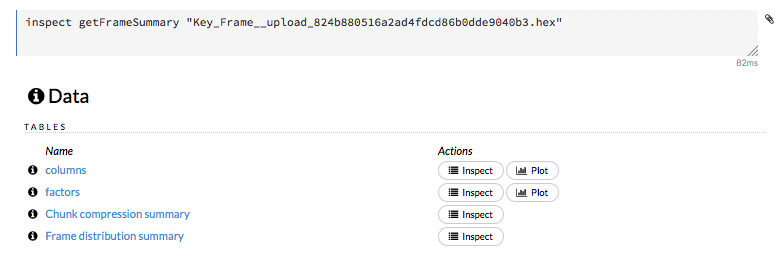

1. Select the type of plot from the **Type** menu

	- plot: Creates a graph with a series of plot points.
	- path: Creates a line graph connecting plot points.
	- rect: Creates a bar graph. Note that with rect graphs, you cannot specify values of the same type. You will receive an error if you attempt to specify, for example, two String columns or two Number columns.  

2. Specify the information that you want to view on the X axis and on the Y axis. Select from the following options below. These options correspond to the parsed data file. 

	-  label: Plots the column headings
	-  type: Plots real vs. enum values
	-  Missing: Plots missing values
	-  Zeros: Plots ``0`` values
	-  +Inf: Plots positiive ``inf`` values
	-  -Inf: Plots negative ``inf`` values
	-  min: Plots the min value
	-  max: Plots the max value
	-  mean: Plots the mean value
	-  sigma: Plots the sigma value
	-  cardinality: Plots the cardinality. Used with enum values.
	-  Actions: Plots actions (for example, "convert to numeric".)

3. Select one of the above options from the drop-down **Color** menu to display the specified data in color. 

4. click the **Plot** button to plot the data.

.. figure:: images/Flow_plot.png
   :alt: Flow - Plotting Frames

**Note**: Because H2O stores enums internally as numeric then maps the integers to an array of strings, any ``min``, ``max``, or ``mean`` values for categorical columns are not meaningful and should be ignored. Displays for categorical data will be modified in a future version of H2O.

--------------

Shutting Down H2O
^^^^^^^^^^^^^^^^^

To shut down H2O, click the **Admin** menu, then click **Shut Down**. A *Shut down complete* message displays in the upper right when the cluster has been shut down.

--------------

Troubleshooting Flow
--------------------

To troubleshoot issues in Flow, use the **Admin** menu. The **Admin** menu allows you to check the status of the cluster, view a timeline of events, and view or download logs for issue analysis.

**Note**: To view the current H2O Flow version, click the **Help** menu, then click **About**.

Viewing Cluster Status
^^^^^^^^^^^^^^^^^^^^^^

Click the **Admin** menu, then select **Cluster Status**. A summary of the status of the cluster (also known as a cloud) displays, which includes the same information:

-  Cluster health
-  Whether all nodes can communicate (consensus)
-  Whether new nodes can join (locked/unlocked) **Note**: After you submit a job to H2O, the cluster does not accept new nodes. 
- H2O version 
- Number of used and available nodes 
- When the cluster was created

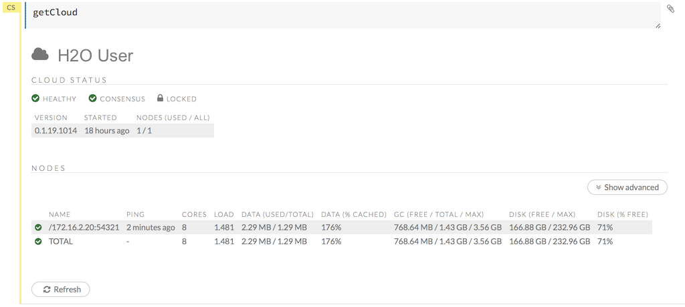

The following information displays for each node:

-  IP address (name)
-  Time of last ping
-  Number of cores
-  Load
-  Amount of data (used/total)
-  Percentage of cached data
-  GC (free/total/max)
-  Amount of disk space in GB (free/max)
-  Percentage of free disk space

To view more information, click the **Show Advanced** button.

--------------

Viewing CPU Status (Water Meter)
^^^^^^^^^^^^^^^^^^^^^^^^^^^^^^^^

To view the current CPU usage, click the **Admin** menu, then click **Water Meter (CPU Meter)**. A new window opens, displaying the current CPU use statistics.

--------------

Viewing Logs
^^^^^^^^^^^^

To view the logs for troubleshooting, click the **Admin** menu, then click **Inspect Log**.

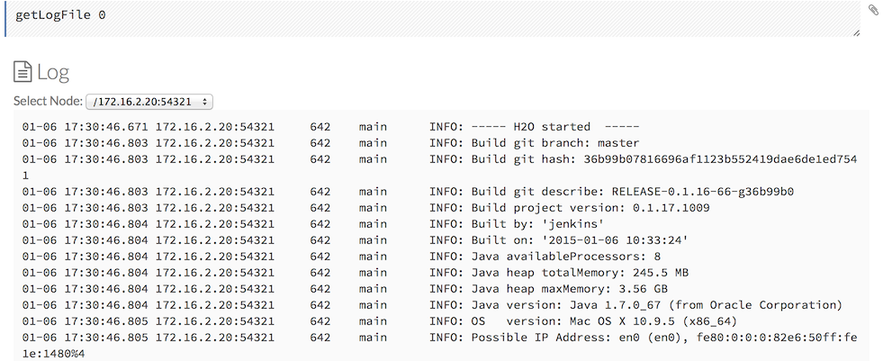

To view the logs for a specific node, select it from the drop-down **Select Node** menu.

--------------

Downloading Logs
^^^^^^^^^^^^^^^^

To download the logs for further analysis, click the **Admin** menu, then click **Download Log**. A new window opens and the logs download to your default download folder. You can close the new window after downloading the logs. Send the logs to `h2ostream <mailto:h2ostream@googlegroups.com>`__ or file a JIRA ticket for issue resolution. (Refer to `Reporting Issues`_.)

--------------

Viewing Stack Trace Information
^^^^^^^^^^^^^^^^^^^^^^^^^^^^^^^

To view the stack trace information, click the **Admin** menu, then click **Stack Trace**.

.. figure:: images/Flow_stacktrace.png
   :alt: Stack Trace

To view the stack trace information for a specific node, select it from the drop-down **Select Node** menu.

--------------

Viewing Network Test Results
^^^^^^^^^^^^^^^^^^^^^^^^^^^^

To view network test results, click the **Admin** menu, then click **Network Test**.

.. figure:: images/Flow_NetworkTest.png
   :alt: Network Test Results

--------------

Accessing the Profiler
^^^^^^^^^^^^^^^^^^^^^^

The Profiler looks across the cluster to see where the same stack trace occurs, and can be helpful for identifying activity on the current CPU. To view the profiler, click the **Admin** menu, then click **Profiler**.

.. figure:: images/Flow_profiler.png
   :alt: Profiler

To view the profiler information for a specific node, select it from the drop-down **Select Node** menu.

--------------

Viewing the Timeline
^^^^^^^^^^^^^^^^^^^^

To view a timeline of events in Flow, click the **Admin** menu, then click **Timeline**. The following information displays for each event:

-  Time of occurrence (HH:MM:SS:MS)
-  Number of nanoseconds for duration
-  Originator of event ("who")
-  I/O type
-  Event type
-  Number of bytes sent & received

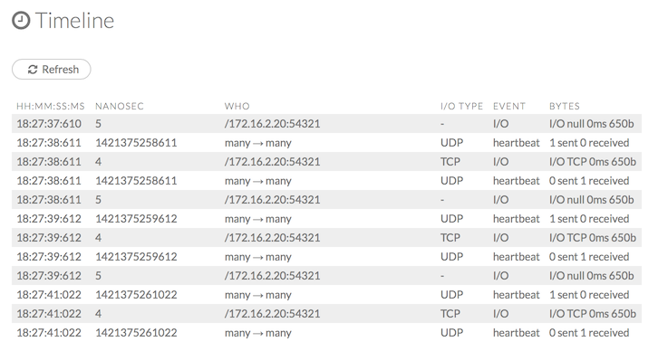

To obtain the most recent information, click the **Refresh** button.

--------------

Reporting Issues
^^^^^^^^^^^^^^^^

If you experience an error with Flow, you can submit a JIRA ticket to notify our team.

1. First, click the **Admin** menu, then click **Download Logs**. This will download a file contains information that will help our developers identify the cause of the issue.
2. Click the **Help** menu, then click **Report an issue**. This will open our JIRA page where you can file your ticket.
3. Click the **Create** button at the top of the JIRA page.
4. Attach the log file from the first step, write a description of the error you experienced, then click the **Create** button at the bottom of the page. Our team will work to resolve the issue and you can track the progress of your ticket in JIRA.

--------------

Requesting Help
^^^^^^^^^^^^^^^

If you have questions or ideas to share, please post them to the `H2O community site on Stack Overflow <http://stackoverflow.com/questions/tagged/h2o>`__.

If you have a Google account, you can submit a request for assistance with H2O on our Google Groups page, `H2Ostream <https://groups.google.com/forum/#!forum/h2ostream>`__.

To access H2Ostream from Flow:

1. Click the **Help** menu.
2. Click **Forum/Ask a question**.
3. Click the red **New topic** button.
4. Enter your question and click the red **Post** button. If you are requesting assistance for an error you experienced, be sure to include your logs. (Refer to `Downloading Logs`_.)

You can also email your question to h2ostream@googlegroups.com.

.. |Flow - Display Sidebar| image:: images/Flow_SidebarDisplay.png
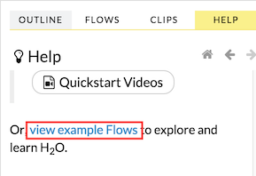

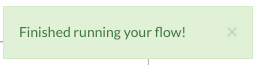
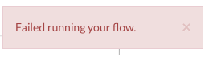
.. |Flow variable definition| image:: images/Flow_VariableDefinition.png
.. |Flow variable validation| image:: images/Flow_VariableValidation.png
.. |Flow variable example| image:: images/Flow_VariableExample.png
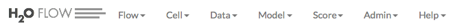
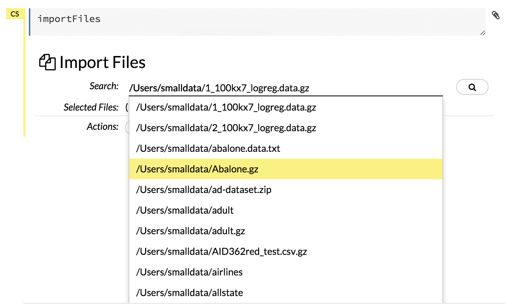
.. |Import Files| image:: images/Flow_import.png
.. |Paperclip icon| image:: images/Flow_clips_paperclip.png

