#Flow Web UI ...

H2O Flow is an open-source user interface for H2O. It is a web-based interactive environment that allows you to combine code execution, text, mathematics, plots, and rich media in a single document. 

With H2O Flow, you can capture, rerun, annotate, present, and share your workflow. H2O Flow allows you to use H2O interactively to import files, build models, and iteratively improve them. Based on your models, you can make predictions and add rich text to create vignettes of your work - all within Flow's browser-based environment. 

Flow's hybrid user interface seamlessly blends command-line computing with a modern graphical user interface. However, rather than displaying output as plain text, Flow provides a point-and-click user interface for every H2O operation. It allows you to access any H2O object in the form of well-organized tabular data. 

H2O Flow sends commands to H2O as a sequence of executable cells. The cells can be modified, rearranged, or saved to a library. Each cell contains an input field that allows you to enter commands, define functions, call other functions, and access other cells or objects on the page. When you execute the cell, the output is a graphical object, which can be inspected to view additional details. 

While H2O Flow supports REST API, R scripts, and CoffeeScript, no programming experience is required to run H2O Flow. You can click your way through any H2O operation without ever writing a single line of code. You can even disable the input cells to run H2O Flow using only the GUI. H2O Flow is designed to guide you every step of the way, by providing input prompts, interactive help, and example flows. 

##Introduction

This guide will walk you through how to use H2O's web UI, H2O Flow. To view a demo video of H2O Flow, click <a href="https://www.youtube.com/watch?feature=player_embedded&v=wzeuFfbW7WE" target="_blank">here</a>. 


---

<a name="GetHelp"></a> 
## Getting Help 
---

First, let's go over the basics. Type `h` to view a list of helpful shortcuts. 

The following help window displays: 


To close this window, click the **X** in the upper-right corner, or click the **Close** button in the lower-right corner. You can also click behind the window to close it. You can also access this list of shortcuts by clicking the **Help** menu and selecting **Keyboard Shortcuts**. 

For additional help, click **Help** > **Assist Me** or click the **Assist Me!** button in the row of buttons below the menus. 

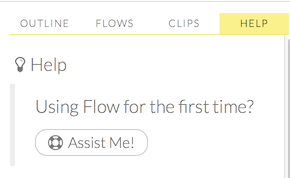 

You can also type `assist` in a blank cell and press **Ctrl+Enter**. A list of common tasks displays to help you find the correct command. 

 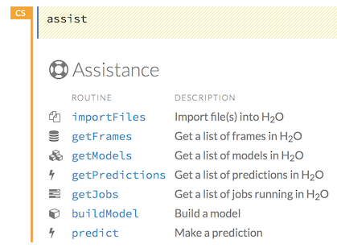
 
There are multiple resources to help you get started with Flow in the **Help** sidebar. 

>**Note**: To hide the sidebar, click the **>>** button above it. 
>
>To display the sidebar if it is hidden, click the **<<** button. 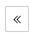

To access this documentation, select the **Flow Web UI...** link below the **General** heading in the Help sidebar. 

You can also explore the pre-configured flows available in H2O Flow for a demonstration of how to create a flow. To view the example flows:

- Click the **view example Flows** link below the **Quickstart Videos** button in the **Help** sidebar 
  
 
   or 

- Click the **Browse installed packs...** link in the **Packs** subsection of the **Help** sidebar. Click the **examples** folder and select the example flow from the list. 

  

If you have a flow currently open, a confirmation window appears asking if the current notebook should be replaced. To load the example flow, click the **Load Notebook** button. 

To view the REST API documentation, click the **Help** tab in the sidebar and then select the type of REST API documentation (**Routes** or **Schemas**). 

 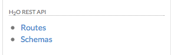

Before getting started with H2O Flow, make sure you understand the different cell modes. Certain actions can only be performed when the cell is in a specific mode. 

---

<a name="Cell"></a>
## Understanding Cell Modes

There are two modes for cells: edit and command. 

<a name="EditMode"></a>
###Using Edit Mode
In edit mode, the cell is yellow with a blinking bar to indicate where text can be entered and there is an orange flag to the left of the cell.


 
<a name="CmdMode"></a>
###Using Command Mode
 In command mode, the flag is yellow. The flag also indicates the cell's format: 

- **MD**: Markdown 
   
   >**Note**: Markdown formatting is not applied until you run the cell by:
   > 
   >- clicking the **Run** button 
        > or
      
   >- pressing **Ctrl+Enter**

 

- **CS**: Code (default)

 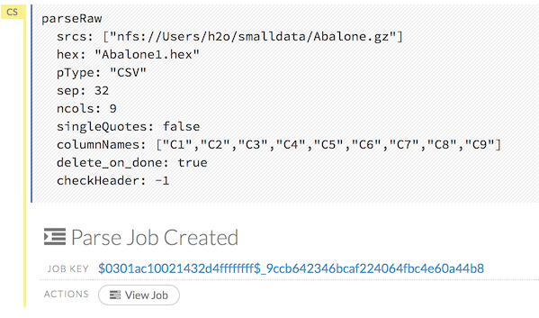

- **RAW**: Raw format (for code comments) 

 

- **H[1-6]**: Heading level (where 1 is a first-level heading) 

 

>**NOTE**: If there is an error in the cell, the flag is red. 

 
 
 If the cell is executing commands, the flag is teal. The flag returns to yellow when the task is complete. 
 
 

###Changing Cell Formats

To change the cell's format (for example, from code to Markdown), make sure you are in command (not edit) mode and that the cell you want to change is selected. The easiest way to do this is to click on the flag to the left of the cell. Enter the keyboard shortcut for the format you want to use. The flag's text changes to display the current format. 

Cell Mode     | Keyboard Shortcut
------------- | -----------------
Code          | `y`
Markdown      | `m`
Raw text      | `r`
Heading 1     | `1`
Heading 2     | `2`
Heading 3     | `3` 
Heading 4     | `4` 
Heading 5     | `5`
Heading 6     | `6` 


###Running Cells


The series of buttons at the top of the page below the menus run cells in a flow. 
 
 

- To run all cells in the flow, click the **Flow** menu, then click **Run All Cells**. 
- To run the current cell and all subsequent cells, click the **Flow** menu, then click **Run All Cells Below**. 
- To run an individual cell in a flow, confirm the cell is in [Edit Mode](#EditMode), then: 

 - press **Ctrl+Enter**

     or
  
 - click the **Run** button 


###Running Flows
When you run the flow, a progress bar indicates the current status of the flow. You can cancel the currently running flow by clicking the **Stop** button in the progress bar. 

  

When the flow is complete, a message displays in the upper right.

  
   
 
>**Note**: If there is an error in the flow, H2O Flow stops at the cell that contains the error. 


###Using Keyboard Shortcuts

Here are some important keyboard shortcuts to remember: 

- Click a cell and press **Enter** to enter edit mode, which allows you to change the contents of a cell. 
- To exit edit mode, press **Esc**. 
- To execute the contents of a cell, press the **Ctrl** and **Enter** buttons at the same time.

The following commands must be entered in [command mode](#CmdMode).  

- To add a new cell *above* the current cell, press **a**. 
- To add a new cell *below* the current cell, press **b**. 
- To delete the current cell, press the **d** key *twice*. (**dd**). 

You can view these shortcuts by clicking **Help** > **Keyboard Shortcuts** or by clicking the **Help** tab in the sidebar. 

###Using Variables in Cells

Variables can be used to store information such as download locations. To use a variable in Flow: 

0. Define the variable in a code cell (for example, `locA = "https://h2o-public-test-data.s3.amazonaws.com/bigdata/laptop/kdd2009/small-churn/kdd_train.csv"`). 
  
0. Run the cell. H2O validates the variable. 
  
0. Use the variable in another code cell (for example, `importFiles [locA]`). 
  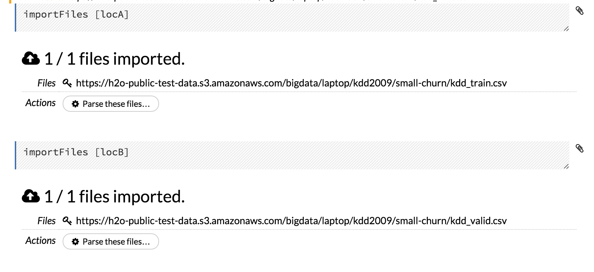
To further simplify your workflow, you can save the cells containing the variables and definitions as [clips](#Clips). 


###Using Flow Buttons
There are also a series of buttons at the top of the page below the flow name that allow you to save the current flow, add a new cell, move cells up or down, run the current cell, and cut, copy, or paste the current cell. If you hover over the button, a description of the button's function displays. 

 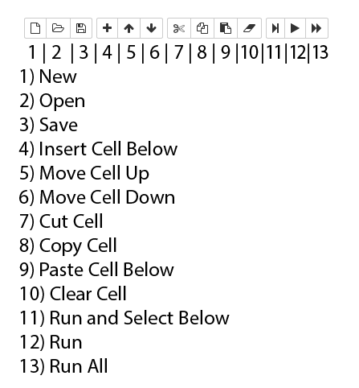
 
You can also use the menus at the top of the screen to edit the order of the cells, toggle specific format types (such as input or output), create models, or score models. You can also access troubleshooting information or obtain help with Flow.  
 

>**Note**: To disable the code input and use H2O Flow strictly as a GUI, click the **Cell** menu, then **Toggle Cell Input**. 

Now that you are familiar with the cell modes, let's import some data. 

---

<a name="ImportData"></a>
# ... Importing Data

If you don't have any data of your own to work with, you can find some example datasets here: 

- <a href="http://docs.h2o.ai/h2oclassic/resources/publicdata.html"  target="_blank">http://docs.h2o.ai/h2oclassic/resources/publicdata.html </a>
- <a href="http://data.h2o.ai" target="_blank">http://data.h2o.ai</a>


There are multiple ways to import data in H2O flow:

- Click the **Assist Me!** button in the row of buttons below the menus, then click the **importFiles** link. Enter the file path in the auto-completing **Search** entry field and press **Enter**. Select the file from the search results and confirm it by clicking the **Add All** link.
 
 
- In a blank cell, select the CS format, then enter `importFiles ["path/filename.format"]` (where `path/filename.format` represents the complete file path to the file, including the full file name. The file path can be a local file path or a website address. 

After selecting the file to import, the file path displays in the "Search Results" section. To import a single file, click the plus sign next to the file. To import all files in the search results, click the **Add all** link. The files selected for import display in the "Selected Files" section. 

>**Note**: If the file is compressed, it will only be read using a single thread. For best performance, we recommend uncompressing the file before importing, as this will allow use of the faster multithreaded distributed parallel reader during import. Please note that .zip files containing multiple files are not currently supported. 


- To import the selected file(s), click the **Import** button. 

- To remove all files from the "Selected Files" list, click the **Clear All** link. 

- To remove a specific file, click the **X** next to the file path. 

After you click the **Import** button, the raw code for the current job displays. A summary displays the results of the file import, including the number of imported files and their Network File System (nfs) locations. 

 

##Uploading Data

To upload a local file, click the **Data** menu and select **Upload File...**. Click the **Choose File** button, select the file, click the **Choose** button, then click the **Upload** button. 
  
  
  
  When the file has uploaded successfully, a message displays in the upper right and the **Setup Parse** cell displays. 

  
  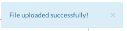

Ok, now that your data is available in H2O Flow, let's move on to the next step: parsing. Click the **Parse these files** button to continue. 

---

<a name="ParseData"></a>
##Parsing Data

After you have imported your data, parse the data.

 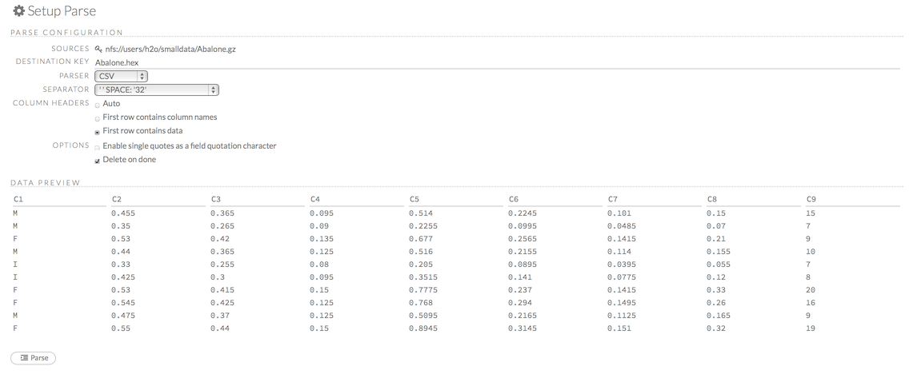

The read-only **Sources** field displays the file path for the imported data selected for parsing. 

The **ID** contains the auto-generated name for the parsed data (by default, the file name of the imported file with `.hex` as the file extension). Use the default name or enter a custom name in this field. 

Select the parser type (if necessary) from the drop-down **Parser** list. For most data parsing, H2O automatically recognizes the data type, so the default settings typically do not need to be changed. The following options are available: 

- Auto
- ARFF
- XLS
- XLSX
- CSV
- SVMLight

   >**Note**: For SVMLight data, the column indices must be >= 1 and the columns must be in ascending order. 

If a separator or delimiter is used, select it from the **Separator** list. 

Select a column header option, if applicable: 

- **Auto**: Automatically detect header types.
- **First row contains column names**: Specify heading as column names.
- **First row contains data**: Specify heading as data. This option is selected by default.

Select any necessary additional options: 

- **Enable single quotes as a field quotation character**: Treat single quote marks (also known as apostrophes) in the data as a character, rather than an enum. This option is not selected by default. 
- **Delete on done**: Check this checkbox to delete the imported data after parsing. This option is selected by default. 

A preview of the data displays in the "Edit Column Names and Types" section. 


To change or add a column name, edit or enter the text in the column's entry field. In the screenshot below, the entry field for column 16 is highlighted in red.  
  
 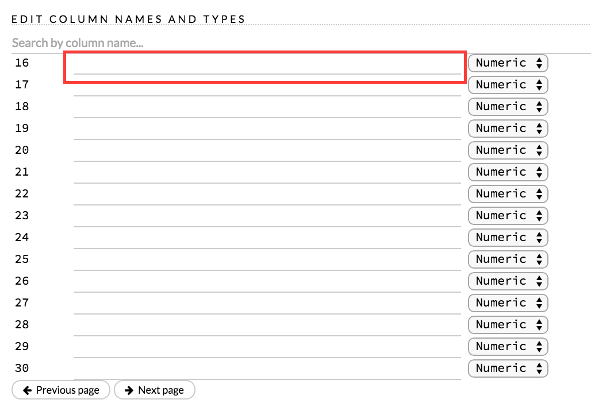

To change the column type, select the drop-down list to the right of the column name entry field and select the data type. The options are: 
  
  - Unknown
  - Numeric
  - Enum
  - Time
  - UUID
  - String
  - Invalid

You can search for a column by entering it in the *Search by column name...* entry field above the first column name entry field. As you type, H2O displays the columns that match the specified search terms.

**Note**: Only custom column names are searchable. Default column names cannot be searched. 

To navigate the data preview, click the **<- Previous page** or **-> Next page** buttons.  

  

After making your selections, click the **Parse** button. 

After you click the **Parse** button, the code for the current job displays. 

 
 
Since we've submitted a couple of jobs (data import & parse) to H2O now, let's take a moment to learn more about jobs in H2O.  
 
--- 
 
<a name="ViewJobs"></a>
## Viewing Jobs

Any command (such as `importFiles`) you enter in H2O is submitted as a job, which is associated with a key. The key identifies the job within H2O and is used as a reference.

### Viewing All Jobs

To view all jobs, click the **Admin** menu, then click **Jobs**, or enter `getJobs` in a cell in CS mode. 

 

The following information displays: 

- Type (for example, `Frame` or `Model`)
- Link to the object 
- Description of the job type (for example, `Parse` or `GBM`)
- Start time
- End time
- Run time

To refresh this information, click the **Refresh** button. To view the details of the job, click the **View** button. 

### Viewing Specific Jobs

To view a specific job, click the link in the "Destination" column. 

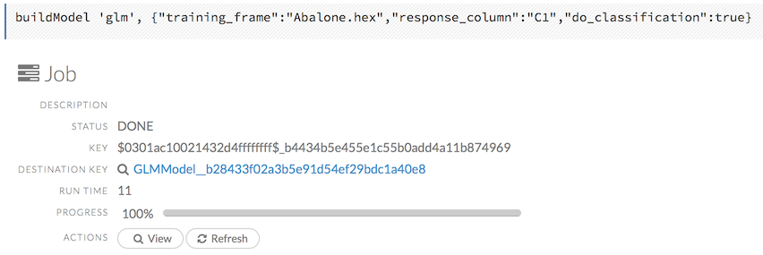

The following information displays: 

- Type (for example, `Frame`)
- Link to object (key)
- Description (for example, `Parse`)
- Status
- Run time
- Progress

>**NOTE**: For a better understanding of how jobs work, make sure to review the [Viewing Frames](#ViewFrames) section as well. 
 
Ok, now that you understand how to find jobs in H2O, let's submit a new one by building a model. 

---

<a name="BuildModel"></a>
# ... Building Models

To build a model: 

- Click the **Assist Me!** button in the row of buttons below the menus and select **buildModel**

  or 

- Click the **Assist Me!** button, select **getFrames**, then click the **Build Model...** button below the parsed .hex data set

  or 

- Click the **View** button after parsing data, then click the **Build Model** button

  or 

- Click the drop-down **Model** menu and select the model type from the list


The **Build Model...** button can be accessed from any page containing the .hex key for the parsed data (for example, `getJobs` > `getFrame`). The following image depicts the K-Means model type. Available options vary depending on model type. 


 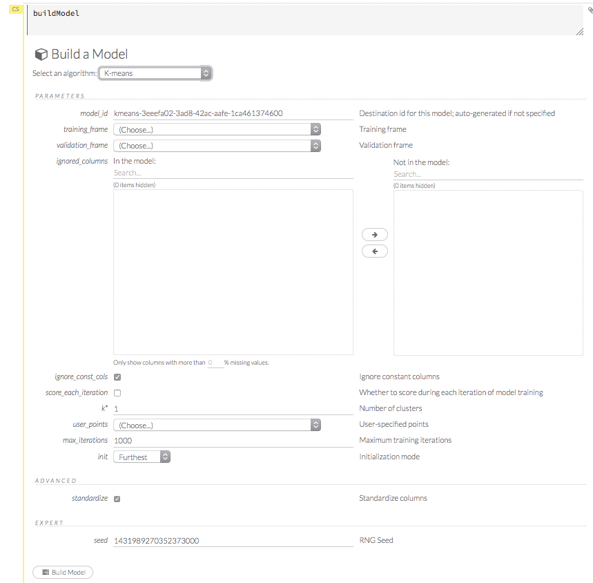

 
In the **Build a Model** cell, select an algorithm from the drop-down menu: 

<a name="Kmeans"></a>
- **K-means**: Create a K-Means model.

<a name="GLM"></a>
- **Generalized Linear Model**: Create a Generalized Linear model.

<a name="DRF"></a>
- **Distributed RF**: Create a distributed Random Forest model.  

<a name="NB"></a>
- **Naïve Bayes**: Create a Naïve Bayes model. 

<a name="PCA"></a> 
- **Principal Component Analysis**: Create a Principal Components Analysis model for modeling without regularization or performing dimensionality reduction. 

<a name="GBM"></a>
- **Gradient Boosting Machine**: Create a Gradient Boosted model

<a name="DL"></a>
- **Deep Learning**: Create a Deep Learning model.


The available options vary depending on the selected model. If an option is only available for a specific model type, the model type is listed. If no model type is specified, the option is applicable to all model types. 

- **model_id**: (Optional) Enter a custom name for the model to use as a reference. By default, H2O automatically generates an ID containing the model type (for example, `gbm-6f6bdc8b-ccbc-474a-b590-4579eea44596`). 

- **training_frame**: (Required) Select the dataset used to build the model. 

- **validation_frame**: (Optional) Select the dataset used to evaluate the accuracy of the model. 

- **nfolds**: ([GLM](#GLM), [GBM](#GBM), [DL](#DL), [DRF](#DRF)) Specify the number of folds for cross-validation. 

- **response_column**: (Required for [GLM](#GLM), [GBM](#GBM), [DL](#DL), [DRF](#DRF), [Naïve Bayes](#NB)) Select the column to use as the independent variable.

- **ignored_columns**: (Optional) Click the checkbox next to a column name to add it to the list of columns excluded from the model. To add all columns, click the **All** button. To remove a column from the list of ignored columns, click the X next to the column name. To remove all columns from the list of ignored columns, click the **None** button. To search for a specific column, type the column name in the **Search** field above the column list. To only show columns with a specific percentage of missing values, specify the percentage in the **Only show columns with more than 0% missing values** field. To change the selections for the hidden columns, use the **Select Visible** or **Deselect Visible** buttons. 

- **ignore\_const\_cols**: (Optional) Check this checkbox to ignore constant training columns, since no information can be gained from them. This option is selected by default. 

- **transform**: ([PCA](#PCA)) Select the transformation method for the training data: None, Standardize, Normalize, Demean, or Descale.  

- **pca_method**: ([PCA](#PCA)) Select the algorithm to use for computing the principal components: 
	- *GramSVD*: Uses a distributed computation of the Gram matrix, followed by a local SVD using the JAMA package
	- *Power*: Computes the SVD using the power iteration method
	- *Randomized*: Uses randomized subspace iteration method 
	- *GLRM*: Fits a generalized low-rank model with L2 loss function and no regularization and solves for the SVD using local matrix algebra

- **family**: ([GLM](#GLM)) Select the model type (Gaussian, Binomial, Poisson, Gamma, or Tweedie).

- **solver**: ([GLM](#GLM)) Select the solver to use (AUTO, IRLSM, L\_BFGS, COORDINATE\_DESCENT\_NAIVE, or COORDINATE\_DESCENT). IRLSM is fast on on problems with a small number of predictors and for lambda-search with L1 penalty, while [L_BFGS](http://cran.r-project.org/web/packages/lbfgs/vignettes/Vignette.pdf) scales better for datasets with many columns. COORDINATE\_DESCENT is IRLSM with the covariance updates version of cyclical coordinate descent in the innermost loop. COORDINATE\_DESCENT\_NAIVE is IRLSM with the naive updates version of cyclical coordinate descent in the innermost loop. COORDINATE\_DESCENT\_NAIVE and COORDINATE\_DESCENT are currently experimental. 

- **link**: ([GLM](#GLM)) Select a link function (Identity, Family_Default, Logit, Log, Inverse, or Tweedie).

- **alpha**: ([GLM](#GLM)) Specify the regularization distribution between L2 and L2.  

- **lambda**: ([GLM](#GLM)) Specify the regularization strength.  

- **lambda_search**: ([GLM](#GLM)) Check this checkbox to enable lambda search, starting with lambda max. The given lambda is then interpreted as lambda min. 

- **non-negative**: ([GLM](#GLM)) To force coefficients to be non-negative, check this checkbox. 

- **standardize**: ([K-Means](#Kmeans), [GLM](#GLM)) To standardize the numeric columns to have mean of zero and unit variance, check this checkbox. Standardization is highly recommended; if you do not use standardization, the results can include components that are dominated by variables that appear to have larger variances relative to other attributes as a matter of scale, rather than true contribution. This option is selected by default. 

- **beta_constraints**: ([GLM](#GLM)) To use beta constraints, select a dataset from the drop-down menu. The selected frame is used to constraint the coefficient vector to provide upper and lower bounds. 

- **ntrees**: ([GBM](#GBM), [DRF](#DRF)) Specify the number of trees.  

- **max\_depth**: ([GBM](#GBM), [DRF](#DRF)) Specify the maximum tree depth.  

- **min\_rows**: ([GBM](#GBM), [DRF](#DRF)) Specify the minimum number of observations for a leaf ("nodesize" in R). 

- **nbins**: ([GBM](#GBM), [DRF](#DRF)) (Numerical [real/int] only) Specify the minimum number of bins for the histogram to build, then split at the best point.   

- **nbins_cats**: ([GBM](#GBM), [DRF](#DRF)) (Categorical [factors/enums] only) Specify the maximum number of bins for the histogram to build, then split at the best point. Higher values can lead to more overfitting.  The levels are ordered alphabetically; if there are more levels than bins, adjacent levels share bins. This value has a more significant impact on model fitness than **nbins**. Larger values may increase runtime, especially for deep trees and large clusters, so tuning may be required to find the optimal value for your configuration. 

- **learn_rate**: ([GBM](#GBM)) Specify the learning rate. The range is 0.0 to 1.0. 

- **distribution**: ([GBM](#GBM), [DL](#DL)) Select the distribution type from the drop-down list. The options are auto, bernoulli, multinomial, gaussian, poisson, gamma, or tweedie.

- **sample_rate**: ([GBM](#GBM)) Specify the row sampling rate (x-axis). The range is 0.0 to 1.0. Higher values may improve training accuracy. Test accuracy improves when either columns or rows are sampled. For details, refer to "Stochastic Gradient Boosting" ([Friedman, 1999](https://statweb.stanford.edu/~jhf/ftp/stobst.pdf)). 

- **col\_sample_rate**: ([GBM](#GBM)) Specify the column sampling rate (y-axis). The range is 0.0 to 1.0. Higher values may improve training accuracy. Test accuracy improves when either columns or rows are sampled. For details, refer to "Stochastic Gradient Boosting" ([Friedman, 1999](https://statweb.stanford.edu/~jhf/ftp/stobst.pdf)). 

- **mtries**: ([DRF](#DRF)) Specify the columns to randomly select at each level. If the default value of `-1` is used, the number of variables is the square root of the number of columns for classification and p/3 for regression (where p is the number of predictors).   
   
- **sample\_rate**: ([DRF](#DRF)) Specify the sample rate. The range is 0 to 1.0. 

- **binomial\_double\_trees**: ([DRF](#DRF)) (Binary classification only) Build twice as many trees (one per class). Enabling this option can lead to higher accuracy, while disabling can result in faster model building. This option is disabled by default. 

- **score\_each\_iteration**: ([K-Means](#Kmeans), [DRF](#DRF), [Naïve Bayes](#NB), [PCA](#PCA), [GBM](#GBM), [GLM](#GLM)) To score during each iteration of the model training, check this checkbox. 

- **k***: ([K-Means](#Kmeans), [PCA](#PCA)) For K-Means, specify the number of clusters. For PCA, specify the rank of matrix approximation.  

- **user_points**: ([K-Means](#Kmeans)) For K-Means, specify the number of initial cluster centers.  


- **max_iterations**: ([K-Means](#Kmeans), [PCA](#PCA), [GLM](#GLM)) Specify the number of training iterations. 

- **init**: ([K-Means](#Kmeans)) Select the initialization mode. The options are Furthest, PlusPlus, Random, or User. 

  >**Note**: If PlusPlus is selected, the initial Y matrix is chosen by the final cluster centers from the K-Means PlusPlus algorithm. 

- **tweedie_variance_power**: ([GLM](#GLM)) (Only applicable if *Tweedie* is selected for **Family**) Specify the Tweedie variance power. 

- **tweedie_link_power**: ([GLM](#GLM)) (Only applicable if *Tweedie* is selected for **Family**) Specify the Tweedie link power. 

- **activation**: ([DL](#DL)) Select the activation function (Tanh, TanhWithDropout, Rectifier, RectifierWithDropout, Maxout, MaxoutWithDropout). The default option is Rectifier. 

- **hidden**: ([DL](#DL)) Specify the hidden layer sizes (e.g., 100,100). For Grid Search, use comma-separated values: (10,10),(20,20,20). The default value is [200,200]. The specified value(s) must be positive. 

- **epochs**: ([DL](#DL)) Specify the number of times to iterate (stream) the dataset. The value can be a fraction.  

- **variable_importances**: ([DL](#DL)) Check this checkbox to compute variable importance. This option is not selected by default. 

- **laplace**: ([Naïve Bayes](#NB)) Specify the Laplace smoothing parameter. 

- **min\_sdev**: ([Naïve Bayes](#NB)) Specify the minimum standard deviation to use for observations without enough data.  

- **eps\_sdev**: ([Naïve Bayes](#NB)) Specify the threshold for standard deviation. If this threshold is not met, the **min\_sdev** value is used.  

- **min\_prob**: ([Naïve Bayes](#NB)) Specify the minimum probability to use for observations without enough data.  

- **eps\_prob**: ([Naïve Bayes](#NB)) Specify the threshold for standard deviation. If this threshold is not met, the **min\_sdev** value is used. 

- **compute_metrics**: ([Naïve Bayes](#NB)) To compute metrics on training data, check this checkbox. The Naïve Bayes classifier assumes independence between predictor variables conditional on the response, and a Gaussian distribution of numeric predictors with mean and standard deviation computed from the training dataset. When building a Naïve Bayes classifier, every row in the training dataset that contains at least one NA will be skipped completely. If the test dataset has missing values, then those predictors are omitted in the probability calculation during prediction. 

**Advanced Options**

- **fold_assignment**: ([GLM](#GLM), [GBM](#GBM), [DL](#DL), [DRF](#DRF)) (Applicable only if a value for **nfolds** is specified and **fold_column** is not selected) Select the cross-validation fold assignment scheme. The available options are Random or [Modulo](https://en.wikipedia.org/wiki/Modulo_operation). 

- **fold_column**: ([GLM](#GLM), [GBM](#GBM), [DL](#DL), [DRF](#DRF)) Select the column that contains the cross-validation fold index assignment per observation. 

- **offset_column**: ([GLM](#GLM), [DRF](#DRF), [GBM](#GBM))  Select a column to use as the offset. 
	>*Note*: Offsets are per-row "bias values" that are used during model training. For Gaussian distributions, they can be seen as simple corrections to the response (y) column. Instead of learning to predict the response (y-row), the model learns to predict the (row) offset of the response column. For other distributions, the offset corrections are applied in the linearized space before applying the inverse link function to get the actual response values. For more information, refer to the following [link](http://www.idg.pl/mirrors/CRAN/web/packages/gbm/vignettes/gbm.pdf). 

- **weights_column**: ([GLM](#GLM), [DL](#DL), [DRF](#DRF), [GBM](#GBM)) Select a column to use for the observation weights. The specified `weights_column` must be included in the specified `training_frame`. *Python only*: To use a weights column when passing an H2OFrame to `x` instead of a list of column names, the specified `training_frame` must contain the specified `weights_column`. 
	>*Note*: Weights are per-row observation weights. This is typically the number of times a row is repeated, but non-integer values are supported as well. During training, rows with higher weights matter more, due to the larger loss function pre-factor.  

- **loss**: ([DL](#DL)) Select the loss function. For DL, the options are Automatic, Quadratic, CrossEntropy, Huber, or Absolute and the default value is Automatic. Absolute, Quadratic, and Huber are applicable for regression or classification, while CrossEntropy is only applicable for classification. Huber can improve for regression problems with outliers.

- **checkpoint**: ([DL](#DL), [DRF](#DRF), [GBM](#GBM)) Enter a model key associated with a previously-trained model. Use this option to build a new model as a continuation of a previously-generated model.

- **use\_all\_factor\_levels**: ([DL](#DL)) Check this checkbox to use all factor levels in the possible set of predictors; if you enable this option, sufficient regularization is required. By default, the first factor level is skipped. For Deep Learning models, this option is useful for determining variable importances and is automatically enabled if the autoencoder is selected. 

- **train\_samples\_per\_iteration**: ([DL](#DL)) Specify the number of global training samples per MapReduce iteration. To specify one epoch, enter 0. To specify all available data (e.g., replicated training data), enter -1. To use the automatic values, enter -2. 

- **adaptive_rate**: ([DL](#DL)) Check this checkbox to enable the adaptive learning rate (ADADELTA). This option is selected by default. If this option is enabled, the following parameters are ignored: `rate`, `rate_decay`, `rate_annealing`, `momentum_start`, `momentum_ramp`, `momentum_stable`, and `nesterov_accelerated_gradient`. 

- **input\_dropout\_ratio**: ([DL](#DL)) Specify the input layer dropout ratio to improve generalization. Suggested values are 0.1 or 0.2. The range is >= 0 to <1. 

- **l1**: ([DL](#DL)) Specify the L1 regularization to add stability and improve generalization; sets the value of many weights to 0. 

- **l2**: ([DL](#DL)) Specify the L2 regularization to add stability and improve generalization; sets the value of many weights to smaller values. 

- **balance_classes**: ([GBM](#GBM), [DL](#DL), [Naïve Bayes](#NB)) Oversample the minority classes to balance the class distribution. This option is not selected by default. This option is only applicable for classification. Majority classes can be undersampled to satisfy the **Max\_after\_balance\_size** parameter.

- **max\_confusion\_matrix\_size**: ([DRF](#DRF), [Naïve Bayes](#NB), [GBM](#GBM)) Specify the maximum size (in number of classes) for confusion matrices to be printed in the Logs. 

- **max\_hit\_ratio\_k**: ([DRF](#DRF), [Naïve Bayes](#NB)) Specify the maximum number (top K) of predictions to use for hit ratio computation. Applicable to multi-class only. To disable, enter 0. 

- **r2_stopping**: ([GBM](#GBM), [DRF](#DRF)) Specify a threshold for the coefficient of determination (r^2) metric value. When this threshold is met or exceeded, H2O stops making trees.   

- **build\_tree\_one\_node**: ([DRF](#DRF), [GBM](#GBM)) To run on a single node, check this checkbox. This is suitable for small datasets as there is no network overhead but fewer CPUs are used. The default setting is disabled. 

- **rate**: ([DL](#DL)) Specify the learning rate. Higher rates result in less stable models and lower rates result in slower convergence. Not applicable if **adaptive_rate** is enabled. 

- **rate_annealing**: ([DL](#DL)) Specify the learning rate annealing. The formula is rate/(1+rate\_annealing value \* samples). Not applicable if **adaptive_rate** is enabled.

- **momentum_start**: ([DL](#DL)) Specify the initial momentum at the beginning of training. A suggested value is 0.5. Not applicable if **adaptive_rate** is enabled.

- **momentum_ramp**: ([DL](#DL)) Specify the number of training samples for increasing the momentum. Not applicable if **adaptive_rate** is enabled.

- **momentum_stable**: ([DL](#DL)) Specify the final momentum value reached after the **momentum_ramp** training samples. Not applicable if **adaptive_rate** is enabled. 

- **nesterov\_accelerated\_gradient**: ([DL](#DL)) Check this checkbox to use the Nesterov accelerated gradient. This option is recommended and selected by default. Not applicable is **adaptive_rate** is enabled. 

- **hidden\_dropout\_ratios**: ([DL](#DL)) Specify the hidden layer dropout ratios to improve generalization. Specify one value per hidden layer, each value between 0 and 1 (exclusive). There is no default value. This option is applicable only if *TanhwithDropout*, *RectifierwithDropout*, or *MaxoutWithDropout* is selected from the **Activation** drop-down list. 

- **tweedie_power**: ([DL](#DL), [GBM](#GBM)) (Only applicable if *Tweedie* is selected for **Family**) Specify the Tweedie power. The range is from 1 to 2. For a normal distribution, enter `0`. For Poisson distribution, enter `1`. For a gamma distribution, enter `2`. For a compound Poisson-gamma distribution, enter a value greater than 1 but less than 2. For more information, refer to [Tweedie distribution](https://en.wikipedia.org/wiki/Tweedie_distribution). 

- **score_interval**: ([DL](#DL)) Specify the shortest time interval (in seconds) to wait between model scoring.  

- **score\_training\_samples**: ([DL](#DL)) Specify the number of training set samples for scoring. To use all training samples, enter 0.  

- **score\_validation\_samples**: ([DL](#DL)) (Requires selection from the **validation_frame** drop-down list) This option is applicable to classification only. Specify the number of validation set samples for scoring. To use all validation set samples, enter 0.  

- **score\_duty\_cycle**: ([DL](#DL)) Specify the maximum duty cycle fraction for scoring. A lower value results in more training and a higher value results in more scoring. The value must be greater than 0 and less than 1. 

- **autoencoder**: ([DL](#DL)) Check this checkbox to enable the Deep Learning autoencoder. This option is not selected by default. 
   >**Note**: This option requires a loss function other than CrossEntropy. If this option is enabled, **use\_all\_factor\_levels** must be enabled. 

**Expert Options**

- **keep\_cross\_validation\_predictions**: ([GLM](#GLM), [GBM](#GBM), [DL](#DL), [DRF](#DRF)) To keep the cross-validation predictions, check this checkbox. 

- **class\_sampling\_factors**: ([GLM](#GLM), [DRF](#DRF), [Naïve Bayes)](#NB), [GBM](#GBM), [DL](#DL)) Specify the per-class (in lexicographical order) over/under-sampling ratios. By default, these ratios are automatically computed during training to obtain the class balance. This option is only applicable for classification problems and when **balance_classes** is enabled. 

- **overwrite\_with\_best\_model**: ([DL](#DL)) Check this checkbox to overwrite the final model with the best model found during training. This option is selected by default. 

- **target\_ratio\_comm\_to\_comp**: ([DL](#DL)) Specify the target ratio of communication overhead to computation. This option is only enabled for multi-node operation and if **train\_samples\_per\_iteration** equals -2 (auto-tuning).  

- **rho**: ([DL](#DL)) Specify the adaptive learning rate time decay factor. This option is only applicable if **adaptive_rate** is enabled. 

- **epsilon**: ([DL](#DL)) Specify the adaptive learning rate time smoothing factor to avoid dividing by zero. This option is only applicable if **adaptive_rate** is enabled. 

- **max_w2**: ([DL](#DL)) Specify the constraint for the squared sum of the incoming weights per unit (e.g., for Rectifier). 

- **initial\_weight\_distribution**: ([DL](#DL)) Select the initial weight distribution (Uniform Adaptive, Uniform, or Normal). If Uniform Adaptive is used, the **initial\_weight\_scale** parameter is not applicable. 
 
- **initial\_weight\_scale**: ([DL](#DL)) Specify the initial weight scale of the distribution function for Uniform or Normal distributions. For Uniform, the values are drawn uniformly from initial weight scale. For Normal, the values are drawn from a Normal distribution with the standard deviation of the initial weight scale. If Uniform Adaptive is selected as the **initial\_weight\_distribution**, the **initial\_weight\_scale** parameter is not applicable.

- **classification_stop**: ([DL](#DL)) (Applicable to discrete/categorical datasets only) Specify the stopping criterion for classification error fractions on training data. To disable this option, enter -1.  

- **max\_hit\_ratio\_k**: ([DL](#DL), [GLM](#GLM)) (Classification only) Specify the maximum number (top K) of predictions to use for hit ratio computation (for multi-class only). To disable this option, enter 0.  

- **regression_stop**: ([DL](#DL)) (Applicable to real value/continuous datasets only) Specify the stopping criterion for regression error (MSE) on the training data. To disable this option, enter -1.  

- **diagnostics**: ([DL](#DL)) Check this checkbox to compute the variable importances for input features (using the Gedeon method). For large networks, selecting this option can reduce speed. This option is selected by default. 

- **fast_mode**: ([DL](#DL)) Check this checkbox to enable fast mode, a minor approximation in back-propagation. This option is selected by default. 

- **force\_load\_balance**: ([DL](#DL)) Check this checkbox to force extra load balancing to increase training speed for small datasets and use all cores. This option is selected by default. 

- **single\_node\_mode**: ([DL](#DL)) Check this checkbox to force H2O to run on a single node for fine-tuning of model parameters. This option is not selected by default. 

- **replicate\_training\_data**: ([DL](#DL)) Check this checkbox to replicate the entire training dataset on every node for faster training on small datasets. This option is not selected by default. This option is only applicable for clouds with more than one node. 

- **shuffle\_training\_data**: ([DL](#DL)) Check this checkbox to shuffle the training data. This option is recommended if the training data is replicated and the value of **train\_samples\_per\_iteration** is close to the number of nodes times the number of rows. This option is not selected by default. 

- **missing\_values\_handling**: ([DL](#DL)) Select how to handle missing values (Skip or MeanImputation). 

- **quiet_mode**: ([DL](#DL)) Check this checkbox to display less output in the standard output. This option is not selected by default.

- **sparse**: ([DL](#DL)) Check this checkbox to enable sparse data handling, which is more efficient for data with many zero values. 

- **col_major**: ([DL](#DL)) Check this checkbox to use a column major weight matrix for the input layer. This option can speed up forward propagation but may reduce the speed of backpropagation. This option is not selected by default.  
  
  >**Note**: This parameter has been deprecated. 

- **average_activation**: ([DL](#DL)) Specify the average activation for the sparse autoencoder. If **Rectifier** is selected as the **Activation** type, this value must be positive. For Tanh, the value must be in (-1,1). 

- **sparsity_beta**: ([DL](#DL)) Specify the sparsity-based regularization optimization. For more information, refer to the following [link](http://www.mit.edu/~9.520/spring09/Classes/class11_sparsity.pdf).  

- **max\_categorical\_features**: ([DL](#DL)) Specify the maximum number of categorical features enforced via hashing. 

- **reproducible**: ([DL](#DL)) To force reproducibility on small data, check this checkbox. If this option is enabled, the model takes more time to generate, since it uses only one thread. 

- **export\_weights\_and\_biases**: ([DL](#DL)) To export the neural network weights and biases as H2O frames, check this checkbox. 

- **max\_after\_balance\_size**: ([DRF](#DRF), [GBM](#GBM), [DL](#DL)) Specify the maximum relative size of the training data after balancing class counts (can be less than 1.0). Requires **balance\_classes**. 

- **nbins\_top\_level**: ([DRF](#DRF), [GBM](#GBM)) (For numerical [real/int] columns only) Specify the maximum number of bins at the root level to use to build the histogram. This number will then be decreased by a factor of two per level.  

- **seed**: ([K-Means](#Kmeans), [GBM](#GBM), [DL](#DL), [DRF](#DRF)) Specify the random number generator (RNG) seed for algorithm components dependent on randomization. The seed is consistent for each H2O instance so that you can create models with the same starting conditions in alternative configurations. 

- **intercept**: ([GLM](#GLM)) To include a constant term in the model, check this checkbox. This option is selected by default. 

- **objective_epsilon**: ([GLM](#GLM)) Specify a threshold for convergence. If the objective value is less than this threshold, the model is converged. 

- **beta_epsilon**: ([GLM](#GLM)) Specify the beta epsilon value. If the L1 normalization of the current beta change is below this threshold, consider using convergence. 

- **gradient_epsilon**: ([GLM](#GLM)) (For L-BFGS only) Specify a threshold for convergence. If the objective value (using the L-infinity norm) is less than this threshold, the model is converged. 

- **prior**: ([GLM](#GLM)) Specify prior probability for y ==1. Use this parameter for logistic regression if the data has been sampled and the mean of response does not reflect reality.  

- **max\_active\_predictors**: ([GLM](#GLM)) Specify the maximum number of active predictors during computation. This value is used as a stopping criterium to prevent expensive model building with many predictors. 


---

<a name="ViewModel"></a>
## Viewing Models

Click the **Assist Me!** button, then click the **getModels** link, or enter `getModels` in the cell in CS mode and press **Ctrl+Enter**. A list of available models displays. 

 

To view all current models, you can also click the **Model** menu and click **List All Models**. 

To inspect a model, check its checkbox then click the **Inspect** button, or click the **Inspect** button to the right of the model name. 

 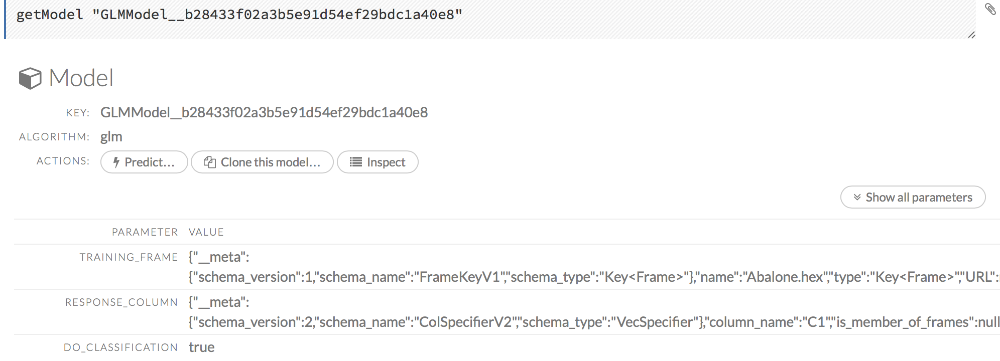
 
 A summary of the model's parameters displays. To display more details, click the **Show All Parameters** button. 
 
To delete a model, click the **Delete** button. 

To generate a Plain Old Java Object (POJO) that can use the model outside of H2O, click the **Download POJO** button. 

>**Note**: A POJO can be run in standalone mode or it can be integrated into a platform, such as [Hadoop's Storm](https://github.com/h2oai/h2o-training/blob/master/tutorials/streaming/storm/README.md). To make the POJO work in your Java application, you will also need the `h2o-genmodel.jar` file (available in `h2o-3/h2o-genmodel/build/libs/h2o-genmodel.jar`).

---

###Exporting and Importing Models

**To export a built model:**

0. Click the **Model** menu at the top of the screen. 
0. Select *Export Model...*
0. In the `exportModel` cell that appears, select the model from the drop-down *Model:* list.
0. Enter a location for the exported model in the *Path:* entry field. 
	>**Note**: If you specify a location that doesn't exist, it will be created. For example, if you only enter `test` in the *Path:* entry field, the model will be exported to `h2o-3/test`. 
0. To overwrite any files with the same name, check the *Overwrite:* checkbox. 
0. Click the **Export** button. A confirmation message displays when the model has been successfully exported. 

  


**To import a built model:** 

0. Click the **Model** menu at the top of the screen. 
0. Select *Import Model...*
0. Enter the location of the model in the *Path:* entry field. 
	>**Note**: The file path must be complete (e.g., `Users/h2o-user/h2o-3/exported_models`). Do not rename models while importing. 
0. To overwrite any files with the same name, check the *Overwrite:* checkbox. 
0. Click the **Import** button. A confirmation message displays when the model has been successfully imported. To view the imported model, click the **View Model** button. 

  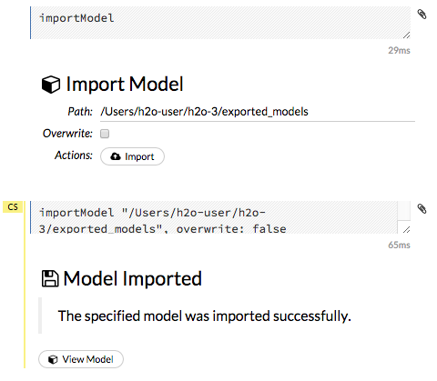

---

###Using Grid Search 


To include a parameter in a grid search in Flow, check the checkbox in the *Grid?* column to the right of the parameter name (highlighted in red in the image below). 

  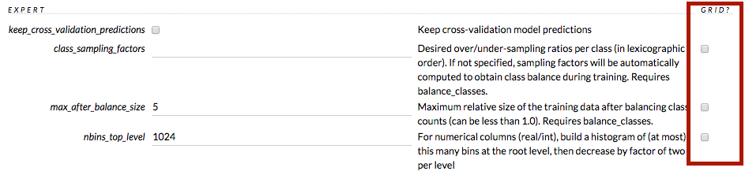


- If the parameter selected for grid search is Boolean (T/F or Y/N), both values are included when the *Grid?* checkbox is selected. 
- If the parameter selected for grid search is a list of values, the values display as checkboxes when the *Grid?* checkbox is selected. More than one option can be selected. 
- If the parameter selected for grid search is a numerical value, use a semicolon (;) to separate each additional value. 
- To view a list of all grid searches, select the **Model** menu, then click **List All Grid Search Results**, or click the **Assist Me** button and select **getGrids**. 


---

###Checkpointing Models

Some model types, such as DRF, GBM, and Deep Learning, support checkpointing. A checkpoint resumes model training so that you can iterate your model. The dataset must be the same. The following  model parameters must be the same when restarting a model from a checkpoint:


Must be the same as in checkpoint model         |            |      | 
--------------------|------------------|-----------------------|
 `drop_na20_cols` | `response_column` | `activation` |
 `use_all_factor_levels` | `adaptive_rate` | `autoencoder` |
`rho` | `epsilon` | `sparse` |
`sparsity_beta` | `col_major` | `rate` |
`rate_annealing` | `rate_decay` | `momentum_start` |
`momentum_ramp` | `momentum_stable` | `nesterov_accelerated_gradient`|
`ignore_const_cols`| `max_categorical_features` |`nfolds`|
`distribution` | `tweedie_power` | |


The following parameters can be modified when restarting a model from a checkpoint: 

Can be modified | | | 
----------------|-|-|
`seed` | `checkpoint`| `epochs` | 
`score_interval`| `train_samples_per_iteration`| `target_ratio_comm_to_comp`
`score_duty_cycle`| `score_training_samples`| `score_validation_samples`
`score_validation_sampling`| `classification_stop`| `regression_stop`
`quiet_mode` | `max_confusion_matrix_size`| `max_hit_ratio_k`
`diagnostics` | `variable_importances`| `initial_weight_distribution`
`initial_weight_scale` | `force_load_balance` | `replicate_training_data`
`shuffle_training_data`| `single_node_mode` | `fast_mode`
`l1`|`l2`| `max_w2`
`input_dropout_ratio`| `hidden_dropout_ratios` | `loss`
`overwrite_with_best_model`| `missing_values_handling` | `average_activation`
`reproducible` | `export_weights_and_biases`| `elastic_averaging`
`elastic_averaging_moving_rate`| `elastic_averaging_regularization`| `mini_batch_size`


0. After building your model, copy the `model_id`. To view the `model_id`, click the **Model** menu then click **List All Models**. 
0. Select the model type from the drop-down **Model** menu. 
	>**Note**: The model type must be the same as the checkpointed model. 
0. Paste the copied `model_id` in the *checkpoint* entry field. 
0. Click the **Build Model** button. The model will resume training. 


---

###Interpreting Model Results

**Scoring history**: [GBM](#GBM), [DL](#DL) Represents the error rate of the model as it is built. Typically, the error rate will be higher at the beginning (the left side of the graph) then decrease as the model building completes and accuracy improves. 

  

**Variable importances**: [GBM](#GBM), [DL](#DL) Represents the statistical significance of each variable in the data in terms of its affect on the model. Variables are listed in order of most to least importance. To view the scaled importance value of a variable, use your mouse to hover over the bar representing the variable. 

  

**Confusion Matrix**: [DL](#DL) Table depicting performance of algorithm in terms of false positives, false negatives, true positives, and true negatives. The actual results display in the columns and the predictions display in the rows; correct predictions are highlighted in yellow. In the example below, `0` was predicted correctly 902 times, while `8` was predicted correctly 822 times and `0` was predicted as `4` once.

  

**ROC Curve**: [DL](#DL), [GLM](#GLM) Graph representing the ratio of true positives to false positives. To view a specific threshold, select a value from the drop-down **Threshold** list. To view any of the following details, select it from the drop-down **Criterion** list: 

- Max f1
- Max f2
- Max f0point5
- Max accuracy
- Max precision
- Max absolute MCC (the threshold that maximizes the absolute Matthew's Correlation Coefficient)
- Max min per class accuracy

The lower-left side of the graph represents less tolerance for false positives while the upper-right represents more tolerance for false positives. Ideally, a highly accurate ROC resembles the following example. 

 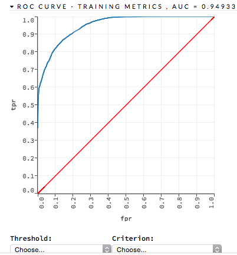

To learn how to make predictions, continue to the next section. 

---


<a name="Predict"></a>
# ... Making Predictions

After creating your model, click the key link for the model, then click the **Predict** button. 
Select the model to use in the prediction from the drop-down **Model:** menu and the data frame to use in the prediction from the drop-down **Frame:** menu, then click the **Predict** button. 

 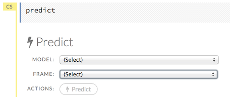


---
 
<a name="ViewPredict"></a>
## Viewing Predictions

Click the **Assist Me!** button, then click the **getPredictions** link, or enter `getPredictions` in the cell in CS mode and press **Ctrl+Enter**. A list of the stored predictions displays. 
To view a prediction, click the **View** button to the right of the model name. 

 

You can also view predictions by clicking the drop-down **Score** menu and selecting **List All Predictions**.


 

---

<a name="ViewFrame"></a>
## Viewing Frames

To view a specific frame, click the "Key" link for the specified frame, or enter `getFrameSummary "FrameName"` in a cell in CS mode (where `FrameName` is the name of a frame, such as `allyears2k.hex`).

 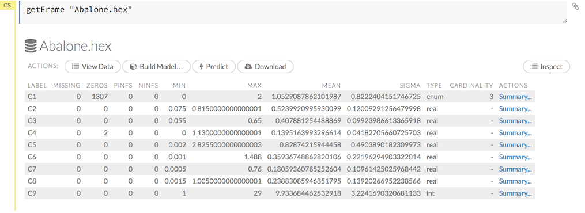 


From the `getFrameSummary` cell, you can: 

- view a truncated list of the rows in the data frame by clicking the **View Data** button
- split the dataset by clicking the **Split...** button
- view the columns, data, and factors in more detail or plot a graph by clicking the **Inspect** button
- create a model by clicking the **Build Model** button
- make a prediction based on the data by clicking the **Predict** button
- download the data as a .csv file by clicking the **Download** button
- view the characteristics or domain of a specific column by clicking the **Summary** link

When you view a frame, you can "drill-down" to the necessary level of detail (such as a specific column or row) using the **Inspect** button or by clicking the links. The following screenshot displays the results of clicking the **Inspect** button for a frame.

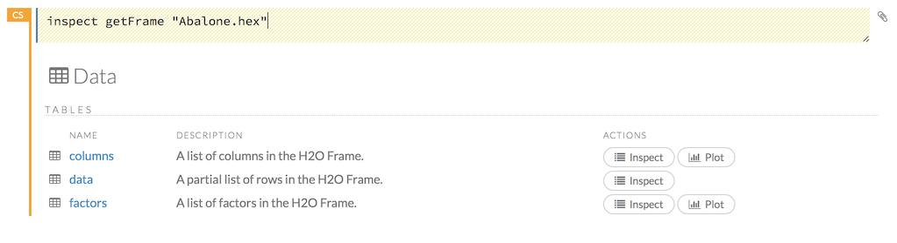

This screenshot displays the results of clicking the **columns** link. 

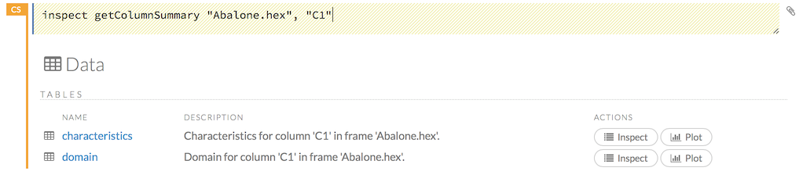


To view all frames, click the **Assist Me!** button, then click the **getFrames** link, or enter `getFrames` in the cell in CS mode and press **Ctrl+Enter**. You can also view all current frames by clicking the drop-down **Data** menu and selecting **List All Frames**. 

A list of the current frames in H2O displays that includes the following information for each frame: 


- Link to the frame (the "key")
- Number of rows and columns
- Size 


For parsed data, the following information displays: 

- Link to the .hex file
- The **Build Model**, **Predict**, and **Inspect** buttons

 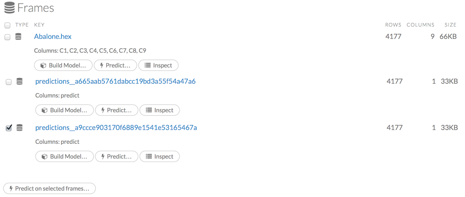

To make a prediction, check the checkboxes for the frames you want to use to make the prediction, then click the **Predict on Selected Frames** button. 

---

### Splitting Frames

Datasets can be split within Flow for use in model training and testing. 

 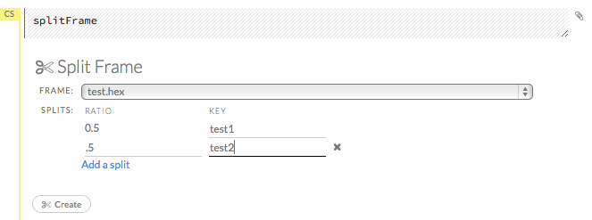

0. To split a frame, click the **Assist Me** button, then click **splitFrame**.
  
  >**Note**: You can also click the drop-down **Data** menu and select **Split Frame...**.
0. From the drop-down **Frame:** list, select the frame to split. 
0. In the second **Ratio** entry field, specify the fractional value to determine the split. The first **Ratio** field is automatically calculated based on the values entered in the second **Ratio** field. 
   
  >**Note**: Only fractional values between 0 and 1 are supported (for example, enter `.5` to split the frame in half). The total sum of the ratio values must equal one. H2O automatically adjusts the ratio values to equal one; if unsupported values are entered, an error displays.  
0. In the **Key** entry field, specify a name for the new frame. 
0. (Optional) To add another split, click the **Add a split** link. To remove a split, click the `X` to the right of the **Key** entry field. 
0. Click the **Create** button.  

---
### Creating Frames

To create a frame with a large amount of random data (for example, to use for testing), click the drop-down **Admin** menu, then select **Create Synthetic Frame**. Customize the frame as needed, then click the **Create** button to create the frame. 

  

---

### Plotting Frames

To create a plot from a frame, click the **Inspect** button, then click the **Plot** button. 

Select the type of plot (point, path, or rect) from the drop-down **Type** menu, then select the x-axis and y-axis from the following options: 

- label 
- type
- missing 
- zeros
- +Inf
- -Inf
- min
- max
- mean
- sigma
- cardinality

Select one of the above options from the drop-down **Color** menu to display the specified data in color, then click the **Plot** button to plot the data. 

 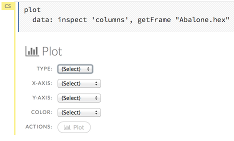

>**Note**: Because H2O stores enums internally as numeric then maps the integers to an array of strings, any `min`, `max`, or `mean` values for categorical columns are not meaningful and should be ignored. Displays for categorical data will be modified in a future version of H2O. 

---

<a name="Flows"></a>

# ... Using Flows

You can use and modify flows in a variety of ways:

- Clips allow you to save single cells 
- Outlines display summaries of your workflow
- Flows can be saved, duplicated, loaded, or downloaded

---


<a name="Clips"></a>

## Using Clips

Clips enable you to save cells containing your workflow for later reuse. To save a cell as a clip, click the paperclip icon to the right of the cell (highlighted in the red box in the following screenshot). 
 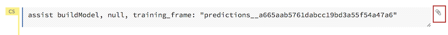

To use a clip in a workflow, click the "Clips" tab in the sidebar on the right. 

 

All saved clips, including the default system clips (such as `assist`, `importFiles`, and `predict`), are listed. Clips you have created are listed under the "My Clips" heading. To select a clip to insert, click the circular button to the left of the clip name. To delete a clip, click the trashcan icon to right of the clip name. 

>**NOTE**: The default clips listed under "System" cannot be deleted. 

Deleted clips are stored in the trash. To permanently delete all clips in the trash, click the **Empty Trash** button. 

>**NOTE**: Saved data, including flows and clips, are persistent as long as the same IP address is used for the cluster. If a new IP is used, previously saved flows and clips are not available. 

---

<a name="Outline"></a>
## Viewing Outlines

The **Outline** tab in the sidebar displays a brief summary of the cells currently used in your flow; essentially, a command history. 

- To jump to a specific cell, click the cell description. 
- To delete a cell, select it and press the X key on your keyboard. 

 

---

<a name="SaveFlow"></a>
## Saving Flows

You can save your flow for later reuse. To save your flow as a notebook, click the "Save" button (the first button in the row of buttons below the flow name), or click the drop-down "Flow" menu and select "Save Flow." 
To enter a custom name for the flow, click the default flow name ("Untitled Flow") and type the desired flow name. A pencil icon indicates where to enter the desired name. 

 

To confirm the name, click the checkmark to the right of the name field. 
 
 

To reuse a saved flow, click the "Flows" tab in the sidebar, then click the flow name. To delete a saved flow, click the trashcan icon to the right of the flow name. 

 

### Finding Saved Flows on your Disk
 
By default, flows are saved to the `h2oflows` directory underneath your home directory.  The directory where flows are saved is printed to stdout:
 
```
03-20 14:54:20.945 172.16.2.39:54323     95667  main      INFO: Flow dir: '/Users/<UserName>/h2oflows'
```

To back up saved flows, copy this directory to your preferred backup location.  

To specify a different location for saved flows, use the command-line argument `-flow_dir` when launching H2O:

`java -jar h2o.jar -flow_dir /<New>/<Location>/<For>/<Saved>/<Flows>`  

where `/<New>/<Location>/<For>/<Saved>/<Flows>` represents the specified location.  If the directory does not exist, it will be created the first time you save a flow.

### Saving Flows on a Hadoop cluster

If you are running H2O Flow on a Hadoop cluster, H2O will try to find the HDFS home directory to use as the default directory for flows. If the HDFS home directory is not found, flows cannot be saved unless a directory is specified while launching using `-flow_dir`:

`hadoop jar h2odriver.jar -nodes 1 -mapperXmx 6g -output hdfsOutputDirName -flow_dir hdfs:///<Saved>/<Flows>/<Location>`  

The location specified in `flow_dir` may be either an hdfs or regular filesystem directory.  If the directory does not exist, it will be created the first time you save a flow.

### Copying Flows

To create a copy of the current flow, select the **Flow** menu, then click **Make a Copy**. The name of the current flow changes to `Copy of <FlowName>` (where `<FlowName>` is the name of the flow). You can save the duplicated flow using this name by clicking **Flow** > **Save Flow**, or [rename it](#SaveFlow) before saving. 


### Downloading Flows

After saving a flow as a notebook, click the **Flow** menu, then select **Download this Flow**. A new window opens and the saved flow is downloaded to the default downloads folder on your computer. The file is exported as `<filename>.flow`, where `<filename>` is the name specified when the flow was saved. 

**Caution**: You must have an active internet connection to download flows. 

### Loading Flows

To load a saved flow, click the **Flows** tab in the sidebar at the right. In the pop-up confirmation window that appears, select **Load Notebook**, or click **Cancel** to return to the current flow. 

 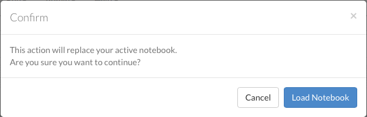

After clicking **Load Notebook**, the saved flow is loaded. 

To load an exported flow, click the **Flow** menu and select **Open Flow...**. In the pop-up window that appears, click the **Choose File** button and select the exported flow, then click the **Open** button. 

 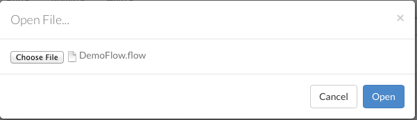

>**Notes**: 

>- Only exported flows using the default .flow filetype are supported. Other filetypes will not open. 
- If the current notebook has the same name as the selected file, a pop-up confirmation appears to confirm that the current notebook should be overwritten. 

---

<a name="Troubleshooting"></a>
# ...Troubleshooting Flow

To troubleshoot issues in Flow, use the **Admin** menu. The **Admin** menu allows you to check the status of the cluster, view a timeline of events, and view or download logs for issue analysis. 

>**NOTE**: To view the current H2O Flow version, click the **Help** menu, then click **About**. 

## Viewing Cluster Status

Click the **Admin** menu, then select **Cluster Status**. A summary of the status of the cluster (also known as a cloud) displays, which includes the same information: 

- Cluster health
- Whether all nodes can communicate (consensus)
- Whether new nodes can join (locked/unlocked)
  
  >**Note**: After you submit a job to H2O, the cluster does not accept new nodes. 
- H2O version
- Number of used and available nodes
- When the cluster was created

 


The following information displays for each node:   

- IP address (name)
- Time of last ping
- Number of cores
- Load
- Amount of data (used/total)
- Percentage of cached data
- GC (free/total/max)
- Amount of disk space in GB (free/max)
- Percentage of free disk space 

To view more information, click the **Show Advanced** button. 

---

## Viewing CPU Status (Water Meter)

To view the current CPU usage, click the **Admin** menu, then click **Water Meter (CPU Meter)**. A new window opens, displaying the current CPU use statistics. 

---

## Viewing Logs
To view the logs for troubleshooting, click the **Admin** menu, then click **Inspect Log**. 

 

To view the logs for a specific node, select it from the drop-down **Select Node** menu. 

---

<a name="DL_Logs"></a>
## Downloading Logs

To download the logs for further analysis, click the **Admin** menu, then click **Download Log**. A new window opens and the logs download to your default download folder. You can close the new window after downloading the logs. Send the logs to [h2ostream](mailto:h2ostream@googlegroups.com) or [file a JIRA ticket](#ReportIssue) for issue resolution. 

---

## Viewing Stack Trace Information

To view the stack trace information, click the **Admin** menu, then click **Stack Trace**. 

 

To view the stack trace information for a specific node, select it from the drop-down **Select Node** menu. 

---

##Viewing Network Test Results

To view network test results, click the **Admin** menu, then click **Network Test**. 

  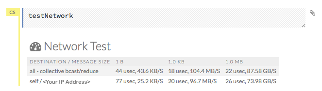

---

## Accessing the Profiler

The Profiler looks across the cluster to see where the same stack trace occurs, and can be helpful for identifying activity on the current CPU. 
To view the profiler, click the **Admin** menu, then click **Profiler**. 

 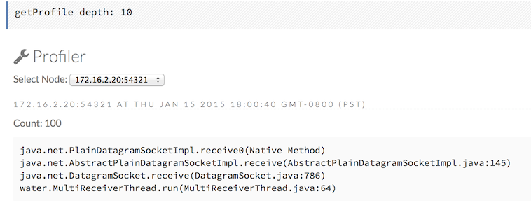

To view the profiler information for a specific node, select it from the drop-down **Select Node** menu. 

---


## Viewing the Timeline

To view a timeline of events in Flow, click the **Admin** menu, then click **Timeline**. The following information displays for each event: 

- Time of occurrence (HH:MM:SS:MS)
- Number of nanoseconds for duration
- Originator of event ("who")
- I/O type
- Event type
- Number of bytes sent & received

 

To obtain the most recent information, click the **Refresh** button.  

---

<a name="ReportIssue"></a>
##Reporting Issues

If you experience an error with Flow, you can submit a JIRA ticket to notify our team. 

0. First, click the **Admin** menu, then click **Download Logs**. This will download a file contains information that will help our developers identify the cause of the issue.  
0. Click the **Help** menu, then click **Report an issue**. This will open our JIRA page where you can file your ticket.  
0. Click the **Create** button at the top of the JIRA page. 
0. Attach the log file from the first step, write a description of the error you experienced, then click the **Create** button at the bottom of the page. Our team will work to resolve the issue and you can track the progress of your ticket in JIRA. 

---

##Requesting Help

If you have a Google account, you can submit a request for assistance with H2O on our Google Groups page, [H2Ostream](https://groups.google.com/forum/#!forum/h2ostream). 

To access H2Ostream from Flow:

0. Click the **Help** menu.
0. Click **Forum/Ask a question**. 
0. Click the red **New topic** button.
0. Enter your question and click the red **Post** button. If you are requesting assistance for an error you experienced, be sure to include your [logs](#DL_Logs). 


You can also email your question to [h2ostream@googlegroups.com](mailto:h2ostream@googlegroups.com). 


---

## Shutting Down H2O

To shut down H2O, click the **Admin** menu, then click **Shut Down**. A *Shut down complete* message displays in the upper right when the cluster has been shut down. 

---

