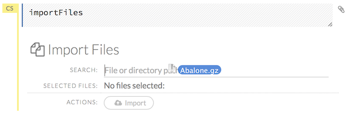

#Getting Started with H2O Flow
---

This tutorial will show you how to: 

- [get help](#GetHelp)
- [understand cell modes](#Cells)
- [import data](#ImportData)
- [parse data](#ParseData)
- [view jobs](#ViewJobs)
- [build a model](#BuildModel)
- [view a model](#ViewModels)
- [make a prediction](#Predict)
- [view predictions](#ViewPredict)
- [view a frame](#ViewFrames)
- [use clips](#Clips)
- [view an outline of your flow](#Outline)
- [save a flow](#SaveFlows)
- [troubleshoot issues](#Troubleshooting)

 
##Getting Help 
---

First, let's go over the basics. Type `h` to view a list of helpful shortcuts. 

The following help window displays: 

To close this window, click the **X** in the upper-right corner, or click the **Close** button in the lower-right corner. You can also click behind the window to close it. 

For additional help, select the **Help** sidebar to the right and click the **Assist Me!** button. 

 

You can also type `assist` in a blank cell and press **Ctrl+Enter**. A list of common tasks displays to help you find the correct command. 

 
 
You can also access the quick start guide, keyboard shortcuts, or H2O documentation from the "Help" menu at the top of the screen. 

Before getting started with H2O Flow, make sure you understand the different cell modes. 

---

##Understanding Cell Modes

There are two modes for cells: edit and command. In edit mode, the cell is yellow with a blinking bar to indicate where text can be entered and there is an orange flag to the left of the cell.

 
 In command mode, the flag is yellow. The flag also indicates the cell's format: 

- **MD**: Markdown

 

- **CS**: Code

 

- **RAW**: Raw format (for code comments)

 

- **H[1-5]**: Heading level (where 1 is a first-level heading)

 

**NOTE**: If there is an error in the cell, the flag is red. 

 

Here are some important keyboard shortcuts to remember: 

- Click a cell and press **Enter** to enter edit mode, which allows you to change the contents of a cell. 
- To exit edit mode, press **Esc**. 
- To execute the contents of a cell, press the **Ctrl** and **Enter** buttons at the same time.

The following commands must be entered in command mode.  

- To add a new cell *above* the current cell, press **a**. 
- To add a new cell *below* the current cell, press **b**. 
- To delete the current cell, press the **d** key *twice*. (**dd**). 

You can view these shortcuts by clicking **Help** > **Keyboard Shortcuts** or by clicking the **Help** tab in the sidebar. 

There are also a series of buttons at the top of the page below the flow name that allow you to save the current flow, add a new cell, move cells up or down, run the current cell, and cut, copy, or paste the current cell. If you hover over the button, a description of the button's function displays. 

 
 
You can also use the menus at the top of the screen to edit the cells, view specific format types (such as input or output), change the cell's format, or run the cell. You can also access troubleshooting information or obtain help with Flow.  
 

Now that you are familiar with the cell modes, let's import some data. 

---

##Importing Data

If you don't have any of your own data to work with, you can find some example datasets here: 

- http://docs.h2o.ai/resources/publicdata.html
- http://data.h2o.ai

There are multiple ways to import data in H2O flow:

- Click the **Assist Me!** button in the **Help** sidebar, then click the **importFiles** link. Enter the file path in the auto-completing **Search** entry field and press **Enter**. Select the file from the search results and select it by clicking the **Add All** link.
 
  You can also drag and drop the file onto the **Search** field in the cell.
  
 

- In a blank cell, select the CS format, then enter `importFiles [ "path/filename.format" ]` (where `path/filename.format` represents the complete file path to the file, including the full file name. 

After selecting the file to import, the file path displays in the "Search Results" section. To import a single file, click the plus sign next to the file. To import all files in the search results, click the **Add all** link. The files selected for import display in the "Selected Files" section. 

 

- To import the selected file(s), click the **Import** button. 

- To remove all files from the "Selected Files" list, click the **Clear All** link. 

- To remove a specific file, click the **X** next to the file path. 

After you click the **Import** button, the raw code for the current job displays. A summary displays the results of the file import, including the number of imported files and their Network File System (nfs) locations. 

 

Ok, now that you've imported your data, let's move on to the next step: parsing. Click the **Parse these files** button to continue. 

---

##Parsing Data

After you have imported your data, parse the data.

Select the parser type (if necessary) from the drop-down **Parser** list. For most data parsing, H2O automatically recognizes the data type, so the default settings typically do not need to be changed. The following options are available: 

- Auto
- XLS
- CSV
- SVMLight

If a separator or delimiter is used, select it from the **Separator** list. 

Select a column header option, if applicable: 

- **Auto**: Automatically detect header types.
- **First row contains column names**: Specify heading as column names.
- **First row contains data**: Specify heading as data. This option is selected by default.

Select any necessary additional options: 

- **Enable single quotes as a field quotation character**: Treat single quote marks (also known as apostrophes) in the data as a character, rather than an enum. This option is not selected by default. 
- **Delete on done**: Check this checkbox to delete the imported data after parsing. This option is selected by default. 

A preview of the data displays in the "Data Preview" section. After making your selections, click the **Parse** button. 

 

After you click the **Parse** button, the code for the current job displays. 

 
 
Since we've submitted a couple of jobs (data import & parse) to H2O now, let's take a moment to learn more about jobs in H2O.  
 
--- 
 

##Viewing Jobs

Any command (such as `importFiles`) you enter in H2O is submitted as a job, which is associated with a key. The key identifies the job within H2O and is used as a reference. 

###Viewing Recent Jobs

To view all recent jobs, click the **Admin** menu, then click **Jobs**, or enter `getJobs` in a cell in CS mode. 

 

The following information displays: 

- Key (linked to the specified job)
- Description of the type of job (for example, `GLM` or `Parse`)
- Status (`RUNNING` or `DONE`)

###Viewing Specific Jobs

To view a specific job, click the **Destination Key** link. 

The following information displays: 

- Current status
- Key (for example, `$0301ac10021432d4ffffffff$_8590b37303844cca7c603512c4064b04`)
- Destination key, which is linked to the originally imported data set (for example, AirlinesTest.hex)
- Run time
- Progress

To refresh this information, click the **Refresh** button. To view the details of the job, click the **View** button. 

**NOTE**: For a better understanding of how jobs work, make sure to review the [Viewing Frames](#ViewFrames) section as well. 
 
Ok, now that you understand how to find jobs in H2O, let's submit a new one by building a model. 

---

##Building Models

To build a model: 

- Click the **Assist Me!** button and select **buildModel**

  or 

- Click the **Assist Me!** button, select **getFrames**, then click the **Build Model...** button below the parsed .hex data set

The **Build Model...** button can be accessed from any page containing the .hex key for the parsed data (for example, `getJobs` > `getFrame`). 
 
In the **Build a Model** cell, select an algorithm from the drop-down menu: 

- **kmeans**: Create a K-Means model

- **glm**: Create a Generalized Linear model

- **grep**: Perform a global search for a specified character string and display the results (global regular expression)
 

- **word2vec**: Create a word-to-vector model for text-based data

- **splitframe**: Split a data frame

- **gbm**: Create a Gradient Boosted model

- **deeplearning**: Create a Deep Learning model

- **quantile**: Obtain the quantile for the current data

The available options vary depending on the selected model. If an option is only available for a specific model type, the model type is listed. If no model type is specified, the option is applicable to all model types. 

- **Destination\_key**: (Optional) Enter a custom name for the model to use as a reference. By default, H2O automatically generates a destination key. 

- **Training_frame**: (Required) Select the dataset used to build the model. 
**NOTE**: If you click the **Build a model** button from the `Parse` cell, the training frame is entered automatically. 

- **Validation_frame**: (Optional) Select the dataset used to evaluate the accuracy of the model. 

- **Ignored_columns**: (Optional) Click the plus sign next to a column name to add it to the list of columns excluded from the model. To add all columns, click the **Add all** button. To remove a column from the list of ignored columns, click the X next to the column name. To remove all columns from the list of ignored columns, click the **Clear all** button. 

- **Score\_each\_iteration**: (Optional) Score the validation set after each iteration of the model-building process. If you select this option, the model-building time increases. 

- **Probs**: [(Quantile)](#quantile) Specify the probabilities for quantiles. The default values are [0.01, 0.05, 0.1, 0.25, 0.333, 0.5, 0.667, 0.75, 0.9, 0.95, 0.99]. 

- **Response_column**: (Required for [GLM](#GLM), [GBM](#GBM), [DL](#DL)) Select the column to use as the independent variable.

- **Ratios**: [(Splitframe)](#sf) Specify the split ratio. The resulting number of the split is the ratio length +1. The default value is 0.5. 

- **Do_classification**: ([GLM](#GLM), [GBM](#GBM), [DL](#DL)) Convert the response column to an enum (forcing classification instead of regression).

- **Balance_classes**: ([GLM](#GLM), [GBM](#GBM), [DL](#DL)) Upsample the minority classes to balance the class distribution. This option is not selected by default. 

- **Max\_after\_balance\_size**: ([GLM](#GLM), [GBM](#GBM), [DL](#DL)) Specify the balanced class dataset size (as a multiple of the original dataset size). The default value is infinity. 

- **Ntrees**: [(GBM)](#GBM) Specify the number of trees. For Grid Search, use comma-separated values (for example: 50,100,150,200). The default value is 50. 

- **Max\_depth**: [(GBM)](#GBM) Specify the maximum tree depth. For Grid Search, use comma-separated values (for example: 5,7). The default value is 5. 

- **Min\_rows**: [(GBM)](#GBM) Specify the minimum number of observations for a leaf ("nodesize" in R). For Grid Search, use comma-separated values. The default value is 10. 

- **Nbins**: [(GBM)](#GBM) Specify the number of bins for the histogram. The default value is 20. 

- **Learn_rate**: [(GBM)](#GBM) Specify the learning rate. The range is 0.0 to 1.0 and the default is 0.1. 

- **Loss**: ([GBM](#GBM), [DL](#DL)) Select the loss function. For GBM, the options are auto, bernoulli, or none and the default is auto. For DL, the options are automatic, mean square, cross-entropy, or none and the default value is mean square. 

- **Variable_importance**: ([GBM](#GBM), [DL](#DL)) Check this checkbox to compute variable importance. This option is not selected by default. 

- **Group_split**: [(GBM)](#GBM) Check this checkbox to perform group-splitting categoricals. This option is selected by default. 

- **K**: [(K-Means)](#Kmeans) Specify the number of clusters. The default is 0.

- **Max_iters**: [(K-Means)](#Kmeans) Specify the number of training iterations. The default is 1000. 

- **Init**: [(K-Means)](#Kmeans) Select the initialization mode (Furthest, PlusPlus, or None).

- **Family**: [(GLM)](#GLM) Select the model type (Gaussian, Binomial, Poisson, Gamma, Tweedie, or none).

- **N_folds**: ([GLM](#GLM), [DL](#DL)) Specify the number of cross-validations to perform. The default is 0. 

- **Keep\_cross\_validation\_splits**: [(DL)](#DL) Check this checkbox to keep the cross-validation frames. This option is not selected by default. 

- **Checkpoint**: [(DL)](#DL) Enter a model key associated with a previously-trained Deep Learning model. Use this option to build a new model as a continuation of a previously-generated model (e.g., by a grid search).

- **Override\_with\_best\_model**: [(DL)](#DL) Check this checkbox to override the final model with the best model found during training. This option is selected by default. 

- **Expert_mode**: [(DL)](#DL) Check this checkbox to enable "expert mode" and configure additional options. This option is not selected by default.

- **Autoencoder**: [(DL)](#DL) Check this checkbox to enable the Deep Learning autoencoder. This option is not selected by default. 

- **Activation**: [(DL)](#DL) Select the activation function (Tahn, Tahn with dropout, Rectifier, Rectifier with dropout, Maxout, Maxout with dropout). The default option is Rectifier. 

- **Hidden**: [(DL)](#DL) Specify the hidden layer sizes (e.g., 100,100). For Grid Search, use comma-separated values: (10,10),(20,20,20). The default value is [200,200]. 

- **Epochs**: ([word2vec](#w2v), [DL](#DL)) Specify the number of times to iterate (stream) the dataset. The value can be a fraction. The default value for DL is 10.0 and 5 for word2vec. 

- **Quiet_mode**: [(DL)](#DL) Check this checkbox to display less output in the standard output. This option is not selected by default. 

- **Max\_confusion\_matrix\_size**: [(DL)](#DL) Specify the number of classes for the confusion matrices. The default value is 20. 

- **Class\_sampling\_factors**: ([GLM](#GLM), [DL](#DL)) Specify the per-class (in lexicographical order) over/under-sampling ratios. By default, these ratios are automatically computed during training to obtain the class balance. There is no default value. 

- **Solver**: [(GLM)](#GLM) Select the solver to use (ADMM, L\_BFGS, or none). [ADMM](http://www.stanford.edu/~boyd/papers/admm_distr_stats.html) supports more features and [L_BFGS](http://cran.r-project.org/web/packages/lbfgs/vignettes/Vignette.pdf) scales better for datasets with many columns. The default is ADMM. 

- **Diagnostics**: [(DL)](#DL) Check this checkbox to compute the variable importances for input features (using the Gedeon method). For large networks, selecting this option can reduce speed. This option is selected by default. 

- **Force\_load\_balance**: [(DL)](#DL) Check this checkbox to force extra load balancing to increase training speed for small datasets and use all cores. This option is selected by default. 

- **Single\_node\_mode**: [(DL)](#DL) Check this checkbox to force H2O to run on a single node for fine-tuning of model parameters. This option is not selected by default. 

- **Missing\_values\_handling**: [(DL)](#DL) Select how to handle missing values (skip, mean imputation, or none). The default value is mean imputation. 

- **Average_activation**: [(DL)](#DL) Specify the average activation for the sparse autoencoder. The default value is 0.0. 

- **Sparsity_beta**: [(DL)](#DL) Specify the sparsity regularization. The default value is 0.0. 

- **Minwordfreq**: [(word2vec)](#w2v) Specify the number of times a word must appear to be included in the model. The default is 5. 

- **WordModel**: [(word2vec)](#w2v) Select the model type (continuous bag of words [CBOW], SkipGram, or None). 

- **NormModel**: [(word2vec)](#w2v) Select the normalization type (Hierarchical Softmax [HSM], Negative Sampling [NegSampling], or None). 

- **NegSampleCnt**: [(word2vec)](#w2v) Specify the number of negative examples (for example, entering 0 would mean that the example is not used). The default value is 5. 

- **Vecsize**: [(word2vec)](#w2v) Specify the word vector size. The default is 100. 

- **Windowsize**: [(word2vec)](#w2v) Specify the max skip length between words. The default is 5. 

- **Sentsamplerate**: [(word2vec)](#w2v) Specify the threshold for word occurences. Words with higher frequencies in the training data are randomly down-sampled. The default value is 0.001. 

- **Initlearningrate**: [(word2vec)](#w2v) Specify the starting learning rate. The default is 0.05. 

**Advanced Options**

- **Standardize**: ([K-Means](#Kmeans), [GLM](#GLM)) To standardize the numeric columns to have mean of zero and unit variance, check this checkbox. Standardization is highly recommended; if you do not use standardization, the results can include components that are dominated by variables that appear to have larger variances relative to other attributes as a matter of scale, rather than true contribution. This option is selected by default. 

- **Link**: [(GLM)](#GLM) Select a link function (Identity, Family_Default, Logit, Log, Inverse, Tweedie).

- **Tweedie\_variance\_power**: ([GLM](#GLM) with Tweedie) Specify the variance power for the Tweedie model. 

- **Tweedie\_link\_power**: ([GLM](#GLM) with Tweedie) Specify the Tweedie link power. 

- **Alpha**: [(GLM)](#GLM) Specify the regularization distribution between L2 and L2. The default value is 0.5. 

- **Lambda**: [(GLM)](#GLM) Specify the regularization strength. The default value is 1.0E-5. 

- **Lambda_search**: [(GLM)](#GLM) Check this checkbox to enable lambda search, starting with lambda max. The given lambda is then interpreted as lambda min. 

- **Higher_accuracy**: [(GLM)](#GLM) Check this checkbox to enable line search. This provides GLM convergence but can reduce speed. 

- **Use\_all\_factor\_levels**: ([GLM](#GLM), [DL](#DL)) Check this checkbox to use all factor levels in the possible set of predictors; if you enable this option, sufficient regularization is required. By default, the first factor level is skipped. For Deep Learning models, this option is useful for determining variable importances and is automatically enabled if the autoencoder is selected. 

- **Train\_samples\_per\_iteration**: [(DL)](#DL) Specify the number of global training samples per MapReduce iteration. To specify one epoch, enter 0. To specify all available data (e.g., replicated training data), enter -1. To use the automatic values, enter -2. The default is -2. 

- **Target\_ratio\_comm\_to\_comp**: [(DL)](#DL) Specify the target ratio of communication overhead to computation. This option is only enabled for multi-node operation and if **train\_samples\_per\_iteration** equals -2 (auto-tuning). The default value is 0.02. 

- **Adaptive_rate**: [(DL)](#DL) Check this checkbox to enable the adaptive learning rate (ADADELTA). This option is selected by default. 

- **Rho**: [(DL)](#DL) Specify the adaptive learning rate time decay factor. The default value is 0.99. 

- **Epsilon**: [(DL)](#DL) Specify the adaptive learning rate time smoothing factor to avoid dividing by zero. The default value is 1.0E-8. 

- **Rate**: [(DL)](#DL) Specify the learning rate. Higher rates result in less stable models and lower rates result in slower convergence. The default value is 0.005. 

- **Rate_annealing**: [(DL)](#DL) Specify the learning rate annealing. The formula is rate/(1+rate_annealing value * samples). The default value is 1.0E-6. 

- **Momentum_start**: [(DL)](#DL) Specify the initial momentum at the beginning of training. A suggested value is 0.5. The default value is 0.0. 

- **Momentum_ramp**: [(DL)](#DL) Specify the number of training samples for increasing the momentum. The default value is 1000000.0. 

- **Nesterov\_accelerated\_gradient**: [(DL)](#DL) Check this checkbox to use the Nesterov accelerated gradient. This option is recommended and selected by default. 

- **Input\_dropout\_ratio**: [(DL)](#DL) Specify the input layer dropout ratio to improve generalization. Suggested values are 0.1 or 0.2. The default value is 0.0. 

- **Hidden\_dropout\_ratios**: [(DL)](#DL) Specify the hidden layer dropout ratios to improve generalization. Specify one value per hidden layer. The default is 0.5. 

- **L1**: [(DL)](#DL) Specify the L1 regularization to add stability and improve generalization; sets the value of many weights to 0. The default value is 0.0. 

- **L2**: [(DL)](#DL) Specify the L2 regularization to add stability and improve generalization; sets the value of many weights to smaller values. The default value is 0.0.

- **Score_interval**: [(DL)](#DL) Specify the shortest time interval (in seconds) to wait between model scoring. The default value is 5.0. 

**Expert Options**

- **Rate_decay**: [(DL)](#DL) Specify the learning rate decay factor between layers. 

- **Max_W2**: [(DL)](#DL) Specify the constraint for the squared sum of the incoming weights per unit (e.g., for Rectifier). The default value is infinity. 

- **Initial\_weight\_distribution**: [(DL)](#DL) Select the initial weight distribution (Uniform Adaptive, Uniform, Normal, or None). The default is Uniform Adaptive. 

- **Initial\_weight\_scale**: [(DL)](#DL) Specify the initial weight scale of the distribution function for Uniform or Normal distributions. For Uniform, the values are drawn uniformly from initial weight scale. For Normal, the values are drawn from a Normal distribution with the standard deviation of the initial weight scale. The default value is 1.0. 

- **Score\_training\_samples**: [(DL)](#DL) Specify the number of training set samples for scoring. To use all training samples, enter 0. The default value is 10000. 

- **Score\_validation\_samples**: [(DL)](#DL) Specify the number of validation set samples for scoring. To use all validation set samples, enter 0. The default value is 0. 

- **Score\_duty\_cycle**: [(DL)](#DL) Specify the maximum duty cycle fraction for scoring. A lower value results in more training and a higher value results in more scoring. The default value is 0.1.

- **Classification_stop**: [(DL)](#DL) Specify the stopping criterion for classification error fractions on training data. To disable this option, enter -1. The default value is 0.0. 

- **Regression_stop**: [(DL)](#DL) Specify the stopping criterion for regression error (MSE) on the training data. To disable this option, enter -1. The default value is 1.0E-6. 

- **Max\_hit\_ratio\_k**: [(DL)](#DL) Specify the maximum number (top K) of predictions to use for hit ratio computation (for multi-class only). To disable this option, enter 0. The default value is 10. 

- **Score\_validation\_sampling**: [(DL)](#DL) Select the method for sampling the validation dataset for scoring (uniform, stratified, or none). The default value is uniform. 

- **Fast_mode**: [(DL)](#DL) Check this checkbox to enable fast mode, a minor approximation in back-propagation. This option is selected by default. 

- **Ignore\_const\_cols**: [(DL)](#DL) Check this checkbox to ignore constant training columns, since no information can be gained from them. This option is selected by default. 

- **Replicate\_training\_data**: [(DL)](#DL) Check this checkbox to replicate the entire training dataset on every node for faster training on small datasets. This option is not selected by default. 

- **Shuffle\_training\_data**: [(DL)](#DL) Check this checkbox to shuffle the training data. This option is recommended if the training data is replicated and the value of **train\_samples\_per\_iteration** is close to the number of nodes times the number of rows. This option is not selected by default. 

- **Sparse**: [(DL)](#DL) Check this checkbox to use sparse data handling. This option is not selected by default. 

- **Col_major**: [(DL)](#DL) Check this checkbox to use a column major weight matrix for the input layer. This option can speed up forward propagation but may reduce the speed of backpropagation. This option is not selected by default. 

- **Seed**: ([K-Means](#Kmeans), [GBM](#GBM), [DL](#DL)) Specify the random number generator (RNG) seed for algorithm components dependent on randomization. The seed is consistent for each H2O instance so that you can create models with the same starting conditions in alternative configurations. 

- **Prior1**: [(GLM)](#GLM) Specify prior probability for y ==1. Use this parameter for logistic regression if the data has been sampled and the mean of response does not reflect reality. The default value is 0.0. 

- **NLambdas**: [(GLM)](#GLM) Specify the number of lambdas to use in the search. The default value is -1. 

- **Lambda\_min\_ratio**: [(GLM)](#GLM) Specify the min lambda to use in the lambda search (as a ratio of lambda max). The default value is -1.0. 

---

###Viewing Models

Click the **Assist Me!** button, then click the **getModels** link, or enter `getModels` in the cell in CS mode and press **Ctrl+Enter**. A list of available models displays. 

 

To inspect a model, check its checkbox then click the **Inspect** button, or click the **Inspect** button to the right of the model name. 

 
 
 A summary of the model's parameters displays. To display more details, click the **Show All Parameters** button. 
 
 **NOTE**: The **Clone this model...** button will be supported in a future version. 
 
To compare models, check the checkboxes for the models to use in the comparison and click the **Compare selected models** button. To select all models, check the checkbox at the top of the checkbox column (next to the **KEY** heading). 

To learn how to make predictions, continue to the next section. 

---

##Making Predictions

After creating your model, click the destination key link for the model, then click the **Predict** button. 
Select the model to use in the prediction from the drop-down **Model:** menu and the data frame to use in the prediction from the drop-down **Frame** menu, then click the **Predict** button. 

 

---
 

###Viewing Predictions

Click the **Assist Me!** button, then click the **getPredictions** link, or enter `getPredictions` in the cell in CS mode and press **Ctrl+Enter**. A list of the stored predictions displays. 
To view a prediction, click the **View** button to the right of the model name. 

 

---

##Viewing Frames

To view a specific frame, click the "Destination Key" link for the specified frame, or enter `getFrame "FrameName"` in a cell in CS mode (where `FrameName` is the name of a frame, such as `allyears2k.hex`.

  

From the `getFrame` cell, you can: 

- view a truncated list of the rows in the data frame by clicking the **View Data** button
- create a model by clicking the **Build Model** button
- make a prediction based on the data by clicking the **Predict** button
- download the data as a .csv file by clicking the **Download** button
- view the columns, data, and factors in more detail or plot a graph by clicking the **Inspect** button
- view the characteristics or domain of a specific column by clicking the **Summary** link

When you view a frame, you can "drill-down" to the necessary level of detail (such as a specific column or row) using the **View Data** and **Inspect** buttons. The following screenshot displays the results of clicking the **Inspect** button.

This screenshot displays the results of clicking the **Summary** link for the first column. 

To view all frames, click the **Assist Me!** button, then click the **getFrames** link, or enter `getFrames` in the cell in CS mode and press **Ctrl+Enter**. A list of the current frames in H2O displays that includes the following information for each frame: 

- Column headings
- Number of rows and columns
- Size 

For parsed data, the following information displays: 

- Link to the .hex file
- The **Build Model**, **Predict**, and **Inspect** buttons

 

To make a prediction, check the checkboxes for the frames you want to use to make the prediction, then click the **Predict on Selected Frames** button. 

###Plotting Frames

To create a plot from a frame, click the **Inspect** button, then click the **Plot** button. 

Select the type of plot (point, line, area, or interval) from the drop-down **Type** menu, then select the x-axis and y-axis from the following options: 

- label 
- missing 
- zeros
- pinfs 
- ninfs 
- min
- max
- mean
- sigma
- type
- cardinality

Select one of the above options from the drop-down **Color** menu to display the specified data in color, then click the **Plot** button to plot the data. 

---

##Using Clips

Clips enable you to save cells containing your workflow for later reuse. To save a cell as a clip, click the paperclip icon to the right of the cell (highlighted in the red box in the following screenshot). 
 

To use a clip in a workflow, click the "Clips" tab in the sidebar on the right. 

 

All saved clips, including the default system clips (such as `assist`, `importFiles`, and `predict`), are listed. Clips you have created are listed under the "My Clips" heading. To select a clip to insert, click the circular button to the left of the clip name. To delete a clip, click the trashcan icon to right of the clip name. 

**NOTE**: The default clips listed under "System" cannot be deleted. 

Deleted clips are stored in the trash. To permanently delete all clips in the trash, click the **Empty Trash** button. 

**NOTE**: Saved data, including flows and clips, are persistent as long as the same IP address is used for the cluster. If a new IP is used, previously saved flows and clips are not available. 

---

##Viewing Outlines

The "Outline" tab in the sidebar displays a brief summary of the cells currently used in your flow; essentially, a command history. To jump to a specific cell, click the cell description. 

 

---

##Saving Flows

You can save your flow for later reuse. To save your flow, click the "Save" button (the first button in the row of buttons below the flow name), or click the drop-down "Flow" menu and select "Save." 
To enter a custom name for the flow, click the default flow name ("Untitled Flow") and type the desired flow name. A pencil icon indicates where to enter the desired name. 

 

To confirm the name, click the checkmark to the right of the name field. 
 
 

To reuse a saved flow, click the "Flows" tab in the sidebar, then click the flow name. To delete a saved flow, click the trashcan icon to the right of the flow name. 

 
 
 **NOTE**: Saved data, including flows and clips, are persistent as long as the same IP address is used for the cluster. If a new IP is used, previously saved flows and clips are not available. 

##Troubleshooting 

To troubleshoot issues in Flow, use the **Admin** menu. The **Admin** menu allows you to check the status of the cluster, view a timeline of events, and view or download logs for issue analysis. 

**NOTE**: To view the current version, click the **Help** menu, then click **About**. 

###Viewing Cluster Status

Click the **Admin** menu, then select **Cluster Status**. A summary of the status of the cluster (also known as a cloud) displays, which includes the same information: 

- Cluster health
- Whether all nodes can communicate (consensus)
- Whether new nodes can join (locked/unlocked)
- H2O version
- Cluster size
- Number of unavailable nodes
- When the cluster was created

 

The following information displays for each node:   

- IP address (name)
- Time of last ping
- Number of cores
- Load
- Amount of data (used/total)
- Percentage of cached data
- GC (free/total/max)
- Amount of disk space in GB (free/max)
- Percentage of free disk space 

To view more information, click the **Show Advanced** button. 

---

###Viewing CPU Status (Water Meter)

To view the current CPU usage, click the **Admin** menu, then click **Water Meter (CPU Meter)**. A new window opens, displaying the current CPU use statistics. 

---

###Viewing Logs
To view the logs for troubleshooting, click the **Admin** menu, then click **Inspect Log**. 

 

To view the logs for a specific node, select it from the drop-down **Select Node** menu. 

---

###Downloading Logs

To download the logs for further analysis, click the **Admin** menu, then click **Download Log**. A new window opens and the logs download to your default download folder. You can close the new window after downloading the logs. Send the logs to support@h2o.ai for issue resolution. 

---

###Accessing the Profiler

To view the profiler, click the **Admin** menu, then click **Profiler**. 

 

To view the profiler information for a specific node, select it from the drop-down **Select Node** menu. 

---

###Viewing Stack Trace Information

To view the stack trace information, click the **Admin** menu, then click **Stack Trace**. 

 

To view the stack trace information for a specific node, select it from the drop-down **Select Node** menu. 

###Viewing the Timeline

To view a timeline of events in Flow, click the **Admin** menu, then click **Timeline**. The following information displays for each event: 

- Time of occurrence (HH:MM:SS:MS)
- Number of nanoseconds for duration
- Originator of event ("who")
- I/O type
- Event type
- Number of bytes sent & received

 

To obtain the most recent information, click the **Refresh** button.  

