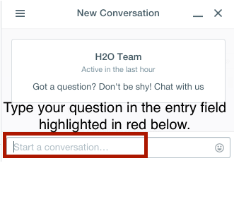

#Welcome to H2O 3.0

Welcome to the H2O documentation site! Depending on your area of interest, select a learning path from the links above. 

We're glad you're interested in learning more about H2O - if you have any questions or need general support, please email them to our Google Group,  [h2ostream](mailto:h2ostream@googlegroups.com) or post them on our Google groups forum, <a href="https://groups.google.com/forum/#!forum/h2ostream" target="_blank">h2ostream</a>. This is a public forum, so your question will be visible to other users. 


**Note**: To join our Google group on <a href="https://groups.google.com/forum/#!forum/h2ostream" target="_blank">h2ostream</a>, you need a Google account (such as Gmail or Google+). On the <a href="https://groups.google.com/forum/#!forum/h2ostream" target="_blank">h2ostream</a> page, click the **Join group** button, then click the **New Topic** button to post a new message. You don't need to request or leave a message to join - you should be added to the group automatically. 

We welcome your feedback! Please let us know if you have any questions or comments about H2O by clicking the chat balloon button in the lower-right corner in Flow (H2O's web UI). 

  

Type your question in the entry field that appears at the bottom of the sidebar and you will be connected with an H2O expert who will respond to your query in real time. 

  

---

<a name="New"></a>
##New Users

If you're just getting started with H2O, here are some links to help you learn more: 

- <a href="http://h2o.ai/product/recommended-systems-for-h2o/" target="_blank">Recommended Systems</a>: This one-page PDF provides a basic overview of the operating systems, languages and APIs, Hadoop resource manager versions, cloud computing environments, browsers, and other resources recommended to run H2O. 
  At a minimum, we recommend the following for compatibility with H2O: 
  
  - **Operating Systems**: Windows 7 or later; OS X 10.9 or later, Ubuntu 12.04, or RHEL/CentOS 6 or later
  - **Languages**: Java 7 or later; Scala v 2.10 or later; R v.3 or later; Python 2.7.x or later (Scala, R, and Python are not required to use H2O unless you want to use H2O in those environments, but Java is always required)
  - **Browsers**: Latest version of Chrome, Firefox, Safari, or Internet Explorer (An internet browser is required to use H2O's web UI, Flow)
  - **Hadoop**: Cloudera CDH 4 or later (5.3 is recommended); MapR v.3.0 or later; Hortonworks HDP 2.1 or later (Hadoop is not required to run H2O unless you want to deploy H2O on a Hadoop cluster)
  - **Spark**: v 1.3 or later (Spark is only required if you want to run [Sparkling Water](https://github.com/h2oai/sparkling-water))

- <a href="http://h2o.ai/download/" target="_blank">Downloads page</a>: First things first - download a copy of H2O <a href="http://h2o.ai/download/" target="_blank">here</a> by selecting a build under "Download H2O" (the "Bleeding Edge" build contains the latest changes, while the latest alpha release is a more stable build), then use the installation instruction tabs to install H2O on your client of choice ([standalone](http://h2o-release.s3.amazonaws.com/h2o/{{branch_name}}/{{build_number}}/index.html), [R](http://h2o-release.s3.amazonaws.com/h2o/{{branch_name}}/{{build_number}}/index.html#R), [Python](http://h2o-release.s3.amazonaws.com/h2o/{{branch_name}}/{{build_number}}/index.html#Python), [Hadoop](http://h2o-release.s3.amazonaws.com/h2o/{{branch_name}}/{{build_number}}/index.html#Hadoop), or [Maven](http://h2o-release.s3.amazonaws.com/h2o/{{branch_name}}/{{build_number}}/index.html#Maven)) . 

	For first-time users, we recommend downloading the latest alpha release and the default standalone option (the first tab) as the installation method. Make sure to install Java if it is not already installed.
	
	The following video provides step-by-step instructions on how to install and run H2O: 
	
	<iframe width="560" height="315" src="https://www.youtube.com/embed/_HVx9Jqr34Q?list=PLNtMya54qvOHbBdA1x8FNRSpMBEHmhxr0" frameborder="0" allowfullscreen></iframe>


- **Tutorials**: To see a step-by-step example of our algorithms in action, select a model type from the following list:

	- <a href="https://github.com/h2oai/h2o-3/blob/master/h2o-docs/src/product/tutorials/dl/dl.md" target="_blank">Deep Learning</a>
	- <a href="https://github.com/h2oai/h2o-3/blob/master/h2o-docs/src/product/tutorials/gbm/gbm.md" target="_blank">Gradient Boosting Machine (GBM)</a>
	- <a href="https://github.com/h2oai/h2o-3/blob/master/h2o-docs/src/product/tutorials/glm/glm.md" target="_blank">Generalized Linear Model (GLM)</a> 
	- <a href="https://github.com/h2oai/h2o-3/blob/master/h2o-docs/src/product/tutorials/kmeans/kmeans.md" target="_blank">K-means</a>
	- <a href="https://github.com/h2oai/h2o-3/blob/master/h2o-docs/src/product/tutorials/rf/rf.md" target="_blank">Distributed Random Forest (DRF)</a> 

- <a href="https://github.com/h2oai/h2o-3/blob/master/h2o-docs/src/product/flow/README.md" target="_blank">Getting Started with Flow</a>: This document describes our new intuitive web interface, Flow. This interface is similar to IPython notebooks, and allows you to create a visual workflow to share with others. 

- <a href="https://github.com/h2oai/h2o-3/blob/master/h2o-docs/src/product/howto/H2O-DevCmdLine.md" target="_blank">Launch from the command line</a>: This document describes some of the additional options that you can configure when launching H2O (for example, to specify a different directory for saved Flow data, allocate more memory, or use a flatfile for quick configuration of a cluster).

- <a href="https://github.com/h2oai/h2o-3/blob/master/h2o-docs/src/product/tutorials/datascience/DataScienceH2O-Dev.md" target="_blank">Algorithms</a>: This document describes the science behind our algorithms and provides a detailed, per-algo view of each model type. 

---

<a name="Exp"></a>
##Experienced Users

If you've used previous versions of H2O, the following links will help guide you through the process of upgrading to H2O 3.0. 

- <a href="http://h2o.ai/product/recommended-systems-for-h2o/" target="_blank">Recommended Systems</a>: This one-page PDF provides a basic overview of the operating systems, languages and APIs, Hadoop resource manager versions, cloud computing environments, browsers, and other resources recommended to run H2O. 

- <a href="https://github.com/h2oai/h2o-3/blob/master/h2o-docs/src/product/upgrade/Migration.md" target="_blank">Migration Guide</a>: This document provides a comprehensive guide to assist users in upgrading to H2O 3.0. It gives an overview of the changes to the algorithms and the web UI introduced in this version and describes the benefits of upgrading for users of R, APIs, and Java. 

- <a href="https://github.com/h2oai/h2o-3/blob/master/h2o-docs/src/product/upgrade/H2ODevPortingRScripts.md" target="_blank">Porting R Scripts</a>: This document is designed to assist users who have created R scripts using previous versions of H2O. Due to the many improvements in R, scripts created using previous versions of H2O need some revision to work with H2O 3.0. This document provides a side-by-side comparison of the changes in R for each algorithm, as well as overall structural enhancements R users should be aware of, and provides a link to a tool that assists users in upgrading their scripts. 

- <a href="https://github.com/h2oai/h2o-3/blob/master/h2o-docs/src/product/flow/RecentChanges.md" target="_blank">Recent Changes</a>: This document describes the most recent changes in the latest build of H2O. It lists new features, enhancements (including changed parameter default values), and bug fixes for each release, organized by sub-categories such as Python, R, and Web UI. 

- <a href="https://github.com/h2oai/h2o-3/blob/jessica-dev-docs/h2o-docs/src/product/upgrade/H2OvsH2O-Dev.md" target="_blank">H2O Classic vs H2O 3.0</a>: This document presents a side-by-side comparison of H2O 3.0 and the previous version of H2O. It compares and contrasts the features, capabilities, and supported algorithms between the versions. If you'd like to learn more about the benefits of upgrading, this is a great source of information. 


- <a href="https://github.com/h2oai/h2o-3/blob/master/h2o-docs/src/product/flow/images/H2O-Algorithms-Road-Map.pdf" target="_blank">Algorithms Roadmap</a>: This document outlines our currently implemented features and describes which features are planned for future software versions. If you'd like to know what's up next for H2O, this is the place to go. 

- <a href="https://github.com/h2oai/h2o-3/blob/master/CONTRIBUTING.md" target="_blank">Contributing code</a>: If you're interested in contributing code to H2O, we appreciate your assistance! This document describes how to access our list of Jiras that are suggested tasks for contributors and how to contact us. 

---

<a name="OS"></a>
##Enterprise Users

If you're considering using H2O in an enterprise environment, you'll be happy to know that the H2O platform is supported on all major Hadoop distributions including Cloudera Enterprise, Hortonworks Data Platform and the MapR Apache Hadoop Distribution. 

H2O can be deployed in-memory directly on top of existing Hadoop clusters without the need for data transfers, allowing for unmatched speed and ease of use. To ensure the integrity of data stored in Hadoop clusters, the H2O platform supports native integration of the Kerberos protocol. 

For additional sales or marketing assistance, please email [sales@h2o.ai](mailto:sales@h2o.ai). 

- <a href="http://h2o.ai/product/recommended-systems-for-h2o/" target="_blank">Recommended Systems</a>: This one-page PDF provides a basic overview of the operating systems, languages and APIs, Hadoop resource manager versions, cloud computing environments, browsers, and other resources recommended to run H2O. 

- <a href="http://h2o.ai/enterprise-edition/" target="_blank">H2O Enterprise Edition</a>: This web page describes the benefits of H2O Enterprise Edition. 
 
- <a href="https://github.com/h2oai/h2o-3/blob/master/h2o-docs/src/product/security/Security.md" target="_blank">Security</a>: This document describes how to use the security features (available only in H2O Enterprise Edition). 

- The following video provides step-by-step instructions on how to start H2O on Hadoop: 

  <iframe width="560" height="315" src="https://www.youtube.com/embed/B1ax_k_sSoY?list=PLNtMya54qvOHbBdA1x8FNRSpMBEHmhxr0" frameborder="0" allowfullscreen></iframe>


- <a href="https://github.com/h2oai/h2o-3/blob/master/h2o-docs/src/product/howto/H2O-DevS3Creds.md" target="_blank">How to Pass S3 Credentials to H2O</a>: This document describes the necessary step of passing your S3 credentials to H2O so that H2O can be used with AWS, as well as how to run H2O on an EC2 cluster.  


- Click [here](http://h2o-release.s3.amazonaws.com/h2o/{{branch_name}}/{{build_number}}/index.html#Hadoop) to view instructions on how to set up H2O using Hadoop. 

- <a href="https://github.com/h2oai/h2o-3/blob/master/h2o-docs/src/product/howto/H2O-DevHadoop.md" target="_blank">Running H2O on Hadoop</a>: This document describes how to run H2O on Hadoop. 


---

<a name="SW"></a>
##Sparkling Water Users

Sparkling Water is a gradle project with the following submodules: 

- Core: Implementation of H2OContext, H2ORDD, and all technical integration code
- Examples: Application, demos, examples
- ML: Implementation of MLLib pipelines for H2O algorithms
- Assembly: Creates "fatJar" composed of all other modules
- py: Implementation of (h2o) Python binding to Sparkling Water

The best way to get started is to modify the core module or create a new module, which extends a project. 

Users of our Spark-compatible solution, Sparkling Water, should be aware that Sparkling Water is only supported with the latest version of H2O. For more information about Sparkling Water, refer to the following links. 

Sparkling Water is versioned according to the Spark versioning: 

- Use [Sparkling Water 1.2](http://h2o-release.s3.amazonaws.com/sparkling-water/rel-1.2/6/index.html) for Spark 1.2
- Use [Sparkling Water 1.3](http://h2o-release.s3.amazonaws.com/sparkling-water/rel-1.3/7/index.html) for Spark 1.3+
- Use [Sparkling Water 1.4](http://h2o-release.s3.amazonaws.com/sparkling-water/rel-1.4/3/index.html) for Spark 1.4
- Use [Sparkling Water 1.5](http://h2o-release.s3.amazonaws.com/sparkling-water/rel-1.5/3/index.html) for Spark 1.5

###Getting Started with Sparkling Water

- <a href="http://h2o.ai/download/" target="_blank">Download Sparkling Water</a>: Go here to download Sparkling Water. 

- <a href="https://github.com/h2oai/sparkling-water/blob/master/DEVEL.md" target="_blank">Sparkling Water Development Documentation</a>: Read this document first to get started with Sparkling Water.  

- <a href="https://github.com/h2oai/sparkling-water/tree/master/examples#sparkling-water-on-hadoop" target="_blank">Launch on Hadoop and Import from HDFS</a>: Go here to learn how to start Sparkling Water on Hadoop. 

- <a href="https://github.com/h2oai/sparkling-water/tree/master/examples" target="_blank">Sparkling Water Tutorials</a>: Go here for demos and examples. 

	- <a href="https://github.com/h2oai/sparkling-water/blob/master/examples/src/main/scala/org/apache/spark/examples/h2o/ProstateDemo.scala" target="_blank">Sparkling Water K-means Tutorial</a>: Go here to view a demo that uses Scala to create a K-means model. 
	
	- <a href="https://github.com/h2oai/sparkling-water/blob/master/examples/src/main/scala/org/apache/spark/examples/h2o/CitiBikeSharingDemo.scala" target="_blank">Sparkling Water GBM Tutorial</a>: Go here to view a demo that uses Scala to create a GBM model. 

- <a href="http://h2o.ai/blog/2014/11-sparkling-water-on-yarn-example/" target="_blank">Sparkling Water on YARN</a>: Follow these instructions to run Sparkling Water on a YARN cluster. 

- <a href="http://learn.h2o.ai/content/hackers_station/start_with_sparkling_water.html" target="_blank">Building Applications on top of H2O</a>: This short tutorial describes project building and demonstrates the capabilities of Sparkling Water using Spark Shell to build a Deep Learning model. 

- <a href="http://h2o.ai/product/faq/#SparklingH2O" target="_blank">Sparkling Water FAQ</a>: This FAQ provides answers to many common questions about Sparkling Water. 

- <a href="https://github.com/h2oai/h2o-3/blob/master/h2o-docs/src/product/howto/Connecting_RStudio_to_Sparkling_Water.md" target="_blank">Connecting RStudio to Sparkling Water</a>: This illustrated tutorial describes how to use RStudio to connect to Sparkling Water. 

###Sparkling Water Blog Posts

- <a href="http://h2o.ai/blog/2014/09/how-sparkling-water-brings-h2o-to-spark" target="_blank">How Sparkling Water Brings H2O to Spark</a>

- <a href="http://h2o.ai/blog/2014/06/h2o-killer-application-spark" target="_blank">H2O - The Killer App on Spark</a>

- <a href="http://h2o.ai/blog/2014/03/spark-h2o/" target="_blank">In-memory Big Data: Spark + H2O</a>

###Sparkling Water Meetup Slide Decks

- <a href="https://github.com/h2oai/sparkling-water/tree/master/examples/scripts" target="_blank">Sparkling Water Meetup 02/03/2015

- <a href="http://www.slideshare.net/0xdata/spa-43755759" target="_blank">Sparkling Water Meetup</a>

- <a href="http://www.slideshare.net/0xdata/2014-12-17meetup" target="_blank">Interactive Session on Sparkling Water</a>

- <a href="http://www.slideshare.net/0xdata/2014-09-30sparklingwaterhandson" target="_blank">Sparkling Water Hands-On</a>

---

<a name="Py"></a>
##Python Users

Pythonistas will be glad to know that H2O now provides support for this popular programming language. Python users can also use H2O with IPython notebooks. For more information, refer to the following links. 

- Click [here](http://h2o-release.s3.amazonaws.com/h2o/{{branch_name}}/{{build_number}}/index.html#Python) to view instructions on how to use H2O with Python. 

- The following video provides step-by-step instructions on how to start H2O using Python: 

  <iframe width="560" height="315" src="https://www.youtube.com/embed/K8J3dPBEz1s?list=PLNtMya54qvOHbBdA1x8FNRSpMBEHmhxr0" frameborder="0" allowfullscreen></iframe>


- <a href="https://github.com/h2oai/h2o-3/blob/master/h2o-py/README.rst" target="_blank">Python readme</a>: This document describes how to setup and install the prerequisites for using Python with H2O. 

- <a href="http://h2o-release.s3.amazonaws.com/h2o/{{branch_name}}/{{build_number}}/docs-website/h2o-py/docs/index.html" target="_blank">Python docs</a>: This document represents the definitive guide to using Python with H2O. 


- <a href="https://github.com/h2oai/h2o-3/blob/master/h2o-docs/src/product/upgrade/PythonParity.md" target="_blank">Python Parity</a>: This document is is a list of Python capabilities that were previously available only through the H2O R interface but are now available in H2O using the Python interface. 

---

<a name="R"></a>
##R Users

Don't worry, R users - we still provide R support in the latest version of H2O, just as before. The R components of H2O have been cleaned up, simplified, and standardized, so the command format is easier and more intuitive. Due to these improvements, be aware that any scripts created with previous versions of H2O will need some revision to be compatible with the latest version. 

We have provided the following helpful resources to assist R users in upgrading to the latest version, including a document that outlines the differences between versions and a tool that reviews scripts for deprecated or renamed parameters. 

Currently, the only version of R that is known to be incompatible with H2O is R version 3.1.0 (codename "Spring Dance"). If you are using that version, we recommend upgrading the R version before using H2O. 


- Click [here](http://h2o-release.s3.amazonaws.com/h2o/{{branch_name}}/{{build_number}}/index.html#R) to view instructions for using H2O with R. 

- The following video provides step-by-step instructions on how to start H2O in R:

  <iframe width="560" height="315" src="https://www.youtube.com/embed/zzV1kTCnmR0?list=PLNtMya54qvOHbBdA1x8FNRSpMBEHmhxr0" frameborder="0" allowfullscreen></iframe>


- <a href="http://h2o-release.s3.amazonaws.com/h2o/{{branch_name}}/{{build_number}}/docs-website/h2o-r/h2o_package.pdf" target="_blank">R User Documentation</a>: This document contains all commands in the H2O package for R, including examples and arguments. It represents the definitive guide to using H2O in R. 

- <a href="https://github.com/h2oai/h2o-3/blob/master/h2o-docs/src/product/upgrade/H2ODevPortingRScripts.md" target="_blank">Porting R Scripts</a>: This document is designed to assist users who have created R scripts using previous versions of H2O. Due to the many improvements in R, scripts created using previous versions of H2O will not work. This document provides a side-by-side comparison of the changes in R for each algorithm, as well as overall structural enhancements R users should be aware of, and provides a link to a tool that assists users in upgrading their scripts. 

- <a href="https://github.com/h2oai/h2o-3/blob/master/h2o-docs/src/product/howto/Connecting_RStudio_to_Sparkling_Water.md" target="_blank">Connecting RStudio to Sparkling Water</a>: This illustrated tutorial describes how to use RStudio to connect to Sparkling Water. 


---

<a name="API"></a>
##API Users

API users will be happy to know that the APIs have been more thoroughly documented in the latest release of H2O and additional capabilities (such as exporting weights and biases for Deep Learning models) have been added. 

REST APIs are generated immediately out of the code, allowing users to implement machine learning in many ways. For example, REST APIs could be used to call a model created by sensor data and to set up auto-alerts if the sensor data falls below a specified threshold. 

- <a href="http://h2o-release.s3.amazonaws.com/h2o/{{branch_name}}/{{build_number}}/docs-website/h2o-docs/index.html#route-reference" target="_blank">REST API Reference</a>: This document represents the definitive guide to the H2O REST API. 

- <a href="http://h2o-release.s3.amazonaws.com/h2o/{{branch_name}}/{{build_number}}/docs-website/h2o-docs/index.html#schema-reference" target="_blank">REST API Schema Reference</a>: This document represents the definitive guide to the H2O REST API schemas. 

- <a href="https://github.com/h2oai/h2o-3/blob/master/h2o-docs/src/api/REST/h2o_3_rest_api_overview.md" target="_blank">H2O 3 REST API Overview</a>: This document provides an overview of how APIs are used in H2O, including versioning, URLs, HTTP verbs, status codes, formats, schemas, and examples. 

---

<a name="Java"></a>
##Java Users

For Java developers, the following resources will help you create your own custom app that uses H2O. 

- <a href="http://h2o-release.s3.amazonaws.com/h2o/{{branch_name}}/{{build_number}}/docs-website/h2o-core/javadoc/index.html" target="_blank">H2O Core Java Developer Documentation</a>: The definitive Java API guide for the core components of H2O. 

- <a href="http://h2o-release.s3.amazonaws.com/h2o/{{branch_name}}/{{build_number}}/docs-website/h2o-algos/javadoc/index.html" target="_blank">H2O Algos Java Developer Documentation</a>: The definitive Java API guide for the algorithms used by H2O. 

- <a href="http://h2o-release.s3.amazonaws.com/h2o/{{branch_name}}/{{build_number}}/docs-website/h2o-genmodel/javadoc/index.html" target="_blank">h2o-genmodel (POJO) Javadoc</a>: Provides a step-by-step guide to creating and implementing POJOs in a Java application. 

###SDK Information

The Java API is generated and accessible from the [download page](http://h2o.ai/download). 

- [Central repository](http://search.maven.org/#search%7Cga%7C1%7Cai.h2o)
- [View code on Github](https://github.com/h2oai/h2o-3/tree/{{last_commit_hash}})
- [Apache License](https://github.com/h2oai/h2o-3/blob/master/LICENSE)

---

<a name="Dev"></a>
##Developers

If you're looking to use H2O to help you develop your own apps, the following links will provide helpful references. 

For the latest version of IDEA IntelliJ, run `./gradlew idea`, then click **File > Open** within IDEA. Select the `.ipr` file in the repository and click the **Choose** button.  

For older versions of IDEA IntelliJ, run `./gradlew idea`, then **Import Project** within IDEA and point it to the <a href="https://github.com/h2oai/h2o-3.git" target="_blank">h2o-3 directory</a>. 
 >**Note**: This process will take longer, so we recommend using the first method if possible. 

For JUnit tests to pass, you may need multiple H2O nodes. Create a "Run/Debug" configuration with the following parameters: 

```
Type: Application
Main class: H2OApp
Use class path of module: h2o-app
```

After starting multiple "worker" node processes in addition to the JUnit test process, they will cloud up and run the multi-node JUnit tests. 

- <a href="http://h2o.ai/product/recommended-systems-for-h2o/" target="_blank">Recommended Systems</a>: This one-page PDF provides a basic overview of the operating systems, languages and APIs, Hadoop resource manager versions, cloud computing environments, browsers, and other resources recommended to run H2O. 

- <a href="https://github.com/h2oai/h2o-3#41-building-from-the-command-line-quick-start" target="_blank">Developer Documentation</a>: Detailed instructions on how to build and launch H2O, including how to clone the repository, how to pull from the repository, and how to install required dependencies. 

- Click [here](http://h2o-release.s3.amazonaws.com/h2o/{{branch_name}}/{{build_number}}/index.html#Maven) to view instructions on how to use H2O with Maven. 

- <a href="https://github.com/h2oai/h2o-3/blob/master/build.gradle" target="_blank">Maven install</a>: This page provides information on how to build a version of H2O that generates the correct IDE files.
 
- <a href="http://apps.h2o.ai" target="_blank">apps.h2o.ai</a>: Apps.h2o.ai is designed to support application developers via events, networking opportunities, and a new, dedicated website comprising developer kits and technical specs, news, and product spotlights. 

- <a href="https://github.com/h2oai/h2o-droplets" target="_blank">H2O Project Templates</a>: This page provides template info for projects created in Java, Scala, or Sparkling Water. 

- <a href="http://h2o-release.s3.amazonaws.com/h2o/{{branch_name}}/{{build_number}}/docs-website/h2o-scala/scaladoc/index.html" target="_blank">H2O Scala API Developer Documentation</a>: The definitive Scala API guide for H2O. 


- <a href="http://h2o.ai/blog/2014/16/Hacking/Algos/" target="_blank">Hacking Algos</a>: This blog post by Cliff walks you through building a new algorithm, using K-Means, Quantiles, and Grep as examples. 

- <a href="http://0xdata.com/blog/2014/05/kv-store-memory-analytics-part-2-2/" target="_blank">KV Store Guide</a>: Learn more about performance characteristics when implementing new algorithms. 


- <a href="https://github.com/h2oai/h2o-3/blob/master/CONTRIBUTING.md" target="_blank">Contributing code</a>: If you're interested in contributing code to H2O, we appreciate your assistance! This document describes how to access our list of Jiras that contributors can work on and how to contact us. **Note**: To access this link, you must have an [Atlassian account](https://id.atlassian.com/signup?application=mac&tenant=&continue=https%3A%2F%2Fmy.atlassian.com). 

---
#Downloading H2O

* [Download page for this build](http://h2o-release.s3.amazonaws.com/h2o/{{branch_name}}/{{build_number}}/index.html)
* [h2o.ai main download page](http://www.h2o.ai/download)

To download H2O, go to our [downloads page](http://www.h2o.ai/download). Select a build type (bleeding edge or latest alpha), then select an installation method ([standalone](http://h2o-release.s3.amazonaws.com/h2o/{{branch_name}}/{{build_number}}/index.html), [R](http://h2o-release.s3.amazonaws.com/h2o/{{branch_name}}/{{build_number}}/index.html#R), [Python](http://h2o-release.s3.amazonaws.com/h2o/{{branch_name}}/{{build_number}}/index.html#Python), [Hadoop](http://h2o-release.s3.amazonaws.com/h2o/{{branch_name}}/{{build_number}}/index.html#Hadoop), or [Maven](http://h2o-release.s3.amazonaws.com/h2o/{{branch_name}}/{{build_number}}/index.html#Maven)) by clicking the tabs at the top of the page. Follow the instructions in the tab to install H2O. 


# Starting H2O ...

There are a variety of ways to start H2O, depending on which client you would like to use. 

# ... From R

To use H2O in R, follow the instructions on the <a href="http://h2o-release.s3.amazonaws.com/h2o/{{branch_name}}/{{build_number}}/index.html#R" target="_blank">download page</a>. 

# ... From Python

To use H2O in Python, follow the instructions on the <a href="http://h2o-release.s3.amazonaws.com/h2o/{{branch_name}}/{{build_number}}/index.html#Python" target="_blank">download page</a>.

# ... On Spark

To use H2O on Spark, follow the instructions on the Sparkling Water [download page](http://h2o-release.s3.amazonaws.com/sparkling-water/master/latest.html).
