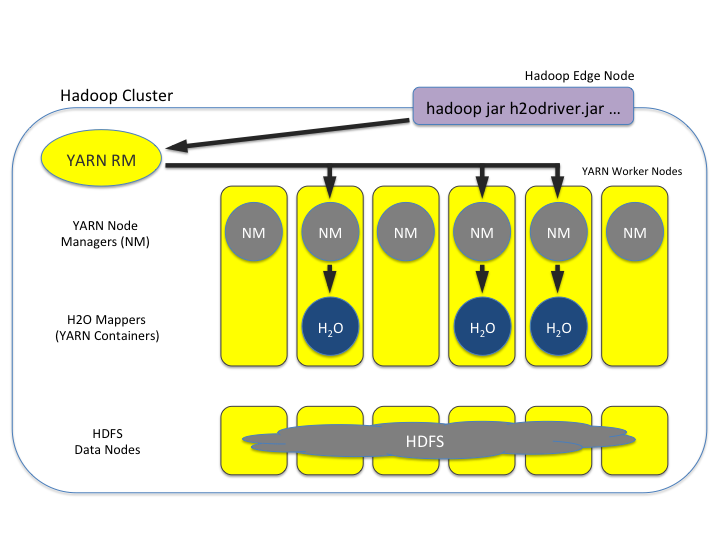
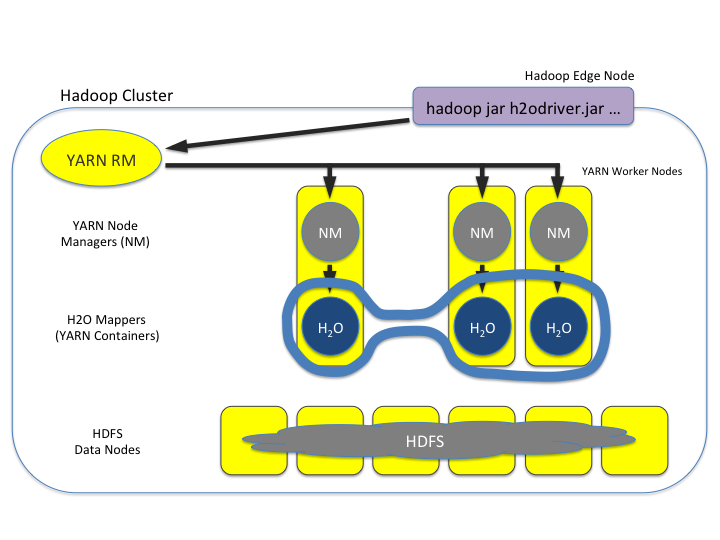
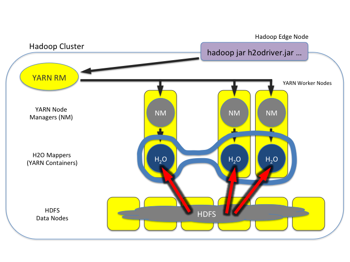
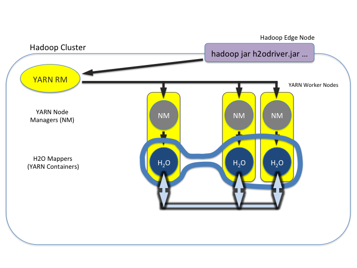

Hadoop users
============

This section describes how to use H2O-3 on Hadoop.

Supported Versions
------------------

-  CDH 5.4
-  CDH 5.5
-  CDH 5.6
-  CDH 5.7
-  CDH 5.8
-  CDH 5.9
-  CDH 5.10
-  CDH 5.13
-  CDH 5.14
-  CDH 5.15
-  CDH 5.16
-  CDH 6.0
-  CDH 6.1
-  CDH 6.2
-  CDH 6.3
-  CDP 7.0
-  CDP 7.1
-  CDP 7.2
-  HDP 2.2
-  HDP 2.3
-  HDP 2.4
-  HDP 2.5
-  HDP 2.6
-  HDP 3.0
-  HDP 3.1
-  MapR 4.0
-  MapR 5.0
-  MapR 5.1
-  MapR 5.2
-  MapR 6.0
-  MapR 6.1
-  IOP 4.2
-  EMR 6.10

.. note::
	
	Important points to remember:

	- The command used to launch H2O-3 differs from previous versions (see the `Walkthrough <https://docs.h2o.ai/h2o/latest-stable/h2o-docs/welcome.html#walkthrough>`__ section).
	- Launching H2O-3 on Hadoop requires at least 6GB of memory.
	- Each H2O-3 node runs as a mapper (run only one mapper per host).
	- There are no combiners or reducers.
	- Each H2O-3 cluster needs a unique job name.
	- ``-mapperXmx``, ``-nodes``, and ``-output`` are required.
	- Root permissions are not required (just unzip the H2O-3 ZIP file on any single node).

Prerequisite: Open communication paths
--------------------------------------

H2O-3 communicates using two communication paths. Verify these paths are open and available for use by H2O-3.

Path 1: Mapper to driver
~~~~~~~~~~~~~~~~~~~~~~~~

Optionally specify this port using the ``-driverport`` option in the ``hadoop jar`` command (see `Hadoop launch parameters <https://docs.h2o.ai/h2o/latest-stable/h2o-docs/welcome.html#hadoop-launch-parameters>`__). This port is opened on the driver host (the host where you entered the ``hadoop jar`` command). By default, this port is chosen randomly by the operating system. If you don't want to specify an exact port but still want to restrict the port to a certain range of ports, you can use the option ``-driverportrange``.

Path 2: Mapper to mapper
~~~~~~~~~~~~~~~~~~~~~~~~

Optionally specify this port using the ``-baseport`` option in the ``hadoop jar`` command see `Hadoop launch parameters <https://docs.h2o.ai/h2o/latest-stable/h2o-docs/welcome.html#hadoop-launch-parameters>`__). This port and the next subsequent port are opened on the mapper hosts (i.e. the Hadoop worker nodes) where the H2O-3 mapper nodes are placed by the Resource Manager. By default, ports ``54321`` and ``54322`` are used.

The mapper port is adaptive: if ``54321`` and ``54322`` are not available, H2O-3 will try ``54323`` and ``54324`` and so on. The mapper port is designed to be adaptive because sometimes if the YARN cluster is low on resources, YARN will place two H2O-3 mappers for the same H2O-3 cluster request on the same physical host. For this reason, we recommend opening a range of more than two ports: 20 ports should be sufficient.

Walkthrough
-----------

The following steps show you how to download or build H2O-3 with Hadoop and the parameters involved in launching H2O-3 from the command line.

1. Download the latest H2O-3 release for your version of Hadoop from the `Downloads page <http://h2o-release.s3.amazonaws.com/h2o/latest_stable.html>`__. Refer to the H2O-3 on Hadoop tab of the H2O-3 download page for the latest stable release or the nightly bleeding edge release.
2. Prepare the job input on the Hadoop node by unzipping the build file and changing to the directory with the Hadoop and H2O-3's driver jar files:

::

	unzip h2o-{{project_version}}-*.zip
	cd h2o-{{project_version}}-*

3. Launch H2O-3 nodes and form a cluster on the Hadoop cluster by running:

::

	hadoop jar h2odriver.jar -nodes 1 -mapperXmx 6g

	The above command launches a 6g node of H2O-3. We recommend you launch the cluster with at least four times the memory of your data file size.

	-  *mapperXmx* is the mapper size or the amount of memory allocated to each node. Specify at least 6 GB.

	-  *nodes* is the number of nodes requested to form the cluster.

	-  *output* is the name of the directory created each time a H2O-3 cluster is created so it is necessary for the name to be unique each time it is launched.

4. Monitor your job by directing your web browser to your standard job tracker web UI. To access H2O-3's web UI, direct your web browser to one of the launched instances. If you are unsure where your JVM is launched, review the output from your command after the nodes have clouded and formed a cluster. Any nodes' IP addresses will work as there is no master node:

::

	Determining driver host interface for mapper->driver callback...
	[Possible callback IP address: 172.16.2.181]
	[Possible callback IP address: 127.0.0.1]
	...
	Waiting for H2O cluster to come up...
	H2O node 172.16.2.184:54321 requested flatfile
	Sending flatfiles to nodes...
	 [Sending flatfile to node 172.16.2.184:54321]
	H2O node 172.16.2.184:54321 reports H2O cluster size 1
	H2O cluster (1 nodes) is up
	Blocking until the H2O cluster shuts down...

Hadoop launch parameters
------------------------

-  ``-h | -help``: Display help.
-  ``-jobname <JobName>``: Specify a job name for the Jobtracker to use; the default is ``H2O_nnnnn`` (where n is chosen randomly).
-  ``-principal <kerberos principal> -keytab <keytab path> | -run_as_user <hadoop username>``: Optionally specify a Kerberos principal and keytab or specify the ``run_as_user`` parameter to start clusters on behalf of the user/principal. Note that using ``run_as_user`` implies that the Hadoop cluster does not have Kerberos. 
-  ``-driverip <IP address of mapper -> driver callback interface>``: Specify the IP address for callback messages from the mapper to the driver.
-  ``-driverport <port of mapper -> callback interface>``: Specify the port number for callback messages from the mapper to the driver.
-  ``-driverportrange <range portX-portY of mapper-> callback interface>``: Specify the allowed port range of the driver callback interface, eg. 50000-55000.
-  ``-network <IPv4Network1>[,<IPv4Network2>]``: Specify the IPv4 network(s) to bind to the H2O-3 nodes; multiple networks can be specified to force H2O-3 to use the specified host in the Hadoop cluster. ``10.1.2.0/24`` allows 256 possibilities.
-  ``-timeout <seconds>``: Specify the timeout duration (in seconds) to wait for the cluster to form before failing. 
	
	.. note:: 

		The default value is 120 seconds; if your cluster is very busy, this may not provide enough time for the nodes to launch. If H2O does not launch, try increasing this value (for example, ``-timeout 600``).

-  ``-disown``: Exit the driver after the cluster forms.

    .. note:: 

    	For Qubole users who include the ``-disown`` flag, if your cluster is dying right after launch, add ``-Dmapred.jobclient.killjob.onexit=false`` as a launch parameter.

-  ``-notify <notification file name>``: Specify a file to write when the cluster is up. The file contains the IP and port of the embedded web server for one of the nodes in the cluster. All mappers must start before the H2O cluster is considered "up".
-  ``-mapperXmx <per mapper Java Xmx heap size>``: Specify the amount of memory to allocate to H2O (at least 6g).
-  ``-extramempercent``: Specify the extra memory for internal JVM use outside of the Java heap. This is a percentage of ``mapperXmx``. 
	
	.. admonition:: Recommendation 

		Set this to a high value when running XGBoost (for example, 120).

-  ``-n | -nodes <number of H2O nodes>``: Specify the number of nodes.
-  ``-nthreads <maximum number of vcores>``: Specify the maximum number of parallel threads of execution. This is usually capped by the max number of vcores.
-  ``-baseport <initialization port for H2O nodes>``: Specify the initialization port for the H2O-3 nodes. The default is ``54321``.
-  ``-license <license file name>``: Specify the directory of local filesytem location and the license file name.
-  ``-o | -output <HDFS output directory>``: Specify the HDFS directory for the output.
-  ``-flow_dir <Saved Flows directory>``: Specify the directory for saved flows. By default, H2O-3 will try to find the HDFS home directory to use as the directory for flows. If the HDFS home directory is not found, flows cannot be saved unless a directory is specified using ``-flow_dir``.
-  ``-port_offset <num>``: This parameter allows you to specify the relationship of the API port ("web port") and the internal communication port. The h2o port and API port are derived from each other, and we cannot fully decouple them. Instead, we allow you to specify an offset such that h2o port = api port + offset. This allows you to move the communication port to a specific range that can be firewalled.
-  ``-proxy``: Enables Proxy mode.
-  ``-report_hostname``: This flag allows the user to specify the machine hostname instead of the IP address when launching H2O Flow. This option can only be used when H2O-3 on Hadoop is started in Proxy mode (with ``-proxy``).

JVM arguments
~~~~~~~~~~~~~

-  ``-ea``: Enable assertions to verify boolean expressions for error detection.
-  ``-verbose:gc``: Include heap and garbage collection information in the logs. Deprecated in Java 9, removed in Java 10.
-  ``-XX:+PrintGCDetails``: Include a short message after each garbage collection. Deprecated in Java 9, removed in Java 10.
-  ``-Xlog:gc=info``: Prints garbage collection information into the logs. Introduced in Java 9. Usage enforced since Java 10. A replacement for ``-verbose:gc`` and ``-XX:+PrintGCDetails`` tags which are deprecated in Java 9 and removed in Java 10.

Configure HDFS
--------------
When running H2O-3 on Hadoop, you do not need to worry about configuring HDFS. The ``-hdfs_config`` flag is used to configure access to HDFS from a standalone cluster. However, it's also used for anything that requires Hadoop (such as Hive).

If you are accessing HDFS/Hive without Kerberos, then you will need to pass ``-hdfs_config`` and path to the ``core-site.xml`` that you got from your Hadoop edge node. If you are accessing Kerberized Hadoop, you will also need to pass ``hdfs-site.xml``.

Access S3 data from Hadoop
--------------------------

H2O-3 launched on Hadoop can access S3 data in addition to HDFS. To enable access, follow these instructions:

1. Edit Hadoop's ``core-site.xml``.
2. Set the ``HADOOP_CONF_DIR`` environment property to the directory containing the ``core_site.xml``. See the `core-site.xml example <https://docs.h2o.ai/h2o/latest-stable/h2o-docs/cloud-integration/ec2-and-s3.html#core-site-xml>`__ for more information. 

.. note::
	
	Typically the configuration directory for most Hadoop distributions is ``/etc/hadoop/conf``.

You can also pass the S3 credentials when launching H2O-3 with the Hadoop jar command. Use the ``-D`` flag to pass the credentials:

.. code-block:: bash
	
	hadoop jar h2odriver.jar -Dfs.s3.awsAccessKeyId="${AWS_ACCESS_KEY}" -Dfs.s3n.awsSecretAccessKey="${AWS_SECRET_KEY}" -n 3 -mapperXmx 10g  -output outputDirectory

where:

- ``AWS_ACCESS_KEY`` represents your username.
- ``AWS_SECRET_KEY`` represents your password.

3. Import the data with the S3 URL path:

.. tabs::
	.. code-tab:: bash Flow

		importFiles [ "s3:/path/to/bucket/file/file.tab.gz" ]

	.. code-tab:: python

		h2o.import_frame(path = "s3://bucket/path/to/file.csv")

	.. code-tab:: r R

		h2o.importFile(path = "s3://bucket/path/to/file.csv")

YARN best practices
-------------------

YARN (Yet another resource negotiator) is a resource management framework. H2O-3 can be launched as an application on YARN. If you want to run H2O-3 on Hadoop, essentailly, you are running H2O-3 on YARN. We strongly recommend using YARN to manage your cluster resources.

H2O-3 with YARN
~~~~~~~~~~~~~~~

When you launch H2O-3 on Hadoop using the ``hadoop jar`` command, YARN allocates the necessary resources to launch the requested number of nodes. H2O-3 launches as a map-reduce (V2) task where each mapper is an H2O-3 node of the specified size:

.. code-block:: bash
	
	hadoop jar h2odriver.jar -nodes 1 -mapperXmx 6g -output hdfsOutputDirName

Troubleshoot YARN
'''''''''''''''''

Occassionally, YARN may reject a job request. This usually occurs because there is either not enough memory to launch the job or because of an incorrect configuration.

Failure with too little memory
^^^^^^^^^^^^^^^^^^^^^^^^^^^^^^

If YARN rejects the job request, try re-launching the job with less memory first to see if that is the cause of the failure. Specify smaller values for ``-mapperXmx`` (we recommend a minimum or ``2g``) and ``-nodes`` (start with ``1``) to confirm that H2O-3 can launch successfully.

Failure due to configuration issues
^^^^^^^^^^^^^^^^^^^^^^^^^^^^^^^^^^^

To resolve configuration issues, adjust the maximum memory that YARN will allow when launching each mapper. If the cluster manager settings are configured for the default maximum memory size but the memory requried for the request exceeds that amount, YARN will not launch and H2O-3 will time out. 

If you are using the default configuration, change the configuration settings in your cluster manager to specify memory allocation when launching mapper tasks. To calculate the amount of memory required for a successful launch, the the following formula:

    YARN container size (``mapreduce.map.memory.mb``) = ``-mapperXmx`` value + (``-mapperXmx`` :math:`\times` ``-extramempercent`` [default is 10%])

The ``mapreduce.map.memory.mb`` value must be less than the YARN memory configuration values for the launch to succeed.

Configure YARN
~~~~~~~~~~~~~~

Cloudera
''''''''

For Cloudera, configure the settings in Cloudera Manager. Depending on how the cluster is configured, you may need to change the settings for more than one role group.

1. Click **Configuration** and enter the following search term in quotes: "yarn.nodemanager.resource.memory-mb".
2. Enter the amount of memory (in GB) to allocate in the **Value** field. If more than one group is listed, change the value for all listed groups.

   .. figure:: ../images/TroubleshootingHadoopClouderayarnnodemgr.png
      :alt: Cloudera configuration page with the value setting highlighted in red.

3. Click **Save Changes**.
4. Enter the following search term in quotes: "yarn.scheduler.maximum-allocation-mb".
5. Change the value, click **Save Changes**, and redeploy.

  .. figure:: ../images/TroubleshootingHadoopClouderayarnscheduler.png
     :alt: Cloudera configuration page with the value setting highlighted in red.

Hortonworks
'''''''''''

For Hortonworks, configure the settings in Ambari. See more on `Hortonworks configuration <http://docs.hortonworks.com/HDPDocuments/Ambari-1.6.0.0/bk_Monitoring_Hadoop_Book/content/monitor-chap2-3-3_2x.html>`__.

1. Select **YARN**, then click the **Configs** tab.
2. Select the group. 
3. Go to **Node Manager** section. Enter the amount of memory (in MB) to allocate in the **yarn.nodemanager.resource.memory-mb** entry field.

  .. figure:: ../images/TroubleshootingHadoopAmbariNodeMgr.png
     :alt: Ambari configuration node manager section with the yarn.nodemanager.resource.memory-mb section highlighted in red.

4. In the **Scheduler** section, enter the amount of memory (in MB) to allocate in the **yarn.scheduler.maximum-allocation-mb** entry field.

	.. figure:: ../images/TroubleshootingHadoopAmbariyarnscheduler.png
		:alt: Ambari configuration scheduler section with the yarn.scheduler.maximum-allocation-mb section highlighted in red.

5. Click **Save** and redeploy the cluster.

MapR
''''

1. Edit the **yarn-site.xml** file for the node running the ResourceManager.
2. Change the values for the ``yarn.nodemanager.resource.memory-mb`` and ``yarn.scheduler.maximum-allocation-mb`` properties.
3. Restart the ResourceManager and redeploy the cluster.

To verify the values were changes, check the values for the following properties:

.. code-block:: bash

     - <name>yarn.nodemanager.resource.memory-mb</name>
     - <name>yarn.scheduler.maximum-allocation-mb</name>

Limit CPU usage
~~~~~~~~~~~~~~~

To limit the number of CPUs used by H2O-3, use the ``-nthreads`` option and specify the maximum number of CPUs for a single container to use. The following example limits the number of CPUs to four:

.. code-block:: bash
	
	hadoop jar h2odriver.jar -nthreads 4 -nodes 1 -mapperXmx 6g -output hdfsOutputDirName

.. note::
	
	The default is 4 :math:`\times` the number of CPUs. You need to specify at least 4 CPUs or the following error message displays:

		``ERROR: nthreads invalid (must be >= 4)``

Specify a queue
~~~~~~~~~~~~~~~

If you do not specify a queue when launching H2O-3, H2O-3 jobs are submitted to the default queue. Jobs submitted to the default queue have a lower priority than jobs submitted to a specific queue.

To specify a queue with Hadoop, enter ``-Dmapreduce.job.queuename=<my-h2o-queue>`` (where ``<my-h2o-queue>`` is the name of the queue) when launching Hadoop.

Queue example
'''''''''''''

The following is an example of specifying a queue:

.. code-block:: bash

  hadoop jar h2odriver.jar -Dmapreduce.job.queuename=<my-h2o-queue> -nodes <num-nodes> -mapperXmx 6g -output hdfsOutputDirName

Specify an output directory
~~~~~~~~~~~~~~~~~~~~~~~~~~~

To prevent overwriting multiple users' files, each job must have a unique output directory name. Change the ``-output hdfsOutputDir`` argument (where ``hdfsOutputDir`` is the name of the directory).

Alternatively, you can delete the directory (manually or by using a script) instead of creating a unique directory each time you launch H2O-3.

YARN Customization
~~~~~~~~~~~~~~~~~~

Most of the configurable YARN variables are stored in ``yarn-site.xml``. To prevent settings from being overridden, you can mark a config as "final." If you change any values in ``yarn-site.xml``, you must restart YARN to confirm the changes.

Access your logs
~~~~~~~~~~~~~~~~

Access logs for a YARN job with the ``yarn logs -applicationId <application_id>`` command from a terminal.  

.. note::
	
	This command must be run by the same userID as the job owner and can only be run after the job has finished.

How H2O-3 runs on YARN
~~~~~~~~~~~~~~~~~~~~~~

Let's say that you have a Hadoop cluster with six worker nodes and six HDFS nodes. For architectural diagramming purposes, the worker nodes and HDFS nodes are shown as separate blocks in the following diagrams, but they may be running on the same physical machines. 

The ``hadoop jar`` command that you run on the edge node talks to the YARN Resource Manager to launch an H2O MRv2 (map-reduce V2) job. The Resource Manager then places the requested number of H2O-3 nodes (i.e. MRv2 mappers and YARN mappers), three in this example, on worker nodes. 

Once the H2O-3 job's nodes all start, they find each other and create an H2O cluster (as shown by the dark blue line encircling the three H2O-3 nodes in the following figure). The three H2O-3 nodes work together to perform distributed Machine Learning functions as a group.

.. note::
	
	The three worker nodes that are not part of the H2O-3 job have been removed from the following picture for explanatory purposes. They aren't part of the compute or memory resources used by the H2O-3 job, The full complement of HDFS is still available, though.

Data is then read in from HDFS once (seen by the red lines in the following figure) and stored as distributed H2O-3 frames in H2O-3's in-memory column-compressed distributed key-value (DKV) store. 

Machine Learning algorithms then run very fast in a parallel and distributed way (as shown by the light blue lines in the following image). They iteratively sweep the data over and over again to build models. This is why the in-memory storage makes H2O-3 fast.

.. note::
	
	The HDFS nodes have been removed from the following figure for explanatory purposes to emphasize that the data lives in-memory during the model training process.

Hadoop and AWS
--------------

AWS access credential configuration is provided to H2O-3 by the Hadoop environment itself. There are a number of Hadoop distributions, and each distribution supports different means/providers to configure access to AWS. It's considered best practice to follow your Hadoop provider's guide.

You can access multiple buckets with distinct credentials by means of the S3A protocol. See the `Hadoop documentation <https://hadoop.apache.org/docs/current/hadoop-aws/tools/hadoop-aws/index.html>`__ for more information. If you use derived distributions, we advise you to follow the respective documentation of your distribution and the specific version you are using.

