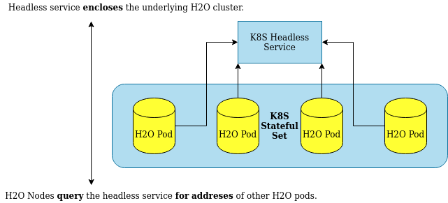

Kubernetes users
================

H2O-3 nodes must be treated as stateful by the Kubernetes environment because H2O-3 is a stateful application. H2O-3 nodes are, therefore, spawned together and deallocated together as a single unit. Subsequently, Kubernetes tooling for stateless applications is not applicable to H2O-3. In Kubernetes, a set of pods sharing a common state is named a `StatefulSet <https://kubernetes.io/docs/tutorials/stateful-application/basic-stateful-set/>`__.

H2O-3 pods deployed on a Kubernetes cluster require a `headless service <https://kubernetes.io/docs/concepts/services-networking/service/#headless-services>`__ for H2O-3 node discovery. The headless service returns a set of addresses to all the underlying pods instead of load-balancing incoming requests to the underlying H2O-3 pods.

Kubernetes integration
----------------------

This section outlines how to integrate H2O-3 and Kubernetes.

Requirements
~~~~~~~~~~~~

To spawn an H2O-3 cluster inside of a Kubernetes cluster, you need the following:

- A Kubernetes cluster: either local development (e.g. `ks3 <https://k3s.io/>`__) or easy start (e.g. `OpenShift <https://www.openshift.com/>`__ by RedHat)
- A Docker image with H2O-3 inside.
- A Kubernetes deployment definition with a StatefulSet of H2O-3 pods and a headless service.

Create the Docker image
~~~~~~~~~~~~~~~~~~~~~~~

A simple Docker container with H2O-3 running on startup is enough:

.. code:: bash

  FROM ubuntu:latest
  ARG H2O_VERSION
  RUN apt-get update \
    && apt-get install default-jdk unzip wget -y
  RUN wget http://h2o-release.s3.amazonaws.com/h2o/rel-zahradnik/1/h2o-${H2O_VERSION}
    && unzip h2o-${H2O_VERSION}.zip
  ENV H2O_VERSION ${H2O_VERSION}
  CMD java -jar h2o-${H2O_VERSION}/h2o.jar

To build the Docker image, user ``docker build . -t {image-name} --build-arg H2O_VERSION=<h2o-version>``. Make sure to replace ``{image-name}`` with the meaningful H2O deployment name and ``<h2o-version>`` with your H2O version.

.. note::
	
	For the rest of this example, the docker image will be named ``h2o-k8s``.

Create the headless service
~~~~~~~~~~~~~~~~~~~~~~~~~~~

First, create a headless service on Kubernetes:

.. code:: bash

  apiVersion: v1
  kind: Service
  metadata:
    name: h2o-service
    namespace: default
  spec:
    type: ClusterIP
    clusterIP: None
    selector:
      app: h2o-k8s
    ports:
    - protocol: TCP
      port: 54321

Where:

- ``clusterIP: None``: This setting defines the service as headless.
- ``port: 54321``: This setting is the default H2O-3 port. Users and client libraries use this port to talk to the H2O-3 cluster.
- ``app: h2o-k8s``: This setting is of great importance because it is the name of the application with the H2O-3 pods inside. While the name is arbitrarily chosen in this example, it must correspond to the chosen H2O-3 deployment name.

Create the H2O-3 deployment
~~~~~~~~~~~~~~~~~~~~~~~~~~~

We strongly recomming you run H2O-3 as a StatefulSet on your Kubernetes cluster. Treating H2O-3 nodes as stateful ensures the following:

- H2O-3 nodes will be treated as a single unit and will be brought up and down gracefully and together.
- No attempts will be made by a Kubernetes healthcheck to restart individual H2O-3 nodes in case of an error.
- The cluster will be restarted as a whole, if required.
- Persistent storages and volumes associated with the StatefulSet of H2O-3 nodes will not be deleted once the cluster is brought down.

.. code:: bash

  apiVersion: apps/v1
  kind: StatefulSet
  metadata:
    name: h2o-stateful-set
    namespace: default
  spec:
    serviceName: h2o-service
    podManagementPolicy: "Parallel"
    replicas: 3
    selector:
      matchLabels:
        app: h2o-k8s
    template:
      metadata:
        labels:
          app: h2o-k8s
      spec:
        terminationGracePeriodSeconds: 10
        containers:
          - name: h2o-k8s
            image: 'h2oai/h2o-open-source-k8s:latest'
            resources:
              requests:
                memory: "4Gi"
            ports:
              - containerPort: 54321
                protocol: TCP
            env:
            - name: H2O_KUBERNETES_SERVICE_DNS
              value: h2o-service.default.svc.cluster.local
            - name: H2O_NODE_LOOKUP_TIMEOUT
              value: '180'
            - name: H2O_NODE_EXPECTED_COUNT
              value: '3'

Where:

- ``H2O_KUBERNETES_SERVICE_DNS``: *Required* Crucial for clustering to work. This format usually follows the ``<service-name>.<project-namespace>.svc.cluster.local`` pattern. This setting enables H2O-3 node discovery through DNS. It must be modified to match the name of the headless service you created. Be sure you also pay attention to the rest of the address: it needs to match the specifics of your Kubernetes implementation.
- ``H2O_NODE_LOOKUP_TIMEOUT``: Node lookup constraint. Specify the time before the node lookup times out.
- ``H2O_NODE_EXPECTED_COUNT``: Node lookup constraint. Specify the expected number of H2O-3 pods to be discovered.
- ``H2O_KUBERNETES_API_PORT``: Port for Kubernetes API checks to listen on (defaults to ``8080``). 

If none of these optional lookup constraints are specified, a sensible default node lookup timeout will be set (defaults to three minutes). If any of the lookup constraints are defined, the H2O-3 node lookup is terminated on whichever condition is met first.

In the above example, ``'h2oai/h2o-open-source-k8s:latest'`` retrieves the latest build of the H2O-3 Docker image. Replace ``latest`` with ``nightly`` to get the bleeding-edge Docker image with H2O-3 inside. 

Documentation
'''''''''''''

The documentation for the official H2O-3 Docker images is available at the official `H2O-3 Docker Hub page <https://hub.docker.com/r/h2oai/h2o-open-source-k8s>`__.

Expose the H2O-3 cluster
~~~~~~~~~~~~~~~~~~~~~~~~

Exposing the H2O-3 cluster is the responsibility of the Kubernetes administrator. By default, an `Ingress <https://kubernetes.io/docs/concepts/services-networking/ingress/>`__ can be created. Different platforms offer different capabilities (e.g. OpenShift offers `Routes <https://docs.openshift.com/container-platform/4.3/networking/routes/route-configuration.html>`__).

See more information on `running an H2O-3 cluster on a Kubernetes cluster <https://www.pavel.cool/posts/h2o-kubernetes-support/>`__.

