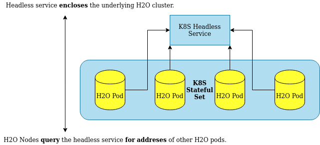

Kubernetes users
================

.. note::

   Kubernetes packages are part of H2O-3 Secure, the commercially supported tier of H2O-3. Contact enterprise@h2o.ai.

On Kubernetes, H2O-3 runs as a compute engine for a user or a job inside a namespace that your platform controls. The REST API on port 54321 is the control channel for the client code that drives the engine, not a public service. Before you deploy, read `Deployment model and responsibilities <../deployment-model.html>`__.

H2O-3 is a stateful application: its nodes start and stop together as a single unit, and if one node stops, the whole cluster becomes unhealthy and must restart. Kubernetes must treat H2O-3 nodes as stateful. A set of pods that share a common state is a `StatefulSet <https://kubernetes.io/docs/tutorials/stateful-application/basic-stateful-set/>`__. Tooling meant for stateless applications does not apply to H2O-3.

H2O-3 pods deployed on Kubernetes need a `headless service <https://kubernetes.io/docs/concepts/services-networking/service/#headless-services>`__ for node discovery. A headless service returns the addresses of all the underlying pods instead of load-balancing requests across them.

   Kubernetes headless service enclosing an H2O-3 cluster made of a StatefulSet

Requirements
------------

To spawn an H2O-3 cluster inside a Kubernetes cluster, you need the following:

-  A Kubernetes cluster, either a local one for development (for example, `k3s <https://k3s.io/>`__) or a managed one (for example, `OpenShift <https://www.openshift.com/>`__).
-  A container image with H2O-3 inside.
-  A Kubernetes deployment definition with a StatefulSet of H2O-3 pods, a headless service, and a NetworkPolicy.

For reproducibility, set resource requests and limits to equal values.

Container image
---------------

For an H2O-3 Secure deployment, use the container image supplied with your enterprise distribution. Contact enterprise@h2o.ai for access.

The examples below reference the public H2O-3 image, ``h2oai/h2o-open-source-k8s``, for illustration. See the `H2O-3 Docker Hub page <https://hub.docker.com/r/h2oai/h2o-open-source-k8s>`__ for details. The public image runs as ``root`` by default; the StatefulSet below overrides that with a pod security context.

Create the headless service
---------------------------

Create a headless service on Kubernetes:

.. code:: yaml

   apiVersion: v1
   kind: Service
   metadata:
     name: h2o-service
     namespace: default
   spec:
     type: ClusterIP
     clusterIP: None
     selector:
       app: h2o-k8s
     ports:
     - protocol: TCP
       port: 54321

Where:

-  ``clusterIP: None`` defines the service as headless.
-  ``port: 54321`` is the default H2O-3 control port. Client libraries use this port to talk to the H2O-3 cluster.
-  ``app: h2o-k8s`` selects the H2O-3 pods. The name is arbitrary, but it must match the pod label in the StatefulSet.

Create the H2O-3 deployment
---------------------------

Run H2O-3 as a StatefulSet. Treating H2O-3 nodes as stateful ensures the following:

-  Kubernetes treats the nodes as a single unit and brings them up and down gracefully and together.
-  A Kubernetes healthcheck does not try to restart individual H2O-3 nodes on error.
-  The cluster restarts as a whole when required.
-  Persistent storage and volumes associated with the StatefulSet remain after the cluster shuts down.

.. code:: yaml

   apiVersion: apps/v1
   kind: StatefulSet
   metadata:
     name: h2o-stateful-set
     namespace: default
   spec:
     serviceName: h2o-service
     podManagementPolicy: "Parallel"
     replicas: 3
     selector:
       matchLabels:
         app: h2o-k8s
     template:
       metadata:
         labels:
           app: h2o-k8s
       spec:
         terminationGracePeriodSeconds: 10
         automountServiceAccountToken: false
         securityContext:
           runAsNonRoot: true
           runAsUser: 10001
           runAsGroup: 10001
           fsGroup: 10001
           seccompProfile:
             type: RuntimeDefault
         containers:
           - name: h2o-k8s
             image: 'h2oai/h2o-open-source-k8s:latest'
             resources:
               requests:
                 memory: "4Gi"
                 cpu: "2"
               limits:
                 memory: "4Gi"
                 cpu: "2"
             ports:
               - containerPort: 54321
                 protocol: TCP
             securityContext:
               allowPrivilegeEscalation: false
               readOnlyRootFilesystem: true
               capabilities:
                 drop: ["ALL"]
             volumeMounts:
               - name: tmp
                 mountPath: /tmp
             readinessProbe:
               httpGet:
                 path: /kubernetes/isLeaderNode
                 port: 8081
               initialDelaySeconds: 5
               periodSeconds: 5
               failureThreshold: 1
             env:
             - name: H2O_KUBERNETES_SERVICE_DNS
               value: h2o-service.default.svc.cluster.local
             - name: H2O_NODE_LOOKUP_TIMEOUT
               value: '180'
             - name: H2O_NODE_EXPECTED_COUNT
               value: '3'
             - name: H2O_KUBERNETES_API_PORT
               value: '8081'
         volumes:
           - name: tmp
             emptyDir: {}

Pay attention to these settings:

-  ``app: h2o-k8s`` must match the name expected by the headless service so that node discovery works.
-  ``containerPort: 54321`` is the control port that client code connects to.
-  ``podManagementPolicy: "Parallel"`` makes Kubernetes spawn all H2O-3 nodes at once. Without it, Kubernetes starts the pods one after another, which prolongs startup.
-  The pod and container ``securityContext`` run H2O-3 as an unprivileged user with a read-only root filesystem. The ``emptyDir`` volume at ``/tmp`` gives the engine a writable location for temporary and spill files (``ice_root``). Adjust the user and group IDs to match your image and cluster policy.
-  ``automountServiceAccountToken: false`` keeps a Kubernetes API token out of the engine's pods. H2O-3 discovers its peers through DNS and doesn't need one.

The environment variables control node discovery:

-  ``H2O_KUBERNETES_SERVICE_DNS`` (**required**): Required for clustering to work. The format follows the ``<service-name>.<project-namespace>.svc.cluster.local`` pattern. This enables H2O-3 node discovery through DNS. Change it to match the headless service you created, and match the rest of the address to your Kubernetes implementation.
-  ``H2O_NODE_LOOKUP_TIMEOUT`` (optional): Node lookup constraint. The time before node lookup times out.
-  ``H2O_NODE_EXPECTED_COUNT`` (optional): Node lookup constraint. The expected number of H2O-3 pods to discover. Set it equal to the number of replicas.
-  ``H2O_KUBERNETES_API_PORT`` (optional): Port for Kubernetes API checks and probes to listen on. Defaults to ``8080``.

If you don't set any of the optional lookup constraints, H2O-3 uses a default node lookup timeout of three minutes. If you set any constraint, node lookup ends on whichever condition occurs first.

In this example, ``h2oai/h2o-open-source-k8s:latest`` retrieves the latest build of the public H2O-3 Docker image. For the nightly development build, replace ``latest`` with ``nightly``.

Restrict network access
-----------------------

Limit who can reach the engine with a NetworkPolicy. The following policy allows the control port only from pods labeled ``h2o-client: "true"`` in the same namespace (for example, the notebook or job that drives the engine), and allows node-to-node traffic only between the H2O-3 pods.

.. code:: yaml

   apiVersion: networking.k8s.io/v1
   kind: NetworkPolicy
   metadata:
     name: h2o-restrict
     namespace: default
   spec:
     podSelector:
       matchLabels:
         app: h2o-k8s
     policyTypes:
       - Ingress
     ingress:
       # Control port: only the client that drives this engine
       - from:
           - podSelector:
               matchLabels:
                 h2o-client: "true"
         ports:
           - protocol: TCP
             port: 54321
       # Node-to-node traffic between H2O-3 pods
       - from:
           - podSelector:
               matchLabels:
                 app: h2o-k8s
         ports:
           - protocol: TCP
             port: 54321
           - protocol: TCP
             port: 54322
           - protocol: UDP
             port: 54322

Probe traffic from the kubelet usually isn't subject to NetworkPolicy, but this depends on your network plugin. If readiness checks fail after you apply the policy, allow port 8081 from the node network.

.. _expose-the-h2o-3-cluster:

Connect to the cluster
----------------------

H2O-3 routes requests to the leader node. After the cluster forms and elects a leader, the ``readinessProbe`` on ``/kubernetes/isLeaderNode`` marks every node except the leader as not ready, so the service resolves only to the leader.

Client code running inside the cluster connects through the service:

.. code:: python

   import h2o
   h2o.connect(url="http://h2o-service.default.svc.cluster.local:54321")

Keep the control port cluster-internal. Don't publish it through a public Ingress, Route, or load balancer. If users outside the cluster must reach the engine, put it behind your platform's authenticating proxy with TLS, and enable H2O-3 authentication as well. See `Security <../security.html>`__.

Reproducibility
---------------

Three requirements make actions invoked on H2O-3 reproducible:

1. The same amount of memory on every node.
2. The same number of CPUs on every node.
3. The client sends requests only to the H2O-3 leader node.

A common mistake is to set different ``requests`` and ``limits`` for a pod. If the JVM inside the container uses a percentage of the available memory, that amount can differ every time H2O-3 starts, because Kubernetes might allocate a different amount of memory each time. The same applies to CPU ``requests`` and ``limits``. Without the ``readinessProbe`` on ``/kubernetes/isLeaderNode``, reproducibility is not guaranteed.

Install with Helm
-----------------

You can use `Helm <https://helm.sh/>`__ to deploy H2O-3 into a Kubernetes cluster. Helm requires you to set the ``KUBECONFIG`` environment variable or state the ``KUBECONFIG`` destination explicitly. Three steps install the H2O-3 Helm chart:

1. Add the H2O-3 Helm chart repository.
2. Install H2O-3 to Kubernetes with ``helm install``.
3. (Optional) Test the installation.

.. code:: bash

   helm repo add h2o https://charts.h2o.ai
   helm install basic-h2o h2o/h2o
   helm test basic-h2o

``helm install basic-h2o h2o/h2o`` installs a minimal H2O-3 cluster with few resources. To inspect the full list of configuration options, run ``helm show values h2o/h2o``.

The most common settings are the number of H2O-3 nodes (one pod per node) and the memory and CPU resources per node:

.. code:: yaml

   h2o:
     nodeCount: 3
   resources:
     cpu: 12
     memory: 32Gi
   ingress:
     enabled: false

Keep ``ingress.enabled: false`` so the control port stays cluster-internal, and apply the same security settings as the StatefulSet example: a non-root security context and a NetworkPolicy. Check ``helm show values h2o/h2o`` for the options your chart version supports.

Security
--------

Kubernetes deployments should follow the `deployment model <../deployment-model.html>`__:

-  **Run as non-root.** The public image's default user is ``root``. Set a pod ``securityContext`` as shown above, or use the H2O-3 Secure image.
-  **Restrict network access.** Apply a NetworkPolicy so only the launching client or platform reaches ports 54321 and 54322.
-  **Don't expose the control port publicly.** No public Ingress, Route, or load balancer for port 54321.
-  **Enable authentication and TLS** when traffic leaves a trusted network segment. Add the options described in `Security <../security.html>`__ to the container command.
-  **Run one engine per user or job,** and delete the StatefulSet when the work is done.

The default command used in the Docker images is:

.. code:: bash

   java -Djava.library.path=/opt/h2oai/h2o-3/xgb_lib_dir -XX:+UseContainerSupport -XX:MaxRAMPercentage=50 -jar /opt/h2oai/h2o-3/h2o.jar

To add security options, override the container ``command`` and append them. For example, to enable hash-file authentication with a ``realm.properties`` file stored in a Secret named ``h2o-auth``, add the following to the StatefulSet pod template:

.. code:: yaml

         containers:
           - name: h2o-k8s
             # ...image, resources, securityContext, probes, and env as above...
             command:
               - java
               - -Djava.library.path=/opt/h2oai/h2o-3/xgb_lib_dir
               - -XX:+UseContainerSupport
               - -XX:MaxRAMPercentage=50
               - -jar
               - /opt/h2oai/h2o-3/h2o.jar
               - -hash_login
               - -login_conf
               - /etc/h2o/realm.properties
             volumeMounts:
               - name: tmp
                 mountPath: /tmp
               - name: h2o-auth
                 mountPath: /etc/h2o
                 readOnly: true
         volumes:
           - name: tmp
             emptyDir: {}
           - name: h2o-auth
             secret:
               secretName: h2o-auth
