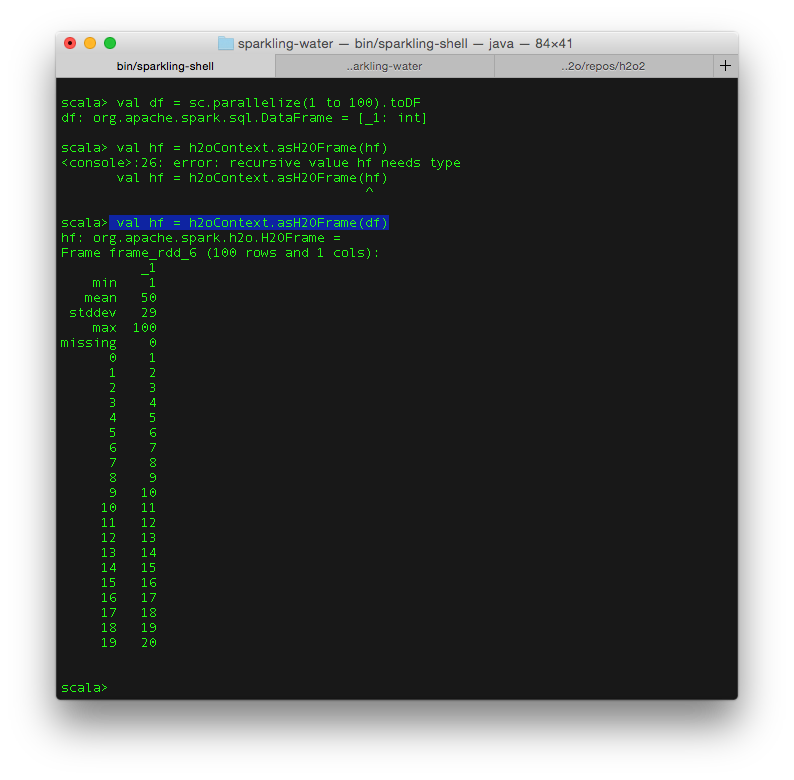

#Connecting R Studio to Sparkling Water

If you have connected to H2O from [RStudio](http://h2o-release.s3.amazonaws.com/h2o/{{branch_name}}/{{build_number}}/index.html#R) before, the process for connecting to Sparkling Water from RStudio is very similar. 

Before starting, verify [R](https://www.r-project.org/), [RStudio](https://www.rstudio.com/products/rstudio/download/), and [Sparkling Water](http://h2o.ai/download/) are installed. 

# 1. Start Sparkling Shell

```
export SPARK_HOME="/path/to/spark/installation"
export MASTER="local-cluster[3,2,1024]"
bin/sparkling-shell
```

To view the Sparkling Shell status, go to http://localhost:4040/. 

# 2. Create `H2OContext`

```
import org.apache.spark.h2o._
val h2oContext = new H2OContext(sc).start()
import h2oContext._
```

  
  
The last line of the output (appearing above the `scala` command prompt in the screenshot above) identifies the IP and port number of the H2O cluster. Copy these numbers to use in the next step.

# 3. Call `h2o.init()` from RStudio

In RStudio, use the IP and port number specified in the output from the previous step in the `h2o.init()` call:

  
  
# 4. Create a Spark DataFrame

The Spark DataFrame can then be published as an H2OFrame and accessed in R. 

In Sparkling Shell: 

```
val df = sc.parallelize(1 to 100).toDF // creates Spark DataFrame
 val hf = h2oContext.asH2OFrame(df) // publishes DataFrame as H2O's Frame
```

  
  
In the output in the screenshot above, the second line below the highlighted line displays the name of the published frame (`frame_rdd_6`). 

# 5. List Frames in RStudio

View all frames available in RStudio using `h2o.ls()`: 

  
  
  
 The frame can now be used in RStudio (for example, as shown in the screenshot below, using `h2o.getFrame`). 
 
   