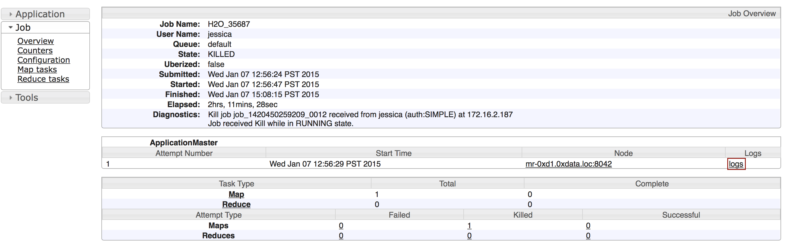
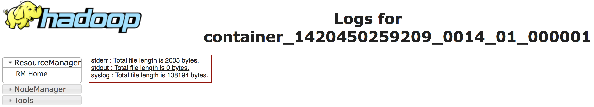
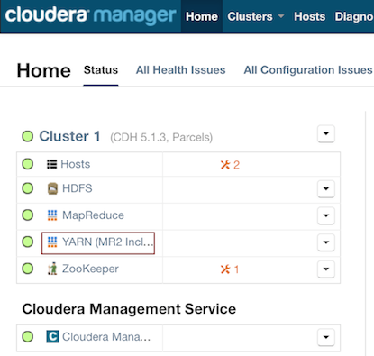
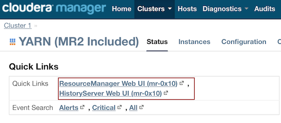
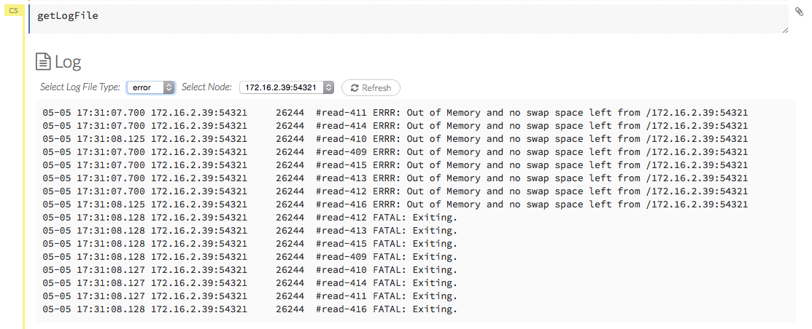

#Downloading Logs


##Accessing Logs

Depending on whether you are using Hadoop with H2O and whether the job is currently running, there are different ways of obtaining the logs for H2O. 

Copy and email the logs to support@h2o.ai or submit them to h2ostream@googlegroups.com with a brief description of your Hadoop environment, including the Hadoop distribution and version.

###Without Running Jobs

- If you are using Hadoop and the job is not running, view the logs by using the `yarn logs -applicationId` command. When you start an H2O instance, the complete command displays in the output: 

```
	jessica@mr-0x8:~/h2o-3.1.0.3008-cdh5.2$ hadoop jar h2odriver.jar -nodes 1 -mapperXmx 6g -output hdfsOutputDirName
Determining driver host interface for mapper->driver callback...
    [Possible callback IP address: 172.16.2.178]
    [Possible callback IP address: 127.0.0.1]
Using mapper->driver callback IP address and port: 172.16.2.178:52030
(You can override these with -driverif and -driverport.)
Memory Settings:
    mapreduce.map.java.opts:     -Xms1g -Xmx1g -Dlog4j.defaultInitOverride=true
    Extra memory percent:        10
    mapreduce.map.memory.mb:     1126
15/05/06 17:11:50 INFO client.RMProxy: Connecting to ResourceManager at mr-0x10.0xdata.loc/172.16.2.180:8032
15/05/06 17:11:52 INFO mapreduce.JobSubmitter: number of splits:1
15/05/06 17:11:52 INFO mapreduce.JobSubmitter: Submitting tokens for job: job_1430127035640_0075
15/05/06 17:11:52 INFO impl.YarnClientImpl: Submitted application application_1430127035640_0075
15/05/06 17:11:52 INFO mapreduce.Job: The url to track the job: http://mr-0x10.0xdata.loc:8088/proxy/application_1430127035640_0075/
Job name 'H2O_29570' submitted
JobTracker job ID is 'job_1430127035640_0075'
For YARN users, logs command is 'yarn logs -applicationId application_1430127035640_0075'
Waiting for H2O cluster to come up...

```


In the above example, the command is specified in the next to last line (`For YARN users, logs command is...`). The command is unique for each instance. In Terminal, enter `yarn logs -applicationId application_<UniqueID>` to view the logs (where `<UniqueID>` is the number specified in the next to last line of the output that displayed when you created the cluster). 
	
---

Use YARN to obtain the `stdout` and `stderr` logs that are used for troubleshooting. To learn how to access YARN based on management software, version, and job status, see [Accessing YARN](#AccessYARN). 

0. Click the **Applications** link to view all jobs, then click the **History** link for the job.
 
  

0. Click the **logs** link. 
	
	
	
0. 	Copy the information that displays and send it in an email to support@h2o.ai. 
	
	
 
---

###With Running Jobs


If you are using Hadoop and the job is still running: 

- Use YARN to obtain the `stdout` and `stderr` logs that are used for troubleshooting. To learn how to access YARN based on management software, version, and job status, see [Accessing YARN](#AccessYARN).

 0. Click the **Applications** link to view all jobs, then click the **ApplicationMaster** link for the job. 
	
	 

 0. Select the job from the list of active jobs. 
	
	 
	
 0. Click the **logs** link. 
	
	  
	
 0. Send the contents of the displayed files to support@h2o.ai. 
	
	 
	
---

- Go to the H2O web UI and select **Admin** > **View Log**. To filter the results select a node or log file type from the drop-down menus. To download the logs, click the **Download Logs** button. 

 When you view the log, the output displays the location of log directory after `Log dir:` (as shown in the last line in the following example): 

```
05-06 17:12:15.610 172.16.2.179:54321    26336  main      INFO: ----- H2O started  -----
05-06 17:12:15.731 172.16.2.179:54321    26336  main      INFO: Build git branch: master
05-06 17:12:15.731 172.16.2.179:54321    26336  main      INFO: Build git hash: 41d039196088df081ad77610d3e2d6550868f11b
05-06 17:12:15.731 172.16.2.179:54321    26336  main      INFO: Build git describe: jenkins-master-1187
05-06 17:12:15.732 172.16.2.179:54321    26336  main      INFO: Build project version: 0.3.0.1187
05-06 17:12:15.732 172.16.2.179:54321    26336  main      INFO: Built by: 'jenkins'
05-06 17:12:15.732 172.16.2.179:54321    26336  main      INFO: Built on: '2015-05-05 23:31:12'
05-06 17:12:15.732 172.16.2.179:54321    26336  main      INFO: Java availableProcessors: 8
05-06 17:12:15.732 172.16.2.179:54321    26336  main      INFO: Java heap totalMemory: 982.0 MB
05-06 17:12:15.732 172.16.2.179:54321    26336  main      INFO: Java heap maxMemory: 982.0 MB
05-06 17:12:15.732 172.16.2.179:54321    26336  main      INFO: Java version: Java 1.7.0_80 (from Oracle Corporation)
05-06 17:12:15.733 172.16.2.179:54321    26336  main      INFO: OS   version: Linux 3.13.0-51-generic (amd64)
05-06 17:12:15.733 172.16.2.179:54321    26336  main      INFO: Machine physical memory: 31.30 GB
05-06 17:12:15.733 172.16.2.179:54321    26336  main      INFO: X-h2o-cluster-id: 1430957535344
05-06 17:12:15.733 172.16.2.179:54321    26336  main      INFO: Possible IP Address: virbr0 (virbr0), 192.168.122.1
05-06 17:12:15.733 172.16.2.179:54321    26336  main      INFO: Possible IP Address: br0 (br0), 172.16.2.179
05-06 17:12:15.733 172.16.2.179:54321    26336  main      INFO: Possible IP Address: lo (lo), 127.0.0.1
05-06 17:12:15.733 172.16.2.179:54321    26336  main      INFO: Multiple local IPs detected:
05-06 17:12:15.733 172.16.2.179:54321    26336  main      INFO:   /192.168.122.1  /172.16.2.179
05-06 17:12:15.733 172.16.2.179:54321    26336  main      INFO: Attempting to determine correct address...
05-06 17:12:15.733 172.16.2.179:54321    26336  main      INFO: Using /172.16.2.179
05-06 17:12:15.734 172.16.2.179:54321    26336  main      INFO: Internal communication uses port: 54322
05-06 17:12:15.734 172.16.2.179:54321    26336  main      INFO: Listening for HTTP and REST traffic on  http://172.16.2.179:54321/
05-06 17:12:15.744 172.16.2.179:54321    26336  main      INFO: H2O cloud name: 'H2O_29570' on /172.16.2.179:54321, discovery address /237.61.246.13:60733
05-06 17:12:15.744 172.16.2.179:54321    26336  main      INFO: If you have trouble connecting, try SSH tunneling from your local machine (e.g., via port 55555):
05-06 17:12:15.744 172.16.2.179:54321    26336  main      INFO:   1. Open a terminal and run 'ssh -L 55555:localhost:54321 yarn@172.16.2.179'
05-06 17:12:15.744 172.16.2.179:54321    26336  main      INFO:   2. Point your browser to http://localhost:55555
05-06 17:12:15.979 172.16.2.179:54321    26336  main      INFO: Log dir: '/home2/yarn/nm/usercache/jessica/appcache/application_1430127035640_0075/h2ologs'
``` 

---

-  In Terminal, enter `cd /tmp/h2o-<UserName>/h2ologs` (where `<UserName>` is your computer user name), then enter `ls -l` to view a list of the log files. The `httpd` log contains the request/response status of all REST API transactions. 
  The rest of the logs use the format `h2o_\<IPaddress>\_<Port>-<LogLevel>-<LogLevelName>.log`, where `<IPaddress>` is the bind address of the H2O instance, `<Port>` is the port number, `<LogLevel>` is the numerical log level (1-6, with 6 as the highest severity level), and `<LogLevelName>` is the name of the log level (trace, debug, info, warn, error, or fatal). 

---

- Download the logs using R. In R, enter the command `h2o.downloadAllLogs(client = localH2O,filename = "logs.zip")` (where `client` is the H2O cluster and `filename` is the specified filename for the logs).

---

<a name="AccessYARN"></a>
##Accessing YARN

Methods for accessing YARN vary depending on the default management software and version, as well as job status. 


---
 
###Cloudera 5 & 5.2


1. In Cloudera Manager, click the **YARN** link in the cluster section.

  
  
2. In the Quick Links section, select **ResourceManager Web UI** if the job is running or select **HistoryServer Web UI** if the job is not running. 

 

---
 
###Ambari


1. From the Ambari Dashboard, select **YARN**. 

  

2. From the Quick Links drop-down menu, select **ResourceManager UI**.   

  

---

##For Non-Hadoop Users

###Without Current Jobs


If you are not using Hadoop and the job is not running: 

- In Terminal, enter `cd /tmp/h2o-<UserName>/h2ologs` (where `<UserName>` is your computer user name), then enter `ls -l` to view a list of the log files. The `httpd` log contains the request/response status of all REST API transactions. 
 The rest of the logs use the format `h2o_\<IPaddress>\_<Port>-<LogLevel>-<LogLevelName>.log`, where `<IPaddress>` is the bind address of the H2O instance, `<Port>` is the port number, `<LogLevel>` is the numerical log level (1-6, with 6 as the highest severity level), and `<LogLevelName>` is the name of the log level (trace, debug, info, warn, error, or fatal). 

---

###With Current Jobs

If you are not using Hadoop and the job is still running: 

- Go to the H2O web UI and select **Admin** > **Inspect Log** or go to http://localhost:54321/LogView.html.
	

  To download the logs, click the **Download Logs** button. 

 When you view the log, the output displays the location of log directory after `Log dir:` (as shown in the last line in the following example):

```
05-06 17:12:15.610 172.16.2.179:54321    26336  main      INFO: ----- H2O started  -----
05-06 17:12:15.731 172.16.2.179:54321    26336  main      INFO: Build git branch: master
05-06 17:12:15.731 172.16.2.179:54321    26336  main      INFO: Build git hash: 41d039196088df081ad77610d3e2d6550868f11b
05-06 17:12:15.731 172.16.2.179:54321    26336  main      INFO: Build git describe: jenkins-master-1187
05-06 17:12:15.732 172.16.2.179:54321    26336  main      INFO: Build project version: 0.3.0.1187
05-06 17:12:15.732 172.16.2.179:54321    26336  main      INFO: Built by: 'jenkins'
05-06 17:12:15.732 172.16.2.179:54321    26336  main      INFO: Built on: '2015-05-05 23:31:12'
05-06 17:12:15.732 172.16.2.179:54321    26336  main      INFO: Java availableProcessors: 8
05-06 17:12:15.732 172.16.2.179:54321    26336  main      INFO: Java heap totalMemory: 982.0 MB
05-06 17:12:15.732 172.16.2.179:54321    26336  main      INFO: Java heap maxMemory: 982.0 MB
05-06 17:12:15.732 172.16.2.179:54321    26336  main      INFO: Java version: Java 1.7.0_80 (from Oracle Corporation)
05-06 17:12:15.733 172.16.2.179:54321    26336  main      INFO: OS   version: Linux 3.13.0-51-generic (amd64)
05-06 17:12:15.733 172.16.2.179:54321    26336  main      INFO: Machine physical memory: 31.30 GB
05-06 17:12:15.733 172.16.2.179:54321    26336  main      INFO: X-h2o-cluster-id: 1430957535344
05-06 17:12:15.733 172.16.2.179:54321    26336  main      INFO: Possible IP Address: virbr0 (virbr0), 192.168.122.1
05-06 17:12:15.733 172.16.2.179:54321    26336  main      INFO: Possible IP Address: br0 (br0), 172.16.2.179
05-06 17:12:15.733 172.16.2.179:54321    26336  main      INFO: Possible IP Address: lo (lo), 127.0.0.1
05-06 17:12:15.733 172.16.2.179:54321    26336  main      INFO: Multiple local IPs detected:
05-06 17:12:15.733 172.16.2.179:54321    26336  main      INFO:   /192.168.122.1  /172.16.2.179
05-06 17:12:15.733 172.16.2.179:54321    26336  main      INFO: Attempting to determine correct address...
05-06 17:12:15.733 172.16.2.179:54321    26336  main      INFO: Using /172.16.2.179
05-06 17:12:15.734 172.16.2.179:54321    26336  main      INFO: Internal communication uses port: 54322
05-06 17:12:15.734 172.16.2.179:54321    26336  main      INFO: Listening for HTTP and REST traffic on  http://172.16.2.179:54321/
05-06 17:12:15.744 172.16.2.179:54321    26336  main      INFO: H2O cloud name: 'H2O_29570' on /172.16.2.179:54321, discovery address /237.61.246.13:60733
05-06 17:12:15.744 172.16.2.179:54321    26336  main      INFO: If you have trouble connecting, try SSH tunneling from your local machine (e.g., via port 55555):
05-06 17:12:15.744 172.16.2.179:54321    26336  main      INFO:   1. Open a terminal and run 'ssh -L 55555:localhost:54321 yarn@172.16.2.179'
05-06 17:12:15.744 172.16.2.179:54321    26336  main      INFO:   2. Point your browser to http://localhost:55555
05-06 17:12:15.979 172.16.2.179:54321    26336  main      INFO: Log dir: '/home2/yarn/nm/usercache/jessica/appcache/application_1430127035640_0075/h2ologs'
```

---

- In Terminal, enter `cd /tmp/h2o-<UserName>/h2ologs` (where `<UserName>` is your computer user name), then enter `ls -l` to view a list of the log files. The `httpd` log contains the request/response status of all REST API transactions. 
 The rest of the logs use the format `h2o_\<IPaddress>\_<Port>-<LogLevel>-<LogLevelName>.log`, where `<IPaddress>` is the bind address of the H2O instance, `<Port>` is the port number, `<LogLevel>` is the numerical log level (1-6, with 6 as the highest severity level), and `<LogLevelName>` is the name of the log level (trace, debug, info, warn, error, or fatal). 

---

- To view the REST API logs from R: 

  0. In R, enter `h2o.startLogging()`. The output displays the location of the REST API logs: 

		```		
		> h2o.startLogging()
		Appending REST API transactions to log file /var/folders/ylcq5nhky53hjcl9wrqxt39kz80000gn/T//RtmpE7X8Yv/rest.log 
		```
		
  0. Copy the displayed file path. 
	 Enter `less` and paste the file path. 
  0. Press Enter. A time-stamped log of all REST API transactions displays. 

```		
		------------------------------------------------------------

		Time:     2015-01-06 15:46:11.083
	
		GET       http://172.16.2.20:54321/3/Cloud.json
		postBody: 

		curlError:         FALSE
		curlErrorMessage:  
		httpStatusCode:    200
		httpStatusMessage: OK
		millis:            3

		{"__meta":{"schema_version":	1,"schema_name":"CloudV1","schema_type":"Iced"},"version":"0.1.17.1009","cloud_name":...[truncated]}
		-------------------------------------------------------------
```	
	
---

- Download the logs using R. In R, enter the command `h2o.downloadAllLogs(client = localH2O,filename = "logs.zip")` (where `client` is the H2O cluster and `filename` is the specified filename for the logs).

---

