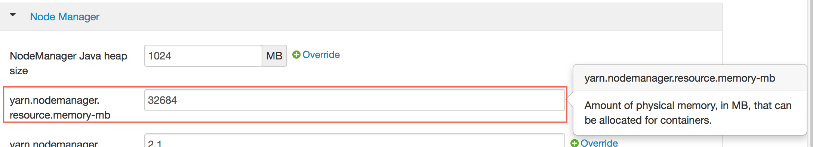

#YARN Best Practices

YARN (Yet Another Resource Manager) is a resource management framework. H2O can be launched as an application on YARN. If you want to run H2O on Hadoop, essentially, you are running H2O on YARN. If you are not currently using YARN to manage your cluster resources, we strongly recommend it. 

##Using H2O with YARN

When you launch H2O on Hadoop using the `hadoop jar` command, YARN allocates the necessary resources to launch the requested number of nodes. H2O launches as a MapReduce (V2) task, where each mapper is an H2O node of the specified size. 

`hadoop jar h2odriver.jar -nodes 1 -mapperXmx 6g -output hdfsOutputDirName`

Occasionally, YARN may reject a job request. This usually occurs because either there is not enough memory to launch the job or because of an incorrect configuration. 

If YARN rejects the job request, try launching the job with less memory to see if that is the cause of the failure. Specify smaller values for `-mapperXmx` (we recommend a minimum of `2g`) and `-nodes` (start with `1`) to confirm that H2O can launch successfully.

To resolve configuration issues, adjust the maximum memory that YARN will allow when launching each mapper. If the cluster manager settings are configured for the default maximum memory size but the memory required for the request exceeds that amount, YARN will not launch and H2O will time out. If you are using the default configuration, change the configuration settings in your cluster manager to specify memory allocation when launching mapper tasks. To calculate the amount of memory required for a successful launch, use the following formula: 

>YARN container size (`mapreduce.map.memory.mb`) = `-mapperXmx` value + (`-mapperXmx` * `-extramempercent` [default is 10%])

The `mapreduce.map.memory.mb` value must be less than the YARN memory configuration values for the launch to succeed. 

##Configuring YARN

**For Cloudera, configure the settings in Cloudera Manager. Depending on how the cluster is configured, you may need to change the settings for more than one role group.**
	
1. Click **Configuration** and enter the following search term in quotes: **yarn.nodemanager.resource.memory-mb**.

2. Enter the amount of memory (in GB) to allocate in the **Value** field. If more than one group is listed, change the values for all listed groups.
	
	
	
3. Click the **Save Changes** button in the upper-right corner. 
4. Enter the following search term in quotes: **yarn.scheduler.maximum-allocation-mb**
5. Change the value, click the **Save Changes** button in the upper-right corner, and redeploy.
	
 
		
	
**For Hortonworks,** [configure](http://docs.hortonworks.com/HDPDocuments/Ambari-1.6.0.0/bk_Monitoring_Hadoop_Book/content/monitor-chap2-3-3_2x.html) **the settings in Ambari.**

1. Select **YARN**, then click the **Configs** tab. 
2. Select the group. 
3. In the **Node Manager** section, enter the amount of memory (in MB) to allocate in the **yarn.nodemanager.resource.memory-mb** entry field. 
	
 
	  
4. In the **Scheduler** section, enter the amount of memory (in MB)to allocate in the **yarn.scheduler.maximum-allocation-mb** entry field. 
	
 

5. 	Click the **Save** button at the bottom of the page and redeploy the cluster. 
	
**For MapR:**

1. Edit the **yarn-site.xml** file for the node running the ResourceManager. 
2. Change the values for the `yarn.nodemanager.resource.memory-mb` and `yarn.scheduler.maximum-allocation-mb` properties.
3. Restart the ResourceManager and redeploy the cluster. 
	

To verify the values were changed, check the values for the following properties:
 	
	 - <name>yarn.nodemanager.resource.memory-mb</name>
	 - <name>yarn.scheduler.maximum-allocation-mb</name>

##Limiting CPU Usage 

To limit the number of CPUs used by H2O, use the `-nthreads` option and specify the maximum number of CPUs for a single container to use. The following example limits the number of CPUs to four:  

`hadoop jar h2odriver.jar -nthreads 4 -nodes 1 -mapperXmx 6g -output hdfsOutputDirName`
 
**Note**: The default is 4*the number of CPUs. You must specify at least four CPUs; otherwise, the following error message displays: 
`ERROR: nthreads invalid (must be >= 4)` 

##Specifying Queues

If you do not specify a queue when launching H2O, H2O jobs are submitted to the default queue. Jobs submitted to the default queue have a lower priority than jobs submitted to a specific queue. 

To specify a queue with Hadoop, enter `-Dmapreduce.job.queuename=<queue name>` 

(where `<queue name>` is the name of the queue) when launching Hadoop. 

For example, 

`hadoop jar h2odriver.jar -Dmapreduce.job.queuename=default -nodes 1 -mapperXmx 6g -output hdfsOutputDirName` 

##Specifying Output Directories

To prevent overwriting multiple users' files, each job must have a unique output directory name. Change the `-output hdfsOutputDir` argument (where `hdfsOutputDir` is the name of the directory. 

Alternatively, you can delete the directory (manually or by using a script) instead of creating a unique directory each time you launch H2O. 

##Customizing YARN

Most of the configurable YARN variables are stored in `yarn-site.xml`. To prevent settings from being overridden, you can mark a config as "final." If you change any values in `yarn-site.xml`, you must restart YARN to confirm the changes. 

##Accessing Logs

To learn how to access logs in YARN, refer to [Downloading Logs](http://h2o-release.s3.amazonaws.com/h2o/{{branch_name}}/{{build_number}}/docs-website/h2o-docs/index.html#Downloading%20Logs). 
