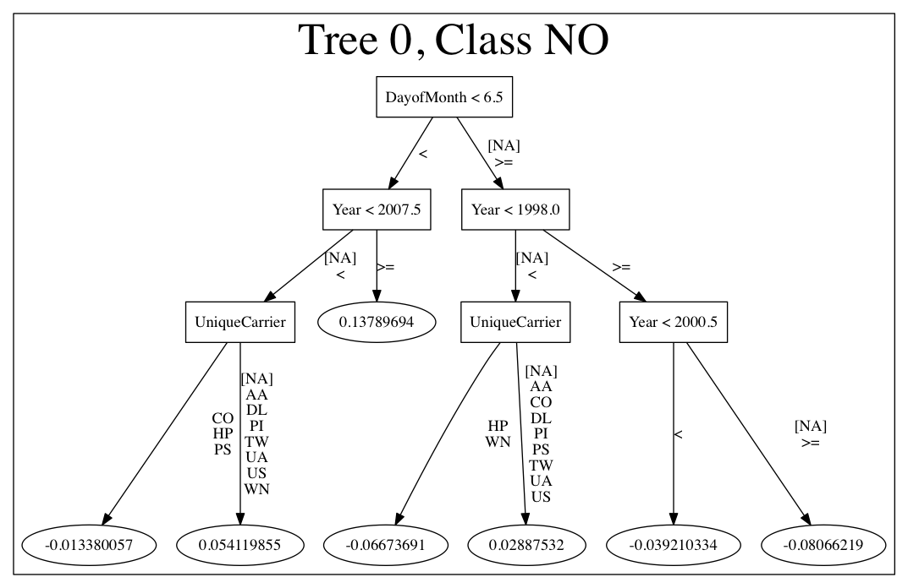

MOJO Quick Start
----------------

This section describes how to build and implement a MOJO (Model Object, Optimized) to use predictive scoring. Java developers should refer to the `Javadoc <http://docs.h2o.ai/h2o/latest-stable/h2o-genmodel/javadoc/index.html>`__ for more information, including packages.

What is a MOJO?
~~~~~~~~~~~~~~~

A MOJO (Model Object, Optimized) is an alternative to H2O's POJO. As with POJOs, H2O allows you to convert models that you build to MOJOs, which can then be deployed for scoring in real time.

**Notes**: 

- MOJOs are supported for AutoML, Deep Learning, DRF, GBM, GLM, GLRM, K-Means, Stacked Ensembles, SVM, Word2vec, and XGBoost models.
- MOJOs are only supported for encodings that are either default or ``enum``. 

Benefits of MOJOs over POJOs
~~~~~~~~~~~~~~~~~~~~~~~~~~~~

While POJOs continue to be supported, some customers encountered issues with large POJOs not compiling. (Note that POJOs are not supported for source files larger than 1G.) MOJOs do not have a size restriction and address the size issue by taking the tree out of the POJO and using generic tree-walker code to navigate the model. The resulting executable is much smaller and faster than a POJO.

At large scale, new models are roughly 20-25 times smaller in disk space, 2-3 times faster during "hot" scoring (after JVM is able to optimize the typical execution paths), and 10-40 times faster in "cold" scoring (when JVM doesn't know yet know the execution paths) compared to POJOs. The efficiency gains are larger the bigger the size of the model.

H2O conducted in-house testing using models with 5000 trees of depth 25. At very small scale (50 trees / 5 depth), POJOs were found to perform ≈10% faster than MOJOs for binomial and regression models, but 50% slower than MOJOs for multinomial models.

Building a MOJO
~~~~~~~~~~~~~~~

MOJOs are built in much the same way as POJOs. The example code below shows how to start H2O, build a model using either R or Python, and then compile and run the MOJO. This example uses GBM, but any supported algorithm can be used to build a model and run the MOJO. 

The examples below describe how to start H2O and create a model using R and Python. The ``download_mojo()`` function saves the model as a zip file. You can unzip the file to view the options used to build the file along with each tree built in the model. Note that each tree file is saved as a binary file type.

Step 1: Build and Extract a Model
'''''''''''''''''''''''''''''''''

.. example-code::
   .. code-block:: r

    # 1. Open a terminal window and start R.

    # 2. Run the following commands to build a simple GBM model.
    library(h2o)
    h2o.init(nthreads=-1)
    path <- system.file("extdata", "prostate.csv", package="h2o")
    h2o_df <- h2o.importFile(path)
    h2o_df$CAPSULE <- as.factor(h2o_df$CAPSULE)
    model <- h2o.gbm(y="CAPSULE",
                     x=c("AGE", "RACE", "PSA", "GLEASON"),
                     training_frame=h2o_df,
                     distribution="bernoulli",
                     ntrees=100,
                     max_depth=4,
                     learn_rate=0.1)

    # Download the MOJO and the resulting h2o-genmodel.jar file 
    # to a new **experiment** folder. Note that the ``h2o-genmodel.jar`` file 
    # is a library that supports scoring and contains the required readers 
    # and interpreters. This file is required when MOJO models are deployed 
    # to production. Be sure to specify the entire path, not just the relative path.
    modelfile <- h2o.download_mojo(model, path="~/experiments/", get_genmodel_jar=TRUE)
    print("Model saved to " + modelfile)
    Model saved to /Users/user/GBM_model_R_1475248925871_74.zip"

   .. code-block:: python

    # 1. Open a terminal window and start python.
    
    # 2. Run the following commands to build a simple GBM model. 
    # The model, along with the **h2o-genmodel.jar** file will 
    # then be downloaded to an **experiment** folder.
    import h2o
    from h2o.estimators.gbm import H2OGradientBoostingEstimator
    h2o.init()
    h2o_df = h2o.load_dataset("prostate.csv")
    h2o_df["CAPSULE"] = h2o_df["CAPSULE"].asfactor()
    model=H2OGradientBoostingEstimator(distribution="bernoulli",
                                       ntrees=100,
                                       max_depth=4,
                                       learn_rate=0.1)
    model.train(y="CAPSULE",
                x=["AGE","RACE","PSA","GLEASON"],
                training_frame=h2o_df)

    # Download the MOJO and the resulting ``h2o-genmodel.jar`` file 
    # to a new **experiment** folder. Note that the ``h2o-genmodel.jar`` file 
    # is a library that supports scoring and contains the required readers 
    # and interpreters. This file is required when MOJO models are deployed 
    # to production. Be sure to specify the entire path, not just the relative path.
    modelfile = model.download_mojo(path="~/experiment/", get_genmodel_jar=True)
    print("Model saved to " + modelfile)
    Model saved to /Users/user/GBM_model_python_1475248925871_888.zip           

   .. code-block:: Java

    // Compile the source: 
    javac -classpath ~/h2o/h2o-3.20.0.1/h2o.jar src/h2oDirect/h2oDirect.java

    // Execute as a classfile. This also downloads the LoanStats4 demo,
    // which trains a GBM model.
    Erics-MBP-2:h2oDirect ericgudgion$ java -cp /Users/ericgudgion/NetBeansProjects/h2oDirect/src/:/Users/ericgudgion/h2o/h2o-3.20.0.1/h2o.jar h2oDirect.h2oDirect /Demos/Lending-Club/LoanStats4.csv 
    ...
    06-14 20:40:29.420 192.168.1.160:54321   55005  main      INFO: Found XGBoost backend with library: xgboost4j_minimal
    06-14 20:40:29.428 192.168.1.160:54321   55005  main      INFO: Your system supports only minimal version of XGBoost (no GPUs, no multithreading)!
    06-14 20:40:29.428 192.168.1.160:54321   55005  main      INFO: ----- H2O started  -----
    06-14 20:40:29.428 192.168.1.160:54321   55005  main      INFO: Build git branch: rel-wright
    ...
    ...
    Starting H2O with IP 192.168.1.160:54321
    Loading data from file 
    ...
    Loaded file /Demos/Lending-Club/LoanStats4.csv size 3986423 Cols:19 Rows:39029
    ...
    Creating GBM Model
    Training Model
    ...
    Training Results
    Model Metrics Type: Binomial
     Description: N/A
     model id: GBM_model_1529023227180_1
     frame id: dataset-key
     MSE: 0.11255783
     RMSE: 0.3354964
     AUC: 0.82892376
     logloss: 0.36827797
     mean_per_class_error: 0.26371866
     default threshold: 0.261136531829834
    ...
    Model AUC 0.8289237508508612
    Model written out as a mojo to file /Demos/Lending-Club/LoanStats4.csv.zip

    // Save as h2oDirect.java
    package h2oDirect;

    import hex.tree.gbm.GBM;
    import hex.tree.gbm.GBMModel;
    import hex.tree.gbm.GBMModel.GBMParameters;
    import java.io.FileOutputStream;
    import java.io.IOException;
    import java.net.InetAddress;
    import water.Key;
    import water.fvec.Frame;
    import water.fvec.NFSFileVec;
    import water.parser.ParseDataset;
    import water.*;

    public class h2oDirect {

        
        /**
         * @param args the command line arguments
         */
        public static void main(String[] args) throws IOException {

          String h2oargs = "-nthreads -1 ";
          H2OApp.main(h2oargs.split(" "));
          System.out.println("Starting H2O with IP "+H2O.getIpPortString());
        
          H2O.waitForCloudSize(1, 3000);  
             
          System.out.println("Loading data from file ");
          String inputfile = args[0];
          NFSFileVec datafile = NFSFileVec.make(inputfile);
          Frame dataframe = ParseDataset.parse(Key.make("dataset-key") , datafile._key);
          System.out.println("Loaded file "+inputfile+" size "+datafile.byteSize()+" Cols:"+dataframe.numCols()+" Rows:"+dataframe.numRows());
          
          
          for (int v=0; v<dataframe.numCols(); v++) {
          System.out.println(dataframe.name(v)+" "+dataframe.vec(v).get_type_str());
          }
          
          int c = dataframe.find("bad_loan");
          
          dataframe.replace(c, dataframe.vec(c).toCategoricalVec());
          
          
          // drop the id and member_id columns from model
          dataframe.remove(dataframe.find("id"));
          dataframe.remove(dataframe.find("member_id"));
          
          System.out.println("Creating GBM Model");
          
          GBMParameters modelparms = new GBMParameters();
          modelparms._train = dataframe._key;
          modelparms._response_column = "bad_loan";
          
          System.out.println("Training Model");
          GBM model = new GBM(modelparms);
          GBMModel gbm = model.trainModel().get();
          
          System.out.println("Training Results");
          System.out.println(gbm._output);
          System.out.println("Model AUC "+gbm.auc());
          
          
          String outputfile = inputfile+".zip";
          FileOutputStream modeloutput = new FileOutputStream(outputfile);
          gbm.getMojo().writeTo(modeloutput);
          modeloutput.close();
          System.out.println("Model written out as a mojo to file "+outputfile);
          
          System.out.println("H2O shutdown....");
          H2O.shutdown(0);
         
        }
        
    }

   .. code-block:: scala

    import water.rapids.ast.prims.advmath.AstCorrelation

    object RandomForestFileInput {
      
      import water.H2O
      import water.H2OApp
      import water.fvec.Vec
      import water.fvec.NFSFileVec
      import water.fvec._
      
      import hex.tree.drf.DRF
      import hex.tree.drf.DRFModel
      import hex.tree.drf.DRFModel.DRFParameters
      import water.parser.ParseDataset
      import water.Key
      import water.Futures
      import water._

      import scala.io.Source
      import scala.reflect._
      
      import java.io.FileOutputStream
      import java.io.FileWriter
      
         def main(args: Array[String]): Unit = {
          println("H2O Random Forest FileInput example\n")
         
          if (args.length==0) {
            println("Input file missing, please pass datafile as the first parameter")
            return
          }
          
          // Start H2O instance and wait for 3 seconds for instance to complete startup
          println("Starting H2O")
          val h2oargs = "-nthreads -1 -quiet" 
          
          H2OApp.main(h2oargs.split(" "))
          H2O.waitForCloudSize(1, 3000) 
          
          println("H2O available")
          
          // Load datafile passed as first parameter and print the size of the file as confirmation
          println("Loading data from file ")
          val inputfile = args(0)
          val parmsfile = args(1)
          def ignore: Boolean = System.getProperty("ignore","false").toBoolean
          
          val datafile = NFSFileVec.make(inputfile)
          val dataframe = ParseDataset.parse(Key.make("dataset-key") , datafile._key)
          println("Loaded file "+inputfile+" size "+datafile.byteSize()+" Cols:"+dataframe.numCols()+" Rows:"+dataframe.numRows())
          
          println(dataframe.anyVec().get_type_str)
          
          for (v <- 0 to dataframe.numCols()-1) {
            println(dataframe.name(v))
          }
          
          val c = dataframe.find("bad_loan")
          dataframe.replace(c, dataframe.vecs()(c).toCategoricalVec())
          
          // drop the id and member_id columns from model
          dataframe.remove(dataframe.find("id"))
          dataframe.remove(dataframe.find("member_id"))
          
          
          // set Random Forest parameters
          println("creating model parameters")
          var modelparams = new DRFParameters()
          var fields = modelparams.getClass.getFields
          
          for (line <- Source.fromFile(parmsfile).getLines) {
              println("Reading parameter from file: "+line)
              var linedata = line.split(" ")
             

             for(v <- fields){
               if ( v.getName.matches(linedata(0))) {
                 val method1 = v.getDeclaringClass.getDeclaredField(linedata(0) )
                 method1.setAccessible(true)
                 println("Found "+linedata(0)+" Var "+v+" Accessable "+method1.isAccessible()+" Type "+method1.getType )
                 v.setAccessible(true)
                 v.setInt(modelparams, linedata(1).toInt)
               } 
             }       
          }
              
          
          // hard coded values
          modelparams._train = dataframe._key
          modelparams._response_column = "bad_loan"

           if (ignore) {
             println("Adding fields to ignore from file "+parmsfile+"FieldtoIgnore")
             var ignoreNames = new Array[String](dataframe.numCols())
             var in=0
             for (line <- Source.fromFile(parmsfile+"FieldtoIgnore").getLines) {
               ignoreNames(in) = line
               in+=1
             }
             modelparams._ignored_columns=ignoreNames
           }

          println("Parameters set ")
          
          // train model
          println("Starting training")
          var job: DRF = new DRF(modelparams)
          var model: DRFModel = job.trainModel().get()
         
          println("Training completed")
          
          // training metrics
          println(model._output.toString())
          println("Model AUC: "+model.auc())
          println(model._output._variable_importances)
         
          // If you want to look at variables that are important and then model on them
          // the following will write them out, then use only those in other model training
          // handy when you have a thousand columns but want to train on only the important ones.
          // Then before calling the model... call modelparams._ignored_columns= Array("inq_last_6mths")
          // FileWriter

           if (ignore) {
             val file = new FileOutputStream(parmsfile + "FieldtoIgnore")

             var n = 0
             var in = 0
             var ignoreNames = new Array[String](dataframe.numCols())
             val fieldnames = model._output._varimp._names
             println("Fields to add to _ignored_columns field")
             for (i <- model._output._varimp.scaled_values()) {
               if (i < 0.3) {
                 println(n + " = " + fieldnames(n) + " = " + i)
                 Console.withOut(file) {
                   println(fieldnames(n))
                 }
                 ignoreNames(in) = fieldnames(n)
                 in += 1
               }
               n += 1
             }
             println("Drop these:")
             for (i <- 0 to in) {
               println(fieldnames(i))
             }
             file.close()
             println()
           }
          
          // save model 
          var outputfile = inputfile+"_model_pojo.txt"
          var modeloutput: FileOutputStream = new FileOutputStream(outputfile)
          println("Saving model to "+outputfile)
          model.toJava(modeloutput, false, true)
          modeloutput.close()
          
          outputfile = inputfile+"_model_jason.txt"
          modeloutput = new FileOutputStream(outputfile)
          println("Saving Jason to "+outputfile)
          Console.withOut(modeloutput) {  println(model.toJsonString()) }
          modeloutput.close()
            
          outputfile = inputfile+"_model_mojo.zip"
          modeloutput = new FileOutputStream(outputfile)
          println("Saving mojo to "+outputfile)
          model.getMojo.writeTo(modeloutput)
          modeloutput.close()

           println(models: hex.ensemble.StackedEnsemble )
         
          println("Completed")
          H2O.shutdown(0)
       
      }
    }

Step 2: Compile and Run the MOJO
''''''''''''''''''''''''''''''''

1. Open a *new* terminal window and change directories to the **experiment** folder:
 
   ::

       $ cd experiment

2. Create your main program in the **experiment** folder by creating a new file called main.java (for example, using "vim main.java"). Include the following contents. Note that this file references the GBM model created above using R.

   .. code:: java

       import java.io.*;
       import hex.genmodel.easy.RowData;
       import hex.genmodel.easy.EasyPredictModelWrapper;
       import hex.genmodel.easy.prediction.*;
       import hex.genmodel.MojoModel;

       public class main {
         public static void main(String[] args) throws Exception {
           EasyPredictModelWrapper model = new EasyPredictModelWrapper(MojoModel.load("GBM_model_R_1475248925871_74.zip"));

           RowData row = new RowData();
           row.put("AGE", "68");
           row.put("RACE", "2");
           row.put("DCAPS", "2");
           row.put("VOL", "0");
           row.put("GLEASON", "6");

           BinomialModelPrediction p = model.predictBinomial(row);
           System.out.println("Has penetrated the prostatic capsule (1=yes; 0=no): " + p.label);
           System.out.print("Class probabilities: ");
           for (int i = 0; i < p.classProbabilities.length; i++) {
             if (i > 0) {
           System.out.print(",");
             }
             System.out.print(p.classProbabilities[i]);
           }
           System.out.println("");
         }
       }

 GBM and DRF return classProbabilities, but not all MOJOs will return a classProbabilities field. Refer to the ModelPrediction definition for each algorithm to find the correct field(s) to access. This is available in the H2O-3 GitHub repo at: https://github.com/h2oai/h2o-3/tree/master/h2o-genmodel/src/main/java/hex/genmodel/easy/prediction. You can also view the hex.genmodel.easy.prediction classes in the `Javadoc <http://docs.h2o.ai/h2o/latest-stable/h2o-genmodel/javadoc/index.html>`__.

 In addition to classProbabilities, in GBM and DRF you can choose to generate the ``leafNodeAssignments`` field, which will show the decision path through each tree. Note that this may slow down the MOJO as it adds computation. Below is the Java code showing how return the leaf node assignment:

 .. code:: java

     import java.io.*;
     import hex.genmodel.easy.RowData;
     import hex.genmodel.easy.EasyPredictModelWrapper;
     import hex.genmodel.easy.prediction.*;
     import hex.genmodel.MojoModel;

     public class main {
       public static void main(String[] args) throws Exception {
         EasyPredictModelWrapper.Config config = new EasyPredictModelWrapper.Config().setModel(MojoModel.load("GBM_model_R_1475248925871_74.zip")).setEnableLeafAssignment(true);
         EasyPredictModelWrapper model = new EasyPredictModelWrapper(config);

         RowData row = new RowData();
         row.put("AGE", "68");
         row.put("RACE", "2");
         row.put("DCAPS", "2");
         row.put("VOL", "0");
         row.put("GLEASON", "6");

         BinomialModelPrediction p = model.predictBinomial(row);
         System.out.println("Has penetrated the prostatic capsule (1=yes; 0=no): " + p.label);
         System.out.print("Class probabilities: ");
         for (int i = 0; i < p.classProbabilities.length; i++) {
           if (i > 0) {
             System.out.print(",");
           }
           System.out.print(p.classProbabilities[i]);
         }

         System.out.println("Leaf node assignments: ");
         for (int i=0; i < p.leafNodeAssignments; i++) {
           if (i > 0) {
             System.out.print.(p.leafNodeAssignments[i]);
           }
         }
         System.out.println("");
       }
     }

 For GLRM, the returned field is the X coefficients for the archetypes by default. In addition to that, you can choose to generate the reconstructed data row as well. Again, this may slow down the MOJO due to added computation. Below is the Java code showing how to obtain both the X factors and the reconstructed data after you have generated the GLRM MOJO:

 .. code:: java

     import java.io.*;
     import hex.genmodel.easy.RowData;
     import hex.genmodel.easy.EasyPredictModelWrapper;
     import hex.genmodel.easy.prediction.*;
     import hex.genmodel.MojoModel;

     public class main {
       public static void main(String[] args) throws Exception {
       EasyPredictModelWrapper.Config config = new EasyPredictModelWrapper.Config().setModel(MojoModel.load("GLRM_model_python_1530295749484_1.zip")).setEnableGLRMReconstrut(true);
       EasyPredictModelWrapper model = new EasyPredictModelWrapper(config);

       RowData row = new RowData();
       row.put("CAPSULE", "0");
       row.put("AGE", "68");
       row.put("RACE", "2");
       row.put("DPROS", "4");
       row.put("DCAPS", "2");
       row.put("PSA", "31.9");
       row.put("VOL", "0");
       row.put("GLEASON", "6");

       DimReductionModelPrediction p = model.predictDimReduction(row);
       String[] colnames = model.m.getNames();
       System.out.println("X coefficients for input row: ");
       for (int i = 0; i < p.dimensions.length; i++) {
         if (i > 0) {
           System.out.println(",");
         }
         System.out.print("Arch "+i+" coefficient: "+p.dimensions[i]);
       }
       System.out.println("");
       System.out.println("Reconstructed input row: ");
       for (int i = 0; i < p.reconstructed.length; i++) {
         if (i > 0) {
           System.out.println(",");
         }
         System.out.print(colnames[i]+": "+p.reconstructed[i]);
       }
       System.out.println("");
     }

3. Compile in terminal window 2.

   .. code:: bash

       $ javac -cp h2o-genmodel.jar -J-Xms2g -J-XX:MaxPermSize=128m main.java

4. Run in terminal window 2.

   .. code:: bash

       # Linux and OS X users
       $ java -cp .:h2o-genmodel.jar main 

       # Windows users
       $ java -cp .;h2o-genmodel.jar main  

 The following output displays:

 .. code:: bash

  Has penetrated the prostatic capsule (1 yes; 0 no): 0
  Class probabilities: 0.8059929056296662,0.19400709437033375

 If you have chosen to enable leaf node assignments, you will also see 100 leaf node assignments for your data row:

 .. code:: bash

  Has penetrated the prostatic capsule (1 yes; 0 no): 0
  Class probabilities: 0.8059929056296662,0.19400709437033375
  Leaf node assignments:   RRRR,RRR,RRRR,RRR,RRL,RRRR,RLRR,RRR,RRR,RRR,RLRR,...

 For the GLRM MOJO, after running the Java code, you will see the following:

 .. code:: bash

  X coefficients for input row:
  Arch 0 coefficient: -0.5930494611027051,
  Arch 1 coefficient: 1.0459847877909487,
  Arch 2 coefficient: 0.5849220609025815
  Reconstructed input row:
  CAPSULE: 0.5204822003860688,
  AGE: 10.520294102886806,
  RACE: 4.1422863477607645,
  DPROS: 2.970424071063664,
  DCAPS: 6.361196172145799,
  PSA: 1.905415090602722,
  VOL: 0.7123169431687857,
  GLEASON: 6.625024806196047

Viewing a MOJO Model
~~~~~~~~~~~~~~~~~~~~

A java tool for converting binary mojo files into human viewable graphs is packaged with H2O. This tool produces output that "dot" (which is part of Graphviz) can turn into an image. (See the `Graphviz home page <http://www.graphviz.org/>`__ for more information.)

Here is an example output for a GBM model:

The following code snippet shows how to download a MOJO from R and run the PrintMojo tool on the command line to make a .png file. To better control the look and feel of your tree, we provide two options for PrintMojo:

- ``--decimalplaces`` (or ``-d``) allows you to control the  number of decimal points shown for numbers. 
- ``--fontsize`` (or ``-f``) controls the font size.  The default font size is 14. When using this option, be careful not to choose a font size that  is so large that you cannot see your whole tree. We recommend using a font size no larger than  20.

::

  library(h2o)
  h2o.init()
  df <- h2o.importFile("http://s3.amazonaws.com/h2o-public-test-data/smalldata/airlines/allyears2k_headers.zip")
  model <- h2o.gbm(model_id = "model",
                  training_frame = df,
                  x = c("Year", "Month", "DayofMonth", "DayOfWeek", "UniqueCarrier"),
                  y = "IsDepDelayed",
                  max_depth = 3,
                  ntrees = 5)
  h2o.download_mojo(model, getwd(), FALSE)

  # Now download the latest stable h2o release from http://www.h2o.ai/download/
  # and run the PrintMojo tool from the command line.
  #
  # (For MacOS: brew install graphviz)
  java -cp h2o.jar hex.genmodel.tools.PrintMojo --tree 0 -i model.zip -o model.gv -f 20 -d 3
  dot -Tpng model.gv -o model.png
  open model.png

FAQ
~~~

-  **How can I use an XGBoost MOJO with Maven?**

  If you declare a dependency on h2o-genmodel, then you also have to include the h2o-genmodel-ext-xgboost dependency if you are planning to use XGBoost models. For example:

  ::

    <groupId>ai.h2o</groupId>
    <artifactId>xgboost-mojo-example</artifactId>
    <version>1.0-SNAPSHOT</version>

    dependency>
        <groupId>ai.h2o</groupId>
        <artifactId>h2o-genmodel-ext-xgboost</artifactId>
        <version>3.18.0.8</version>
    </dependency>
    <dependency>
        <groupId>ai.h2o</groupId>
        <artifactId>h2o-genmodel</artifactId>
        <version>3.18.0.8</version>
    </dependency>