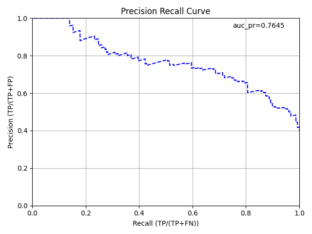

Performance and Prediction
==========================

Model Performance
-----------------

Given a trained H2O model, the ``h2o.performance()`` (R)/``model_performance()`` (Python) function computes a model's performance on a given dataset. 

**Notes**: 

- If the provided dataset does not contain the response/target column from the model object, no performance will be returned. Instead, a warning message will be printed.
- For binary classification problems, H2O uses the model along with the given dataset to calculate the threshold that will give the maximum F1 for the given dataset.

This section describes how H2O-3 can be used to evaluate model performance. Models can also be evaluated with specific model metrics, stopping metrics, and performance graphs. 

Evaluation Model Metrics
~~~~~~~~~~~~~~~~~~~~~~~~

H2O-3 provides a variety of metrics that can be used for evaluating supervised and unsupervised models. The metrics for this section only cover supervised learning models, which vary based on the model type (classification or regression).

.. _regression_metrics:

Regression
''''''''''

The following evaluation metrics are available for regression models. (Note that H2O-3 also calculates regression metrics for `Classification`_ problems.) 

- `R2 (R Squared)`_
- `MSE (Mean Squared Error)`_
- `RMSE (Root Mean Squared Error)`_
- `RMSLE (Root Mean Squared Logarithmic Error)`_
- `MAE (Mean Absolute Error)`_

Each metric is described in greater detail in the sections that follow. The examples are based off of a GBM model built using the **cars_20mpg.csv** dataset.

.. tabs::
   .. code-tab:: r R

        library(h2o)
        h2o.init()

        # import the cars dataset:
        cars <- h2o.importFile("https://s3.amazonaws.com/h2o-public-test-data/smalldata/junit/cars_20mpg.csv")

        # set the predictor names and the response column name
        predictors <- c("displacement", "power", "weight", "acceleration", "year")
        response <- "cylinders"

        # split into train and validation sets
        cars_splits <- h2o.splitFrame(data =  cars, ratios = 0.8, seed = 1234)
        train <- cars_splits[[1]]
        valid <- cars_splits[[2]]

        # build and train the model:
        cars_gbm <- h2o.gbm(x = predictors, 
                            y = response, 
                            training_frame = train,
                            validation_frame = valid,
                            distribution = "poisson",
                            seed = 1234)

        # retrieve the model performance
        perf <- h2o.performance(cars_gbm, valid)
        perf

   .. code-tab:: python
   
        import h2o
        from h2o.estimators.gbm import H2OGradientBoostingEstimator
        h2o.init()

        # import the cars dataset:
        # this dataset is used to classify whether or not a car is economical based on
        # the car's displacement, power, weight, and acceleration, and the year it was made
        cars = h2o.import_file("https://s3.amazonaws.com/h2o-public-test-data/smalldata/junit/cars_20mpg.csv")

        # set the predictor names and the response column name
        predictors = ["displacement","power","weight","acceleration","year"]
        response = "cylinders"

        # split into train and validation sets
        train, valid = cars.split_frame(ratios = [.8], seed = 1234)

        # train a GBM model
        cars_gbm = H2OGradientBoostingEstimator(distribution = "poisson", seed = 1234)
        cars_gbm.train(x = predictors, 
                       y = response, 
                       training_frame = train, 
                       validation_frame = valid)

        # retrieve the model performance
        perf = cars_gbm.model_performance(valid)
        perf

R2 (R Squared)
##############

The R2 value represents the degree that the predicted value and the actual value move in unison. The R2 value varies between 0 and 1 where 0 represents no correlation between the predicted and actual value and 1 represents complete correlation.

**Example**

Using the previous example, run the following to retrieve the R2 value.

.. tabs::
   .. code-tab:: r R

        # retrieve the r2 value:
        r2_basic <- h2o.r2(cars_gbm)
        r2_basic
        [1] 0.9930651

        # retrieve the r2 value for the validation data:
        r2_basic_valid <- h2o.r2(cars_gbm, valid = TRUE)
        r2_basic_valid
        [1] 0.9886704

   .. code-tab:: python
   
        # retrieve the r2 value:  
        cars_gbm.r2()
        0.9930650688408735

        # retrieve the r2 value for the validation data:
        cars_gbm.r2(valid=True)
        0.9886704207301097

MSE (Mean Squared Error)
########################

The MSE metric measures the average of the squares of the errors or deviations. MSE takes the distances from the points to the regression line (these distances are the “errors”) and squaring them to remove any negative signs. MSE incorporates both the variance and the bias of the predictor. 

MSE also gives more weight to larger differences. The bigger the error, the more it is penalized. For example, if your correct answers are 2,3,4 and the algorithm guesses 1,4,3, then the absolute error on each one is exactly 1, so squared error is also 1, and the MSE is 1. But if the algorithm guesses 2,3,6, then the errors are 0,0,2, the squared errors are 0,0,4, and the MSE is a higher 1.333. The smaller the MSE, the better the model's performance. (**Tip**: MSE is sensitive to outliers. If you want a more robust metric, try mean absolute error (MAE).)

MSE equation:

  .. math::
    MSE = \frac{1}{N} \sum_{i=1}^{N}(y_i -\hat{y}_i)^2

**Example**

Using the previous example, run the following to retrieve the MSE value.

.. tabs::
   .. code-tab:: r R

        # retrieve the mse value:
        mse_basic <- h2o.mse(cars_gbm)
        mse_basic
        [1] 0.01917327

        # retrieve the mse value for both the training and validation data:
        mse_basic_valid <- h2o.mse(cars_gbm, train = TRUE, valid = TRUE, xval = FALSE)
        mse_basic_valid
             train      valid 
        0.01917327 0.03769792 

   .. code-tab:: python
   
        # retrieve the mse value:
        cars_gbm.mse()
        0.019173269728097173

        # retrieve the mse value for the validation data:
        cars_gbm.mse(valid=True)
        0.03769791966551617

RMSE (Root Mean Squared Error)
##############################

The RMSE metric evaluates how well a model can predict a continuous value. The RMSE units are the same as the predicted target, which is useful for understanding if the size of the error is of concern or not. The smaller the RMSE, the better the model's performance. (**Tip**: RMSE is sensitive to outliers. If you want a more robust metric, try mean absolute error (MAE).)

RMSE equation:

  .. math::
     RMSE = \sqrt{\frac{1}{N} \sum_{i=1}^{N}(y_i -\hat{y}_i)^2 }

Where:

 - *N* is the total number of rows (observations) of your corresponding dataframe.
 - *y* is the actual target value.
 - :math:`\hat{y}` is the predicted target value.

**Example**

Using the previous example, run the following to retrieve the RMSE value.

.. tabs::
   .. code-tab:: r R

        # retrieve the rmse value:
        rmse_basic <- h2o.rmse(cars_gbm)
        rmse_basic
        [1] 0.1384676

        # retrieve the rmse value for both the training and validation data:
        rmse_basic_valid <- h2o.rmse(cars_gbm, train = TRUE, valid = TRUE, xval = FALSE)
        rmse_basic_valid
             train     valid 
        0.1384676  0.1941595  
   
   .. code-tab:: python
   
        # retrieve the rmse value:
        cars_gbm.rmse()
        0.13846757645057983

        # retrieve the rmse value for the validation data:
        cars_gbm.rmse(valid=True)
        0.19415952118172358

RMSLE (Root Mean Squared Logarithmic Error)
###########################################

This metric measures the ratio between actual values and predicted values and takes the log of the predictions and actual values. Use this instead of RMSE if an under-prediction is worse than an over-prediction. You can also use this when you don't want to penalize large differences when both of the values are large numbers. 

RMSLE equation:

  .. math::
     RMSLE = \sqrt{\frac{1}{N} \sum_{i=1}^{N} \big(ln \big(\frac{y_i +1} {\hat{y}_i +1}\big)\big)^2 }

Where:

 - *N* is the total number of rows (observations) of your corresponding dataframe.
 - *y* is the actual target value.
 - :math:`\hat{y}` is the predicted target value.

**Example**

Using the previous example, run the following to retrieve the RMSLE value.

.. tabs::
   .. code-tab:: r R

        # retrieve the rmsle value:
        rmsle_basic <- h2o.rmsle(cars_gbm)
        rmsle_basic
        [1] 0.02332083

        # retrieve the rmsle value for both the training and validation data:
        rmsle_basic_valid <- h2o.rmsle(cars_gbm, train = TRUE, valid = TRUE, xval = FALSE)
        rmsle_basic_valid
             train      valid 
        0.02332083 0.03359130  
   
   .. code-tab:: python
   
        # retrieve the rmsle value:
        cars_gbm.rmsle()
        0.023320830800314333

        # retrieve the rmsle value for the validation data:
        cars_gbm.rmsle(valid=True)
        0.03359130162278705

MAE (Mean Absolute Error)
#########################

The mean absolute error is an average of the absolute errors. The MAE units are the same as the predicted target, which is useful for understanding whether the size of the error is of concern or not. The smaller the MAE the better the model's performance. (**Tip**: MAE is robust to outliers. If you want a metric that is sensitive to outliers, try root mean squared error (RMSE).) 

MAE equation:

  .. math::
     MAE = \frac{1}{N} \sum_{i=1}^{N} | x_i - x |

Where:

  - *N* is the total number of errors
  - :math:`| x_i - x |` equals the absolute errors.

**Example**

Using the previous example, run the following to retrieve the MAE value.

.. tabs::
   .. code-tab:: r R

        # retrieve the mae value:
        mae_basic <- h2o.mae(cars_gbm)
        mae_basic
        [1] 0.06140515

        # retrieve the mae value for both the training and validation data:
        mae_basic_valid <- h2o.mae(cars_gbm, train = TRUE, valid = TRUE, xval = FALSE)
        mae_basic_valid
             train      valid 
        0.06140515 0.07947862 

   .. code-tab:: python
   
        # retrieve the mae value:
        cars_gbm.mae()
        0.06140515094616347

        # retrieve the mae value for the validation data:
        cars_gbm.mae(valid=True)
        0.07947861719967757

.. _classification_metrics:

Classification
''''''''''''''

H2O-3 calculates regression metrics for classification problems. The following additional evaluation metrics are available for classification models:

- `Gini Coefficient`_
- `Absolute MCC (Matthews Correlation Coefficient)`_
- `F1`_
- `F0.5`_
- `F2`_
- `Accuracy`_
- `Logloss`_
- `AUC (Area Under the ROC Curve)`_
- `AUCPR (Area Under the Precision-Recall Curve)`_
- `Kolmogorov-Smirnov (KS) Metric`_

Each metric is described in greater detail in the sections that follow. The examples are based off of a GBM model built using the **allyears2k_headers.zip** dataset.

.. tabs::
   .. code-tab:: r R

        library(h2o)
        h2o.init()
        # import the airlines dataset:
        # This dataset is used to classify whether a flight will be delayed 'YES' or not "NO"
        # original data can be found at http://www.transtats.bts.gov/
        airlines <-  h2o.importFile("http://s3.amazonaws.com/h2o-public-test-data/smalldata/airlines/allyears2k_headers.zip")

        # convert columns to factors
        airlines["Year"] <- as.factor(airlines["Year"])
        airlines["Month"] <- as.factor(airlines["Month"])
        airlines["DayOfWeek"] <- as.factor(airlines["DayOfWeek"])
        airlines["Cancelled"] <- as.factor(airlines["Cancelled"])
        airlines['FlightNum'] <- as.factor(airlines['FlightNum'])

        # set the predictor names and the response column name
        predictors <- c("Origin", "Dest", "Year", "UniqueCarrier", 
                        "DayOfWeek", "Month", "Distance", "FlightNum")
        response <- "IsDepDelayed"

        # split into train and validation
        airlines_splits <- h2o.splitFrame(data =  airlines, ratios = 0.8, seed = 1234)
        train <- airlines_splits[[1]]
        valid <- airlines_splits[[2]]

        # build a model
        airlines_gbm <- h2o.gbm(x = predictors, 
                                y = response, 
                                training_frame = train,
                                validation_frame = valid, 
                                sample_rate = 0.7, 
                                seed = 1234)

        # retrieve the model performance
        perf <- h2o.performance(airlines_gbm, valid)
        perf

   .. code-tab:: python

        import h2o
        from h2o.estimators.gbm import H2OGradientBoostingEstimator
        h2o.init()

        # import the airlines dataset:
        # This dataset is used to classify whether a flight will be delayed 'YES' or not "NO"
        # original data can be found at http://www.transtats.bts.gov/
        airlines= h2o.import_file("https://s3.amazonaws.com/h2o-public-test-data/smalldata/airlines/allyears2k_headers.zip")

        # convert columns to factors
        airlines["Year"]= airlines["Year"].asfactor()
        airlines["Month"]= airlines["Month"].asfactor()
        airlines["DayOfWeek"] = airlines["DayOfWeek"].asfactor()
        airlines["Cancelled"] = airlines["Cancelled"].asfactor()
        airlines['FlightNum'] = airlines['FlightNum'].asfactor()

        # set the predictor names and the response column name
        predictors = ["Origin", "Dest", "Year", "UniqueCarrier", 
                      "DayOfWeek", "Month", "Distance", "FlightNum"]
        response = "IsDepDelayed"

        # split into train and validation sets 
        train, valid = airlines.split_frame(ratios = [.8], seed = 1234)

        # train your model
        airlines_gbm = H2OGradientBoostingEstimator(sample_rate = .7, seed = 1234) 
        airlines_gbm.train(x = predictors, 
                           y = response, 
                           training_frame = train, 
                           validation_frame = valid)

        # retrieve the model performance
        perf = airlines_gbm.model_performance(valid)
        perf
                       

Gini Coefficient
################

The Gini index is a well-established method to quantify the inequality among values of a frequency distribution, and can be used to measure the quality of a binary classifier. A Gini index of zero expresses perfect equality (or a totally useless classifier), while a Gini index of one expresses maximal inequality (or a perfect classifier).

The Gini index is based on the Lorenz curve. The Lorenz curve plots the true positive rate (y-axis) as a function of percentiles of the population (x-axis).  

The Lorenz curve represents a collective of models represented by the classifier. The location on the curve is given by the probability threshold of a particular model. (i.e., Lower probability thresholds for classification typically lead to more true positives, but also to more false positives.)

The Gini index itself is independent of the model and only depends on the Lorenz curve determined by the distribution of the scores (or probabilities) obtained from the classifier.

.. figure:: images/lorenz_curve.png
  :alt: Lorenz curve

**Example**

Using the previous example, run the following to retrieve the Gini coefficient value.

.. tabs::
   .. code-tab:: r R

        # retrieve the gini value for the performance object:
        h2o.giniCoef(perf)
        [1] 0.482994

        # retrieve the gini value for both the training and validation data:
        h2o.giniCoef(airlines_gbm, train = TRUE, valid = TRUE, xval = FALSE)
            train     valid 
        0.5715841 0.4829940 

   .. code-tab:: python
    
        # retrieve the gini coefficient:
        perf.gini()
        0.48299402265152613

        # retrieve the gini coefficient for both the training and validation data:
        airlines_gbm.gini(train=True, valid=True, xval=False)
        {u'train': 0.5715841348613386, u'valid': 0.48299402265152613}

Absolute MCC (Matthews Correlation Coefficient)
###############################################

Setting the ``absolute_mcc`` parameter sets the threshold for the model's confusion matrix to a value that generates the highest Matthews Correlation Coefficient. The MCC score provides a measure of how well a binary classifier detects true and false positives, and true and false negatives. The MCC is called a correlation coefficient because it indicates how correlated the actual and predicted values are; 1 indicates a perfect classifier, -1 indicates a classifier that predicts the opposite class from the actual value, and 0 means the classifier does no better than random guessing. 

.. math::
    MCC = \frac{TP \; x \; TN \; - FP \; x \; FN}{\sqrt{(TP+FP)(TP+FN)(TN+FP)(TN+FN)}}

**Example**

Using the previous example, run the following to retrieve the MCC value.

.. tabs::
   .. code-tab:: r R

        # retrieve the mcc value for the performance object:
        h2o.mcc(perf)
          threshold absolute_mcc
        1 0.9636255   0.01754051
        2 0.9590688   0.03509912
        3 0.9536574   0.03924877
        4 0.9510736   0.04862323
        5 0.9488456   0.05738251

        ---
             threshold absolute_mcc
        395 0.10401437   0.04106864
        396 0.09852580   0.03994376
        397 0.09265314   0.03664277
        398 0.08816490   0.02184613
        399 0.06793601   0.01960485
        400 0.06432841   0.00000000

   .. code-tab:: python
    
        # retrieve the mcc for the performance object:
        perf.mcc()
        [0.5426977730968023, 0.36574105494931725]]

        # retrieve the mcc for both the training and validation data:
        airlines_gbm.mcc(train=True, valid=True, xval=False)
        {u'train': [[0.5203060957871319, 0.42414048381779923]], u'valid': [[0.5426977730968023, 0.36574105494931725]]}

F1
###

The F1 score provides a measure for how well a binary classifier can classify positive cases (given a threshold value). The F1 score is calculated from the harmonic mean of the precision and recall. An F1 score of 1 means both precision and recall are perfect and the model correctly identified all the positive cases and didn't mark a negative case as a positive case. If either precision or recall are very low it will be reflected with a F1 score closer to 0.

.. math::
    F1 = 2 \;\Big(\; \frac{(precision) \; (recall)}{precision + recall}\; \Big)

Where:

 - *precision* is the positive observations (true positives) the model correctly identified from all the observations it labeled as positive (the true positives + the false positives).
 - *recall* is the positive observations (true positives) the model correctly identified from all the actual positive cases (the true positives + the false negatives).

**Example**

Using the previous example, run the following to retrieve the F1 value.

.. tabs::
   .. code-tab:: r R

        # retrieve the F1 value for the performance object:
        h2o.F1(perf)
          threshold          f1
        1 0.9636255 0.001301801
        2 0.9590688 0.005197055
        3 0.9536574 0.006492101
        4 0.9510736 0.009937351
        5 0.9488456 0.013799051

        ---
             threshold        f1
        395 0.10401437 0.6916548
        396 0.09852580 0.6915972
        397 0.09265314 0.6914934
        398 0.08816490 0.6911301
        399 0.06793601 0.6910728
        400 0.06432841 0.6909173

   .. code-tab:: python
    
        # retrieve the F1 coefficient for the performance object:
        perf.F1()
        [[0.35417599264806404, 0.7228980805623143]]

        # retrieve the F1 coefficient for both the training and validation data:
        airlines_gbm.F1(train=True, valid=True, xval=False)
        {u'train': [[0.3869697386893616, 0.7451099672437997]], u'valid': [[0.35417599264806404, 0.7228980805623143]]}

F0.5
####

The F0.5 score is the weighted harmonic mean of the precision and recall (given a threshold value). Unlike the F1 score, which gives equal weight to precision and recall, the F0.5 score gives more weight to precision than to recall. More weight should be given to precision for cases where False Positives are considered worse than False Negatives. For example, if your use case is to predict which products you will run out of, you may consider False Positives worse than False Negatives. In this case, you want your predictions to be very precise and only capture the products that will definitely run out. If you predict a product will need to be restocked when it actually doesn't, you incur cost by having purchased more inventory than you actually need.

F0.5 equation:

 .. math::
   F0.5 = 1.25 \;\Big(\; \frac{(precision) \; (recall)}{0.25 \; precision + recall}\; \Big)

Where:

 - *precision* is the positive observations (true positives) the model correctly identified from all the observations it labeled as positive (the true positives + the false positives).
 - *recall* is the positive observations (true positives) the model correctly identified from all the actual positive cases (the true positives + the false negatives).

**Example**

Using the previous example, run the following to retrieve the F0.5 value.

.. tabs::
   .. code-tab:: r R

        # retrieve the F0.5 value for the performance object:
        h2o.F0point5(perf)
          threshold    f0point5
        1 0.9636255 0.003248159
        2 0.9590688 0.012892136
        3 0.9536574 0.016073725
        4 0.9510736 0.024478501
        5 0.9488456 0.033798057

        ---

             threshold  f0point5
        395 0.10401437 0.5837602
        396 0.09852580 0.5836502
        397 0.09265314 0.5835319
        398 0.08816490 0.5831181
        399 0.06793601 0.5830085
        400 0.06432841 0.5828314

   .. code-tab:: python
    
        # retrieve the F1 coefficient for the performance object:
        perf.F0point5()
        [[0.5426977730968023, 0.7047449127206096]]

        # retrieve the F1 coefficient for both the training and validation data:
        airlines_gbm.F0point5(train=True, valid=True, xval=False)
        {u'train': [[0.5529885092975969, 0.7331482319556736]], u'valid': [[0.5426977730968023, 0.7047449127206096]]}

F2
###

The F2 score is the weighted harmonic mean of the precision and recall (given a threshold value). Unlike the F1 score, which gives equal weight to precision and recall, the F2 score gives more weight to recall (penalizing the model more for false negatives then false positives). An F2 score ranges from 0 to 1, with 1 being a perfect model.

.. math::
    F2 = 5 \;\Big(\; \frac{(precision) \; (recall)}{4\;precision + recall}\; \Big)

**Example**

Using the previous example, run the following to retrieve the F2 value.

.. tabs::
   .. code-tab:: r R

        # retrieve the F2 value for the performance object:
        h2o.F2(perf)
          threshold           f2
        1 0.9636255 0.0008140229
        2 0.9590688 0.0032545021
        3 0.9536574 0.0040674657
        4 0.9510736 0.0062340760
        5 0.9488456 0.0086692674

        ---
             threshold        f2
        395 0.10401437 0.8484759
        396 0.09852580 0.8485351
        397 0.09265314 0.8484726
        398 0.08816490 0.8482538
        399 0.06793601 0.8483130
        400 0.06432841 0.8482192

   .. code-tab:: python
    
        # retrieve the F2 coefficient for the performance object:
        perf.F2()
        [[0.1957813426628461, 0.8502311018339048]]

        # retrieve the F2 coefficient for both the training and validation data:
        airlines_gbm.F2(train=True, valid=True, xval=False)
        {u'train': [[0.24968434313831914, 0.8548787509793371]], u'valid': [[0.1957813426628461, 0.8502311018339048]]}

Accuracy
########

In binary classification, Accuracy is the number of correct predictions made as a ratio of all predictions made. In multiclass classification, the set of labels predicted for a sample must exactly match the corresponding set of labels in y_true. 

Accuracy equation:

  .. math::
    Accuracy = \Big(\; \frac{\text{number correctly predicted}}{\text{number of observations}}\; \Big)

**Example**

Using the previous example, run the following to retrieve the Accurace value.

.. tabs::
   .. code-tab:: r R

        # retrieve the Accuracy value for the performance object:
        h2o.accuracy(perf)
          threshold  accuracy
        1 0.9636255 0.4725564
        2 0.9590688 0.4735877
        3 0.9536574 0.4739315
        4 0.9510736 0.4748482
        5 0.9488456 0.4758795

        ---
             threshold  accuracy
        395 0.10401437 0.5296207
        396 0.09852580 0.5293915
        397 0.09265314 0.5291624
        398 0.08816490 0.5283603
        399 0.06793601 0.5281311
        400 0.06432841 0.5277873
    
   .. code-tab:: python
    
        # retrieve the accuracy coefficient for the performance object:
        perf.accuracy()
        [[0.5231232172827827, 0.6816775524235132]]

        # retrieve the accuracy coefficient for both the training and validation data:
        airlines_gbm.accuracy(train=True, valid=True, xval=False)
        {u'train': [[0.5164521833040745, 0.7118095940540694]], u'valid': [[0.5231232172827827, 0.6816775524235132]]}

Logloss
#######

The logarithmic loss metric can be used to evaluate the performance of a binomial or multinomial classifier. Unlike AUC which looks at how well a model can classify a binary target, logloss evaluates how close a model's predicted values (uncalibrated probability estimates) are to the actual target value. For example, does a model tend to assign a high predicted value like .80 for the positive class, or does it show a poor ability to recognize the positive class and assign a lower predicted value like .50? Logloss can be any value greater than or equal to 0, with 0 meaning that the model correctly assigns a probability of 0% or 100%. 

Binary classification equation:

    .. math::
      Logloss = - \;\frac{1}{N} \sum_{i=1}^{N}w_i(\;y_i \ln(p_i)+(1-y_i)\ln(1-p_i)\;)

Multiclass classification equation:

    .. math::
      Logloss = - \;\frac{1}{N} \sum_{i=1}^{N}\sum_{j=1}^{C}w_i(\;y_i,_j \; \ln(p_i,_j)\;)

Where:

 - *N* is the total number of rows (observations) of your corresponding dataframe.
 - *w* is the per row user-defined weight (defaults is 1).
 - *C* is the total number of classes (C=2 for binary classification).
 - *p* is the predicted value (uncalibrated probability) assigned to a given row (observation).
 - *y* is the actual target value.

**Example**

Using the previous example, run the following to retrieve the logloss value.

.. tabs::
   .. code-tab:: r R

        # retrieve the logloss value for the performance object:
        h2o.logloss(perf)
        [1] 0.5967029

        # retrieve the logloss value for both the training and validation data:
        h2o.logloss(airlines_gbm, train = TRUE, valid = TRUE, xval = FALSE)
            train     valid 
        0.5607155 0.5967029 

   .. code-tab:: python
    
        # retrieve the logloss for the performance object:
        perf.logloss()
        0.5967028742962095

        # retrieve the logloss for both the training and validation data:
        airlines_gbm.logloss(train=True, valid=True, xval=False)
        {u'train': 0.5607154587919981, u'valid': 0.5967028742962095}

AUC (Area Under the ROC Curve)
##############################

This model metric is used to evaluate how well a binary classification model is able to distinguish between true positives and false positives. An AUC of 1 indicates a perfect classifier, while an AUC of .5 indicates a poor classifier, whose performance is no better than random guessing.

H2O uses the trapezoidal rule to approximate the area under the ROC curve. (**Tip**: AUC is usually not the best metric for an imbalanced binary target because a high number of True Negatives can cause the AUC to look inflated. For an imbalanced binary target, we recommend AUCPR or MCC.)

**Example**

Using the previous example, run the following to retrieve the AUC.

.. tabs::
   .. code-tab:: r R

        # retrieve the AUC for the performance object:
        h2o.auc(perf)
        [1] 0.741497

        # retrieve the AUC for both the training and validation data:
        h2o.auc(airlines_gbm, train = TRUE, valid = TRUE, xval = FALSE)
            train     valid 
        0.7857921 0.7414970

   .. code-tab:: python
    
        # retrieve the AUC for the performance object:
        perf.auc()
        0.7414970113257631

        # retrieve the AUC for both the training and validation data:
        airlines_gbm.auc(train=True, valid=True, xval=False)
        {u'train': 0.7857920674306693, u'valid': 0.7414970113257631}

AUCPR (Area Under the Precision-Recall Curve)
#############################################

This model metric is used to evaluate how well a binary classification model is able to distinguish between precision recall pairs or points. These values are obtained using different thresholds on a probabilistic or other continuous-output classifier. AUCPR is an average of the precision-recall weighted by the probability of a given threshold.

The main difference between AUC and AUCPR is that AUC calculates the area under the ROC curve and AUCPR calculates the area under the Precision Recall curve. The Precision Recall curve does not care about True Negatives. For imbalanced data, a large quantity of True Negatives usually overshadows the effects of changes in other metrics like False Positives. The AUCPR will be much more sensitive to True Positives, False Positives, and False Negatives than AUC. As such, AUCPR is recommended over AUC for highly imbalanced data.

**Example**

Using the previous example, run the following to retrieve the AUCPR.

.. tabs::
   .. code-tab:: r R

        # retrieve the AUCPR for the performance object:
        h2o.aucpr(perf)
        [1] 0.7609887

        # retrieve the AUCPR for both the training and validation data:
        h2o.aucpr(airlines_gbm, train = TRUE, valid = TRUE, xval = FALSE)
            train     valid 
        0.8019599 0.7609887

   .. code-tab:: python
    
        # retrieve the AUCPR for the performance object:
        perf.aucpr()
        0.7609887253334723

        # retrieve the AUCPR for both the training and validation data:
        airlines_gbm.aucpr(train=True, valid=True, xval=False)
        {u'train': 0.801959918132391, u'valid': 0.7609887253334723}

Multinomial AUC (Area Under the ROC Curve)
##########################################

This model metric is used to evaluate how well a multinomial classification model is able to distinguish between true positives and false positives across all domains. The metric is composed of these outputs:

  **One class versus one class (OVO) AUCs** - calculated for all pairwise combination of classes ((number of classes × number of classes / 2) - number of classes results)
  
  **One class versus rest classes (OVR) AUCs** - calculated for all combination one class and rest of classes (number of classes results)

  **Macro average OVR AUC** - Uniformly weighted average of all OVO AUCs

.. math::

   \frac{1}{c}\sum_{j=1}^{c} \text{AUC}(j, rest_j)

where :math:`c` is the number of classes and :math:`\text{AUC}(j, rest_j)` is the
AUC with class :math:`j` as the positive class and rest classes :math:`rest_j` as the
negative class. The result AUC is normalized by number of classes.

 
   **Weighted average OVR AUC** - Prevalence weighted average of all OVR AUCs

.. math::

  \frac{1}{\sum_{j=1}^{c} p(j)} \sum_{j=1}^{c} p(j) \text{AUC}(j, rest_j)

where :math:`c` is the number of classes, :math:`\text{AUC}(j, rest_j)` is the
AUC with class :math:`j` as the positive class and rest classes :math:`rest_j` as the
negative class and :math:`p(j)` is the prevalence of class :math:`j` (number of positives of class :math:`j`).
The result AUC is normalized by sum of all weights.

  **Macro average OVO AUC** - Uniformly weighted average of all OVO AUCs

.. math::

   \frac{2}{c}\sum_{j=1}^{c}\sum_{k \neq j}^{c} \frac{1}{2}(\text{AUC}(j | k) + \text{AUC}(k | j))

where :math:`c` is the number of classes and :math:`\text{AUC}(j, k)` is the
AUC with class :math:`j` as the positive class and class :math:`k` as the
negative class. The result AUC is normalized by number of all class combinations.
 
  **Weighted average OVO AUC** - Prevalence weighted average of all OVO AUCs

.. math::

   \frac{2}{\sum_{j=1}^{c}\sum_{k \neq j}^c p(j \cup k)}\sum_{j=1}^{c}\sum_{k \neq j}^c p(j \cup k)\frac{1}{2}(\text{AUC}(j | k) + \text{AUC}(k | j))

where :math:`c` is the number of classes, :math:`\text{AUC}(j, k)` is the
AUC with class :math:`j` as the positive class and class :math:`k` as the
negative class and :math:`p(j \cup k)` is prevalence of class :math:`j` and class :math:`k` (sum of positives of both classes). 
The result AUC is normalized by sum of all weights.

Result Multinomial AUC table could look for three classes like this:

**Note** Macro and weighted average values could be the same if the classes are same distributed. 

+--------------+--------------------+---------------------+----------+
| type         | first_class_domain | second_class_domain | auc      |
+==============+====================+=====================+==========+
| 1 vs Rest    | 1                  | None                | 0.996891 |
+--------------+--------------------+---------------------+----------+
| 2 vs Rest    | 2                  | None                | 0.996844 |
+--------------+--------------------+---------------------+----------+
| 3 vs Rest    | 3                  | None                | 0.987593 |
+--------------+--------------------+---------------------+----------+
| Macro OVR    | None               | None                | 0.993776 |
+--------------+--------------------+---------------------+----------+
| Weighted OVR | None               | None                | 0.993776 |
+--------------+--------------------+---------------------+----------+
| 1 vs 2       | 1                  | 2                   | 0.969807 |
+--------------+--------------------+---------------------+----------+
| 1 vs 3       | 1                  | 3                   | 1.000000 |
+--------------+--------------------+---------------------+----------+
| 2 vs 3       | 2                  | 3                   | 0.995536 |
+--------------+--------------------+---------------------+----------+
| Macro OVO    | None               | None                | 0.988447 |
+--------------+--------------------+---------------------+----------+
| Weighted OVO | None               | None                | 0.988447 |
+--------------+--------------------+---------------------+----------+

**Default value of AUC**

Multinomial AUC metric can be used for early stopping and during grid search as binomial AUC. 
In case of Multinomial AUC only one value need to be specified. The AUC calculation is disabled (set to ``NONE``) by default. 
However this option can be changed using ``auc_type`` model parameter to any other average type of AUC and AUCPR - ``MACRO_OVR``, ``WEIGHTED_OVR``, ``MACRO_OVO``, ``WEIGHTED_OVO``.

**Example**

.. tabs::
   .. code-tab:: r R

        library(h2o)
        h2o.init()

        # import the cars dataset:
        cars <- h2o.importFile("https://s3.amazonaws.com/h2o-public-test-data/smalldata/junit/cars_20mpg.csv")

        # set the predictor names and the response column name
        predictors <- c("displacement", "power", "weight", "acceleration", "year")
        response <- "cylinders"
        cars[,response] <- as.factor(cars[response])

        # split into train and validation sets
        cars_splits <- h2o.splitFrame(data =  cars, ratios = 0.8, seed = 1234)
        train <- cars_splits[[1]]
        valid <- cars_splits[[2]]

        # build and train the model:
        cars_gbm <- h2o.gbm(x = predictors, 
                            y = response, 
                            training_frame = train,
                            validation_frame = valid,
                            distribution = "multinomial",
                            seed = 1234)

        # get result on training data from h2o
        h2o_auc_table <- cars_gbm.multinomial_auc_table(train)
        print(h2o_auc_table)

        # get default value
        h2o_default_auc <- cars_gbm.auc()
        print(h2o_default_auc)

   .. code-tab:: python
   
        import h2o
        from h2o.estimators.gbm import H2OGradientBoostingEstimator
        h2o.init()

        # import the cars dataset:
        # this dataset is used to classify whether or not a car is economical based on
        # the car's displacement, power, weight, and acceleration, and the year it was made
        cars = h2o.import_file("https://s3.amazonaws.com/h2o-public-test-data/smalldata/junit/cars_20mpg.csv")

        # set the predictor names and the response column name
        predictors = ["displacement","power","weight","acceleration","year"]
        response = "cylinders"
        cars[response] = cars[response].asfactor()

        # split into train and validation sets
        train, valid = cars.split_frame(ratios = [.8], seed = 1234)

        # train a GBM model
        cars_gbm = H2OGradientBoostingEstimator(distribution = "multinomial", seed = 1234)
        cars_gbm.train(x = predictors, 
                       y = response, 
                       training_frame = train, 
                       validation_frame = valid)

        # get result on training data from h2o
        h2o_auc_table = cars_gbm.multinomial_auc_table(train)
        print(h2o_auc_table)

        # get default value
        h2o_default_auc = cars_gbm.auc()
        print(h2o_default_auc)

**Notes**
- Calculation of this metric can be very expensive on time and memory when the domain is big. So it is disabled by default.
- To enable it setup system property ``sys.ai.h2o.auc.maxClasses`` to a number.

Multinomial AUCPR (Area Under the Precision-Recall Curve)
#########################################################

This model metric is used to evaluate how well a multinomial classification model is able to distinguish between precision recall pairs or points across all domains. The metric is composed of these outputs:

  **One class versus one class (OVO) AUCPRs** - calculated for all pairwise AUCPR combination of classes ((number of classes × number of classes / 2) - number of classes results)
  
  **One class versus rest classes (OVR) AUCPRs** - calculated for all combination one class and rest of classes AUCPR (number of classes results)

  **Macro average OVR AUCPR** - Uniformly weighted average of all OVR AUCPRs

.. math::

   \frac{1}{c}\sum_{j=1}^{c} \text{AUCPR}(j, rest_j)

where :math:`c` is the number of classes and :math:`\text{AUCPR}(j, rest_j)` is the
AUCPR with class :math:`j` as the positive class and rest classes :math:`rest_j` as the
negative class. The result AUCPR is normalized by number of classes.

 
   **Weighted average OVR AUCPR** - Prevalence weighted average of all OVR AUCPRs

.. math::

  \frac{1}{\sum_{j=1}^{c} p(j)} \sum_{j=1}^{c} p(j) \text{AUCPR}(j, rest_j)

where :math:`c` is the number of classes, :math:`\text{AUCPR}(j, rest_j)` is the
AUCPR with class :math:`j` as the positive class and rest classes :math:`rest_j` as the
negative class and :math:`p(j)` is the prevalence of class :math:`j` (number of positives of class :math:`j`). 
The result AUCPR is normalized by sum of all weights.

  **Macro average OVO AUCPR** - Uniformly weighted average of all OVO AUCPRs

.. math::

   \frac{2}{c}\sum_{j=1}^{c}\sum_{k \neq j}^{c} \frac{1}{2}(\text{AUCPR}(j | k) + \text{AUCPR}(k | j))

where :math:`c` is the number of classes and :math:`\text{AUCPR}(j, k)` is the
AUCPR with class :math:`j` as the positive class and class :math:`k` as the
negative class. The result AUCPR is normalized by number of all class combinations.
 
  **Weighted average OVO AUCPR** - Prevalence weighted average of all OVO AUCPRs

.. math::

   \frac{2}{\sum_{j=1}^{c}\sum_{k \neq j}^c p(j \cup k)}\sum_{j=1}^{c}\sum_{k \neq j}^c p(j \cup k)\frac{1}{2}(\text{AUCPR}(j | k) + \text{AUCPR}(k | j))

where :math:`c` is the number of classes, :math:`\text{AUCPR}(j, k)` is the
AUCPR with class :math:`j` as the positive class and class :math:`k` as the
negative class and :math:`p(j \cup k)` is prevalence of class :math:`j` and class :math:`k` (sum of positives of both classes).
The result AUCPR is normalized by sum of all weights.

Result Multinomial AUCPR table could look for three classes like this:

**Note** Macro and weighted average values could be the same if the classes are same distributed. 

+--------------+--------------------+---------------------+----------+
| type         | first_class_domain | second_class_domain | aucpr    |
+==============+====================+=====================+==========+
| 1 vs Rest    | 1                  | None                | 0.996891 |
+--------------+--------------------+---------------------+----------+
| 2 vs Rest    | 2                  | None                | 0.996844 |
+--------------+--------------------+---------------------+----------+
| 3 vs Rest    | 3                  | None                | 0.987593 |
+--------------+--------------------+---------------------+----------+
| Macro OVR    | None               | None                | 0.993776 |
+--------------+--------------------+---------------------+----------+
| Weighted OVR | None               | None                | 0.993776 |
+--------------+--------------------+---------------------+----------+
| 1 vs 2       | 1                  | 2                   | 0.969807 |
+--------------+--------------------+---------------------+----------+
| 1 vs 3       | 1                  | 3                   | 1.000000 |
+--------------+--------------------+---------------------+----------+
| 2 vs 3       | 2                  | 3                   | 0.995536 |
+--------------+--------------------+---------------------+----------+
| Macro OVO    | None               | None                | 0.988447 |
+--------------+--------------------+---------------------+----------+
| Weighted OVO | None               | None                | 0.988447 |
+--------------+--------------------+---------------------+----------+

**Default value of AUCPR**

Multinomial AUCPR metric can be also used for early stopping and during grid search as binomial AUCPR. 
In case of Multinomial AUCPR only one value need to be specified. The AUCPR calculation is disabled (set to ``NONE``) by default. 
However this option can be changed using ``auc_type`` model parameter to any other average type of AUC and AUCPR - ``MACRO_OVR``, ``WEIGHTED_OVR``, ``MACRO_OVO``, ``WEIGHTED_OVO``.

**Example**

.. tabs::
   .. code-tab:: r R

        library(h2o)
        h2o.init()

        # import the cars dataset:
        cars <- h2o.importFile("https://s3.amazonaws.com/h2o-public-test-data/smalldata/junit/cars_20mpg.csv")

        # set the predictor names and the response column name
        predictors <- c("displacement", "power", "weight", "acceleration", "year")
        response <- "cylinders"
        cars[,response] <- as.factor(cars[response])

        # split into train and validation sets
        cars_splits <- h2o.splitFrame(data =  cars, ratios = 0.8, seed = 1234)
        train <- cars_splits[[1]]
        valid <- cars_splits[[2]]

        # build and train the model:
        cars_gbm <- h2o.gbm(x = predictors, 
                            y = response, 
                            training_frame = train,
                            validation_frame = valid,
                            distribution = "multinomial",
                            seed = 1234)

        # get result on training data from h2o
        h2o_aucpr_table <- cars_gbm.multinomial_aucpr_table(train)
        print(h2o_aucpr_table)

        # get default value
        h2o_default_aucpr <- cars_gbm.aucpr()
        print(h2o_default_aucpr)

   .. code-tab:: python
   
        import h2o
        from h2o.estimators.gbm import H2OGradientBoostingEstimator
        h2o.init()

        # import the cars dataset:
        # this dataset is used to classify whether or not a car is economical based on
        # the car's displacement, power, weight, and acceleration, and the year it was made
        cars = h2o.import_file("https://s3.amazonaws.com/h2o-public-test-data/smalldata/junit/cars_20mpg.csv")

        # set the predictor names and the response column name
        predictors = ["displacement","power","weight","acceleration","year"]
        response = "cylinders"
        cars[response] = cars[response].asfactor()

        # split into train and validation sets
        train, valid = cars.split_frame(ratios = [.8], seed = 1234)

        # train a GBM model
        cars_gbm = H2OGradientBoostingEstimator(distribution = "multinomial", seed = 1234)
        cars_gbm.train(x = predictors, 
                       y = response, 
                       training_frame = train, 
                       validation_frame = valid)

        # get result on training data from h2o
        h2o_aucpr_table = cars_gbm.multinomial_aucpr_table(train)
        print(h2o_aucpr_table)

        # get default value
        h2o_default_aucpr = cars_gbm.aucpr()
        print(h2o_default_aucpr)

**Notes**
- Calculation of this metric can be very expensive on time and memory when the domain is big. So it is disabled by default.
- To enable it setup system property ``sys.ai.h2o.auc.maxClasses`` to a number of maximum allowed classes.

Kolmogorov-Smirnov (KS) Metric 
##############################

The `Kolmogorov-Smirnov (KS) <https://en.wikipedia.org/wiki/Kolmogorov–Smirnov_test>`__ metric represents the degree of separation between the positive (1) and negative (0) cumulative distribution functions for a binomial model. It is a nonparametric test that compares the cumulative distributions of two unmatched data sets and does not assume that data are sampled from any defined distributions. The KS metric has more power to detect changes in the shape of the distribution and less to detect a shift in the median because it tests for more deviations from the null hypothesis. Detailed metrics per each group can be found in the gains-lift table. 

Kolmogorov-Smirnov Equation:

    .. math::
      KS = \;\sup_{x}|\;F_1,_n(x) - F_2,_m(x)\;|

Where:
 
 - :math:`sup_{x}` is the supremum function.
 - :math:`F_1,_n` is the sum of all events observed so far up to the bin *i* divided by the total number of events.
 - :math:`F_2,_m` is the sum of all non-events observed so far up to the bin *i* divided by the total number of non-events.

**Examples**

Using the previously imported and split airlines dataset, run the following to retrieve the KS metric.

.. tabs::
  .. code-tab:: r R

    # build a new model using gainslift_bins:
    model <- h2o.gbm(x = c("Origin", "Distance"), 
                     y = "IsDepDelayed", 
                     training_frame = train, 
                     ntrees = 1, 
                     gainslift_bins = 10)

    # retrieve the ks metric:
    kolmogorov_smirnov <- h2o.kolmogorov_smirnov(model)
    kolmogorov_smirnov
    [1] 0.2007235

  .. code-tab:: python

    # build a new model using gainslift_bins:
    model = H2OGradientBoostingEstimator(ntrees=1, gainslift_bins=10)
    model.train(x=["Origin", "Distance"], y="IsDepDelayed", training_frame=train)

    # retrieve the ks metric:
    ks = model.kolmogorov_smirnov()
    ks
    0.20072346203696562

Computing Model Metrics from General Predictions
''''''''''''''''''''''''''''''''''''''''''''''''

The ``make_metrics`` function computes a model metrics object from given predicted values (target for regression; class-1 probabilities, binomial, or per-class probabilities for classification).

+------------------+---------------------------------------------------------------------------------------------------------------+
| Parameters       | Parameter Descriptions                                                                                        |
+==================+===============================================================================================================+
| **predicted**    | An H2OFrame containing predictions.                                                                           |
+------------------+---------------------------------------------------------------------------------------------------------------+
| **actuals**      | An H2OFrame containing actual values.                                                                         |
+------------------+---------------------------------------------------------------------------------------------------------------+
| **domain**       | A list of response factors for classification.                                                                |
+------------------+---------------------------------------------------------------------------------------------------------------+
| **distribution** | A distribution for regression.                                                                                |
+------------------+---------------------------------------------------------------------------------------------------------------+
| **weights**      | An H2OFrame containing observation weights.                                                                   |
+------------------+---------------------------------------------------------------------------------------------------------------+
| **treatment**    | (Uplift binomial classification only) an H2OFrame containing treatment information.                           |
+------------------+---------------------------------------------------------------------------------------------------------------+
| **auc_type**     | (Multinomial classification only) the type of aggregated AUC/AUCPR to be used to calculate this metric.       |
|                  | One of: ``MACRO_OVO``, ``MACRO_OVR``, ``WEIGHTED_OVO``, ``WEIGHTED_OVR``, ``AUTO``, ``NONE`` (default).       |
+------------------+---------------------------------------------------------------------------------------------------------------+
| **auuc_type**    | (Uplift binomial classification only) the type of AUUC to be used to calculate this metric.                   |
|                  | One of: ``gini``, ``lift``, ``gain``, ``AUTO`` (default).                                                     |
+------------------+---------------------------------------------------------------------------------------------------------------+
| **auuc_nbins**   | (Uplift binomial classification only) the number of bins to be used to calculate AUUC. Defaults to -1 (1000). |
+------------------+---------------------------------------------------------------------------------------------------------------+

.. tabs::
   .. code-tab:: r R

      library(h2o)
      h2o.init()

      # import the prostate dataset:
      prostate = h2o.importFile("https://s3.amazonaws.com/h2o-public-test-data/smalldata/prostate/prostate.csv")

      # set the predictors and response:
      prostate$CAPSULE <- as.factor(prostate$CAPSULE)
      y <- "CAPSULE"
      x <- c("AGE", "RACE", "DPROS", "DCAPS", "PSA", "VOL", "GLEASON")

      # build and train the model:
      prostate_gbm <- h2o.gbm(x = x, y = y, training_frame = prostate)

      # set the 'predictors' and 'actuals':
      pred <- h2o.predict(prostate_gbm, prostate)[, 3]
      actual <- prostate$CAPSULE

      # retrieve the model metrics:
      metrics <- h2o.make_metrics(pred, actual)
      h2o.auc(metrics)

   .. code-tab:: python

      import h2o
      from h2o.estimators import H2OUpliftRandomForestEstimator
      h2o.init()

      # import the prostate dataset:
      prostate = h2o.import_file("http://s3.amazonaws.com/h2o-public-test-data/smalldata/prostate/prostate.csv")

      # set the predictors and response:
      x = ["AGE","RACE","DPROS","DCAPS","PSA","VOL","GLEASON"]
      y = "CAPSULE"
      prostate["CAPSULE"] = prostate["CAPSULE"].asfactor()

      # build and train the model:
      prostate_gbm = H2OGradientBoostingEstimator()
      prostate_gbm.train(x=x, y=y, training_frame=prostate)

      # set the 'predicted' and 'actuals':
      actual = prostate["CAPSULE"]
      pred = prostate_gbm.predict(prostate)[2]

      # retrieve the model metrics:
      metrics = h2o.make_metrics(pred, actual)
      metrics.auc()

Metric Best Practices - Regression
'''''''''''''''''''''''''''''''''''

When deciding which metric to use in a regression problem, some main questions to ask are:

-  Do you want your metric sensitive to outliers?
-  What unit should the metric be in?

Sensitive to Outliers
#####################

Certain metrics are more sensitive to outliers. When a metric is sensitive to outliers, it means that it is important that the model predictions are never "very" wrong. For example, let's say we have an experiment predicting number of days until an event. The graph below shows the absolute error in our predictions.

.. figure:: images/absolute_error.png
   :alt: Absolute error in predictions

Usually our model is very good. We have an absolute error less than 1 day about 70% of the time. There is one instance, however, where our model did very poorly. We have one prediction that was 30 days off.

Instances like this will more heavily penalize metrics that are sensitive to outliers. If you do not care about these outliers in poor performance as long as you typically have a very accurate prediction, then you would want to select a metric that is robust to outliers. You can see this reflected in the behavior of the metrics: ``MAE`` and ``RMSE``.

+--------------+--------+--------+
|              | MAE    | RMSE   |
+==============+========+========+
| Outlier      | 0.99   | 2.64   |
+--------------+--------+--------+
| No Outlier   | 0.80   | 1.0    |
+--------------+--------+--------+

Calculating the ``RMSE`` and ``MAE`` on our error data, the ``RMSE`` is more than twice as large as the ``MAE`` because ``RMSE`` is sensitive to outliers. If you remove the one outlier record from our calculation, ``RMSE`` drops down significantly.

Performance Units
#################

Different metrics will show the performance of your model in different units. Let's continue with our example where our target is to predict the number of days until an event. Some possible performance units are:

-  Same as target: The unit of the metric is in days

   -  ex: MAE = 5 means the model predictions are off by 5 days on average

-  Percent of target: The unit of the metric is the percent of days

   -  ex: MAPE = 10% means the model predictions are off by 10 percent on average

-  Square of target: The unit of the metric is in days squared

   -  ex: MSE = 25 means the model predictions are off by 5 days on average (square root of 25 = 5)

Comparison
##########

+-------------+----------+--------------------------+---------------------------------+
| Metric      | Units    | Sensitive to Outliers    | Tip                             |
+=============+==========+==========================+=================================+
| R2          | scaled   | No                       | use when you want performance   |
|             | between  |                          | scaled between 0 and 1          |
|             | 0 and 1  |                          |                                 |
|             |          |                          |                                 |
|             |          |                          |                                 |
|             |          |                          |                                 |
|             |          |                          |                                 |
|             |          |                          |                                 |
|             |          |                          |                                 |
|             |          |                          |                                 |
|             |          |                          |                                 |
+-------------+----------+--------------------------+---------------------------------+
| MSE         | square   | Yes                      |                                 |
|             | of       |                          |                                 |
|             | target   |                          |                                 |
+-------------+----------+--------------------------+---------------------------------+
| RMSE        | same as  | Yes                      |                                 |
|             | target   |                          |                                 |
+-------------+----------+--------------------------+---------------------------------+
| RMSLE       | log of   | Yes                      |                                 |
|             | target   |                          |                                 |
+-------------+----------+--------------------------+---------------------------------+
| RMSPE       | percent  | Yes                      | use when target values are      |
|             | of       |                          | across different scales         |
|             | target   |                          |                                 |
+-------------+----------+--------------------------+---------------------------------+
| MAE         | same as  | No                       |                                 |
|             | target   |                          |                                 |
+-------------+----------+--------------------------+---------------------------------+
| MAPE        | percent  | No                       | use when target values are      |
|             | of       |                          | across different scales         |
|             | target   |                          |                                 |
|             |          |                          |                                 |
|             |          |                          |                                 |
|             |          |                          |                                 |
|             |          |                          |                                 |
|             |          |                          |                                 |
|             |          |                          |                                 |
+-------------+----------+--------------------------+---------------------------------+
| SMAPE       | percent  | No                       | use when target values are      |
|             | of       |                          | close to 0                      |
|             | target   |                          |                                 |
|             | divided  |                          |                                 |
|             | by 2     |                          |                                 |
|             |          |                          |                                 |
+-------------+----------+--------------------------+---------------------------------+

Metric Best Practices - Classification
''''''''''''''''''''''''''''''''''''''

When deciding which metric to use in a classification problem some main questions to ask are:

-  Do you want the metric to evaluate the predicted probabilities or the classes that those probabilities can be converted to?
-  Is your data imbalanced?

Does the Metric Evaluate Probabilities or Classes?
##################################################

The final output of a model is a predicted probability that a record is in a particular class. The metric you choose will either evaluate how accurate the probability is or how accurate the assigned class is from that probability.

Choosing this depends on the use of the model. Do you want to use the probabilities, or do you want to convert those probabilities into classes? For example, if you are predicting whether a customer will churn, you can take the predicted probabilities and turn them into classes - customers who will churn vs customers who won't churn. If you are predicting the expected loss of revenue, you will instead use the predicted probabilities (predicted probability of churn \* value of customer).

If your use case requires a class assigned to each record, you will want to select a metric that evaluates the model's performance based on how well it classifies the records. If your use case will use the probabilities, you will want to select a metric that evaluates the model's performance based on the predicted probability.

Is the Metric Robust to Imbalanced Data?
########################################

For certain use cases, positive classes may be very rare. In these instances, some metrics can be misleading. For example, if you have a use case where 99% of the records have ``Class = No``, then a model that always predicts ``No`` will have 99% accuracy.

For these use cases, it is best to select a metric that does not include True Negatives or considers relative size of the True Negatives like AUCPR or MCC.

Metric Comparison
#################

+------------+-----------------------+-------------------------------------------------------+
| Metric     | Evaluation Based On   | Tip                                                   |
+============+=======================+=======================================================+
| MCC        | Predicted class       | good for imbalanced data                              |
+------------+-----------------------+-------------------------------------------------------+
| F1         | Predicted class       |                                                       |
+------------+-----------------------+-------------------------------------------------------+
| F0.5       | Predicted class       | good when you want to give more weight to precision   |
+------------+-----------------------+-------------------------------------------------------+
| F2         | Predicted class       | good when you want to give more weight to recall      |
+------------+-----------------------+-------------------------------------------------------+
| Accuracy   | Predicted class       | highly interpretable, bad for imbalanced data         |
+------------+-----------------------+-------------------------------------------------------+
| Logloss    | Predicted value       |                                                       |
+------------+-----------------------+-------------------------------------------------------+
| AUC        | Predicted value       | good for imbalanced data                              |
+------------+-----------------------+-------------------------------------------------------+
| AUCPR      | Predicted value       | good for imbalanced data                              |
+------------+-----------------------+-------------------------------------------------------+

Stopping Model Metrics
~~~~~~~~~~~~~~~~~~~~~~

Stopping metric parameters are specified in conjunction with a stopping tolerance and a number of stopping rounds. A metric specified with the `stopping_metric <data-science/algo-params/stopping_metric.html>`__ option specifies the metric to consider when early stopping is specified. 

Misclassification
'''''''''''''''''

This parameter specifies that a model must improve its misclassification rate by a given amount (specified by the `stopping_tolerance <data-science/algo-params/stopping_tolerance.html>`__ parameter) in order to continue iterating. The misclassification rate is the number of observations incorrectly classified divided by the total number of observations. 

Examples:

.. tabs::
   .. code-tab:: r R

        # import the airlines dataset:
        airlines <- h2o.importFile("https://s3.amazonaws.com/h2o-public-test-data/smalldata/airlines/allyears2k_headers.zip")

        # set the factors:
        airlines["Year"] <- as.factor(airlines["Year"])
        airlines["Month"] <- as.factor(airlines["Month"])
        airlines["DayOfWeek"] <- as.factor(airlines["DayOfWeek"])
        airlines["Cancelled"] <- as.factor(airlines["Cancelled"])
        airlines['FlightNum'] <- as.factor(airlines['FlightNum'])

        # set the predictors and response columns:
        predictors <- c("Origin", "Dest", "Year", "UniqueCarrier", 
                        "DayOfWeek", "Month", "Distance", "FlightNum")
        response <- "IsDepDelayed"

        # split the data into training and validation sets:
        airlines_splits <- h2o.splitFrame(data =  airlines, ratios = 0.8, seed = 1234)
        train <- airlines_splits[[1]]
        valid <- airlines_splits[[2]]

        # build and train the model using the misclassification stopping metric:
        airlines_gbm <- h2o.gbm(x = predictors, y = response, 
                                training_frame = train, validation_frame = valid, 
                                stopping_metric = "misclassification", stopping_rounds = 3, 
                                stopping_tolerance = 1e-2, seed = 1234)

        # retrieve the auc value:
        h2o.auc(airlines_gbm, valid = TRUE)

   .. code-tab:: python

        # import H2OGradientBoostingEstimator and the airlines dataset:
        from h2o.estimators import H2OGradientBoostingEstimator
        airlines= h2o.import_file("https://s3.amazonaws.com/h2o-public-test-data/smalldata/airlines/allyears2k_headers.zip")

        # set the factors:
        airlines["Year"]= airlines["Year"].asfactor()
        airlines["Month"]= airlines["Month"].asfactor()
        airlines["DayOfWeek"] = airlines["DayOfWeek"].asfactor()
        airlines["Cancelled"] = airlines["Cancelled"].asfactor()
        airlines['FlightNum'] = airlines['FlightNum'].asfactor()

        # set the predictors and response columns:
        predictors = ["Origin", "Dest", "Year", "UniqueCarrier", 
                      "DayOfWeek", "Month", "Distance", "FlightNum"]
        response = "IsDepDelayed"

        # split the data into training and validation sets:
        train, valid= airlines.split_frame(ratios = [.8], seed = 1234)

        # build and train the model using the misclassification stopping metric:
        airlines_gbm = H2OGradientBoostingEstimator(stopping_metric = "misclassification", 
                                                    stopping_rounds = 3, 
                                                    stopping_tolerance = 1e-2, 
                                                    seed = 1234)
        airlines_gbm.train(x = predictors, y = response, 
                           training_frame = train, validation_frame = valid)

        # retrieve the auc value:
        airlines_gbm.auc(valid=True)

Lift Top Group
''''''''''''''

This parameter specifies that a model must improve its lift within the top 1% of the training data. To calculate the lift, H2O sorts each observation from highest to lowest predicted value. The top group or top 1% corresponds to the observations with the highest predicted values. Lift is the ratio of correctly classified positive observations (rows with a positive target) to the total number of positive observations within a group

Examples:

.. tabs::
   .. code-tab:: r R

        # import the airlines dataset:
        airlines <- h2o.importFile("https://s3.amazonaws.com/h2o-public-test-data/smalldata/airlines/allyears2k_headers.zip")

        # set the factors:
        airlines["Year"] <- as.factor(airlines["Year"])
        airlines["Month"] <- as.factor(airlines["Month"])
        airlines["DayOfWeek"] <- as.factor(airlines["DayOfWeek"])
        airlines["Cancelled"] <- as.factor(airlines["Cancelled"])
        airlines['FlightNum'] <- as.factor(airlines['FlightNum'])

        # set the predictors and response columns:
        predictors <- c("Origin", "Dest", "Year", "UniqueCarrier", 
                        "DayOfWeek", "Month", "Distance", "FlightNum")
        response <- "IsDepDelayed"

        # split the data into training and validation sets:
        airlines_splits <- h2o.splitFrame(data = airlines, ratios = 0.8, seed = 1234)
        train <- airlines_splits[[1]]
        valid <- airlines_splits[[2]]

        # build and train the model using the lift_top_group stopping metric:
        airlines_gbm <- h2o.gbm(x = predictors, 
                                y = response, 
                                training_frame = train, 
                                validation_frame = valid, 
                                stopping_metric = "lift_top_group", 
                                stopping_rounds = 3, 
                                stopping_tolerance = 1e-2, 
                                seed = 1234)

        # retrieve the auc value:
        h2o.auc(airlines_gbm, valid = TRUE)

   .. code-tab:: python

        # import H2OGradientBoostingEstimator and the airlines dataset:
        from h2o.estimators import H2OGradientBoostingEstimator
        airlines= h2o.import_file("https://s3.amazonaws.com/h2o-public-test-data/smalldata/airlines/allyears2k_headers.zip")

        # set the factors:
        airlines["Year"]= airlines["Year"].asfactor()
        airlines["Month"]= airlines["Month"].asfactor()
        airlines["DayOfWeek"] = airlines["DayOfWeek"].asfactor()
        airlines["Cancelled"] = airlines["Cancelled"].asfactor()
        airlines['FlightNum'] = airlines['FlightNum'].asfactor()

        # set the predictors and response columns:
        predictors = ["Origin", "Dest", "Year", "UniqueCarrier", 
                      "DayOfWeek", "Month", "Distance", "FlightNum"]
        response = "IsDepDelayed"

        # split the data into training and validation sets:
        train, valid= airlines.split_frame(ratios = [.8], seed = 1234)

        # build and train the model using the lifttopgroup stopping metric:
        airlines_gbm = H2OGradientBoostingEstimator(stopping_metric = "lifttopgroup", 
                                                    stopping_rounds = 3, 
                                                    stopping_tolerance = 1e-2, 
                                                    seed = 1234)
        airlines_gbm.train(x = predictors, y = response, 
                           training_frame = train, validation_frame = valid)

        # retrieve the auc value:
        airlines_gbm.auc(valid = True)

Deviance
''''''''

The model will stop building if the deviance fails to continue to improve. Deviance is computed as follows:

::

  Loss = Quadratic -> MSE==Deviance For Absolute/Laplace or Huber -> MSE != Deviance

Examples:

.. tabs::
   .. code-tab:: r R

        # import the cars dataset:
        cars <- h2o.importFile("https://s3.amazonaws.com/h2o-public-test-data/smalldata/junit/cars_20mpg.csv")

        # set the predictors and response columns:
        predictors <- c("economy", "cylinders", "displacement", "power", "weight")
        response = "acceleration"

        #split the data into training and validation sets:
        cars_splits <- h2o.splitFrame(data = cars, ratio = 0.8, seed = 1234)
        train <- cars_splits[[1]]
        valid <- cars_splits[[2]]

        # build and train the model using the deviance stopping metric:
        cars_gbm <- h2o.gbm(x = predictors, y = response, 
                            training_frame = train, validation_frame = valid, 
                            stopping_metric = "deviance", stopping_rounds = 3, 
                            score_tree_interval = 5,
                            stopping_tolerance = 1e-2, seed = 1234)

        # retrieve the mse value:
        h2o.mse(cars_gbm, valid = TRUE)

   .. code-tab:: python

        # import H2OGradientBoostingEstimator and the cars dataset:
        from h2o.estimators import H2OGradientBoostingEstimator
        cars = h2o.import_file("https://s3.amazonaws.com/h2o-public-test-data/smalldata/junit/cars_20mpg.csv")

        # set the predictors and response columns:
        predictors = ["economy","cylinders","displacement","power","weight"]
        response = "acceleration"

        # split the data into training and validation sets:
        train, valid = cars.split_frame(ratios = [.8],seed = 1234)

        # build and train the model using the deviance stopping metric:
        cars_gbm = H2OGradientBoostingEstimator(stopping_metric = "deviance", 
                                                stopping_rounds = 3, 
                                                stopping_tolerance = 1e-2, 
                                                score_tree_interval = 5,
                                                seed = 1234)
        cars_gbm.train(x = predictors, y = response, 
                       training_frame = train, validation_frame = valid)

        # retrieve the mse value:
        cars_gbm.mse(valid = True)

Mean-Per-Class-Error
''''''''''''''''''''

The model will stop building after the mean-per-class error rate fails to improve. 

Examples:

.. tabs::
   .. code-tab:: r R

        # import the prostate dataset:
        prostate <- h2o.importFile("https://s3.amazonaws.com/h2o-public-test-data/smalldata/prostate/prostate.csv")
        
        # set the predictors and response columns:
        prostate$CAPSULE <- as.factor(prostate$CAPSULE)
        predictors <- c("AGE", "RACE", "DPROS", "DCAPS", "PSA", "VOL", "GLEASON")
        response <- "CAPSULE"
        
        #split the data into training and validation sets:
        prostate_splits <- h2o.splitFrame(data = prostate, ratio = 0.8, seed = 1234)
        
        train <- prostate_splits[[1]]
        valid <- prostate_splits[[2]]
                             
        # build and train the model using the mean_per_class_error stopping metric:
        prostate_gbm <- h2o.gbm(x = predictors, y = response,
                           training_frame = train, validation_frame = valid,
                           stopping_metric = "mean_per_class_error", stopping_rounds = 3,
                           score_tree_interval = 5,
                           stopping_tolerance = 1e-2, seed = 1234)
        
        # retrieve the mse value:
        h2o.mse(prostate_gbm, valid = TRUE)

   .. code-tab:: python

        # import H2OGradientBoostingEstimator and the prostate dataset:
        from h2o.estimators import H2OGradientBoostingEstimator
        prostate = h2o.import_file("https://s3.amazonaws.com/h2o-public-test-data/smalldata/prostate/prostate.csv")

        # set the predictors and response columns:
        prostate["CAPSULE"] = prostate["CAPSULE"].asfactor()
        predictors = ["AGE", "RACE", "DPROS", "DCAPS", "PSA", "VOL", "GLEASON"]
        response = "CAPSULE"

        # split the data into training and validation sets:
        train, valid = prostate.split_frame(ratios=[.8],seed=1234)

        # build and train the model using the meanperclasserror stopping metric:
        prostate_gbm = H2OGradientBoostingEstimator(stopping_metric = "meanperclasserror", 
                                                stopping_rounds = 3, 
                                                stopping_tolerance = 1e-2, 
                                                score_tree_interval = 5,
                                                seed = 1234)
        prostate_gbm.train(x=predictors, y=response, 
                       training_frame=train, validation_frame=valid)

        # retrieve the mse value:
        prostate_gbm.mse(valid = True)

In addition to the above options, Logloss, MSE, RMSE, MAE, RMSLE, and AUC can also be used as the stopping metric. 

Model Performance Graphs
~~~~~~~~~~~~~~~~~~~~~~~~

Confusion Matrix
''''''''''''''''

A confusion matrix is a table depicting performance of algorithm in terms of false positives, false negatives, true positives, and true negatives. In H2O, the actual results display in the rows and the predictions display in the columns; correct predictions are highlighted in yellow. In the example below, ``0`` was predicted correctly 902 times, while ``8`` was predicted correctly 822 times and ``0`` was predicted as ``4`` once.

.. figure:: images/Flow_ConfusionMatrix.png
   :alt: Confusion Matrix example

The class labels calculations vary based on whether this is a binary or multiclass classification problem.

- **Binary Classification**: All predicted probabilities greater than or equal to the F1 Max threshold are labeled with the positive class (e.g., 1, True, or the second label in lexicographical order). The F1 Max threshold is selected to maximize the F1 score calculated from confusion matrix values (true positives, true negatives, false positives, and false negatives).

- **Multiclass Classification**: Prediction class labels are based on the class with the highest predicted probability.

Examples:

.. tabs::
   .. code-tab:: r R

        # import the cars dataset:
        cars <- h2o.importFile("https://s3.amazonaws.com/h2o-public-test-data/smalldata/junit/cars_20mpg.csv")

        # set the factor
        cars["cylinders"] = as.factor(cars["cylinders"])

        # split the data into training and validation sets:
        cars_splits <- h2o.splitFrame(data = cars, ratio = 0.8, seed = 1234)
        train <- cars_splits[[1]]
        valid <- cars_splits[[2]]

        # set the predictors columns, response column, and distribution type: 
        predictors <- c("displacement", "power", "weight", "acceleration", "year")
        response <- "cylinders"
        distribution <- "multinomial"

        # build and train the model:
        cars_gbm <- h2o.gbm(x = predictors, y = response, 
                            training_frame = train, validation_frame = valid, 
                            nfolds = 3, distribution = distribution)

        # build the confusion matrix:
        h2o.confusionMatrix(cars_gbm)

   .. code-tab:: python

        # import H2OGradientBoostingEstimator and the cars dataset:
        cars = h2o.import_file("https://s3.amazonaws.com/h2o-public-test-data/smalldata/junit/cars_20mpg.csv")

        # set the factor:
        cars["cylinders"] = cars["cylinders"].asfactor()

        # split the data into training and validation sets:
        train, valid = cars.split_frame(ratios=[.8],seed=1234)

        # set the predictors columns, response column, and distribution type:
        predictors = ["displacement", "power", "weight", "acceleration", "year"]
        response_col = "cylinders"
        distribution = "multinomial"

        # build and train the model:
        gbm = H2OGradientBoostingEstimator(nfolds = 3, distribution = distribution)
        gbm.train(x=predictors, y=response_col, training_frame=train, validation_frame=valid)

        # build the confusion matrix:
        gbm.confusion_matrix(train)

.. note::
    
    Because we use an online version of the algorithm to calculate the histogram of the predictors for the confusion matrix, the confusion matrix returns an approximation of the actual histogram and, therefore, will not match the exact values.

Variable Importances
''''''''''''''''''''

Variable importances represent the statistical significance of each variable in the data in terms of its affect on the model. Variables are listed in order of most to least importance. The percentage values represent the percentage of importance across all variables, scaled to 100%. The method of computing each variable’s importance depends on the algorithm. More information is available in the :ref:`variable-importance` section. 

.. figure:: images/Flow_VariableImportances.png
   :alt: Variable Importances example

Examples:

.. tabs::
   .. code-tab:: r R

        # import the prostate dataset:
        pros <- h2o.importFile("http://s3.amazonaws.com/h2o-public-test-data/smalldata/prostate/prostate.csv.zip")

        # set the factors:
        pros[, 2] <- as.factor(pros[, 2])
        pros[, 4] <- as.factor(pros[, 4])
        pros[, 5] <- as.factor(pros[, 5])
        pros[, 6] <- as.factor(pros[, 6])
        pros[, 9] <- as.factor(pros[, 9])

        # split the data into training and validation sets:
        pros_split <- h2o.splitFrame(data = pros, ratio = 0.8, seed = 1234)
        train <- pros_split[[1]]
        valid <- pros_split[[2]]

        # build and train the model:
        pros_gbm <- h2o.gbm(x = 3:9, y = 2, 
                            training_frame = train, 
                            validation_frame = valid, 
                            distribution = "bernoulli")

        # build the variable importances plot:
        h2o.varimp_plot(pros_gbm)

   .. code-tab:: python

        # import H2OGradientBoostingEstimator and the prostate dataset:
        from h2o.estimators import H2OGradientBoostingEstimator
        pros = h2o.import_file("https://s3.amazonaws.com/h2o-public-test-data/smalldata/prostate/prostate.csv.zip")

        # set the factors:
        pros[1] = pros[1].asfactor()
        pros[3] = pros[3].asfactor()
        pros[4] = pros[4].asfactor()
        pros[5] = pros[5].asfactor()
        pros[8] = pros[8].asfactor()

        # split the data into training and validation sets:
        train, valid = pros.split_frame(ratios=[.8], seed=1234)

        # set the predictors and response columns:
        predictors = ["AGE","RACE","DPROS","DCAPS","PSA","VOL","GLEASON"]
        response = "CAPSULE"

        # build and train the model:
        pros_gbm = H2OGradientBoostingEstimator(nfolds=2)
        pros_gbm.train(x = predictors, y = response, 
                       training_frame = train, 
                       validation_frame = valid)

        # build the variable importances plot:
        pros_gbm.varimp_plot()

ROC Curve
'''''''''

A `ROC Curve <https://en.wikipedia.org/wiki/Receiver_operating_characteristic>`__  is a graph that represents the ratio of true positives to false positives. (For more information, refer to the Linear Digressions `podcast <http://lineardigressions.com/episodes/2017/1/29/rock-the-roc-curve>`__ describing ROC Curves.) To view a specific threshold, select a value from the drop-down **Threshold** list. To view any of the following details, select it from the drop-down **Criterion** list:

-  Max f1
-  Max f2
-  Max f0point5
-  Max accuracy
-  Max precision
-  Max absolute MCC (the threshold that maximizes the absolute Matthew's Correlation Coefficient)
-  Max min per class accuracy

The lower-left side of the graph represents less tolerance for false positives while the upper-right represents more tolerance for false positives. Ideally, a highly accurate ROC resembles the following example.

.. figure:: images/Flow_ROC.png
   :alt: ROC Curve example

Examples:

.. tabs::
   .. code-tab:: r R

        # import the prostate dataset:
        pros <- h2o.importFile("https://s3.amazonaws.com/h2o-public-test-data/smalldata/prostate/prostate.csv.zip")

        # set the factors:
        pros[, 2] <- as.factor(pros[, 2])
        pros[, 4] <- as.factor(pros[, 4])
        pros[, 5] <- as.factor(pros[, 5])
        pros[, 6] <- as.factor(pros[, 6])
        pros[, 9] <- as.factor(pros[, 9])

        # split the data into training and validation sets:
        pros_splits <- h2o.splitFrame(data = pros, ratio = 0.8, seed = 1234)
        train <- pros_splits[[1]]
        valid <- pros_splits[[2]]

        # build and train the model:
        pros_gbm <- h2o.gbm(x = 3:9, y = 2, 
                            training_frame = train, 
                            validation_frame = valid, 
                            nfolds = 2)

        # build the roc curve:
        perf <- h2o.performance(pros_gbm, pros)
        plot(perf, type = "roc")

   .. code-tab:: python
   
        # import H2OGradientBoostingEstimator and the prostate dataset:
        from h2o.estimators import H2OGradientBoostingEstimator
        pros = h2o.import_file("https://s3.amazonaws.com/h2o-public-test-data/smalldata/prostate/prostate.csv.zip")

        # set the factors:
        pros[1] = pros[1].asfactor()
        pros[3] = pros[3].asfactor()
        pros[4] = pros[4].asfactor()
        pros[5] = pros[5].asfactor()
        pros[8] = pros[8].asfactor() 

        # set the predictors and response columns:
        predictors = ["AGE","RACE","DPROS","DCAPS","PSA","VOL","GLEASON"] 
        response = "CAPSULE"

        # split the data into training and validation sets:
        train, test = pros.split_frame(ratios=[.8], seed=1234)

        # build and train the model:
        pros_gbm = H2OGradientBoostingEstimator(nfolds=2)
        pros_gbm.train(x = predictors, y = response, training_frame = train)

        # build the roc curve:
        perf = pros_gbm.model_performance(test)
        perf.plot(type = "roc")

AUCPR Curve
'''''''''''

The area under the precision-recall curve graph represents how well a binary classification model is able to distinguish between precision recall pairs or points. The AUCPR does not care about True Negatives and is much more sensitive to True Positives, False Positives, and False Negatives than AUC.

Examples:

.. tabs::
   .. code-tab:: r R

        # import the prostate dataset:
        pros <- h2o.importFile("https://s3.amazonaws.com/h2o-public-test-data/smalldata/prostate/prostate.csv.zip")

        # set the factors:
        pros[, 2] <- as.factor(pros[, 2])
        pros[, 4] <- as.factor(pros[, 4])
        pros[, 5] <- as.factor(pros[, 5])
        pros[, 6] <- as.factor(pros[, 6])
        pros[, 9] <- as.factor(pros[, 9])

        # set the predictors and response column:
        predictors <- c("AGE", "RACE", "DPROS", "DCAPS", "PSA", "VOL", "GLEASON")
        response <- "CAPSULE"

        # split the data into training and validation sets:
        pros_splits <- h2o.splitFrame(data = pros, ratio = 0.8, seed = 1234)
        train <- pros_splits[[1]]
        valid <- pros_splits[[2]]

        # build and train the model:
        glm_model <- h2o.glm(x=predictors, y=response, 
                             family="binomial", lambda=0, 
                             compute_p_values=TRUE, 
                             training_frame=train, 
                             validation_frame=valid)

        # build the precision recall curve:
        perf <- h2o.performance(glm_model, valid)
        plot(perf, type = "pr")

   .. code-tab:: python

        # import H2OGeneralizedLinearEstimator and the prostate dataset:
        from h2o.estimators.glm import H2OGeneralizedLinearEstimator
        pros = h2o.import_file("https://s3.amazonaws.com/h2o-public-test-data/smalldata/prostate/prostate.csv.zip")

        # set the factors:
        pros[1] = pros[1].asfactor()
        pros[3] = pros[3].asfactor()
        pros[4] = pros[4].asfactor()
        pros[5] = pros[5].asfactor()
        pros[8] = pros[8].asfactor()

        # set the predictors and response column:
        predictors = ["AGE","RACE","DPROS","DCAPS","PSA","VOL","GLEASON"]
        response = "CAPSULE"

        # split the data into training and validation sets:
        train, valid = pros.split_frame(ratios=[.8], seed=1234)

        # build and train the model:
        glm_model = H2OGeneralizedLinearEstimator(family= "binomial",
                                                  lambda_ = 0,
                                                  compute_p_values = True)
        glm_model.train(predictors, response, training_frame=train, validation_frame=valid)

        # build the precision recall curve:
        perf = glm_model.model_performance(valid)
        perf.plot(type = "pr")

Hit Ratio
'''''''''

The hit ratio is a table representing the number of times that the prediction was correct out of the total number of predictions.

.. figure:: images/HitRatioTable.png
   :alt: Hit Ratio Table

Examples:

.. tabs::
   .. code-tab:: r R

        # import the cars dataset:
        cars <- h2o.importFile("https://s3.amazonaws.com/h2o-public-test-data/smalldata/junit/cars_20mpg.csv")

        # set the factor:
        cars["cylinders"] = as.factor(cars["cylinders"])

        # split the data into training and validation sets:
        cars_splits <- h2o.splitFrame(data = cars, ratio = 0.8, seed = 1234)
        train <- cars_splits[[1]]
        valid <- cars_splits[[2]]

        # set the predictors columns, response column, and distribution type:
        predictors <- c("displacement", "power", "weight", "acceleration", "year")
        response <- "cylinders"
        distribution <- "multinomial"

        # build and train model:
        cars_gbm <- h2o.gbm(x = predictors, y = response, 
                            training_frame = train, validation_frame = valid, 
                            nfolds = 3, distribution = distribution)

        # build the hit ratio table:
        gbm_hit <- h2o.hit_ratio_table(cars_gbm, train = FALSE, valid = FALSE)
        gbm_hit

   .. code-tab:: python
    
        # import H2OGradientBoostingEstimator and the cars dataset:
        from h2o.estimators import H2OGradientBoostingEstimator
        cars = h2o.import_file("https://s3.amazonaws.com/h2o-public-test-data/smalldata/junit/cars_20mpg.csv")

        # set the factor:
        cars["cylinders"] = cars["cylinders"].asfactor()

        # split the data into training and validation sets:
        train, valid = cars.split_frame(ratios = [.8], seed = 1234)

        # set the predictors columns, repsonse column, and distribution type:
        predictors = ["displacement", "power", "weight", "acceleration", "year"]
        response_col = "cylinders"
        distribution = "multinomial"

        # build and train the model:
        gbm = H2OGradientBoostingEstimator(nfolds = 3, distribution = distribution)
        gbm.train(x=predictors, y=response_col, training_frame=train, validation_frame=valid)

        # build the hit ratio table:
        gbm_hit = gbm.hit_ratio_table(valid=True)
        gbm_hit.show()

Standardized Coefficient Magnitudes
'''''''''''''''''''''''''''''''''''

This chart represents the relationship of a specific feature to the response variable. Coefficients can be positive (orange) or negative (blue). A positive coefficient indicates a positive relationship between the feature and the response, where an increase in the feature corresponds with an increase in the response, while a negative coefficient represents a negative relationship between the feature and the response where an increase in the feature corresponds with a decrease in the response (or vice versa).

.. figure:: images/SCM.png
   :alt: Standardized Coefficient Magnitudes

Examples:

.. tabs::
   .. code-tab:: r R

        # import the prostate dataset:
        pros <- h2o.importFile("http://s3.amazonaws.com/h2o-public-test-data/smalldata/prostate/prostate.csv.zip")

        # set the factors:
        pros[, 2] <- as.factor(pros[, 2])
        pros[, 4] <- as.factor(pros[, 4])
        pros[, 5] <- as.factor(pros[, 5])
        pros[, 6] <- as.factor(pros[, 6])
        pros[, 9] <- as.factor(pros[, 9])

        # set the predictors and response columns:
        response <- "CAPSULE"
        predictors <- c("AGE", "RACE", "PSA", "DCAPS")

        # build and train the model:
        pros_glm <- h2o.glm(x = predictors, 
                            y = response, 
                            training_frame = pros, 
                            family = "binomial", 
                            nfolds = 5, 
                            alpha = 0.5, 
                            lambda_search = FALSE)

        # build the standardized coefficient magnitudes plot:
        h2o.std_coef_plot(pros_glm)

   .. code-tab:: python
   
        # import H2OGeneralizedLinearEstimator and the prostate dataset:
        from h2o.estimators import H2OGeneralizedLinearEstimator
        pros = h2o.import_file("http://s3.amazonaws.com/h2o-public-test-data/smalldata/prostate/prostate.csv.zip")

        # set the factors:
        pros[1] = pros[1].asfactor()
        pros[3] = pros[3].asfactor()
        pros[4] = pros[4].asfactor()
        pros[5] = pros[5].asfactor()
        pros[8] = pros[8].asfactor()

        # set the predictors and response columns:
        response = "CAPSULE"
        predictors = ["AGE","RACE","PSA","DCAPS"] 

        # build and train the model:
        glm = H2OGeneralizedLinearEstimator(nfolds = 5, 
                                            alpha = 0.5, 
                                            lambda_search = False, 
                                            family = "binomial")
        glm.train(x = predictors, y = response, training_frame = pros)

        # build the standardized coefficient magnitudes plot:
        glm.std_coef_plot()

Gains/Lift 
''''''''''

Gains/Lift evaluates the prediction ability of a binary classification model. The chart is computed using the prediction probability and the true response labels. The Gains/Lift chart shows the effectiveness of the current model(s) compared to a baseline, allowing users to quickly identify the most useful model. 

The accuracy of the baseline is evaluated when no model is used. For instance, if there are :math:`x\%` positive responses in the dataset, when you grab :math:`10\%` of the dataset, you can assume that there are :math:`10\%` of the :math:`x\%` positive responses in the :math:`10\%` of the dataset that you chose. If :math:`x=10` and there are :math:`10\%` positive responses in the dataset, when you choose :math:`10\%` of a dataset, you can expect there to be :math:`1\%` of the positive responses in the :math:`10\%` of the dataset you chose.

To compute Gains/Lift, H2O applies the model to the original dataset to find the response probability. The data is divided into groups by quantile thresholds of the response probability. The default number of groups is 16; if there are fewer than sixteen unique probability values, then the number of groups is reduced to the number of unique quantile thresholds. 

**An example**: a response model predicts who will respond to a marketing campaign. If you have a response model, you can make more detailed predictions. You use the response model to assign a score to all 100,000 customers and predict the results of contacting only the top 10,000 customers, the top 20,000 customers, and so on. You do this by:

- taking the dataset, sending it through your model, and obtaining a list of predicted output which is the probability of positive response;
- sorting your dataset according to the output of your model which is the probability of positive response (this probability can also be called the **score**) from highest to lowest;
    
    - In this case, the first bin contains the top 10,000 customers with the highest response probability, the second bin contains the next 100,00 customers with the highest response probability, and so on.

**Cumulative gains and lift charts** are a graphical representation of the advantage of using a predictive model to choose which customers to target/contact. On the cumulative gains chart, the y-axis shows the percentage of positive responses out of a total possible positive responses. The x-axis shows the percentage of customers contacted. The lift chart shows how much more likely you are to receive responses than if you contacted a random sample of customers.

Example:

.. tabs::
    .. code-tab:: r R

        # Import the airlines dataset:
        airlines <- h2o.importFile("https://s3.amazonaws.com/h2o-public-test-data/smalldata/testng/airlines_train.csv")

        # Build and train the model:
        model <- h2o.gbm(x = c("Origin", "Distance"), 
                         y = "IsDepDelayed", 
                         training_frame = airlines, 
                         ntrees = 1, 
                         gainslift_bins = 20)

        # Plot the Gains/Lift chart:
        h2o.gains_lift_plot(model)

    .. code-tab:: python

        from h2o.estimators import H2OGradientBoostingEstimator
        from h2o.utils.ext_dependencies import get_matplotlib_pyplot
        from matplotlib.collections import PolyCollection

        # Import the airlines dataset:
        airlines = h2o.import_file("https://s3.amazonaws.com/h2o-public-test-data/smalldata/testng/airlines_train.csv")

        # Build and train the model:
        model = H2OGradientBoostingEstimator(ntrees=1, gainslift_bins=20)
        model.train(x=["Origin","Distance"], 
                    y="IsDepDelayed", 
                    training_frame=airlines)

        # Plot the Gains/Lift chart:
        model.gains_lift_plot()

.. figure:: images/gainslift_plot.png
    :alt: Gains/Lift Plot
    :scale: 30%

In addition to the chart, a **Gains/Lift table** is also available. This table reports the following for each group:

- **Cumulative data fractions**: fraction of data used to calculate gain and lift at
- **Lower threshold**: the lowest score output of the dataset in the data fraction bin
- **Response rate**: ratio of the number of the positive classes and the number of data in the current data fraction
- **Cumulative response rate**: for the first bin, it is the number of positive response over 10,000 (assume each bin contains 100,000 rows); for the second bin, it is the ratio of the sum of positive response over the first and second bins and 20,000; for the third bin, it is the ratio of the sum of positive response over the first, second, and third bins and 30,000
- **Average response rate**: ratio of the total number of positive classes and the total number of data rows in the dataset
- **Lift**: ratio of response rate of the current data fraction and average response rate
- **Cumulative lift**: ratio of cumulative response rate and average response rate
- **Score**: the average of all the classifier output probabilities for each individual data fraction bin
- **Capture rate**: for each data fraction it is the ratio of positive classes in each bin divided by the total number of positive classes in the dataset
- **Cumulative capture rate**: for the first bin, it is just the capture rate; the second bin is the ratio of (sum of number of positive classes for the first two bins) and the total number of positive classes in your dataset
- **Gain**: :math:`100\times(\text{lift for current data fraction}-1)`
- **Cumulative Gain**: :math:`100\times(\text{cumulative lift for current data fraction}-1)`
- `Kolmogorov-Smirnov (KS) Metric`_

Examples:

.. tabs::
      .. code-tab:: r R

          # Import the airlines dataset:
          airlines <- h2o.importFile("https://s3.amazonaws.com/h2o-public-test-data/smalldata/testng/airlines_train.csv")

          # Build and train the model:
          model <- h2o.gbm(x = c("Origin", "Distance"), 
                           y = "IsDepDelayed", 
                           training_frame = airlines, 
                           ntrees = 1, 
                           gainslift_bins = 20)

          # Print the Gains/Lift table:
          print(h2o.gainsLift(model))

      .. code-tab:: python

        from h2o.estimators import H2OGradientBoostingEstimator

        # Import the airlines dataset:
        airlines = h2o.import_file("https://s3.amazonaws.com/h2o-public-test-data/smalldata/testng/airlines_train.csv")

        # Build and train the model:
        model = H2OGradientBoostingEstimator(ntrees=1, gainslift_bins=20)
        model.train(x=["Origin", "Distance"], y="IsDepDelayed", training_frame=airlines)

        # Print the Gains/Lift table for the model:
        print(model.gains_lift())

.. figure:: images/gainslift_table.png
  :alt: Gains/Lift Table
  :scale: 150%

Partial Dependence Plots
''''''''''''''''''''''''

Use ``partialPlot`` (R)/``partial_plot`` (Python) to create a partial dependece plot. This plot provides a graphical representation of the marginal effect of a variable on the class probability (binary and multiclass classification) or response (regression). Note that this is only available for models that include only numerical values. 

The partial dependence of a given feature :math:`X_j` is the average of the response function :math:`g`, where all the components of :math:`X_j` are set to :math:`x_j` :math:`(X_j = {[x{^{(0)}_j},...,x{^{(N-1)}_j}]}^T)`

Thus, the one-dimensional partial dependence of function :math:`g` on :math:`X_j` is the marginal expectation:

.. math:: 

  {PD}(X_j, g) = {E}_{X_{(-j)}} \big{[}g(X_j, X_{(-j)})\big{]} = \frac{1}{N}\sum_{i = 0}^{N-1}g(x_j, \mathbf{x}_{(-j)}^{(i)})

**Notes**:

- The partial dependence of a given feature is :math:`Xj` (where :math:`j` is the column index).
- You can also change the equation to sum from 1 to N instead of 0 to N-1.
- Instead of ``cols``, you can use the ``col_pairs_2dpdp`` option along with a list containing pairs of column names to generate 2D partial dependence plots.
- Multiclass problems require an additional ``targets`` parameter. A `Python demo <https://github.com/h2oai/h2o-3/blob/master/h2o-py/demos/pdp_multiclass.ipynb>`__ is available showing how to retrieve PDPs for multiclass problems.

.. figure:: images/pdp_summary.png
    :alt: Partial Dependence Summary
    :height: 483
    :width: 355

Defining a Partial Dependence Plot
##################################

The following can be specified when building a partial dependence plot. 

- ``object``: (Required, R only) An H2OModel object.
- ``data``: (Required) An H2OFrame object used for scoring and constructing the plot.
- ``cols``: The feature(s) for which partial dependence will be calculated. One of either ``col_pairs_2dpdp`` or ``cols`` must be specified.
- ``col_pairs_2dpdp``: A two-level nested list like this: col_pairs_2dpdp = list(c("col1_name", "col2_name"), c("col1_name","col3_name"), ...,) where a 2D partial plots will be generated for col1_name, col2_name pair, for col1_name, col3_name pair and whatever other pairs that are specified in the nested list. One of either ``col_pairs_2dpdp`` or ``cols`` must be specified. 
- ``destination_key``: A key reference to the created partial dependence tables in H2O.
- ``nbins``: The number of bins used. For categorical columns make sure the number of bins exceed the level count. If you enable ``include_na``, then the returned length will be nbins+1.
- ``weight_column``: A string denoting which column of data should be used as the weight column.
- ``plot``: A boolean specifying whether to plot partial dependence table.
- ``plot_stddev``: A boolean specifying whether to add standard error to partial dependence plot.
- ``figsize``: Specify the dimension/size of the returning plots. Adjust to fit your output cells.
- ``server``: Specify whether to activate matplotlib “server” mode. In this case, the plots are saved to a file instead of being rendered.
- ``include_na``: A boolean specifying whether missing value should be included in the Feature values.
- ``user_splits``: A two-level nested list containing user-defined split points for pdp plots for each column. If there are two columns using user-defined split points, there should be two lists in the nested list. Inside each list, the first element is the column name followed by values defined by the user.
- ``save_to`` (R)/``save_to_file`` (Python): Specify a fully qualified name to an image file that the resulting plot should be saved to, e.g. **/home/user/pdpplot.png**. The **png** postfix can be omitted. If the file already exists, it will be overridden. Note that you must also specify ``plot = True`` in order to save plots to a file.
- ``row_index``: The row for which partial dependence will be calculated instead of the whole input frame.
- ``targets``: (Required, multiclass only) Specify an array of one or more target classes when building PDPs for multiclass models. If you specify more than one class, then all classes are plot in one graph. (Note that in Flow, only one target can be specified.)

Binomial Examples
#################

.. tabs::
   .. code-tab:: r R

        # import the prostate dataset:
        pros <- h2o.importFile("http://s3.amazonaws.com/h2o-public-test-data/smalldata/prostate/prostate.csv.zip")

        # set the factors:
        pros[, "CAPSULE"] <- as.factor(pros[, "CAPSULE"])
        pros[, "RACE"] <- as.factor(pros[, "RACE"])

        # build and train the model:
        pros_gbm <- h2o.gbm(x = c("AGE","RACE"), y = "CAPSULE", 
                            training_frame = pros, 
                            ntrees = 10, max_depth = 5, 
                            learn_rate = 0.1, seed = 1234)

        # build a 1-dimensional partial dependence plot:
        h2o_1d_pdp = h2o.partialPlot(object = pros_gbm, 
                                     data = pros, 
                                     cols = c("AGE", "RACE"))

        # build a 2-dimensional partial depedence plot:
        h2o_2d_pdp <- h2o.partialPlot(object = pros_gbm, 
                                      data = pros, 
                                      col_pairs_2dpdp=list(c("RACE", "AGE"), c("AGE", "PSA")),
                                      plot = FALSE)

   .. code-tab:: python
   
        # import H2OGradiantBoostingEstimator and the prostate dataset:
        from h2o.estimators import H2OGradientBoostingEstimator
        pros = h2o.import_file("http://s3.amazonaws.com/h2o-public-test-data/smalldata/prostate/prostate.csv.zip")

        # set the factors:
        pros["CAPSULE"] = pros["CAPSULE"].asfactor()
        pros["RACE"] = pros["RACE"].asfactor()

        # set the predictors and response columns:
        predictors = ["AGE","RACE"]
        response = "CAPSULE"

        # build and train the model:
        pros_gbm = H2OGradientBoostingEstimator(ntrees = 10, 
                                                max_depth = 5, 
                                                learn_rate = 0.1,
                                                seed = 1234)
        pros_gbm.train(x = predictors, y = response, training_frame = pros)

        # build a 1-dimensional partial dependence plot:
        pros_gbm.partial_plot(data = pros, cols = ["AGE","RACE"], server=True, plot = True)

        # build a 2-dimensional partial dependence plot:
        pdp2dOnly = pros_gbm.partial_plot(data = pros, 
                                          server = True, 
                                          plot = False, 
                                          col_pairs_2dpdp = [['AGE', 'PSA'],['AGE', 'RACE']])

.. figure:: images/pdp_ageVmean.png
  :alt: Partial Dependence Age Vs Mean Plot
  :scale: 30%

.. figure:: images/pdp_raceVmean.png
  :alt: Partial Dependence Race Vs Mean Plot
  :scale: 30%

Multinomial Examples
####################

.. tabs::
    .. code-tab:: r R

        # import the iris dataset:
        iris <- h2o.importFile("http://h2o-public-test-data.s3.amazonaws.com/smalldata/iris/iris_wheader.csv")

        # convert response column to a factor
        iris[, "class"] <- as.factor(iris[, "class"])

        # split the dataset into train and valid sets
        iris_splits <- h2o.splitFrame(data =  iris, ratios = 0.8, seed = 1234)
        train <- iris_splits[[1]]
        valid <- iris_splits[[2]]

        # build and train the model:
        iris_glm <- h2o.glm(x = c(1:4), 
                            y = 5,
                            training_frame = iris,
                            family = "multinomial",
                            seed = 1234)

        # build the partial dependence plot:
        pdp_petal_len_se <- h2o.partialPlot(object = iris_glm, 
                                            data = iris, 
                                            cols = "petal_len", 
                                            targets = c("Iris-setosa", "Iris-virginica", "Iris-versicolor"))
        pdp_petal_len_se

    .. code-tab:: python

        # import H2OGeneralizedLinearEstimator and the iris dataset:
        from h2o.estimators.glm import H2OGeneralizedLinearEstimator
        iris = h2o.import_file("http://h2o-public-test-data.s3.amazonaws.com/smalldata/iris/iris_wheader.csv")

        # set the factors:
        iris['class'] = iris['class'].asfactor()

        # set the predictors and response columns:
        predictors = iris.col_names[:-1]
        response = 'class'

        # split the dataset into train and valid sets:
        train, valid = iris.split_frame(ratios = [.8], seed = 1234)

        # build and train the model:
        model = H2OGeneralizedLinearEstimator(family = 'multinomial', seed = 1234)
        model.train(x = predictors, 
                    y = response, 
                    training_frame = train, 
                    validation_frame = valid)

        # build the partial dependence plot:
        cols = ["petal_len"]
        targets = ["Iris-setosa", "Iris-virginica", "Iris-versicolor"]
        pdp_petal_len_se = model.partial_plot(data = iris, 
                                              cols = cols, 
                                              targets = targets, 
                                              plot_stddev = False, 
                                              plot = True, 
                                              server = True)
        pdp_petal_len_se

.. figure:: images/pdp_multinomial.png
  :alt: Multinomial Partial Dependence Plot
  :scale: 30%

Leaderboard
~~~~~~~~~~~
Leaderboard is used for comparing multiple models. The models are ranked by a default metric based on the problem type (the second column of the leaderboard).
In binary classification problems, that metric is AUC, and in multiclass classification problems, the metric is mean per-class error.
In regression problems, the default sort metric is RMSE. Some additional metrics are also provided, for convenience.
A different sort metric can be used by specifying the ``sort_metric`` argument.

Leaderboard uses metrics calculated on the ``leaderboard_frame``.
If you don't specify the ``leaderboard_frame``, you can use the ``scoring_data`` argument to specify what metrics should be used.
The default value is ``AUTO`` which means that the leaderboard will try to use metrics from cross-validation and
if not available then validation and if validation metrics aren't available it will use the training metrics.
This is applied on per-model basis which can cause leaderboard to compare apples and oranges.
You can specify one of ``xval``, ``valid``, or ``train`` to be certain that the comparison is using the same metrics.

To help users assess the complexity of the models, the ``h2o.make_leaderboard`` function has an ``extra_columns`` parameter.
This parameter allows you to specify which (if any) optional columns should be added to the leaderboard.
This defaults to None.

Allowed options include:

 - ``training_time_ms``: A column providing the training time of each model in milliseconds. (Note that this doesn’t include the training of cross validation models.)
 - ``predict_time_per_row_ms``: A column providing the average prediction time by the model for a single row.
 - ``ALL``: Adds columns for both ``training_time_ms`` and ``predict_time_per_row_ms``.

.. tabs::
   .. code-tab:: r R

    library(h2o)

    h2o.init()

    # Import a sample binary outcome dataset into H2O
    data <- h2o.importFile("https://s3.amazonaws.com/h2o-public-test-data/smalldata/higgs/higgs_train_10k.csv")
    test <- h2o.importFile("https://s3.amazonaws.com/h2o-public-test-data/smalldata/higgs/higgs_test_5k.csv")

    # Identify predictors and response
    y <- "response"
    x <- setdiff(names(data), y)

    # For binary classification, response should be a factor
    data[, y] <- as.factor(data[, y])
    test[, y] <- as.factor(test[, y])

    # Split data into train & validation
    ss <- h2o.splitFrame(data, seed = 1)
    train <- ss[[1]]
    valid <- ss[[2]]

    # GBM hyperparameters
    gbm_params1 <- list(learn_rate = c(0.01, 0.1),
                        max_depth = c(3, 5, 9),
                        sample_rate = c(0.8, 1.0),
                        col_sample_rate = c(0.2, 0.5, 1.0))

    # Train and validate a cartesian grid of GBMs
    gbm_grid1 <- h2o.grid("gbm", x = x, y = y,
                          grid_id = "gbm_grid1",
                          training_frame = train,
                          validation_frame = valid,
                          ntrees = 100,
                          seed = 1,
                          hyper_params = gbm_params1)

    h2o.make_leaderboard(gbm_grid1, test)

   .. code-tab:: python

    import h2o
    from h2o.estimators.gbm import H2OGradientBoostingEstimator
    from h2o.grid.grid_search import H2OGridSearch

    h2o.init()

    # Import a sample binary outcome dataset into H2O
    data = h2o.import_file("https://s3.amazonaws.com/h2o-public-test-data/smalldata/higgs/higgs_train_10k.csv")
    test = h2o.import_file("https://s3.amazonaws.com/h2o-public-test-data/smalldata/higgs/higgs_test_5k.csv")

    # Identify predictors and response
    x = data.columns
    y = "response"
    x.remove(y)

    # For binary classification, response should be a factor
    data[y] = data[y].asfactor()
    test[y] = test[y].asfactor()

    # Split data into train & validation
    ss = data.split_frame(seed = 1)
    train = ss[0]
    valid = ss[1]

    # GBM hyperparameters
    gbm_params1 = {'learn_rate': [0.01, 0.1],
                    'max_depth': [3, 5, 9],
                    'sample_rate': [0.8, 1.0],
                    'col_sample_rate': [0.2, 0.5, 1.0]}

    # Train and validate a cartesian grid of GBMs
    gbm_grid1 = H2OGridSearch(model=H2OGradientBoostingEstimator,
                              grid_id='gbm_grid1',
                              hyper_params=gbm_params1)
    gbm_grid1.train(x=x, y=y,
                    training_frame=train,
                    validation_frame=valid,
                    ntrees=100,
                    seed=1)

    h2o.make_leaderboard(gbm_grid1, test)

Prediction
----------

With H2O-3, you can generate predictions for a model based on samples in a test set using ``h2o.predict()`` or ``predict()``. This can be accomplished in memory or using MOJOs/POJOs.

**Note**: MOJO/POJO predict cannot parse columns enclosed in double quotes (for example, ""2"").  

For classification problems, predicted probabilities and labels are compared against known results. (Note that for binary models, labels are based on the maximum F1 threshold from the model object.) For regression problems, predicted regression targets are compared against testing targets and typical error metrics.

In-Memory Prediction
~~~~~~~~~~~~~~~~~~~~

This section provides examples of performing predictions in Python and R. Refer to the :ref:`predictions_flow` topic in the Flow chapter to view an example of how to predict in Flow. 

.. tabs::
   .. code-tab:: r R

        library(h2o)
        h2o.init()

        # import the prostate dataset:
        pros <- h2o.importFile("http://s3.amazonaws.com/h2o-public-test-data/smalldata/prostate/prostate.csv.zip")

        # set the factors:
        pros[, 2] <- as.factor(pros[, 2])
        pros[, 4] <- as.factor(pros[, 4])
        pros[, 5] <- as.factor(pros[, 5])
        pros[, 6] <- as.factor(pros[, 6])
        pros[, 9] <- as.factor(pros[, 9])

        # split the data into training and validation sets:
        pros_splits <- h2o.splitFrame(data = pros, ratio = 0.8, seed = 1234)
        train <- pros_splits[[1]]
        test <- pros_splits[[2]]        

        # Build a GBM model
        model <- h2o.gbm(y = "CAPSULE",
                         x = 3:9,
                         training_frame = train,
                         distribution = "bernoulli",
                         ntrees = 100,
                         max_depth = 4,
                         learn_rate = 0.1,
                         seed = 1234)

        # Predict using the GBM model and the testing dataset
        pred <- h2o.predict(object = model, newdata = test)
        pred
          predict         p0         p1
        1       0 0.7260791 0.27392089
        2       0 0.8193595 0.18064046
        3       1 0.3400551 0.65994490
        4       0 0.9853045 0.01469547
        5       0 0.9411660 0.05883396
        6       0 0.7392462 0.26075376

        [90 rows x 3 columns]

        # View a summary of the prediction with a probability of TRUE
        summary(pred$p1, exact_quantiles = TRUE)
         p1               
         Min.   :0.01006  
         1st Qu.:0.15610  
         Median :0.33091  
         Mean   :0.41932  
         3rd Qu.:0.66922  
         Max.   :0.99724  
 
   .. code-tab:: python

        import h2o
        from h2o.estimators.gbm import H2OGradientBoostingEstimator
        h2o.init()
        
        # Import the prostate dataset
        pros = h2o.import_file("https://raw.github.com/h2oai/h2o/master/smalldata/logreg/prostate.csv")

        # Convert the response column to a factor
        pros["CAPSULE"] = pros["CAPSULE"].asfactor()

        # Split the data into train and test 
        train, test = pros.split_frame(ratios = [.75], seed = 1234)
        
        # Generate a GBM model using the training dataset
        model = H2OGradientBoostingEstimator(distribution = "bernoulli",
                                             ntrees = 100,
                                             max_depth = 4,
                                             learn_rate = 0.1,
                                             seed = 1234)
        model.train(y = "CAPSULE", 
                    x = ["AGE", "RACE", "PSA", "GLEASON"], 
                    training_frame = train)
        
        # Predict using the GBM model and the testing dataset
        predict = model.predict(test)
        
        # View a summary of the prediction
        predict
          predict         p0         p1
        ---------  ---------  ---------
                0  0.726079   0.273921
                0  0.81936    0.18064
                1  0.340055   0.659945
                0  0.985305   0.0146955
                0  0.941166   0.058834
                0  0.739246   0.260754
                1  0.431422   0.568578
                1  0.0971752  0.902825
                1  0.595788   0.404212
                1  0.639923   0.360077

        [90 rows x 3 columns]

Predicting Leaf Node Assignment
~~~~~~~~~~~~~~~~~~~~~~~~~~~~~~~

For tree-based models, the ``h2o.predict_leaf_node_assignment()`` function predicts the leaf node assignment on an H2O model. 

This function predicts against a test frame. For every row in the test frame, this function returns the leaf placements of the row in all the trees in the model. An optional Type can also be specified to define the placements. Placements can be represented either by paths to the leaf nodes from the tree root (``Path`` - default) or by H2O's internal identifiers (``Node_ID``). The order of the rows in the results is the same as the order in which the data was loaded.

This function returns an H2OFrame object with categorical leaf assignment identifiers for each tree in the model.

Using the previous example, run the following to predict the leaf node assignments:

.. tabs::
   .. code-tab:: r R
  
        # Predict the leaf node assignment using the GBM model and test data.
        # Predict based on the path from the root node of the tree.
        predict_lna <- h2o.predict_leaf_node_assignment(model, test)

        # View a summary of the leaf node assignment prediction
        summary(predict_lna$T1.C1, exact_quantiles = TRUE)
        T1.C1   
        LRRR:15 
        LLRR:12 
        RLLL:12 
        RLLR:11 
        RRL : 7 
        LRL : 6  

   .. code-tab:: python

        # Predict the leaf node assignment using the GBM model and test data.
        # Predict based on the path from the root node of the tree.
        predict_lna = model.predict_leaf_node_assignment(test, "Path")

**Note**: Leaf node assignment only works for trees of ``max_depth`` up to 63. For deeper trees, "NA" will be returned for paths of length 64 or more (-1 for node IDs).

Predict Contributions
~~~~~~~~~~~~~~~~~~~~~

Path Dependent TreeSHAP
'''''''''''''''''''''''
In H2O-3, each returned H2OFrame has the specific shape of *#rows, #features + 1*. This includes a feature contribution column for each input feature. The last column of this table is the model bias (the column is the same for each row). The sum of the feature contributions and the bias term is equal to the raw prediction of the model. Raw prediction of a tree-based model is the sum of the predictions of the individual trees prior to applying the inverse link function to retrieve the actual prediction. For Gaussian distribution, the sum of the contributions is equal to the model prediction.

We support TreeSHAP for DRF, GBM, and XGBoost. For these problems, ``predict_contributions`` returns a new H2OFrame with the predicted feature contributions as SHAP (SHapley Additive exPlanation) values on an H2O model.

You can use methods from `model explainability <explain.html#shap-summary>`__ to plot SHAP. If you have SHAP installed, graphical representations can be retrieved in Python using `SHAP functions <https://shap.readthedocs.io/en/latest/#>`__.
Retrieving graphs via R is not yet supported. An `.ipynb demo showing this example <https://github.com/h2oai/h2o-3/tree/master/h2o-py/demos/predict_contributionsShap.ipynb>`__ is also available.

**Note**: Multinomial classification models are currently not supported.

.. tabs::
   .. code-tab:: r R
  
        # Predict the contributions using the GBM model and test data:
        contributions <- h2o.predict_contributions(model, prostate_test)
        contributions

                 AGE       RACE        PSA     GLEASON   BiasTerm
        1 -0.94655824 -0.47411418  0.5021142  0.1872143 -0.2434755
        2  0.52227736 -0.35430688 -0.7339548 -0.7025551 -0.2434755
        3  1.16102529  0.03835530  1.1071422 -1.3999993 -0.2434755
        4  0.07368658  0.03122047 -1.9287812 -2.1380610 -0.2434755
        5 -0.02015455  0.06589284 -1.5968542 -0.9778085 -0.2434755
        6 -0.33494386 -0.58143651 -0.4093136  0.5271149 -0.2434755

        [90 rows x 5 columns]

        # Plot SHAP summary plot:
        h2o.shap_summary_plot(model, prostate_test)

        # Plot SHAP contributions for one instance (e.g., row 5):
        h2o.shap_explain_row_plot(model, prostate_test, row_index = 5)

   .. code-tab:: python

        # Predict the contributions using the GBM model and test data:
        contributions = model.predict_contributions(test)
        contributions

               AGE        RACE         PSA    GLEASON    BiasTerm
        ----------  ----------  ----------  ---------  ----------
        -0.946558   -0.474114    0.502114    0.187214   -0.243475
         0.522277   -0.354307   -0.733955   -0.702555   -0.243475
         1.16103     0.0383553   1.10714    -1.4        -0.243475
         0.0736866   0.0312205  -1.92878    -2.13806    -0.243475
        -0.0201546   0.0658928  -1.59685    -0.977809   -0.243475
        -0.334944   -0.581437   -0.409314    0.527115   -0.243475
         0.30024     0.0747187  -0.884867    1.02944    -0.243475
         0.373082    0.0791007   1.72772     0.292584   -0.243475
        -0.0305803   0.047525   -1.05218     0.89077    -0.243475
         0.435522    0.0751563   0.0887201  -0.930953   -0.243475

        [90 rows x 5 columns]

        # Plot SHAP summary plot:
        model.shap_summary_plot(test)

        # Plot SHAP contributions for one instance (e.g., row 5):
        model.shap_explain_row_plot(test, row_index=5)

        # OR using the shap package:
        # Import required packages for running SHAP commands
        import shap

        # Load JS visualization code:
        shap.initjs()

        # Convert the H2OFrame to use with SHAP's visualization functions:
        contributions_matrix = contributions.as_data_frame().values

        # Calculate SHAP values for all features:
        shap_values = contributions_matrix[:,0:4]

        # Expected values is the last returned column:
        expected_value = contributions_matrix[:,4].min()

        # Visualize the training set predictions:
        X=["AGE","RACE","PSA","GLEASON"]
        shap.force_plot(expected_value, shap_values, X)

        # Summarize the effects of all the features:
        shap.summary_plot(shap_values, X)

        # View the same summary as a bar chart:
        shap.summary_plot(shap_values, X, plot_type="bar")

Interventional / Marginal SHAP
''''''''''''''''''''''''''''''

**Supported Algos:** DeepLearning [:ref:`1<ref9>`, :ref:`2<ref10>`], DRF [:ref:`3<ref11>`], GBM [:ref:`3<ref11>`], GLM, StackedEnsemble [:ref:`2<ref10>`], XGBoost [:ref:`3<ref11>`]

**NOTE:** DeepLearning and StackedEnsemble support only approximate SHAP values using DeepSHAP [:ref:`1<ref9>`, :ref:`2<ref10>`] with multiple baselines, and G-DeepSHAP [:ref:`2<ref10>`] respectively. 

This method of SHAP calculation requires a background dataset and is now often called marginal SHAP to avoid confusion with causal approaches to calculate Shapley values (this method assumes a flat causal graph) [:ref:`4<ref12>`]. Marginal SHAP is calculated as an average baseline SHAP using each row from the background dataset as a baseline.

Ideally, this should be the preferred SHAP to use because the Path Dependent TreeSHAP has some issues. Most importantly, it can provide non-zero attribution for an unused feature (the Dummy/Missingness property) [:ref:`5<ref13>`]. This should not happen in the baseline and marginal SHAP.

.. note::

    **Caveat:** When using ``predict_contributions`` with a dataset with categorical columns, you can specify the parameter ``output_format="original"``. This will return contributions for one-hot encoded columns, but those contributions are not necessarily SHAP values because categorical variables can have just one level in one row. In other words, the columns created by one-hot encoding a categorical variable are not independent. 

    For example, a column, ``Col``, has levels ``a``, ``b``, and ``c``. To get the SHAP, it would have to be possible to get a row that would have ``Col`` equal to:  

    - {``a``},
    - {``b``},
    - {``c``},
    - {``a``, ``b``},
    - {``a``, ``c``},
    - {``b``, ``c``}, and
    - {``a``, ``b``, ``c``}.

    The sum of all one-hot encoded columns for a given feature results in the SHAP value for that feature.

**Baseline SHAP**

In the baseline SHAP, the contribution for feature :math:`i (\phi_i`) can be imagined to be calculated by taking the powerset :math:`Q` of all features that differ between the explained point and the baseline except the feature :math:`i` and for each subset from that powerset. This creates artificial data points where features from the subset take the value from the reference point and the rest of the features take the value from the baseline point. They then take a difference of the model evaluation on this point with feature :math:`i` value from :math:`x^{(e)}` and :math:`x^{(b)}`.

Let: 

- :math:`x^{(e)}` be the point for which we are calculating the contributions, 
- :math:`x^{(b)}` be the baseline point,
- :math:`h(x)` be the predictive function (the model),
- :math:`Q` be the powerset of indices of features that differ between :math:`x^{(e)}` and :math:`x^{(b)}`,
- :math:`d` be the number of features that differ between :math:`x^{(e)}` and :math:`x^{(b)}`, and 
- :math:`r_i(x^{(e)}, x^{(b)}, S) = \begin{cases} x^{(e)}_i \quad \text{if}\ i \in S\\ x^{(b)}_i \quad \text{otherwise}\end{cases}`.

.. math::
    \phi_i(h, x^{(e)}, x^{(b)}) = \sum_{S \in Q} \frac{|S|! (d-|S| - 1)!}{d!} (h(r(x^{(e)}, x^{(b)}, S \cup \{i\}))-h(r(x^{(e)}, x^{(b)}, S)))

The sum of contributions equals to the difference between a reference point and a baseline.

.. math::
     h(x^{(e)}) - h(x^{(b)}) = \sum_{i \in \text{feature}} \phi_i(h, x^{(e)}, x^{(b)}))

In the path dependent TreeSHAP, there is another column called `BiasTerm` that is added to the sum of the contributions to get the 
prediction :math:`h(x) = \text{BiasTerm} + \sum_{i=1}^d \phi_i`, in the baseline SHAP. This `BiasTerm` is equal to :math:`h(x^{(b)})`.

As the baseline SHAP can be memory intensive, the computation is optimized in order to parallelize over the bigger frame in order to decrease the communication cost.

To get the baseline SHAP, specify ``output_per_reference=True`` in the ``predict_contributions`` method.
The result from the ``predict_contributions`` method is enriched with ``RowIdx`` and ``BackgroundRowIdx`` columns so the contributions can be easily mapped to
the explained frame and the background frame.

.. note::
    
    Using baseline SHAP produces a frame with the number of rows equal to the number of rows of the explained frame times the number of rows of the background frame.

.. tabs::
   .. code-tab:: r R
  
          # Compute Baseline SHAP; this enables looking at the contributions against 
          # different baselines (e.g., older males in this case)
          h2o.predict_contributions(model, 
                                    prostate_test, 
                                    background_frame=prostate_train[prostate_train$AGE > 70, ], 
                                    output_per_reference = TRUE)

                 RACE      DPROS      DCAPS        PSA        VOL      GLEASON BiasTerm RowIdx BackgroundRowIdx
          1 0.0000000  0.6040196  0.1489700 0.08277533  0.0000000 -0.007383927 67.90027      0                0
          2 0.3102472  0.0000000  0.0000000 1.10074197 -0.4141512 -0.086468272 67.81828      0                1
          3 0.0000000  0.6251030  0.1074789 0.02255024  0.0000000 -0.052744012 68.02626      0                2
          4 0.0000000  0.0000000 -0.1381250 0.42088614  0.0000000 -0.090785108 68.53667      0                3
          5 0.0000000  1.3762679 -0.1959183 0.34541795  0.0000000 -0.343634803 67.54651      0                4
          6 0.0000000 -0.4059084  0.0000000 0.18515649  0.0000000 -0.021399001 68.97080      0                5

          [37620 rows x 9 columns] 
          

   .. code-tab:: python

          # Compute Baseline SHAP; this enables looking at the contributions against 
          # different baselines (e.g., older males in this case)
          model.predict_contributions(prostate_test, 
                                      background_frame=prostate_train[prostate_train["AGE"] > 70, :], 
                                      output_per_reference = True)

                 AGE       RACE        DPROS      DCAPS         PSA         VOL     GLEASON    BiasTerm    RowIdx    BackgroundRowIdx
          ----------  ---------  -----------  ---------  ----------  ----------  ----------  ----------  --------  ------------------
           0          0           0           0          -0.0406704   0          -0.0159229   0.624277          0                   0
          -0.0265084  0.115568    0.0921354   0.0521548  -0.132599    0.0959191   0.115393    0.255621          0                   1
           0          0          -0.00649863  0          -0.302238    0           0.0977098   0.77871           0                   2
           0          0          -0.216909    0          -0.244149    0          -0.0233896   1.05213           0                   3
           0.0294289  0          -0.0168443   0.0320507   0.0251351   0           0.52408    -0.0261672         0                   4
          -0.0017294  0.0546553   0.122834    0.0234999   0.0147228   0           0.469046   -0.115345          0                   5
          -0.0209216  0           0           0.0562942  -0.0875752  -0.184241   -0.0225276   0.826654          0                   6
          -0.0285146  0           0.364188    0.0636343  -0.0719393  -0.0384352   0.0726108   0.20614           0                   7
          -0.0673656  0           0.184373    0.0412827  -0.325982   -0.0931228   0.132599    0.695899          0                   8
           0.0108649  0           0.225565    0.0221987  -0.112281    0           0.44203    -0.020694          0                   9

          [37620 rows x 9 columns] 

**Marginal SHAP**

In the marginal SHAP, the contribution is calculated as 

.. math::
    \phi_i(h, x^{(e)}) = \frac{1}{|D|} \sum_{x^{(b)} \in D} \phi(h, x^{(e)}, x^{(b)}) 

where :math:`D` is the background dataset.

Using the marginal SHAP enables you to look for contributions against different baselines (for example, different subpopulations).

As the marginal SHAP can be memory intensive, the computation is optimized in order to parallelize over the background set since it needs to compute an average over baseline SHAPs where every single point from the background set is used as a reference. There is one exception: when there is plenty of free memory, it will parallelize over the bigger frame.

.. tabs::
   .. code-tab:: r R
  
          # Compute Marginal SHAP, this enables looking at the contributions against
          # different baselines (e.g., older males in this case)
          h2o.predict_contributions(model, 
                                    prostate_test, 
                                    background_frame=prostate_train[prostate_train$AGE > 70, ])

                   RACE      DPROS       DCAPS         PSA         VOL      GLEASON BiasTerm
          1  0.01221071  0.1442253 -0.02368839  0.28334598 -0.27244853 -0.050375786 68.63538
          2  0.01554721 -0.4885786  0.06818504  0.07093928 -0.40644674  0.005242058 68.63538
          3  0.01619808  0.6368542  0.10928919  0.12617361 -0.43928950 -0.176276680 68.63538
          4 -0.37412145  0.1527038 -0.02231085 -0.62897581  0.02538746  0.030216405 68.63538
          5  0.02351126  0.6573612 -0.06684027 -0.01427528  0.66239009 -0.141467870 68.63538
          6  0.01748617 -0.5110773  0.06850011  0.08616166 -0.37861648  0.108426911 68.63538
          
          [380 rows x 7 columns]

          # Plot SHAP summary plot:
          h2o.shap_summary_plot(model, 
                                prostate_test, 
                                background_frame=prostate_train[prostate_train$AGE > 70, ])

          # Plot SHAP contributions for one instance (e.g., row 5):
          h2o.shap_explain_row_plot(model, 
                                    prostate_test, 
                                    row_index = 5, 
                                    background_frame=prostate_train[prostate_train$AGE > 70, ])

   .. code-tab:: python

          # Compute Marginal SHAP, this enables looking at the contributions against
          # different baselines (e.g., older males in this case)
          model.predict_contributions(prostate_test, 
                                      background_frame=prostate_train[prostate_train["AGE"] > 70, :])

                   AGE         RACE       DPROS        DCAPS          PSA          VOL     GLEASON    BiasTerm
          ------------  -----------  ----------  -----------  -----------  -----------  ----------  ----------
          -0.00390396    0.00461162   0.0812151   0.0354627   -0.0880568    0.00987528   0.16727      0.361209
           0.12961      -0.0974719    0.238144    0.0301782    0.0750851    0.0786154    0.0820873    0.361209
           0.000218997   0.00607607  -0.165538   -0.00164295   0.110438    -0.00369223  -0.162637     0.361209
          -0.0211114     0.00352612   0.0746521  -0.00214469  -0.166035    -0.15557     -0.199869     0.361209
          -0.0165421     0.00456433  -0.0524966  -0.00352489  -0.087945    -0.00809267   0.0317739    0.361209
           0.00363843    0.00609676   0.230796   -0.00115063  -0.0965648    0.0831312    0.144009     0.361209
          -0.00072942    0.00471497  -0.127639    0.030633     0.145419     0.0442545    0.310656     0.361209
           0.0762746     0.0039464   -0.0143102  -0.00549353   0.0590267   -0.0355882    0.0992434    0.361209
          -0.023101      0.0024461    0.225077   -0.0036679   -0.00969025   0.0832767    0.161513     0.361209
           0.0215677     0.00496158   0.100158    0.0296085    0.120057    -0.173633     0.217662     0.361209
          
          [380 rows x 7 columns]

          # Plot SHAP summary plot:
          model.shap_summary_plot(prostate_test, 
                                  background_frame=prostate_train[prostate_train["AGE"] > 70, :])

          # Plot SHAP contributions for one instance (e.g., row 5):
          model.shap_explain_row_plot(prostate_test, 
                                      row_index=5, 
                                      background_frame=prostate_train[prostate_train["AGE"] > 70, :])

*References*

.. _ref9:

1. S. Lundberg and S.-I. Lee, “A Unified Approach to Interpreting Model Predictions.” arXiv, Nov. 24, 2017. doi: 10.48550/arXiv.1705.07874.

.. _ref10:

2. H. Chen, S. M. Lundberg, and S.-I. Lee, “Explaining a series of models by propagating Shapley values,” Nat Commun, vol. 13, no. 1, Art. no. 1, Aug. 2022, doi: 10.1038/s41467-022-31384-3.

.. _ref11:

3. G. Laberge and Y. Pequignot, “Understanding Interventional TreeSHAP: How and Why it Works.” arXiv, Dec. 05, 2022. doi: 10.48550/arXiv.2209.15123.

.. _ref12:

4. H. Chen, I. C. Covert, S. M. Lundberg, and S.-I. Lee, “Algorithms to estimate Shapley value feature attributions.” arXiv, Jul. 15, 2022. Accessed: Jul. 18, 2022. [Online]. Available: http://arxiv.org/abs/2207.07605

.. _ref13:

5. M. Sundararajan and A. Najmi, “The many Shapley values for model explanation.” arXiv, Feb. 07, 2020. doi: 10.48550/arXiv.1908.08474.

Predict Stage Probabilities
~~~~~~~~~~~~~~~~~~~~~~~~~~~

Use the ``staged_predict_proba`` function to predict class probabilities at each stage of an H2O Model. Note that this can only be used with GBM.

Using the previous example, run the following to predict probabilities at each stage in the model:

.. tabs::
   .. code-tab:: r R
  
        # Predict the class probabilities using the GBM model and test data.
        staged_predict_proba <- h2o.staged_predict_proba(model, test)

   .. code-tab:: python

        # Predict the class probabilities using the GBM model and test data.
        staged_predict_proba = model.staged_predict_proba(test)

Prediction Threshold
~~~~~~~~~~~~~~~~~~~~

For classification problems, when running ``h2o.predict()`` or ``.predict()``, the prediction threshold is selected as follows:

- If you only have training data, the max F1 threshold comes from the train data model.
- If you train a model with training and validation data, the max F1 threshold comes from the validation data model.
- If you train a model with training data and set the ``nfolds`` parameter, the Max F1 threshold from the training data model metrics is used.
- If you train a model with the train data and validation data and also set the ``nfolds`` parameter, the Max F1 threshold from the validation data model metrics is used.

Using the previous example, run the following code to find and interact with the model's threshold:

.. tabs::
    .. code-tab:: r R

        # Retrieve your default threshold:
        model@model$default_threshold
        [1] 0.3343532

        # Threshold is important to decide final prediction. Model prediction output 
        # is a real number between 0-1 and the threshold is used to decide if the 
        # output will be 0 or 1. Threshold is decided by max F1 metric by default, but
        # you can reset the threshold:
        new_threshold <- 0.6917189903
        old_threshold <- h2o.reset_threshold(model, new_threshold)
        reseted_model <- h2o.getModel(model@model_id)
        # Predict with the reset model:
        reset_pred <- h2o.predict(reseted_model, test)
        # Compare the predictions:
        pred
          predict        p0         p1
        1       0 0.7260791 0.27392089
        2       0 0.8193595 0.18064046
        3       1 0.3400551 0.65994490
        4       0 0.9853045 0.01469547
        5       0 0.9411660 0.05883396
        6       0 0.7392462 0.26075376

        [90 rows x 3 columns] 
        reset_pred
          predict        p0         p1
        1       0 0.7260791 0.27392089
        2       0 0.8193595 0.18064046
        3       0 0.3400551 0.65994490
        4       0 0.9853045 0.01469547
        5       0 0.9411660 0.05883396
        6       0 0.7392462 0.26075376

        [90 rows x 3 columns]   

        # You can also get optimal thresholds table for the calculated metrics:
        h2o.thresholds_and_metric_scores(model)
        Metrics for Thresholds: Binomial metrics as a function of classification thresholds
          threshold       f1       f2 f0point5 accuracy precision   recall specificity
        1  0.998952 0.015748 0.009901 0.038462 0.568966  1.000000 0.007937    1.000000
        2  0.998798 0.031250 0.019763 0.074627 0.572414  1.000000 0.015873    1.000000
        3  0.998562 0.046512 0.029586 0.108696 0.575862  1.000000 0.023810    1.000000
        4  0.996917 0.061538 0.039370 0.140845 0.579310  1.000000 0.031746    1.000000
        5  0.996690 0.076336 0.049116 0.171233 0.582759  1.000000 0.039683    1.000000
          absolute_mcc min_per_class_accuracy mean_per_class_accuracy tns fns fps tps
        1     0.067110               0.007937                0.503968 164 125   0   1
        2     0.095073               0.015873                0.507937 164 124   0   2
        3     0.116642               0.023810                0.511905 164 123   0   3
        4     0.134922               0.031746                0.515873 164 122   0   4
        5     0.151112               0.039683                0.519841 164 121   0   5
               tnr      fnr      fpr      tpr idx
        1 1.000000 0.992063 0.000000 0.007937   0
        2 1.000000 0.984127 0.000000 0.015873   1
        3 1.000000 0.976190 0.000000 0.023810   2
        4 1.000000 0.968254 0.000000 0.031746   3
        5 1.000000 0.960317 0.000000 0.039683   4

        ---
            threshold       f1       f2 f0point5 accuracy precision   recall
        273  0.019254 0.613139 0.798479 0.497630 0.451724  0.442105 1.000000
        274  0.019193 0.611650 0.797468 0.496063 0.448276  0.440559 1.000000
        275  0.018216 0.610169 0.796460 0.494505 0.444828  0.439024 1.000000
        276  0.015723 0.608696 0.795455 0.492958 0.441379  0.437500 1.000000
        277  0.013736 0.607229 0.794451 0.491420 0.437931  0.435986 1.000000
        278  0.010055 0.605769 0.793451 0.489891 0.434483  0.434483 1.000000
            specificity absolute_mcc min_per_class_accuracy mean_per_class_accuracy tns
        273    0.030488     0.116098               0.030488                0.515244   5
        274    0.024390     0.103660               0.024390                0.512195   4
        275    0.018293     0.089615               0.018293                0.509146   3
        276    0.012195     0.073044               0.012195                0.506098   2
        277    0.006098     0.051560               0.006098                0.503049   1
        278    0.000000     0.000000               0.000000                0.500000   0
            fns fps tps      tnr      fnr      fpr      tpr idx
        273   0 159 126 0.030488 0.000000 0.969512 1.000000 272
        274   0 160 126 0.024390 0.000000 0.975610 1.000000 273
        275   0 161 126 0.018293 0.000000 0.981707 1.000000 274
        276   0 162 126 0.012195 0.000000 0.987805 1.000000 275
        277   0 163 126 0.006098 0.000000 0.993902 1.000000 276
        278   0 164 126 0.000000 0.000000 1.000000 1.000000 277

    .. code-tab:: python

        # Retrieve your default threshold:
        original_threshold = model.default_threshold()
        origininal_threshold
        0.3343532308872656

        # Threshold is important to decide final prediction. Model prediction output 
        # is a real number between 0-1 and the threshold is used to decide if the 
        # output will be 0 or 1. Threshold is decided by max F1 metric by default, but
        # you can reset the threshold:
        from h2o.utils.model_utils import reset_model_threshold
        new_threshold = 0.6917189903
        old_returned = reset_model_threshold(model, new_threshold)
        reset_model = h2o.get_model(model.model_id)
        reset_threshold = reset_model.default_threshold()
        # Predict with the reset model:
        predict_reset = reset_model.predict(test)
        # Compare the predictions:
        predict.as_data_frame()
            predict        p0        p1
        0         0  0.726079  0.273921
        1         0  0.819360  0.180640
        2         1  0.340055  0.659945
        3         0  0.985305  0.014695
        4         0  0.941166  0.058834
        ..      ...       ...       ...
        85        0  0.989945  0.010055
        86        0  0.915216  0.084784
        87        0  0.802202  0.197798
        88        0  0.893146  0.106854
        89        0  0.697517  0.302483

        [90 rows x 3 columns] 
        predict_reset.as_data_frame()
             predict        p0        p1
        0         0  0.726079  0.273921
        1         0  0.819360  0.180640
        2         0  0.340055  0.659945
        3         0  0.985305  0.014695
        4         0  0.941166  0.058834
        ..      ...       ...       ...
        85        0  0.989945  0.010055
        86        0  0.915216  0.084784
        87        0  0.802202  0.197798
        88        0  0.893146  0.106854
        89        0  0.697517  0.302483

        [90 rows x 3 columns]

        # You can also get optimal thresholds for calculated metrics:
        model.thresholds_and_metric_scores()
        Metrics for Thresholds: Binomial metrics as a function of classification thresholds
        threshold             f1                    f2                    f0point5              accuracy             precision            recall                specificity           absolute_mcc         min_per_class_accuracy    mean_per_class_accuracy    tns    fns    fps    tps    tnr                   fnr                 fpr                 tpr                   idx
        --------------------  --------------------  --------------------  --------------------  -------------------  -------------------  --------------------  --------------------  -------------------  ------------------------  -------------------------  -----  -----  -----  -----  --------------------  ------------------  ------------------  --------------------  -----
        0.9989519331921466    0.015748031496062992  0.009900990099009901  0.038461538461538464  0.5689655172413793   1.0                  0.007936507936507936  1.0                   0.067110075914347    0.007936507936507936      0.503968253968254          164.0  125.0  0.0    1.0    1.0                   0.9920634920634921  0.0                 0.007936507936507936  0
        0.9987975258192274    0.03125               0.019762845849802372  0.07462686567164178   0.5724137931034483   1.0                  0.015873015873015872  1.0                   0.09507260754532491  0.015873015873015872      0.5079365079365079         164.0  124.0  0.0    2.0    1.0                   0.9841269841269841  0.0                 0.015873015873015872  1
        0.9985624924762638    0.046511627906976744  0.029585798816568046  0.10869565217391303   0.5758620689655173   1.0                  0.023809523809523808  1.0                   0.11664236870396087  0.023809523809523808      0.5119047619047619         164.0  123.0  0.0    3.0    1.0                   0.9761904761904762  0.0                 0.023809523809523808  2
        0.9969174729699724    0.06153846153846154   0.03937007874015748   0.14084507042253522   0.5793103448275863   1.0                  0.031746031746031744  1.0                   0.13492226726533396  0.031746031746031744      0.5158730158730158         164.0  122.0  0.0    4.0    1.0                   0.9682539682539683  0.0                 0.031746031746031744  3
        0.9966901456307525    0.07633587786259541   0.04911591355599214   0.17123287671232879   0.5827586206896552   1.0                  0.03968253968253968   1.0                   0.1511120939571949   0.03968253968253968       0.5198412698412699         164.0  121.0  0.0    5.0    1.0                   0.9603174603174603  0.0                 0.03968253968253968   4
        0.9962607217715281    0.0909090909090909    0.058823529411764705  0.19999999999999998   0.5862068965517241   1.0                  0.047619047619047616  1.0                   0.1658261839184969   0.047619047619047616      0.5238095238095238         164.0  120.0  0.0    6.0    1.0                   0.9523809523809523  0.0                 0.047619047619047616  5
        0.9958813646288183    0.10526315789473684   0.06849315068493152   0.22727272727272727   0.5896551724137931   1.0                  0.05555555555555555   1.0                   0.1794289243921387   0.05555555555555555       0.5277777777777778         164.0  119.0  0.0    7.0    1.0                   0.9444444444444444  0.0                 0.05555555555555555   6
        0.9953616952863942    0.11940298507462686   0.078125              0.2531645569620253    0.593103448275862    1.0                  0.06349206349206349   1.0                   0.19215738980423666  0.06349206349206349       0.5317460317460317         164.0  118.0  0.0    8.0    1.0                   0.9365079365079365  0.0                 0.06349206349206349   7
        0.9931844263866288    0.13333333333333333   0.08771929824561403   0.2777777777777778    0.596551724137931    1.0                  0.07142857142857142   1.0                   0.20417602581358815  0.07142857142857142       0.5357142857142857         164.0  117.0  0.0    9.0    1.0                   0.9285714285714286  0.0                 0.07142857142857142   8
        0.9914684607982545    0.14705882352941177   0.09727626459143969   0.3012048192771084    0.6                  1.0                  0.07936507936507936   1.0                   0.21560440805089087  0.07936507936507936       0.5396825396825397         164.0  116.0  0.0    10.0   1.0                   0.9206349206349206  0.0                 0.07936507936507936   9
        ---                   ---                   ---                   ---                   ---                  ---                  ---                   ---                   ---                  ---                       ---                        ---    ---    ---    ---    ---                   ---                 ---                 ---                   ---
        0.02104786188185215   0.6191646191646191    0.802547770700637     0.504                 0.46551724137931033  0.4483985765124555   1.0                   0.054878048780487805  0.15686694666165918  0.054878048780487805      0.5274390243902439         9.0    0.0    155.0  126.0  0.054878048780487805  0.0                 0.9451219512195121  1.0                   268
        0.01982929531238006   0.6176470588235294    0.8015267175572518    0.5023923444976076    0.46206896551724136  0.44680851063829785  1.0                   0.04878048780487805   0.14763311655691352  0.04878048780487805       0.524390243902439          8.0    0.0    156.0  126.0  0.04878048780487805   0.0                 0.9512195121951219  1.0                   269
        0.0195717496795074    0.6161369193154034    0.8005082592121981    0.5007949125596185    0.4586206896551724   0.4452296819787986   1.0                   0.042682926829268296  0.13785392971591146  0.042682926829268296      0.5213414634146342         7.0    0.0    157.0  126.0  0.042682926829268296  0.0                 0.9573170731707317  1.0                   270
        0.019517354641280148  0.6146341463414634    0.7994923857868019    0.4992076069730586    0.45517241379310347  0.44366197183098594  1.0                   0.036585365853658534  0.12740304374225983  0.036585365853658534      0.5182926829268293         6.0    0.0    158.0  126.0  0.036585365853658534  0.0                 0.9634146341463414  1.0                   271
        0.019253554153391784  0.6131386861313868    0.7984790874524713    0.4976303317535545    0.4517241379310345   0.4421052631578947   1.0                   0.03048780487804878   0.11609831608906437  0.03048780487804878       0.5152439024390244         5.0    0.0    159.0  126.0  0.03048780487804878   0.0                 0.9695121951219512  1.0                   272
        0.019192579063339047  0.6116504854368932    0.7974683544303797    0.49606299212598426   0.4482758620689655   0.4405594405594406   1.0                   0.024390243902439025  0.10365979070385413  0.024390243902439025      0.5121951219512195         4.0    0.0    160.0  126.0  0.024390243902439025  0.0                 0.975609756097561   1.0                   273
        0.018216084542467745  0.6101694915254238    0.7964601769911506    0.4945054945054945    0.44482758620689655  0.43902439024390244  1.0                   0.018292682926829267  0.08961547839450652  0.018292682926829267      0.5091463414634146         3.0    0.0    161.0  126.0  0.018292682926829267  0.0                 0.9817073170731707  1.0                   274
        0.015722905721040247  0.6086956521739131    0.7954545454545454    0.49295774647887325   0.4413793103448276   0.4375               1.0                   0.012195121951219513  0.0730435887238472   0.012195121951219513      0.5060975609756098         2.0    0.0    162.0  126.0  0.012195121951219513  0.0                 0.9878048780487805  1.0                   275
        0.013736246789952753  0.6072289156626506    0.7944514501891551    0.4914196567862715    0.4379310344827586   0.4359861591695502   1.0                   0.006097560975609756  0.05156018027565684  0.006097560975609756      0.5030487804878049         1.0    0.0    163.0  126.0  0.006097560975609756  0.0                 0.9939024390243902  1.0                   276
        0.01005525887065938   0.6057692307692307    0.7934508816120908    0.48989113530326595   0.43448275862068964  0.43448275862068964  1.0                   0.0                   0.0                  0.0                       0.5                        0.0    0.0    164.0  126.0  0.0                   0.0                 1.0                 1.0                   277
        [278 rows x 20 columns]

Predict Feature Frequency
~~~~~~~~~~~~~~~~~~~~~~~~~

Use the ``feature_frequencies`` function to retrieve the number of times a feature was used on a prediction path in a tree model. This option is only available in GBM, DRF, and IF.

Using the previous example, run the following to the find frequency of each feature in the prediction path of the model:

.. tabs::
   .. code-tab:: r R
  
        # Retrieve the number of occurrences of each feature for given observations
        # on their respective paths in a tree ensemble model
        feature_frequencies <- h2o.feature_frequencies(model, train)
        feature_frequencies

          AGE RACE PSA GLEASON
        1  96   15 177      66
        2 112   17 204      67
        3 103   17 210      67
        4 129   18 189      64
        5 107    7 167      67
        6 125   19 161      68

        [290 rows x 4 columns]

   .. code-tab:: python

        # Retrieve the number of occurrences of each feature for given observations
        # on their respective paths in a tree ensemble model
        feature_frequencies = model.feature_frequencies(train)
        feature_frequencies

          AGE    RACE    PSA    GLEASON
        -----  ------  -----  ---------
           96      15    177         66
          112      17    204         67
          103      17    210         67
          129      18    189         64
          107       7    167         67
          125      19    161         68
          117      19    145         66
          108      16    200         71
          106      16    180         71
          121      17    186         67

        [290 rows x 4 columns]

Predict using MOJOs
~~~~~~~~~~~~~~~~~~~

An end-to-end example from building a model through predictions using MOJOs is available in the :ref:`mojo_quickstart` topic. 

Predict using POJOs
~~~~~~~~~~~~~~~~~~~

An end-to-end example from building a model through predictions using POJOs is available in the :ref:`pojo_quickstart` topic. 

