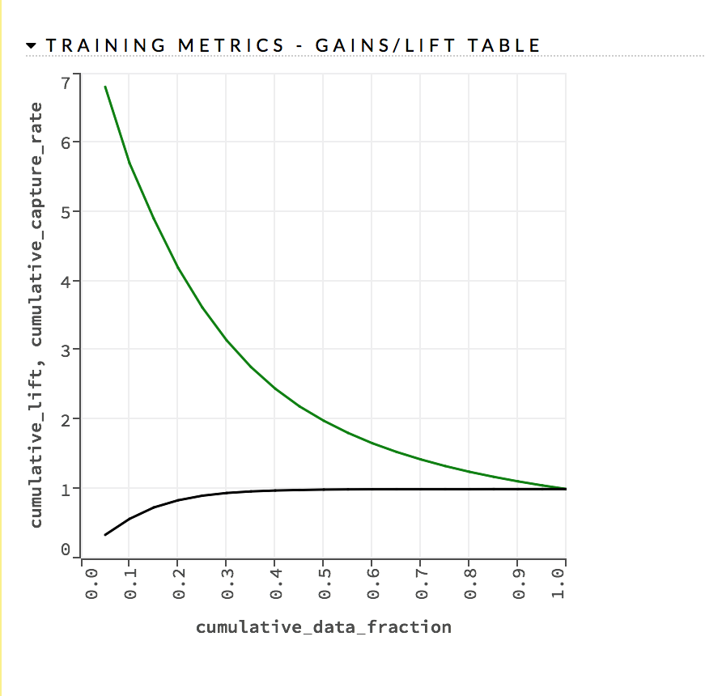
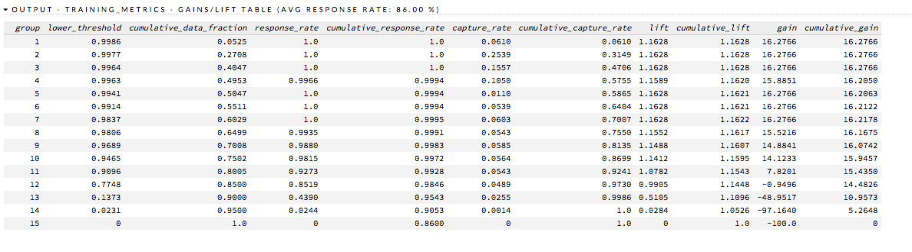

# Gains/Lift Table

>**Note**: This topic is no longer being maintained. Refer to [Interpreting the Gains/Lift Chart](https://github.com/h2oai/h2o-3/blob/master/h2o-docs/src/product/flow.rst#interpreting-the-gains-lift-chart) for the most up-to-date documentation.

The Gains/Lift table evaluates the prediction ability of a binary classification model. The accuracy of the classification model for a random sample is evaluated according to the results when the model is and is not used.

The Gains/Lift Table is particularly useful for direct marketing applications, for example. The gains/lift chart shows the effectiveness of the current model(s) compared to a baseline, allowing users to quickly identify the most useful model.

By default, H2O reports the Gains/Lift table for all binary classification models, except for GLM, which requires an explicit predict call on the dataset. 

The Gains/Lift table is computed using the prediction probability and the true response (class) labels. 

To create a Gains/Lift table, H2O applies the model to the original dataset to find the response probability. 

The data is divided into groups by quantile thresholds of the response probability. The default number of groups is 20; if there are fewer than 20 unique probability values, then the number of groups is reduced to the number of unique quantile thresholds. 

For each group, the lift is calculated as the proportion of observations that are events (targets) in the group to the overall proportion of events (targets). 

For binning, H2O computes exact ventiles (weighted cases are in development). `h2o.quantile(x, probs=seq(0,1,0.05))` is used for cut points, similar to R's `quantile()` method. 

The Gains/Lift table also reports for each group the threshold probability value, cumulative data fractions, response rates (proportion of observations that are events in a group), cumulative response rate, event capture rate, cumulative capture rate, gain (difference in percentages between the overall proportion of events and the observed proportion of observations that are events in the group), and cumulative gain. 

During the Gains/Lift calculations, all rows containing missing values (NAs) in either the label (response) or the prediction probability are ignored. 

## Requirements:

- The training frame dataset must contain actual binary class labels.
- The prediction column used as the response must contain probabilities.
- For GLM, the visualization displays only when using `nfolds` (for example, `nfolds=2`).
- The model type cannot be K-means or PCA.

## Creating a Gains/Lift table

1. Import a binary classification dataset. 
2. Select the model type (DL, DRF, GBM, GLM, or Naive Bayes)
3. Select the imported dataset from the drop-down *training_frame* list. 
4. Select a binomial column from the drop-down *response_column* list. 
5. Click the **Build Model** button, then click the **View** button after the model is complete. 
6. Scroll down to view the Gains/Lift chart (as shown in the example screenshot below). 

  

A table that lists the following values is also provided: 

  - lower threshold
  - cumulative data fraction
  - response rate
  - cumulative response rate
  - capture rate
  - cumulative capture rate
  - lift
  - cumulative lift
  - gain 
  - cumulative gain

  

The quantiles column defines the group for the row. The response rate column lists the likelihood of response, the lift column lists the lift rate, and the cumulative lift column provides the percentage of increase in response based on the lift.

All rows containing NA values in either the label (response) or the prediction probability are ignored. 

