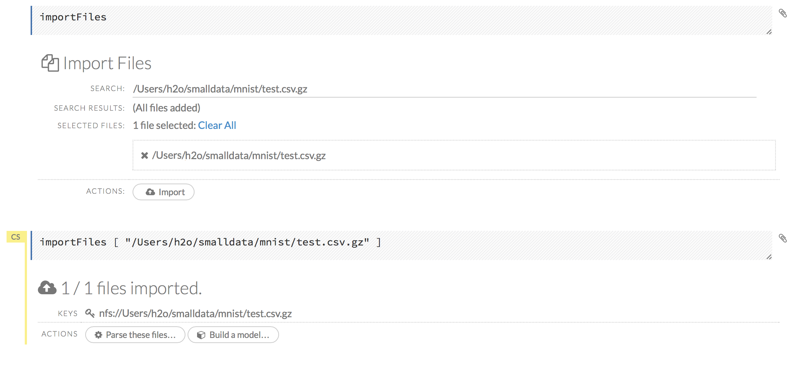
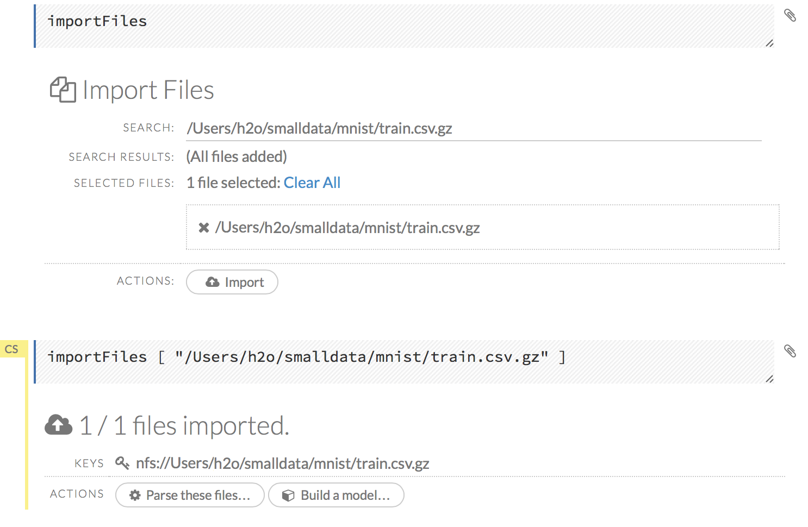
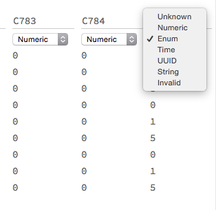
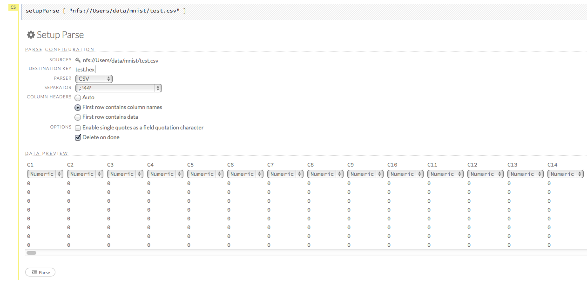
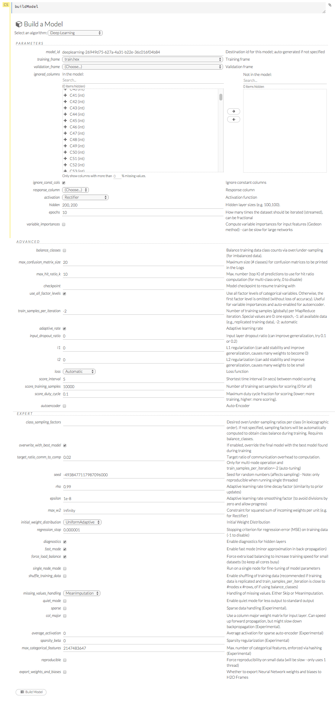
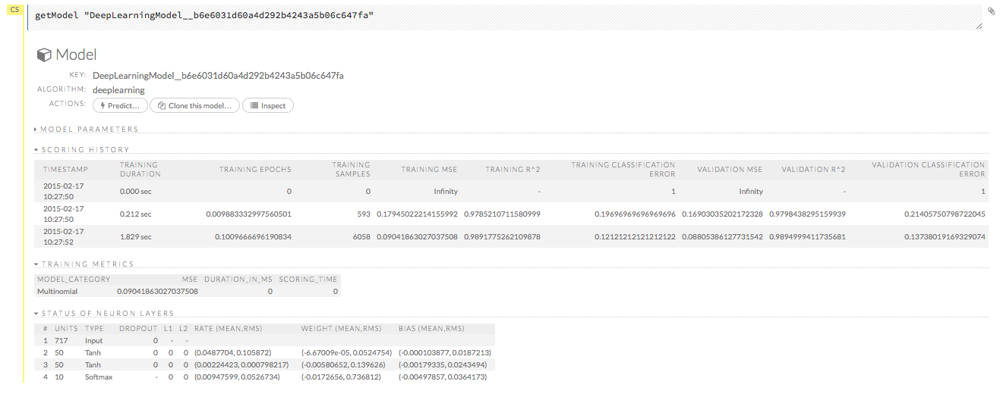
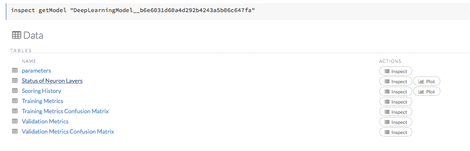
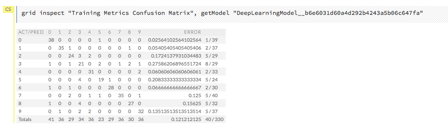

#Deep Learning Tutorial

The purpose of this tutorial is to walk new users through Deep Learning using H2O Flow. 

Those who have never used H2O before should refer to <a href="https://github.com/h2oai/h2o-dev/blob/master/h2o-docs/src/product/flow/README.md" target="_blank">Getting Started</a> for additional instructions on how to run H2O Flow.

For tips on improving the performance and results of your Deep Learning model, refer to our <a href="http://h2o.ai/blog/2015/02/deep-learning-performance/" target="_blank">Definintive Performance Tuning Guide for Deep Learning</a>.

###Using Deep Learning

H2O’s Deep Learning functionalities include:

- purely supervised training protocol for regression and classification tasks
- fast and memory-efficient Java implementations based on columnar compression and fine-grain Map/Reduce
- multi-threaded and distributed parallel computation to be run on either a single node or a multi-node cluster
- fully automatic per-neuron adaptive learning rate for fast convergence
- optional specification of learning rate, annealing and momentum options
- regularization options include L1, L2, dropout, Hogwild! and model averaging to prevent model overfitting
- elegant web interface or fully scriptable R API from H2O CRAN package
- grid search for hyperparameter optimization and model selection
- model checkpointing for reduced run times and model tuning
- automatic data pre and post-processing for categorical and numerical data
- automatic imputation of missing values
- automatic tuning of communication vs computation for best performance
- model export in plain java code for deployment in production environments
- additional expert parameters for model tuning
- deep autoencoders for unsupervised feature learning and anomaly detection capabilities 

### Getting Started
This tutorial uses the publicly available <a href="http://yann.lecun.com/exdb/mnist/" target="_blank"> MNIST</a> data set of hand-written digits, where each row contains the 28^(2)=784 raw gray-scale pixel values from 0 to 255 of the digitized digits (0 to 9). 

If you don't have any data of your own to work with, you can find some example datasets here: 

- <a href="http://docs.h2o.ai/h2oclassic/resources/publicdata.html"  target="_blank">http://docs.h2o.ai/h2oclassic/resources/publicdata.html </a>
- <a href="http://data.h2o.ai" target="_blank">http://data.h2o.ai</a>

####Importing Data
Before creating a model, import the data into H2O:

0. Click the **Assist Me!** button (the last button in the row of buttons below the menus). 

 

0. Click the **importFiles** link and enter the file path to the training dataset in the **Search** entry field. 

  

0. Click the **Add all** link to add the file to the import queue, then click the **Import** button. 

  

####Parsing Data

Now, parse the imported data: 

0. Click the **Parse these files...** button. 
>**Note**: The default options typically do not need to be changed unless the data does not parse correctly. 
0. From the drop-down **Parser** list, select the file type of the data set (Auto, XLS, CSV, or SVMLight). 
0. If the data uses a separator, select it from the drop-down **Separator** list. 
0. If the data uses a column header as the first row, select the **First row contains column names** radio button. If the first row contains data, select the **First row contains data** radio button. You can also select the **Auto** radio button to have H2O automatically determine if the first row of the dataset contains the column names or data. 
0. If the data uses apostrophes ( `'` - also known as single quotes), check the **Enable single quotes as a field quotation character** checkbox. 
0. To delete the imported dataset after the parse is complete, check the **Delete on done** checkbox. 

  >**NOTE**: In general, we recommend enabling this option. Retaining data requires memory resources, but does not aid in modeling because unparsed data cannot be used by H2O.

0. Review the data in the **Edit Column Names and Types** section. The last column, `C785`, must be changed to an enum for a classification model. 
0. Enter `C785` in the *Search by column name* entry field at the top. 
0. Click the drop-down column heading menu for C785 and select `Enum`.  
   
    

0. Click the **Parse** button.  

  
  
  >**NOTE**: Make sure the parse is complete by confirming progress is 100% before continuing to the next step, model building. For small datasets, this should only take a few seconds, but larger datasets take longer to parse.

##Building a Model

0. Once data are parsed, click the **View** button, then click the **Build Model** button. 
0. Select `Deep Learning` from the drop-down **Select an algorithm** menu, then click the **Build model** button. 
0. If the parsed training data is not already listed in the **Training_frame** drop-down list, select it. 

  >**Note**: If the **Ignore\_const\_col** checkbox is checked, a list of the excluded columns displays below the **Training_frame** drop-down list. 

0. From the drop-down **Validation_frame** list, select the parsed testing (validation) data. 
0. From the **Ignored_columns** section, select the columns to ignore in the *Available* area to move them to the *Selected* area. For this example, do not select any columns. 
0. From the drop-down **Response** list, select the last column (`C785`). 
0. From the drop-down **Activation** list, select the activation function (for this example, select `Tanh`). 
0. In the **Hidden** field, specify the hidden layer sizes (for this example, enter `50,50`). 
0. In the **Epochs** field, enter the number of times to iterate the dataset (for this example, enter `0.1`). 
0. Click the **Build Model** button.

  

##Results

 To view the results, click the **View** button. The output for the Deep Learning model includes the following information for both the training and testing sets:
 
- Model parameters (hidden)
- A chart of the variable importances
- A graph of the scoring history (training MSE and validation MSE vs epochs)
- Training and validation metrics confusion matrix
- Output (model category, weights, biases)
- Status of neuron layers (layer number, units, type, dropout, L1, L2, mean rate, rate RMS, momentum, mean weight, weight RMS, mean bias, bias RMS)
- Scoring history in tabular format
- Training and validation metrics (model name, model checksum name, frame name, frame checksum name, description, model category, duration in ms, scoring time, predictions, MSE, R2, logloss)
- Top-10 Hit Ratios for training and validation
- Preview POJO
  
   
   
 For more details, click the **Inspect** button. 
 
  
  
 
Select the appropriate link to view details for: 
 
- Parameters
- Output
- Neuron layer status
- Scoring history
- Training metrics
- Training metrics - Top-10 Hit Ratios
- Training metrics confusion matrix
- Validation metrics
- Validation metrics confusion matrix
- Variable importances

The scoring history graph, training metrics confusion matrix, and validation metrics confusion matrix are shown below. 

   
